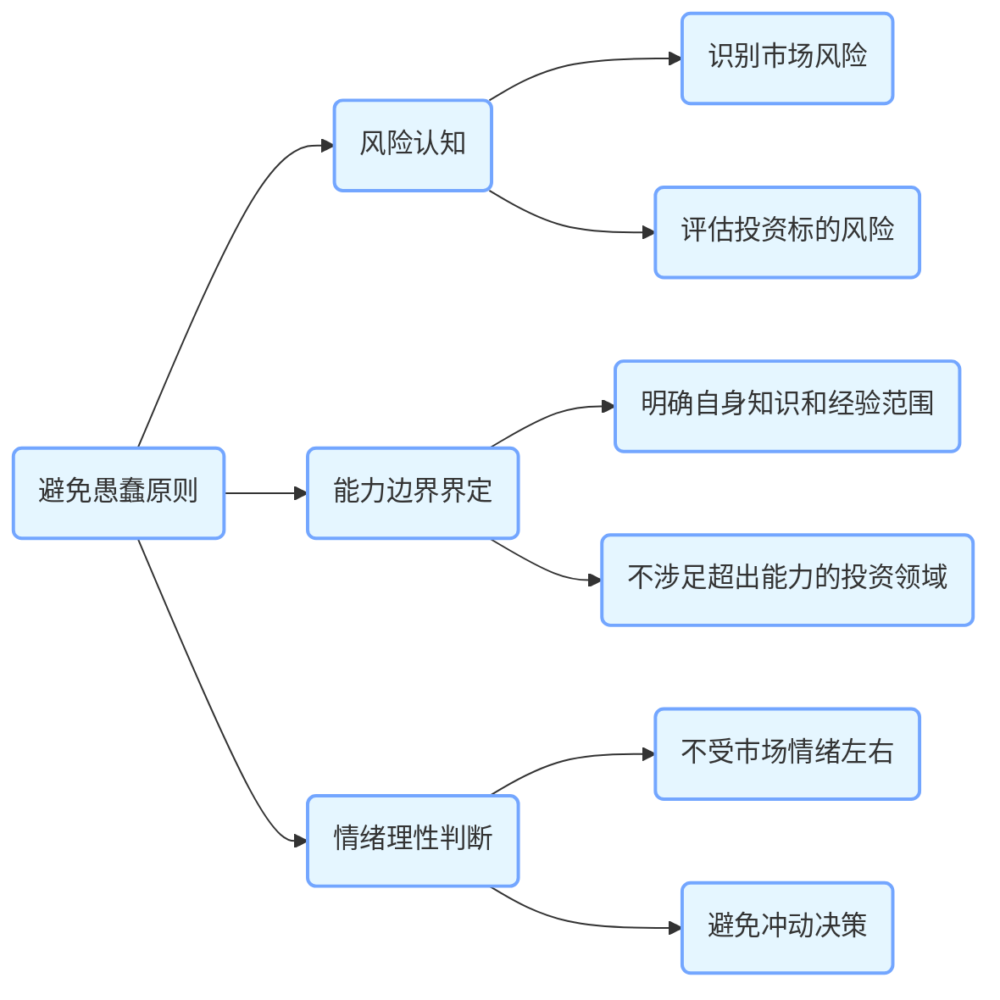

# 芒格的"避免愚蠢"原则：明智投资的基础

> 关键词：芒格、避免愚蠢原则、明智投资、投资理念、风险控制

> 摘要：本文深入探讨了芒格的“避免愚蠢”原则在明智投资中的重要地位。首先介绍了该原则提出的背景和适用范围，明确预期读者群体。接着阐述了核心概念及联系，通过流程图清晰展示其内在逻辑。详细讲解了核心算法原理，并结合 Python 代码进行说明，同时给出了相关数学模型和公式。在项目实战部分，以实际案例展示如何运用该原则进行投资操作。还探讨了该原则的实际应用场景，推荐了学习资源、开发工具框架以及相关论文著作。最后总结了未来投资领域的发展趋势与挑战，并对常见问题进行了解答。

## 1. 背景介绍 
### 1.1 目的和范围
查理·芒格是投资界的传奇人物，他与沃伦·巴菲特共同创造了伯克希尔·哈撒韦的辉煌业绩。芒格提出的“避免愚蠢”原则是其投资理念的重要基石。本文的目的在于深入剖析这一原则，探讨其在明智投资中的具体应用和重要意义。范围涵盖该原则的核心概念、算法原理、数学模型，以及通过实际案例展示如何在投资项目中运用这一原则，同时分析其在不同投资场景中的应用情况。

### 1.2 预期读者
本文预期读者包括对投资领域感兴趣的初学者，希望通过学习芒格的投资理念来建立正确的投资思维；有一定投资经验的投资者，希望从芒格的原则中获取新的灵感和方法，优化自己的投资策略；金融专业的学生和研究人员，可将其作为研究投资理论和实践的参考资料。

### 1.3 文档结构概述
本文将按照以下结构展开：首先介绍相关背景信息，包括目的、预期读者和文档结构等。接着阐述核心概念与联系，用示意图和流程图展示“避免愚蠢”原则的内在逻辑。然后讲解核心算法原理和具体操作步骤，并结合 Python 代码进行说明。之后给出数学模型和公式，通过举例加深理解。在项目实战部分，详细介绍开发环境搭建、源代码实现和代码解读。再探讨实际应用场景，推荐相关学习资源、开发工具框架和论文著作。最后总结未来发展趋势与挑战，解答常见问题，并提供扩展阅读和参考资料。

### 1.4 术语表
#### 1.4.1 核心术语定义
- **避免愚蠢原则**：指在投资过程中，通过识别和避免可能导致重大损失的愚蠢行为，如过度投机、盲目跟风、忽视风险等，以实现长期稳定的投资回报。
- **明智投资**：基于理性分析、充分研究和风险控制，做出符合自身投资目标和风险承受能力的投资决策。
- **风险控制**：通过各种方法和手段，对投资过程中可能面临的风险进行识别、评估和管理，以降低损失的可能性和程度。

#### 1.4.2 相关概念解释
- **投资组合**：由多种不同的投资资产组成的集合，旨在通过分散投资降低风险。
- **价值投资**：一种投资策略，强调寻找被低估的资产，并长期持有，以获取资产价值回归带来的收益。
- **市场情绪**：投资者对市场的整体看法和情绪状态，会影响市场的波动和资产价格。

#### 1.4.3 缩略词列表
- **ROI**：Return on Investment，投资回报率
- **PE**：Price-to-Earnings Ratio，市盈率
- **PB**：Price-to-Book Ratio，市净率

## 2. 核心概念与联系 
芒格的“避免愚蠢”原则核心在于通过识别和避免常见的投资错误，从而提高投资成功的概率。其核心概念包括对投资风险的认知、对自身能力边界的界定以及对市场情绪的理性判断。

### 核心概念原理
投资者在市场中面临着各种诱惑和不确定性，容易受到情绪和短期利益的影响而做出错误的决策。“避免愚蠢”原则要求投资者保持理性和冷静，不盲目跟风，不参与自己不了解的投资活动。例如，在市场过热时，不被高涨的情绪所带动而追高买入；在市场低迷时，不被恐慌情绪所左右而盲目卖出。

### 架构的文本示意图
```plaintext
避免愚蠢原则
|
|-- 风险认知
|   |-- 识别市场风险
|   |-- 评估投资标的风险
|
|-- 能力边界界定
|   |-- 明确自身知识和经验范围
|   |-- 不涉足超出能力的投资领域
|
|-- 情绪理性判断
|   |-- 不受市场情绪左右
|   |-- 避免冲动决策
```

### Mermaid 流程图


从流程图可以看出，“避免愚蠢”原则由风险认知、能力边界界定和情绪理性判断三个主要部分构成。每个部分又包含具体的子步骤，这些步骤相互关联，共同构成了一个完整的投资决策体系。通过遵循这些步骤，投资者可以有效避免常见的投资错误，提高投资的成功率。

## 3. 核心算法原理 & 具体操作步骤 
### 核心算法原理
“避免愚蠢”原则的核心算法原理可以理解为一个风险过滤和决策优化的过程。其基本思路是通过对投资信息的收集和分析，识别可能存在的风险因素，然后根据自身的能力边界和风险承受能力，对投资方案进行筛选和调整，最终做出明智的投资决策。

### 具体操作步骤
1. **信息收集**：收集市场信息、行业动态、公司财务报表等相关数据。可以通过财经新闻、专业研究报告、公司官网等渠道获取信息。
2. **风险识别**：对收集到的信息进行分析，识别可能存在的风险因素，如市场风险、行业竞争风险、公司经营风险等。可以使用财务比率分析、行业趋势分析等方法进行风险评估。
3. **能力评估**：评估自己对投资领域的了解程度和专业知识，明确自己的能力边界。对于超出自己能力范围的投资项目，要谨慎对待。
4. **情绪管理**：保持理性和冷静，不受市场情绪的影响。在市场波动时，避免冲动决策，要根据自己的投资策略和风险承受能力做出判断。
5. **决策优化**：根据风险识别和能力评估的结果，对投资方案进行优化。可以通过调整投资组合、选择更合适的投资标的等方式降低风险，提高投资回报率。

### Python 代码示例
```python
import pandas as pd

# 模拟收集的市场信息和公司财务数据
market_info = pd.DataFrame({
    'market_index': [100, 102, 105, 103, 106],
    'industry_growth_rate': [0.05, 0.06, 0.07, 0.06, 0.08]
})

company_financials = pd.DataFrame({
    'revenue': [1000, 1200, 1300, 1400, 1500],
    'profit': [100, 120, 130, 140, 150],
    'debt_ratio': [0.3, 0.32, 0.35, 0.33, 0.36]
})

# 风险识别：计算市场风险和公司经营风险
market_risk = market_info['market_index'].std()
company_operating_risk = company_financials['debt_ratio'].mean()

# 能力评估：假设自己对市场的了解程度为 80%
ability_level = 0.8

# 情绪管理：假设市场情绪波动较大，设置情绪稳定系数为 0.7
emotion_stability = 0.7

# 决策优化：根据风险和能力评估结果，调整投资决策
if market_risk > 5 and company_operating_risk > 0.35 and ability_level < 0.8 and emotion_stability < 0.8:
    print("当前投资风险较高，建议谨慎投资或调整投资组合。")
else:
    print("可以考虑进行投资，但仍需密切关注市场变化。")
```
在上述代码中，我们首先模拟了市场信息和公司财务数据。然后通过计算市场指数的标准差和公司债务比率的平均值来识别市场风险和公司经营风险。接着设置了能力评估和情绪管理的参数。最后根据风险和能力评估结果，输出相应的投资决策建议。

## 4. 数学模型和公式 & 详细讲解 & 举例说明 
### 数学模型
“避免愚蠢”原则可以用一个简单的数学模型来表示：

$$
Investment\ Decision = f(Risk, Ability, Emotion)
$$

其中，$Investment\ Decision$ 表示投资决策，$Risk$ 表示投资风险，$Ability$ 表示投资者的能力水平，$Emotion$ 表示投资者的情绪状态。函数 $f$ 表示投资决策的生成规则，它根据风险、能力和情绪的综合评估结果来确定最终的投资决策。

### 公式详细讲解
- **投资风险评估公式**：
    - 市场风险可以用市场指数的波动率来衡量，公式为：
    $$
    Market\ Risk = \sigma_{market} = \sqrt{\frac{1}{n}\sum_{i = 1}^{n}(x_i - \bar{x})^2}
    $$
    其中，$x_i$ 表示第 $i$ 期的市场指数，$\bar{x}$ 表示市场指数的平均值，$n$ 表示样本数量。
    - 公司经营风险可以用公司的财务指标来衡量，如债务比率、资产负债率等。债务比率的计算公式为：
    $$
    Debt\ Ratio = \frac{Total\ Debt}{Total\ Assets}
    $$

- **能力评估公式**：
    投资者的能力水平可以用一个综合指标来表示，例如投资者对投资领域的了解程度、投资经验等。假设用 $Ability\ Score$ 表示投资者的能力得分，其计算公式为：
    $$
    Ability\ Score = \sum_{i = 1}^{m} w_i \times s_i
    $$
    其中，$w_i$ 表示第 $i$ 个能力指标的权重，$s_i$ 表示第 $i$ 个能力指标的得分，$m$ 表示能力指标的数量。

- **情绪评估公式**：
    投资者的情绪状态可以用情绪稳定系数来表示，取值范围为 $[0, 1]$。情绪稳定系数越高，说明投资者越能保持理性和冷静。情绪稳定系数可以通过投资者的交易行为、持仓时间等因素来综合评估。

### 举例说明
假设我们要评估一只股票的投资风险。首先，我们收集了该股票所在市场指数过去 10 期的数据：$[100, 102, 105, 103, 106, 108, 107, 109, 110, 112]$。计算市场风险：
1. 计算市场指数的平均值：
    $$
    \bar{x} = \frac{100 + 102 + 105 + 103 + 106 + 108 + 107 + 109 + 110 + 112}{10} = 106.2
    $$
2. 计算市场风险：
    $$
    \sigma_{market} = \sqrt{\frac{(100 - 106.2)^2 + (102 - 106.2)^2 + \cdots + (112 - 106.2)^2}{10}} \approx 3.2
    $$

假设该股票所属公司的总债务为 5000 万元，总资产为 10000 万元，则债务比率为：
$$
Debt\ Ratio = \frac{5000}{10000} = 0.5
$$

假设投资者对该行业的了解程度得分为 80 分（满分 100 分），投资经验得分为 70 分，且两个指标的权重分别为 0.6 和 0.4，则投资者的能力得分：
$$
Ability\ Score = 0.6 \times 80 + 0.4 \times 70 = 76
$$

假设通过分析投资者的交易行为和持仓时间，评估其情绪稳定系数为 0.8。

综合以上信息，我们可以根据投资决策模型来判断是否适合投资该股票。如果市场风险过高、公司经营风险较大、投资者能力不足或情绪不稳定，那么就需要谨慎考虑投资决策。

## 5. 项目实战：代码实际案例和详细解释说明 
### 5.1 开发环境搭建
在进行投资项目实战时，我们可以使用 Python 作为开发语言，并结合一些常用的数据分析和可视化库。以下是搭建开发环境的步骤：
1. **安装 Python**：从 Python 官方网站（https://www.python.org/downloads/）下载并安装 Python 3.x 版本。
2. **安装必要的库**：使用 pip 命令安装以下库：
    - `pandas`：用于数据处理和分析。
    - `numpy`：用于数值计算。
    - `matplotlib`：用于数据可视化。
    - `yfinance`：用于获取金融市场数据。

可以使用以下命令进行安装：
```sh
pip install pandas numpy matplotlib yfinance
```

### 5.2 源代码详细实现和代码解读
```python
import yfinance as yf
import pandas as pd
import matplotlib.pyplot as plt

# 定义投资标的
ticker = 'AAPL'

# 获取历史数据
data = yf.download(ticker, start='2020-01-01', end='2023-01-01')

# 计算简单收益率
data['Returns'] = data['Close'].pct_change()

# 风险识别：计算收益率的标准差作为风险指标
risk = data['Returns'].std()

# 能力评估：假设投资者对该股票的了解程度为 80%
ability_level = 0.8

# 情绪管理：假设市场情绪波动较大，设置情绪稳定系数为 0.7

# 决策优化：根据风险和能力评估结果，调整投资决策
if risk > 0.02 and ability_level < 0.8:
    print("当前投资风险较高，建议谨慎投资或调整投资组合。")
else:
    print("可以考虑进行投资，但仍需密切关注市场变化。")

# 数据可视化
plt.figure(figsize=(12, 6))
plt.plot(data['Close'], label='Close Price')
plt.title(f'{ticker} Stock Price')
plt.xlabel('Date')
plt.ylabel('Price')
plt.legend()
plt.show()
```
### 代码解读与分析
1. **数据获取**：使用 `yfinance` 库下载苹果公司（股票代码：AAPL）从 2020 年 1 月 1 日到 2023 年 1 月 1 日的历史数据。
2. **收益率计算**：通过 `pct_change()` 方法计算每日收盘价的简单收益率，并将结果存储在 `Returns` 列中。
3. **风险识别**：计算收益率的标准差作为风险指标。标准差越大，说明股票价格的波动越大，投资风险越高。
4. **能力评估**：假设投资者对该股票的了解程度为 80%，用 `ability_level` 变量表示。
5. **情绪管理**：假设市场情绪波动较大，设置情绪稳定系数为 0.7。
6. **决策优化**：根据风险和能力评估结果，判断是否适合投资。如果风险超过 0.02 且投资者对该股票的了解程度低于 80%，则建议谨慎投资或调整投资组合。
7. **数据可视化**：使用 `matplotlib` 库绘制苹果公司股票的收盘价走势图，方便直观地观察股票价格的变化趋势。

## 6. 实际应用场景 
### 股票投资
在股票投资中，“避免愚蠢”原则可以帮助投资者避免盲目跟风买入热门股票。例如，在某只股票因短期利好消息而大幅上涨时，很多投资者会受到市场情绪的影响而追高买入。但遵循“避免愚蠢”原则的投资者会冷静分析该股票的基本面，评估其估值是否合理，是否存在潜在风险。如果发现该股票的市盈率过高，且公司的业绩增长并不足以支撑其高股价，那么投资者就会避免买入，从而避免了可能的损失。

### 基金投资
在选择基金时，投资者往往会被一些短期业绩表现出色的基金所吸引。然而，短期业绩可能受到多种因素的影响，并不一定能代表基金的长期投资能力。遵循“避免愚蠢”原则的投资者会综合考虑基金的投资策略、基金经理的经验和业绩稳定性、基金的费用等因素。例如，一些基金可能通过高风险的投资策略在短期内获得了高额回报，但这种策略并不具有可持续性。投资者会避免选择这类基金，而是选择那些投资策略稳健、长期业绩优秀的基金。

### 房地产投资
在房地产投资中，市场过热时往往会出现房价虚高的情况。一些投资者会受到周围人的影响，盲目跟风购房，而不考虑自身的经济实力和房地产市场的实际供需情况。遵循“避免愚蠢”原则的投资者会对房地产市场进行深入研究，分析房价走势、租金回报率等因素。如果发现房价已经超出了合理范围，且租金回报率较低，那么投资者就会避免在此时购房，等待市场回调后再进行投资。

### 创业投资
在创业投资领域，很多投资者会被一些热门的创业项目所吸引，而忽略了项目的实际可行性和风险。遵循“避免愚蠢”原则的投资者会对创业项目进行全面的尽职调查，包括市场需求、商业模式、团队能力等方面。例如，一些创业项目虽然概念新颖，但市场需求并不明确，或者团队缺乏相关的经验和能力。投资者会避免投资这类项目，以降低投资失败的风险。

## 7. 工具和资源推荐
### 7.1 学习资源推荐
#### 7.1.1 书籍推荐
- 《穷查理宝典：查理·芒格的智慧箴言录》：这本书全面收录了芒格的演讲、文章和思想，是了解芒格投资理念和“避免愚蠢”原则的必读之书。
- 《聪明的投资者》：作者本杰明·格雷厄姆是价值投资的鼻祖，这本书是价值投资领域的经典著作，对投资者建立正确的投资思维和方法具有重要的指导意义。
- 《巴菲特致股东的信：投资者和公司高管教程》：通过巴菲特历年致股东的信，读者可以深入了解巴菲特和芒格的投资策略和理念，学习如何进行长期价值投资。

#### 7.1.2 在线课程
- Coursera 上的“投资学原理”：该课程由知名高校的教授授课，系统介绍了投资学的基本原理和方法，包括资产定价、投资组合理论等内容。
- 网易云课堂上的“价值投资实战课程”：课程结合实际案例，讲解了价值投资的核心要点和分析方法，适合想要学习价值投资的投资者。

#### 7.1.3 技术博客和网站
- 雪球网：是国内知名的投资社区，汇聚了众多投资者和投资专家，提供股票、基金等投资领域的资讯、分析和讨论。
- Seeking Alpha：是国外知名的金融分析网站，提供全球金融市场的分析报告、投资策略和公司研究等内容。

### 7.2 开发工具框架推荐
#### 7.2.1 IDE和编辑器
- PyCharm：是一款专业的 Python 集成开发环境，具有代码编辑、调试、版本控制等功能，适合开发 Python 投资分析程序。
- Jupyter Notebook：是一个交互式的开发环境，支持 Python、R 等多种编程语言，方便进行数据探索、分析和可视化。

#### 7.2.2 调试和性能分析工具
- `pdb`：是 Python 内置的调试器，可以帮助开发者定位代码中的错误和问题。
- `cProfile`：是 Python 标准库中的性能分析工具，可以分析代码的运行时间和函数调用情况，帮助优化代码性能。

#### 7.2.3 相关框架和库
- `pandas`：是 Python 中用于数据处理和分析的强大库，提供了高效的数据结构和数据分析工具。
- `numpy`：是 Python 中用于数值计算的基础库，提供了多维数组对象和各种数学函数。
- `scikit-learn`：是 Python 中用于机器学习的库，提供了各种机器学习算法和工具，可用于投资风险预测和投资组合优化等方面。

### 7.3 相关论文著作推荐
#### 7.3.1 经典论文
- 《证券分析》（Security Analysis）：本杰明·格雷厄姆和戴维·多德的经典著作，奠定了价值投资的理论基础。
- 《资本资产定价模型：市场均衡的理论和实证》（Capital Asset Pricing Model: Theory and Empirical Evidence of Market Equilibrium）：威廉·夏普提出的资本资产定价模型（CAPM）是现代金融理论的重要基石之一。

#### 7.3.2 最新研究成果
- 关注《金融研究》《经济研究》等国内顶级金融学术期刊，以及 Journal of Finance、Review of Financial Studies 等国际知名金融学术期刊，获取最新的投资理论和实证研究成果。

#### 7.3.3 应用案例分析
- 一些知名投资机构和研究机构会发布投资案例分析报告，如麦肯锡、波士顿咨询集团等。这些报告可以帮助投资者了解实际投资项目中的决策过程和风险控制方法。

## 8. 总结：未来发展趋势与挑战
### 未来发展趋势
- **数字化和智能化投资**：随着科技的不断发展，数字化和智能化投资将成为未来的发展趋势。投资者可以利用大数据、人工智能等技术进行投资分析和决策，提高投资效率和准确性。例如，通过机器学习算法对海量的市场数据进行分析，挖掘投资机会和风险因素。
- **可持续投资**：越来越多的投资者开始关注企业的社会责任和可持续发展能力，可持续投资将成为未来投资的重要方向。投资者会更加倾向于投资那些在环境保护、社会责任和公司治理方面表现优秀的企业。
- **全球化投资**：随着全球经济一体化的加深，投资者将有更多的机会参与全球市场的投资。跨国投资和多元化投资将成为趋势，投资者可以通过投资不同国家和地区的资产来分散风险，提高投资回报。

### 挑战
- **技术风险**：数字化和智能化投资依赖于先进的技术和算法，但这些技术和算法也存在一定的风险。例如，机器学习模型可能存在过拟合、数据偏差等问题，导致投资决策出现失误。
- **市场不确定性**：全球经济和政治环境的不确定性增加，市场波动加剧。投资者需要面对更多的风险和挑战，如贸易摩擦、汇率波动、地缘政治风险等。
- **信息过载**：在信息爆炸的时代，投资者面临着海量的信息。如何从众多的信息中筛选出有价值的信息，并进行准确的分析和判断，是投资者需要面对的挑战之一。

## 9. 附录：常见问题与解答
### 问题 1：如何判断自己是否超出了能力边界？
解答：可以从以下几个方面进行判断：首先，评估自己对投资领域的专业知识和了解程度。如果对某个投资领域的基本概念、行业规则和分析方法都不熟悉，那么可能超出了自己的能力边界。其次，回顾自己以往的投资经验。如果在某个投资领域的投资业绩不佳，且多次出现错误决策，那么也可能表明该领域超出了自己的能力范围。此外，还可以向专业人士咨询，听取他们的意见和建议。

### 问题 2：如何管理自己的投资情绪？
解答：管理投资情绪可以从以下几个方面入手：一是建立明确的投资目标和策略，并严格按照策略执行。这样可以避免因市场波动而盲目改变投资决策。二是保持冷静和理性，不被市场情绪所左右。在市场上涨时，不盲目追高；在市场下跌时，不恐慌抛售。三是进行自我心理调节，通过运动、阅读等方式缓解压力和焦虑情绪。四是定期回顾和总结投资经验，不断提高自己的投资心理素质。

### 问题 3：“避免愚蠢”原则是否意味着不承担任何风险？
解答：不是的。“避免愚蠢”原则并不是要投资者完全不承担风险，而是要避免因盲目决策和冲动行为而承担不必要的风险。投资本身就存在一定的风险，投资者需要在风险和回报之间进行权衡。遵循“避免愚蠢”原则，投资者可以通过合理的风险评估和控制，选择适合自己风险承受能力的投资项目，从而在承担一定风险的前提下获得合理的投资回报。

## 10. 扩展阅读 & 参考资料
### 扩展阅读
- 《金融炼金术》：乔治·索罗斯的著作，探讨了金融市场的运行规律和投资者的心理行为。
- 《漫步华尔街》：伯顿·马尔基尔的经典投资书籍，介绍了各种投资策略和方法，以及如何构建合理的投资组合。

### 参考资料
- 《穷查理宝典：查理·芒格的智慧箴言录》，查理·芒格著
- 《聪明的投资者》，本杰明·格雷厄姆著
- 《巴菲特致股东的信：投资者和公司高管教程》，沃伦·巴菲特著
- 各大财经网站和金融学术期刊的相关文章和研究报告

作者：AI天才研究院/AI Genius Institute & 禅与计算机程序设计艺术 /Zen And The Art of Computer Programming