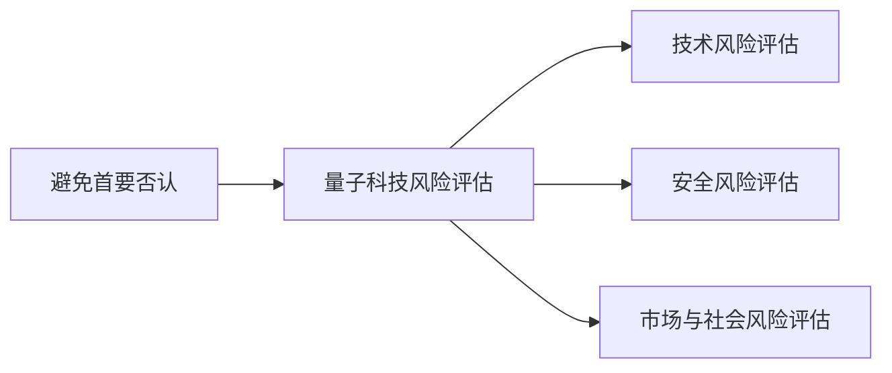

# 芒格的"避免首要否认"在量子科技风险评估中的重要性

> 关键词：芒格、避免首要否认、量子科技、风险评估、决策

> 摘要：本文深入探讨了芒格提出的“避免首要否认”原则在量子科技风险评估中的重要性。首先介绍了文章的背景信息，包括目的、预期读者、文档结构和相关术语。接着阐述了“避免首要否认”和量子科技风险评估的核心概念及其联系。通过核心算法原理和具体操作步骤，结合数学模型和公式，展示了该原则在风险评估中的应用。在项目实战部分，给出代码实际案例并详细解释。然后分析了该原则在量子科技领域的实际应用场景，推荐了相关的学习资源、开发工具和论文著作。最后总结了未来发展趋势与挑战，提供了常见问题解答和扩展阅读参考资料，旨在帮助读者全面理解“避免首要否认”原则对量子科技风险评估的关键作用。

## 1. 背景介绍 
### 1.1 目的和范围
本文章的主要目的是探究芒格所倡导的“避免首要否认”原则在量子科技风险评估过程中的重要意义。随着量子科技的迅猛发展，其蕴含的巨大潜力与复杂风险并存。准确评估这些风险对于科研机构、企业和政府部门做出合理决策至关重要。我们将深入剖析“避免首要否认”原则如何影响量子科技风险评估的准确性和有效性，以及如何在实际操作中应用这一原则。本文的范围涵盖了量子科技的多个方面，包括量子计算、量子通信、量子传感等领域的风险评估。

### 1.2 预期读者
本文预期读者主要包括量子科技领域的科研人员、工程师、项目管理者，他们需要在日常工作中对量子科技项目的风险进行评估和管理；同时也适合对投资量子科技相关产业感兴趣的金融从业者，他们需要了解潜在的风险因素以做出合理的投资决策；此外，关注科技发展动态的政策制定者也可以从本文中获取关于量子科技风险评估的重要信息，以便制定科学合理的政策。

### 1.3 文档结构概述
本文将按照以下结构展开：首先介绍核心概念，包括“避免首要否认”原则和量子科技风险评估的定义和联系；接着阐述核心算法原理和具体操作步骤，并通过Python代码详细说明；然后引入数学模型和公式，进一步解释其在风险评估中的应用；通过项目实战部分，给出实际代码案例并进行详细解读；分析该原则在量子科技中的实际应用场景；推荐相关的学习资源、开发工具和论文著作；最后总结未来发展趋势与挑战，提供常见问题解答和扩展阅读参考资料。

### 1.4 术语表
#### 1.4.1 核心术语定义
- **避免首要否认**：这是芒格提出的一种思维方式，指在面对新的信息或情况时，避免第一时间本能地拒绝或否定，而是以开放的心态去理解和分析。
- **量子科技**：基于量子力学原理发展起来的一系列前沿技术，主要包括量子计算、量子通信、量子传感等领域。
- **风险评估**：对某一事件或活动可能产生的风险进行识别、分析和评价的过程，以确定风险的性质、程度和可能性。

#### 1.4.2 相关概念解释
- **量子比特**：量子计算中的基本信息单位，与经典比特不同，它可以同时处于0和1的叠加态，这使得量子计算机在处理某些问题时具有巨大的优势。
- **量子纠缠**：量子系统中粒子之间的一种特殊关联现象，即使粒子之间相隔很远，它们的状态也会相互影响。这种现象在量子通信和量子计算中具有重要应用。

#### 1.4.3 缩略词列表
- **QC**：Quantum Computing，量子计算
- **QKD**：Quantum Key Distribution，量子密钥分发
- **QIP**：Quantum Information Processing，量子信息处理

## 2. 核心概念与联系 

### 核心概念原理
#### “避免首要否认”原理
“避免首要否认”是一种基于理性思考和开放心态的认知策略。当人们面对新的信息、观点或现象时，往往会受到固有观念、经验和情绪的影响，本能地产生拒绝或否定的反应。这种反应可能会阻碍我们对事物的深入理解和正确判断。芒格强调，我们应该克服这种本能，以客观、理性的态度去对待新的事物，充分考虑各种可能性，避免因过早的否定而错过重要的信息或机会。

#### 量子科技风险评估原理
量子科技风险评估是一个复杂的过程，旨在识别、分析和评价量子科技发展过程中可能面临的各种风险。这些风险包括技术风险（如量子比特的稳定性、量子算法的有效性等）、安全风险（如量子通信中的密钥泄露、量子计算对现有加密体系的威胁等）、市场风险（如量子科技产品的市场接受度、竞争态势等）和社会风险（如量子科技应用对就业、伦理等方面的影响）。评估过程通常需要综合考虑多个因素，运用多种方法和技术，以确保评估结果的准确性和可靠性。

### 架构的文本示意图
```plaintext
           避免首要否认
                |
                |  应用于
                v
    量子科技风险评估
    /          |          \
技术风险评估  安全风险评估  市场与社会风险评估
```

### Mermaid 流程图


## 3. 核心算法原理 & 具体操作步骤 

### 核心算法原理
在量子科技风险评估中，“避免首要否认”原则可以通过一种基于证据积累的算法来实现。该算法的核心思想是在评估过程中，不断收集和分析与风险相关的证据，而不是一开始就对某些风险因素进行否定。具体来说，我们可以为每个风险因素分配一个初始的置信度值，随着证据的不断积累，根据证据的强度和方向来调整置信度值。

### Python 代码实现
```python
# 定义风险因素类
class RiskFactor:
    def __init__(self, name, initial_confidence=0.5):
        self.name = name
        self.confidence = initial_confidence

    def update_confidence(self, evidence_strength):
        # 根据证据强度更新置信度
        if evidence_strength > 0:
            self.confidence = min(1, self.confidence + evidence_strength)
        else:
            self.confidence = max(0, self.confidence + evidence_strength)

# 定义风险评估类
class QuantumRiskAssessment:
    def __init__(self):
        self.risk_factors = []

    def add_risk_factor(self, risk_factor):
        self.risk_factors.append(risk_factor)

    def update_risks(self, evidence_dict):
        for factor in self.risk_factors:
            if factor.name in evidence_dict:
                factor.update_confidence(evidence_dict[factor.name])

    def get_risk_confidences(self):
        return {factor.name: factor.confidence for factor in self.risk_factors}

# 示例使用
if __name__ == "__main__":
    # 创建风险评估对象
    assessment = QuantumRiskAssessment()

    # 添加风险因素
    risk_factors = [
        RiskFactor("量子比特稳定性"),
        RiskFactor("量子算法有效性"),
        RiskFactor("量子通信安全")
    ]
    for factor in risk_factors:
        assessment.add_risk_factor(factor)

    # 模拟证据
    evidence = {
        "量子比特稳定性": 0.2,
        "量子算法有效性": -0.1,
        "量子通信安全": 0.1
    }

    # 更新风险置信度
    assessment.update_risks(evidence)

    # 输出结果
    print(assessment.get_risk_confidences())
```

### 具体操作步骤
1. **定义风险因素**：首先，识别量子科技项目中可能存在的各种风险因素，如上述代码中的量子比特稳定性、量子算法有效性和量子通信安全等。为每个风险因素创建一个`RiskFactor`对象，并为其分配一个初始的置信度值（通常设为0.5，表示中立态度）。
2. **创建风险评估对象**：创建一个`QuantumRiskAssessment`对象，用于管理所有的风险因素。
3. **添加风险因素到评估对象**：将定义好的风险因素添加到`QuantumRiskAssessment`对象中。
4. **收集和分析证据**：在项目进行过程中，不断收集与风险因素相关的证据。证据可以是实验数据、专家意见、市场调研结果等。为每个证据确定其强度和方向（正向或负向）。
5. **更新风险置信度**：根据收集到的证据，调用`update_risks`方法更新每个风险因素的置信度值。
6. **输出评估结果**：通过`get_risk_confidences`方法获取每个风险因素的当前置信度值，以便决策者参考。

## 4. 数学模型和公式 & 详细讲解 & 举例说明 

### 数学模型
在上述算法中，我们使用了一个简单的线性模型来更新风险因素的置信度。设 $C_t$ 表示第 $t$ 次更新后风险因素的置信度，$C_{t - 1}$ 表示上一次更新后的置信度，$E$ 表示本次收集到的证据强度，则更新公式为：

$$
C_t = 
\begin{cases}
\min(1, C_{t - 1} + E) & \text{if } E > 0 \\
\max(0, C_{t - 1} + E) & \text{if } E < 0
\end{cases}
$$

### 详细讲解
- 当证据强度 $E$ 为正时，表示该证据支持风险因素的存在，因此将置信度值增加 $E$。为了确保置信度值不超过1，我们取 $C_{t - 1} + E$ 和 1 中的较小值。
- 当证据强度 $E$ 为负时，表示该证据削弱了风险因素的存在可能性，因此将置信度值减少 $|E|$。为了确保置信度值不小于0，我们取 $C_{t - 1} + E$ 和 0 中的较大值。

### 举例说明
假设我们有一个风险因素“量子比特退相干风险”，初始置信度 $C_0 = 0.5$。在第一次更新时，我们收集到一个正向证据，证据强度 $E_1 = 0.2$。根据上述公式，更新后的置信度为：

$$
C_1 = \min(1, 0.5 + 0.2) = 0.7
$$

在第二次更新时，我们收集到一个负向证据，证据强度 $E_2 = -0.1$。则更新后的置信度为：

$$
C_2 = \max(0, 0.7 - 0.1) = 0.6
$$

通过不断地收集证据并更新置信度，我们可以更准确地评估该风险因素的可能性。

## 5. 项目实战：代码实际案例和详细解释说明 

### 5.1  开发环境搭建
#### 安装 Python
首先，确保你已经安装了 Python 环境。建议使用 Python 3.7 及以上版本。你可以从 Python 官方网站（https://www.python.org/downloads/）下载并安装适合你操作系统的 Python 版本。

#### 安装依赖库
上述代码仅使用了 Python 的内置库，无需额外安装其他依赖库。但如果你想对代码进行扩展或优化，可能需要安装一些第三方库，如`numpy`、`pandas`等。可以使用以下命令安装：
```sh
pip install numpy pandas
```

### 5.2  源代码详细实现和代码解读
```python
# 定义风险因素类
class RiskFactor:
    def __init__(self, name, initial_confidence=0.5):
        # 初始化风险因素的名称和初始置信度
        self.name = name
        self.confidence = initial_confidence

    def update_confidence(self, evidence_strength):
        # 根据证据强度更新置信度
        if evidence_strength > 0:
            # 如果证据为正向，增加置信度，但不超过1
            self.confidence = min(1, self.confidence + evidence_strength)
        else:
            # 如果证据为负向，减少置信度，但不低于0
            self.confidence = max(0, self.confidence + evidence_strength)

# 定义风险评估类
class QuantumRiskAssessment:
    def __init__(self):
        # 初始化一个空的风险因素列表
        self.risk_factors = []

    def add_risk_factor(self, risk_factor):
        # 将风险因素添加到列表中
        self.risk_factors.append(risk_factor)

    def update_risks(self, evidence_dict):
        # 根据证据字典更新所有风险因素的置信度
        for factor in self.risk_factors:
            if factor.name in evidence_dict:
                factor.update_confidence(evidence_dict[factor.name])

    def get_risk_confidences(self):
        # 返回所有风险因素的置信度字典
        return {factor.name: factor.confidence for factor in self.risk_factors}

# 示例使用
if __name__ == "__main__":
    # 创建风险评估对象
    assessment = QuantumRiskAssessment()

    # 添加风险因素
    risk_factors = [
        RiskFactor("量子比特稳定性"),
        RiskFactor("量子算法有效性"),
        RiskFactor("量子通信安全")
    ]
    for factor in risk_factors:
        assessment.add_risk_factor(factor)

    # 模拟证据
    evidence = {
        "量子比特稳定性": 0.2,
        "量子算法有效性": -0.1,
        "量子通信安全": 0.1
    }

    # 更新风险置信度
    assessment.update_risks(evidence)

    # 输出结果
    print(assessment.get_risk_confidences())
```

### 5.3  代码解读与分析
- **RiskFactor 类**：该类表示一个风险因素，包含风险因素的名称和置信度。`__init__`方法用于初始化风险因素的名称和初始置信度，`update_confidence`方法根据证据强度更新置信度。
- **QuantumRiskAssessment 类**：该类用于管理所有的风险因素。`__init__`方法初始化一个空的风险因素列表，`add_risk_factor`方法将风险因素添加到列表中，`update_risks`方法根据证据字典更新所有风险因素的置信度，`get_risk_confidences`方法返回所有风险因素的置信度字典。
- **主程序部分**：创建一个`QuantumRiskAssessment`对象，添加三个风险因素，模拟一些证据，调用`update_risks`方法更新风险置信度，最后输出结果。

通过这种方式，我们可以动态地评估量子科技项目中的各种风险因素，避免因过早的否定而忽略某些重要的风险。

## 6. 实际应用场景 
### 量子计算研发项目
在量子计算研发项目中，“避免首要否认”原则可以帮助研发团队更全面地评估风险。例如，在开发新的量子算法时，可能会遇到一些看似不合理或难以实现的想法。如果团队成员一开始就否定这些想法，可能会错过一些创新的机会。相反，通过“避免首要否认”，团队可以对这些想法进行深入的研究和分析，评估其潜在的风险和收益。在评估量子比特的稳定性时，可能会出现一些与传统理论不符的实验结果。此时，研发团队不应立即否定这些结果，而是应该进一步探究其原因，可能会发现新的物理现象或技术改进的方向。

### 量子通信网络建设
在建设量子通信网络时，需要考虑各种安全风险。例如，对于一些新提出的量子密钥分发协议，可能存在一些潜在的安全漏洞。如果评估人员一开始就否定这些协议，可能会阻碍量子通信技术的发展。通过“避免首要否认”，评估人员可以对这些协议进行详细的分析和测试，找出可能存在的风险点，并提出相应的改进措施。在评估量子通信设备的可靠性时，可能会遇到一些偶尔出现的故障现象。评估人员不应简单地将其归结为偶然事件而否定设备的可靠性，而是应该深入调查故障原因，采取有效的措施来提高设备的稳定性。

### 量子科技企业投资决策
对于投资量子科技企业的投资者来说，“避免首要否认”原则同样重要。在评估一个量子科技企业的发展前景时，投资者可能会受到市场上一些负面信息的影响，从而过早地否定该企业的潜力。然而，通过深入了解企业的技术实力、研发团队、市场策略等方面的信息，投资者可以更全面地评估企业的风险和收益。例如，一个量子科技初创企业可能在短期内没有取得显著的成果，但它拥有一支优秀的研发团队和独特的技术路线。投资者如果能够“避免首要否认”，对该企业进行长期的跟踪和评估，可能会发现其潜在的投资价值。

## 7. 工具和资源推荐
### 7.1 学习资源推荐
#### 7.1.1 书籍推荐
- 《量子计算与量子信息》（*Quantum Computation and Quantum Information*）：这是量子计算领域的经典教材，全面介绍了量子计算和量子信息的基本理论和算法，适合有一定数学和物理基础的读者深入学习。
- 《穷查理宝典：查理·芒格的智慧箴言录》（*Poor Charlie's Almanack: The Wit and Wisdom of Charles T. Munger*）：这本书收录了芒格的演讲、文章和访谈，深入阐述了他的投资理念和思维方式，包括“避免首要否认”等重要原则。

#### 7.1.2 在线课程
- Coursera 上的“量子计算基础”（*Fundamentals of Quantum Computation*）课程：由知名高校的教授授课，系统地介绍了量子计算的基本概念、原理和算法，适合初学者入门。
- edX 上的“量子信息科学与技术”（*Quantum Information Science and Technology*）课程：涵盖了量子通信、量子传感等多个方面的内容，为学习者提供了全面的量子科技知识体系。

#### 7.1.3 技术博客和网站
- Quantum Computing Report：该网站提供了量子计算领域的最新技术动态、研究成果和市场分析，是了解量子计算行业发展的重要渠道。
- Medium 上的量子科技相关博客：许多量子科技领域的专家和研究者会在 Medium 上分享他们的研究心得和见解，读者可以从中获取到最新的技术信息和前沿观点。

### 7.2 开发工具框架推荐
#### 7.2.1 IDE和编辑器
- PyCharm：这是一款功能强大的 Python 集成开发环境，提供了代码编辑、调试、版本控制等一系列功能，适合开发量子科技相关的 Python 代码。
- Jupyter Notebook：它是一个基于网页的交互式开发环境，支持 Python、R 等多种编程语言。在量子科技研究中，Jupyter Notebook 可以方便地进行数据可视化、算法验证等工作。

#### 7.2.2 调试和性能分析工具
- Py-Spy：这是一个轻量级的 Python 性能分析工具，可以实时监控 Python 程序的运行状态，找出性能瓶颈，帮助开发者优化代码。
- PDB：Python 内置的调试器，可以在代码中设置断点，逐步执行代码，查看变量的值，方便调试复杂的量子科技算法。

#### 7.2.3 相关框架和库
- Qiskit：这是 IBM 开发的一个开源量子计算框架，提供了丰富的量子算法和工具，支持多种量子计算模拟器和硬件平台，方便开发者进行量子算法的开发和测试。
- Cirq：由 Google 开发的量子计算框架，侧重于量子电路的设计和模拟，具有高效、灵活的特点，适合进行量子算法的研究和优化。

### 7.3 相关论文著作推荐
#### 7.3.1 经典论文
- Shor, P. W. “Algorithms for quantum computation: discrete logarithms and factoring.” *Proceedings 35th annual symposium on foundations of computer science*. IEEE, 1994. 这篇论文提出了著名的 Shor 算法，展示了量子计算机在整数分解问题上的巨大优势，引发了量子计算领域的广泛关注。
- Bennett, C. H., and G. Brassard. “Quantum cryptography: Public key distribution and coin tossing.” *Theoretical computer science* 560 (2014): 7-11. 该论文是量子密钥分发领域的开创性工作，奠定了量子通信安全的理论基础。

#### 7.3.2 最新研究成果
- 通过 arXiv 预印本平台可以获取到量子科技领域的最新研究成果。许多研究者会在该平台上提前发布他们的研究论文，涵盖了量子计算、量子通信、量子传感等多个方面的前沿进展。

#### 7.3.3 应用案例分析
- 《量子科技应用案例集》：这本书收集了量子科技在金融、医疗、通信等多个领域的实际应用案例，通过对这些案例的分析，可以了解量子科技在不同行业的应用场景、优势和面临的挑战。

## 8. 总结：未来发展趋势与挑战
### 未来发展趋势
- **技术融合加速**：量子科技将与人工智能、大数据、物联网等技术深度融合，创造出更多的创新应用。例如，量子计算可以为人工智能提供更强大的计算能力，加速机器学习算法的训练过程；量子通信可以为物联网提供更安全的通信保障。
- **应用领域拓展**：量子科技的应用领域将不断拓展，除了现有的计算、通信、传感等领域，还将在材料科学、生物医学、金融等领域发挥重要作用。例如，量子模拟可以帮助科学家更深入地研究材料的性质和化学反应，为新药研发和材料设计提供支持。
- **产业生态完善**：随着量子科技的发展，相关的产业生态将逐渐完善。包括量子硬件制造、量子软件开发、量子服务提供等在内的产业链将逐步形成，为量子科技的大规模应用提供支撑。

### 挑战
- **技术瓶颈突破**：量子科技目前仍然面临着许多技术瓶颈，如量子比特的稳定性、量子纠错技术的有效性等。解决这些技术问题需要大量的科研投入和创新突破。
- **人才短缺**：量子科技是一个高度专业化的领域，需要具备深厚的数学、物理和计算机科学知识的专业人才。目前，全球范围内量子科技领域的人才短缺问题较为严重，制约了该领域的发展。
- **安全与伦理问题**：量子科技的发展也带来了一些安全和伦理问题。例如，量子计算的强大计算能力可能会对现有的加密体系造成威胁，需要开发新的量子安全技术；量子科技的应用也可能会引发一些伦理争议，如隐私保护、人类基因编辑等问题。

在未来的发展中，我们需要充分认识到“避免首要否认”原则在量子科技风险评估中的重要性，以开放的心态面对新的技术和挑战，不断探索和创新，推动量子科技的健康发展。

## 9. 附录：常见问题与解答
### 问题1：“避免首要否认”原则在实际操作中如何把握度？
解答：在实际操作中，要把握好“避免首要否认”的度，关键在于保持客观和理性。一方面，不能盲目地接受所有新的信息和观点，要对其进行合理的分析和验证。可以通过收集更多的证据、进行实验验证、咨询专家意见等方式来评估其合理性。另一方面，也不能轻易地否定新的想法和可能性，要给它们足够的时间和空间去发展和完善。在评估过程中，可以设定一些明确的标准和流程，根据这些标准来判断是否应该接受或否定某个观点。

### 问题2：量子科技风险评估中，如何确定证据的强度？
解答：确定证据的强度是一个复杂的过程，需要综合考虑多个因素。首先，证据的来源很重要。来自权威机构、知名专家或经过严格实验验证的证据通常具有较高的强度。其次，证据的可靠性也需要考虑。例如，多次重复实验得到的相同结果比单次实验的结果更可靠。此外，证据与风险因素之间的相关性也是一个重要因素。如果证据与风险因素的关联性很强，那么其强度就相对较高。在实际操作中，可以采用专家评估、统计分析等方法来确定证据的强度。

### 问题3：量子科技风险评估的结果是否具有确定性？
解答：量子科技风险评估的结果通常不具有确定性。这是因为量子科技本身具有高度的不确定性和复杂性，许多因素都可能影响风险的发生和发展。例如，量子比特的状态受到环境噪声的影响，具有一定的随机性；量子算法的性能也可能受到硬件条件和输入数据的影响。此外，风险评估过程中所使用的证据和模型也存在一定的局限性，可能无法完全准确地反映实际情况。因此，量子科技风险评估的结果只能作为一种参考，为决策者提供决策依据，而不能作为绝对的判断。

## 10. 扩展阅读 & 参考资料
### 扩展阅读
- 《量子物理史话：上帝掷骰子吗？》：这本书以生动有趣的方式介绍了量子物理的发展历程，帮助读者了解量子科技的理论基础。
- 《人工智能时代与人类未来》：探讨了人工智能和量子科技等新兴技术对人类社会的影响，为读者提供了更广阔的思考视角。

### 参考资料
- Nielsen, M. A., and I. L. Chuang. *Quantum Computation and Quantum Information*. Cambridge University Press, 2002.
- Munger, C. T. *Poor Charlie's Almanack: The Wit and Wisdom of Charles T. Munger*. Donning Company Publishers, 2005.

作者：AI天才研究院/AI Genius Institute & 禅与计算机程序设计艺术 /Zen And The Art of Computer Programming