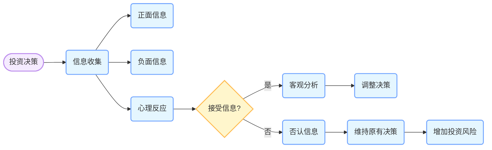

# 芒格的"避免首要否认"：克服投资决策中的心理障碍

> 关键词：芒格、避免首要否认、投资决策、心理障碍、行为金融学

> 摘要：本文围绕芒格提出的“避免首要否认”这一理念，深入探讨其在投资决策过程中的重要性以及如何帮助投资者克服心理障碍。通过对核心概念的解析、相关算法原理的阐述、数学模型的建立，结合实际案例分析，详细展示了“避免首要否认”在投资中的应用。同时，介绍了相关的工具和资源，对未来投资领域在该理念下的发展趋势与挑战进行了总结，并解答了常见问题，为投资者提供了全面的参考和指导。

## 1. 背景介绍 
### 1.1 目的和范围
在投资领域，投资者面临着众多的挑战，其中心理因素对投资决策的影响至关重要。芒格提出的“避免首要否认”理念旨在帮助投资者认识并克服在投资过程中可能出现的心理障碍，从而做出更理性、更明智的投资决策。本文的目的是深入剖析这一理念，探讨其原理、应用和实际意义，范围涵盖投资决策的各个环节，包括信息收集、分析判断、决策执行等。

### 1.2 预期读者
本文主要面向广大投资者，包括个人投资者、专业投资机构从业者以及对投资决策心理研究感兴趣的学者和爱好者。通过阅读本文，读者可以了解“避免首要否认”的内涵，掌握克服投资心理障碍的方法，提升自己的投资决策能力。

### 1.3 文档结构概述
本文将按照以下结构进行阐述：首先介绍核心概念与联系，明确“避免首要否认”的定义和相关理论基础；接着讲解核心算法原理和具体操作步骤，通过Python代码进行详细说明；然后建立数学模型和公式，进一步阐述其原理并举例说明；通过项目实战，展示实际案例和代码解读；分析实际应用场景，说明该理念在不同投资环境中的应用；推荐相关的工具和资源，帮助读者深入学习和实践；最后总结未来发展趋势与挑战，解答常见问题，并提供扩展阅读和参考资料。

### 1.4 术语表
#### 1.4.1 核心术语定义
- **避免首要否认**：指投资者在面对与自己原有观点或决策相悖的信息时，避免本能地拒绝接受这些信息，而是以客观、理性的态度去分析和评估。
- **投资决策心理障碍**：投资者在做出投资决策过程中，由于心理因素的影响而产生的阻碍正确决策的现象，如过度自信、损失厌恶、锚定效应等。
- **行为金融学**：将心理学、社会学等学科的研究成果应用于金融市场，研究投资者心理和行为对金融资产定价和市场效率的影响的学科。

#### 1.4.2 相关概念解释
- **认知失调**：当个体的行为与自己的态度或信念不一致时，会产生一种心理上的不适感，为了减轻这种不适感，个体可能会采取否认、歪曲等方式来调整自己的认知。
- **确认偏差**：人们倾向于寻找和接受与自己原有观点一致的信息，而忽视或拒绝与自己观点相悖的信息。

#### 1.4.3 缩略词列表
- **EMH**：有效市场假说（Efficient Market Hypothesis），认为金融市场中的资产价格已经反映了所有可用的信息。
- **CAPM**：资本资产定价模型（Capital Asset Pricing Model），用于描述资产预期收益率与市场风险之间的关系。

## 2. 核心概念与联系 

### 2.1 “避免首要否认”的原理
“避免首要否认”的核心原理在于打破投资者的心理防御机制，使投资者能够客观地面对与自己投资决策相关的各种信息。在投资过程中，投资者往往会根据自己的经验、知识和判断形成一定的投资观点和决策。当出现与这些观点和决策相悖的信息时，投资者的心理防御机制会本能地启动，试图否认这些信息的真实性或重要性，以维护自己原有的观点和决策。然而，这种心理防御机制可能会导致投资者忽视重要的市场变化和风险，从而做出错误的投资决策。

例如，投资者A购买了某只股票，并坚信该股票具有良好的发展前景。当出现该公司业绩下滑的负面消息时，投资者A可能会否认这些消息的真实性，认为这只是短期的波动，或者认为是市场的误解。这种否认行为可能会使投资者A错过及时卖出股票、减少损失的机会。

### 2.2 与投资决策心理障碍的联系
“避免首要否认”与投资决策心理障碍密切相关。投资决策心理障碍中的许多因素，如认知失调、确认偏差等，都会导致投资者出现“首要否认”的行为。认知失调会使投资者在面对与自己决策相悖的信息时，为了减轻心理上的不适感而否认这些信息；确认偏差则会使投资者只关注与自己原有观点一致的信息，而忽视或否认与自己观点相悖的信息。

例如，投资者B在投资某一行业时，由于之前在该行业有过成功的投资经验，形成了对该行业的积极看法。当出现该行业面临竞争加剧、市场需求下降等负面信息时，投资者B可能会因为确认偏差而忽视这些信息，继续坚持对该行业的投资，从而陷入投资困境。

### 2.3 文本示意图
```plaintext
投资决策
|
|-- 信息收集
|   |-- 正面信息
|   |-- 负面信息
|
|-- 心理反应
|   |-- 接受信息（避免首要否认）
|   |   |-- 客观分析
|   |   |-- 调整决策
|   |-- 否认信息（首要否认）
|       |-- 维持原有决策
|       |-- 增加投资风险
```

### 2.4 Mermaid流程图


## 3. 核心算法原理 & 具体操作步骤 

### 3.1 核心算法原理
为了实现“避免首要否认”，可以设计一个基于信息评估和决策调整的算法。该算法的核心思想是对收集到的投资信息进行客观评估，根据评估结果判断是否需要调整投资决策。具体步骤如下：
1. **信息收集**：收集与投资相关的各种信息，包括正面信息和负面信息。
2. **信息评估**：对收集到的信息进行评估，确定其真实性、可靠性和重要性。
3. **决策判断**：根据信息评估的结果，判断是否需要调整投资决策。如果负面信息的重要性超过一定阈值，则需要考虑调整决策。
4. **决策调整**：根据决策判断的结果，对投资决策进行相应的调整，如卖出部分股票、增加对其他资产的投资等。

### 3.2 具体操作步骤

#### 步骤1：信息收集
使用Python的网络爬虫库（如`requests`和`BeautifulSoup`）从各大金融网站、新闻媒体等渠道收集与投资相关的信息。以下是一个简单的示例代码：
```python
import requests
from bs4 import BeautifulSoup

def collect_information(url):
    try:
        response = requests.get(url)
        response.raise_for_status()
        soup = BeautifulSoup(response.text, 'html.parser')
        # 提取相关信息，这里以提取所有段落文本为例
        information = [p.get_text() for p in soup.find_all('p')]
        return information
    except requests.RequestException as e:
        print(f"Error collecting information: {e}")
        return []

# 示例网站
url = 'https://example.com/finance-news'
information = collect_information(url)
print(information)
```

#### 步骤2：信息评估
对收集到的信息进行评估，确定其真实性、可靠性和重要性。可以使用机器学习算法（如文本分类算法）对信息进行分类，判断其是正面信息还是负面信息，并根据信息的来源、权威性等因素评估其可靠性。以下是一个简单的示例代码：
```python
import pandas as pd
from sklearn.feature_extraction.text import TfidfVectorizer
from sklearn.naive_bayes import MultinomialNB
from sklearn.model_selection import train_test_split
from sklearn.metrics import accuracy_score

# 假设已经有一个包含信息和标签（正面或负面）的数据集
data = pd.read_csv('finance_news.csv')
X = data['news_text']
y = data['label']

# 划分训练集和测试集
X_train, X_test, y_train, y_test = train_test_split(X, y, test_size=0.2, random_state=42)

# 特征提取
vectorizer = TfidfVectorizer()
X_train_vectorized = vectorizer.fit_transform(X_train)
X_test_vectorized = vectorizer.transform(X_test)

# 训练模型
model = MultinomialNB()
model.fit(X_train_vectorized, y_train)

# 预测
y_pred = model.predict(X_test_vectorized)

# 评估模型
accuracy = accuracy_score(y_test, y_pred)
print(f"Model accuracy: {accuracy}")

# 对新收集的信息进行评估
new_information = ["The company's profits are expected to decline this quarter."]
new_information_vectorized = vectorizer.transform(new_information)
prediction = model.predict(new_information_vectorized)
print(f"Prediction for new information: {prediction}")
```

#### 步骤3：决策判断
根据信息评估的结果，判断是否需要调整投资决策。可以设置一个阈值，当负面信息的比例超过该阈值时，认为需要调整决策。以下是一个简单的示例代码：
```python
def decision_making(positive_count, negative_count, threshold=0.3):
    total_count = positive_count + negative_count
    if total_count == 0:
        return False
    negative_ratio = negative_count / total_count
    if negative_ratio > threshold:
        return True
    return False

# 假设已经统计了正面信息和负面信息的数量
positive_count = 10
negative_count = 5
need_adjustment = decision_making(positive_count, negative_count)
print(f"Need to adjust investment decision: {need_adjustment}")
```

#### 步骤4：决策调整
根据决策判断的结果，对投资决策进行相应的调整。以下是一个简单的示例代码：
```python
def adjust_decision(need_adjustment, current_investment):
    if need_adjustment:
        # 假设这里简单地卖出50%的投资
        new_investment = current_investment * 0.5
        print(f"Adjusted investment: {new_investment}")
        return new_investment
    else:
        print("No need to adjust investment.")
        return current_investment

# 假设当前投资金额为10000元
current_investment = 10000
new_investment = adjust_decision(need_adjustment, current_investment)
```

## 4. 数学模型和公式 & 详细讲解 & 举例说明 

### 4.1 信息评估模型
在信息评估阶段，可以使用贝叶斯公式来计算信息为正面或负面的概率。贝叶斯公式如下：
$$P(A|B)=\frac{P(B|A)P(A)}{P(B)}$$
其中，$P(A|B)$ 表示在已知信息 $B$ 的情况下，事件 $A$ 发生的概率；$P(B|A)$ 表示在事件 $A$ 发生的情况下，信息 $B$ 出现的概率；$P(A)$ 表示事件 $A$ 发生的先验概率；$P(B)$ 表示信息 $B$ 出现的概率。

在投资信息评估中，假设事件 $A$ 为信息是正面信息，事件 $\overline{A}$ 为信息是负面信息，信息 $B$ 为具体的信息内容。则可以通过以下步骤计算信息为正面或负面的概率：
1. 计算先验概率 $P(A)$ 和 $P(\overline{A})$，可以根据历史数据统计得到。
2. 计算条件概率 $P(B|A)$ 和 $P(B|\overline{A})$，可以通过机器学习算法（如朴素贝叶斯算法）进行训练得到。
3. 计算 $P(B)$：
$$P(B)=P(B|A)P(A)+P(B|\overline{A})P(\overline{A})$$
4. 计算 $P(A|B)$ 和 $P(\overline{A}|B)$：
$$P(A|B)=\frac{P(B|A)P(A)}{P(B)}$$
$$P(\overline{A}|B)=\frac{P(B|\overline{A})P(\overline{A})}{P(B)}$$

### 4.2 决策判断模型
在决策判断阶段，可以使用阈值模型来判断是否需要调整投资决策。假设 $n_p$ 为正面信息的数量，$n_n$ 为负面信息的数量，阈值为 $\theta$，则决策判断的公式为：
$$\text{Decision}=\begin{cases}
\text{Adjust}, & \frac{n_n}{n_p + n_n}>\theta \\
\text{Maintain}, & \frac{n_n}{n_p + n_n}\leq\theta
\end{cases}$$

### 4.3 举例说明
假设在某一投资决策中，根据历史数据统计得到信息为正面信息的先验概率 $P(A)=0.6$，信息为负面信息的先验概率 $P(\overline{A})=0.4$。通过机器学习算法训练得到，对于某一具体信息 $B$，$P(B|A)=0.3$，$P(B|\overline{A})=0.7$。则可以计算：
$$P(B)=P(B|A)P(A)+P(B|\overline{A})P(\overline{A})=0.3\times0.6 + 0.7\times0.4 = 0.46$$
$$P(A|B)=\frac{P(B|A)P(A)}{P(B)}=\frac{0.3\times0.6}{0.46}\approx0.39$$
$$P(\overline{A}|B)=\frac{P(B|\overline{A})P(\overline{A})}{P(B)}=\frac{0.7\times0.4}{0.46}\approx0.61$$

假设收集到的正面信息数量 $n_p = 10$，负面信息数量 $n_n = 5$，阈值 $\theta = 0.3$，则：
$$\frac{n_n}{n_p + n_n}=\frac{5}{10 + 5}\approx0.33>0.3$$
根据决策判断模型，需要调整投资决策。

## 5. 项目实战：代码实际案例和详细解释说明 

### 5.1  开发环境搭建
#### 安装Python
首先需要安装Python环境，建议使用Python 3.7及以上版本。可以从Python官方网站（https://www.python.org/downloads/）下载并安装。

#### 安装必要的库
使用`pip`命令安装项目所需的库，包括`requests`、`BeautifulSoup`、`pandas`、`scikit-learn`等。以下是安装命令：
```sh
pip install requests beautifulsoup4 pandas scikit-learn
```

### 5.2  源代码详细实现和代码解读

```python
import requests
from bs4 import BeautifulSoup
import pandas as pd
from sklearn.feature_extraction.text import TfidfVectorizer
from sklearn.naive_bayes import MultinomialNB
from sklearn.model_selection import train_test_split
from sklearn.metrics import accuracy_score

# 步骤1：信息收集
def collect_information(url):
    try:
        response = requests.get(url)
        response.raise_for_status()
        soup = BeautifulSoup(response.text, 'html.parser')
        # 提取相关信息，这里以提取所有段落文本为例
        information = [p.get_text() for p in soup.find_all('p')]
        return information
    except requests.RequestException as e:
        print(f"Error collecting information: {e}")
        return []

# 步骤2：信息评估
def train_information_evaluation_model():
    # 假设已经有一个包含信息和标签（正面或负面）的数据集
    data = pd.read_csv('finance_news.csv')
    X = data['news_text']
    y = data['label']

    # 划分训练集和测试集
    X_train, X_test, y_train, y_test = train_test_split(X, y, test_size=0.2, random_state=42)

    # 特征提取
    vectorizer = TfidfVectorizer()
    X_train_vectorized = vectorizer.fit_transform(X_train)
    X_test_vectorized = vectorizer.transform(X_test)

    # 训练模型
    model = MultinomialNB()
    model.fit(X_train_vectorized, y_train)

    # 评估模型
    y_pred = model.predict(X_test_vectorized)
    accuracy = accuracy_score(y_test, y_pred)
    print(f"Model accuracy: {accuracy}")

    return model, vectorizer

def evaluate_information(model, vectorizer, new_information):
    new_information_vectorized = vectorizer.transform(new_information)
    prediction = model.predict(new_information_vectorized)
    positive_count = sum([1 for p in prediction if p == 'positive'])
    negative_count = sum([1 for p in prediction if p == 'negative'])
    return positive_count, negative_count

# 步骤3：决策判断
def decision_making(positive_count, negative_count, threshold=0.3):
    total_count = positive_count + negative_count
    if total_count == 0:
        return False
    negative_ratio = negative_count / total_count
    if negative_ratio > threshold:
        return True
    return False

# 步骤4：决策调整
def adjust_decision(need_adjustment, current_investment):
    if need_adjustment:
        # 假设这里简单地卖出50%的投资
        new_investment = current_investment * 0.5
        print(f"Adjusted investment: {new_investment}")
        return new_investment
    else:
        print("No need to adjust investment.")
        return current_investment

# 主函数
def main():
    # 示例网站
    url = 'https://example.com/finance-news'
    information = collect_information(url)

    model, vectorizer = train_information_evaluation_model()
    positive_count, negative_count = evaluate_information(model, vectorizer, information)

    need_adjustment = decision_making(positive_count, negative_count)
    current_investment = 10000
    new_investment = adjust_decision(need_adjustment, current_investment)

if __name__ == "__main__":
    main()
```

### 5.3  代码解读与分析
#### 信息收集部分
`collect_information` 函数使用`requests`库发送HTTP请求获取网页内容，然后使用`BeautifulSoup`库解析网页，提取所有段落文本作为投资信息。

#### 信息评估部分
`train_information_evaluation_model` 函数使用`pandas`库读取包含信息和标签的数据集，使用`TfidfVectorizer`进行特征提取，使用`MultinomialNB`进行模型训练，并评估模型的准确率。`evaluate_information` 函数使用训练好的模型对新收集的信息进行评估，统计正面信息和负面信息的数量。

#### 决策判断部分
`decision_making` 函数根据正面信息和负面信息的数量计算负面信息的比例，与阈值进行比较，判断是否需要调整投资决策。

#### 决策调整部分
`adjust_decision` 函数根据决策判断的结果，对投资决策进行相应的调整。如果需要调整，则卖出50%的投资；否则，维持原有投资。

#### 主函数部分
`main` 函数依次调用上述函数，完成信息收集、评估、决策判断和调整的整个流程。

## 6. 实际应用场景 
### 股票投资
在股票投资中，投资者可能会因为对某只股票的看好而忽视其负面信息。例如，投资者持有某公司的股票，当该公司出现业绩下滑、管理层变动等负面消息时，投资者可能会本能地否认这些消息的重要性，继续持有股票。运用“避免首要否认”的理念，投资者可以客观地评估这些负面信息，根据信息评估和决策判断的结果，及时调整投资策略，如卖出部分或全部股票，避免损失进一步扩大。

### 基金投资
对于基金投资，投资者可能会因为对某只基金的历史业绩和基金经理的信任而忽视市场环境的变化。当市场出现不利因素，如宏观经济形势恶化、行业竞争加剧等，导致基金净值下跌时，投资者可能会否认这些因素的影响，继续持有基金。通过“避免首要否认”，投资者可以关注市场动态，及时评估基金的投资价值，当发现基金的表现不符合预期时，考虑调整投资组合，如转换到其他更合适的基金。

### 房地产投资
在房地产投资中，投资者可能会因为对某个地区的房地产市场前景过于乐观而忽视潜在的风险。例如，投资者购买了某地区的房产，当该地区出现人口外流、经济发展放缓等负面情况时，投资者可能会否认这些情况对房价的影响，坚持认为房价会继续上涨。运用“避免首要否认”的理念，投资者可以客观地分析这些负面因素，评估房产的价值和投资回报率，根据情况决定是否出售房产或调整投资计划。

## 7. 工具和资源推荐
### 7.1 学习资源推荐
#### 7.1.1 书籍推荐
- 《穷查理宝典：查理·芒格的智慧箴言录》：本书收录了芒格的演讲、文章和访谈，全面展示了芒格的投资理念、思维方式和人生智慧，是学习芒格思想的经典之作。
- 《思考，快与慢》：作者丹尼尔·卡尼曼是行为经济学领域的先驱，本书介绍了人类思维的两种模式——快思考和慢思考，以及它们在决策过程中的影响，对于理解投资决策中的心理因素具有重要意义。
- 《金融心理学：掌握市场波动的真谛》：本书从心理学的角度分析金融市场的波动，探讨投资者的心理和行为对市场的影响，帮助读者了解投资决策中的心理陷阱。

#### 7.1.2 在线课程
- Coursera上的“Behavioral Finance”课程：由知名大学的教授授课，系统介绍行为金融学的基本理论和方法，以及如何应用这些理论和方法解决投资决策中的问题。
- edX上的“Investment Management”课程：涵盖了投资管理的各个方面，包括资产配置、投资组合管理、风险管理等，同时也涉及投资决策中的心理因素。

#### 7.1.3 技术博客和网站
- Seeking Alpha：提供丰富的金融市场分析和投资建议，包括股票、基金、债券等各种投资领域，同时也有很多关于投资决策心理的文章。
- Bloomberg：全球知名的金融资讯平台，提供实时的金融市场数据、新闻和分析，帮助投资者了解市场动态和投资机会。

### 7.2 开发工具框架推荐
#### 7.2.1 IDE和编辑器
- PyCharm：一款专业的Python集成开发环境，提供代码编辑、调试、版本控制等功能，适合开发Python投资分析程序。
- Jupyter Notebook：一个交互式的开发环境，支持Python、R等多种编程语言，方便进行数据分析和可视化，适合进行投资信息的分析和处理。

#### 7.2.2 调试和性能分析工具
- pdb：Python自带的调试工具，可以帮助开发者在代码中设置断点，逐步执行代码，查找和解决问题。
- cProfile：Python的性能分析工具，可以分析代码的执行时间和函数调用情况，帮助开发者优化代码性能。

#### 7.2.3 相关框架和库
- Pandas：一个强大的数据分析库，提供了丰富的数据结构和数据分析工具，适合处理和分析投资数据。
- NumPy：一个用于科学计算的Python库，提供了高效的数组操作和数学函数，在投资分析中经常用于数据处理和模型计算。
- Scikit-learn：一个机器学习库，提供了各种机器学习算法和工具，可用于投资信息的分类、预测等任务。

### 7.3 相关论文著作推荐
#### 7.3.1 经典论文
- “A Behavioral Model of Rational Choice” by Herbert A. Simon：提出了有限理性的概念，认为人类在决策过程中受到认知能力和信息的限制，只能做出有限理性的决策。
- “Prospect Theory: An Analysis of Decision under Risk” by Daniel Kahneman and Amos Tversky：提出了前景理论，解释了人们在面对风险和不确定性时的决策行为，对传统的期望效用理论进行了修正。

#### 7.3.2 最新研究成果
- 关注顶级金融学术期刊，如《Journal of Finance》、《Review of Financial Studies》等，这些期刊上发表了很多关于投资决策心理、行为金融学等方面的最新研究成果。

#### 7.3.3 应用案例分析
- 一些金融机构和研究机构会发布关于投资决策心理的应用案例分析报告，这些报告可以帮助读者了解如何将理论应用到实际投资中，解决实际问题。

## 8. 总结：未来发展趋势与挑战
### 未来发展趋势
- **智能化投资决策**：随着人工智能和机器学习技术的不断发展，未来的投资决策将越来越智能化。投资者可以利用智能算法和模型对大量的投资信息进行分析和处理，更加客观地评估投资风险和收益，克服心理障碍，做出更理性的投资决策。
- **跨学科研究的深入**：投资决策心理的研究将与心理学、社会学、神经科学等学科进行更深入的融合，从多个角度揭示投资者的心理和行为机制，为投资决策提供更全面、更科学的理论支持。
- **个性化投资服务**：根据投资者的不同心理特征和投资目标，提供个性化的投资服务将成为未来投资行业的发展趋势。投资者可以通过专业的投资顾问或智能投资平台，获得适合自己的投资建议和决策方案。

### 挑战
- **数据质量和隐私问题**：在智能化投资决策中，需要大量的投资信息和投资者数据作为支撑。然而，数据的质量和隐私问题是当前面临的重要挑战。如何确保数据的准确性、完整性和安全性，以及如何保护投资者的隐私，是需要解决的关键问题。
- **心理因素的复杂性**：投资者的心理因素非常复杂，受到多种因素的影响，如个人经历、文化背景、情绪状态等。如何准确地识别和度量这些心理因素，以及如何有效地克服这些心理因素对投资决策的影响，仍然是一个具有挑战性的问题。
- **市场不确定性**：金融市场具有高度的不确定性，市场行情随时可能发生变化。即使投资者能够克服心理障碍，做出理性的投资决策，也仍然无法完全避免市场风险。如何在不确定性的市场环境中，有效地管理投资风险，是投资者面临的长期挑战。

## 9. 附录：常见问题与解答
### 问题1：如何判断自己是否存在“首要否认”的行为？
当你面对与自己投资决策相悖的信息时，如果出现以下情况，可能存在“首要否认”的行为：
- 本能地拒绝接受这些信息，认为这些信息是错误的或不重要的。
- 寻找各种理由来解释这些信息，试图维护自己原有的观点和决策。
- 忽视或故意回避这些信息，不愿意对其进行深入分析和评估。

### 问题2：如何培养“避免首要否认”的能力？
可以从以下几个方面培养“避免首要否认”的能力：
- **提高自我认知**：了解自己的投资风格、心理特点和决策习惯，认识到自己可能存在的心理偏差和误区。
- **学习投资知识**：掌握基本的投资理论和方法，提高自己的投资分析能力，能够更加客观地评估投资信息和风险。
- **保持开放心态**：对不同的观点和信息保持开放的态度，愿意接受新的知识和观念，不断更新自己的投资理念。
- **实践和反思**：在实际投资过程中，不断总结经验教训，反思自己的决策过程，及时发现和纠正自己的错误。

### 问题3：“避免首要否认”是否意味着要完全否定自己的原有观点和决策？
不是的。“避免首要否认”并不意味着要完全否定自己的原有观点和决策，而是要以客观、理性的态度去分析和评估与自己原有观点和决策相悖的信息。当这些信息确实表明自己的观点和决策存在问题时，应该及时调整；当这些信息不足以改变自己的观点和决策时，仍然可以坚持自己的判断。

## 10. 扩展阅读 & 参考资料
### 扩展阅读
- 《聪明的投资者》：本杰明·格雷厄姆的经典著作，介绍了价值投资的理念和方法，对投资者具有重要的指导意义。
- 《金融炼金术》：乔治·索罗斯的著作，阐述了他的反身性理论和投资哲学，对于理解金融市场的运行机制和投资决策具有独特的视角。

### 参考资料
- 查理·芒格的演讲和文章，可在相关的书籍和网站上查找。
- 行为金融学领域的学术论文和研究报告，可通过学术数据库（如知网、万方等）进行检索。
- 金融市场的相关数据和信息，可从金融资讯平台（如东方财富、同花顺等）获取。

作者：AI天才研究院/AI Genius Institute & 禅与计算机程序设计艺术 /Zen And The Art of Computer Programming