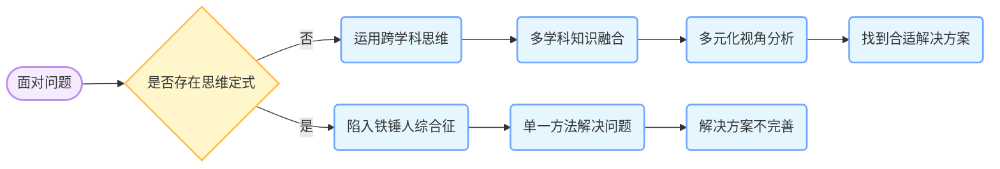

# 芒格的“铁锤人综合征”警示：避免思维定式

> 关键词：铁锤人综合征、思维定式、跨学科思维、决策、认知局限

> 摘要：本文围绕芒格提出的“铁锤人综合征”展开，深入剖析这一概念背后的本质，探讨思维定式对个人决策和认知的负面影响。通过介绍核心概念、算法原理、数学模型等方面，详细阐述如何避免陷入思维定式。同时，结合项目实战案例，说明在实际应用中打破思维局限的方法。此外，还列举了相关的工具和资源，为读者提供学习和实践的方向。最后，总结未来发展趋势与挑战，帮助读者认识到克服思维定式的重要性，以实现更全面、准确的认知和决策。

## 1. 背景介绍 
### 1.1 目的和范围
本文的主要目的是深入解读芒格的“铁锤人综合征”，揭示思维定式的危害，并提供有效的应对策略。我们将探讨这一概念在不同领域的应用，包括商业决策、科学研究、日常生活等。通过详细的分析和实际案例，帮助读者理解如何避免陷入思维定式，培养跨学科思维和多元化的认知方式。

### 1.2 预期读者
本文适合对认知科学、决策理论、商业管理等领域感兴趣的读者，包括学生、科研人员、企业管理者、创业者等。无论你是希望提升自己的思维能力，还是在实际工作中面临决策挑战，都能从本文中获得有价值的启示。

### 1.3 文档结构概述
本文将按照以下结构展开：首先介绍“铁锤人综合征”的核心概念和相关联系，通过文本示意图和 Mermaid 流程图进行直观展示；接着阐述核心算法原理和具体操作步骤，使用 Python 源代码进行详细说明；然后讲解相关的数学模型和公式，并举例说明；再通过项目实战案例，分析代码实现和解读；之后探讨实际应用场景；推荐相关的工具和资源；最后总结未来发展趋势与挑战，并提供常见问题解答和扩展阅读参考资料。

### 1.4 术语表
#### 1.4.1 核心术语定义
- **铁锤人综合征**：指的是当一个人手里只有一把铁锤的时候，他看每个问题都像钉子。这意味着人们倾向于用自己熟悉的单一方法或工具去解决所有问题，而忽略了其他可能更合适的解决方案。
- **思维定式**：是指人们在长期的思考过程中形成的一种固定的思维模式，它会限制人们的思维视野，使人们难以从不同的角度看待问题。
- **跨学科思维**：是指综合运用多个学科的知识和方法来解决问题的思维方式，它能够打破学科界限，提供更全面、深入的解决方案。

#### 1.4.2 相关概念解释
- **认知局限**：由于个人知识、经验、思维方式等因素的限制，人们在认知过程中可能会出现偏差或遗漏，导致对问题的理解不够全面和准确。
- **决策偏差**：在决策过程中，由于思维定式、认知局限等因素的影响，人们可能会做出不合理的决策，从而导致不良后果。

#### 1.4.3 缩略词列表
本文暂未涉及缩略词。

## 2. 核心概念与联系 

### 2.1 铁锤人综合征的本质
铁锤人综合征的本质是人们在面对问题时，过度依赖自己熟悉的方法和工具，而忽视了问题的多样性和复杂性。这种思维定式会导致人们无法从不同的角度看待问题，从而错过更好的解决方案。

例如，一个工程师在解决问题时，总是习惯于使用工程学的方法，而忽略了经济学、社会学等其他学科的观点。即使问题涉及到多个领域，他也可能只从工程学的角度去思考，从而导致解决方案不够完善。

### 2.2 思维定式与铁锤人综合征的关系
思维定式是导致铁锤人综合征的主要原因之一。当人们形成了固定的思维模式后，就会不自觉地用这种模式去看待和解决所有问题。而铁锤人综合征则是思维定式在具体行为上的表现，它使人们在面对问题时，只看到自己熟悉的一面，而忽略了其他可能的方面。

### 2.3 跨学科思维与避免铁锤人综合征
跨学科思维是避免铁锤人综合征的有效方法。通过学习和运用多个学科的知识和方法，人们可以拓宽自己的思维视野，从不同的角度看待问题，从而找到更合适的解决方案。

例如，在解决一个复杂的社会问题时，我们可以综合运用社会学、经济学、心理学等多个学科的知识，从不同的层面分析问题，制定出更全面、有效的解决方案。

### 2.4 文本示意图
```plaintext
铁锤人综合征
|
|-- 思维定式
|   |
|   |-- 固定思维模式
|   |-- 认知局限
|
|-- 跨学科思维
|   |
|   |-- 多学科知识融合
|   |-- 多元化视角
```

### 2.5 Mermaid 流程图


## 3. 核心算法原理 & 具体操作步骤 

### 3.1 核心算法原理
为了避免陷入铁锤人综合征，我们可以采用一种基于多学科知识融合的算法。该算法的核心思想是，在面对问题时，首先识别问题所涉及的学科领域，然后从这些领域中提取相关的知识和方法，最后综合运用这些知识和方法来解决问题。

### 3.2 具体操作步骤
以下是使用 Python 实现的具体操作步骤：

```python
# 步骤 1: 定义问题和相关学科领域
problem = "如何提高某产品的市场竞争力"
related_disciplines = ["市场营销", "管理学", "经济学", "心理学"]

# 步骤 2: 从各学科领域中提取知识和方法
def extract_knowledge(discipline):
    # 这里简单模拟从学科领域中提取知识和方法
    if discipline == "市场营销":
        return ["市场细分", "品牌建设", "促销策略"]
    elif discipline == "管理学":
        return ["目标管理", "团队协作", "流程优化"]
    elif discipline == "经济学":
        return ["成本效益分析", "市场供求关系"]
    elif discipline == "心理学":
        return ["消费者行为分析", "品牌认知心理"]
    else:
        return []

knowledge_list = []
for discipline in related_disciplines:
    knowledge = extract_knowledge(discipline)
    knowledge_list.extend(knowledge)

# 步骤 3: 综合运用知识和方法解决问题
def solve_problem(problem, knowledge_list):
    # 这里简单模拟解决问题的过程
    solution = f"针对问题 '{problem}', 可以综合运用以下知识和方法: {', '.join(knowledge_list)}"
    return solution

final_solution = solve_problem(problem, knowledge_list)
print(final_solution)
```

### 3.3 代码解释
- **步骤 1**：定义了要解决的问题和相关的学科领域。
- **步骤 2**：通过 `extract_knowledge` 函数从各学科领域中提取相关的知识和方法，并将其存储在 `knowledge_list` 中。
- **步骤 3**：通过 `solve_problem` 函数综合运用这些知识和方法来解决问题，并输出最终的解决方案。

## 4. 数学模型和公式 & 详细讲解 & 举例说明 

### 4.1 信息熵模型
信息熵是用来衡量信息不确定性的指标。在避免铁锤人综合征的过程中，我们可以使用信息熵来评估我们对问题的认知程度。信息熵越大，说明我们对问题的认知越不确定，需要更多的信息来降低不确定性。

信息熵的计算公式为：

$$H(X) = -\sum_{i=1}^{n} p(x_i) \log_2 p(x_i)$$

其中，$X$ 是一个随机变量，$x_i$ 是 $X$ 的可能取值，$p(x_i)$ 是 $x_i$ 出现的概率。

### 4.2 详细讲解
信息熵的计算基于概率分布。当我们对问题的认知越全面，即每个可能的情况出现的概率越均匀时，信息熵越大。相反，当我们对问题的认知越局限，即某些情况出现的概率远大于其他情况时，信息熵越小。

例如，假设我们要预测一个产品的市场需求，有三种可能的情况：高需求、中需求、低需求。如果我们对市场情况了解很少，认为这三种情况出现的概率都是 $\frac{1}{3}$，则信息熵为：

$$H(X) = -(\frac{1}{3} \log_2 \frac{1}{3} + \frac{1}{3} \log_2 \frac{1}{3} + \frac{1}{3} \log_2 \frac{1}{3}) \approx 1.585$$

如果我们通过市场调研，发现高需求的概率为 $0.6$，中需求的概率为 $0.3$，低需求的概率为 $0.1$，则信息熵为：

$$H(X) = -(0.6 \log_2 0.6 + 0.3 \log_2 0.3 + 0.1 \log_2 0.1) \approx 1.029$$

可以看出，随着我们对市场情况的了解增加，信息熵减小，说明我们对问题的认知更加确定。

### 4.3 举例说明
在实际应用中，我们可以通过增加信息来源、拓宽知识领域等方式来提高信息熵，从而避免陷入思维定式。例如，在进行产品研发时，我们可以不仅考虑技术因素，还考虑市场需求、用户体验、成本效益等多个方面的因素，以提高我们对问题的认知程度。

## 5. 项目实战：代码实际案例和详细解释说明 

### 5.1 开发环境搭建
本项目使用 Python 语言进行开发，建议使用 Anaconda 环境进行管理。以下是搭建开发环境的具体步骤：

1. 下载并安装 Anaconda：从 Anaconda 官方网站（https://www.anaconda.com/products/individual）下载适合你操作系统的 Anaconda 安装包，并按照安装向导进行安装。
2. 创建虚拟环境：打开 Anaconda Prompt（Windows）或终端（Mac/Linux），输入以下命令创建一个名为 `hammer_syndrome` 的虚拟环境：
```bash
conda create -n hammer_syndrome python=3.8
```
3. 激活虚拟环境：输入以下命令激活虚拟环境：
```bash
conda activate hammer_syndrome
```
4. 安装必要的库：本项目主要使用 Python 的内置库，无需额外安装其他库。

### 5.2 源代码详细实现和代码解读
以下是一个更完整的项目实战代码示例，用于解决一个具体的商业决策问题：如何选择合适的市场推广渠道。

```python
# 步骤 1: 定义问题和相关学科领域
problem = "如何选择合适的市场推广渠道"
related_disciplines = ["市场营销", "统计学", "经济学"]

# 步骤 2: 从各学科领域中提取知识和方法
def extract_knowledge(discipline):
    if discipline == "市场营销":
        return ["市场细分", "目标客户定位", "渠道分析"]
    elif discipline == "统计学":
        return ["数据分析", "回归分析", "相关性分析"]
    elif discipline == "经济学":
        return ["成本效益分析", "边际效益分析"]
    else:
        return []

knowledge_list = []
for discipline in related_disciplines:
    knowledge = extract_knowledge(discipline)
    knowledge_list.extend(knowledge)

# 步骤 3: 模拟数据收集
# 假设我们有以下几种市场推广渠道及其相关数据
channels = ["社交媒体", "搜索引擎广告", "线下活动"]
costs = [1000, 2000, 1500]  # 每种渠道的成本
impressions = [10000, 15000, 8000]  # 每种渠道的曝光量
conversions = [100, 200, 150]  # 每种渠道的转化率

# 步骤 4: 运用统计学知识进行数据分析
import numpy as np

# 计算每个渠道的每曝光成本和每转化成本
cost_per_impression = np.array(costs) / np.array(impressions)
cost_per_conversion = np.array(costs) / np.array(conversions)

# 步骤 5: 运用经济学知识进行成本效益分析
# 假设每个转化的收益为 50 元
revenue_per_conversion = 50
profits = np.array(conversions) * revenue_per_conversion - np.array(costs)

# 步骤 6: 综合评估并选择最佳渠道
best_channel_index = np.argmax(profits)
best_channel = channels[best_channel_index]

# 步骤 7: 输出最终解决方案
solution = f"针对问题 '{problem}', 综合运用了 {', '.join(knowledge_list)} 等知识和方法。经过分析，最佳的市场推广渠道是 {best_channel}，预计利润为 {profits[best_channel_index]} 元。"
print(solution)
```

### 5.3 代码解读与分析
- **步骤 1 和 2**：与前面的示例类似，定义问题和相关学科领域，并从各学科领域中提取知识和方法。
- **步骤 3**：模拟数据收集，包括不同市场推广渠道的成本、曝光量和转化率等数据。
- **步骤 4**：运用统计学知识进行数据分析，计算每个渠道的每曝光成本和每转化成本。
- **步骤 5**：运用经济学知识进行成本效益分析，计算每个渠道的预计利润。
- **步骤 6**：综合评估并选择最佳渠道，通过比较各渠道的利润，选择利润最大的渠道作为最佳渠道。
- **步骤 7**：输出最终解决方案，包括综合运用的知识和方法、最佳渠道和预计利润等信息。

通过这个项目实战案例，我们可以看到如何综合运用多个学科的知识和方法来解决实际问题，避免陷入单一思维模式。

## 6. 实际应用场景 
### 6.1 商业决策
在商业决策中，铁锤人综合征可能会导致管理者只从自己熟悉的领域出发，做出片面的决策。例如，一个技术出身的管理者在决定产品发展方向时，可能只关注技术的先进性，而忽略了市场需求和成本效益。

为了避免这种情况，管理者需要培养跨学科思维，综合考虑市场营销、管理学、经济学等多个领域的因素。例如，在进行产品定价时，不仅要考虑成本和利润，还要考虑市场竞争、消费者心理等因素。

### 6.2 科学研究
在科学研究中，思维定式可能会限制研究者的创新能力。例如，一个物理学家在研究某个问题时，可能只习惯于使用物理模型和方法，而忽略了其他学科的理论和技术。

为了推动科学研究的发展，研究者需要打破学科界限，开展跨学科研究。例如，在生物医学领域，结合物理学、化学、计算机科学等多个学科的知识和技术，可以开发出更先进的诊断和治疗方法。

### 6.3 日常生活
在日常生活中，我们也会受到思维定式的影响。例如，我们在选择餐厅时，可能只考虑自己熟悉的菜系和餐厅，而忽略了其他可能更美味、更实惠的选择。

为了丰富我们的生活体验，我们需要尝试新的事物，拓宽自己的视野。例如，我们可以尝试不同的美食、参加不同的文化活动，从不同的角度感受生活。

## 7. 工具和资源推荐
### 7.1 学习资源推荐
#### 7.1.1 书籍推荐
- 《穷查理宝典：查理·芒格的智慧箴言录》：这本书收录了芒格的演讲、文章和名言，深入阐述了他的投资理念和跨学科思维方法。
- 《思考，快与慢》：作者丹尼尔·卡尼曼是诺贝尔经济学奖得主，这本书介绍了人类思维的两种模式：快思考和慢思考，并分析了思维定式和决策偏差的原因。
- 《跨学科研究与大学管理》：本书探讨了跨学科研究的理论和实践，为培养跨学科思维提供了有益的参考。

#### 7.1.2 在线课程
- Coursera 上的“跨学科研究方法”课程：该课程介绍了跨学科研究的基本概念、方法和技巧，帮助学习者掌握跨学科思维的能力。
- edX 上的“决策科学”课程：该课程涵盖了决策理论、行为经济学、数据分析等多个方面的内容，有助于提高学习者的决策能力。

#### 7.1.3 技术博客和网站
- 36氪：提供了大量的商业、科技资讯和分析文章，有助于了解不同领域的发展动态。
- 知乎：有很多关于认知科学、决策理论等方面的讨论和分享，可以从中获取不同的观点和见解。

### 7.2 开发工具框架推荐
#### 7.2.1 IDE和编辑器
- PyCharm：是一款专门为 Python 开发设计的集成开发环境，具有丰富的功能和插件，能够提高开发效率。
- Jupyter Notebook：是一个交互式的开发环境，适合进行数据分析和模型验证，方便代码的编写、运行和展示。

#### 7.2.2 调试和性能分析工具
- pdb：是 Python 的内置调试工具，可以帮助开发者定位和解决代码中的问题。
- cProfile：是 Python 的性能分析工具，可以分析代码的运行时间和内存使用情况，帮助开发者优化代码性能。

#### 7.2.3 相关框架和库
- Pandas：是一个强大的数据分析库，提供了丰富的数据结构和数据处理方法，方便进行数据清洗、分析和可视化。
- Scikit-learn：是一个常用的机器学习库，提供了多种机器学习算法和工具，可用于数据挖掘、模型训练和预测。

### 7.3 相关论文著作推荐
#### 7.3.1 经典论文
- Simon, H. A. (1955). A behavioral model of rational choice. The Quarterly Journal of Economics, 69(1), 99-118. 这篇论文提出了有限理性的概念，对决策理论产生了深远的影响。
- Tversky, A., & Kahneman, D. (1974). Judgment under uncertainty: Heuristics and biases. Science, 185(4157), 1124-1131. 该论文介绍了人类在决策过程中常用的启发式方法和偏差，为行为经济学的发展奠定了基础。

#### 7.3.2 最新研究成果
- Gino, F., & Pisano, G. P. (2019). Fear of failure and the culture of success: How the fear of negative evaluation affects learning and innovation. Academy of Management Journal, 62(6), 1725-1752. 这篇论文研究了害怕失败对学习和创新的影响，为组织管理提供了新的视角。
- Johnson, S. G. B., & Tubau, E. (2019). The wisdom of small groups: How collective intelligence emerges from diverse minds. Trends in Cognitive Sciences, 23(11), 946-957. 该论文探讨了小群体中集体智慧的产生机制，强调了多元化思维的重要性。

#### 7.3.3 应用案例分析
- Christensen, C. M. (1997). The innovator's dilemma: When new technologies cause great firms to fail. Harvard Business School Press. 这本书通过多个案例分析，阐述了创新者面临的困境和应对策略，对企业的创新管理具有重要的启示意义。
- Gladwell, M. (2000). The tipping point: How little things can make a big difference. Little, Brown and Company. 该书通过大量的案例研究，探讨了社会现象中的“引爆点”，为市场营销和社会变革提供了新的思路。

## 8. 总结：未来发展趋势与挑战
### 8.1 未来发展趋势
- **跨学科研究的深入发展**：随着科学技术的不断进步，各个学科之间的交叉融合将越来越深入。跨学科研究将成为解决复杂问题的主要途径，有助于推动各个领域的创新和发展。
- **人工智能与跨学科思维的结合**：人工智能技术的发展将为跨学科思维的培养和应用提供新的工具和方法。例如，人工智能可以帮助我们快速收集和分析大量的数据，发现不同学科之间的潜在联系，从而促进跨学科研究的开展。
- **教育理念的转变**：未来的教育将更加注重培养学生的跨学科思维和创新能力。学校和教育机构将加强跨学科课程的设置和教学，鼓励学生从不同的角度思考问题，提高综合素质。

### 8.2 挑战
- **学科壁垒的打破**：虽然跨学科研究具有很大的潜力，但学科壁垒仍然是一个重要的挑战。不同学科之间的研究方法、术语和文化差异较大，需要研究者具备较强的沟通和协作能力，才能实现有效的跨学科合作。
- **知识更新的速度**：随着科技的快速发展，知识更新的速度越来越快。为了避免陷入思维定式，我们需要不断学习和更新知识，跟上时代的步伐。这对个人的学习能力和时间管理能力提出了更高的要求。
- **决策的复杂性**：在实际应用中，决策往往涉及到多个因素和多个利益相关者。如何综合考虑各种因素，做出合理的决策，是一个复杂的问题。需要我们运用跨学科思维，从多个角度进行分析和评估。

## 9. 附录：常见问题与解答
### 9.1 如何培养跨学科思维？
- **广泛阅读**：阅读不同学科的书籍、文章和研究报告，了解不同学科的基本概念、方法和理论。
- **参加跨学科课程和活动**：通过参加跨学科的课程、讲座、研讨会等活动，与不同学科的人交流和合作，拓宽自己的视野。
- **实践应用**：在实际工作和生活中，尝试运用不同学科的知识和方法解决问题，逐渐培养跨学科思维的习惯。

### 9.2 如何判断自己是否陷入了思维定式？
- **反思自己的决策过程**：回顾自己在解决问题时的思考方式和决策依据，是否总是依赖于自己熟悉的方法和工具。
- **听取他人的意见**：与不同背景的人交流，听取他们对问题的看法和建议，看自己是否能够接受不同的观点。
- **尝试新的方法和思路**：在面对问题时，主动尝试使用不同的方法和思路去解决，看是否能够找到更好的解决方案。

### 9.3 跨学科研究是否会导致知识的碎片化？
跨学科研究并不一定会导致知识的碎片化。相反，通过跨学科研究，我们可以将不同学科的知识有机地整合起来，形成更全面、深入的认识。关键在于我们要建立起不同学科之间的联系，找到它们的共同点和互补之处，从而实现知识的融合和创新。

## 10. 扩展阅读 & 参考资料
- 《人类的认知：思维的信息加工理论》，作者：司马贺（Herbert A. Simon）
- 《创新者的处方：创造破坏性创新的条件》，作者：克莱顿·克里斯坦森（Clayton M. Christensen）
- 《刻意练习：如何从新手到大师》，作者：安德斯·埃里克森（Anders Ericsson）、罗伯特·普尔（Robert Pool）

作者：AI天才研究院/AI Genius Institute & 禅与计算机程序设计艺术 /Zen And The Art of Computer Programming