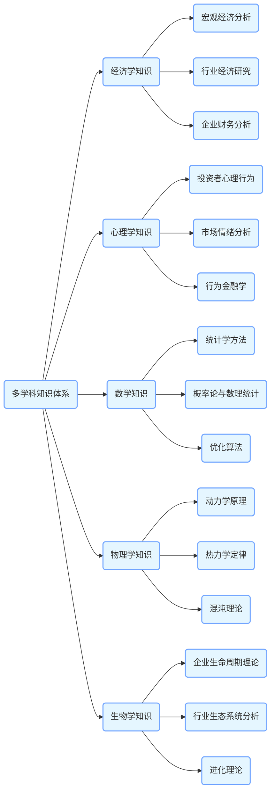

# 芒格的多学科知识在投资决策中的作用

> 关键词：芒格、多学科知识、投资决策、跨学科思维、价值投资

> 摘要：本文深入探讨了芒格的多学科知识在投资决策中的重要作用。首先介绍了背景信息，包括目的、预期读者、文档结构和相关术语。接着阐述了多学科知识的核心概念及其联系，通过文本示意图和Mermaid流程图进行清晰展示。详细讲解了运用多学科知识进行投资决策的核心算法原理及具体操作步骤，辅以Python代码示例。从数学角度分析了相关模型和公式，并举例说明。通过项目实战，展示了在实际投资场景中如何运用多学科知识进行决策。探讨了多学科知识在不同实际应用场景中的体现，推荐了学习资源、开发工具框架以及相关论文著作。最后总结了未来发展趋势与挑战，解答常见问题，并提供扩展阅读和参考资料，旨在为投资者和相关研究人员提供全面且深入的见解。

## 1. 背景介绍 
### 1.1 目的和范围
本文章的主要目的是深入剖析芒格所倡导的多学科知识在投资决策过程中所起到的关键作用。通过对多学科知识体系的研究，揭示其如何帮助投资者更全面、准确地评估投资机会，降低投资风险，提高投资回报率。研究范围涵盖了芒格所提及的多个学科领域，如经济学、心理学、数学、物理学、生物学等，以及这些学科知识在不同投资场景下的具体应用。

### 1.2 预期读者
本文预期读者包括专业投资者、投资领域的研究人员、金融专业的学生以及对投资决策感兴趣的普通大众。对于专业投资者而言，文章可以为他们提供新的投资思路和方法；研究人员可以从理论和实践结合的角度深入探讨多学科知识在投资领域的应用；金融专业学生可以通过本文拓宽知识面，了解投资决策的多元化视角；普通大众则可以从中学习到实用的投资技巧和理念。

### 1.3 文档结构概述
本文将按照以下结构进行阐述：首先介绍核心概念与联系，明确多学科知识的内涵以及各学科之间的关联；接着详细讲解核心算法原理和具体操作步骤，通过Python代码示例展示如何运用多学科知识进行投资分析；随后给出相关的数学模型和公式，并结合实际例子进行说明；通过项目实战部分，展示多学科知识在实际投资项目中的应用过程；探讨多学科知识在不同实际应用场景中的体现；推荐学习资源、开发工具框架以及相关论文著作；最后总结未来发展趋势与挑战，解答常见问题，并提供扩展阅读和参考资料。

### 1.4 术语表
#### 1.4.1 核心术语定义
- **多学科知识**：指融合了多个不同学科领域的知识体系，包括但不限于经济学、心理学、数学、物理学、生物学等，用于解决复杂的现实问题。
- **投资决策**：投资者在进行投资活动时，根据自身的投资目标、风险承受能力和市场情况等因素，对投资对象、投资时机、投资金额等进行选择和判断的过程。
- **跨学科思维**：一种打破学科界限，将不同学科的理论、方法和思维方式相互融合，以获得更全面、深入的问题解决方案的思维模式。
- **价值投资**：一种投资策略，强调通过对企业内在价值的评估，寻找被市场低估的股票进行投资，以获取长期的投资回报。

#### 1.4.2 相关概念解释
- **经济学知识在投资中的应用**：经济学原理可以帮助投资者分析宏观经济形势、行业发展趋势以及企业的经济环境，从而评估投资项目的可行性和潜在收益。例如，通过研究供求关系、通货膨胀率、利率等经济指标，预测市场的走势和企业的盈利能力。
- **心理学知识在投资中的应用**：投资者的心理因素会对投资决策产生重要影响。心理学知识可以帮助投资者理解市场参与者的心理行为，如贪婪、恐惧、羊群效应等，从而避免因情绪波动而做出错误的投资决策。同时，也可以利用他人的心理偏差寻找投资机会。
- **数学知识在投资中的应用**：数学是投资分析的重要工具，用于计算各种投资指标，如收益率、风险系数、估值模型等。通过数学模型和公式，可以对投资项目进行定量分析，提高投资决策的准确性和科学性。

#### 1.4.3 缩略词列表
- **ROI**：Return on Investment，投资回报率
- **PE**：Price-to-Earnings Ratio，市盈率
- **DCF**：Discounted Cash Flow，现金流折现法

## 2. 核心概念与联系 

### 核心概念原理
芒格认为，世界是一个复杂的系统，各个学科之间相互关联、相互影响。在投资决策中，单一学科的知识往往是不够的，因为投资问题涉及到经济、社会、心理、技术等多个方面。多学科知识可以为投资者提供更全面、深入的视角，帮助他们更好地理解投资对象的本质和市场的运行规律。

例如，经济学知识可以帮助投资者分析企业的财务状况和市场竞争力；心理学知识可以解释投资者的行为和市场的非理性波动；数学知识可以用于建立投资模型和进行风险评估；物理学知识可以类比市场的动态变化和趋势；生物学知识可以帮助理解企业的生命周期和行业的生态系统。

### 架构的文本示意图
```plaintext
多学科知识体系
|-- 经济学知识
|   |-- 宏观经济分析
|   |-- 行业经济研究
|   |-- 企业财务分析
|-- 心理学知识
|   |-- 投资者心理行为
|   |-- 市场情绪分析
|   |-- 行为金融学
|-- 数学知识
|   |-- 统计学方法
|   |-- 概率论与数理统计
|   |-- 优化算法
|-- 物理学知识
|   |-- 动力学原理
|   |-- 热力学定律
|   |-- 混沌理论
|-- 生物学知识
|   |-- 企业生命周期理论
|   |-- 行业生态系统分析
|   |-- 进化理论
```

### Mermaid流程图


## 3. 核心算法原理 & 具体操作步骤 

### 核心算法原理
运用多学科知识进行投资决策的核心算法原理是综合考虑各个学科领域的因素，通过建立模型和指标体系，对投资项目进行全面评估。具体来说，就是将不同学科的知识转化为可量化的指标，然后根据这些指标对投资项目进行打分和排序，最终选择最优的投资方案。

例如，在评估一家企业的投资价值时，可以从经济学角度考虑企业的盈利能力、市场份额、行业竞争力等指标；从心理学角度考虑投资者对企业的预期和市场情绪；从数学角度运用财务比率分析、现金流折现模型等方法进行估值；从物理学角度类比企业的发展趋势和稳定性；从生物学角度分析企业的生命周期和行业生态系统。

### 具体操作步骤

#### 步骤1：确定投资目标和范围
明确自己的投资目标，如短期获利、长期价值投资等，并确定投资的范围，如股票、债券、基金等。

#### 步骤2：收集相关信息
收集投资对象的各种信息，包括财务报表、行业报告、市场数据、新闻资讯等。同时，了解宏观经济形势、政策法规等外部环境因素。

#### 步骤3：运用多学科知识进行分析
- **经济学分析**：分析企业的财务状况，计算各种财务比率，如毛利率、净利率、ROE等；研究行业的发展趋势和竞争格局，评估企业在行业中的地位。
- **心理学分析**：观察市场情绪和投资者的心理行为，判断是否存在过度乐观或过度悲观的情况；分析企业的品牌形象和市场口碑对投资者心理的影响。
- **数学分析**：运用统计学方法对历史数据进行分析，预测未来的发展趋势；建立估值模型，如DCF模型、PE估值模型等，评估企业的内在价值。
- **物理学分析**：类比企业的发展趋势和稳定性，如将企业的增长看作是一种运动，分析其加速度、速度等因素。
- **生物学分析**：分析企业的生命周期，判断企业处于成长、成熟还是衰退阶段；研究行业的生态系统，了解企业与竞争对手、供应商、客户之间的关系。

#### 步骤4：建立评估指标体系
根据以上分析，建立一套评估指标体系，对每个指标赋予相应的权重。例如，可以设置财务指标占40%、市场指标占30%、心理指标占10%、物理指标占10%、生物指标占10%。

#### 步骤5：计算投资项目的得分
根据评估指标体系，对每个投资项目进行打分，然后根据权重计算综合得分。得分越高的项目，投资价值越大。

#### 步骤6：选择投资方案
根据综合得分，选择得分最高的投资项目作为最终的投资方案。同时，要根据自己的风险承受能力和投资目标，合理调整投资组合。

### Python源代码示例
```python
import pandas as pd

# 定义评估指标和权重
indicators = ['财务指标', '市场指标', '心理指标', '物理指标', '生物指标']
weights = [0.4, 0.3, 0.1, 0.1, 0.1]

# 模拟投资项目数据
projects = {
    '项目A': [80, 70, 60, 75, 85],
    '项目B': [75, 80, 70, 85, 70],
    '项目C': [85, 75, 75, 70, 80]
}

# 转换为DataFrame
df = pd.DataFrame(projects, index=indicators)

# 计算每个项目的综合得分
scores = {}
for project in projects.keys():
    score = sum(df[project] * weights)
    scores[project] = score

# 选择得分最高的项目
best_project = max(scores, key=scores.get)

print("各项目综合得分：", scores)
print("最优投资项目：", best_project)
```

## 4. 数学模型和公式 & 详细讲解 & 举例说明 

### 财务比率分析
#### 毛利率
毛利率是指企业毛利与营业收入的比率，反映了企业产品或服务的盈利能力。计算公式为：
$$毛利率 = \frac{营业收入 - 营业成本}{营业收入} \times 100\%$$

例如，某企业营业收入为1000万元，营业成本为600万元，则该企业的毛利率为：
$$毛利率 = \frac{1000 - 600}{1000} \times 100\% = 40\%$$

#### 净利率
净利率是指企业净利润与营业收入的比率，反映了企业的最终盈利能力。计算公式为：
$$净利率 = \frac{净利润}{营业收入} \times 100\%$$

例如，某企业净利润为200万元，营业收入为1000万元，则该企业的净利率为：
$$净利率 = \frac{200}{1000} \times 100\% = 20\%$$

#### ROE（净资产收益率）
ROE是指企业净利润与净资产的比率，反映了企业运用自有资本的效率。计算公式为：
$$ROE = \frac{净利润}{净资产} \times 100\%$$

例如，某企业净利润为200万元，净资产为1000万元，则该企业的ROE为：
$$ROE = \frac{200}{1000} \times 100\% = 20\%$$

### 现金流折现模型（DCF）
现金流折现模型是一种常用的估值方法，通过预测企业未来的现金流，并将其折现到当前时刻，来评估企业的内在价值。计算公式为：
$$V = \sum_{t=1}^{n} \frac{CF_t}{(1 + r)^t} + \frac{TV}{(1 + r)^n}$$
其中，$V$ 表示企业的内在价值，$CF_t$ 表示第 $t$ 年的现金流，$r$ 表示折现率，$n$ 表示预测期数，$TV$ 表示终值。

例如，假设某企业未来3年的现金流分别为100万元、120万元、150万元，折现率为10%，预测期结束后的终值为1000万元，则该企业的内在价值为：
$$V = \frac{100}{(1 + 0.1)^1} + \frac{120}{(1 + 0.1)^2} + \frac{150}{(1 + 0.1)^3} + \frac{1000}{(1 + 0.1)^3}$$
```python
import math

# 现金流
cf = [100, 120, 150]
# 折现率
r = 0.1
# 终值
tv = 1000
# 预测期数
n = 3

# 计算现金流折现值
pv_cf = sum([cf[i] / math.pow(1 + r, i + 1) for i in range(n)])
# 计算终值折现值
pv_tv = tv / math.pow(1 + r, n)

# 计算内在价值
value = pv_cf + pv_tv

print("企业内在价值：", value)
```

### 市盈率（PE）估值模型
市盈率是指股票价格与每股收益的比率，反映了市场对企业盈利的预期。计算公式为：
$$PE = \frac{股票价格}{每股收益}$$

例如，某股票价格为20元，每股收益为2元，则该股票的市盈率为：
$$PE = \frac{20}{2} = 10$$

通过与同行业其他企业的市盈率进行比较，可以判断该股票是否被低估或高估。

## 5. 项目实战：代码实际案例和详细解释说明 

### 5.1  开发环境搭建
#### 安装Python
首先，需要安装Python编程语言。可以从Python官方网站（https://www.python.org/downloads/）下载适合自己操作系统的Python版本，并按照安装向导进行安装。

#### 安装必要的库
在进行投资分析时，需要使用一些Python库，如`pandas`、`numpy`、`matplotlib`等。可以使用`pip`命令进行安装：
```sh
pip install pandas numpy matplotlib
```

### 5.2  源代码详细实现和代码解读
```python
import pandas as pd
import numpy as np
import matplotlib.pyplot as plt

# 模拟收集到的企业财务数据
data = {
    '年份': [2018, 2019, 2020, 2021, 2022],
    '营业收入': [1000, 1200, 1300, 1500, 1600],
    '营业成本': [600, 700, 750, 850, 900],
    '净利润': [200, 250, 300, 350, 400],
    '净资产': [1000, 1100, 1200, 1300, 1400]
}

# 转换为DataFrame
df = pd.DataFrame(data)

# 计算毛利率
df['毛利率'] = (df['营业收入'] - df['营业成本']) / df['营业收入'] * 100

# 计算净利率
df['净利率'] = df['净利润'] / df['营业收入'] * 100

# 计算ROE
df['ROE'] = df['净利润'] / df['净资产'] * 100

# 打印财务指标
print(df[['年份', '毛利率', '净利率', 'ROE']])

# 绘制财务指标变化趋势图
plt.figure(figsize=(10, 6))
plt.plot(df['年份'], df['毛利率'], label='毛利率')
plt.plot(df['年份'], df['净利率'], label='净利率')
plt.plot(df['年份'], df['ROE'], label='ROE')
plt.xlabel('年份')
plt.ylabel('百分比')
plt.title('财务指标变化趋势')
plt.legend()
plt.grid(True)
plt.show()
```

### 代码解读与分析
- **数据模拟**：使用字典`data`模拟收集到的企业财务数据，包括年份、营业收入、营业成本、净利润和净资产。
- **数据转换**：将字典数据转换为`pandas`的`DataFrame`对象，方便进行数据处理和分析。
- **指标计算**：根据前面介绍的财务比率公式，计算毛利率、净利率和ROE，并将结果添加到`DataFrame`中。
- **结果打印**：打印计算得到的财务指标，方便查看企业的财务状况。
- **可视化分析**：使用`matplotlib`库绘制财务指标的变化趋势图，直观地展示企业财务状况的变化情况。

通过以上代码，可以对企业的财务状况进行初步分析，为投资决策提供参考。

## 6. 实际应用场景 
### 股票投资
在股票投资中，多学科知识可以帮助投资者更全面地评估股票的投资价值。经济学知识可以用于分析公司的财务报表、行业前景和宏观经济环境；心理学知识可以帮助投资者理解市场情绪和投资者的心理行为，避免盲目跟风和情绪化交易；数学知识可以用于建立估值模型，计算股票的内在价值；物理学知识可以类比股票价格的波动和趋势；生物学知识可以分析公司的生命周期和行业生态系统。

例如，在选择股票时，可以通过分析公司的毛利率、净利率、ROE等财务指标，判断公司的盈利能力和竞争力；观察市场情绪和投资者的心理行为，寻找被市场低估的股票；运用DCF模型或PE估值模型，计算股票的合理价格；关注行业的发展趋势和竞争格局，选择具有成长潜力的行业和公司。

### 基金投资
在基金投资中，多学科知识同样具有重要作用。经济学知识可以帮助投资者分析基金的投资策略、业绩表现和市场环境；心理学知识可以帮助投资者理解基金经理的投资风格和决策过程，以及市场参与者的心理行为；数学知识可以用于计算基金的收益率、风险指标等；物理学知识可以类比基金业绩的波动和趋势；生物学知识可以分析基金的投资组合和行业分布。

例如，在选择基金时，可以通过分析基金的历史业绩、夏普比率、最大回撤等指标，评估基金的风险收益特征；了解基金经理的投资理念和决策过程，判断其投资能力和风格；关注市场情绪和投资者的心理行为，避免在市场过热或过冷时做出错误的投资决策；分析基金的投资组合和行业分布，选择与自己投资目标和风险承受能力相匹配的基金。

### 房地产投资
在房地产投资中，多学科知识也能发挥重要作用。经济学知识可以用于分析房地产市场的供求关系、价格走势和宏观经济环境；心理学知识可以帮助投资者理解购房者和开发商的心理行为，以及市场情绪对房价的影响；数学知识可以用于计算房地产的投资回报率、租金收益率等；物理学知识可以类比房地产市场的波动和趋势；生物学知识可以分析房地产市场的生态系统和发展周期。

例如，在进行房地产投资时，可以通过分析房地产市场的供求关系、人口增长、经济发展等因素，判断房地产市场的发展趋势；了解购房者和开发商的心理行为，寻找市场的供需失衡点；运用数学模型计算房地产的投资回报率和租金收益率，评估投资价值；关注房地产市场的政策变化和市场情绪，避免在市场过热或过冷时进行投资。

## 7. 工具和资源推荐
### 7.1 学习资源推荐
#### 7.1.1 书籍推荐
- 《穷查理宝典：查理·芒格的智慧箴言录》：这本书收录了芒格的演讲、文章和访谈，全面介绍了他的投资理念、多学科思维方法和人生智慧。
- 《聪明的投资者》：本杰明·格雷厄姆的经典著作，被誉为投资界的圣经，介绍了价值投资的基本原理和方法。
- 《金融炼金术》：乔治·索罗斯的著作，阐述了他的反身性理论和投资哲学，对理解市场的非理性行为和波动有很大帮助。
- 《思考，快与慢》：丹尼尔·卡尼曼的著作，介绍了人类思维的两种模式——快思考和慢思考，以及它们在决策过程中的影响，对投资决策中的心理因素分析有重要启示。

#### 7.1.2 在线课程
- Coursera上的“投资学原理”：由知名大学教授授课，系统介绍了投资学的基本原理和方法，包括资产定价、投资组合理论、风险管理等内容。
- edX上的“行为金融学”：讲解了行为金融学的基本概念和理论，分析了投资者的心理行为和市场的非理性现象，对理解投资决策中的心理因素有很大帮助。
- 网易云课堂上的“价值投资实战课程”：由资深投资者授课，结合实际案例，介绍了价值投资的具体方法和策略，适合有一定投资基础的学习者。

#### 7.1.3 技术博客和网站
- 雪球网：国内知名的投资社区，提供股票、基金、债券等投资品种的行情数据、分析报告和投资者交流平台。
- 东方财富网：提供全面的金融信息和数据服务，包括股票行情、财经新闻、研究报告等，是投资者获取信息的重要渠道。
- Seeking Alpha：国外知名的投资研究网站，提供全球范围内的股票分析、投资策略和市场评论，有很多专业投资者和分析师分享自己的观点和研究成果。

### 7.2 开发工具框架推荐
#### 7.2.1 IDE和编辑器
- PyCharm：一款专业的Python集成开发环境，提供代码编辑、调试、测试等功能，适合Python开发人员使用。
- Jupyter Notebook：一种交互式的开发环境，支持多种编程语言，特别适合数据科学和机器学习领域的开发和研究。
- Visual Studio Code：一款轻量级的代码编辑器，支持多种编程语言和插件扩展，具有丰富的功能和良好的用户体验。

#### 7.2.2 调试和性能分析工具
- Py-Spy：一款Python性能分析工具，可以实时监测Python程序的运行状态和性能指标，帮助开发者找出性能瓶颈。
- PDB：Python自带的调试工具，可以在代码中设置断点，逐步执行代码，查看变量的值和程序的执行流程，方便调试程序。
- Memory Profiler：一款Python内存分析工具，可以帮助开发者分析程序的内存使用情况，找出内存泄漏和浪费的问题。

#### 7.2.3 相关框架和库
- Pandas：Python中用于数据处理和分析的库，提供了高效的数据结构和数据操作方法，适合处理各种类型的数据。
- NumPy：Python中用于科学计算的库，提供了高效的多维数组对象和数学函数，是许多数据分析和机器学习库的基础。
- Matplotlib：Python中用于数据可视化的库，提供了丰富的绘图功能，可以绘制各种类型的图表和图形，方便展示数据和分析结果。

### 7.3 相关论文著作推荐
#### 7.3.1 经典论文
- 《证券分析》（Security Analysis）：本杰明·格雷厄姆和戴维·多德的经典著作，奠定了价值投资的理论基础。
- 《有效市场假说》（Efficient Market Hypothesis）：尤金·法玛的论文，提出了有效市场假说，对金融市场的研究和投资决策产生了深远影响。
- 《资本资产定价模型》（Capital Asset Pricing Model）：威廉·夏普的论文，提出了资本资产定价模型，用于计算资产的预期收益率和风险。

#### 7.3.2 最新研究成果
- 《行为金融学的新进展》：介绍了行为金融学领域的最新研究成果和发展趋势，包括投资者的心理行为、市场的非理性现象、行为资产定价模型等内容。
- 《多学科方法在投资决策中的应用研究》：探讨了多学科知识在投资决策中的应用方法和实践案例，为投资者提供了新的思路和方法。
- 《人工智能在投资领域的应用》：介绍了人工智能技术在投资领域的应用现状和发展前景，包括机器学习、深度学习、自然语言处理等技术在投资分析、风险评估、投资决策等方面的应用。

#### 7.3.3 应用案例分析
- 《巴菲特的投资案例分析》：分析了巴菲特的投资理念、投资策略和投资案例，总结了他的成功经验和投资方法。
- 《索罗斯的金融投机案例分析》：介绍了索罗斯的反身性理论和金融投机案例，分析了他在不同市场环境下的投资决策和操作方法。
- 《中国股市的投资案例分析》：结合中国股市的实际情况，分析了不同行业和公司的投资案例，为国内投资者提供了参考和借鉴。

## 8. 总结：未来发展趋势与挑战
### 未来发展趋势
- **多学科融合加深**：随着投资市场的日益复杂和多元化，单一学科的知识已经难以满足投资决策的需求。未来，多学科知识的融合将更加深入，投资者需要掌握更多领域的知识和技能，才能更好地应对市场的变化和挑战。
- **人工智能与多学科知识结合**：人工智能技术的发展为投资决策提供了新的工具和方法。未来，人工智能将与多学科知识相结合，通过大数据分析、机器学习、深度学习等技术，实现更精准的投资分析和决策。
- **可持续投资兴起**：随着社会对环境保护、社会责任和公司治理的关注度不断提高，可持续投资将成为未来投资的重要趋势。投资者将更加注重企业的可持续发展能力和社会价值，运用多学科知识评估企业的环境、社会和治理绩效。

### 挑战
- **知识学习成本高**：掌握多学科知识需要花费大量的时间和精力，投资者需要具备较强的学习能力和综合素质。同时，不同学科之间的知识体系和思维方式差异较大，如何将它们有机地融合在一起，也是一个挑战。
- **数据质量和可靠性**：在运用多学科知识进行投资决策时，需要大量的数据支持。然而，数据的质量和可靠性往往存在问题，如数据不准确、不完整、过时等，这会影响投资分析和决策的准确性。
- **市场不确定性增加**：投资市场充满了不确定性，各种因素如宏观经济形势、政策法规、突发事件等都会对市场产生影响。如何在不确定性的市场环境中运用多学科知识进行准确的投资决策，是投资者面临的一大挑战。

## 9. 附录：常见问题与解答
### 问题1：多学科知识在投资决策中的应用是否适用于所有投资者？
解答：多学科知识在投资决策中的应用适用于大多数投资者，但对于不同类型的投资者，其应用程度和方式可能会有所不同。对于专业投资者和机构投资者来说，他们通常具备更丰富的知识和经验，能够更深入地运用多学科知识进行投资分析和决策。而对于普通投资者来说，可以根据自己的实际情况，选择一些与投资相关的学科知识进行学习和应用，逐步提高自己的投资能力。

### 问题2：如何学习和掌握多学科知识？
解答：学习和掌握多学科知识需要长期的积累和实践。可以通过阅读相关的书籍、文章和研究报告，参加培训课程和研讨会，与其他投资者和专业人士交流等方式来学习不同学科的知识。同时，要注重将不同学科的知识融会贯通，运用到实际的投资决策中，通过实践不断提高自己的综合能力。

### 问题3：多学科知识在投资决策中是否能够完全消除投资风险？
解答：多学科知识在投资决策中可以帮助投资者更全面、准确地评估投资风险，但不能完全消除投资风险。投资市场充满了不确定性，各种因素都可能导致投资损失。多学科知识只是提供了一种更科学、更合理的投资决策方法，能够降低投资风险，但不能保证投资一定能够获得收益。投资者在进行投资时，还需要根据自己的风险承受能力和投资目标，合理配置资产，分散投资风险。

## 10. 扩展阅读 & 参考资料
### 扩展阅读
- 《人类的误判心理学》：查理·芒格的演讲文章，深入分析了人类的心理误判倾向及其在投资和生活中的影响。
- 《投资最重要的事》：霍华德·马克斯的著作，分享了他在投资领域的经验和智慧，强调了投资中的风险控制和逆向思维。
- 《非理性繁荣》：罗伯特·席勒的著作，分析了金融市场中的非理性现象和泡沫形成的原因，对投资者理解市场的波动和风险有重要启示。

### 参考资料
- 《穷查理宝典：查理·芒格的智慧箴言录》，彼得·考夫曼编著，李继宏译，中信出版社。
- 《聪明的投资者》，本杰明·格雷厄姆著，王中华、黄一义译，人民邮电出版社。
- 《金融炼金术》，乔治·索罗斯著，孙忠、侯纯译，海南出版社。
- 《思考，快与慢》，丹尼尔·卡尼曼著，胡晓姣、李爱民、何梦莹译，中信出版社。

作者：AI天才研究院/AI Genius Institute & 禅与计算机程序设计艺术 /Zen And The Art of Computer Programming