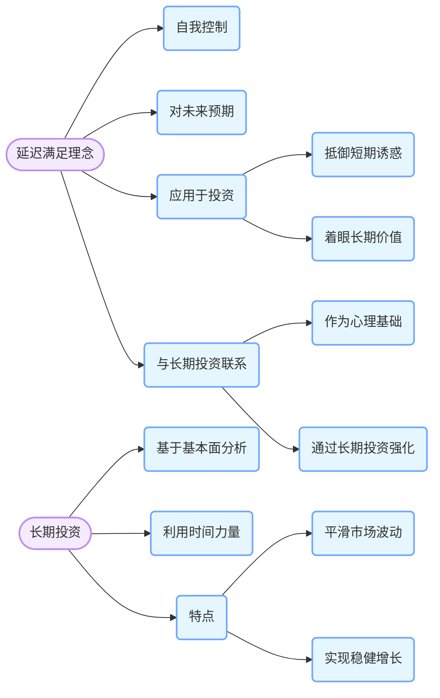

# 芒格的延迟满足理念：长期投资的心理基础

> 关键词：芒格、延迟满足理念、长期投资、心理基础、投资策略

> 摘要：本文深入探讨了芒格的延迟满足理念作为长期投资心理基础的重要性。从背景介绍入手，阐述了研究该理念的目的、范围以及预期读者等内容。详细解析了延迟满足理念和长期投资的核心概念及其联系，介绍了相关核心算法原理与操作步骤，通过数学模型和公式进行理论支撑，并给出实际案例。探讨了该理念在不同场景下的应用，推荐了学习该理念及进行长期投资的工具和资源。最后总结了未来发展趋势与挑战，解答常见问题并提供扩展阅读和参考资料，旨在帮助投资者深入理解延迟满足理念，更好地进行长期投资。

## 1. 背景介绍 
### 1.1 目的和范围
本研究的主要目的是深入剖析芒格的延迟满足理念与长期投资之间的紧密联系，揭示延迟满足理念作为长期投资心理基础的内在逻辑和重要性。通过对相关概念、算法、数学模型的探讨以及实际案例的分析，为投资者提供一套全面、系统的理论和实践指导，帮助他们在投资过程中更好地运用延迟满足理念，做出更明智的长期投资决策。
研究范围涵盖了延迟满足理念的理论基础、长期投资的策略和方法、两者之间的相互作用机制，以及在不同市场环境下的应用和实践。同时，还涉及到与该理念相关的学习资源、开发工具和研究成果等方面的内容。

### 1.2 预期读者
本文预期读者主要包括以下几类人群：
- 个人投资者：希望通过学习芒格的延迟满足理念，提升自己的投资心理素质，掌握长期投资的方法和技巧，实现资产的稳健增值。
- 金融从业者：如基金经理、投资顾问等，他们可以从本文中获取新的投资思路和理论支持，优化自己的投资策略和服务方案。
- 金融专业学生：通过阅读本文，加深对投资心理学和长期投资理论的理解，为未来从事金融行业打下坚实的基础。
- 对投资哲学和心理因素感兴趣的一般读者：他们可以了解到芒格的投资智慧和延迟满足理念在生活和投资中的应用，从中获得启示和思考。

### 1.3 文档结构概述
本文将按照以下结构进行组织：
- 核心概念与联系：介绍延迟满足理念和长期投资的核心概念，分析它们之间的内在联系，并通过文本示意图和 Mermaid 流程图进行直观展示。
- 核心算法原理 & 具体操作步骤：阐述与延迟满足和长期投资相关的核心算法原理，并用 Python 代码详细说明具体操作步骤。
- 数学模型和公式 & 详细讲解 & 举例说明：运用数学模型和公式对延迟满足和长期投资进行理论分析，并通过实际例子进行详细讲解。
- 项目实战：代码实际案例和详细解释说明：通过实际的投资项目案例，展示如何在实践中应用延迟满足理念和长期投资策略，并对代码进行详细解读和分析。
- 实际应用场景：探讨延迟满足理念和长期投资策略在不同市场环境和投资领域中的实际应用场景。
- 工具和资源推荐：推荐学习延迟满足理念和进行长期投资的相关书籍、在线课程、技术博客、开发工具、框架和库以及相关论文著作。
- 总结：未来发展趋势与挑战：总结延迟满足理念和长期投资的发展趋势，分析可能面临的挑战。
- 附录：常见问题与解答：解答读者在学习和实践过程中可能遇到的常见问题。
- 扩展阅读 & 参考资料：提供相关的扩展阅读材料和参考资料，方便读者进一步深入研究。

### 1.4 术语表
#### 1.4.1 核心术语定义
- 延迟满足理念：由心理学家沃尔特·米歇尔提出，指一种甘愿为更有价值的长远结果而放弃即时满足的抉择取向，以及在等待期中展示的自我控制能力。在投资领域，延迟满足理念表现为投资者愿意放弃短期的获利机会，等待长期更丰厚的回报。
- 长期投资：是指不满足短期投资条件的投资，即不准备在一年或长于一年的经营周期之内转变为现金的投资。长期投资通常基于对资产基本面的深入分析和对市场长期趋势的判断，追求资产的长期增值。

#### 1.4.2 相关概念解释
- 投资心理学：研究投资者在投资决策过程中的心理活动和行为规律的学科。它关注投资者的情绪、认知偏差、决策过程等因素对投资行为的影响，旨在帮助投资者更好地理解自己和其他投资者的行为，从而做出更理性的投资决策。
- 复利效应：是指在投资过程中，将所获得的利息或收益再次投入到本金中，使得下一期的收益不仅基于原始本金，还基于之前累积的收益。复利效应在长期投资中具有强大的威力，能够使资产实现指数级增长。

#### 1.4.3 缩略词列表
- ROI（Return on Investment）：投资回报率，是指通过投资而应返回的价值，即企业从一项投资活动中得到的经济回报。
- PE（Price-to-Earnings Ratio）：市盈率，是指股票价格除以每股收益的比率，它反映了市场对公司未来盈利的预期。

## 2. 核心概念与联系 

### 延迟满足理念的原理
延迟满足理念的核心在于个体能够克制即时的欲望和冲动，为了更长远、更有价值的目标而耐心等待。从心理学角度来看，这涉及到个体的自我控制能力和对未来的预期。具有良好延迟满足能力的人，能够更好地抵御短期诱惑，专注于长期目标的实现。

在投资领域，延迟满足理念表现为投资者不被短期市场波动所影响，不追求短期的暴利，而是着眼于资产的长期价值增长。例如，当市场出现短期下跌时，具有延迟满足意识的投资者不会急于抛售资产，而是相信资产的内在价值会在长期得到体现，选择继续持有。

### 长期投资的原理
长期投资基于对资产基本面和市场长期趋势的分析。通过深入研究公司的财务状况、行业竞争力、管理层能力等因素，投资者可以选择具有长期增长潜力的资产进行投资。长期投资的核心在于利用时间的力量，让资产的价值随着时间的推移而不断增长。

同时，长期投资还可以平滑市场波动的影响。由于市场短期波动具有不确定性，投资者很难准确预测短期市场走势。而长期投资可以通过分散投资和长期持有，降低短期波动对投资组合的影响，实现资产的稳健增长。

### 延迟满足理念与长期投资的联系
延迟满足理念是长期投资的心理基础。只有具备延迟满足能力的投资者，才能够在长期投资过程中保持耐心和定力，不被短期市场波动所左右。例如，在股票投资中，股票价格会受到市场情绪、宏观经济环境等多种因素的影响而出现短期波动。如果投资者缺乏延迟满足能力，很容易在股价下跌时恐慌抛售，从而错失长期上涨的机会。

反之，长期投资也是实践延迟满足理念的有效途径。通过长期投资，投资者可以亲身体验到延迟满足带来的回报，进一步强化延迟满足的意识和能力。例如，一位投资者长期持有某只优质股票，尽管在持有过程中股价经历了多次起伏，但最终获得了丰厚的回报。这种成功的投资经历会让投资者更加深刻地认识到延迟满足的重要性，从而在未来的投资中更加坚定地践行这一理念。

### 文本示意图
```plaintext
延迟满足理念
|
|-- 自我控制
|-- 对未来预期
|
|-- 应用于投资
|   |
|   |-- 抵御短期诱惑
|   |-- 着眼长期价值
|
|-- 与长期投资联系
|   |
|   |-- 作为心理基础
|   |-- 通过长期投资强化

长期投资
|
|-- 基于基本面分析
|-- 利用时间力量
|
|-- 特点
|   |
|   |-- 平滑市场波动
|   |-- 实现稳健增长
```

### Mermaid 流程图


## 3. 核心算法原理 & 具体操作步骤 

### 核心算法原理
在投资中，与延迟满足理念和长期投资相关的一个重要算法原理是复利计算。复利是指在每一个计息期后，将所生利息加入本金再计利息。复利的计算公式为：

$A = P(1 + r)^n$

其中：
- $A$ 表示最终的本利和
- $P$ 表示初始本金
- $r$ 表示每期的利率
- $n$ 表示期数

这个公式体现了复利效应的核心，即随着时间的推移，本金和利息会不断累积，从而实现资产的指数级增长。这也正是长期投资的魅力所在，通过长期持有资产，利用复利效应可以获得丰厚的回报。

### 具体操作步骤（Python 代码实现）
以下是一个简单的 Python 代码示例，用于演示复利计算的过程：

```python
def compound_interest(principal, rate, periods):
    """
    计算复利
    :param principal: 初始本金
    :param rate: 每期利率
    :param periods: 期数
    :return: 最终本利和
    """
    return principal * (1 + rate) ** periods

# 示例参数
initial_principal = 10000  # 初始本金为 10000 元
annual_interest_rate = 0.05  # 年利率为 5%
years = 10  # 投资期限为 10 年

# 计算最终本利和
final_amount = compound_interest(initial_principal, annual_interest_rate, years)

print(f"初始本金为 {initial_principal} 元，年利率为 {annual_interest_rate * 100}%，投资 {years} 年后的本利和为 {final_amount:.2f} 元。")
```

### 代码解释
- `compound_interest` 函数接受三个参数：`principal`（初始本金）、`rate`（每期利率）和 `periods`（期数）。
- 在函数内部，使用复利公式 $A = P(1 + r)^n$ 计算最终本利和，并将结果返回。
- 在主程序中，定义了初始本金、年利率和投资期限等参数，调用 `compound_interest` 函数计算最终本利和，并将结果打印输出。

通过这个简单的代码示例，我们可以看到复利效应在长期投资中的作用。随着投资期限的增加，最终的本利和会显著增长，这也说明了长期投资的重要性。

## 4. 数学模型和公式 & 详细讲解 & 举例说明 

### 复利模型
复利模型是长期投资中最基本的数学模型之一，其公式为：

$$A = P(1 + r)^n$$

其中：
- $A$ 是最终的本利和，即经过 $n$ 期投资后，本金和利息的总和。
- $P$ 是初始本金，也就是投资者最初投入的资金。
- $r$ 是每期的利率，表示每期投资所获得的收益率。
- $n$ 是期数，即投资的时间周期数。

### 详细讲解
复利的核心思想是将每一期所获得的利息加入本金，使得下一期的利息计算基于新的本金。这种利滚利的方式使得资产在长期内能够实现快速增长。

例如，假设你有 10000 元的初始本金，年利率为 5%，投资期限为 10 年。按照复利计算，第一年的本利和为：

$A_1 = 10000\times(1 + 0.05) = 10500$（元）

第二年的本利和是在第一年本利和的基础上计算的：

$A_2 = 10500\times(1 + 0.05) = 10000\times(1 + 0.05)^2 = 11025$（元）

以此类推，10 年后的本利和为：

$A_{10} = 10000\times(1 + 0.05)^{10} \approx 16288.95$（元）

可以看到，通过复利效应，10 年后的资产增长了约 62.89%。

### 举例说明
为了更直观地展示复利效应在长期投资中的作用，我们可以比较不同投资期限和利率下的投资回报。

| 初始本金（元） | 年利率 | 投资期限（年） | 最终本利和（元） | 增长比例 |
| --- | --- | --- | --- | --- |
| 10000 | 5% | 5 | $10000\times(1 + 0.05)^5 \approx 12762.82$ | 27.63% |
| 10000 | 5% | 10 | $10000\times(1 + 0.05)^{10} \approx 16288.95$ | 62.89% |
| 10000 | 8% | 10 | $10000\times(1 + 0.08)^{10} \approx 21589.25$ | 115.89% |

从这个例子可以看出，随着投资期限的增加和利率的提高，复利效应的效果更加明显。即使初始本金相同，不同的投资期限和利率也会导致最终回报的巨大差异。这也说明了在长期投资中，选择合适的投资标的和保持耐心的重要性。

### 其他相关数学模型
除了复利模型，在长期投资中还会用到一些其他的数学模型，如现值和终值模型。

现值模型用于计算未来一笔资金在当前时刻的价值，公式为：

$$PV = \frac{FV}{(1 + r)^n}$$

其中：
- $PV$ 是现值，即未来资金在当前时刻的价值。
- $FV$ 是终值，即未来某一时刻的资金金额。
- $r$ 是贴现率，通常可以理解为市场利率或投资者要求的回报率。
- $n$ 是期数。

终值模型则是在已知现值的情况下，计算未来某一时刻的资金金额，公式与复利公式相同：

$$FV = PV(1 + r)^n$$

这些数学模型在投资决策中都有着重要的应用，例如在评估投资项目的价值、计算投资回报率等方面。

## 5. 项目实战：代码实际案例和详细解释说明 

### 5.1  开发环境搭建
为了实现一个基于延迟满足理念的长期投资模拟项目，我们可以使用 Python 编程语言。以下是搭建开发环境的步骤：

#### 安装 Python
首先，你需要安装 Python 解释器。可以从 Python 官方网站（https://www.python.org/downloads/）下载适合你操作系统的 Python 版本，并按照安装向导进行安装。建议安装 Python 3.6 及以上版本。

#### 安装必要的库
在本项目中，我们将使用 `pandas` 库进行数据处理和分析，`matplotlib` 库进行数据可视化。可以使用以下命令来安装这些库：

```sh
pip install pandas matplotlib
```

### 5.2  源代码详细实现和代码解读
以下是一个简单的长期投资模拟项目的 Python 代码示例：

```python
import pandas as pd
import matplotlib.pyplot as plt

# 定义投资参数
initial_investment = 10000  # 初始投资金额
annual_contribution = 2000  # 每年追加投资金额
annual_return_rate = 0.07  # 年化收益率
investment_years = 30  # 投资年限

# 创建一个空的 DataFrame 用于存储每年的投资数据
investment_data = pd.DataFrame(columns=['Year', 'Investment', 'Value'])

# 初始化第一年的数据
investment_data.loc[0] = [1, initial_investment, initial_investment * (1 + annual_return_rate)]

# 模拟每年的投资情况
for year in range(2, investment_years + 1):
    previous_value = investment_data.loc[year - 2, 'Value']
    new_investment = previous_value + annual_contribution
    new_value = new_investment * (1 + annual_return_rate)
    investment_data.loc[year - 1] = [year, new_investment, new_value]

# 打印投资数据
print(investment_data)

# 绘制投资价值随时间变化的图表
plt.figure(figsize=(10, 6))
plt.plot(investment_data['Year'], investment_data['Value'], label='Investment Value')
plt.xlabel('Year')
plt.ylabel('Value ($)')
plt.title('Long-Term Investment Simulation')
plt.legend()
plt.grid(True)
plt.show()
```

### 5.3  代码解读与分析
#### 代码功能概述
这段代码模拟了一个长期投资的过程，考虑了初始投资和每年追加投资的情况，并根据给定的年化收益率计算每年的投资价值。最后，将投资数据打印输出，并绘制投资价值随时间变化的图表。

#### 代码详细解读
1. **导入必要的库**：导入 `pandas` 库用于数据处理和存储，`matplotlib.pyplot` 库用于数据可视化。
2. **定义投资参数**：设置初始投资金额、每年追加投资金额、年化收益率和投资年限。
3. **创建数据存储结构**：使用 `pandas` 的 `DataFrame` 创建一个空的数据表，用于存储每年的投资数据，包括年份、当年的投资总额和投资价值。
4. **初始化第一年的数据**：将第一年的投资数据添加到 `DataFrame` 中，计算第一年的投资价值。
5. **模拟每年的投资情况**：使用循环从第二年开始，根据上一年的投资价值和每年追加的投资金额计算当年的投资总额，再根据年化收益率计算当年的投资价值，并将数据添加到 `DataFrame` 中。
6. **打印投资数据**：将存储投资数据的 `DataFrame` 打印输出，方便查看每年的投资情况。
7. **绘制图表**：使用 `matplotlib` 绘制投资价值随时间变化的折线图，直观展示投资价值的增长趋势。

#### 分析
通过这个模拟项目，我们可以看到长期投资的效果。在给定的年化收益率下，随着时间的推移，投资价值不断增长。同时，每年追加的投资也进一步加速了资产的积累。这体现了延迟满足理念在长期投资中的重要性，投资者通过长期持有和持续投入，最终可以获得丰厚的回报。

## 6. 实际应用场景 
### 股票投资
在股票投资中，延迟满足理念和长期投资策略有着广泛的应用。许多优秀的公司在发展过程中会经历短期的业绩波动和市场调整，但从长期来看，它们的价值会不断增长。例如，苹果公司在过去几十年中，虽然经历了多次市场危机和产品研发的挫折，但凭借其强大的技术实力和品牌影响力，股价长期呈现上涨趋势。

投资者如果能够秉持延迟满足理念，不被短期的股价波动所左右，长期持有苹果公司的股票，就能够分享到公司成长带来的丰厚回报。相反，如果投资者过于关注短期股价的涨跌，频繁买卖股票，不仅可能错失长期上涨的机会，还会因为交易成本的增加而降低投资收益。

### 基金投资
基金投资也是适合应用延迟满足理念和长期投资策略的领域。基金经理通过专业的投资研究和资产配置，为投资者提供多样化的投资选择。对于普通投资者来说，选择一只优质的基金并长期持有，是实现资产稳健增长的有效方式。

例如，一些宽基指数基金，如沪深 300 指数基金，它跟踪沪深两市规模最大、流动性最好的 300 只股票，能够反映中国A股市场的整体走势。从长期来看，随着中国经济的发展，A股市场总体呈现上涨趋势，投资沪深 300 指数基金可以获得市场平均回报。投资者只需要定期定额投资，长期持有，就能够享受到市场增长带来的红利。

### 房地产投资
房地产投资同样需要延迟满足理念和长期投资策略。房地产市场的发展受到宏观经济、政策调控等多种因素的影响，价格波动相对较大。投资者在购买房产时，不能仅仅关注短期的房价涨跌，而应该从长期的角度考虑房产的价值。

例如，在一些经济发展潜力较大的城市，随着城市的扩张和人口的流入，房地产市场具有长期的升值空间。投资者购买房产后，可能在短期内无法获得显著的收益，但通过长期持有，房产的价值会随着城市的发展而不断提升。同时，房产还可以通过出租获得稳定的现金流，进一步增加投资回报。

### 养老规划
在养老规划中，延迟满足理念和长期投资策略尤为重要。养老是一个长期的目标，需要提前进行规划和储备资金。投资者可以通过定期定额投资养老基金、保险等金融产品，利用复利效应实现资产的长期增长。

例如，投资者从年轻时开始每月定期投资一定金额的养老基金，经过几十年的积累，到退休时就可以获得一笔可观的养老资金。在这个过程中，投资者需要克制短期的消费欲望，坚持长期投资，才能实现养老目标。

## 7. 工具和资源推荐
### 7.1 学习资源推荐
#### 7.1.1 书籍推荐
- 《穷查理宝典：查理·芒格的智慧箴言录》：这本书收录了查理·芒格的演讲、文章和访谈等内容，全面展现了他的投资理念、思维方式和人生智慧。通过阅读这本书，读者可以深入了解芒格的延迟满足理念和长期投资策略。
- 《聪明的投资者》：作者本杰明·格雷厄姆是价值投资理论的奠基人，这本书被誉为投资领域的圣经。书中强调了投资者应该具备的心理素质和投资原则，对理解延迟满足理念在投资中的应用具有重要的指导意义。
- 《漫步华尔街》：本书以通俗易懂的语言介绍了各种投资理论和投资方法，对长期投资策略进行了深入探讨。读者可以从中学习到如何在不同的市场环境下进行长期投资。

#### 7.1.2 在线课程
- Coursera 上的“投资学原理”课程：该课程由知名高校的教授授课，系统地介绍了投资学的基本原理和方法，包括资产定价、投资组合理论、风险管理等内容。通过学习这门课程，读者可以建立起扎实的投资理论基础。
- 网易云课堂上的“巴菲特投资理念与实战策略”课程：课程详细解读了巴菲特的投资理念和方法，包括价值投资、长期投资、安全边际等核心概念。同时，结合实际案例分析，帮助学员掌握如何运用这些理念进行投资决策。

#### 7.1.3 技术博客和网站
- 雪球网：这是一个知名的投资社区，汇聚了众多投资者和投资专家。在雪球网上，你可以关注投资大V的观点和分析，参与投资话题的讨论，了解市场动态和投资机会。
- 价值投资网：专注于价值投资领域，提供了丰富的投资研究报告、投资案例分析和投资工具。网站的内容质量较高，对深入学习延迟满足理念和长期投资策略有很大的帮助。

### 7.2 开发工具框架推荐
#### 7.2.1 IDE和编辑器
- PyCharm：是一款专门为 Python 开发设计的集成开发环境（IDE），具有强大的代码编辑、调试、代码分析等功能。在进行投资数据分析和模拟项目开发时，PyCharm 可以提高开发效率。
- Jupyter Notebook：是一个交互式的开发环境，支持 Python 等多种编程语言。它以网页的形式展示代码和运行结果，方便进行数据探索和可视化分析。在进行投资数据的可视化和模型验证时，Jupyter Notebook 是一个很好的选择。

#### 7.2.2 调试和性能分析工具
- PDB：Python 自带的调试器，可以帮助开发者在代码运行过程中进行调试，定位和解决问题。在开发投资模拟项目时，使用 PDB 可以快速找到代码中的错误和逻辑问题。
- cProfile：Python 的性能分析工具，可以分析代码的运行时间和函数调用情况。通过使用 cProfile，开发者可以找出代码中的性能瓶颈，进行优化。

#### 7.2.3 相关框架和库
- Pandas：是一个强大的数据处理和分析库，提供了高效的数据结构和数据操作方法。在进行投资数据处理和分析时，Pandas 可以帮助开发者快速处理大量的数据。
- NumPy：是 Python 的一个基础科学计算库，提供了高效的数组操作和数学函数。在进行投资模型的计算和模拟时，NumPy 可以提高计算效率。
- Matplotlib：是一个用于数据可视化的库，提供了丰富的绘图功能。在展示投资数据和分析结果时，Matplotlib 可以绘制出直观、美观的图表。

### 7.3 相关论文著作推荐
#### 7.3.1 经典论文
- 《证券分析》（Security Analysis）：由本杰明·格雷厄姆和戴维·多德所著，是价值投资领域的经典论文。论文提出了价值投资的基本理念和方法，对后世的投资理论和实践产生了深远的影响。
- 《有效市场假说》（Efficient Market Hypothesis）：由尤金·法玛提出，该理论认为市场价格已经反映了所有可用的信息，投资者无法通过分析历史数据或其他信息获得超额收益。虽然该理论存在一定的争议，但对理解市场的有效性和投资策略的制定具有重要的参考价值。

#### 7.3.2 最新研究成果
- 《行为金融学》领域的相关研究：行为金融学结合了心理学和金融学的理论，研究投资者的心理和行为对金融市场的影响。近年来，该领域取得了许多新的研究成果，如投资者的认知偏差、情绪对投资决策的影响等。这些研究成果可以帮助投资者更好地理解自己和其他投资者的行为，从而做出更理性的投资决策。
- 《量化投资》领域的最新研究：量化投资利用数学模型和计算机技术进行投资决策，近年来得到了广泛的应用和发展。相关的研究成果包括量化投资策略的优化、风险管理模型的改进等。

#### 7.3.3 应用案例分析
- 《投资案例集》：收集了各种不同类型的投资案例，包括股票投资、基金投资、房地产投资等。通过分析这些案例，读者可以学习到不同投资策略的应用和实践经验，以及如何在实际投资中运用延迟满足理念和长期投资策略。

## 8. 总结：未来发展趋势与挑战
### 未来发展趋势
#### 科技赋能投资决策
随着人工智能、大数据、区块链等技术的不断发展，未来投资决策将更加智能化和科学化。例如，人工智能算法可以通过对海量金融数据的分析和挖掘，为投资者提供更精准的投资建议；区块链技术可以提高金融交易的透明度和安全性，降低投资风险。

#### 社会责任投资兴起
投资者越来越关注企业的社会责任和可持续发展能力，社会责任投资（SRI）将成为未来投资的一个重要趋势。社会责任投资不仅追求经济回报，还注重投资对社会和环境的影响。例如，投资者会更倾向于投资那些在环境保护、社会公益等方面表现良好的企业。

#### 全球资产配置多元化
随着全球化的深入发展，投资者将更加注重全球资产配置的多元化。通过投资不同国家和地区的资产，可以降低单一市场的风险，提高投资组合的稳定性。同时，新兴市场的经济增长潜力也吸引着越来越多的投资者进行全球资产配置。

### 挑战
#### 市场不确定性增加
全球经济形势的复杂性和不确定性不断增加，如贸易摩擦、地缘政治冲突、疫情等因素都会对金融市场产生重大影响。投资者需要面对更加复杂多变的市场环境，准确判断市场趋势变得更加困难。

#### 投资者心理压力增大
在市场波动频繁的情况下，投资者容易受到情绪的影响，产生恐慌、贪婪等心理偏差。这些心理偏差可能导致投资者做出错误的投资决策，影响投资收益。如何保持冷静和理性，克服心理压力，是投资者面临的一大挑战。

#### 技术应用风险
虽然科技为投资带来了诸多便利和机遇，但也存在一定的风险。例如，人工智能算法可能存在模型误差和数据偏差，导致投资建议不准确；区块链技术在应用过程中也可能面临安全漏洞和监管难题。投资者需要正确认识和应对这些技术应用风险。

## 9. 附录：常见问题与解答
### 问题 1：延迟满足理念是否意味着完全不考虑短期收益？
解答：延迟满足理念并不意味着完全不考虑短期收益。在投资过程中，短期收益可以作为一种参考，但不应成为投资决策的主要依据。投资者应该在关注长期价值的前提下，合理评估短期收益的情况。例如，当短期市场出现明显的投资机会时，投资者可以适当把握，但不能为了追求短期收益而忽视长期投资目标。

### 问题 2：长期投资是否适用于所有投资者？
解答：长期投资并不适用于所有投资者。长期投资需要投资者具备一定的资金实力、风险承受能力和投资耐心。对于一些短期资金需求较大、风险承受能力较低的投资者来说，长期投资可能并不适合。例如，即将面临购房、子女教育等大额支出的投资者，可能需要更注重资金的流动性和安全性，选择短期投资或低风险投资产品。

### 问题 3：如何培养延迟满足能力？
解答：培养延迟满足能力可以从以下几个方面入手：
- 设定明确的目标：明确自己的长期投资目标和人生目标，将短期行为与长期目标联系起来，增强对延迟满足的动力。
- 制定计划和规则：制定详细的投资计划和规则，并严格遵守。例如，设定每月的投资金额和投资频率，避免随意更改投资计划。
- 进行自我监督和反思：定期对自己的投资行为进行监督和反思，分析自己是否在投资过程中能够克制短期诱惑，坚持长期投资策略。如果发现自己存在问题，及时进行调整和改进。
- 学习和借鉴他人经验：学习成功投资者的经验和故事，了解他们是如何运用延迟满足理念进行投资的，从中获得启示和激励。

### 问题 4：在长期投资过程中，如何应对市场的大幅波动？
解答：在长期投资过程中，市场大幅波动是不可避免的。投资者可以采取以下措施应对：
- 保持冷静和理性：不要被市场情绪所左右，避免在市场波动时做出冲动的投资决策。要相信长期投资的价值，坚持自己的投资策略。
- 分散投资：通过投资不同类型的资产，如股票、债券、基金、房地产等，分散投资风险。当某一类资产价格下跌时，其他资产可能会起到缓冲作用，降低投资组合的整体波动。
- 定期调整投资组合：根据市场情况和自己的投资目标，定期调整投资组合的资产配置比例。例如，当股票市场估值过高时，可以适当减少股票投资比例，增加债券等固定收益类资产的投资比例。
- 持续投入：在市场下跌时，不要停止投资，反而可以适当增加投资金额。通过定期定额投资的方式，在市场低位买入更多的资产，降低平均成本，提高长期投资回报。

## 10. 扩展阅读 & 参考资料
### 扩展阅读
- 《投资最重要的事》：作者霍华德·马克斯分享了自己在投资领域的经验和见解，强调了投资中的风险管理和逆向思维。
- 《财务自由之路》：介绍了实现财务自由的方法和策略，包括投资规划、资产配置、债务管理等方面的内容。
- 《金融炼金术》：乔治·索罗斯的著作，阐述了他的反身性理论和投资哲学，对理解金融市场的运行机制有很大的帮助。

### 参考资料
- 查理·芒格的演讲和文章：可以通过查理·芒格的官方网站或相关书籍收集他的演讲和文章，深入研究他的投资理念和思维方式。
- 金融学术期刊：如《金融研究》、《经济学季刊》等，这些期刊发表了许多关于投资理论和实践的研究论文，可以为深入学习提供理论支持。
- 金融机构的研究报告：各大金融机构定期发布的研究报告，如券商的宏观经济研究报告、行业研究报告等，对了解市场动态和投资机会有很大的帮助。

作者：AI天才研究院/AI Genius Institute & 禅与计算机程序设计艺术 /Zen And The Art of Computer Programming