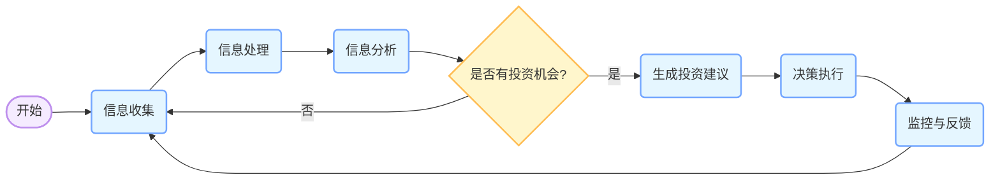

# 菲利普·费雪的信息网络：如何建立投资情报系统

> 关键词：菲利普·费雪、信息网络、投资情报系统、投资分析、信息收集

> 摘要：本文深入探讨了菲利普·费雪的信息网络理念，详细阐述了如何建立投资情报系统。从背景介绍入手，解释了相关核心概念及其联系，分析了核心算法原理与操作步骤，引入数学模型进行详细讲解和举例说明。通过项目实战给出代码实际案例并进行解读，介绍了该系统的实际应用场景，推荐了学习所需的工具和资源，最后总结了未来发展趋势与挑战，解答了常见问题并提供扩展阅读与参考资料，旨在帮助投资者构建有效的投资情报系统，提升投资决策的科学性和准确性。

## 1. 背景介绍 
### 1.1 目的和范围
菲利普·费雪是投资领域的传奇人物，他强调通过广泛而深入的信息收集和分析来做出明智的投资决策。建立投资情报系统的目的在于为投资者提供全面、准确、及时的信息，帮助他们识别有潜力的投资机会，评估投资风险，从而优化投资组合，实现资产的增值。本文章的范围涵盖了从投资情报系统的概念理解到实际构建和应用的全过程，包括信息收集、处理、分析以及如何利用这些信息进行投资决策等方面。

### 1.2 预期读者
本文的预期读者主要包括个人投资者、专业投资机构的从业者、金融分析师以及对投资领域感兴趣的学生和研究人员。无论是初涉投资领域的新手，还是有一定经验的专业人士，都能从本文中获取有关建立投资情报系统的有价值信息，提升自己的投资分析能力。

### 1.3 文档结构概述
本文将按照以下结构进行阐述：首先介绍相关的核心概念，明确投资情报系统的基本构成和各部分之间的联系；接着讲解构建投资情报系统的核心算法原理和具体操作步骤，并通过 Python 代码进行详细说明；引入数学模型来量化投资分析过程，并举例说明其应用；通过项目实战展示如何在实际中实现投资情报系统，包括开发环境搭建、源代码实现和代码解读；介绍投资情报系统的实际应用场景；推荐学习该系统所需的工具和资源；最后总结未来发展趋势与挑战，解答常见问题并提供扩展阅读与参考资料。

### 1.4 术语表
#### 1.4.1 核心术语定义
- **投资情报系统**：是一个综合性的信息管理系统，它通过收集、整理、分析和传播与投资相关的各种信息，为投资者提供决策支持。
- **信息网络**：指的是投资者为了获取投资信息而建立的各种渠道和关系的集合，包括与企业管理层、行业专家、供应商、客户等的联系。
- **基本面分析**：通过对公司的财务状况、经营业绩、行业竞争力等基本因素进行分析，评估公司的内在价值和投资潜力。
- **技术分析**：通过研究股票价格和交易量的历史数据，预测股票价格的未来走势。

#### 1.4.2 相关概念解释
- **信息收集**：是指从各种渠道获取与投资相关的信息，如公司公告、新闻报道、行业研究报告等。
- **信息处理**：对收集到的信息进行筛选、分类、整理和存储，以便后续的分析和使用。
- **信息分析**：运用各种分析方法和工具，对处理后的信息进行深入研究，挖掘其中的投资价值和风险。
- **投资决策**：根据信息分析的结果，结合投资者的风险偏好和投资目标，做出具体的投资选择。

#### 1.4.3 缩略词列表
- **PE**：市盈率（Price-to-Earnings Ratio），是指股票价格与每股收益的比率，用于评估股票的估值水平。
- **PB**：市净率（Price-to-Book Ratio），是指股票价格与每股净资产的比率，反映了股票的市场价格相对于其账面价值的倍数。
- **ROE**：净资产收益率（Return on Equity），是指公司净利润与净资产的比率，衡量了公司运用自有资本的效率。

## 2. 核心概念与联系 
### 核心概念原理
菲利普·费雪的信息网络强调通过广泛的人际关系和多渠道的信息收集来获取有价值的投资情报。投资情报系统的核心原理在于整合各种信息源，将不同类型的信息进行有效的处理和分析，以支持投资决策。该系统主要由信息收集模块、信息处理模块、信息分析模块和决策支持模块组成。

信息收集模块负责从各种渠道收集与投资相关的信息，包括公司内部信息（如财务报表、管理层访谈）和外部信息（如行业动态、宏观经济数据）。信息处理模块对收集到的信息进行清洗、分类和存储，使其便于后续的分析。信息分析模块运用各种分析方法，如基本面分析、技术分析等，对处理后的信息进行深入研究，挖掘投资机会和风险。决策支持模块根据信息分析的结果，为投资者提供具体的投资建议。

### 架构的文本示意图
```plaintext
投资情报系统
|-- 信息收集模块
|   |-- 公司内部信息
|   |   |-- 财务报表
|   |   |-- 管理层访谈
|   |-- 外部信息
|       |-- 行业动态
|       |-- 宏观经济数据
|-- 信息处理模块
|   |-- 信息清洗
|   |-- 信息分类
|   |-- 信息存储
|-- 信息分析模块
|   |-- 基本面分析
|   |   |-- 财务指标分析
|   |   |-- 行业竞争力分析
|   |-- 技术分析
|       |-- 价格走势分析
|       |-- 交易量分析
|-- 决策支持模块
|   |-- 投资建议生成
|   |-- 风险评估
```

### Mermaid 流程图


## 3. 核心算法原理 & 具体操作步骤 
### 核心算法原理
在投资情报系统中，核心算法主要用于信息分析和投资决策。其中，基本面分析的核心算法是通过计算各种财务指标来评估公司的内在价值，如市盈率（PE）、市净率（PB）、净资产收益率（ROE）等。技术分析的核心算法则是通过对股票价格和交易量的历史数据进行统计分析，预测股票价格的未来走势，如移动平均线、相对强弱指标（RSI）等。

### 具体操作步骤
#### 信息收集
- **公司内部信息**：可以通过查阅公司的官方网站、证券交易所披露的公告、财务报表等获取。
- **外部信息**：可以通过新闻媒体、行业协会网站、专业研究机构报告等渠道获取。

#### 信息处理
- **信息清洗**：去除重复、错误和无关的信息。
- **信息分类**：将信息按照不同的主题和类型进行分类，如财务信息、行业信息、宏观经济信息等。
- **信息存储**：将处理后的信息存储到数据库中，以便后续的查询和分析。

#### 信息分析
- **基本面分析**：
    - 计算财务指标：使用 Python 代码计算公司的市盈率、市净率、净资产收益率等指标。
    - 行业竞争力分析：比较公司与同行业其他公司的财务指标和经营业绩，评估公司的行业竞争力。
- **技术分析**：
    - 计算技术指标：使用 Python 代码计算移动平均线、相对强弱指标等技术指标。
    - 价格走势分析：通过绘制股票价格和技术指标的图表，分析股票价格的走势和趋势。

#### 决策支持
- 根据信息分析的结果，结合投资者的风险偏好和投资目标，生成具体的投资建议。
- 对投资建议进行风险评估，评估投资的潜在风险和收益。

### Python 源代码实现
```python
import pandas as pd
import numpy as np
import matplotlib.pyplot as plt

# 模拟获取财务数据
data = {
    '营业收入': [100, 120, 150, 180],
    '净利润': [20, 25, 30, 35],
    '净资产': [100, 110, 120, 130]
}
df = pd.DataFrame(data)

# 计算财务指标
df['市盈率'] = df['营业收入'] / df['净利润']
df['市净率'] = df['营业收入'] / df['净资产']
df['净资产收益率'] = df['净利润'] / df['净资产']

# 打印财务指标
print(df[['市盈率', '市净率', '净资产收益率']])

# 绘制市盈率走势图
plt.plot(df['市盈率'])
plt.xlabel('时间')
plt.ylabel('市盈率')
plt.title('市盈率走势图')
plt.show()
```
上述代码首先模拟获取了公司的财务数据，然后计算了市盈率、市净率和净资产收益率等财务指标，并将结果存储在 DataFrame 中。最后，绘制了市盈率的走势图，帮助投资者直观地了解公司市盈率的变化趋势。

## 4. 数学模型和公式 & 详细讲解 & 举例说明 
### 基本面分析数学模型和公式
#### 市盈率（PE）
$$PE = \frac{P}{E}$$
其中，$P$ 表示股票价格，$E$ 表示每股收益。市盈率反映了投资者为了获得公司每一元盈利所愿意支付的价格。一般来说，市盈率越低，股票的估值越低，投资价值越高。

#### 市净率（PB）
$$PB = \frac{P}{B}$$
其中，$P$ 表示股票价格，$B$ 表示每股净资产。市净率反映了股票价格相对于每股净资产的倍数。一般来说，市净率越低，股票的投资价值越高。

#### 净资产收益率（ROE）
$$ROE = \frac{Net Income}{Shareholders' Equity}$$
其中，$Net Income$ 表示净利润，$Shareholders' Equity$ 表示股东权益。净资产收益率衡量了公司运用自有资本的效率，ROE 越高，说明公司的盈利能力越强。

### 技术分析数学模型和公式
#### 移动平均线（MA）
移动平均线是一种常用的技术分析工具，它通过计算一定时期内股票价格的平均值来平滑价格波动，反映股票价格的趋势。计算公式如下：
$$MA_n = \frac{\sum_{i=0}^{n-1}P_i}{n}$$
其中，$MA_n$ 表示 $n$ 日移动平均线，$P_i$ 表示第 $i$ 日的股票价格，$n$ 表示计算移动平均线的天数。

#### 相对强弱指标（RSI）
相对强弱指标是一种衡量股票价格涨跌强度的技术指标，计算公式如下：
$$RSI = 100 - \frac{100}{1 + RS}$$
其中，$RS$ 表示相对强度，计算公式为：
$$RS = \frac{Average Gain}{Average Loss}$$
$Average Gain$ 表示一定时期内股票价格上涨的平均幅度，$Average Loss$ 表示一定时期内股票价格下跌的平均幅度。

### 举例说明
假设某公司的股票价格为 20 元，每股收益为 2 元，每股净资产为 10 元，则该公司的市盈率为：
$$PE = \frac{20}{2} = 10$$
市净率为：
$$PB = \frac{20}{10} = 2$$
如果该公司的净利润为 1000 万元，股东权益为 5000 万元，则该公司的净资产收益率为：
$$ROE = \frac{1000}{5000} = 0.2 = 20\%$$

假设某股票的 5 日收盘价分别为 10 元、11 元、12 元、11 元、10 元，则该股票的 5 日移动平均线为：
$$MA_5 = \frac{10 + 11 + 12 + 11 + 10}{5} = 10.8$$

## 5. 项目实战：代码实际案例和详细解释说明 
### 5.1  开发环境搭建
#### 操作系统
建议使用 Windows、Linux 或 macOS 操作系统。

#### Python 环境
安装 Python 3.x 版本，可以从 Python 官方网站（https://www.python.org/downloads/）下载并安装。

#### 第三方库
安装以下第三方库：
- `pandas`：用于数据处理和分析。
- `numpy`：用于科学计算。
- `matplotlib`：用于数据可视化。
可以使用以下命令进行安装：
```sh
pip install pandas numpy matplotlib
```

### 5.2  源代码详细实现和代码解读
```python
import pandas as pd
import numpy as np
import matplotlib.pyplot as plt

# 模拟获取股票价格数据
data = {
    '日期': pd.date_range(start='2023-01-01', periods=30),
    '收盘价': np.random.randint(50, 100, 30)
}
df = pd.DataFrame(data)

# 计算 5 日移动平均线
df['5日移动平均线'] = df['收盘价'].rolling(window=5).mean()

# 绘制股票价格和 5 日移动平均线走势图
plt.plot(df['日期'], df['收盘价'], label='收盘价')
plt.plot(df['日期'], df['5日移动平均线'], label='5日移动平均线')
plt.xlabel('日期')
plt.ylabel('价格')
plt.title('股票价格和 5 日移动平均线走势图')
plt.legend()
plt.show()
```
### 代码解读与分析
1. **数据获取**：使用 `pandas` 库模拟获取了 30 天的股票收盘价数据，并将其存储在 DataFrame 中。
2. **移动平均线计算**：使用 `rolling()` 方法计算了 5 日移动平均线，并将结果存储在新的列中。
3. **数据可视化**：使用 `matplotlib` 库绘制了股票收盘价和 5 日移动平均线的走势图，帮助投资者直观地观察股票价格的走势和趋势。

## 6. 实际应用场景 
### 个人投资者
个人投资者可以利用投资情报系统收集和分析股票、基金、债券等投资产品的信息，制定合理的投资计划，降低投资风险，提高投资收益。例如，通过基本面分析筛选出具有潜力的公司，通过技术分析确定买入和卖出的时机。

### 专业投资机构
专业投资机构可以利用投资情报系统进行大规模的投资分析和决策，管理投资组合，优化资产配置。例如，基金公司可以通过投资情报系统对不同行业和公司进行研究，选择优质的投资标的，为基金投资者创造更好的回报。

### 金融分析师
金融分析师可以利用投资情报系统进行市场研究和分析，撰写研究报告，为投资者提供专业的投资建议。例如，证券分析师可以通过对上市公司的财务报表和行业动态进行分析，评估公司的投资价值，为投资者提供买入、持有或卖出的建议。

## 7. 工具和资源推荐
### 7.1 学习资源推荐
#### 7.1.1 书籍推荐
- 《怎样选择成长股》（菲利普·费雪著）：菲利普·费雪的经典著作，详细介绍了他的投资理念和方法，对建立投资情报系统具有重要的指导意义。
- 《聪明的投资者》（本杰明·格雷厄姆著）：价值投资的经典之作，阐述了价值投资的基本原理和方法，对投资分析和决策具有重要的参考价值。
- 《金融市场技术分析》（约翰·墨菲著）：技术分析的权威著作，介绍了各种技术分析工具和方法，对股票、期货、外汇等市场的分析具有重要的指导作用。

#### 7.1.2 在线课程
- Coursera 上的“投资学原理”课程：由知名高校的教授授课，系统地介绍了投资学的基本原理和方法。
- 网易云课堂上的“股票投资实战技巧”课程：结合实际案例，介绍了股票投资的实战技巧和方法。

#### 7.1.3 技术博客和网站
- 雪球网：国内知名的投资社区，提供股票、基金、债券等投资产品的信息和分析，投资者可以在上面交流投资经验和心得。
- 东方财富网：提供全面的金融信息和数据，包括股票行情、财经新闻、研究报告等，是投资者获取信息的重要渠道。

### 7.2 开发工具框架推荐
#### 7.2.1 IDE和编辑器
- PyCharm：功能强大的 Python 集成开发环境，提供代码编辑、调试、版本控制等功能，适合开发复杂的 Python 项目。
- Jupyter Notebook：交互式的开发环境，支持 Python、R 等多种编程语言，适合进行数据探索和分析。

#### 7.2.2 调试和性能分析工具
- PySnooper：简单易用的 Python 调试工具，可以实时监控函数的执行过程和变量的值。
- cProfile：Python 自带的性能分析工具，可以分析程序的运行时间和函数调用情况，帮助优化程序性能。

#### 7.2.3 相关框架和库
- Pandas：强大的数据处理和分析库，提供了 DataFrame 等数据结构，方便进行数据清洗、分类和计算。
- Numpy：用于科学计算的库，提供了高效的数组操作和数学函数，是数据分析和机器学习的基础库。
- Matplotlib：用于数据可视化的库，提供了丰富的绘图函数和工具，能够绘制各种类型的图表。

### 7.3 相关论文著作推荐
#### 7.3.1 经典论文
- 《资本资产定价模型：市场均衡的理论》（威廉·夏普著）：提出了资本资产定价模型（CAPM），为投资组合理论和资产定价提供了重要的理论基础。
- 《有效资本市场：理论与实证研究综述》（尤金·法玛著）：提出了有效市场假说，对金融市场的效率和定价机制进行了深入研究。

#### 7.3.2 最新研究成果
- 近年来，随着人工智能和大数据技术的发展，越来越多的研究开始将这些技术应用于投资领域，如利用机器学习算法进行股票价格预测、风险评估等。可以关注《Journal of Financial Economics》、《Review of Financial Studies》等学术期刊上的相关研究成果。

#### 7.3.3 应用案例分析
- 一些知名投资机构的年度报告和研究报告中通常会包含投资策略和案例分析，可以从中学习到实际的投资经验和方法。例如，巴菲特的伯克希尔·哈撒韦公司的年度报告就是投资者学习的宝贵资源。

## 8. 总结：未来发展趋势与挑战
### 未来发展趋势
- **智能化**：随着人工智能技术的不断发展，投资情报系统将越来越智能化。机器学习、深度学习等算法将被广泛应用于信息分析和投资决策，提高投资决策的准确性和效率。
- **大数据化**：数据量的不断增长和数据来源的多样化将推动投资情报系统向大数据化方向发展。系统将能够处理和分析更多类型的信息，如社交媒体数据、卫星图像数据等，为投资者提供更全面的信息支持。
- **个性化**：不同投资者的风险偏好、投资目标和投资经验各不相同，未来的投资情报系统将更加注重个性化服务。系统将根据投资者的个人情况提供定制化的投资建议和服务。

### 挑战
- **数据质量和安全**：投资情报系统依赖于大量的数据，数据的质量和安全直接影响系统的性能和可靠性。如何确保数据的准确性、完整性和安全性是一个重要的挑战。
- **算法复杂度和解释性**：随着人工智能算法的不断复杂，算法的解释性变得越来越重要。投资者需要了解算法的决策过程和依据，以便做出合理的投资决策。如何提高算法的解释性是一个亟待解决的问题。
- **监管和合规**：投资领域受到严格的监管，投资情报系统的开发和应用需要遵守相关的法律法规。如何确保系统的合规性是一个重要的挑战。

## 9. 附录：常见问题与解答
### 如何选择合适的信息来源？
选择信息来源时，应考虑信息的准确性、及时性、全面性和可靠性。可以选择官方渠道、专业机构和权威媒体发布的信息，同时要注意信息的交叉验证，避免单一信息来源带来的偏差。

### 如何评估投资情报系统的性能？
可以从信息收集的全面性、信息处理的准确性、信息分析的有效性和决策支持的可靠性等方面评估投资情报系统的性能。同时，可以通过实际投资效果来验证系统的性能。

### 投资情报系统能否保证投资盈利？
投资情报系统只是为投资者提供决策支持，不能保证投资盈利。投资决策还受到市场环境、宏观经济因素、公司经营状况等多种因素的影响，投资者需要综合考虑各种因素，做出合理的投资决策。

## 10. 扩展阅读 & 参考资料
### 扩展阅读
- 《彼得·林奇的成功投资》（彼得·林奇著）：介绍了彼得·林奇的投资理念和方法，对投资者具有重要的启发作用。
- 《穷查理宝典》（查理·芒格著）：收录了查理·芒格的演讲和文章，阐述了他的投资哲学和多元思维模型。

### 参考资料
- 菲利普·费雪的相关著作和演讲
- 金融学术期刊上的相关研究论文
- 投资机构发布的研究报告和年度报告

作者：AI天才研究院/AI Genius Institute & 禅与计算机程序设计艺术 /Zen And The Art of Computer Programming