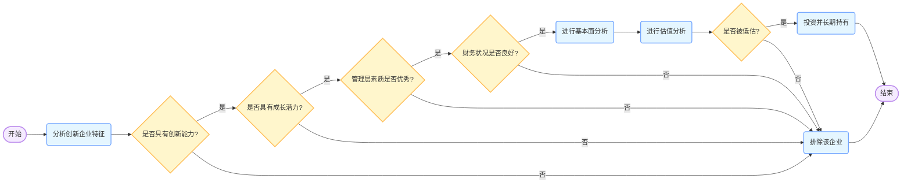

# 菲利普·费雪的创新企业投资准则

> 关键词：菲利普·费雪、创新企业、投资准则、成长股投资、基本面分析

> 摘要：本文围绕菲利普·费雪的创新企业投资准则展开深入探讨。首先介绍了菲利普·费雪及其投资理念的背景，阐述了其对创新企业投资的重要意义。接着详细解析了核心概念，包括创新企业的定义、特征以及与投资的联系，并通过流程图直观呈现。然后分析了核心算法原理，虽投资并非严格算法，但给出了投资分析的步骤和 Python 示例代码。还介绍了相关数学模型和公式，用于评估创新企业的价值。通过项目实战，展示了如何在实际中运用这些准则进行投资分析。之后探讨了实际应用场景，以及推荐了学习相关知识的工具和资源。最后总结了未来创新企业投资的发展趋势与挑战，解答了常见问题并提供了扩展阅读和参考资料，旨在帮助投资者更好地理解和运用菲利普·费雪的创新企业投资准则。

## 1. 背景介绍 
### 1.1 目的和范围
菲利普·费雪是投资领域的传奇人物，他所提出的创新企业投资准则对投资者具有深远的指导意义。本文的目的在于深入剖析费雪的创新企业投资准则，详细阐述其核心概念、算法原理、数学模型等内容，并通过项目实战和实际应用场景的分析，帮助投资者更好地理解和运用这些准则进行创新企业的投资决策。本文的范围涵盖了对创新企业投资准则的全面解读，从理论到实践，涉及投资分析的各个方面。

### 1.2 预期读者
本文预期读者主要包括对投资领域感兴趣的个人投资者、专业投资机构从业者、金融专业的学生以及希望深入了解创新企业投资的相关人士。无论是初涉投资领域的新手，还是有一定投资经验的专业人士，都能从本文中获得有价值的信息和启示。

### 1.3 文档结构概述
本文将按照以下结构进行阐述：首先介绍菲利普·费雪创新企业投资准则的背景信息，包括目的、预期读者和文档结构。接着深入解析核心概念，明确创新企业的定义和特征，以及它们与投资的联系，并通过流程图进行直观展示。然后探讨核心算法原理，用 Python 代码说明投资分析的步骤。之后介绍相关数学模型和公式，帮助投资者评估创新企业的价值。通过项目实战，详细展示如何在实际中运用这些准则进行投资分析。再分析实际应用场景，展示投资准则在不同情况下的应用。推荐学习相关知识的工具和资源，包括书籍、在线课程、开发工具等。最后总结未来创新企业投资的发展趋势与挑战，解答常见问题并提供扩展阅读和参考资料。

### 1.4 术语表
#### 1.4.1 核心术语定义
- **创新企业**：指在技术、产品、服务、商业模式等方面具有创新性，能够创造新的市场需求或显著提升现有市场效率的企业。这些企业通常具有较高的研发投入、独特的技术或商业模式，并且具有较大的成长潜力。
- **成长股投资**：一种投资策略，重点关注具有持续盈利增长潜力的股票。投资者通过分析企业的基本面，如盈利增长、市场份额扩大、创新能力等，选择具有较高成长潜力的企业进行投资，以期获得长期的资本增值。
- **基本面分析**：通过研究企业的财务状况、经营业绩、行业前景等基本因素，评估企业的内在价值和投资潜力的分析方法。基本面分析的内容包括财务报表分析、行业竞争分析、管理层评估等。

#### 1.4.2 相关概念解释
- **研发投入**：企业为了开展研发活动而投入的资金，包括人力、物力和财力等方面的支出。研发投入是衡量企业创新能力的重要指标之一，较高的研发投入通常意味着企业更注重技术创新和产品升级。
- **市场份额**：企业的产品或服务在市场中所占的比例。市场份额反映了企业在行业中的竞争地位，较高的市场份额通常意味着企业具有更强的竞争力和盈利能力。
- **客户满意度**：客户对企业产品或服务的满意程度。客户满意度是衡量企业产品质量和服务水平的重要指标，较高的客户满意度有助于企业保持客户忠诚度，促进业务的持续增长。

#### 1.4.3 缩略词列表
- **PE**：市盈率（Price-to-Earnings Ratio），是指股票价格与每股收益的比率，用于衡量股票的估值水平。
- **ROE**：净资产收益率（Return on Equity），是指企业净利润与净资产的比率，用于衡量企业运用自有资本的效率和盈利能力。
- **EPS**：每股收益（Earnings Per Share），是指企业净利润与发行在外普通股股数的比率，用于衡量企业的盈利能力和股东的回报水平。

## 2. 核心概念与联系 
### 核心概念原理
菲利普·费雪的创新企业投资准则基于对创新企业的深入理解和分析。创新企业是推动经济发展和社会进步的重要力量，它们通过不断创新，创造新的市场需求，提高生产效率，从而实现快速成长。费雪认为，投资创新企业的关键在于寻找那些具有长期竞争优势和成长潜力的企业，并长期持有其股票。

创新企业通常具有以下特征：
1. **创新能力**：拥有独特的技术、产品或商业模式，能够不断推出具有竞争力的新产品或服务。
2. **成长潜力**：由于创新带来的市场需求增长和效率提升，企业具有较大的成长空间。
3. **管理层素质**：拥有优秀的管理层，能够制定正确的战略规划，有效地组织和管理企业的运营。
4. **财务状况**：具有良好的财务状况，包括稳定的现金流、合理的资产负债结构和较高的盈利能力。

### 架构的文本示意图
```plaintext
创新企业投资准则
|-- 创新企业特征
|   |-- 创新能力
|   |-- 成长潜力
|   |-- 管理层素质
|   |-- 财务状况
|-- 投资分析方法
|   |-- 基本面分析
|   |   |-- 财务报表分析
|   |   |-- 行业竞争分析
|   |   |-- 管理层评估
|   |-- 估值分析
|   |   |-- 市盈率法
|   |   |-- 现金流折现法
|-- 投资决策与策略
|   |-- 选择具有长期竞争优势的企业
|   |-- 长期持有股票
```

### Mermaid 流程图


## 3. 核心算法原理 & 具体操作步骤 
### 核心算法原理
虽然投资创新企业并非严格意义上的算法问题，但可以通过一系列的分析步骤来筛选和评估企业。核心思想是通过对企业的基本面进行全面分析，评估其创新能力、成长潜力、管理层素质和财务状况，然后运用估值方法确定企业的合理价值，最后根据估值结果做出投资决策。

### 具体操作步骤
1. **收集企业信息**：收集创新企业的相关信息，包括财务报表、行业报告、新闻资讯等。
2. **分析企业基本面**：
    - **财务报表分析**：分析企业的资产负债表、利润表和现金流量表，评估企业的盈利能力、偿债能力和运营能力。
    - **行业竞争分析**：了解企业所处行业的竞争格局、市场规模和发展趋势，评估企业在行业中的竞争地位。
    - **管理层评估**：评估企业管理层的能力、经验和诚信度，了解管理层的战略规划和决策能力。
3. **评估企业创新能力**：分析企业的研发投入、专利数量、新产品推出情况等，评估企业的创新能力和技术实力。
4. **预测企业成长潜力**：根据企业的历史业绩、行业前景和创新能力，预测企业未来的盈利增长和市场份额扩大情况。
5. **进行估值分析**：运用市盈率法、现金流折现法等估值方法，确定企业的合理价值。
6. **做出投资决策**：根据估值结果和企业的基本面情况，决定是否投资该企业，并确定投资的金额和时机。

### Python 源代码示例
```python
import pandas as pd
import numpy as np

# 示例：财务报表分析
def financial_statement_analysis(income_statement, balance_sheet, cash_flow_statement):
    # 计算盈利能力指标：净利润率
    net_income = income_statement['Net Income']
    revenue = income_statement['Revenue']
    net_profit_margin = net_income / revenue

    # 计算偿债能力指标：资产负债率
    total_liabilities = balance_sheet['Total Liabilities']
    total_assets = balance_sheet['Total Assets']
    debt_ratio = total_liabilities / total_assets

    # 计算运营能力指标：存货周转率
    cost_of_goods_sold = income_statement['Cost of Goods Sold']
    inventory = balance_sheet['Inventory']
    inventory_turnover = cost_of_goods_sold / inventory

    return net_profit_margin, debt_ratio, inventory_turnover

# 示例：市盈率法估值
def pe_valuation(eps, pe_ratio):
    """
    市盈率法估值
    :param eps: 每股收益
    :param pe_ratio: 市盈率
    :return: 股票的合理价值
    """
    return eps * pe_ratio

# 示例数据
income_statement = pd.DataFrame({
    'Revenue': [1000, 1200, 1500],
    'Cost of Goods Sold': [600, 700, 800],
    'Net Income': [200, 250, 300]
})
balance_sheet = pd.DataFrame({
    'Total Assets': [2000, 2200, 2500],
    'Total Liabilities': [800, 900, 1000],
    'Inventory': [200, 220, 250]
})
cash_flow_statement = pd.DataFrame({
    'Operating Cash Flow': [300, 350, 400],
    'Investing Cash Flow': [-100, -120, -150],
    'Financing Cash Flow': [-50, -60, -80]
})

# 财务报表分析
net_profit_margin, debt_ratio, inventory_turnover = financial_statement_analysis(income_statement, balance_sheet, cash_flow_statement)
print(f"净利润率: {net_profit_margin}")
print(f"资产负债率: {debt_ratio}")
print(f"存货周转率: {inventory_turnover}")

# 市盈率法估值
eps = 5
pe_ratio = 20
stock_value = pe_valuation(eps, pe_ratio)
print(f"股票的合理价值: {stock_value}")
```

## 4. 数学模型和公式 & 详细讲解 & 举例说明 
### 市盈率法（PE 法）
#### 公式
$$P = EPS \times PE$$
其中，$P$ 表示股票的合理价值，$EPS$ 表示每股收益，$PE$ 表示市盈率。

#### 详细讲解
市盈率法是一种常用的估值方法，它基于市场对企业盈利的预期来确定股票的价值。市盈率反映了投资者愿意为每单位盈利支付的价格。一般来说，市盈率越高，说明市场对企业的未来盈利增长预期越高；市盈率越低，说明市场对企业的未来盈利增长预期越低。

#### 举例说明
假设某创新企业的每股收益为 $5$ 元，同行业平均市盈率为 $20$ 倍。则该企业股票的合理价值为：
$$P = 5 \times 20 = 100$$（元）

### 现金流折现法（DCF 法）
#### 公式
$$V = \sum_{t=1}^{n} \frac{CF_t}{(1 + r)^t} + \frac{TV}{(1 + r)^n}$$
其中，$V$ 表示企业的内在价值，$CF_t$ 表示第 $t$ 期的自由现金流，$r$ 表示折现率，$n$ 表示预测期数，$TV$ 表示终值。

#### 详细讲解
现金流折现法是一种基于企业未来现金流的估值方法。它的基本思想是将企业未来各期的自由现金流按照一定的折现率折现到当前时刻，然后将这些折现值相加，得到企业的内在价值。折现率反映了投资者对投资风险的要求，一般可以采用资本资产定价模型（CAPM）来确定。终值是指预测期结束后企业的价值，可以采用永续增长模型来计算。

#### 举例说明
假设某创新企业未来 $5$ 年的自由现金流分别为 $100$ 万元、$120$ 万元、$150$ 万元、$180$ 万元和 $200$ 万元，折现率为 $10\%$，预测期结束后企业的永续增长率为 $3\%$。则该企业的内在价值计算如下：
1. 计算前 $5$ 年自由现金流的折现值：
    - $PV_1 = \frac{100}{(1 + 0.1)^1} = 90.91$（万元）
    - $PV_2 = \frac{120}{(1 + 0.1)^2} = 99.17$（万元）
    - $PV_3 = \frac{150}{(1 + 0.1)^3} = 112.69$（万元）
    - $PV_4 = \frac{180}{(1 + 0.1)^4} = 122.94$（万元）
    - $PV_5 = \frac{200}{(1 + 0.1)^5} = 124.18$（万元）
2. 计算终值：
    - $TV = \frac{200 \times (1 + 0.03)}{0.1 - 0.03} = 2942.86$（万元）
3. 计算终值的折现值：
    - $PV_{TV} = \frac{2942.86}{(1 + 0.1)^5} = 1827.73$（万元）
4. 计算企业的内在价值：
    - $V = 90.91 + 99.17 + 112.69 + 122.94 + 124.18 + 1827.73 = 2377.62$（万元）

## 5. 项目实战：代码实际案例和详细解释说明 
### 5.1  开发环境搭建
#### 安装 Python
首先需要安装 Python 环境，建议使用 Python 3.7 及以上版本。可以从 Python 官方网站（https://www.python.org/downloads/）下载安装包，按照安装向导进行安装。

#### 安装必要的库
在命令行中使用以下命令安装必要的库：
```sh
pip install pandas numpy matplotlib
```
- `pandas`：用于数据处理和分析。
- `numpy`：用于数值计算。
- `matplotlib`：用于数据可视化。

### 5.2  源代码详细实现和代码解读
```python
import pandas as pd
import numpy as np
import matplotlib.pyplot as plt

# 读取财务数据
def read_financial_data(file_path):
    """
    读取财务数据
    :param file_path: 财务数据文件路径
    :return: 财务数据 DataFrame
    """
    data = pd.read_csv(file_path)
    return data

# 计算盈利能力指标
def calculate_profitability(data):
    """
    计算盈利能力指标：净利润率
    :param data: 财务数据 DataFrame
    :return: 净利润率 Series
    """
    net_income = data['Net Income']
    revenue = data['Revenue']
    net_profit_margin = net_income / revenue
    return net_profit_margin

# 计算偿债能力指标
def calculate_solvency(data):
    """
    计算偿债能力指标：资产负债率
    :param data: 财务数据 DataFrame
    :return: 资产负债率 Series
    """
    total_liabilities = data['Total Liabilities']
    total_assets = data['Total Assets']
    debt_ratio = total_liabilities / total_assets
    return debt_ratio

# 数据可视化
def visualize_data(net_profit_margin, debt_ratio):
    """
    数据可视化：绘制净利润率和资产负债率的折线图
    :param net_profit_margin: 净利润率 Series
    :param debt_ratio: 资产负债率 Series
    """
    plt.figure(figsize=(10, 6))
    plt.plot(net_profit_margin, label='Net Profit Margin')
    plt.plot(debt_ratio, label='Debt Ratio')
    plt.xlabel('Year')
    plt.ylabel('Ratio')
    plt.title('Profitability and Solvency Analysis')
    plt.legend()
    plt.show()

# 主函数
def main():
    file_path = 'financial_data.csv'
    data = read_financial_data(file_path)

    net_profit_margin = calculate_profitability(data)
    debt_ratio = calculate_solvency(data)

    visualize_data(net_profit_margin, debt_ratio)

if __name__ == "__main__":
    main()
```

### 代码解读与分析
1. **读取财务数据**：`read_financial_data` 函数用于读取存储在 CSV 文件中的财务数据，并将其转换为 Pandas 的 DataFrame 对象。
2. **计算盈利能力指标**：`calculate_profitability` 函数通过计算净利润与营业收入的比值，得到净利润率。净利润率反映了企业的盈利能力，净利润率越高，说明企业的盈利能力越强。
3. **计算偿债能力指标**：`calculate_solvency` 函数通过计算总负债与总资产的比值，得到资产负债率。资产负债率反映了企业的偿债能力，资产负债率越低，说明企业的偿债能力越强。
4. **数据可视化**：`visualize_data` 函数使用 Matplotlib 库绘制净利润率和资产负债率的折线图，直观地展示企业的盈利能力和偿债能力的变化趋势。
5. **主函数**：`main` 函数调用上述函数，完成数据读取、指标计算和可视化的整个流程。

## 6. 实际应用场景 
### 个人投资者
对于个人投资者来说，菲利普·费雪的创新企业投资准则可以帮助他们筛选出具有成长潜力的创新企业，进行长期投资。个人投资者可以通过分析企业的基本面、创新能力和财务状况，选择那些具有长期竞争优势的企业进行投资，以实现资产的增值。例如，个人投资者可以关注科技、医疗、新能源等领域的创新企业，通过研究企业的研发投入、新产品推出情况和市场份额变化，选择具有投资价值的企业。

### 专业投资机构
专业投资机构可以运用菲利普·费雪的创新企业投资准则进行资产配置和投资组合管理。投资机构可以通过建立完善的投资分析体系，对创新企业进行全面评估，选择具有较高投资价值的企业纳入投资组合。同时，投资机构还可以利用专业的研究团队和数据分析工具，对创新企业的发展趋势进行跟踪和预测，及时调整投资组合，以降低投资风险，提高投资收益。

### 企业战略投资
企业可以运用菲利普·费雪的创新企业投资准则进行战略投资，寻找具有创新能力和成长潜力的合作伙伴或收购对象。企业可以通过分析目标企业的技术实力、市场前景和管理团队，评估其与自身业务的协同效应和战略价值，从而做出合理的投资决策。例如，一家传统制造业企业可以通过投资创新科技企业，实现产业升级和转型。

## 7. 工具和资源推荐
### 7.1 学习资源推荐
#### 7.1.1 书籍推荐
- 《怎样选择成长股》（Common Stocks and Uncommon Profits）：菲利普·费雪的经典著作，详细阐述了他的成长股投资理念和方法，是学习创新企业投资的必读之书。
- 《聪明的投资者》（The Intelligent Investor）：本杰明·格雷厄姆的经典著作，强调了价值投资的重要性，对创新企业投资也具有重要的指导意义。
- 《巴菲特致股东的信：股份公司教程》（Letters to Shareholders of Berkshire Hathaway）：沃伦·巴菲特写给股东的信，包含了他的投资哲学和实践经验，对学习创新企业投资有很大的启发。

#### 7.1.2 在线课程
- Coursera 上的“投资学原理”（Principles of Investing）：由知名大学教授授课，系统介绍了投资学的基本原理和方法，包括股票投资、债券投资、投资组合管理等内容。
- edX 上的“金融市场”（Financial Markets）：由耶鲁大学教授罗伯特·席勒授课，深入讲解了金融市场的运行机制和投资策略，对创新企业投资有一定的参考价值。

#### 7.1.3 技术博客和网站
- 雪球（https://xueqiu.com/）：国内知名的投资社区，提供股票、基金、债券等投资产品的行情、分析和讨论，投资者可以在上面分享自己的投资经验和观点。
- Seeking Alpha（https://seekingalpha.com/）：美国知名的投资研究网站，提供全球范围内的股票、基金等投资产品的分析和评论，有很多专业的投资分析师发布研究报告。

### 7.2 开发工具框架推荐
#### 7.2.1 IDE和编辑器
- PyCharm：一款专业的 Python 集成开发环境，具有代码编辑、调试、版本控制等功能，适合开发 Python 投资分析程序。
- Jupyter Notebook：一种交互式的开发环境，支持 Python、R 等多种编程语言，适合进行数据探索和分析。

#### 7.2.2 调试和性能分析工具
- PDB：Python 自带的调试工具，可以帮助开发者在程序运行过程中进行调试，查找和解决问题。
- cProfile：Python 自带的性能分析工具，可以分析程序的运行时间和函数调用情况，帮助开发者优化程序性能。

#### 7.2.3 相关框架和库
- Pandas：用于数据处理和分析的 Python 库，提供了高效的数据结构和数据操作方法，适合处理财务数据。
- Numpy：用于数值计算的 Python 库，提供了多维数组和各种数学函数，适合进行投资分析中的数值计算。
- Matplotlib：用于数据可视化的 Python 库，提供了丰富的绘图功能，适合将投资分析结果进行可视化展示。

### 7.3 相关论文著作推荐
#### 7.3.1 经典论文
- Fama, E. F., & French, K. R. (1992). The cross-section of expected stock returns. The Journal of Finance, 47(2), 427-465. 该论文提出了著名的 Fama-French 三因子模型，用于解释股票收益率的差异，对投资分析具有重要的理论意义。
- Sharpe, W. F. (1964). Capital asset prices: A theory of market equilibrium under conditions of risk. The Journal of Finance, 19(3), 425-442. 该论文提出了资本资产定价模型（CAPM），用于衡量资产的风险和预期收益率，是现代投资理论的重要基础。

#### 7.3.2 最新研究成果
- 在学术数据库如 IEEE Xplore、ACM Digital Library、SSRN 等平台上，可以搜索到关于创新企业投资、成长股投资等方面的最新研究成果。这些研究成果通常涉及到新的投资理论、方法和实证分析，对投资者了解行业动态和前沿趋势具有重要的参考价值。

#### 7.3.3 应用案例分析
- 一些商业杂志和财经媒体会发布创新企业投资的应用案例分析，如《哈佛商业评论》（Harvard Business Review）、《财经》等。这些案例分析通常结合实际的投资项目，详细介绍了投资决策的过程和方法，以及投资效果的评估，对投资者具有很强的借鉴意义。

## 8. 总结：未来发展趋势与挑战
### 未来发展趋势
- **科技创新推动**：随着科技的不断进步，创新企业将在更多领域涌现，如人工智能、大数据、生物技术、新能源等。这些领域的创新企业具有巨大的成长潜力，将成为未来投资的热点。
- **全球化投资**：随着全球经济一体化的发展，投资者将更加关注全球范围内的创新企业。跨国投资和跨境并购将更加频繁，投资者可以通过全球化投资来分散风险，获取更高的投资回报。
- **社会责任投资**：越来越多的投资者开始关注企业的社会责任，将环境、社会和治理（ESG）因素纳入投资决策中。创新企业在推动社会进步和环境保护方面具有独特的优势，未来社会责任投资将成为创新企业投资的重要趋势。

### 挑战
- **技术风险**：创新企业通常依赖于新技术的研发和应用，技术风险较高。新技术可能面临研发失败、技术替代等风险，导致企业的盈利能力和市场价值下降。
- **市场竞争**：创新企业所处的市场通常竞争激烈，新的竞争对手不断涌现。企业需要不断创新和提升竞争力，才能在市场中立足。否则，可能会被竞争对手超越，导致市场份额下降和业绩下滑。
- **估值难题**：创新企业的未来发展具有很大的不确定性，传统的估值方法可能无法准确评估其价值。投资者需要采用更加灵活和多元化的估值方法，结合企业的创新能力、成长潜力和市场前景等因素进行综合评估。

## 9. 附录：常见问题与解答
### 问题 1：如何判断一个企业是否具有创新能力？
解答：可以从以下几个方面判断企业的创新能力：
- **研发投入**：企业的研发投入占营业收入的比例越高，说明企业越注重技术创新。
- **专利数量**：企业拥有的专利数量越多，说明企业的技术实力越强，创新能力越高。
- **新产品推出情况**：企业能够不断推出具有竞争力的新产品，说明企业具有较强的创新能力和市场敏锐度。
- **研发团队**：企业拥有一支高素质、富有创新精神的研发团队，是企业创新能力的重要保障。

### 问题 2：创新企业的投资风险是否很高？
解答：创新企业的投资风险相对较高。一方面，创新企业通常处于发展初期，业务模式和市场前景存在较大的不确定性，可能面临研发失败、市场推广困难等风险。另一方面，创新企业所处的市场竞争激烈，新的竞争对手不断涌现，企业需要不断创新和提升竞争力，否则可能会被市场淘汰。但是，如果投资者能够准确识别具有成长潜力的创新企业，并进行长期投资，也有可能获得较高的投资回报。

### 问题 3：如何选择合适的投资时机？
解答：选择合适的投资时机需要综合考虑多个因素：
- **企业基本面**：关注企业的盈利能力、成长潜力、财务状况等基本面因素，选择基本面良好的企业进行投资。
- **市场估值**：运用估值方法评估企业的合理价值，选择估值合理或被低估的企业进行投资。
- **市场趋势**：关注宏观经济形势和市场趋势，选择在市场处于相对低位时进行投资，以降低投资风险。
- **行业前景**：选择具有良好发展前景的行业进行投资，行业的发展趋势对企业的成长具有重要影响。

## 10. 扩展阅读 & 参考资料
### 扩展阅读
- 《创新者的窘境》（The Innovator's Dilemma）：克莱顿·克里斯坦森的经典著作，探讨了创新企业如何应对颠覆性创新的挑战，对理解创新企业的发展规律具有重要的启示。
- 《从 0 到 1》（Zero to One）：彼得·蒂尔的著作，阐述了创业和创新的理念和方法，对投资创新企业有一定的参考价值。

### 参考资料
- Fisher, P. A. (1958). Common Stocks and Uncommon Profits. Harper & Brothers.
- Graham, B., & Dodd, D. L. (1934). Security Analysis. McGraw-Hill.
- Buffett, W. E. (1977-2021). Letters to Shareholders of Berkshire Hathaway.

作者：AI天才研究院/AI Genius Institute & 禅与计算机程序设计艺术 /Zen And The Art of Computer Programming