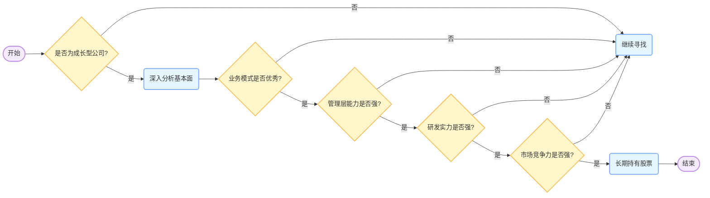

# 菲利普·费雪的成长型股票投资理论

> 关键词：菲利普·费雪、成长型股票、投资理论、基本面分析、长期投资

> 摘要：本文深入探讨了菲利普·费雪的成长型股票投资理论。费雪作为投资领域的传奇人物，其成长型股票投资理论对后世产生了深远影响。文章首先介绍了该理论产生的背景，包括目的、预期读者等内容。接着详细阐述了成长型股票等核心概念及其联系，通过文本示意图和 Mermaid 流程图进行直观呈现。然后深入剖析了核心算法原理，并结合 Python 代码展示具体操作步骤。同时，给出了相关的数学模型和公式，并举例说明。通过项目实战，展示了如何运用该理论进行股票投资分析，包括开发环境搭建、源代码实现及解读。还介绍了该理论的实际应用场景，推荐了相关的学习资源、开发工具框架和论文著作。最后总结了该理论的未来发展趋势与挑战，解答了常见问题，并提供了扩展阅读和参考资料，旨在帮助投资者更好地理解和运用费雪的成长型股票投资理论。

## 1. 背景介绍 
### 1.1 目的和范围
菲利普·费雪的成长型股票投资理论旨在帮助投资者识别具有长期成长潜力的股票，通过长期持有这些股票实现资产的增值。该理论的范围涵盖了对公司基本面的深入分析，包括公司的业务模式、管理层能力、研发实力、市场竞争力等多个方面，以确定公司是否具备持续成长的能力。其目的不仅在于指导投资者选择优质的成长型股票，还在于培养投资者长期投资的理念，避免短期市场波动的干扰。

### 1.2 预期读者
本文的预期读者主要包括对股票投资感兴趣的个人投资者、专业的投资机构从业者、金融专业的学生以及研究投资理论的学者。对于个人投资者来说，费雪的成长型股票投资理论可以帮助他们建立科学的投资理念，提高投资决策的准确性；专业投资机构从业者可以借鉴该理论，完善自身的投资策略和研究方法；金融专业的学生可以通过学习该理论，加深对股票投资和公司分析的理解；研究投资理论的学者则可以从该理论中获取研究灵感，进一步探讨投资领域的相关问题。

### 1.3 文档结构概述
本文将按照以下结构进行阐述：首先介绍菲利普·费雪成长型股票投资理论的背景信息，包括目的、预期读者和文档结构概述等内容；接着详细讲解成长型股票等核心概念及其联系，通过文本示意图和 Mermaid 流程图进行直观展示；然后深入分析核心算法原理，并结合 Python 代码展示具体操作步骤；随后给出相关的数学模型和公式，并举例说明；通过项目实战，展示如何运用该理论进行股票投资分析，包括开发环境搭建、源代码实现及解读；介绍该理论的实际应用场景；推荐相关的学习资源、开发工具框架和论文著作；最后总结该理论的未来发展趋势与挑战，解答常见问题，并提供扩展阅读和参考资料。

### 1.4 术语表
#### 1.4.1 核心术语定义
- **成长型股票**：指发行股票的公司正处在成长阶段，其销售额和利润额持续增长，速度快于整个国家和行业的增长水平。这类公司通常将大部分利润用于再投资，以扩大生产规模、研发新产品或拓展市场，从而实现公司的快速发展。
- **基本面分析**：通过对影响公司经营和发展的基本因素进行分析，评估公司的内在价值和投资价值。这些基本因素包括公司的财务状况、经营管理、行业前景、宏观经济环境等。
- **长期投资**：指投资者买入股票后长期持有，通常持有期限在一年以上，甚至数年或数十年。长期投资的目的是分享公司成长带来的收益，避免短期市场波动的影响。

#### 1.4.2 相关概念解释
- **公司护城河**：是指公司在市场竞争中所拥有的独特优势，能够保护公司的市场份额和利润，使其在长期竞争中保持领先地位。公司护城河的来源包括品牌优势、技术专利、成本优势、网络效应等。
- **研发投入**：指公司为了开发新产品、改进现有产品或提高生产效率而投入的资金。研发投入是衡量公司创新能力和未来发展潜力的重要指标。
- **管理层能力**：指公司管理层的决策能力、领导能力、团队管理能力等。优秀的管理层能够制定正确的战略规划，有效地组织和管理公司的资源，推动公司的持续发展。

#### 1.4.3 缩略词列表
- **EPS**：Earnings Per Share，每股收益，指公司净利润与发行在外普通股股数的比值，反映了每股股票的盈利水平。
- **PE**：Price-to-Earnings Ratio，市盈率，指股票价格与每股收益的比值，反映了市场对公司未来盈利的预期。

## 2. 核心概念与联系 

### 核心概念原理
菲利普·费雪的成长型股票投资理论核心在于寻找具有持续成长潜力的公司。成长型股票的价值主要来源于公司的盈利增长，而公司的盈利增长又取决于多个因素，包括公司的业务模式、管理层能力、研发实力、市场竞争力等。

公司的业务模式决定了其盈利来源和增长潜力。一个好的业务模式应该具有可持续性、创新性和竞争力，能够不断适应市场变化，满足客户需求。例如，苹果公司的业务模式以创新的产品设计、强大的品牌影响力和完善的生态系统为核心，通过不断推出具有创新性的产品，如 iPhone、iPad 等，吸引了大量的客户，实现了持续的盈利增长。

管理层能力是公司发展的关键因素之一。优秀的管理层能够制定正确的战略规划，有效地组织和管理公司的资源，推动公司的持续发展。例如，亚马逊的创始人杰夫·贝索斯具有卓越的战略眼光和创新精神，他带领亚马逊不断拓展业务领域，从最初的网上书店发展成为全球最大的电子商务公司之一。

研发实力是公司保持竞争力和实现持续成长的重要保障。公司通过不断投入研发资金，开发新产品、改进现有产品或提高生产效率，从而提高市场竞争力。例如，谷歌公司一直非常重视研发投入，不断推出新的技术和产品，如谷歌搜索、谷歌地图、安卓操作系统等，使其在互联网领域保持领先地位。

市场竞争力是公司在市场竞争中所拥有的优势，包括品牌优势、技术专利、成本优势、网络效应等。公司通过不断提升市场竞争力，扩大市场份额，实现盈利增长。例如，可口可乐公司具有强大的品牌优势，其品牌价值在全球范围内得到广泛认可，使其在饮料市场占据主导地位。

### 文本示意图
```plaintext
成长型股票投资理论
|
|-- 公司基本面分析
|   |-- 业务模式
|   |   |-- 可持续性
|   |   |-- 创新性
|   |   |-- 竞争力
|   |-- 管理层能力
|   |   |-- 战略规划能力
|   |   |-- 团队管理能力
|   |   |-- 决策能力
|   |-- 研发实力
|   |   |-- 研发投入
|   |   |-- 研发成果
|   |-- 市场竞争力
|       |-- 品牌优势
|       |-- 技术专利
|       |-- 成本优势
|       |-- 网络效应
|
|-- 长期投资理念
|   |-- 忽略短期波动
|   |-- 分享公司成长收益
```

### Mermaid 流程图


## 3. 核心算法原理 & 具体操作步骤 

### 核心算法原理
费雪的成长型股票投资理论主要基于对公司基本面的分析，通过评估公司的业务模式、管理层能力、研发实力、市场竞争力等因素，来判断公司是否具有持续成长的潜力。在实际操作中，可以采用多因素评分法来对公司进行综合评估。

多因素评分法的基本原理是：首先确定影响公司成长的关键因素，如业务模式、管理层能力、研发实力、市场竞争力等；然后为每个因素设定权重，权重的大小反映了该因素对公司成长的重要程度；接着对每个因素进行评分，评分的范围可以根据实际情况设定，如 1 - 10 分；最后将每个因素的评分乘以其对应的权重，再将所有因素的得分相加，得到公司的综合得分。综合得分越高，说明公司的成长潜力越大。

### 具体操作步骤
以下是使用 Python 实现多因素评分法的具体代码：
```python
# 定义影响公司成长的关键因素及其权重
factors = {
    "业务模式": 0.3,
    "管理层能力": 0.25,
    "研发实力": 0.2,
    "市场竞争力": 0.25
}

# 定义评分函数
def score_company(company_scores):
    total_score = 0
    for factor, weight in factors.items():
        score = company_scores.get(factor)
        if score is not None:
            total_score += score * weight
    return total_score

# 示例公司的评分
company_scores = {
    "业务模式": 8,
    "管理层能力": 7,
    "研发实力": 6,
    "市场竞争力": 7
}

# 计算公司的综合得分
company_score = score_company(company_scores)
print(f"公司的综合得分: {company_score}")
```
### 代码解释
1. **定义关键因素及其权重**：使用字典 `factors` 来定义影响公司成长的关键因素及其权重。
2. **定义评分函数**：`score_company` 函数接受一个字典 `company_scores` 作为参数，该字典包含了公司在各个关键因素上的评分。函数通过遍历 `factors` 字典，将每个因素的评分乘以其对应的权重，再将所有因素的得分相加，得到公司的综合得分。
3. **示例公司的评分**：使用字典 `company_scores` 来存储示例公司在各个关键因素上的评分。
4. **计算公司的综合得分**：调用 `score_company` 函数，传入 `company_scores` 字典，计算公司的综合得分，并将结果打印输出。

## 4. 数学模型和公式 & 详细讲解 & 举例说明 

### 数学模型和公式
多因素评分法的数学模型可以用以下公式表示：
$$S = \sum_{i=1}^{n} w_i \times s_i$$
其中，$S$ 表示公司的综合得分，$w_i$ 表示第 $i$ 个因素的权重，$s_i$ 表示第 $i$ 个因素的评分，$n$ 表示关键因素的数量。

### 详细讲解
该公式的含义是：公司的综合得分等于各个关键因素的评分乘以其对应的权重之和。权重的大小反映了该因素对公司成长的重要程度，评分的高低反映了公司在该因素上的表现。通过综合考虑各个关键因素的权重和评分，可以更全面、客观地评估公司的成长潜力。

### 举例说明
假设我们要评估一家公司的成长潜力，影响公司成长的关键因素及其权重如下：
| 因素 | 权重 |
| ---- | ---- |
| 业务模式 | 0.3 |
| 管理层能力 | 0.25 |
| 研发实力 | 0.2 |
| 市场竞争力 | 0.25 |

该公司在各个关键因素上的评分如下：
| 因素 | 评分 |
| ---- | ---- |
| 业务模式 | 8 |
| 管理层能力 | 7 |
| 研发实力 | 6 |
| 市场竞争力 | 7 |

根据上述公式，计算该公司的综合得分：
$$
\begin{align*}
S &= 0.3 \times 8 + 0.25 \times 7 + 0.2 \times 6 + 0.25 \times 7 \\
&= 2.4 + 1.75 + 1.2 + 1.75 \\
&= 7.1
\end{align*}
$$
因此，该公司的综合得分是 7.1 分。

## 5. 项目实战：代码实际案例和详细解释说明 

### 5.1  开发环境搭建
为了实现基于费雪成长型股票投资理论的股票分析项目，我们需要搭建以下开发环境：
1. **Python 环境**：建议使用 Python 3.7 及以上版本。可以从 Python 官方网站（https://www.python.org/downloads/）下载并安装 Python。
2. **开发工具**：推荐使用 PyCharm 或 Visual Studio Code 作为开发工具。这些工具提供了丰富的代码编辑、调试和管理功能，能够提高开发效率。
3. **相关库**：需要安装以下 Python 库：
    - `pandas`：用于数据处理和分析。
    - `numpy`：用于数值计算。
    - `matplotlib`：用于数据可视化。

可以使用以下命令来安装这些库：
```sh
pip install pandas numpy matplotlib
```

### 5.2  源代码详细实现和代码解读
以下是一个基于费雪成长型股票投资理论的股票分析项目的源代码示例：
```python
import pandas as pd
import numpy as np
import matplotlib.pyplot as plt

# 定义影响公司成长的关键因素及其权重
factors = {
    "业务模式": 0.3,
    "管理层能力": 0.25,
    "研发实力": 0.2,
    "市场竞争力": 0.25
}

# 定义评分函数
def score_company(company_scores):
    total_score = 0
    for factor, weight in factors.items():
        score = company_scores.get(factor)
        if score is not None:
            total_score += score * weight
    return total_score

# 读取股票数据
def read_stock_data(file_path):
    data = pd.read_csv(file_path)
    return data

# 计算每只股票的综合得分
def calculate_scores(data):
    scores = []
    for index, row in data.iterrows():
        company_scores = {
            "业务模式": row["业务模式评分"],
            "管理层能力": row["管理层能力评分"],
            "研发实力": row["研发实力评分"],
            "市场竞争力": row["市场竞争力评分"]
        }
        score = score_company(company_scores)
        scores.append(score)
    data["综合得分"] = scores
    return data

# 可视化综合得分
def visualize_scores(data):
    plt.figure(figsize=(10, 6))
    plt.bar(data["股票代码"], data["综合得分"])
    plt.xlabel("股票代码")
    plt.ylabel("综合得分")
    plt.title("股票综合得分")
    plt.xticks(rotation=45)
    plt.show()

# 主函数
def main():
    file_path = "stock_data.csv"
    data = read_stock_data(file_path)
    data = calculate_scores(data)
    visualize_scores(data)

if __name__ == "__main__":
    main()
```
### 代码解读
1. **导入必要的库**：导入 `pandas`、`numpy` 和 `matplotlib` 库，用于数据处理、数值计算和数据可视化。
2. **定义关键因素及其权重**：使用字典 `factors` 来定义影响公司成长的关键因素及其权重。
3. **定义评分函数**：`score_company` 函数接受一个字典 `company_scores` 作为参数，该字典包含了公司在各个关键因素上的评分。函数通过遍历 `factors` 字典，将每个因素的评分乘以其对应的权重，再将所有因素的得分相加，得到公司的综合得分。
4. **读取股票数据**：`read_stock_data` 函数接受一个文件路径作为参数，使用 `pandas` 库的 `read_csv` 函数读取股票数据，并返回一个 DataFrame 对象。
5. **计算每只股票的综合得分**：`calculate_scores` 函数接受一个 DataFrame 对象作为参数，遍历 DataFrame 中的每一行，提取每只股票在各个关键因素上的评分，调用 `score_company` 函数计算综合得分，并将综合得分添加到 DataFrame 中。
6. **可视化综合得分**：`visualize_scores` 函数接受一个 DataFrame 对象作为参数，使用 `matplotlib` 库的 `bar` 函数绘制每只股票的综合得分柱状图，并设置图表的标题、坐标轴标签等。
7. **主函数**：`main` 函数调用 `read_stock_data`、`calculate_scores` 和 `visualize_scores` 函数，完成股票数据的读取、综合得分的计算和可视化。

### 5.3  代码解读与分析
通过上述代码，我们可以实现基于费雪成长型股票投资理论的股票分析。首先，我们定义了影响公司成长的关键因素及其权重，并实现了评分函数。然后，我们读取股票数据，计算