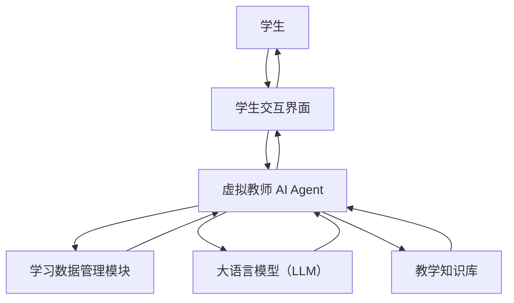

# 虚拟教师 AI Agent：LLM 驱动的个性化教育系统

> 关键词：虚拟教师、AI Agent、大语言模型（LLM）、个性化教育、教育系统

> 摘要：本文围绕虚拟教师 AI Agent 这一基于大语言模型（LLM）驱动的个性化教育系统展开。首先介绍了该系统产生的背景，包括目的、预期读者等信息。接着深入探讨了其核心概念与联系，详细阐述核心算法原理并给出 Python 源代码示例。同时，介绍了相关数学模型和公式。通过项目实战展示了系统的开发环境搭建、源代码实现与解读。分析了该系统的实际应用场景，推荐了学习资源、开发工具框架以及相关论文著作。最后总结了其未来发展趋势与挑战，并提供常见问题解答和扩展阅读参考资料，旨在全面呈现虚拟教师 AI Agent 个性化教育系统的技术全貌和应用价值。

## 1. 背景介绍 
### 1.1 目的和范围
随着人工智能技术的飞速发展，教育领域也迎来了深刻的变革。虚拟教师 AI Agent：LLM 驱动的个性化教育系统的目的在于利用先进的大语言模型（LLM）技术，为学生提供高度个性化的教育服务。传统教育模式往往难以满足每个学生的独特需求，而该系统旨在打破这一局限，根据学生的学习进度、知识掌握情况、学习风格等因素，为其量身定制学习计划和教学内容。

其范围涵盖了多个学科领域，包括但不限于数学、语文、英语、科学等。可以应用于中小学教育、职业教育、成人教育等不同教育阶段，为各类学习者提供支持。同时，系统不仅可以在学校教育场景中使用，也适用于家庭教育、在线学习平台等多种场景。

### 1.2 预期读者
本文的预期读者包括教育工作者，如教师、教育管理人员等，他们可以通过了解该系统，探索如何将人工智能技术融入教学过程，提高教学效果和效率。对于教育技术开发者来说，该文章提供了技术实现的思路和方法，有助于他们开发和优化相关的教育系统。此外，学生和家长也可以从中了解到个性化教育系统的优势和特点，以便更好地选择适合自己或孩子的学习工具。

### 1.3 文档结构概述
本文将按照以下结构进行阐述。首先介绍背景信息，让读者了解该系统产生的原因和适用对象。接着深入探讨核心概念与联系，包括虚拟教师 AI Agent 和 LLM 的基本原理以及它们之间的关系。在核心算法原理部分，将通过 Python 代码详细讲解系统的工作流程。数学模型和公式部分将为系统的实现提供理论支持。项目实战部分将展示如何搭建开发环境、实现源代码并进行解读。实际应用场景部分将探讨该系统在不同场景下的应用方式。工具和资源推荐部分将为读者提供学习和开发相关系统的有用资源。最后总结未来发展趋势与挑战，解答常见问题，并提供扩展阅读参考资料。

### 1.4 术语表
#### 1.4.1 核心术语定义
- **虚拟教师 AI Agent**：是一种基于人工智能技术的软件实体，模拟教师的角色，能够与学生进行交互，提供教学服务和指导。
- **大语言模型（LLM）**：是一种基于深度学习的自然语言处理模型，通过对大量文本数据的学习，能够生成高质量的自然语言文本，理解语言的语义和上下文。
- **个性化教育**：根据每个学生的个体差异，如学习能力、兴趣爱好、学习进度等，提供定制化的教育方案和学习内容。

#### 1.4.2 相关概念解释
- **AI Agent**：是指能够感知环境、做出决策并采取行动的智能实体。在教育系统中，虚拟教师 AI Agent 可以感知学生的学习状态和需求，做出相应的教学决策，并采取合适的教学行动。
- **自然语言处理（NLP）**：是人工智能的一个重要领域，主要研究如何让计算机理解和处理人类语言。大语言模型是自然语言处理中的一种重要技术。

#### 1.4.3 缩略词列表
- **LLM**：Large Language Model（大语言模型）
- **NLP**：Natural Language Processing（自然语言处理）

## 2. 核心概念与联系 

### 核心概念原理
#### 虚拟教师 AI Agent
虚拟教师 AI Agent 是整个个性化教育系统的核心角色。它的原理基于人工智能的多领域技术，包括自然语言处理、机器学习和知识表示与推理等。通过自然语言处理技术，它能够与学生进行自然流畅的对话，理解学生的问题和需求。机器学习算法则用于分析学生的学习数据，如答题正确率、学习时间等，从而了解学生的学习状态和知识掌握情况。知识表示与推理技术使得虚拟教师 AI Agent 能够将教学知识以合适的方式表示和组织，并根据学生的情况进行推理和决策，提供针对性的教学内容和指导。

#### 大语言模型（LLM）
大语言模型是基于Transformer架构的深度学习模型。Transformer架构通过自注意力机制（Self - Attention）能够捕捉文本中的长距离依赖关系，从而更好地理解语言的语义和上下文。LLM 在大规模的文本语料库上进行无监督学习，学习到丰富的语言知识和模式。当输入一个文本时，LLM 可以根据其学习到的知识生成合理的回复或预测。在个性化教育系统中，LLM 为虚拟教师 AI Agent 提供了强大的语言理解和生成能力，使得虚拟教师能够与学生进行高质量的交互。

### 架构的文本示意图
虚拟教师 AI Agent：LLM 驱动的个性化教育系统主要由以下几个部分组成：
1. **学生交互界面**：这是学生与系统进行交互的入口，学生可以通过文本输入、语音输入等方式与虚拟教师 AI Agent 进行交流。
2. **虚拟教师 AI Agent**：负责接收学生的输入，利用 LLM 进行语言理解和生成，根据学生的学习数据进行教学决策，并提供相应的教学内容和反馈。
3. **学习数据管理模块**：用于存储和管理学生的学习数据，包括答题记录、学习进度、学习时间等。
4. **大语言模型（LLM）**：为虚拟教师 AI Agent 提供语言处理能力，辅助其理解学生的问题和生成合适的回复。
5. **教学知识库**：存储教学相关的知识，如知识点、例题、教学方法等，为虚拟教师 AI Agent 提供教学资源支持。

### Mermaid 流程图


## 3. 核心算法原理 & 具体操作步骤 

### 核心算法原理
虚拟教师 AI Agent 的核心算法主要包括以下几个方面：
1. **学生状态评估算法**：通过分析学生的学习数据，如答题正确率、答题时间、学习进度等，评估学生的知识掌握情况和学习状态。可以使用机器学习中的分类算法，如决策树、支持向量机等，将学生的学习状态分为不同的类别，如掌握、部分掌握、未掌握等。
2. **教学决策算法**：根据学生的学习状态评估结果，结合教学目标和教学策略，做出教学决策。例如，如果学生对某个知识点未掌握，则提供相关的讲解和练习；如果学生已经掌握，则提供拓展性的学习内容。
3. **语言理解和生成算法**：利用大语言模型（LLM）进行学生问题的理解和回复的生成。LLM 可以将学生的自然语言问题转换为语义表示，然后根据语义表示生成合适的回复。

### 具体操作步骤
1. **学生输入问题**：学生通过学生交互界面输入问题或表达学习需求。
2. **问题理解**：虚拟教师 AI Agent 接收学生的输入，利用 LLM 对问题进行理解，提取问题的关键信息和语义。
3. **学生状态评估**：从学习数据管理模块中获取学生的学习数据，使用学生状态评估算法评估学生的学习状态。
4. **教学决策**：根据问题理解结果和学生状态评估结果，使用教学决策算法做出教学决策，确定需要提供的教学内容和反馈。
5. **回复生成**：利用 LLM 根据教学决策生成合适的回复文本或语音。
6. **反馈给学生**：将生成的回复通过学生交互界面反馈给学生。

### Python 源代码示例
```python
import random

# 模拟学习数据管理模块
class LearningDataManager:
    def __init__(self):
        self.student_data = {}

    def add_student_data(self, student_id, data):
        if student_id not in self.student_data:
            self.student_data[student_id] = []
        self.student_data[student_id].append(data)

    def get_student_data(self, student_id):
        if student_id in self.student_data:
            return self.student_data[student_id]
        return []

# 模拟大语言模型
class LLM:
    def understand_question(self, question):
        # 简单模拟问题理解
        return question.lower()

    def generate_response(self, decision):
        # 简单模拟回复生成
        responses = {
            "explain": "这是相关的知识点讲解：......",
            "practice": "这里有一些相关的练习题：......",
            "expand": "以下是拓展性的学习内容：......"
        }
        return responses.get(decision, "抱歉，我不太理解。")

# 虚拟教师 AI Agent
class VirtualTeacherAgent:
    def __init__(self, learning_data_manager, llm):
        self.learning_data_manager = learning_data_manager
        self.llm = llm

    def receive_question(self, student_id, question):
        # 问题理解
        understood_question = self.llm.understand_question(question)
        # 学生状态评估
        student_data = self.learning_data_manager.get_student_data(student_id)
        # 简单模拟学生状态评估
        if len(student_data) < 3:
            student_status = "unmastered"
        elif len(student_data) < 6:
            student_status = "partially_mastered"
        else:
            student_status = "mastered"
        # 教学决策
        if student_status == "unmastered":
            decision = "explain"
        elif student_status == "partially_mastered":
            decision = "practice"
        else:
            decision = "expand"
        # 回复生成
        response = self.llm.generate_response(decision)
        return response

# 示例使用
learning_data_manager = LearningDataManager()
llm = LLM()
virtual_teacher = VirtualTeacherAgent(learning_data_manager, llm)

student_id = 1
question = "这个知识点怎么理解？"
response = virtual_teacher.receive_question(student_id, question)
print(response)
```

## 4. 数学模型和公式 & 详细讲解 & 举例说明 

### 学生状态评估的数学模型
在学生状态评估中，可以使用概率模型来描述学生对知识点的掌握程度。假设某个知识点有 $n$ 个相关的题目，学生答对的题目数为 $x$，答错的题目数为 $y$，则 $n=x + y$。可以定义学生对该知识点的掌握概率 $p$ 为：
$$p=\frac{x}{n}$$

根据掌握概率 $p$ 的值，可以将学生的学习状态分为不同的类别。例如，当 $p < 0.3$ 时，认为学生未掌握该知识点；当 $0.3\leq p < 0.7$ 时，认为学生部分掌握该知识点；当 $p\geq0.7$ 时，认为学生已经掌握该知识点。

### 教学决策的数学模型
教学决策可以基于多目标优化模型。假设教学目标包括提高学生的知识掌握程度、提高学习效率、培养学生的学习兴趣等，分别用 $O_1,O_2,O_3$ 表示。每个教学决策 $d$ 对不同教学目标的影响可以用函数 $f_1(d),f_2(d),f_3(d)$ 表示。则教学决策的目标是最大化目标函数 $F(d)$：
$$F(d)=\omega_1f_1(d)+\omega_2f_2(d)+\omega_3f_3(d)$$
其中 $\omega_1,\omega_2,\omega_3$ 是不同教学目标的权重，且 $\omega_1+\omega_2+\omega_3 = 1$。

### 举例说明
假设某个知识点有 10 道题目，学生答对了 3 道，答错了 7 道。则学生对该知识点的掌握概率为：
$$p=\frac{3}{10}=0.3$$
根据上述分类标准，该学生部分掌握该知识点。

假设教学目标的权重分别为 $\omega_1 = 0.5,\omega_2 = 0.3,\omega_3 = 0.2$。有两个教学决策 $d_1$ 和 $d_2$，它们对不同教学目标的影响如下：
| 决策 | $f_1$ | $f_2$ | $f_3$ |
|---|---|---|---|
| $d_1$ | 0.6 | 0.4 | 0.5 |
| $d_2$ | 0.7 | 0.3 | 0.4 |

则 $F(d_1)=0.5\times0.6 + 0.3\times0.4+0.2\times0.5=0.52$
$F(d_2)=0.5\times0.7 + 0.3\times0.3+0.2\times0.4=0.54$

由于 $F(d_2)>F(d_1)$，所以选择教学决策 $d_2$。

## 5. 项目实战：代码实际案例和详细解释说明 

### 5.1  开发环境搭建
#### 硬件环境
- **服务器**：建议使用具有较高计算性能的服务器，如配备多核 CPU 和 GPU 的服务器，以支持大语言模型的运行。
- **存储设备**：需要足够的存储空间来存储学习数据、教学知识库和模型参数等。

#### 软件环境
- **操作系统**：可以选择 Linux 系统，如 Ubuntu 或 CentOS，也可以使用 Windows 系统。
- **编程语言**：使用 Python 作为主要的开发语言，因为 Python 有丰富的机器学习和自然语言处理库。
- **深度学习框架**：选择 PyTorch 或 TensorFlow 作为深度学习框架，用于训练和运行大语言模型。
- **数据库**：使用 MySQL 或 MongoDB 等数据库来存储学习数据和教学知识库。

### 5.2  源代码详细实现和代码解读
#### 数据库连接模块
```python
import mysql.connector

class DatabaseConnector:
    def __init__(self, host, user, password, database):
        self.host = host
        self.user = user
        self.password = password
        self.database = database
        self.connection = None

    def connect(self):
        try:
            self.connection = mysql.connector.connect(
                host=self.host,
                user=self.user,
                password=self.password,
                database=self.database
            )
            print("数据库连接成功")
        except mysql.connector.Error as err:
            print(f"数据库连接失败: {err}")

    def execute_query(self, query, values=None):
        if self.connection is None:
            self.connect()
        cursor = self.connection.cursor()
        try:
            if values:
                cursor.execute(query, values)
            else:
                cursor.execute(query)
            if query.lower().startswith("select"):
                result = cursor.fetchall()
                return result
            else:
                self.connection.commit()
                print("查询执行成功")
        except mysql.connector.Error as err:
            print(f"查询执行失败: {err}")
        finally:
            cursor.close()

    def close(self):
        if self.connection:
            self.connection.close()
            print("数据库连接关闭")
```
**代码解读**：该模块实现了与 MySQL 数据库的连接和查询操作。`DatabaseConnector` 类的 `connect` 方法用于建立数据库连接，`execute_query` 方法用于执行 SQL 查询，`close` 方法用于关闭数据库连接。

#### 大语言模型调用模块
```python
import openai

class LLMCaller:
    def __init__(self, api_key):
        openai.api_key = api_key

    def generate_response(self, prompt):
        try:
            response = openai.Completion.create(
                engine="text - davinci - 003",
                prompt=prompt,
                max_tokens=150
            )
            return response.choices[0].text.strip()
        except Exception as e:
            print(f"大语言模型调用失败: {e}")
            return "抱歉，出现错误。"
```
**代码解读**：该模块实现了对 OpenAI 大语言模型的调用。`LLMCaller` 类的 `generate_response` 方法接收一个提示信息 `prompt`，并返回大语言模型生成的回复。

#### 虚拟教师 AI Agent 主模块
```python
from database_connector import DatabaseConnector
from llm_caller import LLMCaller

class VirtualTeacher:
    def __init__(self, db_host, db_user, db_password, db_name, api_key):
        self.db_connector = DatabaseConnector(db_host, db_user, db_password, db_name)
        self.llm_caller = LLMCaller(api_key)

    def receive_question(self, student_id, question):
        # 从数据库中获取学生学习数据
        query = "SELECT * FROM student_data WHERE student_id = %s"
        values = (student_id,)
        student_data