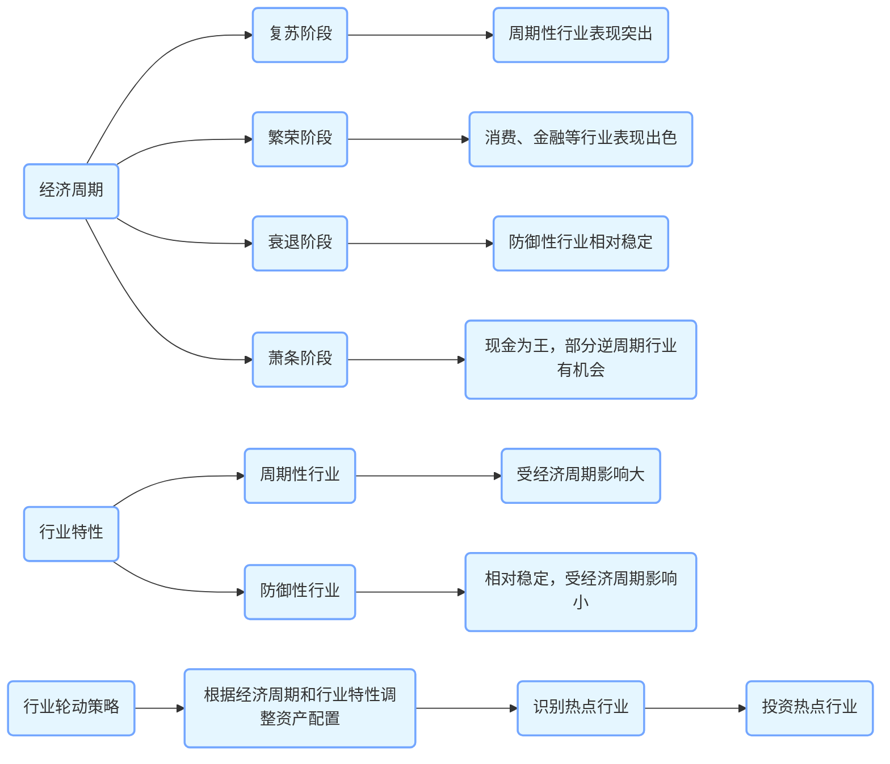

# 行业轮动策略：识别和投资热点行业

> 关键词：行业轮动策略、热点行业识别、投资分析、市场周期、量化投资

> 摘要：本文聚焦于行业轮动策略，旨在深入探讨如何识别热点行业并进行有效投资。通过对行业轮动的核心概念、算法原理、数学模型的详细阐述，结合实际项目案例分析，揭示行业轮动策略在投资领域的应用方法和价值。同时，介绍了相关的工具和资源，对未来发展趋势与挑战进行总结，为投资者和相关从业者提供全面而深入的指导。

## 1. 背景介绍 
### 1.1 目的和范围
行业轮动策略在投资领域具有重要意义。其目的在于通过识别不同时期的热点行业，合理配置资产，以获取超越市场平均水平的收益。本文的范围涵盖了行业轮动策略的基本概念、核心算法、数学模型、实际应用案例等方面，全面介绍了如何运用行业轮动策略进行热点行业的识别和投资。

### 1.2 预期读者
本文预期读者包括投资者、金融分析师、量化投资从业者、对行业轮动策略感兴趣的研究人员以及相关专业的学生。无论是希望在投资中运用行业轮动策略的投资者，还是想要深入了解该领域技术原理的专业人士，都能从本文中获得有价值的信息。

### 1.3 文档结构概述
本文首先介绍行业轮动策略的背景知识，包括目的、预期读者和文档结构。接着阐述核心概念与联系，展示相关的文本示意图和Mermaid流程图。然后详细讲解核心算法原理和具体操作步骤，给出Python源代码示例。之后介绍数学模型和公式，并通过举例进行说明。再通过项目实战，展示代码实际案例和详细解释。随后探讨实际应用场景，推荐相关的工具和资源。最后总结未来发展趋势与挑战，提供常见问题解答和扩展阅读参考资料。

### 1.4 术语表
#### 1.4.1 核心术语定义
- **行业轮动策略**：根据经济周期、市场环境等因素，在不同行业之间进行资产配置调整，以捕捉热点行业带来的投资机会的策略。
- **热点行业**：在特定时期内，由于宏观经济、政策、技术等因素的影响，表现出较高的增长潜力和投资价值的行业。
- **市场周期**：市场价格和经济活动呈现出的周期性波动，包括复苏、繁荣、衰退和萧条四个阶段。
- **量化投资**：利用数学模型和计算机技术，对投资组合进行量化分析和决策的投资方法。

#### 1.4.2 相关概念解释
- **经济周期与行业轮动**：经济周期的不同阶段，各个行业的表现存在差异。例如，在经济复苏阶段，周期性行业如钢铁、汽车等往往率先受益；而在经济衰退阶段，防御性行业如公用事业、消费必需品等相对稳定。
- **行业景气度**：反映行业当前的发展状况和未来的发展趋势，通常通过行业的盈利能力、市场需求、政策支持等因素来衡量。

#### 1.4.3 缩略词列表
- **GDP**：国内生产总值（Gross Domestic Product）
- **PE**：市盈率（Price-to-Earnings Ratio）
- **ROE**：净资产收益率（Return on Equity）

## 2. 核心概念与联系 

### 核心概念原理
行业轮动策略的核心原理基于经济周期和行业特性。经济周期的不同阶段对各个行业的影响不同，导致行业表现出现轮动。例如，在经济扩张初期，制造业、原材料等行业通常会受益于需求的增加；而在经济扩张后期，消费、金融等行业可能会表现出色。

同时，行业自身的特性也会影响其在不同市场环境下的表现。一些行业具有较强的周期性，如钢铁、化工等；而另一些行业则具有防御性，如医药、食品饮料等。投资者可以根据经济周期和行业特性，调整资产在不同行业之间的配置，以实现收益最大化。

### 架构的文本示意图
```plaintext
经济周期
|-- 复苏阶段
|   |-- 周期性行业（钢铁、汽车等）表现突出
|-- 繁荣阶段
|   |-- 消费、金融等行业表现出色
|-- 衰退阶段
|   |-- 防御性行业（公用事业、消费必需品等）相对稳定
|-- 萧条阶段
|   |-- 现金为王，部分逆周期行业可能有机会

行业特性
|-- 周期性行业
|   |-- 受经济周期影响大
|-- 防御性行业
|   |-- 相对稳定，受经济周期影响小

行业轮动策略
|-- 根据经济周期和行业特性调整资产配置
|   |-- 识别热点行业
|   |-- 投资热点行业
```

### Mermaid流程图


## 3. 核心算法原理 & 具体操作步骤 

### 核心算法原理
行业轮动策略的核心算法主要包括行业景气度评估和行业排名。通过对多个指标的综合分析，评估每个行业的景气度，然后根据景气度对行业进行排名，选择排名靠前的行业进行投资。

常用的指标包括行业的盈利能力、市场需求、政策支持等。例如，可以使用行业的净利润增长率、营业收入增长率、市盈率等指标来评估行业的盈利能力；使用行业的市场规模增长率、产品销量增长率等指标来评估市场需求；使用政策文件、政府补贴等信息来评估政策支持。

### 具体操作步骤
1. **数据收集**：收集各个行业的相关数据，包括财务数据、市场数据、政策数据等。
2. **指标计算**：根据收集到的数据，计算各个行业的评估指标。
3. **景气度评估**：使用综合评估方法，对各个行业的景气度进行评估。
4. **行业排名**：根据景气度评估结果，对行业进行排名。
5. **投资决策**：选择排名靠前的行业进行投资。

### Python源代码示例
```python
import pandas as pd
import numpy as np

# 假设已经收集到了各个行业的财务数据
# 数据格式为DataFrame，索引为行业名称，列名为指标名称
industry_data = pd.DataFrame({
    '净利润增长率': [0.2, 0.15, 0.1, 0.05],
    '营业收入增长率': [0.18, 0.12, 0.08, 0.04],
    '市盈率': [20, 15, 12, 10]
}, index=['行业A', '行业B', '行业C', '行业D'])

# 定义指标权重
weights = {
    '净利润增长率': 0.4,
    '营业收入增长率': 0.3,
    '市盈率': 0.3
}

# 标准化数据
normalized_data = (industry_data - industry_data.min()) / (industry_data.max() - industry_data.min())

# 计算行业景气度得分
scores = []
for index, row in normalized_data.iterrows():
    score = 0
    for column in industry_data.columns:
        score += row[column] * weights[column]
    scores.append(score)

# 添加得分列
industry_data['景气度得分'] = scores

# 按景气度得分降序排序
sorted_industry = industry_data.sort_values(by='景气度得分', ascending=False)

# 选择排名靠前的行业
top_industries = sorted_industry.head(2).index.tolist()

print("排名靠前的行业：", top_industries)
```

## 4. 数学模型和公式 & 详细讲解 & 举例说明 

### 数学模型和公式
行业景气度评估可以使用加权平均模型，公式如下：

$$
Score_i = \sum_{j=1}^{n} w_j \times x_{ij}
$$

其中，$Score_i$ 表示第 $i$ 个行业的景气度得分，$w_j$ 表示第 $j$ 个指标的权重，$x_{ij}$ 表示第 $i$ 个行业的第 $j$ 个指标的标准化值，$n$ 表示指标的数量。

### 详细讲解
上述公式的核心思想是将各个指标的标准化值按照一定的权重进行加权求和，得到每个行业的景气度得分。权重的设置可以根据投资者的偏好和经验进行调整，以突出不同指标的重要性。

标准化值的计算方法通常使用最小-最大标准化，公式如下：

$$
x_{ij}^{norm} = \frac{x_{ij} - min(x_j)}{max(x_j) - min(x_j)}
$$

其中，$x_{ij}^{norm}$ 表示第 $i$ 个行业的第 $j$ 个指标的标准化值，$min(x_j)$ 和 $max(x_j)$ 分别表示第 $j$ 个指标的最小值和最大值。

### 举例说明
假设我们有三个行业（行业A、行业B、行业C）和三个指标（净利润增长率、营业收入增长率、市盈率），数据如下：

| 行业 | 净利润增长率 | 营业收入增长率 | 市盈率 |
| ---- | ---- | ---- | ---- |
| 行业A | 0.2 | 0.18 | 20 |
| 行业B | 0.15 | 0.12 | 15 |
| 行业C | 0.1 | 0.08 | 12 |

指标权重设置为：净利润增长率权重为 0.4，营业收入增长率权重为 0.3，市盈率权重为 0.3。

首先，计算标准化值：

- 净利润增长率标准化值：
  - 行业A：$(0.2 - 0.1) / (0.2 - 0.1) = 1$
  - 行业B：$(0.15 - 0.1) / (0.2 - 0.1) = 0.5$
  - 行业C：$(0.1 - 0.1) / (0.2 - 0.1) = 0$

- 营业收入增长率标准化值：
  - 行业A：$(0.18 - 0.08) / (0.18 - 0.08) = 1$
  - 行业B：$(0.12 - 0.08) / (0.18 - 0.08) = 0.4$
  - 行业C：$(0.08 - 0.08) / (0.18 - 0.08) = 0$

- 市盈率标准化值：
  - 行业A：$(20 - 12) / (20 - 12) = 1$
  - 行业B：$(15 - 12) / (20 - 12) = 0.375$
  - 行业C：$(12 - 12) / (20 - 12) = 0$

然后，计算景气度得分：

- 行业A：$0.4 \times 1 + 0.3 \times 1 + 0.3 \times 1 = 1$
- 行业B：$0.4 \times 0.5 + 0.3 \times 0.4 + 0.3 \times 0.375 = 0.4225$
- 行业C：$0.4 \times 0 + 0.3 \times 0 + 0.3 \times 0 = 0$

根据景气度得分，行业A排名第一，行业B排名第二，行业C排名第三。投资者可以选择行业A和行业B进行投资。

## 5. 项目实战：代码实际案例和详细解释说明 

### 5.1  开发环境搭建
- **Python环境**：建议使用Python 3.7及以上版本。可以从Python官方网站（https://www.python.org/downloads/）下载安装。
- **开发工具**：推荐使用Jupyter Notebook或PyCharm。Jupyter Notebook适合进行交互式开发和数据分析，PyCharm是一款功能强大的Python集成开发环境。
- **依赖库安装**：在命令行中使用以下命令安装所需的依赖库：
```sh
pip install pandas numpy matplotlib
```

### 5.2  源代码详细实现和代码解读
```python
import pandas as pd
import numpy as np
import matplotlib.pyplot as plt

# 模拟收集到的行业数据
industry_data = pd.DataFrame({
    '净利润增长率': [0.2, 0.15, 0.1, 0.05, 0.12],
    '营业收入增长率': [0.18, 0.12, 0.08, 0.04, 0.1],
    '市盈率': [20, 15, 12, 10, 18],
    '市场规模增长率': [0.15, 0.1, 0.08, 0.05, 0.12]
}, index=['行业A', '行业B', '行业C', '行业D', '行业E'])

# 定义指标权重
weights = {
    '净利润增长率': 0.3,
    '营业收入增长率': 0.2,
    '市盈率': 0.2,
    '市场规模增长率': 0.3
}

# 标准化数据
normalized_data = (industry_data - industry_data.min()) / (industry_data.max() - industry_data.min())

# 计算行业景气度得分
scores = []
for index, row in normalized_data.iterrows():
    score = 0
    for column in industry_data.columns:
        score += row[column] * weights[column]
    scores.append(score)

# 添加得分列
industry_data['景气度得分'] = scores

# 按景气度得分降序排序
sorted_industry = industry_data.sort_values(by='景气度得分', ascending=False)

# 选择排名靠前的行业
top_industries = sorted_industry.head(3).index.tolist()

# 可视化行业景气度得分
plt.bar(sorted_industry.index, sorted_industry['景气度得分'])
plt.xlabel('行业')
plt.ylabel('景气度得分')
plt.title('行业景气度得分排名')
plt.show()

print("排名靠前的行业：", top_industries)
```

### 代码解读与分析
1. **数据模拟**：使用`pandas`库创建一个包含多个行业和多个指标的DataFrame，模拟收集到的行业数据。
2. **指标权重定义**：定义每个指标的权重，用于计算行业景气度得分。
3. **数据标准化**：使用最小-最大标准化方法对数据进行标准化处理，确保不同指标具有可比性。
4. **景气度得分计算**：遍历每个行业的数据，根据指标权重计算景气度得分。
5. **行业排名**：将景气度得分添加到DataFrame中，并按得分降序排序。
6. **选择热点行业**：选择排名靠前的行业作为热点行业。
7. **可视化**：使用`matplotlib`库绘制柱状图，直观展示各个行业的景气度得分排名。

## 6. 实际应用场景 
### 股票投资
在股票投资中，行业轮动策略可以帮助投资者选择热点行业的股票进行投资。通过识别不同时期的热点行业，投资者可以调整股票投资组合，提高投资收益。例如，在经济复苏阶段，投资者可以增加周期性行业股票的配置；在经济衰退阶段，增加防御性行业股票的配置。

### 基金投资
基金投资者可以根据行业轮动策略选择投资于热点行业的基金。一些行业主题基金专注于特定行业的投资，投资者可以根据行业轮动情况，选择投资于当前热点行业的基金，以获取更好的收益。

### 资产配置
在资产配置中，行业轮动策略可以作为一种重要的参考。投资者可以将资产分配到不同行业的资产中，根据行业轮动情况调整资产配置比例，实现资产的多元化和风险分散。

## 7. 工具和资源推荐
### 7.1 学习资源推荐
#### 7.1.1 书籍推荐
- 《聪明的投资者》（The Intelligent Investor）：本杰明·格雷厄姆（Benjamin Graham）著，被誉为投资领域的圣经，介绍了价值投资的基本理念和方法。
- 《金融市场技术分析》（Technical Analysis of the Financial Markets）：约翰·墨菲（John J. Murphy）著，系统介绍了技术分析的理论和方法，对行业轮动策略的研究有一定的参考价值。
- 《量化投资：策略与技术》：丁鹏著，详细介绍了量化投资的基本概念、策略和技术，包括行业轮动策略的量化实现方法。

#### 7.1.2 在线课程
- Coursera上的“投资学原理”（Principles of Investing）：由宾夕法尼亚大学沃顿商学院教授授课，介绍了投资学的基本原理和方法。
- edX上的“金融市场”（Financial Markets）：由耶鲁大学教授授课，涵盖了金融市场的各个方面，包括行业轮动的相关内容。
- 国内慕课平台上的“量化投资与金融科技”课程，介绍了量化投资的理论和实践，对行业轮动策略有深入的讲解。

#### 7.1.3 技术博客和网站
- 雪球网（https://xueqiu.com/）：国内知名的投资社区，提供了丰富的行业分析和投资策略讨论。
- 东方财富网（https://www.eastmoney.com/）：提供了全面的金融数据和行业资讯，对行业轮动策略的研究有很大的帮助。
- Seeking Alpha（https://seekingalpha.com/）：国外知名的金融分析网站，有大量的行业分析文章和投资策略建议。

### 7.2 开发工具框架推荐
#### 7.2.1 IDE和编辑器
- Jupyter Notebook：适合进行交互式开发和数据分析，支持Python、R等多种编程语言。
- PyCharm：功能强大的Python集成开发环境，提供了代码编辑、调试、版本控制等功能。
- Visual Studio Code：轻量级的代码编辑器，支持多种编程语言，具有丰富的插件扩展功能。

#### 7.2.2 调试和性能分析工具
- PySnooper：可以自动记录函数的执行过程，方便调试代码。
- cProfile：Python内置的性能分析工具，可以分析代码的运行时间和函数调用情况。
- line_profiler：可以逐行分析代码的运行时间，找出性能瓶颈。

#### 7.2.3 相关框架和库
- Pandas：强大的数据处理和分析库，提供了DataFrame和Series等数据结构，方便进行数据清洗、转换和分析。
- Numpy：用于科学计算的基础库，提供了多维数组和矩阵运算的功能。
- Scikit-learn：机器学习库，提供了多种机器学习算法和工具，可用于行业轮动策略的模型构建和预测。

### 7.3 相关论文著作推荐
#### 7.3.1 经典论文
- “Industry Rotation Strategies: Evidence from the US Stock Market”：研究了美国股票市场中的行业轮动策略，分析了不同经济周期下行业轮动的规律和投资效果。
- “The Cyclical Behavior of Industrial Production and Stock Returns”：探讨了工业生产和股票回报的周期性行为，为行业轮动策略提供了理论基础。

#### 7.3.2 最新研究成果
- 关注顶级金融学术期刊如《Journal of Finance》、《Review of Financial Studies》等，了解行业轮动策略的最新研究进展。
- 参加金融学术会议，如美国金融协会（American Finance Association）年会，获取最新的研究成果和前沿思想。

#### 7.3.3 应用案例分析
- 研究国内外知名投资机构的行业轮动策略应用案例，了解他们的投资思路、方法和实践经验。
- 分析一些成功的量化投资基金的行业轮动策略，学习他们的模型构建、数据处理和投资决策过程。

## 8. 总结：未来发展趋势与挑战
### 未来发展趋势
- **智能化和自动化**：随着人工智能和机器学习技术的不断发展，行业轮动策略将更加智能化和自动化。通过使用深度学习算法，可以对大量的市场数据和行业信息进行分析和预测，提高热点行业识别的准确性和效率。
- **多因素融合**：未来的行业轮动策略将不仅仅依赖于传统的经济周期和行业指标，还将融合更多的因素，如技术创新、政策变化、社会趋势等。通过综合考虑多个因素，可以更全面地评估行业的发展潜力和投资价值。
- **全球化投资**：随着全球经济一体化的发展，投资者将更加关注全球范围内的行业轮动机会。行业轮动策略将不再局限于国内市场，而是拓展到全球市场，实现更广泛的资产配置和风险分散。

### 挑战
- **数据质量和可靠性**：行业轮动策略的有效性依赖于准确、可靠的数据。然而，市场数据和行业信息往往存在噪声、缺失值和错误，如何处理这些数据问题，提高数据质量和可靠性，是一个挑战。
- **模型的稳定性和适应性**：市场环境和行业动态不断变化，行业轮动策略的模型需要具备良好的稳定性和适应性。如何构建能够适应不同市场环境和行业变化的模型，是一个需要解决的问题。
- **监管和合规**：在金融投资领域，监管和合规要求越来越严格。行业轮动策略的实施需要遵守相关的法律法规和监管要求，如何在合规的前提下实现策略的优化和创新，是一个挑战。

## 9. 附录：常见问题与解答
### 问题1：行业轮动策略一定能获得超额收益吗？
解答：行业轮动策略并不一定能保证获得超额收益。市场是复杂多变的，行业轮动的规律也不是绝对的。虽然行业轮动策略可以帮助投资者捕捉热点行业的投资机会，但如果对市场判断失误，或者行业轮动的节奏把握不准确，可能无法获得预期的收益，甚至可能出现亏损。

### 问题2：如何确定指标的权重？
解答：指标的权重可以根据投资者的偏好、经验和市场情况进行调整。一种常见的方法是通过历史数据进行回测，尝试不同的权重组合，选择能够获得最优收益的权重。此外，也可以参考专家意见和行业研究报告，确定各个指标的相对重要性。

### 问题3：行业轮动策略适合所有投资者吗？
解答：行业轮动策略并不适合所有投资者。该策略需要投资者具备一定的市场分析能力和投资经验，能够对经济周期和行业动态进行准确的判断。对于缺乏专业知识和经验的投资者来说，可能难以实施有效的行业轮动策略。此外，行业轮动策略的投资风险相对较高，投资者需要根据自己的风险承受能力来选择是否采用该策略。

## 10. 扩展阅读 & 参考资料
- 本杰明·格雷厄姆. 《聪明的投资者》. 人民邮电出版社.
- 约翰·墨菲. 《金融市场技术分析》. 地震出版社.
- 丁鹏. 《量化投资：策略与技术》. 电子工业出版社.
- “Industry Rotation Strategies: Evidence from the US Stock Market”. Journal of Financial Economics.
- “The Cyclical Behavior of Industrial Production and Stock Returns”. Journal of Business.

作者：AI天才研究院/AI Genius Institute & 禅与计算机程序设计艺术 /Zen And The Art of Computer Programming