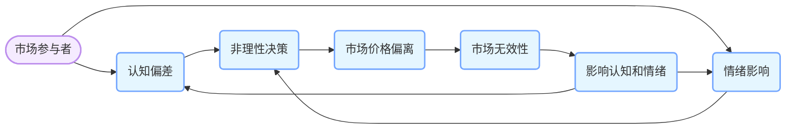

# 行为金融学：理解并利用市场参与者的非理性行为

> 关键词：行为金融学、非理性行为、市场参与者、认知偏差、投资决策

> 摘要：本文深入探讨了行为金融学这一重要领域，旨在帮助读者理解市场参与者的非理性行为，并阐述如何利用这些行为进行更有效的投资决策。文章首先介绍了行为金融学的背景，包括其目的、预期读者和文档结构。接着详细阐述了核心概念，如认知偏差、情绪影响等，并通过Mermaid流程图展示了这些概念之间的联系。核心算法原理部分使用Python代码对相关理论进行了演示。数学模型和公式部分给出了定量分析的基础。项目实战部分通过实际案例展示了如何在开发环境中运用行为金融学的知识。实际应用场景部分列举了多个领域的应用。工具和资源推荐部分为读者提供了学习和研究的方向。最后总结了行为金融学的未来发展趋势与挑战，并提供了常见问题解答和扩展阅读参考资料。

## 1. 背景介绍 
### 1.1 目的和范围
传统金融学理论假设市场参与者是理性的，他们能够基于所有可用信息做出最优决策，并且市场价格能够准确反映资产的内在价值。然而，在现实金融市场中，我们经常观察到资产价格的剧烈波动、市场泡沫和崩溃等现象，这些都无法用传统金融学理论进行完全解释。行为金融学正是在这样的背景下应运而生，它结合了心理学、社会学和经济学等多学科的知识，研究市场参与者在金融决策过程中的认知偏差和非理性行为，以及这些行为如何影响资产价格和市场效率。

本文的目的是全面介绍行为金融学的核心概念、理论和方法，帮助读者理解市场参与者的非理性行为，并探讨如何利用这些行为在金融市场中获得优势。我们将涵盖行为金融学的基本原理、常见的认知偏差和情绪影响、相关的数学模型和算法，以及实际应用案例和工具资源推荐。

### 1.2 预期读者
本文适合对金融市场和投资感兴趣的各类读者，包括但不限于：
- 金融从业者，如投资经理、分析师、交易员等，他们可以通过了解行为金融学的知识，更好地理解市场动态，优化投资策略。
- 投资者，无论是个人投资者还是机构投资者，都可以借助行为金融学的理论，避免自身的非理性决策，提高投资收益。
- 金融专业的学生和研究人员，他们可以将本文作为学习和研究行为金融学的参考资料，深入了解该领域的前沿知识。
- 对金融市场和人类行为之间关系感兴趣的普通读者，他们可以通过本文了解行为金融学的基本概念和应用，拓宽自己的知识面。

### 1.3 文档结构概述
本文将按照以下结构进行组织：
- 核心概念与联系：介绍行为金融学的核心概念，如认知偏差、情绪影响等，并通过文本示意图和Mermaid流程图展示这些概念之间的联系。
- 核心算法原理 & 具体操作步骤：使用Python代码详细阐述行为金融学中的一些核心算法原理，如均值 - 方差优化、动量策略等，并给出具体的操作步骤。
- 数学模型和公式 & 详细讲解 & 举例说明：介绍行为金融学中常用的数学模型和公式，如前景理论、资本资产定价模型（CAPM）等，并进行详细讲解和举例说明。
- 项目实战：代码实际案例和详细解释说明：通过实际案例展示如何在开发环境中运用行为金融学的知识进行投资决策，包括开发环境搭建、源代码详细实现和代码解读。
- 实际应用场景：列举行为金融学在投资组合管理、风险管理、金融市场监管等领域的实际应用场景。
- 工具和资源推荐：为读者提供学习和研究行为金融学的相关工具和资源，包括书籍、在线课程、技术博客和网站，以及开发工具框架和相关论文著作。
- 总结：未来发展趋势与挑战：总结行为金融学的发展现状，探讨其未来的发展趋势和面临的挑战。
- 附录：常见问题与解答：解答读者在学习和应用行为金融学过程中可能遇到的常见问题。
- 扩展阅读 & 参考资料：提供与行为金融学相关的扩展阅读材料和参考资料，方便读者进一步深入学习。

### 1.4 术语表
#### 1.4.1 核心术语定义
- **行为金融学（Behavioral Finance）**：是一门将心理学、社会学等学科的研究成果应用于金融领域，研究市场参与者在金融决策过程中的认知偏差和非理性行为，以及这些行为如何影响资产价格和市场效率的学科。
- **认知偏差（Cognitive Bias）**：指人们在认知过程中，由于心理因素的影响，偏离理性判断的倾向。常见的认知偏差包括过度自信、锚定效应、代表性偏差等。
- **情绪影响（Emotional Influence）**：指投资者的情绪状态，如恐惧、贪婪、乐观、悲观等，对其投资决策产生的影响。情绪影响往往会导致投资者做出非理性的决策。
- **前景理论（Prospect Theory）**：由丹尼尔·卡尼曼（Daniel Kahneman）和阿莫斯·特沃斯基（Amos Tversky）提出的一种描述人们在不确定情况下决策行为的理论。该理论认为，人们在决策时不仅考虑结果的最终状态，还考虑结果相对于参考点的变化，并且对损失和收益的感知是非线性的。
- **资本资产定价模型（Capital Asset Pricing Model，CAPM）**：是一种描述资产预期收益率与市场风险之间关系的模型。该模型认为，资产的预期收益率等于无风险收益率加上市场风险溢价乘以该资产的贝塔系数。

#### 1.4.2 相关概念解释
- **市场效率（Market Efficiency）**：指市场价格反映资产内在价值的程度。有效市场假说认为，在有效市场中，资产价格能够迅速、准确地反映所有可用信息。然而，行为金融学认为，由于市场参与者的非理性行为，市场可能存在一定程度的无效性。
- **羊群效应（Herding Effect）**：指投资者在决策时往往会受到其他投资者的影响，跟随大多数人的决策而行动。羊群效应可能导致市场价格的过度波动和泡沫的形成。
- **过度交易（Overtrading）**：指投资者由于过度自信或情绪影响，频繁进行交易，导致交易成本增加，投资收益降低。
- **处置效应（Disposition Effect）**：指投资者倾向于过早卖出盈利的资产，而长期持有亏损的资产。处置效应反映了投资者对损失和收益的不同心理态度。

#### 1.4.3 缩略词列表
- **CAPM**：Capital Asset Pricing Model（资本资产定价模型）
- **ETF**：Exchange - Traded Fund（交易型开放式指数基金）
- **MVO**：Mean - Variance Optimization（均值 - 方差优化）

## 2. 核心概念与联系 
行为金融学的核心概念主要围绕市场参与者的认知偏差和情绪影响展开，这些因素相互作用，共同影响着投资者的决策和市场价格。下面我们通过文本示意图和Mermaid流程图来展示这些核心概念之间的联系。

### 文本示意图
认知偏差和情绪影响是行为金融学的两个核心要素。认知偏差主要源于人类大脑的认知局限性和信息处理方式，导致投资者在判断和决策过程中出现系统性的错误。常见的认知偏差包括过度自信、锚定效应、代表性偏差、可得性偏差等。情绪影响则是指投资者的情绪状态，如恐惧、贪婪、乐观、悲观等，对其投资决策产生的影响。情绪影响往往会放大认知偏差的作用，使投资者做出更加非理性的决策。

投资者的认知偏差和情绪影响会导致他们做出非理性的投资决策，如过度交易、羊群效应、处置效应等。这些非理性决策会进一步影响市场价格，导致市场价格偏离资产的内在价值，从而产生市场的无效性。市场的无效性又会反过来影响投资者的认知和情绪，形成一个循环反馈的过程。

### Mermaid流程图


这个流程图展示了市场参与者的认知偏差和情绪影响如何导致非理性决策，进而影响市场价格和市场有效性，而市场的无效性又会反过来影响投资者的认知和情绪，形成一个闭环的反馈机制。

## 3. 核心算法原理 & 具体操作步骤 
### 均值 - 方差优化（Mean - Variance Optimization）
均值 - 方差优化是现代投资组合理论中的一个重要算法，由哈里·马科维茨（Harry Markowitz）提出。该算法的核心思想是在给定预期收益率的情况下，通过优化投资组合中各资产的权重，使投资组合的风险（方差）最小化；或者在给定风险水平的情况下，使投资组合的预期收益率最大化。

#### 算法原理
设投资组合中包含 $n$ 种资产，第 $i$ 种资产的预期收益率为 $\mu_i$，权重为 $w_i$，投资组合的预期收益率为 $\mu_p$，则有：

$$\mu_p=\sum_{i = 1}^{n}w_i\mu_i$$

投资组合的方差 $\sigma_p^2$ 可以表示为：

$$\sigma_p^2=\sum_{i = 1}^{n}\sum_{j = 1}^{n}w_iw_j\sigma_{ij}$$

其中，$\sigma_{ij}$ 是资产 $i$ 和资产 $j$ 的协方差。

均值 - 方差优化的目标是在满足一定约束条件下，求解投资组合的权重向量 $w=(w_1,w_2,\cdots,w_n)^T$，使得投资组合的风险 - 收益达到最优。常见的约束条件包括：

- 权重之和等于 1：$\sum_{i = 1}^{n}w_i = 1$
- 权重非负：$w_i\geq0$，$i = 1,2,\cdots,n$

#### Python代码实现
```python
import numpy as np
from scipy.optimize import minimize

# 定义预期收益率向量
mu = np.array([0.1, 0.15, 0.2])

# 定义协方差矩阵
sigma = np.array([[0.04, 0.02, 0.01],
                  [0.02, 0.09, 0.03],
                  [0.01, 0.03, 0.16]])

# 定义目标函数：最小化投资组合的方差
def portfolio_variance(w, sigma):
    return np.dot(np.dot(w.T, sigma), w)

# 定义约束条件：权重之和等于 1
constraints = ({'type': 'eq', 'fun': lambda w: np.sum(w) - 1})

# 定义边界条件：权重非负
bounds = [(0, None) for _ in range(len(mu))]

# 初始权重猜测
initial_guess = np.ones(len(mu)) / len(mu)

# 求解优化问题
result = minimize(portfolio_variance, initial_guess, args=(sigma,), constraints=constraints, bounds=bounds)

# 最优权重
optimal_weights = result.x

print("最优权重:", optimal_weights)
```

#### 具体操作步骤
1. **数据准备**：收集各资产的预期收益率和协方差矩阵。预期收益率可以通过历史数据的统计分析或专业的金融分析方法得到，协方差矩阵可以根据各资产收益率的历史数据计算得到。
2. **定义目标函数**：根据均值 - 方差优化的原理，定义目标函数为投资组合的方差。
3. **定义约束条件**：设置权重之和等于 1 和权重非负的约束条件。
4. **初始权重猜测**：选择一个初始的权重向量作为优化的起点。
5. **求解优化问题**：使用优化算法（如 `scipy.optimize.minimize`）求解最优权重向量。
6. **结果分析**：分析最优权重向量，确定投资组合中各资产的分配比例。

### 动量策略（Momentum Strategy）
动量策略是一种基于市场趋势的投资策略，其核心思想是认为过去表现良好的资产在未来一段时间内仍将继续表现良好，而过去表现不佳的资产在未来一段时间内仍将继续表现不佳。

#### 算法原理
动量策略的基本步骤如下：
1. **选择投资标的**：确定要投资的资产类别，如股票、基金等。
2. **计算动量指标**：选择合适的动量指标，如过去一段时间的收益率，来衡量资产的表现。
3. **排序和筛选**：根据动量指标对投资标的进行排序，选择动量指标排名靠前的资产作为投资组合。
4. **定期调整**：定期重新计算动量指标，调整投资组合，以保持投资组合的动量效应。

#### Python代码实现
```python
import pandas as pd
import yfinance as yf

# 选择投资标的
tickers = ['AAPL', 'MSFT', 'GOOG', 'AMZN', 'FB']

# 下载历史数据
start_date = '2020-01-01'
end_date = '2021-01-01'
data = yf.download(tickers, start=start_date, end=end_date)['AdjClose']

# 计算过去一段时间的收益率
window = 30
returns = data.pct_change(window)

# 选择动量指标排名靠前的资产
top_n = 2
top_stocks = returns.iloc[-1].nlargest(top_n).index

print("动量指标排名靠前的资产:", top_stocks)
```

#### 具体操作步骤
1. **选择投资标的**：根据自己的投资目标和风险偏好，选择合适的投资标的。
2. **下载历史数据**：使用金融数据接口（如 `yfinance`）下载投资标的的历史价格数据。
3. **计算动量指标**：根据历史价格数据计算动量指标，如过去一段时间的收益率。
4. **排序和筛选**：根据动量指标对投资标的进行排序，选择排名靠前的资产作为投资组合。
5. **定期调整**：定期重复上述步骤，重新计算动量指标，调整投资组合。

## 4. 数学模型和公式 & 详细讲解 & 举例说明 
### 前景理论（Prospect Theory）
前景理论是由丹尼尔·卡尼曼（Daniel Kahneman）和阿莫斯·特沃斯基（Amos Tversky）在1979年提出的一种描述人们在不确定情况下决策行为的理论。该理论认为，人们在决策时不仅考虑结果的最终状态，还考虑结果相对于参考点的变化，并且对损失和收益的感知是非线性的。

#### 数学模型和公式
前景理论的价值函数 $v(x)$ 可以表示为：

$$v(x)=\begin{cases}x^{\alpha}, & x\geq0\\-\lambda(-x)^{\beta}, & x\lt0\end{cases}$$

其中，$x$ 是结果相对于参考点的变化，$\alpha$ 和 $\beta$ 是风险偏好参数，通常取值在 0 到 1 之间，$\lambda$ 是损失厌恶系数，通常 $\lambda\gt1$。

前景理论的决策权重函数 $\pi(p)$ 可以表示为：

$$\pi(p)=\frac{p^{\gamma}}{(p^{\gamma}+(1 - p)^{\gamma})^{\frac{1}{\gamma}}}$$

其中，$p$ 是事件发生的概率，$\gamma$ 是决策权重参数，通常取值在 0 到 1 之间。

#### 详细讲解
- **价值函数**：价值函数描述了人们对损失和收益的感知。当 $x\geq0$ 时，价值函数是凹函数，说明人们对收益的边际效用递减；当 $x\lt0$ 时，价值函数是凸函数，说明人们对损失的边际效用递增。损失厌恶系数 $\lambda\gt1$ 表示人们对损失的厌恶程度大于对收益的喜好程度。
- **决策权重函数**：决策权重函数描述了人们对概率的主观感知。当 $p$ 较小时，$\pi(p)\gt p$，说明人们对小概率事件的权重过高；当 $p$ 较大时，$\pi(p)\lt p$，说明人们对大概率事件的权重过低。

#### 举例说明
假设一个投资者面临两个投资方案：
方案 A：有 50% 的概率获得 100 元，有 50% 的概率损失 50 元。
方案 B：确定性地获得 20 元。

设参考点为 0，$\alpha = 0.88$，$\beta = 0.88$，$\lambda = 2.25$，$\gamma = 0.61$。

对于方案 A：
- 获得 100 元的价值为 $v(100)=100^{0.88}\approx63.1$
- 损失 50 元的价值为 $v(-50)=-2.25\times(-50)^{0.88}\approx - 75.9$
- 获得 100 元的决策权重为 $\pi(0.5)=\frac{0.5^{0.61}}{(0.5^{0.61}+(1 - 0.5)^{0.61})^{\frac{1}{0.61}}}\approx0.42$
- 损失 50 元的决策权重为 $\pi(0.5)\approx0.42$
- 方案 A 的期望价值为 $0.42\times63.1+0.42\times(-75.9)\approx - 5.4$

对于方案 B：
- 确定性获得 20 元的价值为 $v(20)=20^{0.88}\approx13.4$

由于方案 B 的期望价值大于方案 A 的期望价值，根据前景理论，投资者会选择方案 B。

### 资本资产定价模型（Capital Asset Pricing Model，CAPM）
资本资产定价模型是一种描述资产预期收益率与市场风险之间关系的模型。该模型认为，资产的预期收益率等于无风险收益率加上市场风险溢价乘以该资产的贝塔系数。

#### 数学模型和公式
资本资产定价模型的公式可以表示为：

$$E(R_i)=R_f+\beta_i[E(R_m)-R_f]$$

其中，$E(R_i)$ 是资产 $i$ 的预期收益率，$R_f$ 是无风险收益率，$\beta_i$ 是资产 $i$ 的贝塔系数，$E(R_m)$ 是市场组合的预期收益率。

#### 详细讲解
- **无风险收益率 $R_f$**：通常可以用国债收益率等近似表示，它代表了投资者在无风险情况下的收益率。
- **市场风险溢价 $E(R_m)-R_f$**：表示市场组合的预期收益率超过无风险收益率的部分，反映了投资者承担市场风险所获得的额外补偿。
- **贝塔系数 $\beta_i$**：衡量了资产 $i$ 的收益率相对于市场组合收益率的波动程度。$\beta_i\gt1$ 表示资产 $i$ 的收益率波动比市场组合更大，风险更高；$\beta_i\lt1$ 表示资产 $i$ 的收益率波动比市场组合更小，风险更低。

#### 举例说明
假设无风险收益率 $R_f = 3\%$，市场组合的预期收益率 $E(R_m)=10\%$，某股票的贝塔系数 $\beta = 1.2$。

根据资本资产定价模型，该股票的预期收益率为：

$$E(R)=3\%+1.2\times(10\% - 3\%)=3\%+8.4\% = 11.4\%$$

这意味着投资者预期该股票的收益率为 11.4%，以补偿他们承担的市场风险。

## 5. 项目实战：代码实际案例和详细解释说明 
### 5.1  开发环境搭建
为了实现基于行为金融学的投资策略，我们需要搭建一个合适的开发环境。以下是具体的步骤：

#### 安装Python
Python是一种广泛使用的编程语言，具有丰富的科学计算和数据分析库，非常适合用于金融数据分析和投资策略开发。可以从Python官方网站（https://www.python.org/downloads/）下载并安装Python 3.x 版本。

#### 安装必要的库
在Python环境中，我们需要安装一些必要的库来进行数据处理、分析和可视化。可以使用 `pip` 命令来安装这些库：
```bash
pip install pandas numpy scipy yfinance matplotlib seaborn
```
- `pandas`：用于数据处理和分析，提供了高效的数据结构和数据操作方法。
- `numpy`：用于数值计算，提供了强大的数组和矩阵运算功能。
- `scipy`：用于科学计算和优化，提供了各种优化算法和统计函数。
- `yfinance`：用于下载金融数据，提供了简单易用的接口来获取股票、基金等金融资产的历史价格数据。
- `matplotlib` 和 `seaborn`：用于数据可视化，提供了丰富的绘图函数和工具。

#### 安装集成开发环境（IDE）
为了方便代码的编写、调试和运行，建议安装一个集成开发环境（IDE），如PyCharm、Jupyter Notebook等。

### 5.2  源代码详细实现和代码解读
#### 基于动量策略的投资组合构建
```python
import pandas as pd
import yfinance as yf
import matplotlib.pyplot as plt

# 选择投资标的
tickers = ['AAPL', 'MSFT', 'GOOG', 'AMZN', 'FB']

# 下载历史数据
start_date = '2020-01-01'
end_date = '2021-01-01'
data = yf.download(tickers, start=start_date, end=end_date)['AdjClose']

# 计算过去一段时间的收益率
window = 30
returns = data.pct_change(window)

# 选择动量指标排名靠前的资产
top_n = 2
top_stocks = returns.iloc[-1].nlargest(top_n).index

# 构建投资组合
portfolio = data[top_stocks]

# 计算投资组合的收益率
portfolio_returns = portfolio.pct_change()

# 计算投资组合的累计收益率
portfolio_cum_returns = (1 + portfolio_returns).cumprod()

# 绘制投资组合的累计收益率曲线
plt.figure(figsize=(10, 6))
for stock in portfolio_cum_returns.columns:
    plt.plot(portfolio_cum_returns.index, portfolio_cum_returns[stock], label=stock)
plt.title('Portfolio Cumulative Returns')
plt.xlabel('Date')
plt.ylabel('Cumulative Returns')
plt.legend()
plt.show()
```

#### 代码解读
1. **数据下载**：使用 `yfinance` 库下载指定投资标的的历史价格数据。
2. **收益率计算**：使用 `pandas` 的 `pct_change` 方法计算过去一段时间的收益率。
3. **资产筛选**：根据动量指标（过去一段时间的收益率）对投资标的进行排序，选择排名靠前的资产作为投资组合。
4. **投资组合构建**：从原始数据中选择筛选后的资产，构建投资组合。
5. **收益率计算和可视化**：计算投资组合的收益率和累计收益率，并使用 `matplotlib` 库绘制累计收益率曲线。

### 5.3  代码解读与分析
#### 动量策略的有效性分析
从代码运行结果可以看出，基于动量策略构建的投资组合在一定时间内可能会获得较好的收益。这是因为动量策略利用了市场的趋势，选择过去表现良好的资产，认为它们在未来一段时间内仍将继续表现良好。

然而，动量策略也存在一定的局限性。例如，市场趋势可能会突然反转，导致过去表现良好的资产在未来表现不佳。此外，动量策略的效果还受到投资标的选择、动量指标计算方法和调整周期等因素的影响。

#### 风险控制
在实际应用中，为了降低风险，可以结合其他投资策略和风险管理方法。例如，可以使用止损策略来控制投资组合的最大损失，或者使用分散投资的方法来降低个别资产的风险。

## 6. 实际应用场景 
### 投资组合管理
行为金融学可以帮助投资者更好地理解市场参与者的非理性行为，从而优化投资组合的构建和管理。例如，通过识别市场中的认知偏差和情绪影响，投资者可以避免过度交易、羊群效应等非理性行为，选择更具有投资价值的资产。同时，行为金融学的理论和方法还可以用于投资组合的风险评估和调整，提高投资组合的风险 - 收益比。

### 风险管理
在风险管理方面，行为金融学可以帮助金融机构和投资者更好地评估和管理市场风险。例如，通过分析市场参与者的情绪波动和认知偏差，金融机构可以提前预测市场的异常波动，采取相应的风险管理措施，如调整投资组合、增加对冲工具等。此外，行为金融学还可以用于信用风险管理，通过分析借款人的心理因素和行为特征，评估其违约风险。

### 金融市场监管
行为金融学的研究成果可以为金融市场监管提供重要的参考依据。监管机构可以通过了解市场参与者的非理性行为，制定更加有效的监管政策和法规，防范市场操纵、内幕交易等违法行为，维护金融市场的稳定和公平。例如，监管机构可以加强对投资者的教育和培训，提高投资者的风险意识和理性投资能力；同时，加强对金融机构的监管，规范其业务行为，防止金融机构利用投资者的非理性行为进行不当获利。

### 金融产品设计
行为金融学可以为金融产品的设计提供创新思路。金融机构可以根据投资者的心理特征和行为偏好，设计出更加符合投资者需求的金融产品。例如，针对投资者的损失厌恶心理，金融机构可以设计保本型理财产品；针对投资者的过度自信心理，金融机构可以设计带有一定杠杆的金融产品，但同时要加强风险提示和管理。

## 7. 工具和资源推荐
### 7.1 学习资源推荐
#### 7.1.1 书籍推荐
- 《思考，快与慢》（*Thinking, Fast and Slow*），作者：丹尼尔·卡尼曼（Daniel Kahneman）。这本书介绍了人类思维的两种模式：快思考和慢思考，并阐述了它们如何影响我们的决策和判断。书中包含了大量的心理学实验和案例，对于理解行为金融学的理论基础非常有帮助。
- 《非理性繁荣》（*Irrational Exuberance*），作者：罗伯特·席勒（Robert J. Shiller）。这本书分析了金融市场中的泡沫现象，如股票市场泡沫、房地产市场泡沫等，探讨了市场参与者的非理性行为如何导致泡沫的形成和破裂。
- 《行为金融学》（*Behavioral Finance: Psychology, Decision - Making, and Markets*），作者：赫什·舍夫林（Hersh Shefrin）。这本书是行为金融学领域的经典教材，系统地介绍了行为金融学的理论、方法和应用，适合专业读者深入学习。

#### 7.1.2 在线课程
- Coursera平台上的“Behavioral Finance”课程，由耶鲁大学教授罗伯特·席勒（Robert J. Shiller）授课。该课程介绍了行为金融学的基本概念、理论和应用，通过案例分析和讨论，帮助学员理解市场参与者的非理性行为。
- edX平台上的“Behavioral Economics in Action”课程，由杜克大学教授丹·艾瑞里（Dan Ariely）授课。该课程结合了心理学和经济学的知识，探讨了人类行为在经济决策中的作用，对于理解行为金融学的理论基础非常有帮助。

#### 7.1.3 技术博客和网站
- Alpha Architect：该网站提供了大量关于行为金融学和量化投资的研究报告和文章，内容涵盖了投资策略、风险管理、市场分析等多个方面。
- Behavioral Finance Network：这是一个专门的行为金融学研究网站，提供了行为金融学领域的最新研究成果、学术会议信息和研究资源。

### 7.2 开发工具框架推荐
#### 7.2.1 IDE和编辑器
- PyCharm：是一款专门为Python开发设计的集成开发环境，提供了丰富的代码编辑、调试和运行功能，适合专业的Python开发者。
- Jupyter Notebook：是一种交互式的开发环境，支持多种编程语言，如Python、R等。它可以将代码、文本、图表等内容整合在一起，方便进行数据分析和可视化。

#### 7.2.2 调试和性能分析工具
- PDB：是Python自带的调试工具，可以帮助开发者定位代码中的错误和问题。
- cProfile：是Python的性能分析工具，可以分析代码的运行时间和函数调用情况，帮助开发者优化代码性能。

#### 7.2.3 相关框架和库
- Pandas：是Python中用于数据处理和分析的重要库，提供了高效的数据结构和数据操作方法，适合处理金融数据。
- NumPy：是Python中用于数值计算的基础库，提供了强大的数组和矩阵运算功能，是许多科学计算和数据分析库的基础。
- Scikit - learn：是Python中用于机器学习的开源库，提供了丰富的机器学习算法和工具，可用于金融数据分析和预测。

### 7.3 相关论文著作推荐
#### 7.3.1 经典论文
- Kahneman, D., & Tversky, A. (1979). Prospect theory: An analysis of decision under risk. *Econometrica*, 47(2), 263 - 291. 这篇论文提出了前景理论，是行为金融学领域的经典之作。
- Shiller, R. J. (1981). Do stock prices move too much to be justified by subsequent changes in dividends? *The American Economic Review*, 71(3), 421 - 436. 这篇论文对股票市场的波动进行了深入分析，提出了股票价格可能存在过度波动的观点。

#### 7.3.2 最新研究成果
- Barberis, N., & Thaler, R. H. (2003). A survey of behavioral finance. In *Handbook of the Economics of Finance* (Vol. 1, pp. 1053 - 1128). Elsevier. 这篇综述文章总结了行为金融学领域的最新研究成果，涵盖了认知偏差、情绪影响、市场效率等多个方面。
- Baker, M., & Wurgler, J. (2007). Investor sentiment in the stock market. *Journal of Economic Perspectives*, 21(2), 129 - 151. 这篇论文研究了投资者情绪对股票市场的影响，提出了投资者情绪指标的构建方法和应用。

#### 7.3.3 应用案例分析
- Statman, M. (2014). What is behavioral finance? *Financial Analysts Journal*, 70(6), 31 - 41. 这篇文章通过实际案例分析，介绍了行为金融学在投资决策、风险管理等方面的应用。
- Shefrin, H., & Statman, M. (1985). The disposition to sell winners too early and ride losers too long: Theory and evidence. *The Journal of Finance*, 40(3), 777 - 790. 这篇论文通过实证研究，分析了投资者的处置效应，并探讨了其对投资决策的影响。

## 8. 总结：未来发展趋势与挑战
### 未来发展趋势
- **跨学科融合**：行为金融学将继续与心理学、社会学、神经科学等学科进行更深入的融合，从多个角度揭示市场参与者的行为机制和决策过程。例如，神经金融学的发展将有助于我们更好地理解投资者的大脑活动和神经机制，为行为金融学提供更坚实的理论基础。
- **大数据和人工智能应用**：随着大数据和人工智能技术的不断发展，行为金融学将能够利用更多的数据和更先进的分析方法来研究市场参与者的行为。例如，通过分析社交媒体数据、交易记录等大数据，可以更准确地捕捉投资者的情绪和行为变化，为投资决策提供更有价值的信息。
- **个性化投资服务**：基于行为金融学的理论和方法，金融机构将能够为投资者提供更加个性化的投资服务。例如，根据投资者的心理特征和行为偏好，为其量身定制投资组合和投资策略，提高投资的针对性和有效性。

### 面临的挑战
- **理论完善**：虽然行为金融学已经取得了很大的发展，但仍然存在一些理论上的不足。例如，目前的行为金融学理论大多是基于实验和实证研究，缺乏统一的理论框架和模型。未来需要进一步完善行为金融学的理论体系，提高其解释力和预测能力。
- **数据质量和隐私问题**：大数据和人工智能技术的应用需要大量的高质量数据，但在实际应用中，数据质量和隐私问题是需要解决的重要挑战。例如，如何确保数据的准确性和完整性，如何保护投资者的隐私和信息安全等。
- **市场复杂性和不确定性**：金融市场是一个复杂的系统，受到多种因素的影响，具有高度的不确定性。行为金融学虽然可以帮助我们理解市场参与者的非理性行为，但很难准确预测市场的未来走势。因此，如何在复杂多变的市场环境中有效地应用行为金融学的理论和方法，是一个需要不断探索和实践的问题。

## 9. 附录：常见问题与解答
### 问题1：行为金融学与传统金融学有什么区别？
传统金融学假设市场参与者是理性的，他们能够基于所有可用信息做出最优决策，并且市场价格能够准确反映资产的内在价值。而行为金融学则认为市场参与者存在认知偏差和情绪影响，他们的决策往往是非理性的，市场价格也可能偏离资产的内在价值。行为金融学结合了心理学、社会学等学科的知识，从更现实的角度研究金融市场。

### 问题2：如何避免自己在投资决策中的非理性行为？
可以从以下几个方面入手：
- **学习行为金融学知识**：了解常见的认知偏差和情绪影响，提高自己的认知水平和理性思维能力。
- **制定投资计划**：在投资前制定明确的投资计划，包括投资目标、投资期限、投资组合等，并严格按照计划执行。
- **控制情绪**：在投资过程中，要保持冷静和理性，避免受到恐惧、贪婪等情绪的影响。
- **分散投资**：通过分散投资降低个别资产的风险，避免过度集中投资导致的损失。

### 问题3：行为金融学的理论和方法可以应用于所有金融市场吗？
行为金融学的理论和方法可以应用于大多数金融市场，包括股票市场、债券市场、期货市场等。但不同金融市场的特点和参与者的行为可能存在差异，因此在应用行为金融学的理论和方法时，需要结合具体市场情况进行分析和调整。

### 问题4：如何衡量投资者的情绪和认知偏差？
可以通过以下几种方法来衡量投资者的情绪和认知偏差：
- **问卷调查**：通过设计问卷，了解投资者的情绪状态、风险偏好、投资决策方式等。
- **市场指标**：一些市场指标，如换手率、波动率等，可以反映投资者的情绪和交易行为。
- **大数据分析**：通过分析社交媒体数据、新闻报道等大数据，挖掘投资者的情绪和观点。

## 10. 扩展阅读 & 参考资料
### 扩展阅读
- 《金融心理学》（*The Psychology of Finance*），作者：拉斯·特维德（Lars Tvede）。这本书从心理学的角度分析了金融市场中的各种现象和行为，包括投资者的心理偏差、市场情绪的波动等。
- 《与天为敌：风险探索传奇》（*Against the Gods: The Remarkable Story of Risk*），作者：彼得·伯恩斯坦（Peter L. Bernstein）。这本书讲述了人类对风险的认识和探索历程，探讨了风险在金融市场中的作用和影响。

### 参考资料
- Kahneman, D., & Tversky, A. (1979). Prospect theory: An analysis of decision under risk. *Econometrica*, 47(2), 263 - 291.
- Shiller, R. J. (1981). Do stock prices move too much to be justified by subsequent changes in dividends? *The American Economic Review*, 71(3), 421 - 436.
- Barberis, N., & Thaler, R. H. (2003). A survey of behavioral finance. In *Handbook of the Economics of Finance* (Vol. 1, pp. 1053 - 1128). Elsevier.
- Baker, M., & Wurgler, J. (2007). Investor sentiment in the stock market. *Journal of Economic Perspectives*, 21(2), 129 - 151.

作者：AI天才研究院/AI Genius Institute & 禅与计算机程序设计艺术 /Zen And The Art of Computer Programming