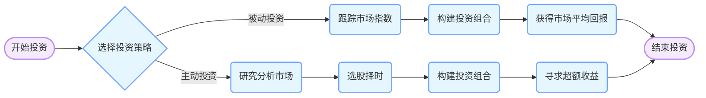

# 被动投资vs主动投资：哪种策略更适合当前市场

> 关键词：被动投资、主动投资、投资策略、当前市场、投资组合

> 摘要：本文旨在深入探讨被动投资和主动投资这两种策略，并分析在当前市场环境下哪种策略更为合适。首先介绍了文章的背景信息，包括目的、预期读者、文档结构和相关术语。接着详细阐述了被动投资和主动投资的核心概念及其联系，通过文本示意图和Mermaid流程图进行直观展示。然后讲解了两种投资策略涉及的核心算法原理，并用Python代码进行说明，同时给出了相应的数学模型和公式，并举例解释。在项目实战部分，提供了开发环境搭建的步骤，给出了实际代码案例并进行详细解读。之后探讨了两种投资策略的实际应用场景，推荐了学习资源、开发工具框架和相关论文著作。最后总结了未来发展趋势与挑战，解答了常见问题，并列出了扩展阅读和参考资料。

## 1. 背景介绍 
### 1.1 目的和范围
在金融投资领域，投资者面临着多种投资策略的选择，其中被动投资和主动投资是两种主流的策略。本文章的目的在于全面分析这两种投资策略的特点、优势和劣势，并结合当前市场的实际情况，探讨哪种策略更适合投资者。文章的范围涵盖了被动投资和主动投资的核心概念、算法原理、数学模型、实际应用案例等方面，旨在为投资者提供一个系统、深入的投资策略分析。

### 1.2 预期读者
本文预期读者包括对金融投资感兴趣的个人投资者、金融从业者、投资研究人员以及相关专业的学生。无论您是投资新手，希望了解基本的投资策略知识，还是有一定投资经验的专业人士，希望进一步探讨不同投资策略在当前市场的适用性，都能从本文中获得有价值的信息。

### 1.3 文档结构概述
本文将按照以下结构进行组织：首先介绍被动投资和主动投资的核心概念及其联系，通过文本示意图和流程图进行直观展示；接着讲解两种投资策略的核心算法原理，并用Python代码详细阐述；然后给出相应的数学模型和公式，并举例说明；在项目实战部分，提供开发环境搭建步骤、实际代码案例及详细解读；之后探讨两种投资策略的实际应用场景；推荐学习资源、开发工具框架和相关论文著作；最后总结未来发展趋势与挑战，解答常见问题，并列出扩展阅读和参考资料。

### 1.4 术语表
#### 1.4.1 核心术语定义
- **被动投资**：一种投资策略，通过构建投资组合来跟踪特定的市场指数，如标普500指数等，旨在获得与市场平均水平相近的回报，而不试图通过频繁交易或选股来超越市场。
- **主动投资**：投资者通过积极的研究、分析和决策，试图选择表现优于市场平均水平的投资标的，通过频繁交易、选股和择时等操作来获取超额收益。
- **市场指数**：是衡量整个市场或特定市场板块表现的统计指标，如股票市场指数反映了一组股票的整体价格变动情况。
- **夏普比率**：是一个衡量投资组合风险调整后收益的指标，它表示投资组合每承担一单位风险所获得的超过无风险收益的额外收益。

#### 1.4.2 相关概念解释
- **投资组合**：是由多种不同的投资资产组成的集合，投资者通过合理配置资产来分散风险和实现投资目标。
- **资产配置**：是指投资者将资金分配到不同类型的资产中，如股票、债券、现金等，以平衡风险和收益。
- **择时**：是指投资者试图预测市场的走势，在市场上涨时增加投资，在市场下跌时减少投资，以获取更好的投资回报。

#### 1.4.3 缩略词列表
- **ETF**：交易型开放式指数基金（Exchange Traded Fund），是一种被动投资工具，通常跟踪特定的市场指数。
- **CAPM**：资本资产定价模型（Capital Asset Pricing Model），是一种用于计算资产预期收益率的模型。

## 2. 核心概念与联系 

### 被动投资核心概念
被动投资的核心思想是市场是有效的，即市场价格已经反映了所有可用的信息。因此，投资者很难通过主动选股和择时来持续获得超过市场平均水平的回报。被动投资者通常选择跟踪市场指数的投资工具，如ETF，来构建投资组合。通过这种方式，投资者可以获得与市场指数相近的回报，同时降低交易成本和管理费用。

### 主动投资核心概念
主动投资的核心观点是市场并非完全有效，存在一些被低估或高估的投资标的。主动投资者通过深入的研究和分析，试图发现这些投资机会，并通过积极的交易和资产配置来获取超额收益。主动投资者需要具备较强的专业知识、分析能力和决策能力，以应对市场的变化和不确定性。

### 核心概念的联系
被动投资和主动投资并不是相互排斥的，而是可以相互补充的。在实际投资中，投资者可以根据自己的投资目标、风险承受能力和市场情况，将被动投资和主动投资结合起来，构建一个多元化的投资组合。例如，投资者可以将大部分资金用于被动投资，以获取市场平均回报，同时将小部分资金用于主动投资，以寻求超额收益。

### 文本示意图
```plaintext
被动投资：跟踪市场指数 -> 获得市场平均回报 -> 低交易成本和管理费用
主动投资：研究分析选股择时 -> 寻求超额收益 -> 高交易成本和管理费用
```

### Mermaid流程图


## 3. 核心算法原理 & 具体操作步骤 

### 被动投资核心算法原理及Python代码实现
被动投资的核心算法原理是根据所选市场指数的成分股及其权重，构建与之相似的投资组合。以跟踪标普500指数为例，以下是一个简单的Python代码示例：

```python
import pandas as pd

# 假设我们已经获取了标普500指数的成分股及其权重数据
# 这里使用一个简单的模拟数据
sp500_components = {
    'Stock1': 0.05,
    'Stock2': 0.03,
    'Stock3': 0.02,
    # 可以继续添加更多成分股
}

# 假设我们有10000美元的资金用于投资
total_funds = 10000

# 计算每个成分股的投资金额
investment_amounts = {}
for stock, weight in sp500_components.items():
    investment_amounts[stock] = total_funds * weight

# 输出每个成分股的投资金额
for stock, amount in investment_amounts.items():
    print(f"投资 {stock} 的金额为: ${amount:.2f}")
```

### 主动投资核心算法原理及Python代码实现
主动投资的核心算法原理涉及到选股和择时。选股通常基于基本面分析和技术分析，择时则基于对市场走势的预测。以下是一个简单的基于移动平均线交叉的择时策略的Python代码示例：

```python
import pandas as pd
import yfinance as yf
import matplotlib.pyplot as plt

# 下载股票数据
stock_symbol = 'AAPL'
start_date = '2020-01-01'
end_date = '2023-01-01'
data = yf.download(stock_symbol, start=start_date, end=end_date)

# 计算短期和长期移动平均线
short_window = 50
long_window = 200
data['Short_MA'] = data['Close'].rolling(window=short_window).mean()
data['Long_MA'] = data['Close'].rolling(window=long_window).mean()

# 生成交易信号
data['Signal'] = 0
data.loc[data['Short_MA'] > data['Long_MA'], 'Signal'] = 1
data.loc[data['Short_MA'] < data['Long_MA'], 'Signal'] = -1

# 绘制股票价格和移动平均线
plt.figure(figsize=(12, 6))
plt.plot(data['Close'], label='Close Price')
plt.plot(data['Short_MA'], label=f'{short_window}-Day MA')
plt.plot(data['Long_MA'], label=f'{long_window}-Day MA')
plt.scatter(data[data['Signal'] == 1].index, data[data['Signal'] == 1]['Close'], marker='^', color='g', label='Buy Signal')
plt.scatter(data[data['Signal'] == -1].index, data[data['Signal'] == -1]['Close'], marker='v', color='r', label='Sell Signal')
plt.title(f'{stock_symbol} Moving Average Crossover Strategy')
plt.xlabel('Date')
plt.ylabel('Price')
plt.legend()
plt.show()
```

### 具体操作步骤
#### 被动投资操作步骤
1. **选择市场指数**：根据自己的投资目标和风险偏好，选择适合的市场指数，如标普500指数、纳斯达克100指数等。
2. **选择投资工具**：可以选择ETF或指数基金来跟踪所选的市场指数。
3. **确定投资金额**：根据自己的资金状况和投资计划，确定投资的总金额。
4. **构建投资组合**：按照所选市场指数的成分股及其权重，将资金分配到各个成分股中。
5. **定期调整**：定期对投资组合进行调整，以确保其与市场指数的权重保持一致。

#### 主动投资操作步骤
1. **市场研究**：对宏观经济、行业趋势和公司基本面进行深入研究，了解市场的整体情况和投资机会。
2. **选股**：根据研究结果，选择具有投资价值的股票。可以使用基本面分析和技术分析等方法进行选股。
3. **择时**：根据对市场走势的预测，选择合适的时机买入和卖出股票。可以使用技术分析、量化模型等方法进行择时。
4. **构建投资组合**：将所选的股票按照一定的比例构建投资组合，以分散风险。
5. **监控和调整**：定期对投资组合进行监控和调整，根据市场变化和公司基本面的变化，及时调整投资组合的构成。

## 4. 数学模型和公式 & 详细讲解 & 举例说明 

### 被动投资数学模型和公式
#### 投资组合收益率
被动投资组合的收益率可以通过以下公式计算：

$$R_p = \sum_{i=1}^{n} w_i R_i$$

其中，$R_p$ 是投资组合的收益率，$w_i$ 是第 $i$ 个成分股的权重，$R_i$ 是第 $i$ 个成分股的收益率，$n$ 是成分股的数量。

**举例说明**：假设一个被动投资组合跟踪标普500指数，该指数包含3只成分股，权重分别为 $w_1 = 0.5$，$w_2 = 0.3$，$w_3 = 0.2$，对应的收益率分别为 $R_1 = 0.1$，$R_2 = 0.05$，$R_3 = 0.02$。则该投资组合的收益率为：

$$R_p = 0.5 \times 0.1 + 0.3 \times 0.05 + 0.2 \times 0.02 = 0.05 + 0.015 + 0.004 = 0.069 = 6.9\%$$

#### 夏普比率
夏普比率是衡量投资组合风险调整后收益的重要指标，其计算公式为：

$$Sharpe Ratio = \frac{R_p - R_f}{\sigma_p}$$

其中，$R_p$ 是投资组合的收益率，$R_f$ 是无风险收益率，$\sigma_p$ 是投资组合的标准差。

**举例说明**：假设上述投资组合的收益率 $R_p = 6.9\%$，无风险收益率 $R_f = 2\%$，投资组合的标准差 $\sigma_p = 10\%$。则该投资组合的夏普比率为：

$$Sharpe Ratio = \frac{0.069 - 0.02}{0.1} = \frac{0.049}{0.1} = 0.49$$

### 主动投资数学模型和公式
#### 资本资产定价模型（CAPM）
CAPM 是一种用于计算资产预期收益率的模型，其公式为：

$$E(R_i) = R_f + \beta_i (E(R_m) - R_f)$$

其中，$E(R_i)$ 是第 $i$ 个资产的预期收益率，$R_f$ 是无风险收益率，$\beta_i$ 是第 $i$ 个资产的贝塔系数，$E(R_m)$ 是市场组合的预期收益率。

**举例说明**：假设无风险收益率 $R_f = 2\%$，市场组合的预期收益率 $E(R_m) = 8\%$，某只股票的贝塔系数 $\beta = 1.2$。则该股票的预期收益率为：

$$E(R_i) = 0.02 + 1.2 \times (0.08 - 0.02) = 0.02 + 1.2 \times 0.06 = 0.02 + 0.072 = 0.092 = 9.2\%$$

#### 信息比率
信息比率是衡量主动投资经理选股能力的指标，其计算公式为：

$$Information Ratio = \frac{R_p - R_b}{\sigma_{(R_p - R_b)}}$$

其中，$R_p$ 是投资组合的收益率，$R_b$ 是基准收益率，$\sigma_{(R_p - R_b)}$ 是投资组合收益率与基准收益率差值的标准差。

**举例说明**：假设投资组合的收益率 $R_p = 10\%$，基准收益率 $R_b = 8\%$，投资组合收益率与基准收益率差值的标准差 $\sigma_{(R_p - R_b)} = 5\%$。则该投资组合的信息比率为：

$$Information Ratio = \frac{0.1 - 0.08}{0.05} = \frac{0.02}{0.05} = 0.4$$

## 5. 项目实战：代码实际案例和详细解释说明 

### 5.1  开发环境搭建
#### 安装Python
首先，需要安装Python编程环境。可以从Python官方网站（https://www.python.org/downloads/）下载适合自己操作系统的Python版本，并按照安装向导进行安装。

#### 安装必要的库
在命令行中使用以下命令安装必要的Python库：

```sh
pip install pandas yfinance matplotlib
```

- `pandas`：用于数据处理和分析。
- `yfinance`：用于下载股票数据。
- `matplotlib`：用于绘制图表。

### 5.2  源代码详细实现和代码解读
#### 被动投资代码实现和解读
```python
import pandas as pd

# 假设我们已经获取了标普500指数的成分股及其权重数据
# 这里使用一个简单的模拟数据
sp500_components = {
    'Stock1': 0.05,
    'Stock2': 0.03,
    'Stock3': 0.02,
    # 可以继续添加更多成分股
}

# 假设我们有10000美元的资金用于投资
total_funds = 10000

# 计算每个成分股的投资金额
investment_amounts = {}
for stock, weight in sp500_components.items():
    investment_amounts[stock] = total_funds * weight

# 输出每个成分股的投资金额
for stock, amount in investment_amounts.items():
    print(f"投资 {stock} 的金额为: ${amount:.2f}")
```

**代码解读**：
1. **导入必要的库**：导入 `pandas` 库用于数据处理。
2. **定义成分股及其权重**：使用字典 `sp500_components` 定义标普500指数的成分股及其权重。
3. **定义投资总金额**：将投资总金额 `total_funds` 设为10000美元。
4. **计算每个成分股的投资金额**：遍历成分股及其权重，计算每个成分股的投资金额，并存储在字典 `investment_amounts` 中。
5. **输出投资金额**：遍历 `investment_amounts` 字典，输出每个成分股的投资金额。

#### 主动投资代码实现和解读
```python
import pandas as pd
import yfinance as yf
import matplotlib.pyplot as plt

# 下载股票数据
stock_symbol = 'AAPL'
start_date = '2020-01-01'
end_date = '2023-01-01'
data = yf.download(stock_symbol, start=start_date, end=end_date)

# 计算短期和长期移动平均线
short_window = 50
long_window = 200
data['Short_MA'] = data['Close'].rolling(window=short_window).mean()
data['Long_MA'] = data['Close'].rolling(window=long_window).mean()

# 生成交易信号
data['Signal'] = 0
data.loc[data['Short_MA'] > data['Long_MA'], 'Signal'] = 1
data.loc[data['Short_MA'] < data['Long_MA'], 'Signal'] = -1

# 绘制股票价格和移动平均线
plt.figure(figsize=(12, 6))
plt.plot(data['Close'], label='Close Price')
plt.plot(data['Short_MA'], label=f'{short_window}-Day MA')
plt.plot(data['Long_MA'], label=f'{long_window}-Day MA')
plt.scatter(data[data['Signal'] == 1].index, data[data['Signal'] == 1]['Close'], marker='^', color='g', label='Buy Signal')
plt.scatter(data[data['Signal'] == -1].index, data[data['Signal'] == -1]['Close'], marker='v', color='r', label='Sell Signal')
plt.title(f'{stock_symbol} Moving Average Crossover Strategy')
plt.xlabel('Date')
plt.ylabel('Price')
plt.legend()
plt.show()
```

**代码解读**：
1. **导入必要的库**：导入 `pandas` 用于数据处理，`yfinance` 用于下载股票数据，`matplotlib.pyplot` 用于绘制图表。
2. **下载股票数据**：使用 `yfinance.download` 函数下载苹果公司（AAPL）从2020年1月1日到2023年1月1日的股票数据。
3. **计算移动平均线**：计算50天和200天的移动平均线，并将结果存储在 `data` 数据框中。
4. **生成交易信号**：根据短期移动平均线和长期移动平均线的交叉情况，生成交易信号。当短期移动平均线大于长期移动平均线时，信号为1（买入）；当短期移动平均线小于长期移动平均线时，信号为 -1（卖出）。
5. **绘制图表**：使用 `matplotlib` 绘制股票价格、移动平均线和交易信号的图表，直观展示投资策略。

### 5.3  代码解读与分析
#### 被动投资代码分析
被动投资代码的核心是根据市场指数的成分股及其权重，计算每个成分股的投资金额。这种方法简单直接，能够确保投资组合与市场指数的权重一致，从而获得与市场指数相近的回报。但是，被动投资无法通过选股和择时来获取超额收益，只能获得市场平均水平的回报。

#### 主动投资代码分析
主动投资代码使用了移动平均线交叉策略来进行择时。这种策略基于技术分析，通过短期和长期移动平均线的交叉情况来判断市场的买卖时机。当短期移动平均线向上穿过长期移动平均线时，发出买入信号；当短期移动平均线向下穿过长期移动平均线时，发出卖出信号。主动投资策略的优点是有可能通过选股和择时来获取超额收益，但缺点是需要投资者具备较强的专业知识和分析能力，同时也面临较高的交易成本和风险。

## 6. 实际应用场景 
### 被动投资实际应用场景
- **长期投资**：对于那些没有时间和专业知识进行深入研究和分析的投资者来说，被动投资是一种理想的长期投资策略。通过跟踪市场指数，投资者可以获得市场平均水平的回报，同时降低交易成本和管理费用。
- **资产配置**：被动投资可以作为资产配置的一部分，帮助投资者分散风险。例如，投资者可以将一部分资金投资于股票市场指数ETF，另一部分资金投资于债券市场指数ETF，以平衡风险和收益。
- **退休储蓄**：对于退休储蓄来说，被动投资是一种稳健的选择。由于退休储蓄的时间跨度较长，市场的长期趋势通常是向上的，因此通过被动投资跟踪市场指数，可以获得较为稳定的回报。

### 主动投资实际应用场景
- **追求超额收益**：对于那些具备较强专业知识和分析能力的投资者来说，主动投资可以帮助他们追求超额收益。通过深入研究和分析，投资者可以发现被低估或高估的投资标的，并通过积极的交易和资产配置来获取超额收益。
- **短期交易**：主动投资适合于短期交易，投资者可以根据市场的短期波动和热点，进行快速的买卖操作，以获取短期的投资回报。
- **特定市场机会**：在某些特定的市场环境下，主动投资可能更具优势。例如，在新兴市场或行业快速发展的时期，主动投资者可以通过深入研究和分析，发现具有潜力的投资机会。

## 7. 工具和资源推荐
### 7.1 学习资源推荐
#### 7.1.1 书籍推荐
- 《聪明的投资者》（The Intelligent Investor）：作者是本杰明·格雷厄姆（Benjamin Graham），这本书被誉为投资领域的圣经，介绍了价值投资的基本原理和方法。
- 《漫步华尔街》（A Random Walk Down Wall Street）：作者是伯顿·马尔基尔（Burton Malkiel），本书探讨了有效市场假说和被动投资的优势。
- 《金融炼金术》（The Alchemy of Finance）：作者是乔治·索罗斯（George Soros），书中分享了索罗斯的投资哲学和交易策略。

#### 7.1.2 在线课程
- Coursera上的“投资学原理”（Principles of Investing）课程：由宾夕法尼亚大学沃顿商学院教授授课，介绍了投资的基本概念、理论和方法。
- edX上的“金融市场”（Financial Markets）课程：由耶鲁大学教授罗伯特·席勒（Robert Shiller）授课，探讨了金融市场的运作机制和投资策略。
- Udemy上的“量化投资实战”（Quantitative Investing in Practice）课程：介绍了量化投资的基本原理和方法，并通过实际案例进行讲解。

#### 7.1.3 技术博客和网站
- 雪球（https://xueqiu.com/）：国内知名的投资社区，提供股票、基金等投资产品的行情、分析和讨论。
- 晨星（https://www.morningstar.com/）：全球知名的投资研究机构，提供基金评级、分析和投资建议。
- Seeking Alpha（https://seekingalpha.com/）：提供股票、基金等投资产品的分析和评论，以及专业投资者的观点和建议。

### 7.2 开发工具框架推荐
#### 7.2.1 IDE和编辑器
- PyCharm：是一款专业的Python集成开发环境，提供了丰富的代码编辑、调试和分析功能，适合Python开发。
- Jupyter Notebook：是一个交互式的开发环境，支持Python、R等多种编程语言，适合数据分析和可视化。
- Visual Studio Code：是一款轻量级的代码编辑器，支持多种编程语言和插件扩展，适合快速开发和调试。

#### 7.2.2 调试和性能分析工具
- pdb：是Python自带的调试工具，可以帮助开发者定位和解决代码中的问题。
- cProfile：是Python的性能分析工具，可以分析代码的运行时间和函数调用情况，帮助开发者优化代码性能。
- Py-Spy：是一个用于分析Python程序性能的工具，可以实时监控Python程序的CPU使用情况和函数调用栈。

#### 7.2.3 相关框架和库
- Pandas：是Python中用于数据处理和分析的强大库，提供了高效的数据结构和数据操作方法。
- NumPy：是Python中用于科学计算的基础库，提供了多维数组对象和各种数学函数。
- Scikit-learn：是Python中用于机器学习的常用库，提供了各种机器学习算法和工具。

### 7.3 相关论文著作推荐
#### 7.3.1 经典论文
- “有效资本市场：理论与实证研究回顾”（Efficient Capital Markets: A Review of Theory and Empirical Work）：作者是尤金·法玛（Eugene F. Fama），这篇论文提出了有效市场假说，对金融市场的研究产生了深远影响。
- “资本资产定价：风险条件下的市场均衡理论”（Capital Asset Prices: A Theory of Market Equilibrium Under Conditions of Risk）：作者是威廉·夏普（William F. Sharpe），这篇论文提出了资本资产定价模型（CAPM），为资产定价提供了重要的理论基础。
- “股票市场价格行为”（The Behavior of Stock Market Prices）：作者是保罗·萨缪尔森（Paul A. Samuelson），这篇论文探讨了股票市场价格的随机游走特性。

#### 7.3.2 最新研究成果
- 关注《金融研究评论》（Review of Financial Studies）、《金融经济学杂志》（Journal of Financial Economics）等顶级金融学术期刊，了解最新的投资研究成果。
- 可以通过谷歌学术（https://scholar.google.com/）等学术搜索引擎，搜索关于被动投资和主动投资的最新研究论文。

#### 7.3.3 应用案例分析
- 一些知名投资机构的年报和研究报告中通常会包含投资策略的应用案例分析，可以参考这些报告了解实际投资中的应用情况。
- 一些金融媒体和网站也会报道投资策略的应用案例，可以关注这些报道获取相关信息。

## 8. 总结：未来发展趋势与挑战
### 未来发展趋势
- **被动投资持续增长**：随着投资者对投资成本和市场有效性的认识不断提高，被动投资的规模有望继续增长。越来越多的投资者将选择跟踪市场指数的ETF和指数基金，以获取市场平均回报。
- **主动投资与被动投资融合**：未来，主动投资和被动投资可能会更加融合。投资者可能会将被动投资作为基础，同时结合主动投资策略，以寻求超额收益。例如，投资者可以在被动投资组合的基础上，通过主动选股和择时来增加一部分投资收益。
- **量化投资和人工智能应用增加**：量化投资和人工智能技术在投资领域的应用将越来越广泛。通过使用大数据分析、机器学习和深度学习等技术，投资者可以更准确地预测市场走势和发现投资机会。

### 挑战
- **市场不确定性增加**：全球经济和政治环境的不确定性增加，使得市场波动加剧，投资难度加大。无论是被动投资还是主动投资，都面临着市场风险和不确定性的挑战。
- **技术发展带来的竞争压力**：随着量化投资和人工智能技术的发展，投资领域的竞争将更加激烈。投资者需要不断学习和掌握新的技术和方法，以提高自己的投资能力和竞争力。
- **监管要求提高**：金融监管机构对投资行业的监管要求不断提高，投资者需要遵守更加严格的法律法规和合规要求。这对投资者的投资决策和操作带来了一定的挑战。

## 9. 附录：常见问题与解答
### 被动投资是否适合所有投资者？
被动投资并不适合所有投资者。对于那些追求超额收益、具备较强专业知识和分析能力的投资者来说，主动投资可能更适合他们。而对于那些没有时间和专业知识进行深入研究和分析的投资者来说，被动投资是一种较为理想的选择。

### 主动投资一定能获得超额收益吗？
主动投资并不一定能获得超额收益。虽然主动投资者通过深入研究和分析，试图发现被低估或高估的投资标的，但市场是复杂和不确定的，投资者的判断可能会出现失误。此外，主动投资还面临着较高的交易成本和管理费用，这些都会影响投资收益。

### 如何选择适合自己的投资策略？
选择适合自己的投资策略需要考虑多个因素，包括投资目标、风险承受能力、投资时间、专业知识和经验等。如果你的投资目标是长期稳定的回报，风险承受能力较低，且没有太多时间和专业知识进行投资研究，那么被动投资可能更适合你。如果你的投资目标是追求超额收益，风险承受能力较高，且具备较强的专业知识和分析能力，那么主动投资可能更适合你。

### 被动投资和主动投资可以结合使用吗？
可以。被动投资和主动投资并不是相互排斥的，而是可以相互补充的。投资者可以将大部分资金用于被动投资，以获取市场平均回报，同时将小部分资金用于主动投资，以寻求超额收益。这样可以在降低风险的同时，提高投资组合的收益。

## 10. 扩展阅读 & 参考资料
### 扩展阅读
- 《投资最重要的事》（The Most Important Thing Illuminated）：作者是霍华德·马克斯（Howard Marks），书中分享了作者的投资经验和哲学。
- 《战胜华尔街》（One Up On Wall Street）：作者是彼得·林奇（Peter Lynch），介绍了林奇的选股方法和投资策略。
- 《金融的智慧》（The Wisdom of Finance）：作者是米希尔·德赛（Mihir A. Desai），从历史和现实的角度探讨了金融的本质和作用。

### 参考资料
- 金融学术期刊和研究报告，如《金融研究评论》、《金融经济学杂志》等。
- 投资机构的年报和研究报告，如晨星、贝莱德等。
- 金融媒体和网站的报道和分析，如雪球、东方财富等。

作者：AI天才研究院/AI Genius Institute & 禅与计算机程序设计艺术 /Zen And The Art of Computer Programming