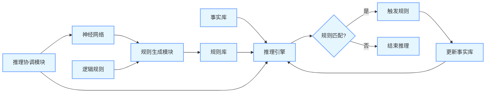

# 规则基推理系统中神经逻辑编程的集成技术

> 关键词：规则基推理系统、神经逻辑编程、集成技术、知识表示、推理机制

> 摘要：本文聚焦于规则基推理系统中神经逻辑编程的集成技术。首先介绍了相关背景知识，包括目的、预期读者、文档结构和术语表等。接着详细阐述了核心概念与联系，给出了原理和架构的文本示意图以及 Mermaid 流程图。深入探讨了核心算法原理和具体操作步骤，并使用 Python 源代码进行详细阐述。对数学模型和公式进行了详细讲解和举例说明。通过项目实战展示了代码的实际案例和详细解释。分析了该集成技术的实际应用场景，推荐了学习资源、开发工具框架以及相关论文著作。最后总结了未来发展趋势与挑战，还提供了常见问题与解答以及扩展阅读和参考资料，旨在为相关领域的研究者和开发者提供全面深入的技术指导。

## 1. 背景介绍 
### 1.1 目的和范围
规则基推理系统在人工智能领域有着广泛的应用，它基于预定义的规则进行推理和决策。然而，传统的规则基推理系统在处理不确定性、复杂模式识别和学习能力方面存在一定的局限性。神经逻辑编程结合了神经网络的学习能力和逻辑编程的知识表示与推理能力，将其集成到规则基推理系统中，可以有效弥补传统系统的不足，提高系统的性能和灵活性。

本文的范围涵盖了规则基推理系统中神经逻辑编程集成技术的各个方面，包括核心概念、算法原理、数学模型、实际应用案例等。旨在为读者提供一个全面深入的技术指南，帮助他们理解和应用这一集成技术。

### 1.2 预期读者
本文的预期读者包括人工智能领域的研究者、开发者、学生以及对规则基推理系统和神经逻辑编程感兴趣的专业人士。对于有一定编程基础和人工智能知识的读者，本文将帮助他们深入理解和掌握这一集成技术；对于初学者，本文也将提供一个系统的学习框架，引导他们逐步了解相关概念和技术。

### 1.3 文档结构概述
本文将按照以下结构进行组织：
- 核心概念与联系：介绍规则基推理系统和神经逻辑编程的核心概念，以及它们之间的联系，同时给出原理和架构的文本示意图和 Mermaid 流程图。
- 核心算法原理 & 具体操作步骤：详细阐述神经逻辑编程集成到规则基推理系统中的核心算法原理，并使用 Python 源代码进行详细说明。
- 数学模型和公式 & 详细讲解 & 举例说明：介绍相关的数学模型和公式，并通过具体例子进行详细讲解。
- 项目实战：通过一个实际的项目案例，展示代码的实现和详细解释。
- 实际应用场景：分析规则基推理系统中神经逻辑编程集成技术的实际应用场景。
- 工具和资源推荐：推荐相关的学习资源、开发工具框架和论文著作。
- 总结：未来发展趋势与挑战：总结这一集成技术的未来发展趋势和面临的挑战。
- 附录：常见问题与解答：提供常见问题的解答，帮助读者更好地理解和应用这一技术。
- 扩展阅读 & 参考资料：提供相关的扩展阅读材料和参考资料，方便读者进一步深入研究。

### 1.4 术语表
#### 1.4.1 核心术语定义
- **规则基推理系统（Rule-based Reasoning System）**：一种基于预定义规则进行推理和决策的系统，通过匹配事实和规则来得出结论。
- **神经逻辑编程（Neural Logic Programming）**：结合神经网络的学习能力和逻辑编程的知识表示与推理能力的一种技术。
- **知识表示（Knowledge Representation）**：将知识以某种形式进行表示，以便计算机能够处理和推理。
- **推理机制（Reasoning Mechanism）**：根据已知事实和规则进行推理，得出新的结论的机制。

#### 1.4.2 相关概念解释
- **神经网络（Neural Network）**：一种模仿人类神经系统的计算模型，由大量的神经元组成，通过学习数据中的模式来进行预测和分类。
- **逻辑编程（Logic Programming）**：一种基于逻辑规则进行编程的方法，通过定义事实和规则来描述问题，并使用推理引擎进行求解。

#### 1.4.3 缩略词列表
- **RBR**：Rule-based Reasoning（规则基推理）
- **NLP**：Neural Logic Programming（神经逻辑编程）

## 2. 核心概念与联系 

### 规则基推理系统的核心概念
规则基推理系统主要由规则库、事实库和推理引擎三部分组成。规则库包含了一系列的规则，每个规则由前提和结论组成。事实库存储了已知的事实。推理引擎负责根据规则库和事实库进行推理，得出新的结论。

其工作流程如下：
1. 推理引擎从事实库中获取事实。
2. 将事实与规则库中的规则进行匹配。
3. 如果某个规则的前提被满足，则触发该规则，将其结论添加到事实库中。
4. 重复步骤 1 - 3，直到没有新的结论可以得出。

### 神经逻辑编程的核心概念
神经逻辑编程结合了神经网络和逻辑编程的优点。它使用神经网络来学习数据中的模式和规律，同时使用逻辑编程来表示和推理知识。神经逻辑编程可以将逻辑规则融入到神经网络的结构中，使得神经网络具有可解释性和逻辑推理能力。

### 两者的联系
将神经逻辑编程集成到规则基推理系统中，可以弥补规则基推理系统在学习能力和处理不确定性方面的不足。神经逻辑编程可以通过学习数据来自动生成规则，或者对现有的规则进行修正和优化。同时，规则基推理系统可以为神经逻辑编程提供逻辑结构和推理框架，使得神经网络的输出具有可解释性。

### 原理和架构的文本示意图
```plaintext
规则基推理系统
├── 规则库
│   ├── 规则 1
│   │   ├── 前提
│   │   └── 结论
│   ├── 规则 2
│   │   ├── 前提
│   │   └── 结论
│   └──...
├── 事实库
│   ├── 事实 1
│   ├── 事实 2
│   └──...
└── 推理引擎
    ├── 匹配模块
    ├── 触发模块
    └── 更新模块

神经逻辑编程
├── 神经网络
│   ├── 输入层
│   ├── 隐藏层
│   └── 输出层
└── 逻辑规则
    ├── 规则 1
    ├── 规则 2
    └──...

集成系统
├── 规则基推理系统
├── 神经逻辑编程
└── 集成模块
    ├── 规则生成模块
    ├── 规则修正模块
    └── 推理协调模块
```

### Mermaid 流程图


## 3. 核心算法原理 & 具体操作步骤 

### 核心算法原理
将神经逻辑编程集成到规则基推理系统中的核心算法主要包括规则生成、规则修正和推理协调三个部分。

#### 规则生成
规则生成模块使用神经网络来学习数据中的模式和规律，自动生成新的规则。具体步骤如下：
1. 收集训练数据，包括输入特征和对应的标签。
2. 构建神经网络模型，并使用训练数据进行训练。
3. 分析神经网络的输出，提取其中的逻辑规则。

#### 规则修正
规则修正模块根据新的数据和反馈信息，对现有的规则进行修正和优化。具体步骤如下：
1. 当规则基推理系统的推理结果与实际情况不符时，记录错误信息。
2. 使用错误信息来调整神经网络的参数。
3. 根据调整后的神经网络，生成新的规则或修正现有的规则。

#### 推理协调
推理协调模块负责协调规则基推理系统和神经逻辑编程之间的推理过程。具体步骤如下：
1. 在推理过程中，优先使用规则基推理系统进行推理。
2. 当规则基推理系统无法得出结论时，调用神经逻辑编程进行推理。
3. 将神经逻辑编程的推理结果反馈给规则基推理系统，更新规则库和事实库。

### 具体操作步骤及 Python 源代码实现

#### 规则生成
```python
import numpy as np
from sklearn.neural_network import MLPClassifier

# 收集训练数据
X_train = np.array([[0, 0], [0, 1], [1, 0], [1, 1]])
y_train = np.array([0, 1, 1, 0])

# 构建神经网络模型
model = MLPClassifier(hidden_layer_sizes=(4,), activation='relu', max_iter=1000)

# 训练神经网络
model.fit(X_train, y_train)

# 提取逻辑规则（简单示例，实际情况可能更复杂）
def extract_rules(model):
    weights = model.coefs_
    biases = model.intercepts_
    # 这里只是简单示例，实际规则提取需要更复杂的算法
    rules = []
    for i in range(len(weights[0])):
        rule = f"If x1*{weights[0][0][i]} + x2*{weights[0][1][i]} + {biases[0][i]} > 0 then..."
        rules.append(rule)
    return rules

rules = extract_rules(model)
print("Generated rules:", rules)
```

#### 规则修正
```python
# 模拟错误信息
new_X = np.array([[0.5, 0.5]])
new_y = np.array([1])

# 重新训练神经网络
model.partial_fit(new_X, new_y)

# 再次提取规则
new_rules = extract_rules(model)
print("Updated rules:", new_rules)
```

#### 推理协调
```python
# 规则基推理系统简单示例
rule_base = {
    "rule1": {"premise": lambda x: x[0] == 0 and x[1] == 0, "conclusion": 0},
    "rule2": {"premise": lambda x: x[0] == 0 and x[1] == 1, "conclusion": 1},
    "rule3": {"premise": lambda x: x[0] == 1 and x[1] == 0, "conclusion": 1},
    "rule4": {"premise": lambda x: x[0] == 1 and x[1] == 1, "conclusion": 0}
}

def rule_based_reasoning(x):
    for rule in rule_base.values():
        if rule["premise"](x):
            return rule["conclusion"]
    return None

# 推理协调
def integrated_reasoning(x):
    result = rule_based_reasoning(x)
    if result is not None:
        return result
    else:
        return model.predict([x])[0]

test_x = np.array([0.5, 0.5])
result = integrated_reasoning(test_x)
print("Integrated reasoning result:", result)
```

## 4. 数学模型和公式 & 详细讲解 & 举例说明 

### 神经网络的数学模型
神经网络可以看作是一个非线性函数的逼近器。一个简单的多层感知机（MLP）可以表示为：

$$
\mathbf{h}^{(l)} = f(\mathbf{W}^{(l)}\mathbf{h}^{(l - 1)} + \mathbf{b}^{(l)})
$$

其中，$\mathbf{h}^{(l)}$ 是第 $l$ 层的输出向量，$\mathbf{W}^{(l)}$ 是第 $l$ 层的权重矩阵，$\mathbf{b}^{(l)}$ 是第 $l$ 层的偏置向量，$f$ 是激活函数。

### 逻辑规则的数学表示
逻辑规则可以用一阶逻辑来表示。例如，一个简单的规则“如果 $x_1$ 大于 0 且 $x_2$ 小于 1，则 $y$ 等于 1”可以表示为：

$$
(x_1 > 0) \land (x_2 < 1) \Rightarrow (y = 1)
$$

### 规则生成的数学原理
规则生成的目标是从神经网络的输出中提取逻辑规则。一种简单的方法是使用决策树等技术对神经网络的输出进行后处理。例如，我们可以使用 CART 算法构建一个决策树，然后将决策树转换为逻辑规则。

### 举例说明
假设我们有一个简单的神经网络，输入层有 2 个神经元，隐藏层有 2 个神经元，输出层有 1 个神经元。权重矩阵和偏置向量如下：

$$
\mathbf{W}^{(1)} = \begin{bmatrix}
1 & 2 \\
3 & 4
\end{bmatrix}, \mathbf{b}^{(1)} = \begin{bmatrix}
0.1 \\
0.2
\end{bmatrix}, \mathbf{W}^{(2)} = \begin{bmatrix}
5 \\
6
\end{bmatrix}, \mathbf{b}^{(2)} = \begin{bmatrix}
0.3
\end{bmatrix}
$$

激活函数为 sigmoid 函数：

$$
f(x) = \frac{1}{1 + e^{-x}}
$$

对于输入 $\mathbf{x} = \begin{bmatrix}
0.1 \\
0.2
\end{bmatrix}$，我们可以计算隐藏层的输出：

$$
\mathbf{h}^{(1)} = f(\mathbf{W}^{(1)}\mathbf{x} + \mathbf{b}^{(1)}) = f\left(\begin{bmatrix}
1 & 2 \\
3 & 4
\end{bmatrix}\begin{bmatrix}
0.1 \\
0.2
\end{bmatrix} + \begin{bmatrix}
0.1 \\
0.2
\end{bmatrix}\right) = f\left(\begin{bmatrix}
0.1 + 0.4 + 0.1 \\
0.3 + 0.8 + 0.2
\end{bmatrix}\right) = f\left(\begin{bmatrix}
0.6 \\
1.3
\end{bmatrix}\right) = \begin{bmatrix}
\frac{1}{1 + e^{-0.6}} \\
\frac{1}{1 + e^{-1.3}}
\end{bmatrix} \approx \begin{bmatrix}
0.645 \\
0.786
\end{bmatrix}
$$

然后计算输出层的输出：

$$
\mathbf{h}^{(2)} = f(\mathbf{W}^{(2)}\mathbf{h}^{(1)} + \mathbf{b}^{(2)}) = f\left(\begin{bmatrix}
5 \\
6
\end{bmatrix}\begin{bmatrix}
0.645 \\
0.786
\end{bmatrix} + \begin{bmatrix}
0.3
\end{bmatrix}\right) = f\left(\begin{bmatrix}
3.225 + 4.716 + 0.3
\end{bmatrix}\right) = f\left(\begin{bmatrix}
8.241
\end{bmatrix}\right) \approx \begin{bmatrix}
0.999
\end{bmatrix}
$$

通过分析神经网络的输入和输出关系，我们可以尝试提取逻辑规则。例如，如果我们发现当 $x_1$ 和 $x_2$ 都大于某个阈值时，输出接近 1，我们可以生成规则“如果 $x_1 > 0.05$ 且 $x_2 > 0.1$，则 $y$ 接近 1”。

## 5. 项目实战：代码实际案例和详细解释说明 

### 5.1  开发环境搭建
#### 操作系统
本项目可以在 Windows、Linux 或 macOS 操作系统上进行开发。建议使用 Linux 系统，如 Ubuntu 18.04 或更高版本，因为它对 Python 开发和深度学习框架的支持较好。

#### Python 环境
安装 Python 3.7 或更高版本。可以从 Python 官方网站（https://www.python.org/downloads/）下载并安装。

#### 依赖库安装
使用 `pip` 安装以下依赖库：
```sh
pip install numpy scikit-learn
```

### 5.2  源代码详细实现和代码解读
```python
import numpy as np
from sklearn.neural_network import MLPClassifier

# 步骤 1: 数据准备
# 这里我们使用一个简单的异或数据集作为示例
X_train = np.array([[0, 0], [0, 1], [1, 0], [1, 1]])
y_train = np.array([0, 1, 1, 0])

# 步骤 2: 构建神经网络模型
# 创建一个多层感知机分类器，隐藏层有 4 个神经元，激活函数为 ReLU
model = MLPClassifier(hidden_layer_sizes=(4,), activation='relu', max_iter=1000)

# 步骤 3: 训练神经网络
# 使用训练数据对模型进行训练
model.fit(X_train, y_train)

# 步骤 4: 规则生成
# 定义一个函数来提取逻辑规则
def extract_rules(model):
    weights = model.coefs_
    biases = model.intercepts_
    rules = []
    # 遍历隐藏层的每个神经元
    for i in range(len(weights[0])):
        # 构建一个简单的规则字符串
        rule = f"If x1*{weights[0][0][i]} + x2*{weights[0][1][i]} + {biases[0][i]} > 0 then..."
        rules.append(rule)
    return rules

# 提取规则
rules = extract_rules(model)
print("Generated rules:", rules)

# 步骤 5: 规则修正
# 模拟新的数据
new_X = np.array([[0.5, 0.5]])
new_y = np.array([1])

# 部分拟合模型，使用新的数据进行更新
model.partial_fit(new_X, new_y)

# 再次提取规则
new_rules = extract_rules(model)
print("Updated rules:", new_rules)

# 步骤 6: 规则基推理系统实现
# 定义规则基，每个规则包含前提和结论
rule_base = {
    "rule1": {"premise": lambda x: x[0] == 0 and x[1] == 0, "conclusion": 0},
    "rule2": {"premise": lambda x: x[0] == 0 and x[1] == 1, "conclusion": 1},
    "rule3": {"premise": lambda x: x[0] == 1 and x[1] == 0, "conclusion": 1},
    "rule4": {"premise": lambda x: x[0] == 1 and x[1] == 1, "conclusion": 0}
}

# 定义规则基推理函数
def rule_based_reasoning(x):
    # 遍历规则基中的每个规则
    for rule in rule_base.values():
        # 检查前提是否满足
        if rule["premise"](x):
            # 如果满足，返回结论
            return rule["conclusion"]
    return None

# 步骤 7: 推理协调
# 定义集成推理函数
def integrated_reasoning(x):
    # 首先尝试使用规则基推理
    result = rule_based_reasoning(x)
    if result is not None:
        return result
    else:
        # 如果规则基推理无法得出结论，使用神经网络进行推理
        return model.predict([x])[0]

# 测试集成推理
test_x = np.array([0.5, 0.5])
result = integrated_reasoning(test_x)
print("Integrated reasoning result:", result)
```

### 5.3  代码解读与分析
#### 数据准备
我们使用一个简单的异或数据集作为训练数据。异或问题是一个经典的非线性问题，适合用来演示神经网络的学习能力。

#### 神经网络模型构建
使用 `MLPClassifier` 构建一个多层感知机分类器。我们设置隐藏层有 4 个神经元，激活函数为 ReLU。ReLU 函数可以有效地解决梯度消失问题，提高模型的训练效率。

#### 训练神经网络
使用 `fit` 方法对模型进行训练。训练过程中，神经网络会自动调整权重和偏置，以最小化预测结果和真实标签之间的误差。

#### 规则生成
定义了一个 `extract_rules` 函数来提取逻辑规则。该函数通过分析神经网络的权重和偏置，生成简单的规则字符串。需要注意的是，这里的规则提取方法比较简单，实际应用中可能需要更复杂的算法。

#### 规则修正
模拟了新的数据，并使用 `partial_fit` 方法对模型进行部分拟合。部分拟合可以在不重新训练整个模型的情况下，使用新的数据对模型进行更新。

#### 规则基推理系统实现
定义了一个规则基，包含 4 个规则。每个规则由一个前提和一个结论组成。`rule_based_reasoning` 函数用于根据规则基进行推理。

#### 推理协调
`integrated_reasoning` 函数实现了推理协调。首先尝试使用规则基推理，如果无法得出结论，则使用神经网络进行推理。

## 6. 实际应用场景 
### 医疗诊断
在医疗诊断中，规则基推理系统可以存储医学专家的诊断规则，如“如果患者出现咳嗽、发热和呼吸困难等症状，则可能患有肺炎”。然而，这些规则可能无法涵盖所有的情况，特别是对于一些罕见疾病或复杂病例。神经逻辑编程可以通过学习大量的医疗数据，如病历、影像资料等，自动生成新的诊断规则或修正现有的规则。例如，神经网络可以学习到某些特定基因组合与某种疾病之间的关联，从而为诊断提供更准确的依据。

### 金融风险评估
金融机构在进行风险评估时，通常会使用规则基推理系统来评估客户的信用风险。例如，规则可能规定“如果客户的信用评分低于 600 分，且负债收入比高于 50%，则拒绝贷款申请”。然而，金融市场是复杂多变的，传统的规则可能无法及时适应市场的变化。神经逻辑编程可以通过学习历史金融数据，预测市场趋势和客户行为，为风险评估提供更全面的信息。例如，神经网络可以学习到宏观经济指标、行业动态等因素对客户信用风险的影响，从而生成更准确的风险评估规则。

### 智能交通系统
在智能交通系统中，规则基推理系统可以用于交通信号控制、路径规划等。例如，规则可能规定“如果某个路口的车流量超过一定阈值，则延长该路口的绿灯时间”。然而，交通流量是动态变化的，传统的规则可能无法实时调整。神经逻辑编程可以通过学习交通传感器采集的数据，如车辆速度、密度等，预测交通流量的变化，为交通控制提供更智能的决策。例如，神经网络可以学习到不同时间段、不同天气条件下的交通流量模式，从而自动调整交通信号的时间和路径规划策略。

### 工业自动化
在工业自动化领域，规则基推理系统可以用于设备故障诊断、生产调度等。例如，规则可能规定“如果设备的温度超过一定阈值，且振动频率异常，则设备可能出现故障”。然而，工业生产过程中存在许多不确定性因素，传统的规则可能无法准确诊断故障。神经逻辑编程可以通过学习设备的运行数据，如传感器读数、历史故障记录等，自动生成故障诊断规则或修正现有的规则。例如，神经网络可以学习到设备在不同工况下的正常运行模式，从而更准确地识别故障。

## 7. 工具和资源推荐
### 7.1 学习资源推荐
#### 7.1.1 书籍推荐
- 《人工智能：一种现代的方法》（Artificial Intelligence: A Modern Approach）：这本书是人工智能领域的经典教材，全面介绍了人工智能的各个方面，包括规则基推理系统和神经逻辑编程等内容。
- 《深度学习》（Deep Learning）：由 Ian Goodfellow、Yoshua Bengio 和 Aaron Courville 撰写，详细介绍了深度学习的原理和应用，对于理解神经逻辑编程中的神经网络部分非常有帮助。
- 《逻辑编程基础》（Foundations of Logic Programming）：这本书深入探讨了逻辑编程的理论和实践，对于学习神经逻辑编程中的逻辑规则表示和推理非常有价值。

#### 7.1.2 在线课程
- Coursera 上的“人工智能基础”（Foundations of Artificial Intelligence）课程：该课程由斯坦福大学的教授授课，系统地介绍了人工智能的基本概念和方法，包括规则基推理和机器学习等内容。
- edX 上的“深度学习”（Deep Learning Specialization）课程：由 Andrew Ng 教授授课，全面介绍了深度学习的各个方面，包括神经网络的构建、训练和优化等。
- Udemy 上的“逻辑编程入门”（Introduction to Logic Programming）课程：该课程适合初学者，详细介绍了逻辑编程的基本概念和编程技巧。

#### 7.1.3 技术博客和网站
- Towards Data Science：这是一个专注于数据科学和人工智能的技术博客，上面有许多关于规则基推理系统和神经逻辑编程的文章和教程。
- Medium 的 AI 板块：Medium 上有很多人工智能领域的专家分享他们的研究成果和实践经验，对于学习和了解最新的技术动态非常有帮助。
- ArXiv：这是一个预印本论文库，上面可以找到许多关于规则基推理系统和神经逻辑编程的最新研究论文。

### 7.2 开发工具框架推荐
#### 7.2.1 IDE和编辑器
- PyCharm：这是一个专门为 Python 开发设计的集成开发环境（IDE），具有强大的代码编辑、调试和项目管理功能，非常适合开发规则基推理系统和神经逻辑编程相关的项目。
- Jupyter Notebook：这是一个交互式的开发环境，支持 Python 等多种编程语言。它可以方便地进行代码编写、实验和结果展示，对于数据探索和模型训练非常有用。
- Visual Studio Code：这是一个轻量级的代码编辑器，具有丰富的插件生态系统。可以通过安装 Python 相关的插件，将其打造成一个强大的 Python 开发环境。

#### 7.2.2 调试和性能分析工具
- pdb：Python 自带的调试器，可以帮助开发者在代码中设置断点、单步执行代码，方便调试程序。
- TensorBoard：这是 TensorFlow 提供的一个可视化工具，可以用于监控模型的训练过程、分析模型的性能和可视化模型的结构。
- cProfile：Python 标准库中的性能分析工具，可以帮助开发者找出代码中的性能瓶颈，优化代码的执行效率。

#### 7.2.3 相关框架和库
- scikit-learn：这是一个广泛使用的机器学习库，提供了许多常用的机器学习算法和工具，包括神经网络、决策树等。可以用于实现规则生成和规则修正等功能。
- PyTorch：这是一个开源的深度学习框架，具有动态图和静态图两种编程模式，非常适合开发神经逻辑编程相关的模型。
- Prolog：这是一种逻辑编程语言，专门用于处理逻辑规则和推理。可以与 Python 结合使用，实现规则基推理系统。

### 7.3 相关论文著作推荐
#### 7.3.1 经典论文
- “Neural Logic Programming”：这篇论文首次提出了神经逻辑编程的概念，介绍了如何将神经网络和逻辑编程相结合，为后续的研究奠定了基础。
- “Knowledge Representation and Reasoning”：这篇论文系统地介绍了知识表示和推理的理论和方法，对于理解规则基推理系统的原理非常有帮助。
- “Deep Neural Networks for Rule Learning”：该论文探讨了如何使用深度学习技术进行规则学习，提出了一些新的算法和方法。

#### 7.3.2 最新研究成果
- 在 ArXiv 和各大人工智能学术会议（如 AAAI、IJCAI、NeurIPS 等）上可以找到许多关于规则基推理系统中神经逻辑编程集成技术的最新研究成果。这些研究通常会提出一些新的算法、模型和应用场景，对于了解该领域的最新动态非常有帮助。

#### 7.3.3 应用案例分析
- 一些学术期刊（如 Journal of Artificial Intelligence Research、Artificial Intelligence）和行业报告中会有关于规则基推理系统和神经逻辑编程在实际应用中的案例分析。通过阅读这些案例，可以学习到如何将理论知识应用到实际项目中，解决实际问题。

## 8. 总结：未来发展趋势与挑战
### 未来发展趋势
#### 更强的学习和推理能力
未来的规则基推理系统中神经逻辑编程集成技术将不断提高学习和推理能力。通过引入更复杂的神经网络架构和更高效的逻辑推理算法，系统可以更好地处理大规模、高维度的数据，自动生成更准确、更复杂的规则，从而提高推理的准确性和效率。

#### 与其他技术的融合
神经逻辑编程集成技术将与其他人工智能技术（如强化学习、自然语言处理等）进行更深入的融合。例如，在智能机器人领域，将神经逻辑编程与强化学习相结合，可以使机器人在复杂环境中更好地学习和决策；在智能客服领域，将神经逻辑编程与自然语言处理相结合，可以实现更智能的对话和问题解答。

#### 跨领域应用拓展
随着技术的不断发展，规则基推理系统中神经逻辑编程集成技术将在更多的领域得到应用。除了医疗、金融、交通等领域，还将拓展到教育、农业、娱乐等领域，为这些领域带来更智能、更高效的解决方案。

### 挑战
#### 可解释性问题
虽然神经逻辑编程在一定程度上提高了神经网络的可解释性，但仍然存在一些挑战。神经网络的内部结构和参数往往非常复杂，难以直接解释其决策过程。如何进一步提高神经逻辑编程的可解释性，使人们能够更好地理解和信任系统的决策结果，是未来需要解决的一个重要问题。

#### 数据质量和数量要求
神经逻辑编程需要大量高质量的数据进行训练。在实际应用中，获取足够的数据并保证数据的质量是一个挑战。此外，数据的标注和预处理也需要耗费大量的人力和时间。如何有效地利用有限的数据进行训练，提高系统的泛化能力，是另一个需要解决的问题。

#### 计算资源需求
神经网络的训练和推理通常需要大量的计算资源。随着模型规模的不断增大，计算资源的需求也会越来越高。如何优化算法和模型结构，降低计算资源的需求，提高系统的运行效率，是未来需要面对的一个挑战。

## 9. 附录：常见问题与解答
### 问题 1：神经逻辑编程与传统神经网络有什么区别？
神经逻辑编程结合了神经网络的学习能力和逻辑编程的知识表示与推理能力。传统神经网络主要用于模式识别和预测，缺乏明确的逻辑结构和可解释性。而神经逻辑编程可以将逻辑规则融入到神经网络的结构中，使得神经网络的输出具有可解释性，并且可以进行逻辑推理。

### 问题 2：规则基推理系统和神经逻辑编程集成后，如何保证推理结果的准确性？
可以通过以下几种方式保证推理结果的准确性：
- 数据质量：使用高质量的训练数据，确保数据的准确性和完整性。
- 模型评估：在训练过程中，使用交叉验证等方法对模型进行评估，选择最优的模型参数。
- 规则修正：根据新的数据和反馈信息，及时修正和优化规则库。
- 推理协调：合理协调规则基推理系统和神经逻辑编程的推理过程，优先使用可靠的规则进行推理。

### 问题 3：如何选择合适的神经网络架构用于神经逻辑编程？
选择合适的神经网络架构需要考虑以下因素：
- 数据特点：根据数据的类型、维度和复杂度选择合适的架构。例如，对于图像数据，可以选择卷积神经网络（CNN）；对于序列数据，可以选择循环神经网络（RNN）或长短时记忆网络（LSTM）。
- 任务需求：根据具体的任务需求选择合适的架构。例如，如果需要进行分类任务，可以选择多层感知机（MLP）；如果需要进行生成任务，可以选择生成对抗网络（GAN）或变分自编码器（VAE）。
- 可解释性要求：如果对可解释性有较高的要求，可以选择结构相对简单的神经网络架构，或者在架构中引入可解释性模块。

### 问题 4：神经逻辑编程在实际应用中面临哪些困难？
神经逻辑编程在实际应用中面临以下困难：
- 可解释性问题：神经网络的内部结构复杂，难以直接解释其决策过程。
- 数据质量和数量要求：需要大量高质量的数据进行训练，数据的获取和标注成本较高。
- 计算资源需求：神经网络的训练和推理需要大量的计算资源，对硬件设备要求较高。
- 规则提取和融合：从神经网络中提取逻辑规则并与规则基推理系统进行融合是一个具有挑战性的问题。

## 10. 扩展阅读 & 参考资料
### 扩展阅读
- 《人工智能中的不确定性推理》：这本书深入探讨了人工智能中不确定性推理的理论和方法，对于理解规则基推理系统和神经逻辑编程在处理不确定性方面的应用非常有帮助。
- 《深度学习实战》：通过实际案例介绍了深度学习在各个领域的应用，包括图像识别、自然语言处理等。可以帮助读者更好地理解神经逻辑编程在实际项目中的应用。
- 《逻辑与计算》：这本书探讨了逻辑和计算之间的关系，对于理解神经逻辑编程的理论基础非常有价值。

### 参考资料
- Goodfellow, I., Bengio, Y., & Courville, A. (2016). Deep Learning. MIT Press.
- Russell, S. J., & Norvig, P. (2010). Artificial Intelligence: A Modern Approach (3rd ed.). Prentice Hall.
- Lloyd, J. W. (1987). Foundations of Logic Programming. Springer-Verlag.

作者：AI天才研究院/AI Genius Institute & 禅与计算机程序设计艺术 /Zen And The Art of Computer Programming