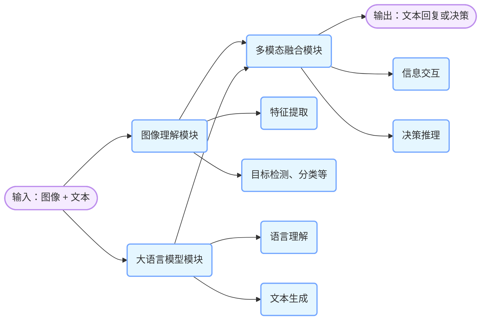

# 视觉-语言AI Agent：整合LLM与图像理解

> 关键词：视觉-语言AI Agent、大语言模型（LLM）、图像理解、多模态融合、人工智能

> 摘要：本文聚焦于视觉 - 语言AI Agent这一前沿领域，深入探讨了如何将大语言模型（LLM）与图像理解技术进行有效整合。首先介绍了相关背景知识，包括研究目的、预期读者、文档结构和术语表。接着详细阐述了核心概念及它们之间的联系，通过文本示意图和Mermaid流程图进行直观展示。然后对核心算法原理进行讲解，并给出Python源代码示例，同时介绍了相关数学模型和公式。通过项目实战部分，展示了代码的实际应用和详细解读。此外，还分析了视觉 - 语言AI Agent的实际应用场景，推荐了学习所需的工具和资源，最后总结了该领域的未来发展趋势与挑战，并提供了常见问题解答和扩展阅读参考资料。

## 1. 背景介绍 
### 1.1 目的和范围
近年来，人工智能技术取得了显著进展，其中大语言模型（LLM）在自然语言处理领域展现出强大的能力，能够处理各种文本任务，如文本生成、问答系统等。与此同时，图像理解技术也在不断发展，可对图像进行分类、目标检测、语义分割等操作。然而，在实际应用中，很多场景需要同时处理视觉信息和语言信息，例如智能客服需要理解用户上传的图片并结合文字描述进行回复，自动驾驶系统需要识别道路标志并理解交通规则等。因此，将LLM与图像理解技术整合，构建视觉 - 语言AI Agent具有重要的现实意义。

本文的目的在于深入探讨视觉 - 语言AI Agent的技术原理、实现方法和应用场景，为相关领域的研究人员和开发者提供全面的技术指导。范围涵盖了从核心概念的介绍到具体算法的实现，再到实际项目的案例分析，以及对未来发展趋势的展望。

### 1.2 预期读者
本文的预期读者主要包括以下几类人群：
- **人工智能研究人员**：对视觉 - 语言多模态融合领域感兴趣，希望深入了解LLM与图像理解整合的最新技术和研究成果。
- **软件开发工程师**：从事人工智能相关软件开发工作，想要学习如何实现视觉 - 语言AI Agent的具体技术和方法。
- **高校学生**：计算机科学、人工智能等相关专业的学生，希望通过本文了解该领域的前沿知识，为后续的学习和研究打下基础。
- **企业技术决策者**：关注人工智能技术在企业中的应用，希望了解视觉 - 语言AI Agent的实际应用场景和商业价值，为企业的技术战略决策提供参考。

### 1.3 文档结构概述
本文按照以下结构进行组织：
- **核心概念与联系**：介绍视觉 - 语言AI Agent、LLM和图像理解的核心概念，并阐述它们之间的联系，通过文本示意图和Mermaid流程图进行直观展示。
- **核心算法原理 & 具体操作步骤**：详细讲解将LLM与图像理解整合的核心算法原理，并给出Python源代码示例，说明具体的操作步骤。
- **数学模型和公式 & 详细讲解 & 举例说明**：介绍相关的数学模型和公式，对其进行详细讲解，并通过具体的例子进行说明。
- **项目实战：代码实际案例和详细解释说明**：通过一个实际的项目案例，展示如何搭建开发环境、实现源代码，并对代码进行详细解读和分析。
- **实际应用场景**：分析视觉 - 语言AI Agent在不同领域的实际应用场景。
- **工具和资源推荐**：推荐学习和开发视觉 - 语言AI Agent所需的工具和资源，包括学习资源、开发工具框架和相关论文著作。
- **总结：未来发展趋势与挑战**：总结视觉 - 语言AI Agent领域的未来发展趋势和面临的挑战。
- **附录：常见问题与解答**：解答读者在学习和实践过程中可能遇到的常见问题。
- **扩展阅读 & 参考资料**：提供相关的扩展阅读资料和参考文献，方便读者进一步深入学习。

### 1.4 术语表
#### 1.4.1 核心术语定义
- **视觉 - 语言AI Agent**：一种能够同时处理视觉信息（如图像）和语言信息（如文本）的人工智能代理，通过整合LLM和图像理解技术，实现更智能、更复杂的任务。
- **大语言模型（LLM）**：一种基于深度学习的自然语言处理模型，通常具有数十亿甚至数万亿的参数，能够生成高质量的文本，理解和处理自然语言任务。
- **图像理解**：指计算机对图像进行分析、解释和理解的过程，包括图像分类、目标检测、语义分割等任务。
- **多模态融合**：将不同模态的信息（如视觉、语言、音频等）进行整合和处理，以实现更全面、更准确的信息理解和决策。

#### 1.4.2 相关概念解释
- **Transformer架构**：一种基于注意力机制的深度学习架构，广泛应用于自然语言处理和计算机视觉领域，LLM通常采用Transformer架构。
- **特征提取**：从原始数据（如图像、文本）中提取有代表性的特征，以便后续的处理和分析。
- **注意力机制**：一种能够自动关注输入数据中重要部分的机制，在多模态融合中用于处理不同模态信息之间的关系。

#### 1.4.3 缩略词列表
- **LLM**：Large Language Model（大语言模型）
- **CNN**：Convolutional Neural Network（卷积神经网络）
- **RNN**：Recurrent Neural Network（循环神经网络）
- **ViT**：Vision Transformer（视觉Transformer）

## 2. 核心概念与联系 
### 核心概念原理
#### 视觉 - 语言AI Agent
视觉 - 语言AI Agent的核心目标是实现视觉信息和语言信息的融合处理，以完成更复杂的任务。它可以接收图像和文本输入，对图像进行理解和分析，结合文本信息进行推理和决策，并生成相应的输出。例如，在一个图像问答系统中，用户输入一张图片和一个问题，视觉 - 语言AI Agent需要理解图片内容，分析问题，并给出准确的答案。

#### 大语言模型（LLM）
LLM是基于深度学习的自然语言处理模型，通常采用Transformer架构。它通过在大规模文本数据上进行预训练，学习到丰富的语言知识和语义信息。LLM可以进行文本生成、问答、翻译等任务，具有很强的语言理解和生成能力。例如，OpenAI的GPT系列模型就是典型的LLM，能够生成高质量的文本，回答各种问题。

#### 图像理解
图像理解是计算机视觉领域的重要任务，旨在让计算机理解图像中的内容。常见的图像理解任务包括图像分类、目标检测、语义分割等。图像理解通常使用卷积神经网络（CNN）或视觉Transformer（ViT）等模型进行特征提取和分析。例如，在图像分类任务中，模型需要判断图像属于哪个类别；在目标检测任务中，模型需要找出图像中目标物体的位置和类别。

### 架构的文本示意图
```plaintext
+----------------------+
|   视觉 - 语言AI Agent   |
+----------------------+
|  输入：图像 + 文本      |
|                      |
|  处理流程：            |
|  1. 图像理解模块       |
|     - 特征提取         |
|     - 目标检测、分类等 |
|  2. 大语言模型模块     |
|     - 语言理解         |
|     - 文本生成         |
|  3. 多模态融合模块     |
|     - 信息交互         |
|     - 决策推理         |
|                      |
|  输出：文本回复或决策  |
+----------------------+
```

### Mermaid流程图


## 3. 核心算法原理 & 具体操作步骤 
### 核心算法原理
将LLM与图像理解整合的核心算法主要涉及以下几个步骤：
1. **图像特征提取**：使用CNN或ViT等模型对输入的图像进行特征提取，将图像转换为特征向量。
2. **文本特征提取**：使用LLM对输入的文本进行编码，得到文本的特征表示。
3. **多模态融合**：将图像特征和文本特征进行融合，通过注意力机制等方法实现信息交互和互补。
4. **决策推理**：基于融合后的特征进行决策推理，生成相应的输出。

### Python源代码示例
以下是一个简单的示例代码，演示了如何使用预训练的图像模型和语言模型进行多模态融合：

```python
import torch
import torchvision.models as models
from transformers import AutoTokenizer, AutoModel

# 加载预训练的图像模型（ResNet）
image_model = models.resnet18(pretrained=True)
image_model.eval()

# 加载预训练的语言模型（BERT）
tokenizer = AutoTokenizer.from_pretrained('bert-base-uncased')
language_model = AutoModel.from_pretrained('bert-base-uncased')
language_model.eval()

# 输入图像和文本
image = torch.randn(1, 3, 224, 224)  # 模拟输入图像
text = "This is a sample text."
inputs = tokenizer(text, return_tensors='pt')

# 图像特征提取
with torch.no_grad():
    image_features = image_model(image)

# 文本特征提取
with torch.no_grad():
    outputs = language_model(**inputs)
    text_features = outputs.last_hidden_state.mean(dim=1)

# 多模态融合（简单拼接）
fusion_features = torch.cat((image_features, text_features), dim=1)

print("Fusion features shape:", fusion_features.shape)
```

### 具体操作步骤
1. **安装依赖库**：使用`pip`安装所需的库，如`torch`、`torchvision`、`transformers`等。
2. **加载预训练模型**：使用`torchvision`和`transformers`库加载预训练的图像模型和语言模型。
3. **准备输入数据**：将输入的图像和文本进行预处理，转换为模型可以接受的格式。
4. **特征提取**：分别对图像和文本进行特征提取，得到图像特征和文本特征。
5. **多模态融合**：将图像特征和文本特征进行融合，这里使用了简单的拼接方法，实际应用中可以使用更复杂的融合方法。
6. **决策推理**：基于融合后的特征进行决策推理，例如可以使用分类器进行分类任务。

## 4. 数学模型和公式 & 详细讲解 & 举例说明 
### 图像特征提取
在图像特征提取中，常用的模型是卷积神经网络（CNN）。CNN通过卷积层、池化层和全连接层对图像进行特征提取。假设输入图像为 $X \in \mathbb{R}^{H \times W \times C}$，其中 $H$、$W$ 和 $C$ 分别表示图像的高度、宽度和通道数。卷积层的操作可以表示为：

$$Y_{i,j,k} = \sum_{m=0}^{M-1} \sum_{n=0}^{N-1} \sum_{c=0}^{C-1} X_{i+m,j+n,c} \cdot W_{m,n,c,k} + b_k$$

其中，$Y_{i,j,k}$ 是卷积层输出特征图的第 $(i,j)$ 位置的第 $k$ 个通道的值，$W_{m,n,c,k}$ 是卷积核的权重，$b_k$ 是偏置，$M$ 和 $N$ 是卷积核的大小。

### 文本特征提取
对于文本特征提取，通常使用基于Transformer架构的语言模型。Transformer模型通过多头注意力机制和前馈神经网络对输入的文本进行编码。多头注意力机制的计算公式如下：

$$\text{Attention}(Q, K, V) = \text{softmax}\left(\frac{QK^T}{\sqrt{d_k}}\right)V$$

其中，$Q$、$K$ 和 $V$ 分别是查询、键和值矩阵，$d_k$ 是查询和键的维度。多头注意力机制将多个注意力头的输出拼接起来，然后通过线性变换得到最终的输出。

### 多模态融合
多模态融合的方法有很多种，这里介绍一种基于注意力机制的融合方法。假设图像特征为 $F_I \in \mathbb{R}^{d_I}$，文本特征为 $F_T \in \mathbb{R}^{d_T}$，则融合后的特征 $F_F$ 可以表示为：

$$\alpha = \text{softmax}(W_1 [F_I; F_T] + b_1)$$
$$F_F = \alpha \odot [F_I; F_T]$$

其中，$W_1$ 和 $b_1$ 是可学习的参数，$\odot$ 表示逐元素相乘。

### 举例说明
假设我们有一张图像和一段文本，图像表示一只猫，文本描述为“这是一只可爱的猫”。首先，使用CNN对图像进行特征提取，得到图像特征 $F_I$。然后，使用BERT对文本进行编码，得到文本特征 $F_T$。接着，使用上述的多模态融合方法将 $F_I$ 和 $F_T$ 进行融合，得到融合后的特征 $F_F$。最后，将 $F_F$ 输入到分类器中，判断图像和文本是否匹配。

## 5. 项目实战：代码实际案例和详细解释说明 
### 5.1  开发环境搭建
#### 操作系统
推荐使用Ubuntu 20.04或Windows 10操作系统。

#### 安装Python
确保安装了Python 3.7及以上版本。可以从Python官方网站（https://www.python.org/downloads/）下载并安装。

#### 安装依赖库
使用`pip`安装所需的库：
```bash
pip install torch torchvision transformers matplotlib
```

### 5.2  源代码详细实现和代码解读
以下是一个完整的项目实战代码示例，实现了一个简单的图像问答系统：

```python
import torch
import torchvision.models as models
from transformers import AutoTokenizer, AutoModelForQuestionAnswering
import matplotlib.pyplot as plt
from PIL import Image
import requests
from io import BytesIO

# 加载预训练的图像模型（ResNet）
image_model = models.resnet18(pretrained=True)
image_model.eval()

# 加载预训练的语言模型（BERT用于问答）
tokenizer = AutoTokenizer.from_pretrained('bert-large-uncased-whole-word-masking-finetuned-squad')
language_model = AutoModelForQuestionAnswering.from_pretrained('bert-large-uncased-whole-word-masking-finetuned-squad')
language_model.eval()

# 加载图像
url = 'https://upload.wikimedia.org/wikipedia/commons/thumb/3/3a/Cat03.jpg/1200px-Cat03.jpg'
response = requests.get(url)
image = Image.open(BytesIO(response.content))
plt.imshow(image)
plt.show()

# 图像预处理
from torchvision import transforms
preprocess = transforms.Compose([
    transforms.Resize(256),
    transforms.CenterCrop(224),
    transforms.ToTensor(),
    transforms.Normalize(mean=[0.485, 0.456, 0.406], std=[0.229, 0.224, 0.225])
])
input_image = preprocess(image).unsqueeze(0)

# 图像特征提取
with torch.no_grad():
    image_features = image_model(input_image)

# 提问
question = "What is in the image?"
text = "There is an animal in the image."
inputs = tokenizer(question, text, return_tensors='pt')

# 文本特征提取和问答推理
with torch.no_grad():
    outputs = language_model(**inputs)
    answer_start_scores = outputs.start_logits
    answer_end_scores = outputs.end_logits
    answer_start = torch.argmax(answer_start_scores)
    answer_end = torch.argmax(answer_end_scores) + 1
    answer = tokenizer.convert_tokens_to_string(tokenizer.convert_ids_to_tokens(inputs['input_ids'][0][answer_start:answer_end]))

print("Answer:", answer)
```

### 5.3  代码解读与分析
1. **加载预训练模型**：使用`torchvision`加载预训练的ResNet图像模型，使用`transformers`加载预训练的BERT问答模型。
2. **加载图像**：从网络上下载一张图像，并使用`matplotlib`显示图像。
3. **图像预处理**：对图像进行缩放、裁剪、归一化等预处理操作，使其符合模型的输入要求。
4. **图像特征提取**：使用ResNet模型对图像进行特征提取。
5. **提问和文本输入**：定义一个问题和一段相关的文本。
6. **文本特征提取和问答推理**：使用BERT问答模型对问题和文本进行处理，得到答案的起始和结束位置，然后将其转换为文本输出。

## 6. 实际应用场景 
### 智能客服
在智能客服系统中，用户可能会上传图片并提出问题。视觉 - 语言AI Agent可以理解图片内容，结合用户的文本问题，提供更准确的回复。例如，用户上传一张手机故障的图片并描述问题，智能客服可以根据图片和文本信息，判断故障原因并提供解决方案。

### 自动驾驶
自动驾驶系统需要同时处理视觉信息（如道路标志、车辆、行人等）和语言信息（如交通规则、导航指令等）。视觉 - 语言AI Agent可以将图像理解和语言理解相结合，提高自动驾驶系统的决策能力和安全性。例如，识别道路标志并理解其含义，根据导航指令规划最佳路线。

### 教育领域
在教育领域，视觉 - 语言AI Agent可以用于智能辅导系统。学生可以上传学习资料（如图表、图片等）并提出问题，系统可以理解图片内容和问题，提供详细的解答和指导。例如，在数学教学中，学生上传一道几何题的图片，系统可以识别图形并解答问题。

### 电商领域
在电商平台上，视觉 - 语言AI Agent可以帮助用户更好地搜索和选择商品。用户可以上传商品图片并描述需求，系统可以根据图片和文本信息，推荐相关的商品。例如，用户上传一张衣服的图片并描述款式和颜色，系统可以推荐类似的衣服。

## 7. 工具和资源推荐
### 7.1 学习资源推荐
#### 7.1.1 书籍推荐
- 《深度学习》（Deep Learning）：由Ian Goodfellow、Yoshua Bengio和Aaron Courville所著，是深度学习领域的经典教材，涵盖了神经网络、卷积神经网络、循环神经网络等内容。
- 《Python深度学习》（Deep Learning with Python）：由Francois Chollet所著，介绍了如何使用Python和Keras进行深度学习开发，包括图像分类、文本生成等任务。
- 《计算机视觉：算法与应用》（Computer Vision: Algorithms and Applications）：由Richard Szeliski所著，详细介绍了计算机视觉的基本算法和应用，如图像处理、特征提取、目标检测等。

#### 7.1.2 在线课程
- Coursera上的“深度学习专项课程”（Deep Learning Specialization）：由Andrew Ng教授授课，包括神经网络、卷积神经网络、循环神经网络等多个主题。
- edX上的“计算机视觉基础”（Foundations of Computer Vision）：介绍了计算机视觉的基本概念和算法，如图像滤波、特征提取、图像匹配等。
- 哔哩哔哩（B站）上有很多关于人工智能和深度学习的教学视频，可以搜索相关关键词进行学习。

#### 7.1.3 技术博客和网站
- Medium：是一个技术博客平台，有很多关于人工智能、计算机视觉和自然语言处理的优秀文章。
- arXiv：是一个预印本平台，提供了大量的学术论文，包括人工智能领域的最新研究成果。
- OpenAI官方博客：发布了关于大语言模型的最新研究和应用案例。

### 7.2 开发工具框架推荐
#### 7.2.1 IDE和编辑器
- PyCharm：是一款专门为Python开发设计的集成开发环境（IDE），提供了代码编辑、调试、版本控制等功能。
- Jupyter Notebook：是一个交互式的开发环境，适合进行数据分析、模型训练和实验。
- Visual Studio Code：是一款轻量级的代码编辑器，支持多种编程语言和插件，可用于Python开发。

#### 7.2.2 调试和性能分析工具
- TensorBoard：是TensorFlow的可视化工具，可以用于监控模型训练过程、可视化模型结构和性能指标。
- PyTorch Profiler：是PyTorch的性能分析工具，可以帮助开发者找出代码中的性能瓶颈。
- NVIDIA Nsight Systems：是NVIDIA提供的性能分析工具，可用于分析GPU加速的深度学习模型的性能。

#### 7.2.3 相关框架和库
- PyTorch：是一个开源的深度学习框架，提供了丰富的神经网络层和优化算法，支持GPU加速。
- TensorFlow：是另一个流行的深度学习框架，具有广泛的应用和丰富的工具生态系统。
- Hugging Face Transformers：是一个用于自然语言处理的开源库，提供了大量的预训练语言模型和工具。
- TorchVision：是PyTorch的计算机视觉库，提供了预训练的图像模型和图像预处理工具。

### 7.3 相关论文著作推荐
#### 7.3.1 经典论文
- “Attention Is All You Need”：提出了Transformer架构，是自然语言处理领域的重要突破。
- “ImageNet Classification with Deep Convolutional Neural Networks”：介绍了AlexNet模型，开启了深度学习在计算机视觉领域的应用热潮。
- “BERT: Pre-training of Deep Bidirectional Transformers for Language Understanding”：提出了BERT模型，在自然语言处理任务中取得了显著的效果。

#### 7.3.2 最新研究成果
- 关注arXiv上关于视觉 - 语言多模态融合的最新论文，了解该领域的最新研究进展。
- 参加相关的学术会议，如CVPR、ICCV、ACL等，获取最新的研究成果和趋势。

#### 7.3.3 应用案例分析
- 研究一些实际应用中的视觉 - 语言AI Agent案例，了解其实现方法和应用场景。例如，OpenAI的DALL - E 2可以根据文本描述生成图像，是视觉 - 语言AI Agent的一个典型应用案例。

## 8. 总结：未来发展趋势与挑战
### 未来发展趋势
- **更强大的多模态融合能力**：未来的视觉 - 语言AI Agent将能够更有效地融合视觉和语言信息，实现更复杂的任务，如视觉推理、多模态对话等。
- **更广泛的应用场景**：随着技术的不断发展，视觉 - 语言AI Agent将在更多领域得到应用，如医疗、金融、娱乐等。
- **与其他技术的融合**：视觉 - 语言AI Agent可能会与其他技术，如物联网、机器人技术等进行融合，创造出更智能的系统和应用。

### 挑战
- **数据标注困难**：多模态数据的标注成本高、难度大，需要大量的人力和时间。如何高效地标注多模态数据是一个亟待解决的问题。
- **计算资源需求大**：训练和运行视觉 - 语言AI Agent需要大量的计算资源，如GPU等。如何降低计算成本，提高模型的效率是一个挑战。
- **语义理解的局限性**：虽然LLM和图像理解技术取得了很大进展，但在语义理解方面仍然存在局限性，如对隐喻、幽默等复杂语义的理解能力不足。

## 9. 附录：常见问题与解答
### 问题1：如何选择合适的图像模型和语言模型？
答：选择图像模型和语言模型需要考虑任务的具体需求和数据集的特点。对于图像模型，如果数据集较小，可以选择轻量级的模型，如ResNet18；如果数据集较大，可以选择更复杂的模型，如ResNet50或ViT。对于语言模型，如果任务是文本生成，可以选择GPT系列模型；如果任务是问答系统，可以选择BERT等预训练模型。

### 问题2：多模态融合的方法有哪些？
答：常见的多模态融合方法包括特征拼接、注意力机制、双线性池化等。特征拼接是最简单的方法，将图像特征和文本特征直接拼接在一起；注意力机制可以自动关注不同模态信息的重要部分；双线性池化可以捕捉不同模态信息之间的交互关系。

### 问题3：如何评估视觉 - 语言AI Agent的性能？
答：可以使用一些指标来评估视觉 - 语言AI Agent的性能，如准确率、召回率、F1值等。对于图像问答任务，可以使用准确率来评估模型回答问题的正确性；对于图像描述任务，可以使用BLEU、ROUGE等指标来评估生成描述的质量。

## 10. 扩展阅读 & 参考资料
### 扩展阅读
- 《多模态机器学习：基础与应用》（Multimodal Machine Learning: A Survey and Taxonomy）：详细介绍了多模态机器学习的基本概念、方法和应用。
- 《计算机视觉中的深度学习》（Deep Learning in Computer Vision）：深入探讨了深度学习在计算机视觉领域的应用，包括图像分类、目标检测、语义分割等。
- 《自然语言处理入门》（Natural Language Processing with Python）：介绍了自然语言处理的基本概念和方法，如文本预处理、词性标注、命名实体识别等。

### 参考资料
- Goodfellow, I., Bengio, Y., & Courville, A. (2016). Deep Learning. MIT Press.
- Chollet, F. (2017). Deep Learning with Python. Manning Publications.
- Szeliski, R. (2010). Computer Vision: Algorithms and Applications. Springer.

作者：AI天才研究院/AI Genius Institute & 禅与计算机程序设计艺术 /Zen And The Art of Computer Programming