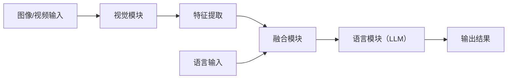

# 视觉-语言协同AI Agent：LLM与计算机视觉的深度融合

> 关键词：视觉-语言协同、AI Agent、大语言模型（LLM）、计算机视觉、深度融合

> 摘要：本文深入探讨了视觉-语言协同AI Agent中LLM与计算机视觉的深度融合。首先介绍了该领域的背景，包括目的、预期读者等信息。接着阐述了核心概念与联系，通过文本示意图和Mermaid流程图清晰展示其架构原理。详细讲解了核心算法原理，并用Python代码进行具体操作步骤的说明。引入数学模型和公式，结合实例加深理解。通过项目实战给出代码案例并进行详细解读。分析了实际应用场景，推荐了相关工具和资源，最后总结了未来发展趋势与挑战，并对常见问题进行解答，提供了扩展阅读和参考资料，旨在为相关领域的研究者和开发者提供全面的技术指导。

## 1. 背景介绍 
### 1.1 目的和范围
随着人工智能技术的不断发展，单一模态的智能系统已经难以满足复杂现实场景的需求。视觉-语言协同AI Agent将大语言模型（LLM）强大的语言理解和生成能力与计算机视觉对图像、视频等视觉信息的感知和分析能力相结合，旨在构建更加智能、灵活、通用的智能系统。本文的范围涵盖了视觉-语言协同AI Agent的核心概念、算法原理、数学模型、项目实战、应用场景以及相关工具资源等方面，全面深入地探讨LLM与计算机视觉的深度融合。

### 1.2 预期读者
本文预期读者包括人工智能领域的研究者、计算机视觉和自然语言处理方向的研究生、从事相关技术开发的工程师以及对新兴人工智能技术感兴趣的爱好者。希望通过本文的介绍，能为读者提供有价值的技术参考和启发。

### 1.3 文档结构概述
本文将按照以下结构进行阐述：首先介绍相关背景知识，包括目的、读者群体和文档结构；接着详细讲解核心概念与联系，展示其架构原理；然后阐述核心算法原理和具体操作步骤，并用Python代码实现；引入数学模型和公式并举例说明；通过项目实战给出代码案例并进行解读；分析实际应用场景；推荐相关工具和资源；最后总结未来发展趋势与挑战，解答常见问题并提供扩展阅读和参考资料。

### 1.4 术语表
#### 1.4.1 核心术语定义
- **视觉-语言协同AI Agent**：一种集成了计算机视觉和自然语言处理能力的智能体，能够同时处理视觉信息和语言信息，完成复杂的任务。
- **大语言模型（LLM）**：基于大规模语料库训练的语言模型，具有强大的语言理解和生成能力，如GPT系列、BLOOM等。
- **计算机视觉**：研究如何使计算机“看”的科学，包括图像识别、目标检测、图像生成等技术。

#### 1.4.2 相关概念解释
- **多模态融合**：将不同模态（如视觉、语言、音频等）的信息进行整合，以获得更全面、准确的理解和决策能力。
- **AI Agent**：一种能够感知环境、做出决策并采取行动的智能实体，在视觉-语言协同场景中，它可以根据视觉和语言信息进行任务规划和执行。

#### 1.4.3 缩略词列表
- **LLM**：Large Language Model（大语言模型）
- **CV**：Computer Vision（计算机视觉）
- **NLP**：Natural Language Processing（自然语言处理）

## 2. 核心概念与联系 
视觉-语言协同AI Agent的核心在于将LLM的语言处理能力与计算机视觉的视觉感知能力深度融合，实现更智能的交互和决策。其架构主要包括视觉模块、语言模块和融合模块。

### 文本示意图
```plaintext
+---------------------+
|      视觉模块       |
| （图像/视频输入）    |
+---------------------+
           |
           v
+---------------------+
|      特征提取       |
| （视觉特征向量）    |
+---------------------+
           |
           v
+---------------------+
|      融合模块       |
| （视觉与语言融合）  |
+---------------------+
           |
           v
+---------------------+
|      语言模块       |
| （大语言模型）      |
+---------------------+
           |
           v
+---------------------+
|      输出结果       |
| （决策、回答等）    |
+---------------------+
```

### Mermaid流程图


在这个架构中，视觉模块负责对输入的图像或视频进行处理，提取视觉特征。语言模块则利用LLM对输入的语言信息进行理解和生成。融合模块将视觉特征和语言信息进行融合，使得LLM能够结合视觉信息进行更准确的决策和回答。

## 3. 核心算法原理 & 具体操作步骤 

### 核心算法原理
视觉-语言协同AI Agent的核心算法主要涉及视觉特征提取、语言处理和信息融合。以下是具体的算法步骤：

1. **视觉特征提取**：使用预训练的卷积神经网络（CNN）如ResNet、VGG等对输入的图像进行特征提取。CNN可以将图像转换为低维的特征向量，保留图像的关键信息。
2. **语言处理**：使用LLM对输入的语言信息进行编码和解码。LLM可以学习语言的语义和语法结构，生成合理的回答。
3. **信息融合**：将视觉特征向量和语言编码向量进行融合，可以采用拼接、加权求和等方式。融合后的向量作为LLM的输入，进行最终的决策和回答。

### Python源代码实现

```python
import torch
import torchvision.models as models
from transformers import AutoTokenizer, AutoModel

# 加载预训练的视觉模型
vision_model = models.resnet50(pretrained=True)
vision_model.eval()

# 加载预训练的语言模型
tokenizer = AutoTokenizer.from_pretrained("bert-base-uncased")
language_model = AutoModel.from_pretrained("bert-base-uncased")
language_model.eval()

def extract_visual_features(image):
    """
    提取图像的视觉特征
    :param image: 输入的图像，形状为 (3, 224, 224)
    :return: 视觉特征向量
    """
    with torch.no_grad():
        image = image.unsqueeze(0)  # 添加批量维度
        features = vision_model(image)
        features = features.view(features.size(0), -1)  # 展平特征
    return features

def encode_language(text):
    """
    对输入的文本进行编码
    :param text: 输入的文本
    :return: 语言编码向量
    """
    inputs = tokenizer(text, return_tensors="pt")
    with torch.no_grad():
        outputs = language_model(**inputs)
        language_features = outputs.last_hidden_state.mean(dim=1)
    return language_features

def fuse_features(visual_features, language_features):
    """
    融合视觉特征和语言特征
    :param visual_features: 视觉特征向量
    :param language_features: 语言编码向量
    :return: 融合后的特征向量
    """
    fused_features = torch.cat((visual_features, language_features), dim=1)
    return fused_features

# 示例使用
image = torch.randn(3, 224, 224)  # 随机生成一张图像
text = "这张图像里有什么？"

visual_features = extract_visual_features(image)
language_features = encode_language(text)
fused_features = fuse_features(visual_features, language_features)

print("融合后的特征向量形状:", fused_features.shape)
```

### 代码解释
1. **视觉特征提取**：`extract_visual_features` 函数使用预训练的ResNet50模型对输入的图像进行特征提取，将图像转换为特征向量。
2. **语言编码**：`encode_language` 函数使用预训练的BERT模型对输入的文本进行编码，得到语言编码向量。
3. **特征融合**：`fuse_features` 函数将视觉特征向量和语言编码向量进行拼接，得到融合后的特征向量。

## 4. 数学模型和公式 & 详细讲解 & 举例说明 

### 视觉特征提取
假设输入的图像为 $I \in \mathbb{R}^{C \times H \times W}$，其中 $C$ 是通道数，$H$ 和 $W$ 分别是图像的高度和宽度。使用卷积神经网络 $f_{vision}$ 对图像进行特征提取，得到视觉特征向量 $V \in \mathbb{R}^{d_{v}}$，其中 $d_{v}$ 是视觉特征的维度。

$$V = f_{vision}(I)$$

例如，在ResNet50中，最后一层全连接层的输出就是视觉特征向量。

### 语言编码
假设输入的文本为 $T$，使用语言模型 $f_{language}$ 对文本进行编码，得到语言编码向量 $L \in \mathbb{R}^{d_{l}}$，其中 $d_{l}$ 是语言特征的维度。

$$L = f_{language}(T)$$

例如，在BERT模型中，最后一层隐藏状态的均值就是语言编码向量。

### 信息融合
将视觉特征向量 $V$ 和语言编码向量 $L$ 进行拼接，得到融合后的特征向量 $F \in \mathbb{R}^{d_{v}+d_{l}}$。

$$F = [V; L]$$

例如，假设 $V$ 的维度为 2048，$L$ 的维度为 768，则融合后的特征向量 $F$ 的维度为 2048 + 768 = 2816。

## 5. 项目实战：代码实际案例和详细解释说明 

### 5.1  开发环境搭建
为了实现视觉-语言协同AI Agent的项目实战，我们需要搭建以下开发环境：

1. **操作系统**：推荐使用Ubuntu 18.04或更高版本。
2. **Python环境**：使用Python 3.7或更高版本。
3. **深度学习框架**：安装PyTorch和torchvision库，用于视觉模型的训练和推理。
4. **自然语言处理库**：安装transformers库，用于语言模型的使用。

以下是安装命令：

```bash
# 创建虚拟环境
python -m venv vision_lang_env
source vision_lang_env/bin/activate

# 安装PyTorch和torchvision
pip install torch torchvision

# 安装transformers库
pip install transformers
```

### 5.2  源代码详细实现和代码解读
我们将实现一个简单的视觉-语言问答系统，根据输入的图像和问题，输出相应的回答。

```python
import torch
import torchvision.models as models
from transformers import AutoTokenizer, AutoModelForCausalLM
import requests
from PIL import Image
from torchvision import transforms

# 加载预训练的视觉模型
vision_model = models.resnet50(pretrained=True)
vision_model.eval()

# 加载预训练的语言模型
tokenizer = AutoTokenizer.from_pretrained("gpt2")
language_model = AutoModelForCausalLM.from_pretrained("gpt2")
language_model.eval()

# 图像预处理
transform = transforms.Compose([
    transforms.Resize((224, 224)),
    transforms.ToTensor(),
    transforms.Normalize(mean=[0.485, 0.456, 0.406], std=[0.229, 0.224, 0.225])
])

def extract_visual_features(image):
    """
    提取图像的视觉特征
    :param image: 输入的图像，PIL.Image类型
    :return: 视觉特征向量
    """
    image = transform(image).unsqueeze(0)
    with torch.no_grad():
        features = vision_model(image)
        features = features.view(features.size(0), -1)
    return features

def generate_answer(visual_features, question):
    """
    根据视觉特征和问题生成回答
    :param visual_features: 视觉特征向量
    :param question: 输入的问题
    :return: 生成的回答
    """
    input_text = f"图像特征: {visual_features.tolist()}, 问题: {question}"
    input_ids = tokenizer.encode(input_text, return_tensors="pt")
    with torch.no_grad():
        output = language_model.generate(input_ids, max_length=100, num_beams=5, no_repeat_ngram_size=2)
    answer = tokenizer.decode(output[0], skip_special_tokens=True)
    return answer

# 示例使用
image_url = "https://upload.wikimedia.org/wikipedia/commons/thumb/3/3a/Cat03.jpg/1200px-Cat03.jpg"
image = Image.open(requests.get(image_url, stream=True).raw)
question = "图像里是什么动物？"

visual_features = extract_visual_features(image)
answer = generate_answer(visual_features, question)

print("问题:", question)
print("回答:", answer)
```

### 5.3  代码解读与分析
1. **视觉特征提取**：`extract_visual_features` 函数对输入的图像进行预处理，然后使用ResNet50模型提取视觉特征。
2. **回答生成**：`generate_answer` 函数将视觉特征和问题组合成输入文本，使用GPT-2模型生成回答。
3. **示例使用**：从网络上下载一张猫的图像，提出问题“图像里是什么动物？”，调用上述函数生成回答。

需要注意的是，这个示例只是一个简单的演示，实际应用中可能需要更复杂的模型和方法来提高回答的准确性和质量。

## 6. 实际应用场景 
视觉-语言协同AI Agent在许多领域都有广泛的应用，以下是一些常见的应用场景：

### 智能客服
在电商、金融等领域，智能客服可以结合用户上传的图片和提出的问题，提供更准确的解决方案。例如，用户上传商品图片并询问商品的尺寸、颜色等信息，智能客服可以根据图片和问题进行回答。

### 图像搜索与推荐
通过结合图像内容和用户的语言描述，实现更精准的图像搜索和推荐。例如，用户输入“红色花朵的图片”，系统可以根据视觉-语言协同技术找到符合要求的图片。

### 自动驾驶
在自动驾驶中，视觉-语言协同AI Agent可以结合摄像头捕捉的图像和语音指令，实现更智能的决策和导航。例如，驾驶员说“前方路口右转”，系统可以根据图像信息判断是否可以右转，并执行相应的操作。

### 医疗诊断
在医疗领域，医生可以结合医学影像（如X光、CT等）和患者的症状描述，使用视觉-语言协同AI Agent进行辅助诊断，提高诊断的准确性和效率。

## 7. 工具和资源推荐
### 7.1 学习资源推荐
#### 7.1.1 书籍推荐
- 《深度学习》（Deep Learning）：由Ian Goodfellow、Yoshua Bengio和Aaron Courville撰写，是深度学习领域的经典教材，涵盖了神经网络、卷积神经网络、循环神经网络等内容。
- 《计算机视觉：算法与应用》（Computer Vision: Algorithms and Applications）：由Richard Szeliski撰写，全面介绍了计算机视觉的基本算法和应用，包括图像特征提取、目标检测、图像分割等。
- 《自然语言处理入门》（Natural Language Processing with Python）：由Steven Bird、Ewan Klein和Edward Loper撰写，使用Python介绍了自然语言处理的基本概念和方法，包括文本分类、信息提取、机器翻译等。

#### 7.1.2 在线课程
- Coursera上的“深度学习专项课程”（Deep Learning Specialization）：由Andrew Ng教授授课，包括神经网络和深度学习、改善深层神经网络、结构化机器学习项目等课程。
- edX上的“计算机视觉基础”（Foundations of Computer Vision）：由华盛顿大学的教授授课，介绍了计算机视觉的基本原理和算法。
- 哔哩哔哩上的“自然语言处理入门教程”：由李宏毅教授授课，使用通俗易懂的方式介绍了自然语言处理的基本概念和方法。

#### 7.1.3 技术博客和网站
- arXiv：提供了大量的学术论文，涵盖了人工智能、计算机视觉、自然语言处理等领域的最新研究成果。
- Medium：有许多技术博客，分享了人工智能、计算机视觉、自然语言处理等领域的实践经验和技术文章。
- AI研习社：专注于人工智能领域的技术分享和交流，提供了许多优质的教程和案例。

### 7.2 开发工具框架推荐
#### 7.2.1 IDE和编辑器
- PyCharm：是一款专门为Python开发设计的集成开发环境，提供了代码编辑、调试、版本控制等功能。
- Jupyter Notebook：是一个交互式的开发环境，适合进行数据探索、模型训练和可视化等工作。
- Visual Studio Code：是一款轻量级的代码编辑器，支持多种编程语言，具有丰富的插件生态系统。

#### 7.2.2 调试和性能分析工具
- PyTorch Profiler：是PyTorch自带的性能分析工具，可以帮助开发者分析模型的运行时间、内存使用等情况。
- TensorBoard：是TensorFlow提供的可视化工具，也可以用于PyTorch模型的可视化和性能分析。
- cProfile：是Python自带的性能分析工具，可以帮助开发者分析代码的运行时间和函数调用情况。

#### 7.2.3 相关框架和库
- PyTorch：是一个开源的深度学习框架，提供了丰富的神经网络层和优化算法，支持GPU加速。
- TensorFlow：是另一个流行的深度学习框架，具有强大的分布式训练和部署能力。
- transformers：是Hugging Face开发的自然语言处理库，提供了大量的预训练语言模型，如GPT-2、BERT等。
- torchvision：是PyTorch的计算机视觉库，提供了预训练的视觉模型、图像数据集和图像变换函数。

### 7.3 相关论文著作推荐
#### 7.3.1 经典论文
- “Attention Is All You Need”：提出了Transformer架构，是自然语言处理领域的重要突破。
- “ImageNet Classification with Deep Convolutional Neural Networks”：介绍了AlexNet模型，开启了深度学习在计算机视觉领域的应用热潮。
- “BERT: Pre-training of Deep Bidirectional Transformers for Language Understanding”：提出了BERT模型，在自然语言处理的多个任务上取得了优异的成绩。

#### 7.3.2 最新研究成果
- “CLIP: Connecting Text and Images”：提出了CLIP模型，实现了图像和文本的零样本学习。
- “ViT: An Image is Worth 16x16 Words: Transformers for Image Recognition at Scale”：将Transformer架构应用于图像识别任务，取得了良好的效果。
- “Flan-T5: Scaling Instruction-Finetuned Language Models”：提出了Flan-T5模型，通过指令微调提高了语言模型的泛化能力。

#### 7.3.3 应用案例分析
- “Visual Question Answering: A Survey”：对视觉问答领域的研究进行了全面的综述，介绍了该领域的发展历程、主要方法和应用场景。
- “Image Captioning: A Comprehensive Survey”：对图像描述生成领域的研究进行了综述，分析了该领域的挑战和未来发展方向。
- “Autonomous Driving: A Survey of the State-of-the-Art”：对自动驾驶领域的研究进行了综述，介绍了自动驾驶的关键技术和应用现状。

## 8. 总结：未来发展趋势与挑战
### 未来发展趋势
1. **更强大的模型融合**：未来的视觉-语言协同AI Agent将融合更强大的视觉模型和语言模型，提高模型的性能和泛化能力。
2. **多模态信息融合**：除了视觉和语言信息，还将融合音频、触觉等多模态信息，实现更加全面和智能的交互。
3. **个性化和自适应**：根据用户的偏好和历史交互数据，为用户提供个性化的服务和回答，实现自适应的智能交互。
4. **应用场景拓展**：视觉-语言协同AI Agent将在更多的领域得到应用，如智能家居、智能教育、智能医疗等。

### 挑战
1. **数据获取和标注**：获取大规模、高质量的视觉-语言联合数据集是一个挑战，同时数据标注的成本也很高。
2. **模型计算资源需求**：强大的视觉模型和语言模型需要大量的计算资源，如何在有限的资源下实现高效的推理是一个问题。
3. **语义理解和推理**：虽然LLM和计算机视觉模型在各自领域取得了很大的进展，但在语义理解和推理方面仍然存在不足，需要进一步研究和改进。
4. **伦理和安全问题**：视觉-语言协同AI Agent的应用可能会带来一些伦理和安全问题，如隐私泄露、虚假信息传播等，需要制定相应的规范和措施。

## 9. 附录：常见问题与解答
### 问题1：如何选择合适的视觉模型和语言模型？
解答：选择合适的视觉模型和语言模型需要考虑任务的需求、数据集的规模和计算资源等因素。如果任务对图像细节要求较高，可以选择ResNet、VGG等模型；如果对计算资源有限，可以选择MobileNet、ShuffleNet等轻量级模型。对于语言模型，如果任务对语言生成能力要求较高，可以选择GPT系列模型；如果对语言理解能力要求较高，可以选择BERT系列模型。

### 问题2：如何处理视觉特征和语言特征的维度不匹配问题？
解答：可以使用全连接层或线性变换将视觉特征和语言特征的维度调整为一致，然后再进行融合。例如，可以使用一个线性层将视觉特征的维度从 $d_{v}$ 调整为 $d_{l}$，然后与语言特征进行拼接。

### 问题3：如何提高视觉-语言协同AI Agent的性能？
解答：可以从以下几个方面提高性能：1. 使用更大规模的数据集进行训练；2. 采用更复杂的模型架构，如Transformer架构；3. 进行模型融合和集成，结合多个模型的优势；4. 进行模型微调，根据具体任务对预训练模型进行微调。

## 10. 扩展阅读 & 参考资料
- Goodfellow, I., Bengio, Y., & Courville, A. (2016). Deep Learning. MIT Press.
- Szeliski, R. (2010). Computer Vision: Algorithms and Applications. Springer.
- Bird, S., Klein, E., & Loper, E. (2009). Natural Language Processing with Python. O'Reilly Media.
- Vaswani, A., Shazeer, N., Parmar, N., Uszkoreit, J., Jones, L., Gomez, A. N.,... & Polosukhin, I. (2017). Attention is all you need. Advances in neural information processing systems, 5998-6008.
- Krizhevsky, A., Sutskever, I., & Hinton, G. E. (2012). ImageNet classification with deep convolutional neural networks. Advances in neural information processing systems, 1097-1105.
- Devlin, J., Chang, M. W., Lee, K., & Toutanova, K. (2018). Bert: Pre-training of deep bidirectional transformers for language understanding. arXiv preprint arXiv:1810.04805.

作者：AI天才研究院/AI Genius Institute & 禅与计算机程序设计艺术 /Zen And The Art of Computer Programming