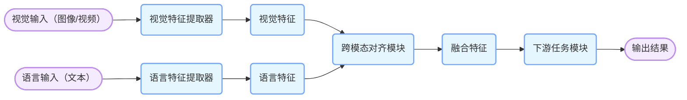

# 视觉语言融合:AI的下一个前沿

> 关键词：视觉语言融合、人工智能、多模态学习、计算机视觉、自然语言处理

> 摘要：本文围绕视觉语言融合这一AI领域的前沿方向展开深入探讨。首先介绍了视觉语言融合的背景，包括其目的、适用读者、文档结构和相关术语。接着阐述了核心概念及联系，通过文本示意图和Mermaid流程图清晰展示。详细讲解了核心算法原理和具体操作步骤，并结合Python源代码进行说明。同时给出了数学模型和公式，辅以举例加深理解。在项目实战部分，提供了开发环境搭建、源代码实现与解读。还探讨了实际应用场景，推荐了学习资源、开发工具框架和相关论文著作。最后总结了未来发展趋势与挑战，并解答常见问题，提供扩展阅读和参考资料，旨在为读者全面呈现视觉语言融合的技术全貌。

## 1. 背景介绍 
### 1.1 目的和范围
视觉语言融合旨在将计算机视觉（CV）和自然语言处理（NLP）两个领域的信息进行整合，使AI系统能够同时理解图像、视频等视觉信息和文本、语音等语言信息。这种融合可以让AI系统具备更强大的感知和理解能力，在多个领域实现更智能的应用。本文的范围涵盖了视觉语言融合的基本概念、核心算法、数学模型、实际应用以及未来发展等方面，旨在为读者提供一个全面深入的技术指南。

### 1.2 预期读者
本文预期读者包括人工智能领域的研究人员、开发者、学生以及对视觉语言融合技术感兴趣的爱好者。对于研究人员，本文可以提供最新的研究动态和技术思路；对于开发者，能够帮助他们掌握相关算法和开发技巧；对于学生，有助于他们建立起对这一前沿领域的系统认知；对于爱好者，则可以激发他们对该领域的兴趣和探索欲望。

### 1.3 文档结构概述
本文首先介绍视觉语言融合的背景信息，让读者了解其目的、适用人群和整体结构。接着阐述核心概念及联系，包括视觉和语言信息如何相互关联。然后详细讲解核心算法原理和具体操作步骤，并通过Python代码进行演示。之后给出数学模型和公式，帮助读者从理论层面理解。项目实战部分提供实际案例和代码解读。再探讨实际应用场景，让读者了解该技术的实际价值。随后推荐学习资源、开发工具框架和相关论文著作。最后总结未来发展趋势与挑战，解答常见问题并提供扩展阅读和参考资料。

### 1.4 术语表
#### 1.4.1 核心术语定义
- **视觉语言融合（Visual-Language Fusion）**：将计算机视觉技术所处理的视觉信息与自然语言处理技术所处理的语言信息进行整合，以实现更强大的智能理解和交互能力。
- **多模态学习（Multimodal Learning）**：涉及多种信息模态（如视觉、语言、音频等）的学习过程，旨在挖掘不同模态之间的关联和互补性。
- **特征提取（Feature Extraction）**：从原始数据（如图像、文本）中提取具有代表性的特征，以便后续的分析和处理。
- **跨模态对齐（Cross-modal Alignment）**：寻找视觉和语言特征之间的对应关系，使不同模态的信息能够相互匹配。

#### 1.4.2 相关概念解释
- **计算机视觉（Computer Vision）**：研究如何使计算机能够“看”，即从图像或视频中提取信息、理解场景和识别物体等。
- **自然语言处理（Natural Language Processing）**：研究如何让计算机理解、处理和生成人类语言，包括文本分类、机器翻译、问答系统等。
- **Transformer架构**：一种基于注意力机制的深度学习架构，在自然语言处理和计算机视觉领域都取得了显著的成果。

#### 1.4.3 缩略词列表
- **CV**：Computer Vision（计算机视觉）
- **NLP**：Natural Language Processing（自然语言处理）
- **CNN**：Convolutional Neural Network（卷积神经网络）
- **RNN**：Recurrent Neural Network（循环神经网络）
- **BERT**：Bidirectional Encoder Representations from Transformers（基于Transformer的双向编码器表示）

## 2. 核心概念与联系 
### 核心概念原理
视觉语言融合的核心在于将视觉信息和语言信息进行有效的整合和交互。在计算机视觉中，图像或视频被处理为一系列的视觉特征，例如物体的形状、颜色、纹理等。而在自然语言处理中，文本信息被转换为语义表示，如词向量、句子向量等。通过跨模态对齐技术，找到视觉特征和语言特征之间的对应关系，从而实现两种信息的融合。

### 架构的文本示意图
```plaintext
视觉输入（图像/视频） -- 视觉特征提取器（如CNN） --> 视觉特征
语言输入（文本） -- 语言特征提取器（如BERT） --> 语言特征
视觉特征和语言特征 --> 跨模态对齐模块 --> 融合特征
融合特征 --> 下游任务模块（如图像描述生成、视觉问答等）
```

### Mermaid流程图


## 3. 核心算法原理 & 具体操作步骤 
### 核心算法原理
视觉语言融合中常用的算法之一是基于Transformer架构的方法。Transformer通过注意力机制能够捕捉不同位置之间的依赖关系，非常适合处理序列数据。在视觉语言融合中，我们可以将视觉特征和语言特征分别编码，然后通过跨模态注意力机制实现两种特征的交互和融合。

### 具体操作步骤
1. **数据预处理**：对图像进行归一化、裁剪等操作，对文本进行分词、词嵌入等处理。
2. **特征提取**：使用预训练的卷积神经网络（如ResNet）提取图像的视觉特征，使用预训练的语言模型（如BERT）提取文本的语言特征。
3. **跨模态对齐**：通过跨模态注意力机制，计算视觉特征和语言特征之间的注意力分数，从而实现特征的对齐。
4. **特征融合**：将对齐后的视觉特征和语言特征进行拼接或加权求和，得到融合特征。
5. **下游任务处理**：将融合特征输入到下游任务模型中，如图像描述生成模型、视觉问答模型等，进行具体的任务处理。

### Python源代码实现
```python
import torch
import torch.nn as nn
import torchvision.models as models
from transformers import BertModel, BertTokenizer

# 定义视觉特征提取器
class VisualFeatureExtractor(nn.Module):
    def __init__(self):
        super(VisualFeatureExtractor, self).__init__()
        self.resnet = models.resnet18(pretrained=True)
        self.resnet.fc = nn.Identity()  # 去掉最后一层全连接层

    def forward(self, images):
        features = self.resnet(images)
        return features

# 定义语言特征提取器
class LanguageFeatureExtractor(nn.Module):
    def __init__(self):
        super(LanguageFeatureExtractor, self).__init__()
        self.bert = BertModel.from_pretrained('bert-base-uncased')
        self.tokenizer = BertTokenizer.from_pretrained('bert-base-uncased')

    def forward(self, texts):
        inputs = self.tokenizer(texts, return_tensors='pt', padding=True, truncation=True)
        outputs = self.bert(**inputs)
        features = outputs.last_hidden_state
        return features

# 定义跨模态对齐模块
class CrossModalAlignment(nn.Module):
    def __init__(self, visual_dim, language_dim):
        super(CrossModalAlignment, self).__init__()
        self.visual_proj = nn.Linear(visual_dim, language_dim)
        self.attention = nn.MultiheadAttention(language_dim, num_heads=8)

    def forward(self, visual_features, language_features):
        visual_features = self.visual_proj(visual_features)
        attn_output, _ = self.attention(language_features.transpose(0, 1), visual_features.transpose(0, 1), visual_features.transpose(0, 1))
        attn_output = attn_output.transpose(0, 1)
        return attn_output

# 定义融合模型
class VisualLanguageFusionModel(nn.Module):
    def __init__(self, visual_dim, language_dim):
        super(VisualLanguageFusionModel, self).__init__()
        self.visual_extractor = VisualFeatureExtractor()
        self.language_extractor = LanguageFeatureExtractor()
        self.alignment = CrossModalAlignment(visual_dim, language_dim)

    def forward(self, images, texts):
        visual_features = self.visual_extractor(images)
        language_features = self.language_extractor(texts)
        aligned_features = self.alignment(visual_features, language_features)
        # 这里可以进行特征融合和下游任务处理
        return aligned_features

# 示例使用
visual_dim = 512
language_dim = 768
model = VisualLanguageFusionModel(visual_dim, language_dim)

# 模拟输入
images = torch.randn(2, 3, 224, 224)
texts = ["A beautiful scene", "A big tree"]

output = model(images, texts)
print(output.shape)
```

## 4. 数学模型和公式 & 详细讲解 & 举例说明 
### 数学模型和公式
#### 视觉特征提取
在卷积神经网络（CNN）中，对于输入图像 $I \in \mathbb{R}^{H \times W \times C}$（其中 $H$ 为图像高度，$W$ 为图像宽度，$C$ 为图像通道数），经过一系列卷积层、池化层和激活函数后，得到视觉特征 $V \in \mathbb{R}^{d_v}$，其中 $d_v$ 为视觉特征的维度。

#### 语言特征提取
对于输入文本 $T = [w_1, w_2, \cdots, w_n]$（其中 $w_i$ 为第 $i$ 个词），经过词嵌入层和Transformer编码器后，得到语言特征 $L \in \mathbb{R}^{n \times d_l}$，其中 $n$ 为文本长度，$d_l$ 为语言特征的维度。

#### 跨模态注意力机制
跨模态注意力机制用于计算视觉特征和语言特征之间的注意力分数。设视觉特征为 $V = [v_1, v_2, \cdots, v_m]$，语言特征为 $L = [l_1, l_2, \cdots, l_n]$，则注意力分数 $A \in \mathbb{R}^{n \times m}$ 可以通过以下公式计算：

$$
A_{ij} = \frac{\exp(\text{sim}(l_i, v_j))}{\sum_{k=1}^{m} \exp(\text{sim}(l_i, v_k))}
$$

其中 $\text{sim}(l_i, v_j)$ 表示 $l_i$ 和 $v_j$ 之间的相似度，可以使用点积相似度：

$$
\text{sim}(l_i, v_j) = l_i^T v_j
$$

经过注意力加权求和后，得到对齐后的语言特征 $\hat{L} \in \mathbb{R}^{n \times d_l}$：

$$
\hat{L}_i = \sum_{j=1}^{m} A_{ij} v_j
$$

### 详细讲解
视觉特征提取通过CNN的卷积操作提取图像的局部特征，然后通过池化操作进行特征降维。语言特征提取使用Transformer架构，通过自注意力机制捕捉文本中词与词之间的依赖关系。跨模态注意力机制则通过计算注意力分数，使得语言特征能够关注到视觉特征中的相关部分，从而实现两种特征的对齐。

### 举例说明
假设我们有一张包含一只猫的图像和文本“a cute cat”。视觉特征提取器会提取出图像中猫的形状、颜色等特征，语言特征提取器会将文本转换为一系列的词向量。跨模态注意力机制会计算文本中每个词与视觉特征之间的注意力分数，例如“cat”这个词会对图像中猫的特征赋予较高的注意力分数，从而实现文本和图像的对齐。

## 5. 项目实战：代码实际案例和详细解释说明 
### 5.1  开发环境搭建
#### 安装Python
首先需要安装Python 3.7及以上版本。可以从Python官方网站（https://www.python.org/downloads/）下载并安装。

#### 安装依赖库
使用pip安装所需的依赖库：
```sh
pip install torch torchvision transformers
```

#### 配置开发环境
可以使用PyCharm、Jupyter Notebook等开发环境进行代码编写和调试。

### 5.2  源代码详细实现和代码解读
```python
import torch
import torch.nn as nn
import torchvision.models as models
from transformers import BertModel, BertTokenizer

# 定义视觉特征提取器
class VisualFeatureExtractor(nn.Module):
    def __init__(self):
        super(VisualFeatureExtractor, self).__init__()
        self.resnet = models.resnet18(pretrained=True)
        self.resnet.fc = nn.Identity()  # 去掉最后一层全连接层

    def forward(self, images):
        features = self.resnet(images)
        return features

# 定义语言特征提取器
class LanguageFeatureExtractor(nn.Module):
    def __init__(self):
        super(LanguageFeatureExtractor, self).__init__()
        self.bert = BertModel.from_pretrained('bert-base-uncased')
        self.tokenizer = BertTokenizer.from_pretrained('bert-base-uncased')

    def forward(self, texts):
        inputs = self.tokenizer(texts, return_tensors='pt', padding=True, truncation=True)
        outputs = self.bert(**inputs)
        features = outputs.last_hidden_state
        return features

# 定义跨模态对齐模块
class CrossModalAlignment(nn.Module):
    def __init__(self, visual_dim, language_dim):
        super(CrossModalAlignment, self).__init__()
        self.visual_proj = nn.Linear(visual_dim, language_dim)
        self.attention = nn.MultiheadAttention(language_dim, num_heads=8)

    def forward(self, visual_features, language_features):
        visual_features = self.visual_proj(visual_features)
        attn_output, _ = self.attention(language_features.transpose(0, 1), visual_features.transpose(0, 1), visual_features.transpose(0, 1))
        attn_output = attn_output.transpose(0, 1)
        return attn_output

# 定义融合模型
class VisualLanguageFusionModel(nn.Module):
    def __init__(self, visual_dim, language_dim):
        super(VisualLanguageFusionModel, self).__init__()
        self.visual_extractor = VisualFeatureExtractor()
        self.language_extractor = LanguageFeatureExtractor()
        self.alignment = CrossModalAlignment(visual_dim, language_dim)

    def forward(self, images, texts):
        visual_features = self.visual_extractor(images)
        language_features = self.language_extractor(texts)
        aligned_features = self.alignment(visual_features, language_features)
        # 这里可以进行特征融合和下游任务处理
        return aligned_features

# 示例使用
visual_dim = 512
language_dim = 768
model = VisualLanguageFusionModel(visual_dim, language_dim)

# 模拟输入
images = torch.randn(2, 3, 224, 224)
texts = ["A beautiful scene", "A big tree"]

output = model(images, texts)
print(output.shape)
```

### 代码解读与分析
1. **VisualFeatureExtractor类**：使用预训练的ResNet18模型提取图像的视觉特征，去掉最后一层全连接层，只保留特征提取部分。
2. **LanguageFeatureExtractor类**：使用预训练的BERT模型提取文本的语言特征，通过BertTokenizer对文本进行分词和编码。
3. **CrossModalAlignment类**：通过线性层将视觉特征投影到与语言特征相同的维度，然后使用多头注意力机制计算跨模态注意力分数，实现特征对齐。
4. **VisualLanguageFusionModel类**：将视觉特征提取器、语言特征提取器和跨模态对齐模块组合在一起，完成视觉语言融合的过程。
5. **示例使用部分**：创建模型实例，模拟输入图像和文本，调用模型的forward方法进行推理，并打印输出结果的形状。

## 6. 实际应用场景 
### 图像描述生成
视觉语言融合技术可以用于自动生成图像的描述文本。通过将图像的视觉特征和预定义的语言模板或文本数据进行融合，模型可以生成准确、生动的图像描述。例如，对于一张包含风景的图像，模型可以生成“一片美丽的草原上，有几匹马在悠闲地吃草”这样的描述。

### 视觉问答
在视觉问答系统中，用户可以针对图像提出问题，系统通过融合图像的视觉信息和问题的语言信息，给出相应的答案。例如，用户可以问“图像中有几只鸟”，系统通过分析图像和问题，给出鸟的数量。

### 智能购物助手
在电商平台中，视觉语言融合技术可以用于实现智能购物助手。用户可以通过上传商品图片或描述商品特征，系统根据图像和文本信息，为用户推荐相关的商品。

### 自动驾驶
在自动驾驶领域，视觉语言融合可以帮助车辆更好地理解周围环境。例如，结合摄像头拍摄的图像和交通规则的文本描述，车辆可以做出更准确的决策，如判断是否可以转弯、是否需要停车等。

### 医疗影像诊断
在医疗领域，视觉语言融合技术可以用于辅助医疗影像诊断。医生可以输入患者的症状描述，系统结合医学影像（如X光、CT等）的视觉信息，给出可能的诊断结果和建议。

## 7. 工具和资源推荐
### 7.1 学习资源推荐
#### 7.1.1 书籍推荐
- 《深度学习》（Deep Learning）：由Ian Goodfellow、Yoshua Bengio和Aaron Courville所著，是深度学习领域的经典教材，涵盖了神经网络、卷积神经网络、循环神经网络等基础知识。
- 《计算机视觉：算法与应用》（Computer Vision: Algorithms and Applications）：介绍了计算机视觉的基本概念、算法和应用，对于理解视觉特征提取和处理有很大帮助。
- 《自然语言处理入门》（Natural Language Processing with Python）：通过Python代码详细介绍了自然语言处理的基本技术，如分词、词性标注、命名实体识别等。

#### 7.1.2 在线课程
- Coursera上的“深度学习专项课程”（Deep Learning Specialization）：由Andrew Ng教授授课，涵盖了深度学习的各个方面，包括卷积神经网络、循环神经网络、注意力机制等。
- edX上的“计算机视觉基础”（Foundations of Computer Vision）：介绍了计算机视觉的基本原理和算法，通过实践项目帮助学生掌握相关技术。
- 网易云课堂上的“自然语言处理实战”：结合实际案例，详细讲解了自然语言处理的各种技术和应用。

#### 7.1.3 技术博客和网站
- arXiv：提供了大量的学术论文预印本，涵盖了人工智能、计算机视觉、自然语言处理等多个领域的最新研究成果。
- Medium：有许多技术博客分享了人工智能领域的最新技术和实践经验，如Towards Data Science、The AI Blog等。
- GitHub：是一个开源代码托管平台，上面有许多与视觉语言融合相关的开源项目，可以学习和参考。

### 7.2 开发工具框架推荐
#### 7.2.1 IDE和编辑器
- PyCharm：是一款专门为Python开发设计的集成开发环境，提供了代码编辑、调试、版本控制等功能，适合大型项目的开发。
- Jupyter Notebook：是一个交互式的开发环境，支持Python、R等多种编程语言，适合进行数据探索、模型实验和代码演示。
- Visual Studio Code：是一款轻量级的代码编辑器，支持多种编程语言和插件扩展，具有丰富的代码提示和调试功能。

#### 7.2.2 调试和性能分析工具
- PyTorch Profiler：是PyTorch官方提供的性能分析工具，可以帮助开发者分析模型的运行时间、内存使用情况等，优化模型性能。
- TensorBoard：是TensorFlow提供的可视化工具，也可以与PyTorch集成使用，用于可视化模型的训练过程、损失曲线、参数分布等。
- NVIDIA Nsight Systems：是一款用于GPU性能分析的工具，可以帮助开发者深入了解模型在GPU上的运行情况，优化GPU利用率。

#### 7.2.3 相关框架和库
- PyTorch：是一个开源的深度学习框架，提供了丰富的神经网络层和优化算法，支持GPU加速，广泛应用于计算机视觉和自然语言处理领域。
- TensorFlow：是另一个流行的深度学习框架，具有强大的分布式训练和部署能力，提供了丰富的工具和库，如TensorFlow Hub、TensorFlow Datasets等。
- Hugging Face Transformers：是一个用于自然语言处理的开源库，提供了预训练的语言模型（如BERT、GPT等）和相关工具，方便开发者进行语言任务的开发。

### 7.3 相关论文著作推荐
#### 7.3.1 经典论文
- "Attention Is All You Need"：介绍了Transformer架构，提出了注意力机制，是自然语言处理领域的重要突破。
- "ImageNet Classification with Deep Convolutional Neural Networks"：提出了AlexNet模型，开启了深度学习在计算机视觉领域的应用热潮。
- "Show and Tell: A Neural Image Caption Generator"：首次提出了基于神经网络的图像描述生成模型，为视觉语言融合领域奠定了基础。

#### 7.3.2 最新研究成果
- "CLIP: Connecting Text and Images"：提出了CLIP模型，通过对比学习的方法实现了图像和文本的跨模态对齐，取得了很好的效果。
- "ViT: An Image is Worth 16x16 Words: Transformers for Image Recognition at Scale"：将Transformer架构应用于图像识别任务，证明了Transformer在计算机视觉领域的有效性。
- "Unifying Vision-and-Language Tasks via Text Generation"：提出了一种基于文本生成的统一框架，能够处理多种视觉语言融合任务。

#### 7.3.3 应用案例分析
- "Visual Question Answering: A Survey of Methods and Datasets"：对视觉问答领域的方法和数据集进行了全面的综述和分析。
- "Medical Image Captioning: A Survey"：介绍了医疗影像描述生成领域的研究现状和挑战。
- "Autonomous Driving: A Survey of Technical and Legal Aspects"：对自动驾驶领域的技术和法律问题进行了深入探讨。

## 8. 总结：未来发展趋势与挑战
### 未来发展趋势
- **更强大的预训练模型**：随着计算资源的不断增加和算法的不断改进，未来会出现更强大的预训练视觉语言模型，能够在更多的任务上取得更好的效果。
- **多模态融合的拓展**：除了视觉和语言信息，未来的AI系统可能会融合更多的模态信息，如音频、触觉等，实现更加全面和智能的交互。
- **实际应用的普及**：视觉语言融合技术将在更多的领域得到应用，如智能家居、智能教育、智能娱乐等，为人们的生活带来更多的便利。
- **跨学科研究的加强**：视觉语言融合涉及计算机科学、心理学、认知科学等多个学科，未来需要加强跨学科研究，推动该领域的发展。

### 挑战
- **数据标注的难题**：视觉语言融合任务需要大量的标注数据，而数据标注的成本较高，且存在主观性和不一致性的问题。
- **计算资源的需求**：训练和部署大规模的视觉语言模型需要大量的计算资源，对于一些小型企业和研究机构来说，可能面临计算资源不足的问题。
- **模型解释性的不足**：目前的视觉语言模型大多是黑盒模型，缺乏解释性，难以理解模型的决策过程，这在一些关键领域（如医疗、金融）的应用中存在一定的风险。
- **语义理解的局限性**：虽然视觉语言融合技术在一定程度上实现了视觉和语言信息的融合，但对于语义的理解仍然存在局限性，需要进一步提高模型的语义理解能力。

## 9. 附录：常见问题与解答
### 问题1：视觉语言融合和多模态学习有什么区别？
视觉语言融合是多模态学习的一个具体应用领域，主要关注视觉和语言两种模态信息的融合。而多模态学习则更广泛，涉及多种信息模态（如视觉、语言、音频、触觉等）的学习和融合。

### 问题2：如何评估视觉语言融合模型的性能？
评估视觉语言融合模型的性能通常需要根据具体的任务来选择合适的指标。例如，在图像描述生成任务中，可以使用BLEU、ROUGE等指标；在视觉问答任务中，可以使用准确率、F1值等指标。

### 问题3：视觉语言融合模型的训练时间通常需要多久？
视觉语言融合模型的训练时间取决于模型的规模、数据集的大小和计算资源的配置等因素。一般来说，训练一个大规模的视觉语言模型可能需要数天甚至数周的时间。

### 问题4：视觉语言融合技术在实际应用中面临哪些挑战？
视觉语言融合技术在实际应用中面临数据标注难题、计算资源需求大、模型解释性不足和语义理解局限性等挑战。

### 问题5：如何选择适合的视觉特征提取器和语言特征提取器？
选择适合的视觉特征提取器和语言特征提取器需要考虑任务的需求、数据集的特点和计算资源的限制等因素。一般来说，可以选择预训练的模型，如ResNet、BERT等，这些模型在大规模数据集上进行了训练，具有较好的特征提取能力。

## 10. 扩展阅读 & 参考资料
### 扩展阅读
- "Multimodal Machine Learning: A Survey and Taxonomy"：对多模态学习领域进行了全面的综述和分类。
- "Deep Learning for Vision Systems"：深入介绍了深度学习在计算机视觉领域的应用和技术。
- "Natural Language Processing in Action"：结合实际案例，详细讲解了自然语言处理的各种技术和应用。

### 参考资料
- 相关学术论文：如前面提到的经典论文和最新研究成果。
- 开源项目：如GitHub上的视觉语言融合相关项目。
- 官方文档：如PyTorch、TensorFlow、Hugging Face Transformers等框架和库的官方文档。

作者：AI天才研究院/AI Genius Institute & 禅与计算机程序设计艺术 /Zen And The Art of Computer Programming