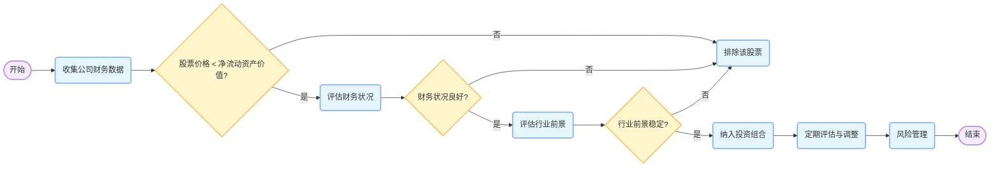

# 詹姆斯·蒙蒂尔的净净股投资：回归格雷厄姆的根源

> 关键词：詹姆斯·蒙蒂尔、净净股投资、格雷厄姆、价值投资、财务分析、股票估值、投资策略

> 摘要：本文围绕詹姆斯·蒙蒂尔的净净股投资策略展开，深入探讨其回归格雷厄姆投资根源的理念与方法。首先介绍净净股投资的背景，包括目的、适用读者、文档结构及相关术语。接着阐述核心概念，分析净净股投资的原理与架构，并通过Mermaid流程图展示其逻辑。详细讲解核心算法原理，使用Python代码实现具体操作步骤。运用数学模型和公式对净净股投资进行量化分析，并举例说明。通过项目实战，从开发环境搭建到源代码实现与解读，全面展示净净股投资策略在实际中的应用。探讨净净股投资的实际应用场景，推荐相关学习资源、开发工具框架及论文著作。最后总结未来发展趋势与挑战，解答常见问题，并提供扩展阅读与参考资料，旨在为投资者提供全面且深入的净净股投资知识体系。

## 1. 背景介绍 
### 1.1 目的和范围
本文章的主要目的是深入剖析詹姆斯·蒙蒂尔所倡导的净净股投资策略，详细阐述其与格雷厄姆投资理念的联系与回归。通过对净净股投资的核心概念、算法原理、数学模型等方面的探讨，帮助投资者全面理解这一投资策略的本质和应用方法。同时，结合项目实战案例，展示净净股投资在实际操作中的具体应用，为投资者提供可借鉴的经验。范围涵盖了净净股投资的理论基础、实践操作以及相关工具和资源的推荐，旨在为对价值投资尤其是净净股投资感兴趣的读者提供一个系统而深入的学习指南。

### 1.2 预期读者
本文预期读者主要包括对价值投资领域有一定了解，希望深入学习和实践净净股投资策略的投资者；从事金融投资分析工作，需要掌握不同投资方法和工具的专业人士；以及对金融市场和投资理论感兴趣，希望拓宽知识视野的研究人员和学生。无论是初学者还是有一定经验的投资者，都能从本文中获取有价值的信息和启示。

### 1.3 文档结构概述
本文将按照以下结构进行阐述：首先介绍净净股投资的背景信息，包括目的、读者群体、文档结构和术语表；接着深入讲解净净股投资的核心概念，通过文本示意图和Mermaid流程图展示其原理和架构；详细说明核心算法原理，并使用Python代码实现具体操作步骤；运用数学模型和公式对净净股投资进行量化分析，并举例说明；通过项目实战展示净净股投资策略的实际应用，包括开发环境搭建、源代码实现和代码解读；探讨净净股投资的实际应用场景；推荐相关的学习资源、开发工具框架和论文著作；最后总结净净股投资的未来发展趋势与挑战，解答常见问题，并提供扩展阅读和参考资料。

### 1.4 术语表
#### 1.4.1 核心术语定义
- **净净股（Net-Net Stocks）**：是指公司的股票价格低于其净流动资产价值（Net Current Asset Value，NCAV）的股票。净流动资产价值是用公司的流动资产减去全部负债得到的数值。
- **格雷厄姆（Benjamin Graham）**：被誉为“价值投资之父”，他提出了许多重要的投资理念和方法，是净净股投资策略的先驱。
- **价值投资（Value Investing）**：一种投资策略，强调通过分析公司的基本面，寻找被市场低估的股票进行投资，以获取长期的投资回报。
- **财务比率（Financial Ratios）**：用于评估公司财务状况和经营绩效的一系列指标，如市盈率、市净率等。

#### 1.4.2 相关概念解释
- **净流动资产价值（NCAV）**：净流动资产价值是衡量公司财务实力的一个重要指标。它反映了公司在清算时，扣除全部负债后，流动资产能够为股东带来的剩余价值。计算方法为：$NCAV = 流动资产 - 全部负债$。
- **安全边际（Margin of Safety）**：是价值投资中的一个重要概念，指的是股票的内在价值与市场价格之间的差距。投资者通过寻找具有足够安全边际的股票进行投资，以降低投资风险。

#### 1.4.3 缩略词列表
- **NCAV**：Net Current Asset Value，净流动资产价值
- **PE**：Price-to-Earnings Ratio，市盈率
- **PB**：Price-to-Book Ratio，市净率

## 2. 核心概念与联系 
### 核心概念原理
詹姆斯·蒙蒂尔的净净股投资策略回归了格雷厄姆的价值投资根源。格雷厄姆认为，当股票价格低于公司的净流动资产价值时，该股票具有较高的投资价值。净净股投资的核心原理在于寻找那些被市场低估的股票，这些股票的价格未能充分反映其潜在的资产价值。通过投资净净股，投资者可以在承担较低风险的情况下，获得较高的投资回报。

### 架构的文本示意图
```plaintext
净净股投资策略
|
|-- 格雷厄姆价值投资理念
|   |-- 强调基本面分析
|   |-- 寻找被低估股票
|   |-- 注重安全边际
|
|-- 净净股筛选标准
|   |-- 股票价格 < 净流动资产价值
|   |-- 财务状况良好
|   |-- 行业前景稳定
|
|-- 投资决策与管理
|   |-- 构建投资组合
|   |-- 定期评估与调整
|   |-- 风险管理
```

### Mermaid流程图


## 3. 核心算法原理 & 具体操作步骤 
### 核心算法原理
净净股投资的核心算法在于计算公司的净流动资产价值（NCAV），并将其与股票价格进行比较。如果股票价格低于NCAV，则认为该股票可能是净净股，具有投资价值。具体计算公式为：

$NCAV = 流动资产 - 全部负债$

### 具体操作步骤
以下是使用Python实现净净股筛选的具体操作步骤：

```python
import pandas as pd

# 定义计算净流动资产价值的函数
def calculate_ncav(current_assets, total_liabilities):
    """
    计算净流动资产价值
    :param current_assets: 流动资产
    :param total_liabilities: 全部负债
    :return: 净流动资产价值
    """
    return current_assets - total_liabilities

# 定义筛选净净股的函数
def screen_net_net_stocks(data):
    """
    筛选净净股
    :param data: 包含公司财务数据的DataFrame，列名包括 '股票价格', '流动资产', '全部负债'
    :return: 净净股的DataFrame
    """
    # 计算净流动资产价值
    data['NCAV'] = data.apply(lambda row: calculate_ncav(row['流动资产'], row['全部负债']), axis=1)
    # 筛选股票价格低于NCAV的股票
    net_net_stocks = data[data['股票价格'] < data['NCAV']]
    return net_net_stocks

# 示例数据
data = {
    '股票代码': ['000001', '000002', '000003'],
    '股票价格': [10, 20, 30],
    '流动资产': [100, 150, 200],
    '全部负债': [50, 100, 120]
}
df = pd.DataFrame(data)

# 筛选净净股
net_net_stocks = screen_net_net_stocks(df)
print(net_net_stocks)
```

### 代码解释
1. **calculate_ncav函数**：该函数接受流动资产和全部负债作为输入，返回净流动资产价值。
2. **screen_net_net_stocks函数**：该函数接受一个包含公司财务数据的DataFrame作为输入，首先调用`calculate_ncav`函数计算每个公司的NCAV，然后筛选出股票价格低于NCAV的股票，返回一个新的DataFrame。
3. **示例数据**：创建一个包含股票代码、股票价格、流动资产和全部负债的DataFrame。
4. **筛选净净股**：调用`screen_net_net_stocks`函数筛选出净净股，并打印结果。

## 4. 数学模型和公式 & 详细讲解 & 举例说明 
### 数学模型和公式
净净股投资的核心数学模型是计算净流动资产价值（NCAV），公式为：

$$NCAV = 流动资产 - 全部负债$$

### 详细讲解
净流动资产价值是衡量公司财务实力的一个重要指标。它反映了公司在清算时，扣除全部负债后，流动资产能够为股东带来的剩余价值。当股票价格低于NCAV时，意味着投资者可以以低于公司清算价值的价格购买该股票，从而获得一定的安全边际。

### 举例说明
假设一家公司的流动资产为1000万元，全部负债为500万元，则该公司的NCAV为：

$$NCAV = 1000 - 500 = 500（万元）$$

如果该公司的股票总市值为400万元，即股票价格低于NCAV，那么从净净股投资的角度来看，该股票可能具有投资价值。

## 5. 项目实战：代码实际案例和详细解释说明 
### 5.1  开发环境搭建
#### 安装Python
首先，需要安装Python编程语言。可以从Python官方网站（https://www.python.org/downloads/）下载适合自己操作系统的Python版本，并按照安装向导进行安装。

#### 安装必要的库
在Python环境中，需要安装一些必要的库来进行数据处理和分析，如`pandas`、`numpy`等。可以使用`pip`命令进行安装：

```sh
pip install pandas numpy
```

### 5.2  源代码详细实现和代码解读
以下是一个更完整的净净股筛选项目的源代码：

```python
import pandas as pd

# 定义计算净流动资产价值的函数
def calculate_ncav(current_assets, total_liabilities):
    """
    计算净流动资产价值
    :param current_assets: 流动资产
    :param total_liabilities: 全部负债
    :return: 净流动资产价值
    """
    return current_assets - total_liabilities

# 定义筛选净净股的函数
def screen_net_net_stocks(data):
    """
    筛选净净股
    :param data: 包含公司财务数据的DataFrame，列名包括 '股票价格', '流动资产', '全部负债'
    :return: 净净股的DataFrame
    """
    # 计算净流动资产价值
    data['NCAV'] = data.apply(lambda row: calculate_ncav(row['流动资产'], row['全部负债']), axis=1)
    # 筛选股票价格低于NCAV的股票
    net_net_stocks = data[data['股票价格'] < data['NCAV']]
    return net_net_stocks

# 读取财务数据文件
def read_financial_data(file_path):
    """
    读取财务数据文件
    :param file_path: 财务数据文件的路径
    :return: 包含财务数据的DataFrame
    """
    try:
        data = pd.read_csv(file_path)
        return data
    except FileNotFoundError:
        print(f"文件 {file_path} 未找到，请检查文件路径。")
        return None

# 主函数
def main():
    # 读取财务数据
    file_path = 'financial_data.csv'
    data = read_financial_data(file_path)
    if data is not None:
        # 筛选净净股
        net_net_stocks = screen_net_net_stocks(data)
        # 保存筛选结果
        net_net_stocks.to_csv('net_net_stocks.csv', index=False)
        print("净净股筛选结果已保存到 net_net_stocks.csv 文件中。")

if __name__ == "__main__":
    main()
```

### 代码解读与分析
1. **calculate_ncav函数**：该函数用于计算净流动资产价值，输入为流动资产和全部负债，返回计算结果。
2. **screen_net_net_stocks函数**：该函数接受一个包含公司财务数据的DataFrame作为输入，计算每个公司的NCAV，并筛选出股票价格低于NCAV的股票，返回一个新的DataFrame。
3. **read_financial_data函数**：该函数用于读取包含财务数据的CSV文件，并返回一个DataFrame。如果文件不存在，会打印错误信息并返回`None`。
4. **main函数**：主函数首先调用`read_financial_data`函数读取财务数据，然后调用`screen_net_net_stocks`函数筛选净净股，最后将筛选结果保存到CSV文件中。

## 6. 实际应用场景 
### 价值投资组合构建
净净股投资策略可以作为价值投资组合的一部分。投资者可以通过筛选出符合净净股标准的股票，将其纳入投资组合中，以提高组合的安全性和潜在回报。由于净净股通常具有较低的估值和较高的安全边际，能够在市场波动时为组合提供一定的保护。

### 逆向投资机会
在市场情绪低迷时，往往会出现更多的净净股投资机会。投资者可以利用净净股投资策略，逆向买入被市场低估的股票。当市场情绪好转时，这些股票的价格可能会出现较大幅度的上涨，从而为投资者带来丰厚的回报。

### 小市值股票投资
净净股通常集中在小市值股票中。对于那些关注小市值股票投资机会的投资者来说，净净股投资策略提供了一种筛选优质小市值股票的方法。通过投资小市值净净股，投资者有可能发现被市场忽视的潜在成长股。

## 7. 工具和资源推荐
### 7.1 学习资源推荐
#### 7.1.1 书籍推荐
- 《聪明的投资者》（The Intelligent Investor）：本杰明·格雷厄姆的经典著作，被誉为价值投资的圣经，详细阐述了价值投资的理念和方法。
- 《证券分析》（Security Analysis）：同样是格雷厄姆的重要著作，对证券分析的理论和实践进行了系统的介绍。
- 《价值投资实战手册》：唐朝所著，结合中国股市实际情况，深入讲解了价值投资的实战方法和技巧。

#### 7.1.2 在线课程
- Coursera上的“价值投资基础”课程：由知名教授授课，系统介绍价值投资的基本概念、理论和方法。
- 网易云课堂上的“股票投资实战技巧”课程：通过实际案例分析，讲解股票投资的实战技巧和策略。

#### 7.1.3 技术博客和网站
- 雪球网：国内知名的投资社区，汇聚了众多投资者和投资专家，提供丰富的投资资讯和分析文章。
- 价值投资网：专注于价值投资领域，提供价值投资的理论研究、案例分析和投资策略分享。

### 7.2 开发工具框架推荐
#### 7.2.1 IDE和编辑器
- PyCharm：一款专业的Python集成开发环境，提供代码编辑、调试、版本控制等功能，适合Python项目的开发。
- Jupyter Notebook：一种交互式的开发环境，支持Python代码的编写、运行和可视化展示，方便进行数据分析和实验。

#### 7.2.2 调试和性能分析工具
- pdb：Python自带的调试工具，可以帮助开发者定位和解决代码中的问题。
- cProfile：Python标准库中的性能分析工具，可以分析代码的运行时间和函数调用情况，帮助优化代码性能。

#### 7.2.3 相关框架和库
- pandas：用于数据处理和分析的Python库，提供了高效的数据结构和数据操作方法，适合处理财务数据。
- numpy：用于科学计算的Python库，提供了高效的数组操作和数学函数，可用于数值计算和统计分析。

### 7.3 相关论文著作推荐
#### 7.3.1 经典论文
- Benjamin Graham and David Dodd, "Security Analysis"：格雷厄姆和多德的经典论文，奠定了价值投资的理论基础。
- Joel Greenblatt, "The Little Book That Beats the Market"：介绍了一种简单有效的价值投资策略，对净净股投资有一定的启发。

#### 7.3.2 最新研究成果
- 关注顶级金融学术期刊，如《Journal of Finance》、《Review of Financial Studies》等，了解净净股投资领域的最新研究动态。

#### 7.3.3 应用案例分析
- 阅读一些投资机构或投资者的研究报告，了解他们在净净股投资方面的实践经验和案例分析。

## 8. 总结：未来发展趋势与挑战
### 未来发展趋势
- **数据驱动的投资决策**：随着金融科技的发展，投资者将能够获取更多、更准确的财务数据和市场信息。利用数据分析和机器学习技术，投资者可以更高效地筛选净净股，提高投资决策的准确性和效率。
- **全球化投资机会**：随着全球金融市场的一体化，投资者将有更多机会在全球范围内寻找净净股投资机会。不同国家和地区的市场环境和行业特点存在差异，为投资者提供了更广阔的投资视野。
- **与其他投资策略的融合**：净净股投资策略可能会与其他投资策略，如成长投资、股息投资等相结合，形成更加多元化的投资组合。通过融合不同的投资策略，投资者可以在降低风险的同时，提高投资回报。

### 挑战
- **数据质量和可靠性**：净净股投资依赖于准确的财务数据。然而，财务数据可能存在造假、错误或不完整的情况，这会影响投资者对净净股的判断和投资决策。
- **市场有效性提高**：随着市场的发展和投资者的成熟，市场的有效性可能会逐渐提高。这意味着净净股的数量可能会减少，寻找优质净净股的难度可能会增加。
- **宏观经济环境变化**：宏观经济环境的变化，如经济衰退、利率波动、通货膨胀等，会对净净股的投资价值产生影响。投资者需要密切关注宏观经济环境的变化，及时调整投资策略。

## 9. 附录：常见问题与解答
### 净净股投资一定能赚钱吗？
净净股投资并不能保证一定能赚钱。虽然净净股通常具有较低的估值和较高的安全边际，但股票价格的走势受到多种因素的影响，如公司的经营状况、行业竞争、宏观经济环境等。投资者在进行净净股投资时，仍需要进行充分的研究和分析，降低投资风险。

### 如何确定公司的流动资产和全部负债？
投资者可以通过公司的财务报表来获取公司的流动资产和全部负债信息。财务报表通常包括资产负债表、利润表和现金流量表。资产负债表中会详细列出公司的流动资产和全部负债项目。投资者还可以参考专业的金融数据提供商，如东方财富、同花顺等，获取更准确和详细的财务数据。

### 净净股投资适合短期投资还是长期投资？
净净股投资更适合长期投资。净净股的价值发现和价格回归需要一定的时间，短期市场波动可能会导致股票价格的不稳定。长期投资可以让投资者更好地享受公司价值增长带来的回报，同时也能降低短期市场波动对投资收益的影响。

## 10. 扩展阅读 & 参考资料
### 扩展阅读
- 《投资中最简单的事》：邱国鹭所著，介绍了一些简单有效的投资方法和理念，对净净股投资有一定的参考价值。
- 《漫步华尔街》（A Random Walk Down Wall Street）：伯顿·马尔基尔的经典著作，探讨了股票市场的随机性和投资策略，帮助投资者树立正确的投资观念。

### 参考资料
- Benjamin Graham, "The Intelligent Investor"
- Joel Greenblatt, "The Little Book That Beats the Market"
- 东方财富网、同花顺等金融数据平台

作者：AI天才研究院/AI Genius Institute & 禅与计算机程序设计艺术 /Zen And The Art of Computer Programming