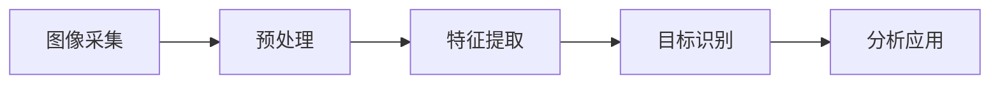

# 计算机视觉技术在零售业的应用与投资机会

> 关键词：计算机视觉技术、零售业、应用场景、投资机会、图像识别、数据分析

> 摘要：本文聚焦于计算机视觉技术在零售业的应用与投资机会。首先介绍了相关背景，包括目的、预期读者、文档结构和术语表。接着阐述了计算机视觉的核心概念、算法原理及操作步骤，辅以数学模型和公式说明。通过项目实战展示了其在零售业的代码实现和详细解读。分析了计算机视觉技术在零售业的实际应用场景，推荐了学习资源、开发工具和相关论文。最后总结了未来发展趋势与挑战，解答常见问题并提供扩展阅读与参考资料，旨在为读者全面呈现计算机视觉技术在零售业的现状与潜力。

## 1. 背景介绍 
### 1.1 目的和范围
本文章旨在深入探讨计算机视觉技术在零售业中的具体应用，以及由此带来的投资机会。我们将分析计算机视觉技术如何改变零售业的运营模式、提升顾客体验，同时评估在这一领域进行投资的可行性和潜在回报。研究范围涵盖了计算机视觉技术的各个方面，包括图像识别、目标检测、视频分析等，以及它们在零售店内、供应链管理、营销推广等多个环节的应用。

### 1.2 预期读者
本文的预期读者包括零售业从业者、投资者、计算机视觉技术开发者、研究人员以及对新兴技术在商业领域应用感兴趣的人士。零售业从业者可以从中了解如何利用计算机视觉技术提升自身业务竞争力；投资者可以评估在该领域的投资潜力；技术开发者和研究人员可以获取相关技术在零售业的应用案例和发展趋势；普通读者可以对计算机视觉技术在零售业的应用有一个全面的认识。

### 1.3 文档结构概述
本文将按照以下结构进行阐述：首先介绍计算机视觉技术和零售业的相关背景知识；接着深入探讨计算机视觉的核心概念和联系，包括其原理和架构；然后详细讲解核心算法原理和具体操作步骤，并通过Python代码进行说明；之后介绍相关的数学模型和公式，并举例说明；再通过项目实战展示计算机视觉技术在零售业的具体应用和代码实现；分析实际应用场景；推荐学习资源、开发工具和相关论文；最后总结未来发展趋势与挑战，解答常见问题并提供扩展阅读与参考资料。

### 1.4 术语表
#### 1.4.1 核心术语定义
- **计算机视觉技术**：是一门研究如何使机器“看”的科学，通过摄像头等设备获取图像或视频数据，利用算法对其进行处理和分析，从而实现目标识别、检测、跟踪、分类等功能。
- **零售业**：是指通过买卖形式将工农业生产者生产的产品直接售给居民作为生活消费用或售给社会集团供公共消费用的商品销售行业。
- **图像识别**：是指利用计算机对图像进行处理、分析和理解，以识别各种不同模式的目标和对象的技术。
- **目标检测**：是指在图像或视频中识别出特定目标的位置和类别。
- **视频分析**：是指对视频内容进行分析和理解，提取有用信息的技术。

#### 1.4.2 相关概念解释
- **深度学习**：是一种基于人工神经网络的机器学习方法，通过构建多层神经网络来自动学习数据的特征和模式，在计算机视觉领域取得了显著的成果。
- **卷积神经网络（CNN）**：是一种专门为处理具有网格结构数据（如图像）而设计的深度学习模型，通过卷积层、池化层等操作提取图像的特征。
- **人脸识别**：是图像识别的一种特殊应用，用于识别和验证人的面部特征。

#### 1.4.3 缩略词列表
- **CNN**：Convolutional Neural Network（卷积神经网络）
- **RCNN**：Region-based Convolutional Neural Network（基于区域的卷积神经网络）
- **YOLO**：You Only Look Once（一种快速目标检测算法）
- **SSD**：Single Shot MultiBox Detector（一种单阶段目标检测算法）

## 2. 核心概念与联系 

### 核心概念原理
计算机视觉技术的核心是让计算机能够像人类一样理解和处理图像或视频数据。其基本原理包括图像采集、预处理、特征提取、目标识别和分析等步骤。

图像采集是通过摄像头等设备获取图像或视频数据。预处理包括图像的滤波、增强、归一化等操作，以提高图像的质量和可分析性。特征提取是从预处理后的图像中提取出具有代表性的特征，如颜色、纹理、形状等。目标识别是根据提取的特征对图像中的目标进行分类和识别。分析则是对识别结果进行进一步的处理和应用，如统计目标数量、分析目标行为等。

### 架构示意图


在这个架构中，图像采集是整个流程的起点，为后续的处理提供数据基础。预处理可以去除图像中的噪声和干扰，提高特征提取的准确性。特征提取是关键步骤，它将图像数据转换为计算机能够理解的特征向量。目标识别根据特征向量对目标进行分类和识别。最后，分析应用根据识别结果进行进一步的处理和决策。

## 3. 核心算法原理 & 具体操作步骤 

### 核心算法原理
在计算机视觉领域，卷积神经网络（CNN）是一种非常重要的算法。CNN的基本原理是通过卷积层、池化层和全连接层等组件来自动学习图像的特征。

卷积层通过卷积核在图像上滑动，对图像进行卷积操作，提取图像的局部特征。池化层用于降低特征图的维度，减少计算量，同时增强特征的鲁棒性。全连接层将池化层输出的特征向量进行分类和回归。

### Python代码实现
```python
import tensorflow as tf
from tensorflow.keras import layers, models

# 构建一个简单的CNN模型
def build_cnn_model():
    model = models.Sequential()
    # 第一个卷积层，32个卷积核，卷积核大小为3x3，激活函数为ReLU
    model.add(layers.Conv2D(32, (3, 3), activation='relu', input_shape=(32, 32, 3)))
    # 第一个池化层，使用最大池化，池化窗口大小为2x2
    model.add(layers.MaxPooling2D((2, 2)))
    # 第二个卷积层，64个卷积核，卷积核大小为3x3，激活函数为ReLU
    model.add(layers.Conv2D(64, (3, 3), activation='relu'))
    # 第二个池化层，使用最大池化，池化窗口大小为2x2
    model.add(layers.MaxPooling2D((2, 2)))
    # 第三个卷积层，64个卷积核，卷积核大小为3x3，激活函数为ReLU
    model.add(layers.Conv2D(64, (3, 3), activation='relu'))
    # 将多维特征向量展平为一维向量
    model.add(layers.Flatten())
    # 第一个全连接层，64个神经元，激活函数为ReLU
    model.add(layers.Dense(64, activation='relu'))
    # 输出层，10个神经元，对应10个类别，使用softmax激活函数进行分类
    model.add(layers.Dense(10, activation='softmax'))

    # 编译模型，指定优化器、损失函数和评估指标
    model.compile(optimizer='adam',
                  loss='sparse_categorical_crossentropy',
                  metrics=['accuracy'])
    return model

# 创建模型实例
model = build_cnn_model()
# 打印模型结构
model.summary()
```

### 具体操作步骤
1. **数据准备**：收集和整理图像数据集，并将其划分为训练集、验证集和测试集。对图像数据进行预处理，如缩放、归一化等。
2. **模型构建**：根据任务需求构建CNN模型，选择合适的卷积层、池化层和全连接层的参数。
3. **模型编译**：指定模型的优化器、损失函数和评估指标。
4. **模型训练**：使用训练集对模型进行训练，通过多次迭代调整模型的参数，使模型的损失函数不断减小，评估指标不断提高。
5. **模型评估**：使用验证集和测试集对训练好的模型进行评估，检查模型的泛化能力和准确性。
6. **模型应用**：将训练好的模型应用到实际的计算机视觉任务中，如目标识别、图像分类等。

## 4. 数学模型和公式 & 详细讲解 & 举例说明 

### 卷积操作的数学模型
卷积操作是CNN中的核心操作，其数学模型可以表示为：

$$y(m,n)=\sum_{i=0}^{M-1}\sum_{j=0}^{N-1}x(m+i,n+j)w(i,j)$$

其中，$x$ 是输入图像，$w$ 是卷积核，$y$ 是卷积结果，$M$ 和 $N$ 分别是卷积核的高度和宽度。

### 详细讲解
卷积操作的本质是将卷积核在输入图像上滑动，对每个位置的局部区域进行加权求和，得到卷积结果。卷积核可以看作是一个滤波器，用于提取图像的特定特征。

### 举例说明
假设输入图像 $x$ 是一个 $3x3$ 的矩阵：

$$x=\begin{bmatrix}
1 & 2 & 3 \\
4 & 5 & 6 \\
7 & 8 & 9
\end{bmatrix}$$

卷积核 $w$ 是一个 $2x2$ 的矩阵：

$$w=\begin{bmatrix}
1 & 0 \\
0 & 1
\end{bmatrix}$$

卷积操作的过程如下：

1. 将卷积核的左上角与输入图像的左上角对齐，计算卷积结果的第一个元素：

$$y(0,0)=x(0,0)w(0,0)+x(0,1)w(0,1)+x(1,0)w(1,0)+x(1,1)w(1,1)=1\times1 + 2\times0 + 4\times0 + 5\times1 = 6$$

2. 将卷积核向右移动一个位置，计算卷积结果的第二个元素：

$$y(0,1)=x(0,1)w(0,0)+x(0,2)w(0,1)+x(1,1)w(1,0)+x(1,2)w(1,1)=2\times1 + 3\times0 + 5\times0 + 6\times1 = 8$$

3. 以此类推，最终得到卷积结果：

$$y=\begin{bmatrix}
6 & 8 \\
12 & 14
\end{bmatrix}$$

### 池化操作的数学模型
池化操作通常使用最大池化或平均池化，最大池化的数学模型可以表示为：

$$y(m,n)=\max_{i=0}^{M-1}\max_{j=0}^{N-1}x(m\times S + i,n\times S + j)$$

其中，$x$ 是输入特征图，$y$ 是池化结果，$M$ 和 $N$ 分别是池化窗口的高度和宽度，$S$ 是池化步长。

### 详细讲解
最大池化操作是在每个池化窗口内选择最大的值作为池化结果，这样可以保留特征图中的重要信息，同时降低特征图的维度。

### 举例说明
假设输入特征图 $x$ 是一个 $4x4$ 的矩阵：

$$x=\begin{bmatrix}
1 & 2 & 3 & 4 \\
5 & 6 & 7 & 8 \\
9 & 10 & 11 & 12 \\
13 & 14 & 15 & 16
\end{bmatrix}$$

池化窗口大小为 $2x2$，步长为 $2$，最大池化的过程如下：

1. 第一个池化窗口覆盖输入特征图的左上角 $2x2$ 区域，选择最大值 $6$ 作为池化结果的第一个元素。
2. 将池化窗口向右移动 $2$ 个位置，选择最大值 $8$ 作为池化结果的第二个元素。
3. 以此类推，最终得到池化结果：

$$y=\begin{bmatrix}
6 & 8 \\
14 & 16
\end{bmatrix}$$

## 5. 项目实战：代码实际案例和详细解释说明 

### 5.1  开发环境搭建
1. **安装Python**：建议使用Python 3.7及以上版本，可以从Python官方网站（https://www.python.org/downloads/）下载安装。
2. **安装深度学习框架**：本文使用TensorFlow作为深度学习框架，可以使用以下命令进行安装：
```sh
pip install tensorflow
```
3. **安装其他依赖库**：还需要安装一些其他的依赖库，如NumPy、Matplotlib等，可以使用以下命令进行安装：
```sh
pip install numpy matplotlib
```

### 5.2  源代码详细实现和代码解读
以下是一个使用CNN进行图像分类的完整代码示例：

```python
import tensorflow as tf
from tensorflow.keras import datasets, layers, models
import matplotlib.pyplot as plt

# 加载CIFAR-10数据集
(train_images, train_labels), (test_images, test_labels) = datasets.cifar10.load_data()

# 数据预处理，将像素值归一化到0-1之间
train_images, test_images = train_images / 255.0, test_images / 255.0

# 定义类别名称
class_names = ['airplane', 'automobile', 'bird', 'cat', 'deer',
               'dog', 'frog', 'horse', 'ship', 'truck']

# 显示部分训练图像
plt.figure(figsize=(10,10))
for i in range(25):
    plt.subplot(5,5,i+1)
    plt.xticks([])
    plt.yticks([])
    plt.grid(False)
    plt.imshow(train_images[i], cmap=plt.cm.binary)
    plt.xlabel(class_names[train_labels[i][0]])
plt.show()

# 构建CNN模型
model = models.Sequential()
model.add(layers.Conv2D(32, (3, 3), activation='relu', input_shape=(32, 32, 3)))
model.add(layers.MaxPooling2D((2, 2)))
model.add(layers.Conv2D(64, (3, 3), activation='relu'))
model.add(layers.MaxPooling2D((2, 2)))
model.add(layers.Conv2D(64, (3, 3), activation='relu'))
model.add(layers.Flatten())
model.add(layers.Dense(64, activation='relu'))
model.add(layers.Dense(10, activation='softmax'))

# 编译模型
model.compile(optimizer='adam',
              loss='sparse_categorical_crossentropy',
              metrics=['accuracy'])

# 训练模型
history = model.fit(train_images, train_labels, epochs=10, 
                    validation_data=(test_images, test_labels))

# 评估模型
test_loss, test_acc = model.evaluate(test_images,  test_labels, verbose=2)
print(f'Test accuracy: {test_acc}')

# 绘制训练和验证准确率曲线
plt.plot(history.history['accuracy'], label='accuracy')
plt.plot(history.history['val_accuracy'], label = 'val_accuracy')
plt.xlabel('Epoch')
plt.ylabel('Accuracy')
plt.ylim([0.5, 1])
plt.legend(loc='lower right')
plt.show()
```

### 代码解读与分析
1. **数据加载和预处理**：使用`datasets.cifar10.load_data()`加载CIFAR-10数据集，该数据集包含10个类别的60000张彩色图像，其中训练集50000张，测试集10000张。将像素值归一化到0-1之间，有助于提高模型的训练效果。
2. **数据可视化**：使用`matplotlib`库显示部分训练图像，方便我们直观地了解数据集的内容。
3. **模型构建**：构建一个简单的CNN模型，包含三个卷积层、两个池化层和两个全连接层。卷积层用于提取图像的特征，池化层用于降低特征图的维度，全连接层用于分类。
4. **模型编译**：指定模型的优化器为`adam`，损失函数为`sparse_categorical_crossentropy`，评估指标为`accuracy`。
5. **模型训练**：使用`model.fit()`方法对模型进行训练，指定训练集、训练轮数和验证集。
6. **模型评估**：使用`model.evaluate()`方法对训练好的模型进行评估，得到测试集的损失和准确率。
7. **结果可视化**：使用`matplotlib`库绘制训练和验证准确率曲线，观察模型的训练过程和泛化能力。

## 6. 实际应用场景 
### 店内顾客行为分析
计算机视觉技术可以通过安装在店内的摄像头实时监测顾客的行为，如顾客的行走路线、停留时间、浏览商品的种类等。通过对这些数据的分析，零售商可以了解顾客的购物习惯和偏好，优化店铺布局和商品陈列，提高顾客的购物体验和购买转化率。

### 商品库存管理
利用计算机视觉技术可以实现对商品库存的实时监控。通过在仓库和货架上安装摄像头，系统可以自动识别商品的种类和数量，及时发现缺货和补货需求。这有助于提高库存管理的效率，减少库存积压和缺货现象的发生。

### 自助结算与防损
计算机视觉技术可以应用于自助结算系统，通过识别商品的条形码或图像，实现快速准确的结算。同时，系统还可以监测顾客的行为，防止盗窃和欺诈行为的发生。在一些高端零售店铺中，已经开始使用基于计算机视觉的智能防盗系统，大大提高了店铺的安全性。

### 个性化营销
通过对顾客的面部特征、穿着打扮等进行分析，计算机视觉技术可以为顾客提供个性化的营销推荐。例如，根据顾客的年龄、性别、风格偏好等，向顾客推荐适合他们的商品和促销活动。这有助于提高营销效果，增加顾客的忠诚度。

### 供应链管理
在供应链管理中，计算机视觉技术可以用于货物的识别、分类和跟踪。通过在物流环节安装摄像头，系统可以实时监测货物的运输状态和位置，确保货物的安全和准时交付。同时，还可以对货物的质量进行检测，及时发现损坏和缺陷产品。

## 7. 工具和资源推荐
### 7.1 学习资源推荐
#### 7.1.1 书籍推荐
- 《深度学习》（Deep Learning）：由Ian Goodfellow、Yoshua Bengio和Aaron Courville撰写，是深度学习领域的经典教材，全面介绍了深度学习的理论和应用。
- 《计算机视觉：算法与应用》（Computer Vision: Algorithms and Applications）：由Richard Szeliski撰写，详细介绍了计算机视觉的各种算法和应用场景。
- 《Python深度学习》（Deep Learning with Python）：由Francois Chollet撰写，结合Keras框架介绍了深度学习的实践方法，适合初学者。

#### 7.1.2 在线课程
- Coursera上的“深度学习专项课程”（Deep Learning Specialization）：由Andrew Ng教授授课，包括五门课程，涵盖了深度学习的各个方面。
- edX上的“计算机视觉基础”（Foundations of Computer Vision）：由UC Berkeley的教授授课，介绍了计算机视觉的基本原理和算法。
- 哔哩哔哩上有很多关于计算机视觉和深度学习的免费教程，如“李沐动手学深度学习”系列课程。

#### 7.1.3 技术博客和网站
- Medium：有很多计算机视觉和深度学习领域的专业博客，如Towards Data Science。
- arXiv：是一个预印本平台，提供了大量最新的计算机视觉研究论文。
- OpenCV官方文档：OpenCV是计算机视觉领域最常用的开源库，其官方文档提供了详细的教程和示例代码。

### 7.2 开发工具框架推荐
#### 7.2.1 IDE和编辑器
- PyCharm：是一款专门为Python开发设计的集成开发环境，具有强大的代码编辑、调试和项目管理功能。
- Jupyter Notebook：是一个交互式的开发环境，适合进行数据探索、模型训练和结果可视化。
- Visual Studio Code：是一款轻量级的代码编辑器，支持多种编程语言和插件扩展，广泛应用于软件开发。

#### 7.2.2 调试和性能分析工具
- TensorBoard：是TensorFlow的可视化工具，可以帮助用户监控模型的训练过程、可视化模型结构和分析性能指标。
- PyTorch Profiler：是PyTorch的性能分析工具，可以帮助用户找出代码中的性能瓶颈。
- cProfile：是Python的内置性能分析工具，可以统计代码中各个函数的执行时间和调用次数。

#### 7.2.3 相关框架和库
- TensorFlow：是Google开发的开源深度学习框架，具有广泛的应用和丰富的工具库。
- PyTorch：是Facebook开发的开源深度学习框架，以其动态图机制和简洁的API受到广泛欢迎。
- OpenCV：是计算机视觉领域最常用的开源库，提供了各种计算机视觉算法和工具。

### 7.3 相关论文著作推荐
#### 7.3.1 经典论文
- 《ImageNet Classification with Deep Convolutional Neural Networks》：AlexNet的论文，开创了深度学习在计算机视觉领域的应用先河。
- 《Very Deep Convolutional Networks for Large-Scale Image Recognition》：VGGNet的论文，提出了一种非常深的卷积神经网络结构。
- 《Going Deeper with Convolutions》：GoogleNet的论文，引入了Inception模块，提高了模型的性能和效率。

#### 7.3.2 最新研究成果
- arXiv上每天都会发布大量计算机视觉领域的最新研究论文，可以关注相关的研究方向和热点问题。
- 顶级学术会议如CVPR、ICCV、ECCV等会收录计算机视觉领域的最新研究成果，可以通过会议官网获取相关论文。

#### 7.3.3 应用案例分析
- 一些商业媒体和研究机构会发布计算机视觉技术在零售业的应用案例分析报告，可以从中了解实际应用中的经验和挑战。
- 一些大型零售商如亚马逊、沃尔玛等会在其官方网站或技术博客上分享他们在计算机视觉技术应用方面的实践经验。

## 8. 总结：未来发展趋势与挑战
### 未来发展趋势
- **融合多种技术**：计算机视觉技术将与物联网、大数据、人工智能等技术深度融合，实现更加智能化的零售解决方案。例如，通过物联网设备收集更多的顾客数据，结合计算机视觉技术进行分析和处理，为顾客提供更加个性化的服务。
- **增强现实（AR）和虚拟现实（VR）应用**：AR和VR技术将为零售业带来全新的购物体验。通过计算机视觉技术，零售商可以实现虚拟试衣、虚拟展示等功能，让顾客更加直观地感受商品。
- **智能化供应链管理**：计算机视觉技术将在供应链管理中发挥更加重要的作用，实现货物的自动化识别、分类和跟踪，提高供应链的效率和透明度。
- **实时决策支持**：随着计算机视觉技术的不断发展，零售商可以实时获取顾客的行为数据和市场信息，通过数据分析和机器学习算法进行实时决策，优化商品定价、促销策略等。

### 挑战
- **数据隐私和安全问题**：计算机视觉技术需要收集和处理大量的顾客数据，如面部特征、行为习惯等，这涉及到数据隐私和安全问题。零售商需要采取有效的措施保护顾客的数据安全，遵守相关的法律法规。
- **技术成本和人才短缺**：计算机视觉技术的研发和应用需要大量的资金和技术人才。对于一些小型零售商来说，可能难以承担技术成本和培养专业人才。
- **算法的可解释性和可靠性**：深度学习算法在计算机视觉领域取得了显著的成果，但这些算法往往是黑盒模型，缺乏可解释性和可靠性。在一些关键应用场景中，如防损和安全监控，需要算法具有较高的可解释性和可靠性。
- **环境适应性和鲁棒性**：计算机视觉技术在实际应用中会受到光照、遮挡、噪声等因素的影响，导致算法的性能下降。需要提高算法的环境适应性和鲁棒性，确保在不同的环境条件下都能正常工作。

## 9. 附录：常见问题与解答
### 问题1：计算机视觉技术在零售业的应用需要哪些硬件设备？
解答：主要需要摄像头、服务器和存储设备等。摄像头用于采集图像和视频数据，服务器用于运行计算机视觉算法和处理数据，存储设备用于保存数据。根据应用场景的不同，还可能需要一些特殊的硬件设备，如3D摄像头、深度传感器等。

### 问题2：计算机视觉技术的准确率如何保证？
解答：可以从以下几个方面保证计算机视觉技术的准确率：
- 数据质量：使用高质量的数据集进行训练，确保数据的多样性和代表性。
- 模型选择和优化：选择合适的模型结构，并对模型进行优化和调参。
- 数据增强：通过数据增强技术增加训练数据的多样性，提高模型的泛化能力。
- 模型评估和验证：使用验证集和测试集对模型进行评估和验证，及时发现和解决问题。

### 问题3：计算机视觉技术在零售业的应用会取代人工吗？
解答：计算机视觉技术在零售业的应用不会完全取代人工，但会改变零售业的工作方式。计算机视觉技术可以帮助零售商提高效率、降低成本、提升顾客体验，但在一些需要人际交往和情感沟通的环节，如顾客服务、销售咨询等，人工仍然具有不可替代的作用。

### 问题4：如何选择适合的计算机视觉技术和解决方案？
解答：选择适合的计算机视觉技术和解决方案需要考虑以下几个因素：
- 应用场景：根据具体的应用场景选择合适的技术和解决方案，如目标检测、图像分类、人脸识别等。
- 预算和成本：考虑技术的研发和应用成本，选择符合预算的解决方案。
- 性能和准确率：评估技术的性能和准确率，确保能够满足业务需求。
- 可扩展性和兼容性：选择具有良好可扩展性和兼容性的技术和解决方案，以便未来进行升级和集成。

## 10. 扩展阅读 & 参考资料
### 扩展阅读
- 《人工智能时代的零售业变革》：探讨了人工智能技术在零售业的应用和发展趋势。
- 《计算机视觉前沿技术研究》：介绍了计算机视觉领域的最新研究成果和技术进展。
- 《零售业数字化转型实践》：分享了零售业数字化转型的案例和经验。

### 参考资料
- Goodfellow, I., Bengio, Y., & Courville, A. (2016). Deep Learning. MIT Press.
- Szeliski, R. (2010). Computer Vision: Algorithms and Applications. Springer.
- Chollet, F. (2017). Deep Learning with Python. Manning Publications.

作者：AI天才研究院/AI Genius Institute & 禅与计算机程序设计艺术 /Zen And The Art of Computer Programming