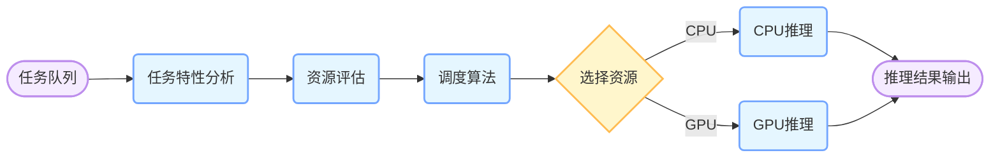

# 计算资源分配在AI推理过程中的优化

> 关键词：计算资源分配、AI推理、优化策略、资源调度、性能提升

> 摘要：本文聚焦于计算资源分配在AI推理过程中的优化问题。首先介绍了相关背景，包括目的、预期读者、文档结构和术语表。接着阐述了核心概念及其联系，给出了原理和架构的文本示意图与Mermaid流程图。详细讲解了核心算法原理，并使用Python源代码进行说明。通过数学模型和公式深入分析，辅以具体举例。结合项目实战，展示了开发环境搭建、源代码实现及解读。探讨了实际应用场景，推荐了学习资源、开发工具框架和相关论文著作。最后总结了未来发展趋势与挑战，提供了常见问题解答和扩展阅读参考资料，旨在为提升AI推理过程中计算资源的有效利用提供全面的技术指导。

## 1. 背景介绍 
### 1.1 目的和范围
在人工智能领域，推理过程是将训练好的模型应用于实际数据，以得出预测结果的关键步骤。然而，AI推理通常需要大量的计算资源，如CPU、GPU、内存等。如何高效地分配这些计算资源，以提高推理速度、降低成本并提升整体性能，是当前面临的重要挑战。本文的目的在于深入探讨计算资源分配在AI推理过程中的优化策略，涵盖从理论原理到实际应用的各个方面，旨在为相关从业者和研究者提供全面的技术指导。

### 1.2 预期读者
本文的预期读者包括人工智能领域的研究人员、开发者、数据科学家、软件工程师以及对AI推理和计算资源管理感兴趣的技术爱好者。无论是正在从事AI项目开发的专业人士，还是希望深入了解AI技术背后原理的初学者，都能从本文中获取有价值的信息。

### 1.3 文档结构概述
本文将按照以下结构展开：首先介绍核心概念与联系，帮助读者建立起基本的理论框架；接着详细阐述核心算法原理和具体操作步骤，并结合Python代码进行说明；通过数学模型和公式进一步深入分析；进行项目实战，展示如何在实际场景中应用优化策略；探讨实际应用场景；推荐相关的工具和资源；最后总结未来发展趋势与挑战，提供常见问题解答和扩展阅读参考资料。

### 1.4 术语表
#### 1.4.1 核心术语定义
- **AI推理**：指利用训练好的人工智能模型对新数据进行预测或分类的过程。
- **计算资源**：包括CPU（中央处理器）、GPU（图形处理器）、内存、存储等用于执行计算任务的硬件资源。
- **资源分配**：将可用的计算资源合理地分配给不同的AI推理任务，以达到最佳的性能和效率。
- **优化策略**：为了提高计算资源的利用率和AI推理性能而采用的一系列方法和技术。

#### 1.4.2 相关概念解释
- **负载均衡**：通过合理分配计算任务，使各个计算资源的负载保持相对均衡，避免出现部分资源过载而部分资源闲置的情况。
- **资源调度**：根据任务的优先级、资源需求和当前资源状态，动态地分配计算资源，以确保任务能够高效执行。
- **推理延迟**：从输入数据到输出推理结果所花费的时间，是衡量AI推理性能的重要指标之一。

#### 1.4.3 缩略词列表
- **CPU**：Central Processing Unit
- **GPU**：Graphics Processing Unit
- **RAM**：Random Access Memory
- **AI**：Artificial Intelligence

## 2. 核心概念与联系 
### 核心概念原理
在AI推理过程中，计算资源分配的核心目标是在有限的资源条件下，最大化推理性能。这涉及到多个方面的原理，包括任务特性分析、资源评估和调度算法设计。

任务特性分析是指对不同AI推理任务的计算复杂度、数据规模、实时性要求等进行评估。例如，图像识别任务通常需要大量的并行计算，适合在GPU上执行；而一些简单的文本分类任务，CPU可能就能够满足需求。

资源评估则是对可用计算资源的性能、容量和状态进行监测和分析。例如，了解CPU的核心数、主频，GPU的显存大小、计算能力等信息，以便合理地分配任务。

调度算法设计是根据任务特性和资源评估结果，选择合适的调度策略，将任务分配到最合适的计算资源上。常见的调度算法包括先来先服务（FCFS）、最短作业优先（SJF）、优先级调度等。

### 架构的文本示意图
```plaintext
+------------------+
| 任务队列         |
| （待推理任务）   |
+------------------+
        |
        v
+------------------+
| 任务特性分析模块 |
| （分析任务需求） |
+------------------+
        |
        v
+------------------+
| 资源评估模块     |
| （评估资源状态） |
+------------------+
        |
        v
+------------------+
| 调度算法模块     |
| （分配任务资源） |
+------------------+
        |
        v
+------------------+
| 计算资源池       |
| （CPU、GPU等）   |
+------------------+
        |
        v
+------------------+
| 推理结果输出     |
+------------------+
```

### Mermaid流程图


## 3. 核心算法原理 & 具体操作步骤 
### 核心算法原理
这里我们以基于优先级的调度算法为例进行说明。该算法的核心思想是根据任务的优先级，优先分配计算资源给高优先级的任务。任务的优先级可以根据多种因素确定，如任务的实时性要求、计算复杂度等。

### 具体操作步骤
1. **任务优先级设定**：为每个待推理任务分配一个优先级数值，数值越高表示优先级越高。
2. **资源状态监测**：实时监测计算资源（CPU、GPU等）的使用情况，包括空闲资源数量、负载情况等。
3. **任务调度**：从任务队列中选取优先级最高的任务，根据资源状态为其分配最合适的计算资源。
4. **任务执行**：将任务分配到相应的计算资源上执行推理操作。
5. **资源释放**：任务执行完成后，释放所占用的计算资源。

### Python源代码实现
```python
import heapq

# 定义任务类
class Task:
    def __init__(self, id, priority, resource_requirement):
        self.id = id
        self.priority = priority
        self.resource_requirement = resource_requirement

    def __lt__(self, other):
        return self.priority > other.priority

# 定义资源类
class Resource:
    def __init__(self, id, type, capacity):
        self.id = id
        self.type = type
        self.capacity = capacity
        self.used = 0

    def allocate(self, requirement):
        if self.used + requirement <= self.capacity:
            self.used += requirement
            return True
        return False

    def release(self, requirement):
        self.used -= requirement

# 任务队列
task_queue = []

# 资源池
resource_pool = [
    Resource(1, 'CPU', 100),
    Resource(2, 'GPU', 200)
]

# 添加任务到队列
tasks = [
    Task(1, 3, 20),
    Task(2, 1, 30),
    Task(3, 2, 10)
]

for task in tasks:
    heapq.heappush(task_queue, task)

# 任务调度
while task_queue:
    task = heapq.heappop(task_queue)
    allocated = False
    for resource in resource_pool:
        if resource.type == 'CPU' and task.resource_requirement <= resource.capacity - resource.used:
            resource.allocate(task.resource_requirement)
            print(f"Task {task.id} allocated to {resource.type} {resource.id}")
            # 模拟任务执行
            # 这里可以添加实际的推理代码
            resource.release(task.resource_requirement)
            allocated = True
            break
    if not allocated:
        print(f"Task {task.id} cannot be allocated due to resource shortage")
```

### 代码解释
1. **Task类**：表示待推理的任务，包含任务ID、优先级和资源需求。
2. **Resource类**：表示计算资源，包含资源ID、类型和容量，提供了资源分配和释放的方法。
3. **任务队列**：使用堆队列（优先队列）来存储任务，确保每次取出的任务都是优先级最高的。
4. **资源池**：存储可用的计算资源。
5. **任务调度**：从任务队列中取出优先级最高的任务，尝试为其分配合适的计算资源。如果分配成功，则执行任务并释放资源；否则，提示资源不足。

## 4. 数学模型和公式 & 详细讲解 & 举例说明 
### 数学模型
假设我们有 $n$ 个待推理任务 $T = \{T_1, T_2, \cdots, T_n\}$，每个任务 $T_i$ 有一个优先级 $p_i$ 和资源需求 $r_i$。同时，我们有 $m$ 个计算资源 $R = \{R_1, R_2, \cdots, R_m\}$，每个资源 $R_j$ 有一个容量 $c_j$ 和当前使用量 $u_j$。

我们的目标是最大化所有任务的优先级总和，同时满足资源约束条件。可以用以下数学模型表示：

$$
\begin{aligned}
\max &\sum_{i=1}^{n} p_i x_i \\
\text{s.t.} &\sum_{i=1}^{n} r_i x_i \leq c_j - u_j, \quad j = 1, 2, \cdots, m \\
&x_i \in \{0, 1\}, \quad i = 1, 2, \cdots, n
\end{aligned}
$$

其中，$x_i$ 是一个二进制变量，表示任务 $T_i$ 是否被分配到计算资源上执行。如果 $x_i = 1$，则任务 $T_i$ 被分配；如果 $x_i = 0$，则任务 $T_i$ 不被分配。

### 详细讲解
- **目标函数**：$\sum_{i=1}^{n} p_i x_i$ 表示所有被分配任务的优先级总和，我们的目标是最大化这个总和。
- **约束条件**：$\sum_{i=1}^{n} r_i x_i \leq c_j - u_j$ 表示每个计算资源的使用量不能超过其剩余容量。
- **二进制变量**：$x_i \in \{0, 1\}$ 确保每个任务要么被分配，要么不被分配。

### 举例说明
假设有3个任务 $T_1, T_2, T_3$，其优先级分别为 $p_1 = 3, p_2 = 1, p_3 = 2$，资源需求分别为 $r_1 = 20, r_2 = 30, r_3 = 10$。同时，有2个计算资源 $R_1$（CPU，容量 $c_1 = 100$，当前使用量 $u_1 = 0$）和 $R_2$（GPU，容量 $c_2 = 200$，当前使用量 $u_2 = 0$）。

我们可以将上述数学模型转化为具体的线性规划问题：

$$
\begin{aligned}
\max &3x_1 + x_2 + 2x_3 \\
\text{s.t.} &20x_1 + 30x_2 + 10x_3 \leq 100 \\
&20x_1 + 30x_2 + 10x_3 \leq 200 \\
&x_1, x_2, x_3 \in \{0, 1\}
\end{aligned}
$$

通过求解这个线性规划问题，我们可以得到最优的任务分配方案。在实际应用中，可以使用Python的 `pulp` 库来求解线性规划问题：

```python
from pulp import LpMaximize, LpProblem, LpVariable

# 创建线性规划问题
prob = LpProblem("Task_Allocation", LpMaximize)

# 定义变量
x1 = LpVariable("x1", cat='Binary')
x2 = LpVariable("x2", cat='Binary')
x3 = LpVariable("x3", cat='Binary')

# 定义目标函数
prob += 3 * x1 + 1 * x2 + 2 * x3

# 定义约束条件
prob += 20 * x1 + 30 * x2 + 10 * x3 <= 100
prob += 20 * x1 + 30 * x2 + 10 * x3 <= 200

# 求解问题
prob.solve()

# 输出结果
print("Status:", prob.status)
print("Objective value:", prob.objective.value())
print("x1 =", x1.value())
print("x2 =", x2.value())
print("x3 =", x3.value())
```

运行上述代码，我们可以得到最优的任务分配方案，从而实现计算资源的优化分配。

## 5. 项目实战：代码实际案例和详细解释说明 
### 5.1  开发环境搭建
#### 安装Python
首先，确保你已经安装了Python 3.x 版本。可以从Python官方网站（https://www.python.org/downloads/） 下载并安装适合你操作系统的Python版本。

#### 安装必要的库
我们需要安装一些必要的Python库，包括 `pulp`（用于求解线性规划问题）、`numpy`（用于数值计算）等。可以使用以下命令进行安装：
```sh
pip install pulp numpy
```

### 5.2  源代码详细实现和代码解读
```python
import numpy as np
from pulp import LpMaximize, LpProblem, LpVariable

# 定义任务信息
tasks = [
    {'id': 1, 'priority': 3, 'resource_requirement': 20},
    {'id': 2, 'priority': 1, 'resource_requirement': 30},
    {'id': 3, 'priority': 2, 'resource_requirement': 10}
]

# 定义资源信息
resources = [
    {'id': 1, 'type': 'CPU', 'capacity': 100, 'used': 0},
    {'id': 2, 'type': 'GPU', 'capacity': 200, 'used': 0}
]

# 创建线性规划问题
prob = LpProblem("Task_Allocation", LpMaximize)

# 定义变量
variables = []
for i in range(len(tasks)):
    var = LpVariable(f"x{i+1}", cat='Binary')
    variables.append(var)

# 定义目标函数
objective = 0
for i in range(len(tasks)):
    objective += tasks[i]['priority'] * variables[i]
prob += objective

# 定义约束条件
for resource in resources:
    constraint = 0
    for i in range(len(tasks)):
        constraint += tasks[i]['resource_requirement'] * variables[i]
    prob += constraint <= resource['capacity'] - resource['used']

# 求解问题
prob.solve()

# 输出结果
print("Status:", prob.status)
print("Objective value:", prob.objective.value())
for i in range(len(tasks)):
    print(f"Task {tasks[i]['id']}: {'Allocated' if variables[i].value() == 1 else 'Not Allocated'}")
```

### 代码解读与分析
1. **任务和资源信息定义**：使用字典列表定义了待推理任务和计算资源的信息，包括任务ID、优先级、资源需求，以及资源ID、类型、容量和当前使用量。
2. **线性规划问题创建**：使用 `pulp` 库创建了一个最大化问题 `prob`。
3. **变量定义**：为每个任务定义一个二进制变量，表示该任务是否被分配。
4. **目标函数定义**：根据任务的优先级，构建目标函数，目标是最大化所有被分配任务的优先级总和。
5. **约束条件定义**：为每个计算资源添加约束条件，确保任务的资源需求不超过资源的剩余容量。
6. **问题求解**：调用 `prob.solve()` 方法求解线性规划问题。
7. **结果输出**：输出问题的求解状态、目标函数值以及每个任务的分配情况。

通过上述代码，我们可以根据任务的优先级和资源需求，自动计算出最优的任务分配方案，从而实现计算资源的优化分配。

## 6. 实际应用场景 
### 智能安防系统
在智能安防系统中，需要对大量的监控视频进行实时分析，如目标检测、行为识别等。这些任务通常具有较高的实时性要求，需要快速地分配计算资源进行推理。通过优化计算资源分配，可以提高系统的响应速度，及时发现异常情况。

### 自动驾驶汽车
自动驾驶汽车需要实时处理各种传感器数据，如摄像头、雷达等，进行环境感知、路径规划等推理任务。合理的计算资源分配可以确保汽车在不同场景下都能高效地运行，提高行车安全性。

### 医疗影像诊断
在医疗领域，对X光、CT等影像进行诊断需要大量的计算资源。通过优化资源分配，可以加快诊断速度，提高诊断准确性，为患者提供更及时的治疗。

### 金融风险评估
金融机构需要对大量的客户数据进行风险评估，如信用评分、欺诈检测等。优化计算资源分配可以提高评估效率，降低运营成本，同时更好地应对市场变化。

## 7. 工具和资源推荐
### 7.1 学习资源推荐
#### 7.1.1 书籍推荐
- 《人工智能：一种现代的方法》：全面介绍了人工智能的基本概念、算法和应用，是人工智能领域的经典教材。
- 《深度学习》：由深度学习领域的三位先驱Ian Goodfellow、Yoshua Bengio和Aaron Courville撰写，深入讲解了深度学习的原理和技术。
- 《Python机器学习》：介绍了如何使用Python进行机器学习任务，包括数据预处理、模型选择、算法实现等方面。

#### 7.1.2 在线课程
- Coursera上的“人工智能基础”课程：由斯坦福大学的Sebastian Thrun教授授课，涵盖了人工智能的基本概念、搜索算法、机器学习等内容。
- edX上的“深度学习专项课程”：由Andrew Ng教授授课，系统地介绍了深度学习的理论和实践。
- 阿里云天池平台上的“AI训练营”：提供了丰富的AI实践项目和教程，帮助学习者快速掌握AI技术。

#### 7.1.3 技术博客和网站
- Medium上的Towards Data Science：汇聚了众多数据科学家和AI从业者的文章，分享了最新的技术动态和实践经验。
- arXiv：一个预印本平台，提供了大量的学术论文，涵盖了人工智能、机器学习等领域的最新研究成果。
- Kaggle：一个数据科学竞赛平台，不仅可以参与各种竞赛，还能学习到其他参赛者的优秀代码和解决方案。

### 7.2 开发工具框架推荐
#### 7.2.1 IDE和编辑器
- PyCharm：一款专业的Python集成开发环境，提供了丰富的代码编辑、调试、版本控制等功能，适合Python开发者使用。
- Jupyter Notebook：一个交互式的开发环境，支持多种编程语言，方便进行数据分析、模型训练和可视化展示。
- Visual Studio Code：一款轻量级的代码编辑器，支持多种编程语言和插件扩展，具有强大的代码编辑和调试功能。

#### 7.2.2 调试和性能分析工具
- TensorBoard：TensorFlow提供的可视化工具，可以帮助开发者监控模型训练过程、分析模型性能和可视化数据。
- Py-Spy：一个轻量级的Python性能分析工具，可以实时监控Python程序的CPU使用率、函数调用时间等信息。
- cProfile：Python标准库中的性能分析模块，可以帮助开发者找出程序中的性能瓶颈。

#### 7.2.3 相关框架和库
- TensorFlow：一个开源的机器学习框架，提供了丰富的工具和接口，支持多种深度学习模型的构建和训练。
- PyTorch：另一个流行的深度学习框架，具有动态图机制，易于使用和调试，受到了广大研究者和开发者的喜爱。
- Scikit-learn：一个用于机器学习的Python库，提供了丰富的机器学习算法和工具，适合初学者和快速开发。

### 7.3 相关论文著作推荐
#### 7.3.1 经典论文
- “Attention Is All You Need”：提出了Transformer模型，为自然语言处理领域带来了革命性的变化。
- “ImageNet Classification with Deep Convolutional Neural Networks”：介绍了AlexNet模型，开启了深度学习在计算机视觉领域的应用热潮。
- “Generative Adversarial Networks”：提出了生成对抗网络（GAN）的概念，为生成式模型的发展奠定了基础。

#### 7.3.2 最新研究成果
- 关注顶级学术会议如NeurIPS、ICML、CVPR等的最新论文，了解人工智能领域的最新研究动态。
- 一些知名研究机构如OpenAI、DeepMind等发布的研究报告和论文，通常代表了该领域的前沿技术。

#### 7.3.3 应用案例分析
- 一些行业报告和案例研究，如智能安防、自动驾驶、医疗等领域的应用案例，能够帮助我们了解如何将计算资源分配优化策略应用到实际场景中。

## 8. 总结：未来发展趋势与挑战
### 未来发展趋势
- **硬件技术的发展**：随着芯片技术的不断进步，未来的计算资源将更加多样化和强大，如量子计算、专用AI芯片等。这将为AI推理提供更高效的硬件支持，同时也对资源分配优化提出了新的挑战。
- **边缘计算的兴起**：边缘计算将计算和数据存储靠近数据源，减少数据传输延迟，提高系统的实时性和可靠性。在边缘计算环境下，如何优化计算资源分配，实现分布式推理，将成为未来的研究热点。
- **人工智能与其他领域的融合**：人工智能将与物联网、区块链、云计算等技术深度融合，创造出更多的应用场景。在这些复杂的融合场景中，需要更加智能和灵活的计算资源分配策略。

### 挑战
- **资源管理的复杂性**：随着计算资源的多样化和任务的复杂性增加，资源管理变得更加困难。如何实时监测和评估资源状态，准确预测任务需求，是当前面临的挑战之一。
- **算法的可扩展性**：现有的资源分配算法在处理大规模任务和复杂资源环境时，可能会遇到性能瓶颈。需要研究更加高效和可扩展的算法，以满足未来的需求。
- **安全性和隐私保护**：在AI推理过程中，数据的安全性和隐私保护至关重要。如何在优化资源分配的同时，确保数据的安全和隐私，是一个亟待解决的问题。

## 9. 附录：常见问题与解答
### 问题1：如何确定任务的优先级？
任务的优先级可以根据多种因素确定，如任务的实时性要求、计算复杂度、业务重要性等。例如，对于实时性要求较高的任务，可以赋予较高的优先级；对于计算复杂度较大的任务，也可以适当提高其优先级。

### 问题2：如何处理资源冲突？
当出现资源冲突时，可以采用以下策略进行处理：
- **调整任务优先级**：提高重要任务的优先级，确保其能够优先获得资源。
- **资源共享**：对于一些可以共享的资源，如内存、存储等，可以采用资源共享的方式，提高资源利用率。
- **任务调度优化**：优化任务调度算法，合理分配任务，避免资源冲突。

### 问题3：如何评估资源分配的效果？
可以从以下几个方面评估资源分配的效果：
- **推理性能**：如推理延迟、吞吐量等指标，反映了AI推理的速度和效率。
- **资源利用率**：计算资源的利用率，如CPU、GPU的使用率，反映了资源的有效利用程度。
- **成本效益**：考虑资源分配所带来的成本和收益，如电力消耗、硬件成本等。

## 10. 扩展阅读 & 参考资料
### 扩展阅读
- 《计算机体系结构：量化研究方法》：深入介绍了计算机体系结构的原理和设计方法，对于理解计算资源的本质和优化具有重要意义。
- 《大数据技术原理与应用》：介绍了大数据处理的相关技术和方法，与AI推理中的数据处理密切相关。

### 参考资料
- Goodfellow, I., Bengio, Y., & Courville, A. (2016). Deep Learning. MIT Press.
- Ng, A. (2017). Machine Learning Yearning.
- LeCun, Y., Bengio, Y., & Hinton, G. (2015). Deep learning. Nature, 521(7553), 436-444.

作者：AI天才研究院/AI Genius Institute & 禅与计算机程序设计艺术 /Zen And The Art of Computer Programming