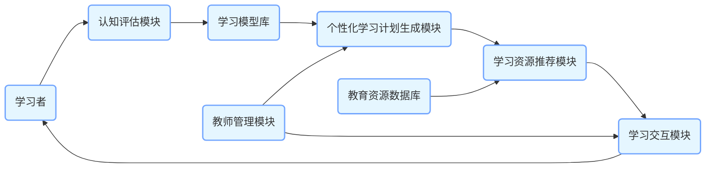

# 认知发展理论指导下的AI教育助手设计

> 关键词：认知发展理论、AI教育助手、设计原理、算法实现、应用场景

> 摘要：本文聚焦于在认知发展理论的指导下进行AI教育助手的设计。首先介绍了相关背景，包括目的、预期读者等内容。接着阐述了核心概念与联系，详细讲解了核心算法原理及具体操作步骤，给出了相关数学模型和公式并举例说明。通过项目实战展示了AI教育助手的代码实现和详细解读。分析了其实际应用场景，推荐了学习、开发等方面的工具和资源。最后总结了未来发展趋势与挑战，解答了常见问题并提供了扩展阅读和参考资料，旨在为基于认知发展理论的AI教育助手设计提供全面的技术指导和理论支持。

## 1. 背景介绍 
### 1.1 目的和范围
本研究的目的是设计一款基于认知发展理论的AI教育助手，以满足不同年龄段学习者的个性化学习需求。通过结合认知发展理论，使AI教育助手能够更好地理解学习者的认知水平和学习特点，提供更有针对性的学习支持和指导。

本研究的范围涵盖了从认知发展理论的原理分析到AI教育助手的具体设计和实现。包括对核心概念的阐述、算法原理的讲解、数学模型的建立、实际项目的开发以及应用场景的分析等方面。

### 1.2 预期读者
本文的预期读者包括教育技术领域的研究者、AI开发者、教育工作者以及对认知发展理论和AI教育应用感兴趣的人员。对于教育技术研究者，本文可以为其提供新的研究思路和方法；对于AI开发者，可作为设计和开发AI教育助手的技术参考；对于教育工作者，有助于他们更好地理解如何利用AI技术提升教学效果；对于普通读者，能帮助他们了解认知发展理论与AI教育的结合应用。

### 1.3 文档结构概述
本文将按照以下结构进行组织：首先介绍背景信息，包括目的、预期读者和文档结构概述等内容。接着阐述核心概念与联系，通过文本示意图和Mermaid流程图展示相关原理和架构。然后详细讲解核心算法原理及具体操作步骤，结合Python源代码进行说明。随后建立数学模型和公式，并举例说明其应用。通过项目实战部分展示AI教育助手的代码实现和详细解读。分析实际应用场景，推荐相关的学习、开发工具和资源。最后总结未来发展趋势与挑战，解答常见问题并提供扩展阅读和参考资料。

### 1.4 术语表
#### 1.4.1 核心术语定义
- **认知发展理论**：是研究人类认知能力的发展过程和机制的理论，主要探讨个体从出生到成年的认知结构和认知能力的变化规律。常见的认知发展理论有皮亚杰的认知发展阶段理论、维果茨基的社会文化理论等。
- **AI教育助手**：是一种利用人工智能技术开发的教育辅助工具，能够根据学习者的需求和特点，提供个性化的学习支持和服务，如学习资源推荐、问题解答、学习进度跟踪等。
- **个性化学习**：是指根据学习者的个体差异，如学习风格、学习能力、兴趣爱好等，为其提供定制化的学习内容和学习方式，以提高学习效果和效率。

#### 1.4.2 相关概念解释
- **认知结构**：是指个体在认知过程中形成的知识体系和思维方式，它是认知发展的基础。不同年龄段的学习者具有不同的认知结构，认知发展理论认为个体的认知结构是不断发展和变化的。
- **最近发展区**：这是维果茨基提出的概念，指个体实际发展水平与潜在发展水平之间的差距。在教育中，教师或教育助手可以通过提供适当的支持和挑战，帮助学习者跨越最近发展区，实现认知能力的提升。

#### 1.4.3 缩略词列表
- **AI**：Artificial Intelligence，人工智能
- **ML**：Machine Learning，机器学习
- **NLP**：Natural Language Processing，自然语言处理

## 2. 核心概念与联系 

### 认知发展理论与AI教育助手的关系
认知发展理论为AI教育助手的设计提供了理论基础和指导原则。不同的认知发展阶段，学习者的认知特点和学习需求是不同的。例如，皮亚杰的认知发展阶段理论将儿童的认知发展分为感知运动阶段、前运算阶段、具体运算阶段和形式运算阶段。在感知运动阶段，儿童主要通过感知和动作来认识世界；在前运算阶段，儿童开始使用符号和语言，但思维具有自我中心性；在具体运算阶段，儿童能够进行具体的逻辑运算；在形式运算阶段，儿童能够进行抽象的逻辑推理。

AI教育助手可以根据学习者所处的认知发展阶段，提供相应的学习内容和学习方式。例如，对于处于感知运动阶段的儿童，AI教育助手可以提供一些通过触摸、操作等方式进行学习的内容；对于处于形式运算阶段的学习者，可以提供一些需要抽象思维和逻辑推理的学习任务。

### 核心架构示意图
下面是一个基于认知发展理论的AI教育助手的核心架构示意图：



### 架构说明
- **认知评估模块**：通过各种方式对学习者的认知水平进行评估，如测试、问答、学习行为分析等，确定学习者所处的认知发展阶段。
- **学习模型库**：存储不同认知发展阶段的学习模型，每个学习模型包含适合该阶段的学习目标、学习内容、学习方法等信息。
- **个性化学习计划生成模块**：根据认知评估结果，从学习模型库中选择合适的学习模型，生成个性化的学习计划。
- **学习资源推荐模块**：根据个性化学习计划，从教育资源数据库中推荐适合的学习资源，如教材、课件、视频等。
- **学习交互模块**：为学习者提供学习交互界面，支持学习者与AI教育助手进行交互，如提问、讨论、提交作业等。同时，将学习者的学习行为和反馈信息反馈给认知评估模块，以便对学习计划进行调整。
- **教师管理模块**：教师可以通过该模块对学习者的学习情况进行监控和管理，如查看学习进度、批改作业、调整学习计划等。

## 3. 核心算法原理 & 具体操作步骤 

### 认知评估算法
认知评估是AI教育助手的关键环节，它直接影响到个性化学习计划的生成。下面是一个基于机器学习的认知评估算法的Python实现示例：

```python
import numpy as np
from sklearn.linear_model import LogisticRegression

# 假设我们有一些训练数据，包括学习者的特征和对应的认知阶段标签
# 特征可以是学习成绩、学习时间、答题正确率等
X_train = np.array([[80, 10, 0.8], [60, 5, 0.6], [90, 15, 0.9], [50, 3, 0.5]])
y_train = np.array([3, 2, 4, 1])  # 1-4分别代表不同的认知阶段

# 创建逻辑回归模型
model = LogisticRegression()

# 训练模型
model.fit(X_train, y_train)

# 假设我们有一个新的学习者的特征数据
new_learner_features = np.array([[70, 8, 0.7]])

# 预测该学习者的认知阶段
predicted_stage = model.predict(new_learner_features)
print("预测的认知阶段:", predicted_stage[0])
```

### 算法原理
上述代码使用了逻辑回归算法进行认知评估。逻辑回归是一种常用的分类算法，它通过对输入特征进行线性组合，然后通过逻辑函数将线性组合的结果映射到概率值，最后根据概率值进行分类。

在认知评估中，我们将学习者的特征作为输入，将认知阶段标签作为输出。通过训练逻辑回归模型，我们可以得到一个能够根据学习者的特征预测其认知阶段的模型。

### 具体操作步骤
1. **数据收集**：收集学习者的特征数据和对应的认知阶段标签，作为训练数据。
2. **数据预处理**：对收集到的数据进行清洗、归一化等预处理操作，以提高模型的性能。
3. **模型选择**：选择合适的机器学习算法，如逻辑回归、决策树、神经网络等。
4. **模型训练**：使用训练数据对选择的模型进行训练。
5. **模型评估**：使用测试数据对训练好的模型进行评估，检查模型的准确率、召回率等指标。
6. **预测应用**：使用训练好的模型对新的学习者的认知阶段进行预测。

### 个性化学习计划生成算法
个性化学习计划生成算法的目的是根据学习者的认知阶段和学习目标，生成适合该学习者的学习计划。下面是一个简单的个性化学习计划生成算法的Python实现示例：

```python
# 假设我们有一个学习模型库，每个学习模型包含学习目标、学习内容和学习时间
learning_model_library = {
    1: {
        "learning_goal": "掌握基础知识",
        "learning_content": ["基础知识讲解", "简单练习题"],
        "learning_time": 20
    },
    2: {
        "learning_goal": "提高应用能力",
        "learning_content": ["案例分析", "中等难度练习题"],
        "learning_time": 30
    },
    3: {
        "learning_goal": "培养创新思维",
        "learning_content": ["项目实践", "开放性问题讨论"],
        "learning_time": 40
    },
    4: {
        "learning_goal": "深入研究和探索",
        "learning_content": ["前沿知识学习", "科研项目参与"],
        "learning_time": 50
    }
}

# 根据认知阶段生成个性化学习计划
def generate_personalized_learning_plan(cognitive_stage):
    if cognitive_stage in learning_model_library:
        learning_plan = learning_model_library[cognitive_stage]
        return learning_plan
    else:
        return None

# 假设我们已经通过认知评估得到了学习者的认知阶段
cognitive_stage = 2

# 生成个性化学习计划
personalized_learning_plan = generate_personalized_learning_plan(cognitive_stage)
if personalized_learning_plan:
    print("个性化学习计划:")
    print("学习目标:", personalized_learning_plan["learning_goal"])
    print("学习内容:", personalized_learning_plan["learning_content"])
    print("学习时间:", personalized_learning_plan["learning_time"], "小时")
else:
    print("未找到适合的学习计划")
```

### 算法原理
上述代码通过简单的字典映射实现了个性化学习计划的生成。根据学习者的认知阶段，从学习模型库中查找对应的学习模型，将其作为个性化学习计划返回。

### 具体操作步骤
1. **定义学习模型库**：将不同认知阶段的学习模型存储在一个字典中，每个学习模型包含学习目标、学习内容和学习时间等信息。
2. **获取认知阶段**：通过认知评估算法得到学习者的认知阶段。
3. **生成学习计划**：根据学习者的认知阶段，从学习模型库中查找对应的学习模型，将其作为个性化学习计划返回。

## 4. 数学模型和公式 & 详细讲解 & 举例说明 

### 认知评估的数学模型
在认知评估中，我们可以使用逻辑回归模型进行分类。逻辑回归模型的数学表达式如下：

$$P(y = 1|x) = \frac{1}{1 + e^{-(w_0 + w_1x_1 + w_2x_2 + \cdots + w_nx_n)}}$$

其中，$P(y = 1|x)$ 表示在输入特征 $x = [x_1, x_2, \cdots, x_n]$ 的条件下，输出为 1 的概率；$w_0, w_1, w_2, \cdots, w_n$ 是模型的参数；$e$ 是自然常数。

### 详细讲解
逻辑回归模型通过对输入特征进行线性组合，然后通过逻辑函数将线性组合的结果映射到概率值。逻辑函数的取值范围是 $(0, 1)$，因此可以将其解释为概率。

在训练逻辑回归模型时，我们的目标是找到一组参数 $w_0, w_1, w_2, \cdots, w_n$，使得模型的预测结果与真实标签之间的误差最小。通常使用最大似然估计方法来求解模型的参数。

### 举例说明
假设我们有一个简单的认知评估问题，输入特征只有一个 $x_1$，表示学习者的学习成绩。我们要预测该学习者的认知阶段是否为高级阶段（标签 $y = 1$ 表示高级阶段，$y = 0$ 表示非高级阶段）。

假设我们已经训练好了逻辑回归模型，得到参数 $w_0 = -5$，$w_1 = 0.1$。现在有一个新的学习者，其学习成绩 $x_1 = 80$。我们可以计算该学习者处于高级阶段的概率：

$$P(y = 1|x_1 = 80) = \frac{1}{1 + e^{-(-5 + 0.1 \times 80)}} = \frac{1}{1 + e^{-3}} \approx 0.95$$

由于概率值接近 1，我们可以预测该学习者处于高级阶段。

### 个性化学习计划生成的数学模型
个性化学习计划生成可以看作是一个映射问题，即将学习者的认知阶段 $s$ 映射到一个学习计划 $p$。我们可以用一个函数 $f$ 来表示这个映射关系：

$$p = f(s)$$

其中，$s$ 是学习者的认知阶段，$p$ 是对应的学习计划。

### 详细讲解
在实际应用中，我们可以将学习模型库看作是一个映射表，每个认知阶段对应一个学习计划。因此，函数 $f$ 可以通过查找映射表来实现。

### 举例说明
假设我们有一个学习模型库，如下所示：

| 认知阶段 $s$ | 学习计划 $p$ |
| --- | --- |
| 1 | 掌握基础知识，学习基础知识讲解和简单练习题，学习时间 20 小时 |
| 2 | 提高应用能力，学习案例分析和中等难度练习题，学习时间 30 小时 |
| 3 | 培养创新思维，学习项目实践和开放性问题讨论，学习时间 40 小时 |
| 4 | 深入研究和探索，学习前沿知识和参与科研项目，学习时间 50 小时 |

如果学习者的认知阶段 $s = 2$，则通过查找映射表，我们可以得到对应的学习计划 $p$：提高应用能力，学习案例分析和中等难度练习题，学习时间 30 小时。

## 5. 项目实战：代码实际案例和详细解释说明 

### 5.1  开发环境搭建
#### 安装Python
首先，需要安装Python环境。可以从Python官方网站（https://www.python.org/downloads/）下载适合自己操作系统的Python版本，并按照安装向导进行安装。

#### 安装必要的库
在本项目中，我们需要使用一些Python库，如`numpy`、`scikit-learn`等。可以使用`pip`命令进行安装：

```sh
pip install numpy scikit-learn
```

### 5.2  源代码详细实现和代码解读
#### 认知评估模块
```python
import numpy as np
from sklearn.linear_model import LogisticRegression

# 训练数据
X_train = np.array([[80, 10, 0.8], [60, 5, 0.6], [90, 15, 0.9], [50, 3, 0.5]])
y_train = np.array([3, 2, 4, 1])

# 创建逻辑回归模型
model = LogisticRegression()

# 训练模型
model.fit(X_train, y_train)

# 新的学习者特征数据
new_learner_features = np.array([[70, 8, 0.7]])

# 预测认知阶段
predicted_stage = model.predict(new_learner_features)
print("预测的认知阶段:", predicted_stage[0])
```

**代码解读**：
- 导入必要的库：`numpy`用于处理数组，`LogisticRegression`用于创建逻辑回归模型。
- 定义训练数据：`X_train`是输入特征矩阵，`y_train`是对应的认知阶段标签。
- 创建逻辑回归模型：使用`LogisticRegression()`创建一个逻辑回归模型对象。
- 训练模型：使用`fit()`方法对模型进行训练。
- 定义新的学习者特征数据：`new_learner_features`是一个包含新学习者特征的数组。
- 预测认知阶段：使用`predict()`方法对新学习者的认知阶段进行预测，并打印结果。

#### 个性化学习计划生成模块
```python
# 学习模型库
learning_model_library = {
    1: {
        "learning_goal": "掌握基础知识",
        "learning_content": ["基础知识讲解", "简单练习题"],
        "learning_time": 20
    },
    2: {
        "learning_goal": "提高应用能力",
        "learning_content": ["案例分析", "中等难度练习题"],
        "learning_time": 30
    },
    3: {
        "learning_goal": "培养创新思维",
        "learning_content": ["项目实践", "开放性问题讨论"],
        "learning_time": 40
    },
    4: {
        "learning_goal": "深入研究和探索",
        "learning_content": ["前沿知识学习", "科研项目参与"],
        "learning_time": 50
    }
}

# 根据认知阶段生成个性化学习计划
def generate_personalized_learning_plan(cognitive_stage):
    if cognitive_stage in learning_model_library:
        learning_plan = learning_model_library[cognitive_stage]
        return learning_plan
    else:
        return None

# 假设已经得到学习者的认知阶段
cognitive_stage = 2

# 生成个性化学习计划
personalized_learning_plan = generate_personalized_learning_plan(cognitive_stage)
if personalized_learning_plan:
    print("个性化学习计划:")
    print("学习目标:", personalized_learning_plan["learning_goal"])
    print("学习内容:", personalized_learning_plan["learning_content"])
    print("学习时间:", personalized_learning_plan["learning_time"], "小时")
else:
    print("未找到适合的学习计划")
```

**代码解读**：
- 定义学习模型库：使用字典`learning_model_library`存储不同认知阶段的学习模型。
- 定义生成个性化学习计划的函数：`generate_personalized_learning_plan()`根据输入的认知阶段，从学习模型库中查找对应的学习计划并返回。
- 假设已经得到学习者的认知阶段：`cognitive_stage`是一个表示学习者认知阶段的整数。
- 生成个性化学习计划：调用`generate_personalized_learning_plan()`函数生成个性化学习计划，并打印结果。

### 5.3  代码解读与分析
#### 认知评估模块
- **优点**：逻辑回归算法简单易懂，训练速度快，对于小规模数据集和线性可分的问题有较好的性能。
- **缺点**：逻辑回归模型假设特征之间是线性关系，对于复杂的非线性问题可能效果不佳。

#### 个性化学习计划生成模块
- **优点**：通过字典映射的方式实现个性化学习计划的生成，简单直观，易于理解和维护。
- **缺点**：学习模型库需要手动维护，当学习模型较多时，管理起来可能比较麻烦。

## 6. 实际应用场景 
### 学校教育
在学校教育中，AI教育助手可以帮助教师更好地了解学生的认知水平和学习需求，为学生提供个性化的学习支持。例如，教师可以使用AI教育助手对学生进行认知评估，根据评估结果为学生制定个性化的学习计划。同时，AI教育助手可以为学生提供学习资源推荐、问题解答等服务，提高学生的学习效果和效率。

### 在线教育
在线教育平台可以集成AI教育助手，为学习者提供更加个性化的学习体验。学习者可以通过AI教育助手进行认知评估，获取适合自己的学习计划和学习资源。AI教育助手还可以实时跟踪学习者的学习进度，根据学习情况调整学习计划，提供针对性的学习建议。

### 家庭教育
在家庭教育中，家长可以使用AI教育助手帮助孩子进行学习。AI教育助手可以根据孩子的认知水平和学习特点，为孩子提供个性化的学习内容和学习方法。例如，对于年龄较小的孩子，AI教育助手可以提供一些趣味性的学习游戏和活动；对于年龄较大的孩子，可以提供一些学科知识的辅导和拓展。

## 7. 工具和资源推荐
### 7.1 学习资源推荐
#### 7.1.1 书籍推荐
- 《认知发展理论：儿童心理的成长》：这本书系统地介绍了各种认知发展理论，包括皮亚杰的认知发展阶段理论、维果茨基的社会文化理论等，对于理解认知发展的基本原理和机制非常有帮助。
- 《人工智能教育应用》：本书介绍了人工智能在教育领域的各种应用，包括AI教育助手的设计和开发，对于了解AI教育的前沿技术和应用案例有很大的启发。

#### 7.1.2 在线课程
- Coursera上的“人工智能基础”课程：该课程由知名高校的教授授课，系统地介绍了人工智能的基本概念、算法和应用，对于初学者来说是一个很好的入门课程。
- edX上的“教育技术前沿”课程：该课程聚焦于教育技术的最新发展，包括AI教育助手的设计和应用，适合教育技术领域的研究者和开发者学习。

#### 7.1.3 技术博客和网站
- 机器之心：这是一个专注于人工智能技术的博客网站，提供了大量关于人工智能的最新技术、研究成果和应用案例，对于了解AI教育助手的技术发展趋势非常有帮助。
- 教育信息化网：该网站主要关注教育信息化的发展动态和应用案例，包括AI教育助手在教育领域的应用实践，对于教育工作者和开发者来说是一个很好的信息来源。

### 7.2 开发工具框架推荐
#### 7.2.1 IDE和编辑器
- PyCharm：是一款专门为Python开发设计的集成开发环境（IDE），具有代码编辑、调试、版本控制等功能，对于开发AI教育助手非常方便。
- Jupyter Notebook：是一个交互式的编程环境，支持Python等多种编程语言。它可以方便地进行代码编写、数据可视化和结果展示，适合进行AI算法的实验和开发。

#### 7.2.2 调试和性能分析工具
- TensorBoard：是TensorFlow框架提供的一个可视化工具，可以用于可视化训练过程中的损失函数、准确率等指标，帮助开发者调试和优化模型。
- Py-Spy：是一个轻量级的Python性能分析工具，可以用于分析Python程序的性能瓶颈，找出程序中耗时较长的代码段。

#### 7.2.3 相关框架和库
- TensorFlow：是一个开源的机器学习框架，提供了丰富的机器学习算法和工具，可用于开发AI教育助手的认知评估模型。
- NLTK：是一个自然语言处理工具包，提供了各种自然语言处理的算法和工具，可用于处理AI教育助手中的文本数据，如问题解答、学习资源推荐等。

### 7.3 相关论文著作推荐
#### 7.3.1 经典论文
- Piaget, J. (1952). The Origins of Intelligence in Children. This classic work by Jean Piaget presents his theory of cognitive development in children, which has had a profound impact on the field of developmental psychology.
- Vygotsky, L. S. (1978). Mind in Society: The Development of Higher Psychological Processes. In this book, Lev Vygotsky introduces his sociocultural theory of cognitive development, emphasizing the role of social interaction and cultural context in learning.

#### 7.3.2 最新研究成果
- Baker, R. S. J. D., & Inventado, P. T. (2020). Artificial Intelligence in Education: Past, Present, and Future. This paper provides an overview of the history, current state, and future directions of AI in education, highlighting the potential of AI to transform teaching and learning.
- Drachsler, H., & Greller, W. (2021). Learning Analytics and Artificial Intelligence in Education: Towards a Data-Driven Approach. This research explores the integration of learning analytics and AI in education, discussing how data can be used to support personalized learning and improve educational outcomes.

#### 7.3.3 应用案例分析
- Siemens, G., & Long, P. (2011). Penetrating the fog: Analytics in learning and education. In this paper, the authors present several case studies of using analytics in education, demonstrating how data-driven approaches can be used to understand learners' behavior and improve learning experiences.
- Luckin, R., et al. (2016). Intelligence Amplification: A Manifesto for the Future of Learning and Education. This report includes case studies of AI-powered educational tools and platforms, showing how they can enhance learners' capabilities and support personalized learning.

## 8. 总结：未来发展趋势与挑战
### 未来发展趋势
- **更加个性化的学习支持**：未来的AI教育助手将能够更加准确地了解学习者的认知水平、学习风格和兴趣爱好，提供更加个性化的学习支持和服务。例如，根据学习者的情绪状态和注意力水平，实时调整学习内容和学习方式。
- **多模态交互**：除了传统的文本交互方式，未来的AI教育助手将支持多模态交互，如语音交互、手势交互、表情交互等。这将使学习者与AI教育助手的交互更加自然和便捷。
- **与虚拟现实（VR）和增强现实（AR）技术的融合**：VR和AR技术可以为学习者提供更加沉浸式的学习体验。未来的AI教育助手可以与VR和AR技术相结合，创建虚拟学习环境，让学习者身临其境地进行学习。
- **智能教育生态系统的构建**：未来的AI教育助手将不再是孤立的工具，而是会与其他教育资源和系统进行集成，构建智能教育生态系统。例如，与在线教育平台、学习管理系统、智能教室等进行无缝对接，实现教育资源的共享和协同。

### 挑战
- **数据隐私和安全问题**：AI教育助手需要收集和处理大量的学习者数据，如学习行为数据、个人信息等。如何保护这些数据的隐私和安全，防止数据泄露和滥用，是一个亟待解决的问题。
- **算法的可解释性**：一些复杂的机器学习算法，如深度学习算法，往往是黑盒模型，其决策过程难以解释。在教育领域，教师和学习者需要了解AI教育助手的决策依据，以便更好地信任和使用它。因此，提高算法的可解释性是一个重要的挑战。
- **技术与教育的融合**：虽然AI技术在不断发展，但如何将这些技术有效地应用到教育中，实现技术与教育的深度融合，是一个具有挑战性的问题。需要教育工作者和技术开发者共同努力，探索适合教育场景的AI应用模式。
- **伦理和道德问题**：AI教育助手的应用可能会带来一些伦理和道德问题，如教育公平性问题、算法偏见问题等。如何确保AI教育助手的应用符合伦理和道德原则，促进教育的公平和质量提升，是一个需要深入思考和解决的问题。

## 9. 附录：常见问题与解答
### 1. AI教育助手能完全替代教师吗？
不能。虽然AI教育助手可以提供个性化的学习支持和服务，但它不能完全替代教师的作用。教师不仅是知识的传授者，更是学生的引导者、启发者和情感支持者。教师可以根据学生的实际情况进行灵活的教学调整，给予学生及时的反馈和鼓励，这些都是AI教育助手难以做到的。

### 2. 如何确保AI教育助手的评估结果准确可靠？
为了确保AI教育助手的评估结果准确可靠，可以采取以下措施：
- **使用高质量的训练数据**：训练数据的质量直接影响模型的性能。应收集具有代表性、准确性和完整性的训练数据，并进行合理的预处理。
- **选择合适的算法和模型**：根据具体的评估任务，选择合适的机器学习算法和模型。可以通过实验比较不同算法和模型的性能，选择最优的方案。
- **进行模型评估和验证**：使用测试数据对训练好的模型进行评估和验证，检查模型的准确率、召回率等指标。可以采用交叉验证等方法，提高评估结果的可靠性。
- **持续更新和优化模型**：随着时间的推移和数据的积累，不断更新和优化模型，以适应新的情况和需求。

### 3. AI教育助手会增加学生的学习负担吗？
如果设计得当，AI教育助手不会增加学生的学习负担，反而可以减轻学生的学习负担。AI教育助手可以根据学生的认知水平和学习需求，提供个性化的学习计划和学习资源，避免学生进行不必要的学习。同时，AI教育助手可以实时跟踪学生的学习进度，及时发现学生的问题并提供帮助，提高学习效率。

### 4. 如何保障AI教育助手的公平性？
为了保障AI教育助手的公平性，可以采取以下措施：
- **避免算法偏见**：在算法设计和训练过程中，要注意避免使用带有偏见的数据和特征，确保算法的公正性。可以采用公平性评估指标对算法进行评估和优化。
- **提供多样化的学习资源**：AI教育助手应提供多样化的学习资源，满足不同学生的学习需求和兴趣爱好，避免因资源单一而导致的不公平。
- **关注弱势群体**：在设计和应用AI教育助手时，要关注弱势群体的需求，确保他们能够平等地享受AI教育助手带来的好处。例如，为残障学生提供特殊的学习支持。

## 10. 扩展阅读 & 参考资料
### 扩展阅读
- 《教育中的人工智能：从理论到实践》：这本书深入探讨了人工智能在教育领域的应用，包括AI教育助手的设计、开发和应用案例，对于进一步了解AI教育有很大的帮助。
- 《认知心理学》：认知心理学是研究人类认知过程的学科，对于理解认知发展理论和AI教育助手的设计原理有重要的参考价值。

### 参考资料
- Piaget, J. (1952). The Origins of Intelligence in Children. International Universities Press.
- Vygotsky, L. S. (1978). Mind in Society: The Development of Higher Psychological Processes. Harvard University Press.
- Baker, R. S. J. D., & Inventado, P. T. (2020). Artificial Intelligence in Education: Past, Present, and Future. Journal of Educational Technology & Society, 23(3), 1-14.
- Drachsler, H., & Greller, W. (2021). Learning Analytics and Artificial Intelligence in Education: Towards a Data-Driven Approach. Educational Technology Research and Development, 69(1), 1-22.

作者：AI天才研究院/AI Genius Institute & 禅与计算机程序设计艺术 /Zen And The Art of Computer Programming