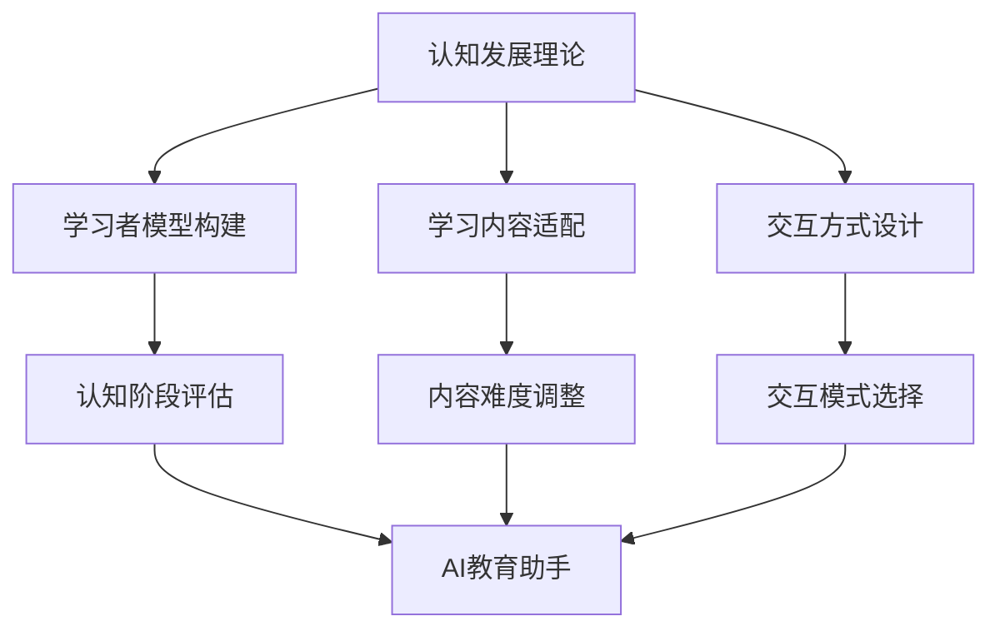

# 认知发展理论指导下的AI教育助手设计

> 关键词：认知发展理论、AI教育助手、教学设计、智能交互、教育应用

> 摘要：本文聚焦于在认知发展理论指导下进行AI教育助手的设计。首先介绍了认知发展理论的背景以及设计AI教育助手的目的和预期读者等内容。详细阐述了认知发展理论与AI教育助手的核心概念及联系，给出了原理和架构的示意图与流程图。深入讲解了相关核心算法原理，并通过Python代码进行说明，同时介绍了涉及的数学模型和公式。通过项目实战，给出代码实际案例并进行详细解释。探讨了AI教育助手的实际应用场景，推荐了学习资源、开发工具框架以及相关论文著作。最后总结了未来发展趋势与挑战，解答常见问题并提供扩展阅读和参考资料，旨在为设计更符合人类认知规律的AI教育助手提供全面的技术和理论支持。

## 1. 背景介绍 
### 1.1 目的和范围
在当今数字化时代，教育领域正经历着深刻的变革。人工智能技术的快速发展为教育带来了新的机遇和挑战。设计基于认知发展理论的AI教育助手的目的在于，充分利用认知发展理论的优势，使AI教育助手能够更好地适应学习者不同阶段的认知特点，提供个性化、高效的学习支持。

本设计的范围涵盖了从理论层面将认知发展理论与AI技术相结合，到实际的AI教育助手系统架构设计、算法实现、应用场景探索等多个方面。不仅关注AI教育助手的功能设计，还注重其在不同教育场景中的实际应用效果。

### 1.2 预期读者
本文的预期读者主要包括教育技术领域的研究者、AI开发者、教育工作者以及对AI教育应用感兴趣的人士。对于教育技术研究者，本文提供了一种将认知发展理论与AI技术融合的研究思路和方法；对于AI开发者，详细的算法原理和代码实现可作为开发参考；对于教育工作者，有助于了解如何利用AI教育助手提升教学效果；而对普通爱好者来说，能帮助他们了解AI在教育领域的应用现状和发展趋势。

### 1.3 文档结构概述
本文将按照以下结构进行阐述：首先介绍相关背景知识，包括目的、预期读者和文档结构等；接着阐述认知发展理论与AI教育助手的核心概念及联系，并给出原理和架构的示意图与流程图；然后深入讲解核心算法原理和具体操作步骤，同时介绍相关数学模型和公式；通过项目实战给出代码实际案例并详细解释；探讨AI教育助手的实际应用场景；推荐学习资源、开发工具框架和相关论文著作；最后总结未来发展趋势与挑战，解答常见问题并提供扩展阅读和参考资料。

### 1.4 术语表
#### 1.4.1 核心术语定义
- **认知发展理论**：是关于人类认知能力发展的理论，主要研究个体从出生到成年的认知发展过程和机制，如皮亚杰的认知发展阶段理论等。
- **AI教育助手**：利用人工智能技术开发的，辅助教育教学活动的软件系统，能够为学习者提供学习支持、答疑解惑等服务。
- **个性化学习**：根据学习者的个体差异，如学习能力、兴趣爱好、知识水平等，提供定制化的学习内容和学习方式。

#### 1.4.2 相关概念解释
- **图式**：在认知发展理论中，图式是指个体对世界的认知结构和心理模式，是认知的基本单元。
- **同化**：个体将新的信息纳入已有的图式中，从而丰富和扩展原有图式的过程。
- **顺应**：当个体遇到新的信息不能纳入原有图式时，需要改变或调整原有图式以适应新信息的过程。

#### 1.4.3 缩略词列表
- **AI**：Artificial Intelligence，人工智能
- **ML**：Machine Learning，机器学习
- **NLP**：Natural Language Processing，自然语言处理

## 2. 核心概念与联系 

### 核心概念原理
认知发展理论为AI教育助手的设计提供了重要的理论基础。以皮亚杰的认知发展阶段理论为例，该理论将儿童的认知发展分为四个阶段：感知运动阶段（0 - 2岁）、前运算阶段（2 - 7岁）、具体运算阶段（7 - 11岁）和形式运算阶段（11岁及以上）。不同阶段的儿童具有不同的认知特点和思维方式。

在设计AI教育助手时，可以根据学习者所处的认知发展阶段，提供与之相适应的学习内容和交互方式。例如，对于处于前运算阶段的儿童，他们的思维具有直观形象性，AI教育助手可以更多地采用图像、动画等形式呈现学习内容；而对于处于形式运算阶段的学习者，则可以提供更具抽象性和逻辑性的学习任务。

### 架构的文本示意图
```plaintext
                            认知发展理论
                                 |
                                 |
           ┌─────────────────────┼─────────────────────┐
           │                     │                     │
      学习者模型构建        学习内容适配        交互方式设计
           │                     │                     │
           │                     │                     │
┌─────────────────┐  ┌─────────────────┐  ┌─────────────────┐
│  认知阶段评估   │  │  内容难度调整  │  │  交互模式选择  │
└─────────────────┘  └─────────────────┘  └─────────────────┘
           │                     │                     │
           │                     │                     │
           └─────────────────────┼─────────────────────┘
                                 |
                                 |
                              AI教育助手
```

### Mermaid流程图


## 3. 核心算法原理 & 具体操作步骤 

### 核心算法原理
为了实现AI教育助手根据学习者的认知发展阶段提供个性化服务，我们可以采用机器学习中的分类算法。具体来说，使用决策树算法对学习者的认知阶段进行分类。

决策树是一种基于树结构进行决策的算法，每个内部节点是一个属性上的测试，每个分支是一个测试输出，每个叶节点是一个类别或值。通过对大量学习者的数据进行训练，决策树可以学习到不同认知阶段的特征和规律，从而对新的学习者进行准确的分类。

### Python源代码详细阐述
```python
import pandas as pd
from sklearn.model_selection import train_test_split
from sklearn.tree import DecisionTreeClassifier
from sklearn.metrics import accuracy_score

# 假设我们有一个包含学习者特征和认知阶段标签的数据集
# 特征可以包括年龄、学习成绩、反应速度等
# 标签为认知阶段，如 "感知运动阶段", "前运算阶段", "具体运算阶段", "形式运算阶段"
data = {
    'age': [3, 5, 8, 12, 15],
    'score': [60, 70, 80, 90, 95],
    'reaction_time': [1.2, 1.0, 0.8, 0.6, 0.5],
    'cognitive_stage': ['前运算阶段', '前运算阶段', '具体运算阶段', '形式运算阶段', '形式运算阶段']
}
df = pd.DataFrame(data)

# 划分特征和标签
X = df[['age', 'score', 'reaction_time']]
y = df['cognitive_stage']

# 划分训练集和测试集
X_train, X_test, y_train, y_test = train_test_split(X, y, test_size=0.2, random_state=42)

# 创建决策树分类器
clf = DecisionTreeClassifier()

# 训练模型
clf.fit(X_train, y_train)

# 预测测试集
y_pred = clf.predict(X_test)

# 计算准确率
accuracy = accuracy_score(y_test, y_pred)
print(f"模型准确率: {accuracy}")
```

### 具体操作步骤
1. **数据收集**：收集学习者的相关特征数据，如年龄、学习成绩、反应速度等，同时标注其认知阶段。
2. **数据预处理**：对收集到的数据进行清洗、归一化等处理，以提高模型的训练效果。
3. **模型训练**：使用训练集数据对决策树分类器进行训练。
4. **模型评估**：使用测试集数据对训练好的模型进行评估，计算准确率等指标。
5. **应用部署**：将训练好的模型部署到AI教育助手中，用于对新学习者的认知阶段进行分类。

## 4. 数学模型和公式 & 详细讲解 & 举例说明 

### 信息增益公式
在决策树算法中，常用信息增益来选择最优的划分属性。信息增益的计算公式如下：

$$IG(D, a) = Ent(D) - \sum_{v = 1}^{V} \frac{|D^v|}{|D|} Ent(D^v)$$

其中：
- $IG(D, a)$ 表示属性 $a$ 对数据集 $D$ 的信息增益。
- $Ent(D)$ 表示数据集 $D$ 的信息熵，计算公式为：

$$Ent(D) = - \sum_{k = 1}^{|Y|} p_k \log_2 p_k$$

其中 $p_k$ 是数据集 $D$ 中第 $k$ 类样本所占的比例。
- $D^v$ 表示根据属性 $a$ 的第 $v$ 个取值划分得到的子集。
- $V$ 表示属性 $a$ 的取值个数。

### 详细讲解
信息熵 $Ent(D)$ 反映了数据集 $D$ 的纯度，熵值越大，数据集越不纯。信息增益 $IG(D, a)$ 表示使用属性 $a$ 对数据集 $D$ 进行划分后，数据集纯度的提升程度。在决策树的构建过程中，我们会选择信息增益最大的属性作为当前节点的划分属性，以使得决策树能够更快地达到较高的纯度。

### 举例说明
假设我们有一个数据集 $D$，包含 10 个样本，其中 6 个属于类别 $A$，4 个属于类别 $B$。则数据集 $D$ 的信息熵为：

$$Ent(D) = - (\frac{6}{10} \log_2 \frac{6}{10} + \frac{4}{10} \log_2 \frac{4}{10}) \approx 0.971$$

假设我们有一个属性 $a$，有两个取值 $a_1$ 和 $a_2$。根据属性 $a$ 进行划分后，得到子集 $D^1$ 包含 3 个样本，其中 2 个属于类别 $A$，1 个属于类别 $B$；子集 $D^2$ 包含 7 个样本，其中 4 个属于类别 $A$，3 个属于类别 $B$。

则子集 $D^1$ 的信息熵为：

$$Ent(D^1) = - (\frac{2}{3} \log_2 \frac{2}{3} + \frac{1}{3} \log_2 \frac{1}{3}) \approx 0.918$$

子集 $D^2$ 的信息熵为：

$$Ent(D^2) = - (\frac{4}{7} \log_2 \frac{4}{7} + \frac{3}{7} \log_2 \frac{3}{7}) \approx 0.985$$

属性 $a$ 对数据集 $D$ 的信息增益为：

$$IG(D, a) = Ent(D) - (\frac{3}{10} Ent(D^1) + \frac{7}{10} Ent(D^2)) \approx 0.971 - (\frac{3}{10} \times 0.918 + \frac{7}{10} \times 0.985) \approx 0.026$$

## 5. 项目实战：代码实际案例和详细解释说明 

### 5.1  开发环境搭建
为了实现一个简单的AI教育助手，我们可以使用Python语言和一些常用的机器学习、自然语言处理库。以下是具体的开发环境搭建步骤：

1. **安装Python**：从Python官方网站（https://www.python.org/downloads/）下载并安装Python 3.x版本。
2. **安装必要的库**：使用pip命令安装以下库：
```sh
pip install pandas scikit-learn nltk
```
其中，`pandas` 用于数据处理，`scikit-learn` 用于机器学习算法，`nltk` 用于自然语言处理。

### 5.2  源代码详细实现和代码解读
```python
import pandas as pd
from sklearn.tree import DecisionTreeClassifier
import nltk
from nltk.tokenize import word_tokenize
from nltk.corpus import stopwords
import string

# 下载nltk数据
nltk.download('punkt')
nltk.download('stopwords')

# 假设我们有一个包含学习者问题和答案的数据集
data = {
    'question': [
        "什么是加法？",
        "三角形的面积怎么算？",
        "英语单词 'apple' 是什么意思？"
    ],
    'answer': [
        "加法是基本的四则运算之一，是把两个或多个数合并成一个数的运算。",
        "三角形的面积等于底乘以高除以2。",
        "英语单词 'apple' 的意思是苹果。"
    ]
}
df = pd.DataFrame(data)

# 数据预处理
def preprocess_text(text):
    # 转换为小写
    text = text.lower()
    # 去除标点符号
    text = text.translate(str.maketrans('', '', string.punctuation))
    # 分词
    tokens = word_tokenize(text)
    # 去除停用词
    stop_words = set(stopwords.words('chinese'))
    filtered_tokens = [token for token in tokens if token not in stop_words]
    return ' '.join(filtered_tokens)

df['question'] = df['question'].apply(preprocess_text)

# 训练一个简单的问答模型（这里只是示例，实际应用中可以使用更复杂的模型）
# 假设我们使用决策树来根据问题预测答案
X = df['question']
y = df['answer']

# 为了使用决策树，我们需要将文本转换为数值特征
from sklearn.feature_extraction.text import CountVectorizer
vectorizer = CountVectorizer()
X_vectorized = vectorizer.fit_transform(X)

clf = DecisionTreeClassifier()
clf.fit(X_vectorized, y)

# 定义一个函数来回答用户的问题
def answer_question(question):
    question = preprocess_text(question)
    question_vectorized = vectorizer.transform([question])
    answer = clf.predict(question_vectorized)
    return answer[0]

# 测试问答功能
user_question = "加法是什么？"
response = answer_question(user_question)
print(f"问题: {user_question}")
print(f"答案: {response}")
```

### 5.3  代码解读与分析
1. **数据准备**：我们创建了一个包含学习者问题和答案的数据集，并将其存储在一个DataFrame中。
2. **数据预处理**：使用`preprocess_text`函数对问题文本进行预处理，包括转换为小写、去除标点符号、分词和去除停用词等操作。
3. **特征提取**：使用`CountVectorizer`将文本问题转换为数值特征，以便决策树能够处理。
4. **模型训练**：使用决策树分类器对处理后的数据进行训练。
5. **问答功能实现**：定义`answer_question`函数，用于回答用户的问题。该函数首先对用户的问题进行预处理，然后将其转换为数值特征，最后使用训练好的模型进行预测并返回答案。

## 6. 实际应用场景 
### 个性化学习辅导
AI教育助手可以根据学习者的认知发展阶段和学习特点，为其提供个性化的学习计划和辅导。例如，对于处于具体运算阶段的学生，助手可以提供更多基于具体实例的数学练习题；对于处于形式运算阶段的学生，则可以提供更具挑战性的逻辑推理问题。

### 智能答疑解惑
学习者在学习过程中遇到问题时，可以随时向AI教育助手提问。助手可以根据问题的难度和学习者的认知水平，提供合适的解答和指导。例如，当学生询问一个复杂的物理概念时，助手可以先通过简单的例子进行解释，然后逐步引导学生理解更深入的内容。

### 学习进度跟踪与反馈
AI教育助手可以跟踪学习者的学习进度，记录其学习过程中的表现和错误。根据这些数据，助手可以及时向学习者提供反馈，指出其优势和不足，并提供针对性的改进建议。例如，当学生在某一知识点上多次出错时，助手可以为其提供额外的学习资源和练习。

### 虚拟学习伙伴
AI教育助手可以作为学习者的虚拟学习伙伴，与他们进行互动和交流。例如，通过模拟对话场景，帮助学习者提高语言表达能力和沟通能力；或者与学习者一起完成小组项目，培养他们的团队协作精神。

## 7. 工具和资源推荐
### 7.1 学习资源推荐
#### 7.1.1 书籍推荐
- 《认知发展理论：儿童心理的探索》：全面介绍了认知发展理论的主要流派和研究成果，对于理解认知发展的基本原理和过程具有重要的参考价值。
- 《人工智能教育应用》：探讨了人工智能技术在教育领域的应用现状和发展趋势，提供了许多实际案例和解决方案。
- 《Python机器学习实战》：详细介绍了Python在机器学习中的应用，包括数据处理、模型训练、评估等方面的知识和技巧。

#### 7.1.2 在线课程
- Coursera上的“人工智能基础”课程：由知名高校的教授授课，系统地介绍了人工智能的基本概念、算法和应用。
- edX上的“认知心理学”课程：深入讲解了认知心理学的理论和研究方法，有助于理解人类的认知过程。
- 中国大学MOOC上的“Python语言程序设计”课程：适合初学者学习Python编程语言，为后续的AI开发打下基础。

#### 7.1.3 技术博客和网站
- Medium：上面有许多关于AI和教育的技术博客文章，涵盖了最新的研究成果和实践经验。
- AI科技评论：专注于人工智能领域的科技资讯和评论，提供了丰富的行业动态和技术分析。
- 知乎：有很多关于AI教育应用的讨论和分享，可以从中获取不同的观点和见解。

### 7.2 开发工具框架推荐
#### 7.2.1 IDE和编辑器
- PyCharm：一款专业的Python集成开发环境，具有强大的代码编辑、调试和项目管理功能。
- Jupyter Notebook：一种交互式的开发环境，适合进行数据探索、模型实验和代码演示。
- Visual Studio Code：一款轻量级的代码编辑器，支持多种编程语言和插件扩展，非常适合快速开发和调试。

#### 7.2.2 调试和性能分析工具
- TensorBoard：用于可视化深度学习模型的训练过程和性能指标，帮助开发者更好地理解和优化模型。
- Py-Spy：一个Python性能分析工具，可以实时监测Python程序的CPU使用情况和函数调用时间。
- cProfile：Python内置的性能分析模块，可以统计函数的调用次数和执行时间，帮助开发者找出性能瓶颈。

#### 7.2.3 相关框架和库
- TensorFlow：一个开源的深度学习框架，广泛应用于图像识别、自然语言处理等领域。
- PyTorch：另一个流行的深度学习框架，具有简洁易用的接口和强大的计算能力。
- Scikit-learn：一个用于机器学习的Python库，提供了丰富的算法和工具，适合初学者和专业开发者使用。

### 7.3 相关论文著作推荐
#### 7.3.1 经典论文
- Piaget, J. (1952). The origins of intelligence in children. International Universities Press. 这是皮亚杰关于认知发展理论的经典著作，系统地阐述了儿童认知发展的阶段和机制。
- Mitchell, T. M. (1997). Machine learning. McGraw-Hill. 这本书是机器学习领域的经典教材，介绍了机器学习的基本概念、算法和应用。

#### 7.3.2 最新研究成果
- 近年来，许多研究机构和学者在AI教育应用领域取得了一系列的研究成果。可以通过学术数据库，如IEEE Xplore、ACM Digital Library等，搜索相关的最新论文。

#### 7.3.3 应用案例分析
- 《AI教育应用案例集》：收集了大量AI教育助手在不同教育场景中的应用案例，分析了其设计思路、实现方法和应用效果，具有很强的实践指导意义。

## 8. 总结：未来发展趋势与挑战
### 未来发展趋势
- **更加个性化**：未来的AI教育助手将能够更精准地了解学习者的认知特点、学习习惯和兴趣爱好，提供更加个性化的学习服务。例如，根据学习者的情感状态调整学习内容和交互方式。
- **多模态交互**：除了文本交互外，AI教育助手将支持语音、图像、手势等多模态交互方式，使学习者能够更加自然地与助手进行交流。
- **与教育生态融合**：AI教育助手将与学校、家庭和社会教育生态系统深度融合，实现学习数据的共享和互通，为学习者提供全方位的学习支持。

### 挑战
- **数据隐私和安全**：AI教育助手需要收集和处理大量的学习者数据，如何保障这些数据的隐私和安全是一个重要的挑战。
- **认知理论的应用难题**：将认知发展理论准确地应用到AI教育助手的设计中并非易事，需要深入理解认知理论的内涵，并结合AI技术进行有效的实现。
- **技术的可解释性**：随着AI技术的不断发展，模型的复杂度也在增加，如何使AI教育助手的决策和推荐具有可解释性，让学习者和教育工作者能够理解和信任其结果，是一个亟待解决的问题。

## 9. 附录：常见问题与解答
### 问题1：如何确定学习者的认知发展阶段？
答：可以通过多种方式确定学习者的认知发展阶段，如问卷调查、心理测试、学习行为分析等。在实际应用中，可以结合多种方法进行综合评估，以提高评估的准确性。

### 问题2：AI教育助手能否完全替代教师？
答：虽然AI教育助手可以提供个性化的学习支持和答疑解惑等服务，但它不能完全替代教师。教师在教育过程中不仅传授知识，还能够给予学习者情感关怀、价值观引导和社交互动等方面的支持，这些是AI教育助手目前难以实现的。

### 问题3：如何提高AI教育助手的交互性能？
答：可以从以下几个方面提高AI教育助手的交互性能：优化自然语言处理算法，提高对用户问题的理解能力；增加交互的多样性，如引入情感交互、游戏化交互等；不断收集用户反馈，对交互策略进行优化和改进。

## 10. 扩展阅读 & 参考资料
### 扩展阅读
- 《教育中的人工智能：从理论到实践》：进一步探讨了人工智能在教育领域的应用和发展，提供了更多的案例和实践经验。
- 《认知神经科学与教育》：介绍了认知神经科学的研究成果在教育中的应用，有助于深入理解人类认知过程与教育的关系。

### 参考资料
- Piaget, J. (1970). Piaget's theory. In P. H. Mussen (Ed.), Carmichael's manual of child psychology (Vol. 1, pp. 703-732). Wiley.
- Mitchell, T. M. (2017). Machine learning: The new AI. Yale University Press.

作者：AI天才研究院/AI Genius Institute & 禅与计算机程序设计艺术 /Zen And The Art of Computer Programming