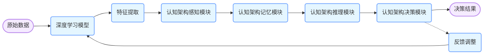

# 认知架构与深度学习的融合研究

> 关键词：认知架构、深度学习、融合、人工智能、知识表示、推理机制、智能系统

> 摘要：本文旨在深入研究认知架构与深度学习的融合问题。首先介绍了认知架构和深度学习的背景知识，包括其目的、预期读者等内容。详细阐述了认知架构与深度学习的核心概念及它们之间的联系，并通过Mermaid流程图和文本示意图进行直观展示。深入讲解了相关核心算法原理，结合Python源代码进行具体说明。探讨了其中涉及的数学模型和公式，并给出举例。通过项目实战展示了融合的代码实现及详细解读。分析了该融合在实际中的应用场景，推荐了相关的学习资源、开发工具框架以及论文著作。最后总结了未来的发展趋势与挑战，还提供了常见问题解答和扩展阅读参考资料，为认知架构与深度学习的融合研究提供全面而深入的参考。

## 1. 背景介绍 
### 1.1 目的和范围
认知架构与深度学习的融合研究具有重要的理论和实践意义。从理论层面看，认知架构强调对人类认知过程的建模和模拟，包括感知、注意力、记忆、推理等多个方面；而深度学习则在模式识别、特征提取等方面展现出强大的能力。将两者融合可以综合它们的优势，构建更加智能、高效、灵活的人工智能系统。从实践角度，这种融合可以应用于自然语言处理、计算机视觉、机器人等多个领域，提升系统的性能和表现。本研究的范围涵盖了认知架构和深度学习的基本概念、核心算法、数学模型，以及它们在实际项目中的融合应用。

### 1.2 预期读者
本文预期读者包括人工智能领域的研究人员、开发者、学生等。对于研究人员，本文可以为他们的科研工作提供新的思路和方法，促进相关理论的进一步发展；对于开发者，能够帮助他们在实际项目中更好地应用认知架构与深度学习的融合技术，提升系统的智能水平；对于学生，有助于他们深入理解人工智能领域的前沿知识，拓宽专业视野。

### 1.3 文档结构概述
本文首先介绍认知架构和深度学习的背景知识，包括术语定义等内容。接着阐述核心概念及它们之间的联系，通过可视化方式呈现。然后讲解核心算法原理和具体操作步骤，结合Python代码详细说明。再探讨相关的数学模型和公式，并举例说明。之后通过项目实战展示融合的具体实现和代码解读。分析实际应用场景，推荐相关的工具和资源。最后总结未来发展趋势与挑战，提供常见问题解答和扩展阅读参考资料。

### 1.4 术语表
#### 1.4.1 核心术语定义
- **认知架构**：是对人类认知过程进行抽象和建模的一种框架，旨在模拟人类的感知、思维、决策等认知能力，通常包含知识表示、推理机制、记忆系统等组件。
- **深度学习**：是机器学习的一个分支领域，通过构建多层神经网络模型，自动从大量数据中学习特征和模式，以实现分类、回归、生成等任务。
- **融合**：指将认知架构和深度学习的方法、技术、模型等有机结合，使它们相互补充、协同工作，以实现更强大的智能系统。

#### 1.4.2 相关概念解释
- **知识表示**：是指将人类的知识以计算机能够理解和处理的方式进行表示，常见的知识表示方法包括逻辑表示、语义网络、框架表示等。
- **推理机制**：是指在知识表示的基础上，根据一定的规则和算法进行推理和决策的过程，常见的推理方法包括演绎推理、归纳推理、类比推理等。
- **神经网络**：是一种模仿人类神经系统的计算模型，由大量的神经元组成，通过神经元之间的连接和权重调整来实现信息的处理和学习。

#### 1.4.3 缩略词列表
- **ANN**：Artificial Neural Network，人工神经网络
- **CNN**：Convolutional Neural Network，卷积神经网络
- **RNN**：Recurrent Neural Network，循环神经网络
- **LSTM**：Long Short-Term Memory，长短期记忆网络

## 2. 核心概念与联系 

### 认知架构的核心概念
认知架构试图模拟人类的认知过程，其核心组件包括感知模块、记忆模块、推理模块和决策模块。感知模块负责接收外界信息，如视觉、听觉等；记忆模块用于存储和管理知识和经验；推理模块根据已有的知识和信息进行逻辑推理和问题求解；决策模块根据推理结果做出决策和行动。

### 深度学习的核心概念
深度学习基于神经网络模型，通过多层神经元的非线性变换来学习数据的特征和模式。常见的深度学习模型包括卷积神经网络（CNN）用于图像识别，循环神经网络（RNN）及其变体如长短期记忆网络（LSTM）用于处理序列数据，如自然语言处理中的文本分析。

### 两者的联系
认知架构和深度学习有着紧密的联系。深度学习可以为认知架构提供强大的感知能力，例如通过CNN对图像进行准确的分类和识别，为认知架构的感知模块提供更准确的信息。而认知架构的推理和决策机制可以为深度学习提供更高层次的指导和约束，帮助深度学习模型更好地理解数据的语义和上下文信息。例如，在自然语言处理中，认知架构的知识表示和推理可以帮助深度学习模型更好地理解文本的含义，提高语言处理的准确性。

### 文本示意图
认知架构与深度学习的融合可以表示为一个多层次的结构。底层是深度学习模型，负责处理原始数据，提取特征。中间层是认知架构的感知和记忆模块，接收深度学习模型提取的特征，并进行知识的存储和管理。上层是认知架构的推理和决策模块，根据中间层的知识进行推理和决策，同时将决策结果反馈给底层的深度学习模型进行调整和优化。

### Mermaid流程图


## 3. 核心算法原理 & 具体操作步骤 

### 深度学习算法原理
以卷积神经网络（CNN）为例，其核心思想是通过卷积层、池化层和全连接层的组合来提取图像的特征。卷积层通过卷积核在图像上滑动，进行卷积操作，提取图像的局部特征。池化层用于对卷积层的输出进行下采样，减少数据量，同时保留重要的特征信息。全连接层将池化层的输出进行展开，连接到多个神经元，进行分类或回归任务。

以下是一个简单的Python代码示例，使用PyTorch框架实现一个简单的CNN模型：
```python
import torch
import torch.nn as nn
import torch.optim as optim

# 定义CNN模型
class SimpleCNN(nn.Module):
    def __init__(self):
        super(SimpleCNN, self).__init__()
        self.conv1 = nn.Conv2d(3, 16, kernel_size=3, padding=1)
        self.relu1 = nn.ReLU()
        self.pool1 = nn.MaxPool2d(kernel_size=2, stride=2)
        self.conv2 = nn.Conv2d(16, 32, kernel_size=3, padding=1)
        self.relu2 = nn.ReLU()
        self.pool2 = nn.MaxPool2d(kernel_size=2, stride=2)
        self.fc1 = nn.Linear(32 * 8 * 8, 128)
        self.relu3 = nn.ReLU()
        self.fc2 = nn.Linear(128, 10)

    def forward(self, x):
        x = self.pool1(self.relu1(self.conv1(x)))
        x = self.pool2(self.relu2(self.conv2(x)))
        x = x.view(-1, 32 * 8 * 8)
        x = self.relu3(self.fc1(x))
        x = self.fc2(x)
        return x

# 初始化模型、损失函数和优化器
model = SimpleCNN()
criterion = nn.CrossEntropyLoss()
optimizer = optim.SGD(model.parameters(), lr=0.001, momentum=0.9)

# 训练模型
def train_model(model, train_loader, criterion, optimizer, epochs):
    for epoch in range(epochs):
        running_loss = 0.0
        for i, data in enumerate(train_loader, 0):
            inputs, labels = data
            optimizer.zero_grad()
            outputs = model(inputs)
            loss = criterion(outputs, labels)
            loss.backward()
            optimizer.step()
            running_loss += loss.item()
        print(f'Epoch {epoch + 1}, Loss: {running_loss / len(train_loader)}')
```

### 认知架构的推理算法原理
认知架构的推理算法通常基于规则或逻辑进行。例如，基于产生式规则的推理系统，通过匹配规则的前提条件和事实库中的事实，触发相应的规则动作，进行推理和决策。

以下是一个简单的Python代码示例，实现一个基于产生式规则的推理系统：
```python
# 定义规则类
class Rule:
    def __init__(self, antecedent, consequent):
        self.antecedent = antecedent
        self.consequent = consequent

    def match(self, facts):
        for condition in self.antecedent:
            if condition not in facts:
                return False
        return True

# 定义推理引擎类
class InferenceEngine:
    def __init__(self, rules):
        self.rules = rules

    def infer(self, facts):
        new_facts = set(facts)
        while True:
            triggered = False
            for rule in self.rules:
                if rule.match(new_facts) and rule.consequent not in new_facts:
                    new_facts.add(rule.consequent)
                    triggered = True
            if not triggered:
                break
        return new_facts

# 示例规则和事实
rules = [
    Rule(['A', 'B'], 'C'),
    Rule(['C'], 'D')
]
facts = {'A', 'B'}

# 初始化推理引擎并进行推理
engine = InferenceEngine(rules)
result = engine.infer(facts)
print(result)
```

### 融合算法的具体操作步骤
1. **数据预处理**：对原始数据进行清洗、归一化等处理，使其适合深度学习模型的输入。
2. **深度学习特征提取**：使用深度学习模型对预处理后的数据进行特征提取。
3. **特征传递与知识表示**：将深度学习提取的特征传递给认知架构的感知模块，进行知识表示和存储。
4. **认知推理与决策**：认知架构的推理模块根据知识表示进行推理，决策模块做出决策。
5. **反馈调整**：将决策结果反馈给深度学习模型，调整模型的参数，提高模型的性能。

## 4. 数学模型和公式 & 详细讲解 & 举例说明 

### 深度学习的数学模型和公式
#### 卷积操作
卷积操作是CNN的核心操作，其数学公式为：
$$
y_{i,j}^l = \sum_{m=0}^{M - 1} \sum_{n=0}^{N - 1} x_{i + m, j + n}^{l - 1} \cdot w_{m,n}^l + b^l
$$
其中，$y_{i,j}^l$ 是第 $l$ 层卷积层的输出特征图中 $(i, j)$ 位置的值，$x_{i + m, j + n}^{l - 1}$ 是第 $l - 1$ 层输入特征图中 $(i + m, j + n)$ 位置的值，$w_{m,n}^l$ 是第 $l$ 层卷积核中 $(m, n)$ 位置的权重，$b^l$ 是第 $l$ 层的偏置，$M$ 和 $N$ 是卷积核的大小。

#### 池化操作
最大池化操作的数学公式为：
$$
y_{i,j}^l = \max_{m = 0}^{M - 1} \max_{n = 0}^{N - 1} x_{i \cdot s + m, j \cdot s + n}^{l - 1}
$$
其中，$y_{i,j}^l$ 是第 $l$ 层池化层的输出特征图中 $(i, j)$ 位置的值，$x_{i \cdot s + m, j \cdot s + n}^{l - 1}$ 是第 $l - 1$ 层输入特征图中 $(i \cdot s + m, j \cdot s + n)$ 位置的值，$s$ 是池化的步长，$M$ 和 $N$ 是池化窗口的大小。

#### 全连接层操作
全连接层的数学公式为：
$$
y_i^l = \sum_{j = 0}^{K - 1} w_{i,j}^l \cdot x_j^{l - 1} + b_i^l
$$
其中，$y_i^l$ 是第 $l$ 层全连接层的第 $i$ 个神经元的输出，$x_j^{l - 1}$ 是第 $l - 1$ 层的第 $j$ 个神经元的输出，$w_{i,j}^l$ 是第 $l$ 层第 $i$ 个神经元与第 $l - 1$ 层第 $j$ 个神经元之间的权重，$b_i^l$ 是第 $l$ 层第 $i$ 个神经元的偏置，$K$ 是第 $l - 1$ 层神经元的数量。

### 认知架构的数学模型和公式
#### 产生式规则推理
产生式规则可以表示为 $P \to Q$，其中 $P$ 是前提条件，$Q$ 是结论。推理过程可以用逻辑公式表示为：
$$
\forall x (P(x) \to Q(x)) \land P(a) \Rightarrow Q(a)
$$
其中，$\forall x$ 表示对于所有的 $x$，$P(x)$ 是前提条件，$Q(x)$ 是结论，$a$ 是具体的事实。

### 举例说明
#### 深度学习举例
假设有一个 $3 \times 3$ 的输入图像，其像素值矩阵为：
$$
X = 
\begin{bmatrix}
1 & 2 & 3 \\
4 & 5 & 6 \\
7 & 8 & 9
\end{bmatrix}
$$
使用一个 $2 \times 2$ 的卷积核，其权重矩阵为：
$$
W = 
\begin{bmatrix}
1 & 0 \\
0 & 1
\end{bmatrix}
$$
偏置 $b = 0$，步长为 1。则卷积操作的计算过程如下：
对于输出特征图的第一个元素：
$$
y_{0,0} = \sum_{m = 0}^{1} \sum_{n = 0}^{1} x_{0 + m, 0 + n} \cdot w_{m,n} + b = 1 \times 1 + 2 \times 0 + 4 \times 0 + 5 \times 1 + 0 = 6
$$
依次计算其他元素，得到输出特征图。

#### 认知架构举例
假设有规则 $P \to Q$，已知事实 $P$ 成立。根据产生式规则推理公式，可得结论 $Q$ 成立。

## 5. 项目实战：代码实际案例和详细解释说明 

### 5.1  开发环境搭建
#### 安装Python
首先需要安装Python环境，建议使用Python 3.7及以上版本。可以从Python官方网站（https://www.python.org/downloads/） 下载并安装。

#### 安装深度学习框架
这里以PyTorch为例，可以使用以下命令安装：
```sh
pip install torch torchvision
```

#### 安装其他必要的库
还需要安装一些其他的库，如`numpy`、`matplotlib`等，可以使用以下命令安装：
```sh
pip install numpy matplotlib
```

### 5.2  源代码详细实现和代码解读
#### 项目概述
本项目实现一个简单的图像分类系统，将认知架构与深度学习进行融合。深度学习部分使用CNN进行图像特征提取，认知架构部分使用基于规则的推理系统进行决策。

#### 代码实现
```python
import torch
import torch.nn as nn
import torch.optim as optim
from torchvision import datasets, transforms

# 定义CNN模型
class SimpleCNN(nn.Module):
    def __init__(self):
        super(SimpleCNN, self).__init__()
        self.conv1 = nn.Conv2d(1, 16, kernel_size=3, padding=1)
        self.relu1 = nn.ReLU()
        self.pool1 = nn.MaxPool2d(kernel_size=2, stride=2)
        self.conv2 = nn.Conv2d(16, 32, kernel_size=3, padding=1)
        self.relu2 = nn.ReLU()
        self.pool2 = nn.MaxPool2d(kernel_size=2, stride=2)
        self.fc1 = nn.Linear(32 * 7 * 7, 128)
        self.relu3 = nn.ReLU()
        self.fc2 = nn.Linear(128, 10)

    def forward(self, x):
        x = self.pool1(self.relu1(self.conv1(x)))
        x = self.pool2(self.relu2(self.conv2(x)))
        x = x.view(-1, 32 * 7 * 7)
        x = self.relu3(self.fc1(x))
        x = self.fc2(x)
        return x

# 定义规则类
class Rule:
    def __init__(self, antecedent, consequent):
        self.antecedent = antecedent
        self.consequent = consequent

    def match(self, facts):
        for condition in self.antecedent:
            if condition not in facts:
                return False
        return True

# 定义推理引擎类
class InferenceEngine:
    def __init__(self, rules):
        self.rules = rules

    def infer(self, facts):
        new_facts = set(facts)
        while True:
            triggered = False
            for rule in self.rules:
                if rule.match(new_facts) and rule.consequent not in new_facts:
                    new_facts.add(rule.consequent)
                    triggered = True
            if not triggered:
                break
        return new_facts

# 数据预处理
transform = transforms.Compose([
    transforms.ToTensor(),
    transforms.Normalize((0.1307,), (0.3081,))
])

# 加载数据集
train_dataset = datasets.MNIST('data', train=True, download=True, transform=transform)
train_loader = torch.utils.data.DataLoader(train_dataset, batch_size=64, shuffle=True)

# 初始化模型、损失函数和优化器
model = SimpleCNN()
criterion = nn.CrossEntropyLoss()
optimizer = optim.SGD(model.parameters(), lr=0.001, momentum=0.9)

# 训练模型
def train_model(model, train_loader, criterion, optimizer, epochs):
    for epoch in range(epochs):
        running_loss = 0.0
        for i, data in enumerate(train_loader, 0):
            inputs, labels = data
            optimizer.zero_grad()
            outputs = model(inputs)
            loss = criterion(outputs, labels)
            loss.backward()
            optimizer.step()
            running_loss += loss.item()
        print(f'Epoch {epoch + 1}, Loss: {running_loss / len(train_loader)}')

# 训练模型
train_model(model, train_loader, criterion, optimizer, epochs=5)

# 示例规则和事实
rules = [
    Rule(['prediction_0'], 'class_0'),
    Rule(['prediction_1'], 'class_1'),
    # 其他规则...
]

# 进行推理
test_dataset = datasets.MNIST('data', train=False, download=True, transform=transform)
test_loader = torch.utils.data.DataLoader(test_dataset, batch_size=1, shuffle=False)

engine = InferenceEngine(rules)
for data in test_loader:
    inputs, _ = data
    outputs = model(inputs)
    _, predicted = torch.max(outputs.data, 1)
    prediction_fact = f'prediction_{predicted.item()}'
    result = engine.infer({prediction_fact})
    print(result)
```

### 5.3  代码解读与分析
#### 深度学习部分
- `SimpleCNN` 类定义了一个简单的CNN模型，包含卷积层、池化层和全连接层。
- `train_model` 函数用于训练CNN模型，使用交叉熵损失函数和随机梯度下降优化器。

#### 认知架构部分
- `Rule` 类定义了产生式规则，包含前提条件和结论。
- `InferenceEngine` 类实现了基于规则的推理引擎，通过匹配规则的前提条件和事实库中的事实，触发相应的规则动作，进行推理和决策。

#### 融合部分
在训练完CNN模型后，将模型的预测结果作为事实传递给认知架构的推理引擎，推理引擎根据规则进行推理，得到最终的分类结果。

## 6. 实际应用场景 
### 自然语言处理
在自然语言处理中，认知架构与深度学习的融合可以提升语言理解和生成的能力。深度学习模型可以用于提取文本的特征和模式，如词向量、句子表示等；而认知架构的知识表示和推理机制可以帮助理解文本的语义和上下文信息，进行语义推理和语用分析。例如，在智能客服系统中，深度学习模型可以对用户的问题进行分类和意图识别，认知架构可以根据知识库中的知识进行推理和回答生成，提高客服系统的智能水平。

### 计算机视觉
在计算机视觉领域，这种融合可以提高图像和视频的理解和分析能力。深度学习的卷积神经网络可以对图像进行特征提取和分类，认知架构可以结合先验知识和场景信息，对图像中的对象进行语义理解和推理。例如，在自动驾驶系统中，深度学习模型可以识别道路、车辆、行人等对象，认知架构可以根据交通规则和环境信息进行决策和规划，确保自动驾驶的安全性和可靠性。

### 机器人
在机器人领域，认知架构与深度学习的融合可以使机器人具有更强的感知、决策和行动能力。深度学习可以用于机器人的视觉、听觉等感知模块，提取环境信息；认知架构可以对感知信息进行处理和推理，制定行动策略。例如，在服务机器人中，深度学习模型可以识别用户的手势和表情，认知架构可以根据用户的需求和场景信息进行任务规划和动作执行，提供更加个性化的服务。

## 7. 工具和资源推荐
### 7.1 学习资源推荐
#### 7.1.1 书籍推荐
- 《深度学习》（Deep Learning）：由Ian Goodfellow、Yoshua Bengio和Aaron Courville所著，是深度学习领域的经典教材，全面介绍了深度学习的基本概念、算法和应用。
- 《人工智能：一种现代的方法》（Artificial Intelligence: A Modern Approach）：由Stuart Russell和Peter Norvig所著，是人工智能领域的权威书籍，涵盖了人工智能的各个方面，包括认知架构、机器学习、自然语言处理等。
- 《Python深度学习》（Deep Learning with Python）：由Francois Chollet所著，介绍了如何使用Python和Keras框架进行深度学习开发，适合初学者入门。

#### 7.1.2 在线课程
- Coursera上的“深度学习专项课程”（Deep Learning Specialization）：由Andrew Ng教授授课，包括深度学习基础、卷积神经网络、循环神经网络等多个课程，内容丰富，讲解详细。
- edX上的“人工智能导论”（Introduction to Artificial Intelligence）：由麻省理工学院（MIT）提供，介绍了人工智能的基本概念、算法和应用，是学习人工智能的入门课程。
- 哔哩哔哩（Bilibili）上有许多关于深度学习和认知架构的教程视频，如“李宏毅机器学习”等，适合初学者学习。

#### 7.1.3 技术博客和网站
- Medium：是一个技术博客平台，上面有许多关于深度学习、认知架构等领域的优秀文章，可以关注一些知名的作者和博客，获取最新的技术动态和研究成果。
- arXiv：是一个预印本平台，提供了大量的学术论文，包括深度学习、认知架构等领域的最新研究成果，可以及时了解该领域的前沿技术。
- 机器之心：是一个专注于人工智能领域的媒体平台，提供了丰富的技术文章、行业资讯和研究报告，对了解人工智能的发展趋势和应用场景有很大的帮助。

### 7.2 开发工具框架推荐
#### 7.2.1 IDE和编辑器
- PyCharm：是一款专门为Python开发设计的集成开发环境（IDE），具有代码编辑、调试、版本控制等功能，支持多种Python框架，是Python开发者的首选工具之一。
- Jupyter Notebook：是一个交互式的开发环境，支持多种编程语言，适合进行数据分析、模型训练和实验验证。可以在浏览器中直接编写代码、运行代码、查看结果，方便快捷。
- Visual Studio Code：是一款轻量级的代码编辑器，支持多种编程语言和插件扩展，具有丰富的功能和良好的用户体验。可以通过安装Python插件来进行Python开发。

#### 7.2.2 调试和性能分析工具
- TensorBoard：是TensorFlow框架提供的一个可视化工具，可以用于可视化模型的训练过程、损失函数变化、模型结构等信息，帮助开发者调试和优化模型。
- PyTorch Profiler：是PyTorch框架提供的性能分析工具，可以用于分析模型的性能瓶颈、计算时间、内存使用等信息，帮助开发者优化模型的性能。
- cProfile：是Python内置的性能分析工具，可以用于分析Python代码的性能瓶颈，找出运行时间较长的函数和代码段，进行优化。

#### 7.2.3 相关框架和库
- PyTorch：是一个开源的深度学习框架，具有动态图、易于使用、高效等特点，被广泛应用于学术界和工业界。
- TensorFlow：是一个开源的深度学习框架，具有强大的分布式计算能力和丰富的工具集，被广泛应用于大规模的深度学习项目。
- Keras：是一个高级神经网络API，基于TensorFlow、Theano等后端框架，提供了简单易用的接口，适合快速搭建和训练深度学习模型。

### 7.3 相关论文著作推荐
#### 7.3.1 经典论文
- “Gradient-based learning applied to document recognition”：由Yann LeCun等人发表，介绍了卷积神经网络（CNN）的基本原理和应用，是CNN领域的经典论文。
- “Long Short-Term Memory”：由Sepp Hochreiter和Jürgen Schmidhuber发表，介绍了长短期记忆网络（LSTM）的基本原理和应用，是循环神经网络领域的经典论文。
- “A Neural Probabilistic Language Model”：由Yoshua Bengio等人发表，介绍了神经网络语言模型的基本原理和应用，是自然语言处理领域的经典论文。

#### 7.3.2 最新研究成果
- 关注arXiv上关于认知架构与深度学习融合的最新研究论文，了解该领域的前沿技术和发展趋势。
- 关注顶级学术会议如NeurIPS（神经信息处理系统大会）、ICML（国际机器学习会议）、CVPR（计算机视觉与模式识别会议）等上的相关研究成果。

#### 7.3.3 应用案例分析
- 研究一些实际应用案例，如自动驾驶、智能医疗、智能客服等领域中认知架构与深度学习融合的应用案例，了解该技术在实际场景中的应用方法和效果。

## 8. 总结：未来发展趋势与挑战
### 未来发展趋势
#### 更加智能的系统
认知架构与深度学习的融合将使人工智能系统更加智能，能够更好地理解和处理复杂的信息，实现更高层次的认知和决策能力。例如，在智能机器人领域，融合系统可以使机器人更好地理解人类的意图和需求，提供更加个性化的服务。

#### 跨领域应用
这种融合技术将在更多的领域得到应用，如金融、医疗、教育等。在金融领域，融合系统可以用于风险评估、投资决策等；在医疗领域，可以用于疾病诊断、治疗方案推荐等；在教育领域，可以用于智能教学、个性化学习等。

#### 与其他技术的融合
认知架构与深度学习将与其他技术如物联网、区块链、量子计算等进行融合，创造出更加复杂和强大的智能系统。例如，与物联网结合可以实现对物理世界的实时感知和控制；与区块链结合可以提高数据的安全性和可信度。

### 挑战
#### 理论基础不完善
目前，认知架构与深度学习的融合还缺乏完善的理论基础，对于两者之间的协同机制、融合方法等还需要进一步的研究和探索。

#### 计算资源需求大
深度学习模型通常需要大量的计算资源和数据，认知架构的推理和决策过程也需要一定的计算资源，这使得融合系统的实现面临计算资源的挑战。

#### 可解释性问题
深度学习模型通常被认为是“黑盒”模型，缺乏可解释性，而认知架构的推理过程也需要一定的解释性。如何提高融合系统的可解释性，是一个亟待解决的问题。

## 9. 附录：常见问题与解答
### 问题1：认知架构和深度学习的融合有什么优势？
答：认知架构和深度学习的融合可以综合它们的优势。深度学习在模式识别、特征提取等方面具有强大的能力，可以为认知架构提供更准确的感知信息；而认知架构的知识表示和推理机制可以为深度学习提供更高层次的指导和约束，帮助深度学习模型更好地理解数据的语义和上下文信息，提高系统的智能水平和决策能力。

### 问题2：如何选择合适的深度学习模型和认知架构？
答：选择合适的深度学习模型和认知架构需要考虑具体的应用场景和任务需求。对于图像识别任务，可以选择卷积神经网络（CNN）等深度学习模型；对于序列数据处理任务，可以选择循环神经网络（RNN）及其变体如长短期记忆网络（LSTM）等。对于认知架构，可以根据任务的复杂程度和知识表示的需求选择合适的架构，如基于规则的认知架构、基于逻辑的认知架构等。

### 问题3：融合系统的训练和优化有哪些挑战？
答：融合系统的训练和优化面临以下挑战：一是深度学习模型的训练需要大量的计算资源和数据，如何有效地利用资源和数据是一个问题；二是认知架构的推理和决策过程需要与深度学习模型进行协同训练和优化，如何协调两者之间的关系是一个挑战；三是融合系统的可解释性问题，如何在训练和优化过程中提高系统的可解释性也是一个需要解决的问题。

## 10. 扩展阅读 & 参考资料
- 《人工智能及其应用》，蔡自兴，徐光祐 编著
- 《神经网络与深度学习》，邱锡鹏 著
- 《认知科学导论》，马文·明斯基 著
- https://pytorch.org/
- https://www.tensorflow.org/
- https://arxiv.org/

作者：AI天才研究院/AI Genius Institute & 禅与计算机程序设计艺术 /Zen And The Art of Computer Programming