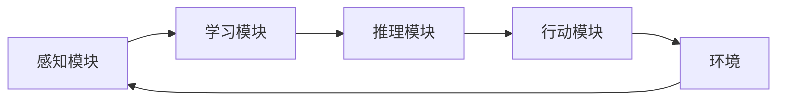

# 认知架构：模拟人类思维的AI Agent设计

> 关键词：认知架构、AI Agent、人类思维模拟、人工智能、智能体设计、认知模型、机器学习

> 摘要：本文聚焦于认知架构下模拟人类思维的AI Agent设计。首先介绍了相关背景，包括目的范围、预期读者等内容。接着阐述了核心概念与联系，展示了认知架构的原理和架构示意图及流程图。详细讲解了核心算法原理，通过Python代码进行说明，同时给出了数学模型和公式并举例。在项目实战部分，从开发环境搭建到源代码实现及解读进行了全面分析。探讨了实际应用场景，推荐了学习资源、开发工具框架以及相关论文著作。最后总结了未来发展趋势与挑战，还提供了常见问题解答和扩展阅读参考资料，旨在为读者深入理解和设计模拟人类思维的AI Agent提供全面的技术指导。

## 1. 背景介绍 
### 1.1 目的和范围
随着人工智能技术的快速发展，人们对AI的期望不再局限于简单的任务执行，而是希望其能够像人类一样进行思考、学习和决策。认知架构的出现为实现这一目标提供了途径，本文章的目的在于深入探讨如何设计能够模拟人类思维的AI Agent。范围涵盖了认知架构的基本概念、核心算法、数学模型，以及通过实际案例展示如何将这些理论应用到具体的项目开发中，同时分析其在不同领域的应用场景和未来发展趋势。

### 1.2 预期读者
本文预期读者包括人工智能领域的研究人员、开发者、学生，以及对认知架构和模拟人类思维的AI Agent感兴趣的技术爱好者。对于研究人员，文章可以提供新的研究思路和方法；对于开发者，有助于其在实际项目中应用相关技术；对于学生，能够加深对人工智能前沿知识的理解；对于技术爱好者，可以作为了解该领域的入门指南。

### 1.3 文档结构概述
本文将按照以下结构展开：首先介绍核心概念与联系，帮助读者建立对认知架构和AI Agent的基本认识；接着详细讲解核心算法原理和具体操作步骤，通过Python代码进行说明；然后给出数学模型和公式，并举例说明其应用；在项目实战部分，介绍开发环境搭建、源代码实现和代码解读；之后探讨实际应用场景；推荐相关的学习资源、开发工具框架和论文著作；最后总结未来发展趋势与挑战，提供常见问题解答和扩展阅读参考资料。

### 1.4 术语表
#### 1.4.1 核心术语定义
- **认知架构**：是一种描述智能体如何组织其知识、感知、学习、推理和行动的框架，旨在模拟人类的认知过程。
- **AI Agent**：即人工智能智能体，是能够感知环境、做出决策并采取行动以实现特定目标的实体。
- **人类思维模拟**：指通过技术手段使AI Agent具备类似于人类的思考、学习、推理和决策能力。

#### 1.4.2 相关概念解释
- **感知**：AI Agent通过传感器或其他方式获取环境信息的过程。
- **学习**：AI Agent根据获取的信息调整自身行为和知识的过程，包括监督学习、无监督学习和强化学习等。
- **推理**：AI Agent利用已有的知识和规则进行逻辑推导，得出新的结论或决策的过程。
- **行动**：AI Agent根据推理结果在环境中执行相应操作的过程。

#### 1.4.3 缩略词列表
- **AI**：Artificial Intelligence，人工智能
- **ML**：Machine Learning，机器学习
- **RL**：Reinforcement Learning，强化学习

## 2. 核心概念与联系 
### 核心概念原理
认知架构的核心原理是模仿人类的认知过程，将其分解为多个模块，包括感知、学习、推理和行动等。感知模块负责收集环境信息，学习模块根据这些信息更新知识和模型，推理模块利用知识进行决策，行动模块执行决策结果。这些模块相互协作，形成一个闭环系统，使AI Agent能够在不断变化的环境中适应和学习。

### 架构的文本示意图
```plaintext
+-------------------+
|    感知模块       |
|  (获取环境信息)   |
+-------------------+
        |
        v
+-------------------+
|    学习模块       |
|  (更新知识模型)   |
+-------------------+
        |
        v
+-------------------+
|    推理模块       |
|  (进行决策制定)   |
+-------------------+
        |
        v
+-------------------+
|    行动模块       |
|  (执行决策行动)   |
+-------------------+
        |
        v
|       环境        |
```

### Mermaid流程图


## 3. 核心算法原理 & 具体操作步骤 
### 核心算法原理
在模拟人类思维的AI Agent设计中，常用的算法包括机器学习算法（如神经网络、决策树等）和强化学习算法（如Q-learning、Deep Q-Networks等）。这里以Q-learning算法为例进行详细讲解。

Q-learning是一种无模型的强化学习算法，其核心思想是通过学习一个动作价值函数 $Q(s, a)$ 来确定在状态 $s$ 下采取动作 $a$ 的价值。智能体在每个时间步根据当前状态选择动作，执行动作后获得奖励和新的状态，然后根据奖励和新状态更新 $Q$ 值。

### 具体操作步骤
1. **初始化**：初始化 $Q$ 表，将所有状态-动作对的 $Q$ 值初始化为0。
2. **选择动作**：根据当前状态 $s$ 和 $Q$ 表，使用某种策略（如 $\epsilon$-贪心策略）选择一个动作 $a$。
3. **执行动作**：执行选择的动作 $a$，观察环境反馈的奖励 $r$ 和新的状态 $s'$。
4. **更新 $Q$ 值**：根据以下公式更新 $Q(s, a)$ 的值：
   $$Q(s, a) = Q(s, a) + \alpha [r + \gamma \max_{a'} Q(s', a') - Q(s, a)]$$
   其中，$\alpha$ 是学习率，$\gamma$ 是折扣因子。
5. **重复步骤2-4**：直到达到终止条件（如达到最大时间步数或完成任务）。

### Python源代码实现
```python
import numpy as np

# 定义Q-learning类
class QLearningAgent:
    def __init__(self, state_space_size, action_space_size, learning_rate=0.1, discount_factor=0.9, epsilon=0.1):
        self.state_space_size = state_space_size
        self.action_space_size = action_space_size
        self.learning_rate = learning_rate
        self.discount_factor = discount_factor
        self.epsilon = epsilon
        # 初始化Q表
        self.q_table = np.zeros((state_space_size, action_space_size))

    def choose_action(self, state):
        # epsilon-贪心策略
        if np.random.uniform(0, 1) < self.epsilon:
            # 探索：随机选择动作
            action = np.random.choice(self.action_space_size)
        else:
            # 利用：选择Q值最大的动作
            action = np.argmax(self.q_table[state, :])
        return action

    def update_q_table(self, state, action, reward, next_state):
        # 更新Q值
        max_q_next = np.max(self.q_table[next_state, :])
        self.q_table[state, action] = self.q_table[state, action] + self.learning_rate * (
                reward + self.discount_factor * max_q_next - self.q_table[state, action])


# 示例使用
if __name__ == "__main__":
    state_space_size = 5
    action_space_size = 3
    agent = QLearningAgent(state_space_size, action_space_size)

    current_state = 0
    for _ in range(10):
        action = agent.choose_action(current_state)
        # 模拟环境反馈
        next_state = np.random.randint(0, state_space_size)
        reward = np.random.randint(-1, 2)
        agent.update_q_table(current_state, action, reward, next_state)
        current_state = next_state
```

## 4. 数学模型和公式 & 详细讲解 & 举例说明 
### 数学模型和公式
#### Q-learning公式
在Q-learning算法中，核心公式为：
$$Q(s, a) = Q(s, a) + \alpha [r + \gamma \max_{a'} Q(s', a') - Q(s, a)]$$
其中：
- $Q(s, a)$ 表示在状态 $s$ 下采取动作 $a$ 的动作价值。
- $\alpha$ 是学习率，控制每次更新时 $Q$ 值的调整幅度，取值范围通常在 $[0, 1]$ 之间。$\alpha$ 越大，更新越快，但可能会导致不稳定；$\alpha$ 越小，更新越慢，但更稳定。
- $r$ 是执行动作 $a$ 后获得的即时奖励。
- $\gamma$ 是折扣因子，取值范围在 $[0, 1]$ 之间，用于权衡即时奖励和未来奖励的重要性。$\gamma$ 越接近1，智能体越关注未来奖励；$\gamma$ 越接近0，智能体越关注即时奖励。
- $\max_{a'} Q(s', a')$ 表示在新状态 $s'$ 下所有可能动作的最大 $Q$ 值。

### 详细讲解
- **更新原理**：公式的核心思想是根据即时奖励 $r$ 和未来可能获得的最大奖励 $\gamma \max_{a'} Q(s', a')$ 来更新当前状态-动作对的 $Q$ 值。$r + \gamma \max_{a'} Q(s', a')$ 被称为目标 $Q$ 值，$Q(s, a)$ 是当前的 $Q$ 值，两者的差值乘以学习率 $\alpha$ 就是本次更新的幅度。
- **学习率的作用**：学习率 $\alpha$ 决定了每次更新时对目标 $Q$ 值的信任程度。如果 $\alpha$ 较大，智能体更倾向于相信新的经验，快速调整 $Q$ 值；如果 $\alpha$ 较小，智能体则更依赖于之前的经验，更新速度较慢。
- **折扣因子的作用**：折扣因子 $\gamma$ 体现了智能体对未来奖励的重视程度。当 $\gamma = 0$ 时，智能体只关注即时奖励；当 $\gamma = 1$ 时，智能体将未来所有奖励视为同等重要。

### 举例说明
假设一个简单的环境，有3个状态（$s_0, s_1, s_2$）和2个动作（$a_0, a_1$），初始 $Q$ 表如下：

| State | $a_0$ | $a_1$ |
|-------|-------|-------|
| $s_0$ | 0     | 0     |
| $s_1$ | 0     | 0     |
| $s_2$ | 0     | 0     |

当前状态 $s = s_0$，选择动作 $a = a_0$，执行动作后获得奖励 $r = 1$，新状态 $s' = s_1$。假设学习率 $\alpha = 0.1$，折扣因子 $\gamma = 0.9$。

在状态 $s_1$ 下，$\max_{a'} Q(s_1, a') = 0$（因为初始 $Q$ 值都为0）。

根据Q-learning公式更新 $Q(s_0, a_0)$：
$$Q(s_0, a_0) = Q(s_0, a_0) + \alpha [r + \gamma \max_{a'} Q(s_1, a') - Q(s_0, a_0)]$$
$$= 0 + 0.1 \times [1 + 0.9 \times 0 - 0] = 0.1$$

更新后的 $Q$ 表如下：

| State | $a_0$ | $a_1$ |
|-------|-------|-------|
| $s_0$ | 0.1   | 0     |
| $s_1$ | 0     | 0     |
| $s_2$ | 0     | 0     |

## 5. 项目实战：代码实际案例和详细解释说明 
### 5.1  开发环境搭建
#### 操作系统
可以选择常见的操作系统，如Windows、Linux（如Ubuntu）或macOS。本文以Ubuntu 20.04为例进行说明。

#### Python环境
安装Python 3.7及以上版本。可以使用以下命令进行安装：
```bash
sudo apt update
sudo apt install python3 python3-pip
```

#### 依赖库安装
在本项目中，需要安装NumPy库，用于数值计算。可以使用以下命令进行安装：
```bash
pip3 install numpy
```

### 5.2  源代码详细实现和代码解读
```python
import numpy as np

# 定义Q-learning类
class QLearningAgent:
    def __init__(self, state_space_size, action_space_size, learning_rate=0.1, discount_factor=0.9, epsilon=0.1):
        # 初始化状态空间大小
        self.state_space_size = state_space_size
        # 初始化动作空间大小
        self.action_space_size = action_space_size
        # 初始化学习率
        self.learning_rate = learning_rate
        # 初始化折扣因子
        self.discount_factor = discount_factor
        # 初始化探索率
        self.epsilon = epsilon
        # 初始化Q表，将所有状态-动作对的Q值初始化为0
        self.q_table = np.zeros((state_space_size, action_space_size))

    def choose_action(self, state):
        # epsilon-贪心策略
        if np.random.uniform(0, 1) < self.epsilon:
            # 探索：随机选择动作
            action = np.random.choice(self.action_space_size)
        else:
            # 利用：选择Q值最大的动作
            action = np.argmax(self.q_table[state, :])
        return action

    def update_q_table(self, state, action, reward, next_state):
        # 计算下一个状态下所有动作的最大Q值
        max_q_next = np.max(self.q_table[next_state, :])
        # 根据Q-learning公式更新Q值
        self.q_table[state, action] = self.q_table[state, action] + self.learning_rate * (
                reward + self.discount_factor * max_q_next - self.q_table[state, action])


# 定义环境类
class Environment:
    def __init__(self, state_space_size):
        # 初始化状态空间大小
        self.state_space_size = state_space_size
        # 初始化当前状态为随机状态
        self.current_state = np.random.randint(0, state_space_size)

    def step(self, action):
        # 模拟环境状态转移，这里简单地随机转移到下一个状态
        next_state = np.random.randint(0, self.state_space_size)
        # 模拟奖励，这里简单地随机生成一个奖励值
        reward = np.random.randint(-1, 2)
        return next_state, reward


# 主函数
if __name__ == "__main__":
    # 定义状态空间大小
    state_space_size = 5
    # 定义动作空间大小
    action_space_size = 3
    # 创建Q-learning智能体
    agent = QLearningAgent(state_space_size, action_space_size)
    # 创建环境
    env = Environment(state_space_size)
    # 定义训练回合数
    num_episodes = 100

    for episode in range(num_episodes):
        # 重置环境状态
        current_state = env.current_state
        total_reward = 0

        while True:
            # 智能体选择动作
            action = agent.choose_action(current_state)
            # 环境执行动作并返回下一个状态和奖励
            next_state, reward = env.step(action)
            # 智能体更新Q表
            agent.update_q_table(current_state, action, reward, next_state)
            # 累加总奖励
            total_reward += reward
            # 更新当前状态
            current_state = next_state

            # 模拟终止条件，这里简单地设置一个最大步数
            if episode * state_space_size > 100:
                break

        print(f"Episode {episode}: Total Reward = {total_reward}")
```

### 5.3  代码解读与分析
#### QLearningAgent类
- `__init__` 方法：初始化智能体的状态空间大小、动作空间大小、学习率、折扣因子、探索率和Q表。
- `choose_action` 方法：使用 $\epsilon$-贪心策略选择动作。当随机数小于 $\epsilon$ 时，进行探索，随机选择一个动作；否则，进行利用，选择Q值最大的动作。
- `update_q_table` 方法：根据Q-learning公式更新Q表中的Q值。

#### Environment类
- `__init__` 方法：初始化环境的状态空间大小和当前状态。
- `step` 方法：模拟环境的状态转移和奖励反馈，返回下一个状态和奖励。

#### 主函数
- 创建Q-learning智能体和环境。
- 进行多个训练回合，每个回合中智能体与环境交互，选择动作、执行动作、更新Q表，直到达到终止条件。
- 打印每个回合的总奖励，用于观察训练效果。

## 6. 实际应用场景 
### 机器人导航
在机器人导航中，认知架构下的AI Agent可以模拟人类的思维过程，感知周围环境（如障碍物、目标位置等），学习不同环境下的导航策略，通过推理选择最优的行动路径，从而实现自主导航。例如，在室内服务机器人中，AI Agent可以根据实时感知的环境信息，快速调整导航路线，避开障碍物，到达指定的服务地点。

### 游戏智能体
在电子游戏中，AI Agent可以模拟人类玩家的思维方式，感知游戏状态（如对手位置、资源情况等），学习不同游戏场景下的策略，通过推理做出最优的决策。例如，在策略游戏中，AI Agent可以分析局势，制定战略，合理分配资源，与人类玩家进行对抗。

### 医疗诊断辅助
在医疗领域，AI Agent可以模拟医生的思维过程，分析患者的症状、检查结果等信息，学习疾病的诊断规则和模型，通过推理给出可能的诊断结果和治疗建议。例如，在医学影像诊断中，AI Agent可以识别影像中的病变特征，辅助医生进行疾病的早期诊断。

### 金融投资决策
在金融领域，AI Agent可以模拟投资者的思维方式，分析市场数据（如股票价格、宏观经济指标等），学习市场规律和投资策略，通过推理做出投资决策。例如，在股票投资中，AI Agent可以根据市场趋势和公司基本面信息，选择最优的投资组合，降低投资风险。

## 7. 工具和资源推荐
### 7.1 学习资源推荐
#### 7.1.1 书籍推荐
- 《人工智能：一种现代的方法》（Artificial Intelligence: A Modern Approach）：这是人工智能领域的经典教材，全面介绍了人工智能的各个方面，包括搜索算法、知识表示、推理、学习等，对认知架构和AI Agent的设计也有深入的探讨。
- 《强化学习：原理与Python实现》（Reinforcement Learning: An Introduction）：详细介绍了强化学习的基本原理、算法和应用，对于理解Q-learning等算法在AI Agent设计中的应用非常有帮助。
- 《深度学习》（Deep Learning）：介绍了深度学习的基本概念、模型和算法，对于使用神经网络构建AI Agent的认知模型有重要的参考价值。

#### 7.1.2 在线课程
- Coursera上的“人工智能基础”（Fundamentals of Artificial Intelligence）课程：由知名教授授课，系统地介绍了人工智能的基础知识和方法。
- edX上的“强化学习”（Reinforcement Learning）课程：深入讲解了强化学习的理论和实践，提供了丰富的代码示例和实验。
- 吴恩达的“深度学习专项课程”（Deep Learning Specialization）：全面介绍了深度学习的各个方面，包括神经网络、卷积神经网络、循环神经网络等，对于构建AI Agent的感知和学习模块有很大的帮助。

#### 7.1.3 技术博客和网站
- Medium：有许多人工智能领域的专业博客，分享了最新的研究成果、技术应用和实践经验。
- Towards Data Science：专注于数据科学和人工智能领域的技术文章，提供了很多实用的代码示例和案例分析。
- arXiv：是一个预印本平台，发布了大量的人工智能领域的研究论文，可以及时了解最新的研究动态。

### 7.2 开发工具框架推荐
#### 7.2.1 IDE和编辑器
- PyCharm：是一款专门为Python开发设计的集成开发环境，提供了丰富的代码编辑、调试和测试功能，适合开发大型的AI项目。
- Jupyter Notebook：是一个交互式的开发环境，支持Python代码的实时运行和可视化展示，非常适合进行算法实验和数据分析。
- Visual Studio Code：是一款轻量级的代码编辑器，支持多种编程语言和插件扩展，具有良好的代码编辑和调试体验。

#### 7.2.2 调试和性能分析工具
- TensorBoard：是TensorFlow提供的可视化工具，可以用于监控训练过程中的各种指标（如损失函数、准确率等），帮助开发者调试和优化模型。
- Py-Spy：是一个轻量级的Python性能分析工具，可以实时监测Python程序的CPU和内存使用情况，找出性能瓶颈。
- cProfile：是Python标准库中的性能分析模块，可以统计函数的调用次数、执行时间等信息，帮助开发者优化代码性能。

#### 7.2.3 相关框架和库
- TensorFlow：是一个开源的深度学习框架，提供了丰富的神经网络模型和工具，支持分布式训练和部署，广泛应用于AI Agent的开发。
- PyTorch：是另一个流行的深度学习框架，具有动态图的特点，易于使用和调试，适合快速开发和实验。
- Gym：是OpenAI开发的一个开源的强化学习环境库，提供了多种模拟环境和任务，方便开发者进行强化学习算法的测试和验证。

### 7.3 相关论文著作推荐
#### 7.3.1 经典论文
- "Q-learning" by Christopher J. C. H. Watkins and Peter Dayan：首次提出了Q-learning算法，是强化学习领域的经典论文。
- "Playing Atari with Deep Reinforcement Learning" by Volodymyr Mnih et al.：介绍了使用深度Q网络（Deep Q-Networks）在Atari游戏上取得优异成绩的方法，开创了深度强化学习的先河。
- "A Survey of Artificial Intelligence and Cognitive Science" by John McCarthy：对人工智能和认知科学的发展进行了全面的综述，对于理解认知架构的背景和理论基础有重要的参考价值。

#### 7.3.2 最新研究成果
- 在arXiv上搜索“Cognitive Architecture for AI Agents”可以找到许多关于认知架构和AI Agent设计的最新研究论文，关注这些论文可以了解该领域的前沿动态。
- 参加人工智能领域的顶级会议（如NeurIPS、ICML、AAAI等）的会议论文集，这些会议上展示了最新的研究成果和技术突破。

#### 7.3.3 应用案例分析
- 《人工智能应用案例集》：收集了人工智能在各个领域的应用案例，包括机器人、医疗、金融等，对于了解认知架构下的AI Agent在实际应用中的设计和实现有很大的帮助。
- 各大科技公司的技术博客（如Google AI Blog、Facebook AI Research等）会分享他们在AI Agent开发和应用方面的实践经验和案例分析。

## 8. 总结：未来发展趋势与挑战
### 未来发展趋势
#### 融合多种认知能力
未来的AI Agent将不仅仅模拟单一的认知能力，而是融合感知、学习、推理、语言理解、情感分析等多种认知能力，实现更加复杂和智能的行为。例如，能够理解人类的自然语言并进行对话，感知人类的情感状态并做出相应的反应。

#### 与人类更加紧密的协作
AI Agent将与人类进行更加紧密的协作，成为人类的智能助手。在医疗、教育、金融等领域，AI Agent可以与人类专家共同工作，提供决策支持和辅助服务，提高工作效率和质量。

#### 自主进化和自我修复
AI Agent将具备自主进化和自我修复的能力，能够根据环境的变化自动调整自身的认知模型和行为策略，当出现故障或错误时能够自我修复和恢复。

#### 应用于更多领域
随着技术的不断发展，认知架构下的AI Agent将应用于更多的领域，如交通运输、能源管理、环境保护等，为解决复杂的社会问题提供新的解决方案。

### 挑战
#### 认知模型的复杂性
模拟人类思维是一个极其复杂的任务，目前的认知模型还远远不能完全反映人类的认知过程。如何构建更加准确和全面的认知模型，是未来需要解决的重要问题。

#### 数据隐私和安全
AI Agent在运行过程中需要收集和处理大量的数据，涉及到用户的隐私和安全问题。如何确保数据的隐私和安全，防止数据泄露和滥用，是需要关注的重要挑战。

#### 伦理和法律问题
随着AI Agent的智能化程度不断提高，可能会引发一系列的伦理和法律问题，如责任归属、道德决策等。如何制定相应的伦理和法律准则，规范AI Agent的行为，是需要解决的重要问题。

#### 计算资源的需求
构建和训练复杂的认知模型需要大量的计算资源，如高性能的服务器、GPU等。如何降低计算资源的需求，提高算法的效率，是未来需要解决的技术难题。

## 9. 附录：常见问题与解答
### 问题1：认知架构和传统的AI架构有什么区别？
解答：传统的AI架构通常侧重于特定任务的解决，如图像识别、语音识别等，各个模块之间的协作相对简单。而认知架构旨在模拟人类的思维过程，将感知、学习、推理和行动等多个模块有机地结合起来，形成一个闭环系统，能够在复杂的环境中自主学习和适应，实现更加智能和灵活的行为。

### 问题2：Q-learning算法适用于所有的AI Agent设计吗？
解答：Q-learning算法是一种简单而有效的强化学习算法，但并不适用于所有的AI Agent设计。它适用于状态空间和动作空间相对较小、奖励反馈明确的环境。对于状态空间和动作空间非常大的复杂环境，Q-learning算法可能会面临维度灾难的问题，需要使用更高级的算法，如深度Q网络（Deep Q-Networks）等。

### 问题3：如何评估一个AI Agent的性能？
解答：评估AI Agent的性能可以从多个方面进行，如任务完成率、奖励累积值、决策的准确性和效率等。对于不同的应用场景，评估指标也会有所不同。例如，在机器人导航中，可以评估机器人到达目标位置的成功率和时间；在游戏智能体中，可以评估智能体的胜率和得分。

### 问题4：如何提高AI Agent的学习效率？
解答：可以从以下几个方面提高AI Agent的学习效率：
- 选择合适的算法：根据具体的应用场景选择合适的学习算法，如对于复杂的环境可以使用深度学习算法。
- 优化参数：调整学习率、折扣因子等参数，找到最优的参数组合。
- 增加数据量：提供更多的训练数据，让AI Agent学习到更多的经验。
- 采用并行计算：使用多核处理器或GPU进行并行计算，加快训练速度。

## 10. 扩展阅读 & 参考资料
### 扩展阅读
- 《思考，快与慢》（Thinking, Fast and Slow）：这本书介绍了人类思维的两种模式——快思考和慢思考，对于理解人类的认知过程和如何模拟人类思维有很大的启发。
- 《人类的本质》（The Human Instinct）：探讨了人类的本质和认知能力的进化，为AI Agent的设计提供了生物学和心理学的视角。
- 《奇点临近》（The Singularity Is Near）：讨论了人工智能的发展趋势和未来可能带来的影响，引发读者对AI Agent未来发展的深入思考。

### 参考资料
- 相关的学术论文和研究报告，如在IEEE Xplore、ACM Digital Library等数据库中搜索关于认知架构和AI Agent设计的论文。
- 开源项目和代码库，如GitHub上的相关项目，可以参考和学习他人的实现经验。
- 行业标准和规范，如ISO、IEEE等组织发布的与人工智能相关的标准和规范，确保AI Agent的设计符合行业要求。

作者：AI天才研究院/AI Genius Institute & 禅与计算机程序设计艺术 /Zen And The Art of Computer Programming