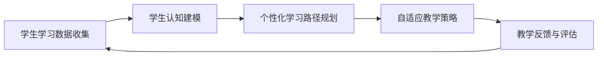

# 认知科学启发的AI教育个性化学习系统

> 关键词：认知科学、AI教育、个性化学习系统、学习模型、自适应教学

> 摘要：本文聚焦于认知科学启发的AI教育个性化学习系统。首先介绍了该系统产生的背景，包括目的、预期读者等信息。接着阐述了认知科学与AI教育相关的核心概念及其联系，通过文本示意图和Mermaid流程图进行清晰展示。详细讲解了核心算法原理，并用Python代码进行说明，同时给出数学模型和公式。通过项目实战案例，深入剖析了系统的开发环境搭建、源代码实现与解读。探讨了该系统在实际中的应用场景，推荐了相关的学习资源、开发工具框架以及论文著作。最后总结了系统的未来发展趋势与挑战，还提供了常见问题解答和扩展阅读参考资料，旨在为构建和应用此类系统提供全面且深入的技术指导。

## 1. 背景介绍 
### 1.1 目的和范围
传统教育模式往往采用“一刀切”的教学方法，难以满足每个学生的独特学习需求。认知科学启发的AI教育个性化学习系统旨在借助认知科学的理论和方法，结合人工智能技术，为每个学生量身定制学习路径和教学内容，提高学习效果和效率。本系统的范围涵盖了从小学到大学各个教育阶段的多个学科领域，包括但不限于数学、语文、科学等。它可以应用于线上教育平台、线下智能教室等多种教育场景。

### 1.2 预期读者
本文的预期读者包括教育技术领域的研究人员、教育机构的教师和管理人员、AI开发工程师以及对个性化教育感兴趣的学者和爱好者。研究人员可以从中获取关于系统设计和开发的新思路；教师和管理人员可以了解如何将该系统应用于实际教学中；AI开发工程师可以学习到相关的算法和技术实现；而学者和爱好者则可以对这一前沿领域有更深入的认识。

### 1.3 文档结构概述
本文将按照以下结构进行阐述：首先介绍相关的背景信息，包括目的、预期读者等；接着详细讲解认知科学与AI教育的核心概念及其联系，并用图表进行展示；然后阐述核心算法原理和具体操作步骤，给出Python代码示例；再介绍系统的数学模型和公式，并举例说明；通过项目实战案例，深入分析系统的开发过程；探讨系统在实际中的应用场景；推荐相关的学习资源、开发工具框架和论文著作；最后总结系统的未来发展趋势与挑战，提供常见问题解答和扩展阅读参考资料。

### 1.4 术语表
#### 1.4.1 核心术语定义
- **认知科学**：是一门研究人类认知过程和智能机制的跨学科领域，涉及心理学、哲学、语言学、计算机科学、神经科学等多个学科。
- **AI教育**：指利用人工智能技术来改善教育过程和提高教育质量的教育模式。
- **个性化学习系统**：根据每个学生的学习特征、能力水平和学习目标，为其提供个性化学习方案的系统。
- **学习模型**：描述学生学习过程和能力发展的数学模型。
- **自适应教学**：根据学生的学习情况实时调整教学内容和方法的教学策略。

#### 1.4.2 相关概念解释
- **认知负荷理论**：该理论认为人类的认知资源是有限的，学习过程中需要合理分配认知负荷，以提高学习效果。在个性化学习系统中，可以根据这一理论为学生提供合适难度的学习内容。
- **知识图谱**：是一种语义网络，用于表示知识和概念之间的关系。在AI教育中，可以利用知识图谱来组织教学内容，帮助学生建立系统的知识体系。
- **机器学习**：是人工智能的一个重要分支，通过让计算机从数据中学习模式和规律，从而实现预测和决策。在个性化学习系统中，可以利用机器学习算法来分析学生的学习数据，为其提供个性化的学习建议。

#### 1.4.3 缩略词列表
- **AI**：Artificial Intelligence（人工智能）
- **ML**：Machine Learning（机器学习）
- **NLP**：Natural Language Processing（自然语言处理）
- **RNN**：Recurrent Neural Network（循环神经网络）
- **LSTM**：Long Short-Term Memory（长短期记忆网络）

## 2. 核心概念与联系 
### 核心概念原理
认知科学启发的AI教育个性化学习系统主要基于认知科学的理论和方法，结合人工智能技术，实现对学生学习过程的精准建模和个性化教学。其核心原理包括以下几个方面：

#### 学生认知建模
通过收集学生的学习数据，如答题记录、学习时间、学习行为等，利用机器学习算法建立学生的认知模型，描述学生的知识掌握情况、学习能力和学习风格等特征。例如，可以使用贝叶斯网络来建模学生的知识状态，根据学生的答题结果更新其对各个知识点的掌握概率。

#### 个性化学习路径规划
根据学生的认知模型，为其规划个性化的学习路径。学习路径可以包括学习内容的选择、学习顺序的安排和学习方法的建议等。例如，对于知识掌握程度较低的学生，可以先安排基础知识的学习；对于学习能力较强的学生，可以提供一些拓展性的学习内容。

#### 自适应教学策略
在学生学习过程中，根据其实时的学习表现，动态调整教学内容和方法。例如，如果学生在某个知识点上遇到困难，可以提供更多的讲解和练习；如果学生已经掌握了某个知识点，可以跳过相关内容，进入下一个知识点的学习。

### 架构的文本示意图
```plaintext
+-------------------+
| 学生学习数据收集  |
| （答题记录、行为）|
+-------------------+
         |
         v
+-------------------+
| 学生认知建模      |
| （知识状态、能力）|
+-------------------+
         |
         v
+-------------------+
| 个性化学习路径规划|
| （内容、顺序、方法）|
+-------------------+
         |
         v
+-------------------+
| 自适应教学策略    |
| （动态调整内容）  |
+-------------------+
         |
         v
+-------------------+
| 教学反馈与评估    |
| （效果、改进建议）|
+-------------------+
```

### Mermaid流程图


## 3. 核心算法原理 & 具体操作步骤 
### 核心算法原理
#### 贝叶斯网络用于学生知识状态建模
贝叶斯网络是一种概率图模型，用于表示变量之间的依赖关系。在学生知识状态建模中，可以将每个知识点看作一个变量，其取值表示学生对该知识点的掌握情况（如掌握、未掌握）。通过学生的答题结果，可以更新这些变量的概率分布。

假设我们有 $n$ 个知识点 $K_1, K_2, \cdots, K_n$，每个知识点有两种状态：掌握（$M$）和未掌握（$U$）。学生的答题结果 $R$ 与知识点的掌握情况之间存在一定的关联。根据贝叶斯定理，我们可以计算在给定答题结果 $R$ 的情况下，知识点 $K_i$ 处于掌握状态的概率 $P(K_i = M|R)$：

$$P(K_i = M|R) = \frac{P(R|K_i = M)P(K_i = M)}{P(R)}$$

其中，$P(R|K_i = M)$ 是在知识点 $K_i$ 掌握的情况下出现答题结果 $R$ 的概率，$P(K_i = M)$ 是知识点 $K_i$ 掌握的先验概率，$P(R)$ 是答题结果 $R$ 出现的概率。

#### 遗传算法用于学习路径规划
遗传算法是一种模拟自然选择和遗传机制的优化算法。在学习路径规划中，可以将每个学习路径看作一个个体，其适应度表示该路径对学生的适合程度。通过选择、交叉和变异等操作，不断进化种群，最终找到最优的学习路径。

### 具体操作步骤及Python代码实现

#### 贝叶斯网络建模
```python
import numpy as np
from pgmpy.models import BayesianNetwork
from pgmpy.factors.discrete import TabularCPD

# 定义贝叶斯网络结构
model = BayesianNetwork([('K1', 'R'), ('K2', 'R')])

# 定义条件概率分布
cpd_k1 = TabularCPD(variable='K1', variable_card=2, values=[[0.6], [0.4]])
cpd_k2 = TabularCPD(variable='K2', variable_card=2, values=[[0.7], [0.3]])
cpd_r = TabularCPD(variable='R', variable_card=2, 
                   evidence=['K1', 'K2'], evidence_card=[2, 2],
                   values=[[0.9, 0.7, 0.6, 0.2], [0.1, 0.3, 0.4, 0.8]])

# 将条件概率分布添加到模型中
model.add_cpds(cpd_k1, cpd_k2, cpd_r)

# 检查模型的有效性
model.check_model()

# 进行推理，假设答题结果 R = 1
from pgmpy.inference import VariableElimination
infer = VariableElimination(model)
result = infer.query(variables=['K1', 'K2'], evidence={'R': 1})
print(result)
```

#### 遗传算法进行学习路径规划
```python
import random

# 定义学习路径的表示
class LearningPath:
    def __init__(self, path):
        self.path = path
        self.fitness = 0

    def calculate_fitness(self):
        # 这里简单假设适应度是路径长度的倒数
        self.fitness = 1 / len(self.path)

# 定义遗传算法的参数
POPULATION_SIZE = 50
GENERATIONS = 100
MUTATION_RATE = 0.1

# 初始化种群
def initialize_population():
    population = []
    for _ in range(POPULATION_SIZE):
        path = random.sample(range(10), 5)  # 假设总共有10个知识点，随机选择5个组成路径
        learning_path = LearningPath(path)
        learning_path.calculate_fitness()
        population.append(learning_path)
    return population

# 选择操作
def selection(population):
    total_fitness = sum([p.fitness for p in population])
    probabilities = [p.fitness / total_fitness for p in population]
    selected = random.choices(population, weights=probabilities, k=2)
    return selected

# 交叉操作
def crossover(parent1, parent2):
    crossover_point = random.randint(1, len(parent1.path) - 1)
    child1_path = parent1.path[:crossover_point] + [x for x in parent2.path if x not in parent1.path[:crossover_point]]
    child2_path = parent2.path[:crossover_point] + [x for x in parent1.path if x not in parent2.path[:crossover_point]]
    child1 = LearningPath(child1_path)
    child2 = LearningPath(child2_path)
    child1.calculate_fitness()
    child2.calculate_fitness()
    return child1, child2

# 变异操作
def mutation(learning_path):
    if random.random() < MUTATION_RATE:
        index1, index2 = random.sample(range(len(learning_path.path)), 2)
        learning_path.path[index1], learning_path.path[index2] = learning_path.path[index2], learning_path.path[index1]
        learning_path.calculate_fitness()
    return learning_path

# 遗传算法主循环
population = initialize_population()
for _ in range(GENERATIONS):
    new_population = []
    for _ in range(POPULATION_SIZE // 2):
        parent1, parent2 = selection(population)
        child1, child2 = crossover(parent1, parent2)
        child1 = mutation(child1)
        child2 = mutation(child2)
        new_population.extend([child1, child2])
    population = new_population

# 找到最优学习路径
best_path = max(population, key=lambda x: x.fitness)
print("最优学习路径:", best_path.path)
```

## 4. 数学模型和公式 & 详细讲解 & 举例说明 
### 学生知识状态建模的数学模型
#### 贝叶斯网络模型
如前面所述，贝叶斯网络用于学生知识状态建模。假设我们有 $n$ 个知识点 $K_1, K_2, \cdots, K_n$，每个知识点 $K_i$ 有两种状态：掌握（$M$）和未掌握（$U$）。学生的答题结果 $R$ 是一个随机变量，其取值与知识点的掌握情况有关。

贝叶斯定理为：

$$P(K_i = M|R) = \frac{P(R|K_i = M)P(K_i = M)}{P(R)}$$

其中：
- $P(K_i = M)$ 是知识点 $K_i$ 掌握的先验概率，可以根据学生的历史学习情况或经验来估计。
- $P(R|K_i = M)$ 是在知识点 $K_i$ 掌握的情况下出现答题结果 $R$ 的概率，需要通过大量的实验数据来学习。
- $P(R)$ 是答题结果 $R$ 出现的概率，可以通过全概率公式计算：

$$P(R) = \sum_{i_1 = 0}^{1} \sum_{i_2 = 0}^{1} \cdots \sum_{i_n = 0}^{1} P(R|K_1 = i_1, K_2 = i_2, \cdots, K_n = i_n) \prod_{j = 1}^{n} P(K_j = i_j)$$

这里 $i_j = 0$ 表示未掌握，$i_j = 1$ 表示掌握。

#### 举例说明
假设我们有两个知识点 $K_1$ 和 $K_2$，先验概率 $P(K_1 = M) = 0.6$，$P(K_2 = M) = 0.7$。答题结果 $R$ 有两种情况：答对（$R = 1$）和答错（$R = 0$）。条件概率分布如下：

| $K_1$ | $K_2$ | $P(R = 1|K_1, K_2)$ |
|-------|-------|---------------------|
| 0     | 0     | 0.2                 |
| 0     | 1     | 0.6                 |
| 1     | 0     | 0.7                 |
| 1     | 1     | 0.9                 |

现在假设学生答对了题目（$R = 1$），我们来计算 $P(K_1 = M|R = 1)$。

首先计算 $P(R = 1)$：

$$
\begin{align*}
P(R = 1) &= P(R = 1|K_1 = 0, K_2 = 0)P(K_1 = 0)P(K_2 = 0) + P(R = 1|K_1 = 0, K_2 = 1)P(K_1 = 0)P(K_2 = 1) \\
&+ P(R = 1|K_1 = 1, K_2 = 0)P(K_1 = 1)P(K_2 = 0) + P(R = 1|K_1 = 1, K_2 = 1)P(K_1 = 1)P(K_2 = 1) \\
&= 0.2\times(1 - 0.6)\times(1 - 0.7) + 0.6\times(1 - 0.6)\times0.7 + 0.7\times0.6\times(1 - 0.7) + 0.9\times0.6\times0.7 \\
&= 0.2\times0.4\times0.3 + 0.6\times0.4\times0.7 + 0.7\times0.6\times0.3 + 0.9\times0.6\times0.7 \\
&= 0.024 + 0.168 + 0.126 + 0.378 \\
&= 0.696
\end{align*}
$$

然后计算 $P(R = 1|K_1 = M)$：

$$
\begin{align*}
P(R = 1|K_1 = M) &= P(R = 1|K_1 = 1, K_2 = 0)P(K_2 = 0) + P(R = 1|K_1 = 1, K_2 = 1)P(K_2 = 1) \\
&= 0.7\times(1 - 0.7) + 0.9\times0.7 \\
&= 0.7\times0.3 + 0.9\times0.7 \\
&= 0.21 + 0.63 \\
&= 0.84
\end{align*}
$$

最后计算 $P(K_1 = M|R = 1)$：

$$P(K_1 = M|R = 1) = \frac{P(R = 1|K_1 = M)P(K_1 = M)}{P(R = 1)} = \frac{0.84\times0.6}{0.696} \approx 0.727$$

### 学习路径规划的数学模型
#### 适应度函数
在遗传算法进行学习路径规划中，适应度函数用于评估每个学习路径的优劣。假设学习路径 $p$ 是由一系列知识点 $K_{p_1}, K_{p_2}, \cdots, K_{p_m}$ 组成，适应度函数 $f(p)$ 可以定义为：

$$f(p) = \sum_{i = 1}^{m} w_i g(K_{p_i})$$

其中：
- $w_i$ 是第 $i$ 个知识点在学习路径中的权重，可以根据知识点的重要性、难度等因素来确定。
- $g(K_{p_i})$ 是知识点 $K_{p_i}$ 对学生的适合度，可以根据学生的知识状态、学习能力等因素来计算。

#### 举例说明
假设我们有一个学习路径 $p = [K_1, K_2, K_3]$，权重分别为 $w_1 = 0.3$，$w_2 = 0.4$，$w_3 = 0.3$。学生对知识点 $K_1$ 的适合度 $g(K_1) = 0.8$，对知识点 $K_2$ 的适合度 $g(K_2) = 0.6$，对知识点 $K_3$ 的适合度 $g(K_3) = 0.7$。则该学习路径的适应度为：

$$f(p) = 0.3\times0.8 + 0.4\times0.6 + 0.3\times0.7 = 0.24 + 0.24 + 0.21 = 0.69$$

## 5. 项目实战：代码实际案例和详细解释说明 
### 5.1  开发环境搭建
#### 软件环境
- **操作系统**：可以选择 Windows、Linux 或 macOS 操作系统。这里以 Windows 10 为例进行说明。
- **Python 环境**：安装 Python 3.7 及以上版本。可以从 Python 官方网站（https://www.python.org/downloads/）下载安装包进行安装。安装完成后，配置好环境变量，确保在命令行中可以直接使用 `python` 命令。
- **开发工具**：推荐使用 PyCharm 作为开发工具。可以从 JetBrains 官方网站（https://www.jetbrains.com/pycharm/download/）下载社区版进行安装。

#### 库的安装
在命令行中使用 `pip` 命令安装所需的库：
```sh
pip install pgmpy numpy pandas matplotlib
```
- `pgmpy`：用于构建和推理贝叶斯网络。
- `numpy`：用于数值计算。
- `pandas`：用于数据处理和分析。
- `matplotlib`：用于数据可视化。

### 5.2  源代码详细实现和代码解读
#### 数据收集和预处理模块
```python
import pandas as pd

def collect_data(file_path):
    """
    从文件中收集学生的学习数据
    :param file_path: 数据文件的路径
    :return: 处理后的数据
    """
    data = pd.read_csv(file_path)
    # 这里可以进行一些数据清洗和预处理操作，如去除缺失值等
    data = data.dropna()
    return data

# 示例使用
data = collect_data('student_data.csv')
print(data.head())
```
代码解读：
- `collect_data` 函数用于从 CSV 文件中读取学生的学习数据，并进行简单的数据清洗，去除缺失值。最后返回处理后的数据。

#### 学生认知建模模块
```python
from pgmpy.models import BayesianNetwork
from pgmpy.factors.discrete import TabularCPD
from pgmpy.inference import VariableElimination

def build_bayesian_network(data):
    """
    构建贝叶斯网络模型
    :param data: 学生的学习数据
    :return: 贝叶斯网络模型
    """
    # 定义贝叶斯网络结构
    model = BayesianNetwork([('K1', 'R'), ('K2', 'R')])

    # 学习条件概率分布
    cpd_k1 = TabularCPD(variable='K1', variable_card=2, values=[[0.6], [0.4]])
    cpd_k2 = TabularCPD(variable='K2', variable_card=2, values=[[0.7], [0.3]])
    cpd_r = TabularCPD(variable='R', variable_card=2, 
                       evidence=['K1', 'K2'], evidence_card=[2, 2],
                       values=[[0.9, 0.7, 0.6, 0.2], [0.1, 0.3, 0.4, 0.8]])

    model.add_cpds(cpd_k1, cpd_k2, cpd_r)
    model.check_model()
    return model

def infer_knowledge_state(model, evidence):
    """
    根据贝叶斯网络进行推理，计算学生的知识状态
    :param model: 贝叶斯网络模型
    :param evidence: 观测到的证据，如答题结果
    :return: 学生的知识状态概率分布
    """
    infer = VariableElimination(model)
    result = infer.query(variables=['K1', 'K2'], evidence=evidence)
    return result

# 示例使用
model = build_bayesian_network(data)
evidence = {'R': 1}
knowledge_state = infer_knowledge_state(model, evidence)
print(knowledge_state)
```
代码解读：
- `build_bayesian_network` 函数用于构建贝叶斯网络模型，定义网络结构和条件概率分布，并检查模型的有效性。
- `infer_knowledge_state` 函数用于根据贝叶斯网络进行推理，计算学生在给定观测证据下的知识状态概率分布。

#### 个性化学习路径规划模块
```python
import random

class LearningPath:
    def __init__(self, path):
        self.path = path
        self.fitness = 0

    def calculate_fitness(self):
        # 这里简单假设适应度是路径长度的倒数
        self.fitness = 1 / len(self.path)

def initialize_population():
    """
    初始化种群
    :return: 初始种群
    """
    POPULATION_SIZE = 50
    population = []
    for _ in range(POPULATION_SIZE):
        path = random.sample(range(10), 5)  # 假设总共有10个知识点，随机选择5个组成路径
        learning_path = LearningPath(path)
        learning_path.calculate_fitness()
        population.append(learning_path)
    return population

def selection(population):
    """
    选择操作
    :param population: 当前种群
    :return: 选择出的两个个体
    """
    total_fitness = sum([p.fitness for p in population])
    probabilities = [p.fitness / total_fitness for p in population]
    selected = random.choices(population, weights=probabilities, k=2)
    return selected

def crossover(parent1, parent2):
    """
    交叉操作
    :param parent1: 父代个体1
    :param parent2: 父代个体2
    :return: 两个子代个体
    """
    crossover_point = random.randint(1, len(parent1.path) - 1)
    child1_path = parent1.path[:crossover_point] + [x for x in parent2.path if x not in parent1.path[:crossover_point]]
    child2_path = parent2.path[:crossover_point] + [x for x in parent1.path if x not in parent2.path[:crossover_point]]
    child1 = LearningPath(child1_path)
    child2 = LearningPath(child2_path)
    child1.calculate_fitness()
    child2.calculate_fitness()
    return child1, child2

def mutation(learning_path):
    """
    变异操作
    :param learning_path: 待变异的个体
    :return: 变异后的个体
    """
    MUTATION_RATE = 0.1
    if random.random() < MUTATION_RATE:
        index1, index2 = random.sample(range(len(learning_path.path)), 2)
        learning_path.path[index1], learning_path.path[index2] = learning_path.path[index2], learning_path.path[index1]
        learning_path.calculate_fitness()
    return learning_path

def genetic_algorithm():
    """
    遗传算法主循环
    :return: 最优学习路径
    """
    GENERATIONS = 100
    population = initialize_population()
    for _ in range(GENERATIONS):
        new_population = []
        for _ in range(len(population) // 2):
            parent1, parent2 = selection(population)
            child1, child2 = crossover(parent1, parent2)
            child1 = mutation(child1)
            child2 = mutation(child2)
            new_population.extend([child1, child2])
        population = new_population

    best_path = max(population, key=lambda x: x.fitness)
    return best_path

# 示例使用
best_path = genetic_algorithm()
print("最优学习路径:", best_path.path)
```
代码解读：
- `LearningPath` 类用于表示学习路径，包含路径信息和适应度。
- `initialize_population` 函数用于初始化种群，随机生成一定数量的学习路径。
- `selection` 函数用于根据适应度进行选择操作，选择出两个父代个体。
- `crossover` 函数用于进行交叉操作，生成两个子代个体。
- `mutation` 函数用于进行变异操作，对个体的路径进行随机交换。
- `genetic_algorithm` 函数是遗传算法的主循环，通过多次迭代找到最优学习路径。

### 5.3  代码解读与分析
#### 数据收集和预处理模块
该模块的主要作用是从文件中读取学生的学习数据，并进行简单的数据清洗。数据清洗是数据预处理的重要步骤，去除缺失值可以避免在后续的模型训练和推理中出现错误。

#### 学生认知建模模块
使用贝叶斯网络对学生的知识状态进行建模和推理。贝叶斯网络可以很好地处理不确定性，通过先验概率和条件概率分布，根据学生的答题结果更新其知识状态的概率分布。

#### 个性化学习路径规划模块
使用遗传算法进行学习路径规划。遗传算法是一种全局优化算法，通过模拟自然选择和遗传机制，不断进化种群，找到最优的学习路径。适应度函数的设计直接影响到算法的性能，这里简单地将路径长度的倒数作为适应度，实际应用中可以根据具体需求进行更复杂的设计。

## 6. 实际应用场景 
### 在线教育平台
在线教育平台可以利用认知科学启发的AI教育个性化学习系统为学生提供个性化的学习服务。平台可以收集学生的学习数据，如观看视频的时间、答题记录等，通过学生认知建模模块了解学生的知识掌握情况和学习风格。然后根据个性化学习路径规划模块为学生推荐适合的课程和学习内容，同时采用自适应教学策略，根据学生的实时学习表现调整教学进度和难度。例如，对于数学基础较弱的学生，平台可以先推荐一些基础的数学课程和练习题，当学生掌握了一定的基础知识后，再逐步推荐更高级的课程。

### 智能教室
在智能教室中，教师可以借助该系统更好地了解每个学生的学习情况。系统可以通过摄像头、传感器等设备收集学生的课堂表现数据，如注意力集中程度、参与度等。结合学生的作业和考试成绩，建立学生的认知模型。教师可以根据系统提供的个性化学习路径规划，为不同的学生安排不同的学习任务和活动。例如，对于学习能力较强的学生，可以安排一些拓展性的项目；对于学习困难的学生，可以提供更多的辅导和练习。

### 职业培训
职业培训领域也可以应用该系统。培训机构可以根据不同的职业需求和学员的基础水平，为学员制定个性化的培训方案。通过收集学员的学习数据，了解他们对不同技能的掌握情况，及时调整培训内容和方式。例如，在编程培训中，对于有一定编程基础的学员，可以直接进入高级编程课程的学习；对于零基础的学员，则需要从基础的编程语法开始教学。

## 7. 工具和资源推荐
### 7.1 学习资源推荐
#### 7.1.1 书籍推荐
- 《认知科学导论》：这本书全面介绍了认知科学的基本概念、理论和方法，包括认知心理学、认知神经科学、语言学等多个方面的内容，对于理解认知科学在AI教育中的应用具有重要的指导意义。
- 《人工智能：一种现代的方法》：是人工智能领域的经典教材，涵盖了人工智能的各个方面，包括机器学习、自然语言处理、知识表示等。对于开发AI教育个性化学习系统的工程师来说，是一本不可或缺的参考书。
- 《教育中的人工智能》：专门探讨了人工智能在教育领域的应用，介绍了各种AI教育技术和方法，以及实际应用案例，对于教育工作者和研究人员具有很高的参考价值。

#### 7.1.2 在线课程
- Coursera 上的“人工智能基础”课程：由知名高校的教授授课，系统地介绍了人工智能的基本概念、算法和应用，适合初学者入门。
- edX 上的“认知科学原理”课程：深入讲解了认知科学的原理和方法，通过实际案例分析帮助学员理解认知科学在不同领域的应用。
- Udemy 上的“个性化学习系统开发”课程：结合实际项目，详细介绍了如何开发个性化学习系统，包括数据收集、模型构建、算法实现等方面的内容。

#### 7.1.3 技术博客和网站
- Medium 上的 AI 相关博客：有很多专业的 AI 开发者和研究人员在 Medium 上分享他们的经验和见解，关注一些知名的 AI 博客，可以及时了解到最新的技术动态和研究成果。
- AI 研习社：是一个专注于人工智能技术的社区，提供了丰富的学习资源，包括技术文章、视频教程、案例分析等，适合不同层次的学习者。
- 中国慕课网：提供了大量的在线课程，其中不乏与认知科学和 AI 教育相关的课程，可以根据自己的需求进行选择学习。

### 7.2 开发工具框架推荐
#### 7.2.1 IDE和编辑器
- PyCharm：是一款专门为 Python 开发设计的集成开发环境，具有强大的代码编辑、调试、版本控制等功能，适合开发AI教育个性化学习系统。
- Jupyter Notebook：是一个交互式的开发环境，支持多种编程语言，特别适合进行数据分析和模型实验。可以方便地展示代码、数据和结果，便于团队协作和交流。
- Visual Studio Code：是一款轻量级的代码编辑器，支持多种编程语言和插件扩展。具有丰富的代码提示和调试功能，适合快速开发和调试代码。

#### 7.2.2 调试和性能分析工具
- Py-Spy：是一个用于 Python 代码性能分析的工具，可以实时监测代码的运行情况，找出性能瓶颈。
- TensorBoard：是 TensorFlow 提供的一个可视化工具，可以用于可视化模型的训练过程、评估指标等，帮助开发者更好地理解和优化模型。
- cProfile：是 Python 内置的性能分析工具，可以统计代码的运行时间和函数调用次数，帮助开发者找出代码中的性能问题。

#### 7.2.3 相关框架和库
- TensorFlow：是一个开源的机器学习框架，提供了丰富的工具和接口，支持多种深度学习模型的开发和训练。在AI教育个性化学习系统中，可以用于构建学生认知模型和进行学习路径规划。
- PyTorch：是另一个流行的深度学习框架，具有简洁易用的接口和高效的计算性能。适合快速开发和实验深度学习模型。
- Scikit-learn：是一个用于机器学习的 Python 库，提供了各种机器学习算法和工具，如分类、回归、聚类等。可以用于数据预处理、模型选择和评估等方面。

### 7.3 相关论文著作推荐
#### 7.3.1 经典论文
- "Probabilistic Reasoning in Intelligent Systems: Networks of Plausible Inference"：介绍了贝叶斯网络的基本原理和推理方法，是贝叶斯网络领域的经典论文。
- "Genetic Algorithms in Search, Optimization, and Machine Learning"：详细阐述了遗传算法的基本概念、操作和应用，对于理解和应用遗传算法进行学习路径规划具有重要的参考价值。
- "Cognitive Load Theory, Learning Difficulty, and Instructional Design"：提出了认知负荷理论，探讨了学习过程中的认知负荷问题，为个性化学习系统的设计提供了理论基础。

#### 7.3.2 最新研究成果
- "Adaptive Learning Systems: A Review of the State-of-the-Art"：对自适应学习系统的最新研究成果进行了综述，介绍了各种自适应学习技术和方法，以及未来的发展趋势。
- "AI-Enhanced Personalized Learning: A Systematic Review"：系统地回顾了AI增强的个性化学习的研究现状，分析了其优势和挑战，并提出了未来的研究方向。
- "Cognitive Science-Inspired AI for Education: A New Paradigm"：探讨了认知科学启发的AI在教育中的应用，提出了一种新的教育范式。

#### 7.3.3 应用案例分析
- "Case Studies in AI-Enabled Personalized Learning in Higher Education"：通过实际案例分析了AI赋能的个性化学习在高等教育中的应用，展示了该系统在提高学习效果和效率方面的优势。
- "Implementing Adaptive Learning Systems in K-12 Classrooms: A Case Study"：介绍了在K-12课堂中实施自适应学习系统的案例，分析了实施过程中遇到的问题和解决方案。
- "AI-Driven Personalized Learning in Corporate Training: A Real-World Example"：以企业培训为例，介绍了AI驱动的个性化学习的实际应用案例，为企业培训提供了参考。

## 8. 总结：未来发展趋势与挑战
### 未来发展趋势
#### 融合多模态数据
未来的认知科学启发的AI教育个性化学习系统将融合更多的多模态数据，如学生的面部表情、语音语调、肢体动作等。通过分析这些多模态数据，可以更全面地了解学生的学习状态和情绪变化，为学生提供更精准的个性化学习服务。例如，当系统检测到学生在学习过程中出现困惑或疲劳的表情时，可以及时调整教学内容和方式，提供更多的帮助和引导。

#### 强化学习与自适应教学的结合
强化学习是一种通过智能体与环境进行交互，不断学习最优策略的机器学习方法。将强化学习应用于自适应教学中，可以使系统根据学生的实时反馈动态调整教学策略，实现更加智能和高效的教学。例如，系统可以根据学生的答题结果和学习进度，实时调整问题的难度和类型，以达到最佳的学习效果。

#### 跨学科融合
认知科学启发的AI教育个性化学习系统将与更多的学科进行融合，如神经科学、心理学、教育学等。通过跨学科的研究和合作，可以深入了解人类的认知和学习机制，为系统的设计和开发提供更坚实的理论基础。例如，结合神经科学的研究成果，可以更好地理解大脑的学习过程，从而设计出更符合人类认知规律的学习模型和教学策略。

### 挑战
#### 数据隐私和安全问题
在收集和使用学生的学习数据时，需要确保数据的隐私和安全。学生的学习数据包含了大量的个人信息，如学习成绩、学习习惯等，如果这些数据被泄露或滥用，将对学生的权益造成损害。因此，需要建立严格的数据保护机制，确保数据的安全存储和传输，同时遵守相关的法律法规。

#### 模型的可解释性
目前，很多AI模型，如深度学习模型，具有很高的复杂性和黑盒性，难以解释其决策过程和结果。在教育领域，模型的可解释性尤为重要，因为教师和学生需要了解系统为什么会做出这样的决策。因此，需要研究和开发具有可解释性的AI模型，提高系统的透明度和可信度。

#### 教育工作者的接受度
认知科学启发的AI教育个性化学习系统的推广和应用需要得到教育工作者的支持和认可。然而，一些教育工作者可能对新技术存在疑虑和担忧，担心会取代他们的工作。因此，需要加强对教育工作者的培训和宣传，让他们了解该系统的优势和作用，提高他们的接受度和使用意愿。

## 9. 附录：常见问题与解答
### 问题1：该系统是否适用于所有年龄段的学生？
解答：该系统理论上适用于从小学到大学各个年龄段的学生。不同年龄段的学生在认知能力、学习风格等方面存在差异，系统可以通过收集和分析学生的学习数据，为每个学生建立个性化的认知模型，从而提供适合他们的学习路径和教学内容。但在实际应用中，可能需要根据不同年龄段学生的特点进行适当的调整和优化。

### 问题2：系统的准确性如何保证？
解答：系统的准确性主要依赖于数据的质量和模型的性能。首先，需要收集大量准确的学生学习数据，包括答题记录、学习时间、学习行为等。同时，对数据进行清洗和预处理，去除噪声和异常值。其次，选择合适的模型和算法，如贝叶斯网络、遗传算法等，并进行充分的训练和优化。此外，还可以通过不断的实验和评估，对系统进行改进和完善，提高其准确性。

### 问题3：系统的开发和维护成本高吗？
解答：系统的开发和维护成本取决于多个因素，如系统的功能复杂度、数据规模、开发团队的技术水平等。开发一个完整的认知科学启发的AI教育个性化学习系统需要涉及到多个领域的知识和技术，包括认知科学、人工智能、教育技术等，因此开发成本相对较高。在维护方面，需要定期更新和优化模型，处理新的数据和问题，也需要一定的人力和物力投入。但从长远来看，该系统可以提高教育效率和质量，带来更大的收益。

### 问题4：系统是否可以与现有的教育平台集成？
解答：系统可以与现有的教育平台集成。大多数教育平台都提供了一定的接口和开放标准，可以通过这些接口将系统的数据和功能集成到教育平台中。例如，可以将系统的个性化学习推荐功能集成到在线教育平台的课程推荐模块中，为学生提供更精准的课程推荐；也可以将系统的学生认知建模功能与学校的教务管理系统集成，帮助教师更好地了解学生的学习情况。

## 10. 扩展阅读 & 参考资料
### 扩展阅读
- 《教育技术学》：全面介绍了教育技术的基本概念、理论和方法，对于深入理解教育与技术的结合具有重要的帮助。
- 《深度学习》：详细阐述了深度学习的原理和应用，对于进一步学习和研究深度学习在AI教育中的应用有很大的参考价值。
- 《教育大数据：理论与实践》：探讨了教育大数据的采集、分析和应用，为认知科学启发的AI教育个性化学习系统的数据处理提供了思路和方法。

### 参考资料
- Anderson, J. R. (1983). The architecture of cognition. Harvard University Press.
- Mitchell, T. M. (1997). Machine learning. McGraw-Hill.
- Papert, S. (1980). Mindstorms: Children, computers, and powerful ideas. Basic Books.

作者：AI天才研究院/AI Genius Institute & 禅与计算机程序设计艺术 /Zen And The Art of Computer Programming