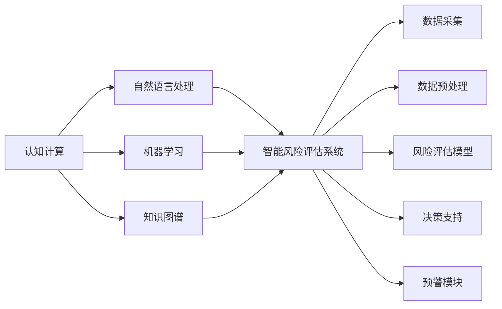

# 认知计算在智能风险评估系统中的创新应用

> 关键词：认知计算、智能风险评估系统、创新应用、数据处理、机器学习

> 摘要：本文深入探讨了认知计算在智能风险评估系统中的创新应用。首先介绍了相关背景，包括目的范围、预期读者等。接着阐述了认知计算和智能风险评估系统的核心概念及联系，详细讲解了核心算法原理与操作步骤，并给出了相应的数学模型和公式。通过项目实战展示了具体代码实现和解读。分析了认知计算在智能风险评估系统中的实际应用场景，推荐了相关的学习资源、开发工具框架和论文著作。最后总结了未来发展趋势与挑战，还设置了常见问题解答和扩展阅读参考资料。

## 1. 背景介绍 
### 1.1 目的和范围
随着金融市场的不断发展和复杂化，风险评估在各个领域变得至关重要。传统的风险评估方法往往依赖于固定的规则和有限的数据，难以适应快速变化的环境和复杂的风险场景。认知计算作为一种新兴的技术，具有理解、学习和推理的能力，能够处理大量的非结构化数据，为智能风险评估系统带来了新的机遇。本文的目的是探讨认知计算在智能风险评估系统中的创新应用，涵盖了认知计算的基本原理、算法实现、实际应用场景等方面，旨在为相关领域的研究和实践提供参考。

### 1.2 预期读者
本文的预期读者包括从事金融风险管理、计算机科学、人工智能等领域的研究人员、工程师和从业者。同时，对于对认知计算和智能风险评估感兴趣的学生和爱好者也具有一定的参考价值。

### 1.3 文档结构概述
本文将按照以下结构进行组织：首先介绍核心概念与联系，包括认知计算和智能风险评估系统的定义、原理和架构；接着详细讲解核心算法原理和具体操作步骤，通过Python代码进行阐述；然后给出相关的数学模型和公式，并举例说明；通过项目实战展示代码的实际应用和详细解释；分析认知计算在智能风险评估系统中的实际应用场景；推荐相关的工具和资源；最后总结未来发展趋势与挑战，设置常见问题解答和扩展阅读参考资料。

### 1.4 术语表
#### 1.4.1 核心术语定义
- **认知计算**：一种模拟人类认知过程的计算模式，能够理解自然语言、处理非结构化数据、进行学习和推理。
- **智能风险评估系统**：利用人工智能技术，对各种风险进行自动评估和预警的系统。
- **机器学习**：让计算机通过数据学习模式和规律，从而进行预测和决策的技术。
- **深度学习**：机器学习的一个分支，使用多层神经网络进行复杂模式的学习。
- **非结构化数据**：没有固定结构和格式的数据，如文本、图像、音频等。

#### 1.4.2 相关概念解释
- **知识图谱**：一种表示实体和实体之间关系的图结构，可用于知识表示和推理。
- **自然语言处理**：使计算机能够理解和处理人类语言的技术。
- **数据挖掘**：从大量数据中发现有价值信息和模式的过程。

#### 1.4.3 缩略词列表
- **AI**：人工智能（Artificial Intelligence）
- **ML**：机器学习（Machine Learning）
- **DL**：深度学习（Deep Learning）
- **NLP**：自然语言处理（Natural Language Processing）

## 2. 核心概念与联系 
### 2.1 认知计算原理
认知计算模拟人类的认知过程，包括感知、理解、学习和推理。它通过多种技术手段，如自然语言处理、机器学习、知识图谱等，处理各种类型的数据，包括结构化和非结构化数据。认知计算系统能够从数据中提取信息，构建知识模型，并根据这些知识进行决策和预测。

### 2.2 智能风险评估系统架构
智能风险评估系统通常包括数据采集、数据预处理、风险评估模型、决策支持和预警模块。数据采集模块负责收集各种相关的数据，包括历史数据、实时数据和外部数据。数据预处理模块对采集到的数据进行清洗、转换和特征提取。风险评估模型使用机器学习或深度学习算法对数据进行分析和建模，评估风险的概率和程度。决策支持模块根据风险评估结果提供决策建议，预警模块在风险达到一定阈值时发出警报。

### 2.3 认知计算与智能风险评估系统的联系
认知计算为智能风险评估系统提供了更强大的能力。它能够处理非结构化数据，如新闻报道、社交媒体信息等，从而获取更全面的风险信息。认知计算的学习和推理能力可以使风险评估模型更加自适应和智能，能够及时发现新的风险模式和趋势。同时，认知计算的自然语言处理能力可以实现人机交互，使系统更易于使用和管理。

### 2.4 文本示意图
```plaintext
认知计算
  |
  |-- 自然语言处理
  |-- 机器学习
  |-- 知识图谱
  |
  v
智能风险评估系统
  |
  |-- 数据采集
  |-- 数据预处理
  |-- 风险评估模型
  |-- 决策支持
  |-- 预警模块
```

### 2.5 Mermaid 流程图


## 3. 核心算法原理 & 具体操作步骤 
### 3.1 核心算法原理
在智能风险评估系统中，常用的核心算法包括机器学习算法和深度学习算法。以下以支持向量机（SVM）和卷积神经网络（CNN）为例进行讲解。

#### 3.1.1 支持向量机（SVM）原理
支持向量机是一种二分类模型，其基本思想是在特征空间中找到一个最优的超平面，使得不同类别的样本能够被最大程度地分开。对于线性可分的数据，SVM通过求解一个凸二次规划问题来找到最优超平面。对于线性不可分的数据，SVM通过引入核函数将数据映射到高维空间，使得数据在高维空间中线性可分。

#### 3.1.2 卷积神经网络（CNN）原理
卷积神经网络是一种专门用于处理具有网格结构数据（如图像、文本）的深度学习模型。它通过卷积层、池化层和全连接层组成。卷积层使用卷积核提取数据的特征，池化层对特征进行降维，全连接层将特征映射到输出类别。

### 3.2 具体操作步骤
#### 3.2.1 数据准备
首先需要收集和整理相关的数据，包括风险指标数据、历史事件数据等。对数据进行清洗，去除噪声和缺失值。然后进行特征工程，选择和提取与风险评估相关的特征。

#### 3.2.2 模型训练
使用准备好的数据对支持向量机或卷积神经网络进行训练。对于SVM，需要选择合适的核函数和参数。对于CNN，需要设计合适的网络结构和训练参数。

#### 3.2.3 模型评估
使用测试数据对训练好的模型进行评估，计算模型的准确率、召回率、F1值等指标。根据评估结果对模型进行调整和优化。

#### 3.2.4 风险评估
将新的数据输入到训练好的模型中，得到风险评估结果。根据评估结果进行决策和预警。

### 3.3 Python源代码实现
```python
import numpy as np
from sklearn.svm import SVC
from sklearn.model_selection import train_test_split
from sklearn.metrics import accuracy_score
from tensorflow.keras.datasets import mnist
from tensorflow.keras.models import Sequential
from tensorflow.keras.layers import Conv2D, MaxPooling2D, Flatten, Dense

# 支持向量机示例
# 生成一些示例数据
X = np.array([[1, 2], [2, 3], [3, 4], [4, 5], [5, 6], [6, 7]])
y = np.array([0, 0, 0, 1, 1, 1])

# 划分训练集和测试集
X_train, X_test, y_train, y_test = train_test_split(X, y, test_size=0.2, random_state=42)

# 创建SVM模型
svm_model = SVC(kernel='linear')

# 训练模型
svm_model.fit(X_train, y_train)

# 预测
y_pred = svm_model.predict(X_test)

# 评估模型
accuracy = accuracy_score(y_test, y_pred)
print(f"SVM模型准确率: {accuracy}")

# 卷积神经网络示例
# 加载MNIST数据集
(X_train_cnn, y_train_cnn), (X_test_cnn, y_test_cnn) = mnist.load_data()

# 数据预处理
X_train_cnn = X_train_cnn.reshape(-1, 28, 28, 1).astype('float32') / 255
X_test_cnn = X_test_cnn.reshape(-1, 28, 28, 1).astype('float32') / 255

# 创建CNN模型
cnn_model = Sequential([
    Conv2D(32, (3, 3), activation='relu', input_shape=(28, 28, 1)),
    MaxPooling2D((2, 2)),
    Flatten(),
    Dense(10, activation='softmax')
])

# 编译模型
cnn_model.compile(optimizer='adam',
                  loss='sparse_categorical_crossentropy',
                  metrics=['accuracy'])

# 训练模型
cnn_model.fit(X_train_cnn, y_train_cnn, epochs=5, batch_size=64)

# 评估模型
_, accuracy_cnn = cnn_model.evaluate(X_test_cnn, y_test_cnn)
print(f"CNN模型准确率: {accuracy_cnn}")
```

## 4. 数学模型和公式 & 详细讲解 & 举例说明 
### 4.1 支持向量机数学模型和公式
#### 4.1.1 线性可分情况
对于线性可分的数据，假设有 $n$ 个样本 $(x_1, y_1), (x_2, y_2), \cdots, (x_n, y_n)$，其中 $x_i \in \mathbb{R}^d$ 是特征向量，$y_i \in \{-1, 1\}$ 是类别标签。支持向量机的目标是找到一个超平面 $w^T x + b = 0$，使得不同类别的样本能够被最大程度地分开。具体来说，需要求解以下优化问题：

$$
\begin{aligned}
\min_{w, b} &\quad \frac{1}{2} \|w\|^2 \\
\text{s.t.} &\quad y_i (w^T x_i + b) \geq 1, \quad i = 1, 2, \cdots, n
\end{aligned}
$$

其中，$w$ 是超平面的法向量，$b$ 是偏置项。这个优化问题可以通过拉格朗日乘子法转化为对偶问题进行求解。

#### 4.1.2 线性不可分情况
对于线性不可分的数据，引入松弛变量 $\xi_i \geq 0$，允许一些样本违反约束条件。此时优化问题变为：

$$
\begin{aligned}
\min_{w, b, \xi} &\quad \frac{1}{2} \|w\|^2 + C \sum_{i=1}^{n} \xi_i \\
\text{s.t.} &\quad y_i (w^T x_i + b) \geq 1 - \xi_i, \quad i = 1, 2, \cdots, n \\
&\quad \xi_i \geq 0, \quad i = 1, 2, \cdots, n
\end{aligned}
$$

其中，$C$ 是惩罚参数，控制着对违反约束条件的样本的惩罚程度。同样可以通过拉格朗日乘子法将其转化为对偶问题进行求解。

#### 4.1.3 核函数
为了处理非线性可分的数据，引入核函数 $K(x_i, x_j) = \phi(x_i)^T \phi(x_j)$，其中 $\phi(x)$ 是将数据从原始空间映射到高维空间的映射函数。常见的核函数包括线性核、多项式核、高斯核等。使用核函数后，对偶问题的目标函数可以表示为：

$$
\begin{aligned}
\max_{\alpha} &\quad \sum_{i=1}^{n} \alpha_i - \frac{1}{2} \sum_{i=1}^{n} \sum_{j=1}^{n} \alpha_i \alpha_j y_i y_j K(x_i, x_j) \\
\text{s.t.} &\quad \sum_{i=1}^{n} \alpha_i y_i = 0 \\
&\quad 0 \leq \alpha_i \leq C, \quad i = 1, 2, \cdots, n
\end{aligned}
$$

### 4.2 卷积神经网络数学模型和公式
#### 4.2.1 卷积层
卷积层使用卷积核 $W$ 对输入数据 $X$ 进行卷积操作，得到特征图 $Y$。卷积操作可以表示为：

$$
Y_{i, j} = \sum_{m=0}^{M-1} \sum_{n=0}^{N-1} X_{i+m, j+n} W_{m, n} + b
$$

其中，$M$ 和 $N$ 是卷积核的大小，$b$ 是偏置项。

#### 4.2.2 池化层
池化层对特征图进行降维操作，常见的池化方式有最大池化和平均池化。以最大池化为例，假设池化窗口大小为 $k \times k$，则池化操作可以表示为：

$$
Y_{i, j} = \max_{m=0}^{k-1} \max_{n=0}^{k-1} X_{i \times k + m, j \times k + n}
$$

#### 4.2.3 全连接层
全连接层将卷积层和池化层得到的特征映射到输出类别。假设输入向量为 $x$，输出向量为 $y$，权重矩阵为 $W$，偏置向量为 $b$，则全连接层的输出可以表示为：

$$
y = Wx + b
$$

### 4.3 举例说明
#### 4.3.1 支持向量机举例
假设有两个类别，类别 1 的样本为 $(1, 2)$ 和 $(2, 3)$，类别 -1 的样本为 $(4, 5)$ 和 $(5, 6)$。使用线性核的支持向量机进行分类。首先，根据上述公式构建优化问题，求解得到最优的 $w$ 和 $b$，从而得到超平面方程。然后，对于新的样本，将其代入超平面方程进行分类判断。

#### 4.3.2 卷积神经网络举例
以手写数字识别为例，输入是 $28 \times 28$ 的灰度图像。卷积层使用多个卷积核提取图像的特征，如边缘、角点等。池化层对特征图进行降维，减少计算量。全连接层将特征映射到 10 个输出类别，分别对应 0 - 9 这 10 个数字。通过训练模型，使得模型能够准确地识别手写数字。

## 5. 项目实战：代码实际案例和详细解释说明 
### 5.1  开发环境搭建
#### 5.1.1 安装Python
首先需要安装Python，建议使用Python 3.7及以上版本。可以从Python官方网站（https://www.python.org/downloads/）下载安装包进行安装。

#### 5.1.2 安装必要的库
使用pip命令安装必要的库，包括NumPy、Pandas、Scikit-learn、TensorFlow等。可以使用以下命令进行安装：
```sh
pip install numpy pandas scikit-learn tensorflow
```

### 5.2  源代码详细实现和代码解读
#### 5.2.1 数据加载和预处理
```python
import pandas as pd
from sklearn.preprocessing import StandardScaler

# 加载数据
data = pd.read_csv('risk_data.csv')

# 分离特征和标签
X = data.drop('risk_label', axis=1)
y = data['risk_label']

# 数据标准化
scaler = StandardScaler()
X_scaled = scaler.fit_transform(X)
```
代码解读：首先使用Pandas库加载CSV格式的数据文件。然后将特征和标签分离，特征存储在变量 $X$ 中，标签存储在变量 $y$ 中。最后使用 `StandardScaler` 对特征数据进行标准化处理，使得数据具有零均值和单位方差。

#### 5.2.2 模型训练和评估
```python
from sklearn.model_selection import train_test_split
from sklearn.svm import SVC
from sklearn.metrics import accuracy_score

# 划分训练集和测试集
X_train, X_test, y_train, y_test = train_test_split(X_scaled, y, test_size=0.2, random_state=42)

# 创建SVM模型
svm_model = SVC(kernel='rbf')

# 训练模型
svm_model.fit(X_train, y_train)

# 预测
y_pred = svm_model.predict(X_test)

# 评估模型
accuracy = accuracy_score(y_test, y_pred)
print(f"模型准确率: {accuracy}")
```
代码解读：使用 `train_test_split` 函数将数据划分为训练集和测试集，测试集占比为 20%。创建一个使用径向基核函数（RBF）的支持向量机模型。使用训练集数据对模型进行训练，然后使用测试集数据进行预测。最后使用 `accuracy_score` 函数计算模型的准确率并输出。

### 5.3  代码解读与分析
#### 5.3.1 数据预处理的重要性
数据预处理是机器学习中非常重要的一步。通过标准化处理，可以使得不同特征具有相同的尺度，避免某些特征因为数值范围过大而对模型训练产生过大的影响。同时，去除噪声和缺失值等操作可以提高数据的质量，从而提高模型的性能。

#### 5.3.2 模型选择和参数调整
在本案例中，选择了支持向量机模型，并使用了径向基核函数。不同的模型和核函数适用于不同的数据和问题。在实际应用中，需要根据具体情况进行选择和调整。例如，可以尝试不同的核函数（如线性核、多项式核）和参数（如惩罚参数 $C$），以找到最优的模型配置。

#### 5.3.3 模型评估指标
除了准确率，还可以使用其他评估指标来评估模型的性能，如召回率、F1值等。不同的评估指标适用于不同的场景。例如，在风险评估中，召回率可能更为重要，因为我们更关注是否能够准确地识别出有风险的样本。

## 6. 实际应用场景 
### 6.1 金融风险评估
在金融领域，认知计算可以用于评估信用风险、市场风险和操作风险等。通过分析大量的金融数据，包括交易记录、财务报表、新闻报道等，认知计算系统可以更准确地评估客户的信用状况，预测市场走势，识别潜在的操作风险。例如，银行可以使用认知计算系统对贷款申请人进行风险评估，根据申请人的信用历史、收入情况、行业前景等因素，预测其违约的概率。

### 6.2 医疗风险评估
在医疗领域，认知计算可以用于评估患者的健康风险，如疾病发生的概率、手术风险等。通过分析患者的病历、基因数据、检查报告等信息，认知计算系统可以为医生提供更准确的诊断和治疗建议。例如，在癌症筛查中，认知计算系统可以分析患者的影像数据和临床信息，帮助医生早期发现癌症。

### 6.3 网络安全风险评估
在网络安全领域，认知计算可以用于评估网络系统的安全风险，如入侵检测、恶意软件检测等。通过分析网络流量、系统日志、安全漏洞信息等，认知计算系统可以及时发现潜在的安全威胁，采取相应的防范措施。例如，企业可以使用认知计算系统实时监测网络流量，识别异常的访问行为，防止网络攻击。

### 6.4 供应链风险评估
在供应链管理中，认知计算可以用于评估供应链的风险，如供应商风险、物流风险等。通过分析供应商的财务状况、生产能力、交货记录等信息，以及物流运输过程中的天气、交通等因素，认知计算系统可以预测供应链中断的概率，帮助企业制定应对策略。例如，汽车制造商可以使用认知计算系统评估零部件供应商的风险，提前做好备用计划，避免因供应商问题导致生产停滞。

## 7. 工具和资源推荐
### 7.1 学习资源推荐
#### 7.1.1 书籍推荐
- 《机器学习》（周志华）：全面介绍了机器学习的基本概念、算法和应用。
- 《深度学习》（Ian Goodfellow、Yoshua Bengio和Aaron Courville）：深度学习领域的经典著作，涵盖了深度学习的理论和实践。
- 《Python机器学习实战》（Sebastian Raschka）：通过实际案例介绍了如何使用Python进行机器学习开发。

#### 7.1.2 在线课程
- Coursera上的“机器学习”课程（Andrew Ng教授）：经典的机器学习入门课程，介绍了机器学习的基本算法和应用。
- edX上的“深度学习”课程（由多个知名高校联合开设）：深入介绍了深度学习的原理和实践。
- Kaggle上的机器学习和深度学习教程：提供了丰富的实战案例和教程，适合有一定基础的学习者。

#### 7.1.3 技术博客和网站
- Medium：有很多关于机器学习、人工智能的技术博客，作者来自世界各地的专家和从业者。
- Towards Data Science：专注于数据科学和机器学习领域的博客，提供了很多有价值的文章和教程。
- ArXiv：一个开放的学术预印本平台，包含了很多最新的机器学习和人工智能研究论文。

### 7.2 开发工具框架推荐
#### 7.2.1 IDE和编辑器
- PyCharm：功能强大的Python集成开发环境，提供了代码编辑、调试、版本控制等功能。
- Jupyter Notebook：交互式的开发环境，适合进行数据分析和模型实验。
- Visual Studio Code：轻量级的代码编辑器，支持多种编程语言和插件扩展。

#### 7.2.2 调试和性能分析工具
- TensorBoard：TensorFlow提供的可视化工具，可以用于监控模型训练过程、分析模型性能。
- Py-Spy：一个轻量级的Python性能分析工具，可以帮助找出代码中的性能瓶颈。
- Memory Profiler：用于分析Python代码的内存使用情况，帮助优化内存占用。

#### 7.2.3 相关框架和库
- TensorFlow：Google开发的深度学习框架，提供了丰富的工具和接口，支持多种深度学习模型的开发和训练。
- PyTorch：Facebook开发的深度学习框架，具有动态图和易于使用的特点，适合快速开发和实验。
- Scikit-learn：Python中常用的机器学习库，提供了各种机器学习算法和工具，如分类、回归、聚类等。

### 7.3 相关论文著作推荐
#### 7.3.1 经典论文
- “Support-Vector Networks”（Cortes和Vapnik）：介绍了支持向量机的基本原理和算法。
- “Gradient-Based Learning Applied to Document Recognition”（LeCun等人）：提出了卷积神经网络的经典架构LeNet。
- “Attention Is All You Need”（Vaswani等人）：提出了Transformer模型，在自然语言处理领域取得了巨大成功。

#### 7.3.2 最新研究成果
可以关注NeurIPS、ICML、CVPR等顶级机器学习和人工智能会议的论文，了解最新的研究成果和趋势。同时，也可以关注知名学术期刊，如Journal of Machine Learning Research、Artificial Intelligence等。

#### 7.3.3 应用案例分析
- 可以参考Kaggle上的各种竞赛和案例，了解不同领域的实际应用和解决方案。
- 一些大型企业的技术博客也会分享他们在人工智能和机器学习方面的应用案例，如Google、Facebook、Microsoft等。

## 8. 总结：未来发展趋势与挑战
### 8.1 未来发展趋势
#### 8.1.1 融合多种技术
认知计算将与其他技术，如物联网、区块链、量子计算等进行深度融合，创造出更强大的智能风险评估系统。例如，物联网可以提供更多的实时数据，区块链可以保证数据的安全性和可信度，量子计算可以提高计算效率。

#### 8.1.2 个性化风险评估
未来的智能风险评估系统将能够根据用户的个性化需求和特征，提供更加精准的风险评估和决策建议。例如，在金融领域，根据不同客户的投资偏好、风险承受能力等因素，为其定制个性化的投资组合和风险预警方案。

#### 8.1.3 可解释性和透明性
随着人工智能技术的广泛应用，人们对模型的可解释性和透明性提出了更高的要求。未来的认知计算模型将更加注重可解释性，能够向用户解释风险评估的依据和决策过程，增强用户对系统的信任。

### 8.2 挑战
#### 8.2.1 数据质量和安全
认知计算依赖于大量的数据，数据的质量和安全是关键问题。数据中可能存在噪声、缺失值和错误，需要进行有效的清洗和预处理。同时，数据的安全和隐私保护也面临着挑战，需要采取相应的技术和管理措施。

#### 8.2.2 模型复杂度和计算资源
随着模型复杂度的增加，计算资源的需求也会相应增加。如何在有限的计算资源下，提高模型的训练和推理效率是一个挑战。同时，模型的可扩展性也是需要考虑的问题，以适应不断增长的数据和业务需求。

#### 8.2.3 伦理和法律问题
认知计算的应用可能会带来一些伦理和法律问题，如算法偏见、隐私侵犯等。需要建立相应的伦理和法律框架，规范认知计算的应用，保障用户的权益和社会的公平正义。

## 9. 附录：常见问题与解答
### 9.1 认知计算和人工智能有什么区别？
认知计算是人工智能的一个分支，它更强调模拟人类的认知过程，如理解、学习和推理。认知计算能够处理非结构化数据，与人类进行自然交互。而人工智能是一个更广泛的概念，包括各种让计算机模拟人类智能的技术和方法。

### 9.2 如何选择合适的风险评估模型？
选择合适的风险评估模型需要考虑多个因素，如数据类型、数据规模、问题复杂度等。如果数据是线性可分的，可以选择线性模型，如逻辑回归、线性支持向量机等。如果数据是非线性的，可以选择非线性模型，如神经网络、决策树等。同时，还可以通过交叉验证等方法对不同模型进行评估和比较，选择最优的模型。

### 9.3 认知计算在智能风险评估系统中的应用是否会取代人类专家？
认知计算在智能风险评估系统中的应用不会取代人类专家。虽然认知计算可以处理大量的数据和复杂的问题，但人类专家具有丰富的经验和专业知识，能够对风险进行综合判断和决策。认知计算可以为人类专家提供更准确的信息和建议，辅助人类专家进行决策。

### 9.4 如何提高认知计算模型的性能？
可以通过以下方法提高认知计算模型的性能：
- 增加数据量：更多的数据可以让模型学习到更丰富的模式和规律。
- 特征工程：选择和提取更有价值的特征，能够提高模型的表达能力。
- 模型选择和调优：选择合适的模型，并对模型的参数进行调优。
- 集成学习：将多个模型进行集成，综合它们的预测结果，提高模型的稳定性和准确性。

## 10. 扩展阅读 & 参考资料
### 10.1 扩展阅读
- 《人工智能时代的风险评估与管理》：深入探讨了人工智能在风险评估和管理领域的应用和挑战。
- 《大数据与认知计算》：介绍了大数据和认知计算的基本概念、技术和应用。
- 《智能金融：科技重塑金融未来》：探讨了金融科技的发展趋势和应用，包括认知计算在金融风险评估中的应用。

### 10.2 参考资料
- 相关学术论文和研究报告，可以通过学术数据库（如IEEE Xplore、ACM Digital Library等）进行查找。
- 行业标准和规范，如金融行业的风险管理标准、医疗行业的安全评估标准等。
- 官方文档和教程，如TensorFlow、PyTorch等框架的官方文档。

作者：AI天才研究院/AI Genius Institute & 禅与计算机程序设计艺术 /Zen And The Art of Computer Programming