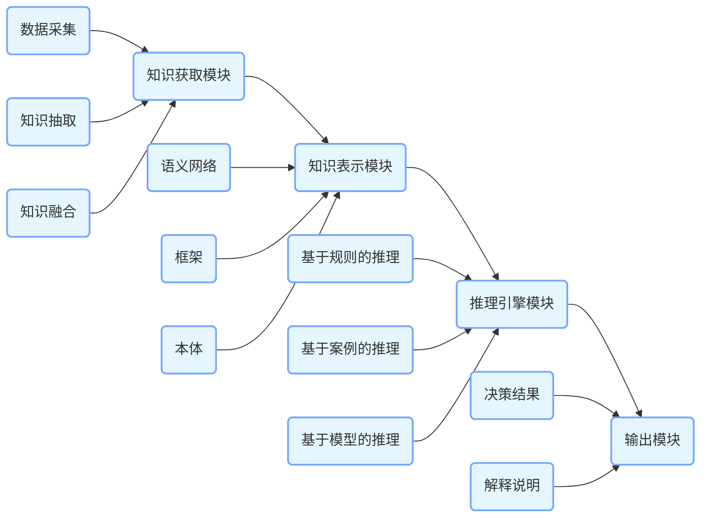

# 认知计算模型:模拟人类推理过程的AI系统

> 关键词：认知计算模型、人类推理过程、AI系统、知识表示、推理算法

> 摘要：本文深入探讨了认知计算模型这一模拟人类推理过程的AI系统。首先介绍了该领域的背景知识，包括目的、预期读者等。接着详细阐述了核心概念，给出了相关原理和架构的示意图及流程图。通过Python代码对核心算法原理和具体操作步骤进行了讲解，并引入数学模型和公式进行详细说明。然后通过项目实战展示了代码的实际应用和解读。之后分析了该模型的实际应用场景，推荐了相关的学习资源、开发工具框架以及论文著作。最后总结了未来发展趋势与挑战，解答了常见问题，并提供了扩展阅读和参考资料，旨在为读者全面呈现认知计算模型的相关知识和技术。

## 1. 背景介绍 
### 1.1 目的和范围
认知计算模型旨在构建能够模拟人类推理过程的AI系统。随着人工智能的发展，传统的AI系统在处理复杂问题、理解自然语言和进行常识推理等方面存在一定的局限性。而人类的推理过程具有灵活性、创造性和基于知识的特点。本研究的目的就是开发一种能够模仿人类这些特性的AI系统，使其在医疗诊断、智能客服、决策支持等多个领域发挥作用。

本研究的范围涵盖了认知计算模型的核心概念、算法原理、数学模型、实际应用以及相关的工具和资源。我们将从理论层面深入探讨如何构建这样的模型，同时通过实际案例展示其在不同场景下的应用。

### 1.2 预期读者
本文的预期读者包括人工智能领域的研究人员、程序员、软件架构师以及对认知计算和模拟人类推理感兴趣的技术爱好者。对于研究人员，本文可以为他们的研究提供理论和实践参考；对于程序员和软件架构师，本文可以帮助他们在实际项目中应用认知计算模型；对于技术爱好者，本文可以让他们了解这一前沿领域的基本知识和发展动态。

### 1.3 文档结构概述
本文将按照以下结构进行组织：首先介绍认知计算模型的背景知识，包括目的、预期读者和文档结构概述等。接着阐述核心概念，给出原理和架构的示意图及流程图。然后通过Python代码详细讲解核心算法原理和具体操作步骤，并引入数学模型和公式进行说明。之后通过项目实战展示代码的实际应用和解读。再分析实际应用场景，推荐相关的工具和资源。最后总结未来发展趋势与挑战，解答常见问题，并提供扩展阅读和参考资料。

### 1.4 术语表
#### 1.4.1 核心术语定义
- **认知计算模型**：一种模拟人类认知和推理过程的AI系统，通过知识表示、推理算法等技术来实现对复杂问题的处理和决策。
- **知识表示**：将人类的知识以计算机能够理解和处理的方式进行表示，如语义网络、框架、本体等。
- **推理算法**：根据已有的知识和规则，推导出新的结论或信息的算法，如基于规则的推理、基于案例的推理等。
- **本体**：一种对特定领域的概念、关系和规则进行明确描述的形式化模型，用于知识的组织和共享。
- **语义网络**：一种用节点和边表示概念及其关系的图结构，用于知识的表示和推理。

#### 1.4.2 相关概念解释
- **人类推理过程**：人类在面对问题时，通过感知、理解、分析、判断和决策等一系列心理活动来得出结论的过程。它涉及到知识的运用、逻辑推理、经验判断等多个方面。
- **AI系统**：人工智能系统是指能够模拟人类智能行为的计算机程序或系统，包括机器学习、深度学习、自然语言处理等多种技术。
- **知识图谱**：一种基于图的数据结构，用于表示实体之间的关系和知识，是认知计算模型中常用的知识表示方法之一。

#### 1.4.3 缩略词列表
- **AI**：Artificial Intelligence（人工智能）
- **NLP**：Natural Language Processing（自然语言处理）
- **ML**：Machine Learning（机器学习）
- **DL**：Deep Learning（深度学习）

## 2. 核心概念与联系 

### 核心概念原理
认知计算模型的核心原理是模拟人类的认知和推理过程。人类的认知过程包括感知、注意、记忆、语言、思维等多个方面，而推理则是基于已有的知识和信息，通过逻辑规则或经验判断来得出新的结论。

在认知计算模型中，首先需要进行知识表示，将人类的知识以计算机能够理解和处理的方式进行存储和组织。常见的知识表示方法包括语义网络、框架、本体等。语义网络用节点表示概念，用边表示概念之间的关系；框架是一种结构化的知识表示方法，用于描述对象的属性和行为；本体则是一种更加严格和规范的知识表示方法，用于定义领域内的概念、关系和规则。

然后，基于知识表示，采用推理算法进行推理。推理算法可以分为基于规则的推理、基于案例的推理、基于模型的推理等多种类型。基于规则的推理根据预先定义的规则进行推理，如专家系统中常用的规则引擎；基于案例的推理则是通过检索和匹配已有的案例来解决新的问题；基于模型的推理则是基于某种数学模型或物理模型进行推理。

### 架构的文本示意图
以下是认知计算模型的架构文本示意图：

```plaintext
认知计算模型
|-- 知识获取模块
|   |-- 数据采集
|   |-- 知识抽取
|   |-- 知识融合
|-- 知识表示模块
|   |-- 语义网络
|   |-- 框架
|   |-- 本体
|-- 推理引擎模块
|   |-- 基于规则的推理
|   |-- 基于案例的推理
|   |-- 基于模型的推理
|-- 输出模块
|   |-- 决策结果
|   |-- 解释说明
```

### Mermaid流程图


这个流程图展示了认知计算模型的主要模块和流程。首先，知识获取模块通过数据采集、知识抽取和知识融合等步骤获取知识。然后，知识表示模块将获取的知识以语义网络、框架或本体等方式进行表示。接着，推理引擎模块根据知识表示采用不同的推理算法进行推理。最后，输出模块输出决策结果和解释说明。

## 3. 核心算法原理 & 具体操作步骤 

### 基于规则的推理算法原理
基于规则的推理是认知计算模型中常用的一种推理算法。其基本原理是根据预先定义的规则，对已知的事实进行匹配和推理，从而得出新的结论。规则通常由前提条件和结论两部分组成，当前提条件满足时，就可以得出相应的结论。

以下是一个简单的基于规则的推理的Python代码示例：

```python
# 定义规则列表
rules = [
    # 规则1：如果天气晴朗且温度适宜，那么适合户外活动
    {"premise": {"weather": "sunny", "temperature": "moderate"}, "conclusion": "suitable for outdoor activities"},
    # 规则2：如果天气下雨，那么不适合户外活动
    {"premise": {"weather": "rainy"}, "conclusion": "not suitable for outdoor activities"}
]

# 定义已知事实
facts = {
    "weather": "sunny",
    "temperature": "moderate"
}

def rule_based_reasoning(rules, facts):
    for rule in rules:
        premise = rule["premise"]
        # 检查前提条件是否满足
        satisfied = True
        for key, value in premise.items():
            if key not in facts or facts[key]!= value:
                satisfied = False
                break
        if satisfied:
            return rule["conclusion"]
    return "No conclusion can be drawn."

# 进行推理
result = rule_based_reasoning(rules, facts)
print(result)
```

### 具体操作步骤
1. **规则定义**：首先需要定义一系列的规则，每个规则包括前提条件和结论。规则可以根据具体的应用场景进行定义，如医疗诊断规则、决策规则等。
2. **事实收集**：收集已知的事实，这些事实可以是传感器数据、用户输入等。
3. **规则匹配**：将已知的事实与规则的前提条件进行匹配，检查哪些规则的前提条件被满足。
4. **结论推导**：当某个规则的前提条件被满足时，就可以得出该规则的结论。如果有多个规则的前提条件被满足，可以根据优先级或其他策略选择一个结论。
5. **结果输出**：将推导得出的结论输出，作为推理的结果。

### 基于案例的推理算法原理
基于案例的推理是另一种常用的推理算法。其基本原理是通过检索和匹配已有的案例来解决新的问题。当遇到一个新的问题时，首先从案例库中检索出与该问题相似的案例，然后根据相似案例的解决方案来解决新的问题。

以下是一个简单的基于案例的推理的Python代码示例：

```python
# 定义案例库
case_base = [
    {"problem": {"symptoms": ["fever", "cough"]}, "solution": "Take antibiotics"},
    {"problem": {"symptoms": ["headache", "dizziness"]}, "solution": "Rest and drink water"}
]

# 定义新问题
new_problem = {"symptoms": ["fever", "cough"]}

def case_based_reasoning(case_base, new_problem):
    best_match = None
    max_similarity = 0
    for case in case_base:
        problem = case["problem"]
        similarity = 0
        for symptom in new_problem["symptoms"]:
            if symptom in problem["symptoms"]:
                similarity += 1
        if similarity > max_similarity:
            max_similarity = similarity
            best_match = case
    if best_match:
        return best_match["solution"]
    return "No suitable solution found."

# 进行推理
result = case_based_reasoning(case_base, new_problem)
print(result)
```

### 具体操作步骤
1. **案例库构建**：首先需要构建一个案例库，将已有的案例存储在案例库中。每个案例包括问题描述和解决方案。
2. **问题描述**：对新的问题进行描述，包括问题的特征和属性。
3. **案例检索**：从案例库中检索出与新问题相似的案例。可以使用相似度度量方法，如欧几里得距离、余弦相似度等。
4. **案例匹配**：对检索出的案例进行匹配，选择最相似的案例。
5. **解决方案调整**：根据新问题的特点，对最相似案例的解决方案进行调整，以适应新的问题。
6. **结果输出**：将调整后的解决方案输出，作为推理的结果。

## 4. 数学模型和公式 & 详细讲解 & 举例说明 

### 相似度度量公式
在基于案例的推理中，需要使用相似度度量方法来计算两个案例之间的相似度。常见的相似度度量方法包括欧几里得距离和余弦相似度。

#### 欧几里得距离
欧几里得距离是一种常用的距离度量方法，用于计算两个向量之间的距离。对于两个向量 $\mathbf{x}=(x_1,x_2,\cdots,x_n)$ 和 $\mathbf{y}=(y_1,y_2,\cdots,y_n)$，欧几里得距离的计算公式为：

$$d(\mathbf{x},\mathbf{y})=\sqrt{\sum_{i = 1}^{n}(x_i - y_i)^2}$$

欧几里得距离越小，表示两个向量越相似。

以下是一个计算欧几里得距离的Python代码示例：

```python
import math

def euclidean_distance(x, y):
    squared_sum = 0
    for i in range(len(x)):
        squared_sum += (x[i] - y[i])**2
    return math.sqrt(squared_sum)

# 示例向量
x = [1, 2, 3]
y = [4, 5, 6]
distance = euclidean_distance(x, y)
print(distance)
```

#### 余弦相似度
余弦相似度是一种用于计算两个向量之间夹角余弦值的方法，用于衡量两个向量的方向相似性。对于两个向量 $\mathbf{x}=(x_1,x_2,\cdots,x_n)$ 和 $\mathbf{y}=(y_1,y_2,\cdots,y_n)$，余弦相似度的计算公式为：

$$\cos(\theta)=\frac{\mathbf{x}\cdot\mathbf{y}}{\|\mathbf{x}\|\|\mathbf{y}\|}=\frac{\sum_{i = 1}^{n}x_iy_i}{\sqrt{\sum_{i = 1}^{n}x_i^2}\sqrt{\sum_{i = 1}^{n}y_i^2}}$$

余弦相似度的值在 $[-1,1]$ 之间，值越接近 1，表示两个向量越相似。

以下是一个计算余弦相似度的Python代码示例：

```python
import math

def cosine_similarity(x, y):
    dot_product = 0
    norm_x = 0
    norm_y = 0
    for i in range(len(x)):
        dot_product += x[i] * y[i]
        norm_x += x[i]**2
        norm_y += y[i]**2
    norm_x = math.sqrt(norm_x)
    norm_y = math.sqrt(norm_y)
    if norm_x == 0 or norm_y == 0:
        return 0
    return dot_product / (norm_x * norm_y)

# 示例向量
x = [1, 2, 3]
y = [4, 5, 6]
similarity = cosine_similarity(x, y)
print(similarity)
```

### 概率推理公式
在一些认知计算模型中，还会使用概率推理方法。例如，贝叶斯定理是一种常用的概率推理公式，用于根据先验概率和条件概率计算后验概率。

贝叶斯定理的公式为：

$$P(A|B)=\frac{P(B|A)P(A)}{P(B)}$$

其中，$P(A|B)$ 表示在事件 $B$ 发生的条件下事件 $A$ 发生的概率，即后验概率；$P(B|A)$ 表示在事件 $A$ 发生的条件下事件 $B$ 发生的概率，即似然概率；$P(A)$ 表示事件 $A$ 发生的先验概率；$P(B)$ 表示事件 $B$ 发生的概率。

以下是一个使用贝叶斯定理进行概率推理的示例：

假设我们有一个疾病诊断的问题，已知某种疾病在人群中的发病率为 $P(D)=0.01$（先验概率），某种检测方法在患者中检测为阳性的概率为 $P(+|D)=0.9$（似然概率），在非患者中检测为阳性的概率为 $P(+|\neg D)=0.05$。现在一个人检测结果为阳性，求他患有该疾病的概率 $P(D|+)$。

首先，计算 $P(+)$：

$$P(+)=P(+|D)P(D)+P(+|\neg D)P(\neg D)$$

其中，$P(\neg D)=1 - P(D)=0.99$。

$$P(+)=0.9\times0.01 + 0.05\times0.99=0.0585$$

然后，根据贝叶斯定理计算 $P(D|+)$：

$$P(D|+)=\frac{P(+|D)P(D)}{P(+)}=\frac{0.9\times0.01}{0.0585}\approx0.154$$

以下是实现上述计算的Python代码：

```python
# 先验概率
P_D = 0.01
P_not_D = 1 - P_D

# 似然概率
P_plus_given_D = 0.9
P_plus_given_not_D = 0.05

# 计算 P(+)
P_plus = P_plus_given_D * P_D + P_plus_given_not_D * P_not_D

# 计算 P(D|+)
P_D_given_plus = (P_plus_given_D * P_D) / P_plus

print(P_D_given_plus)
```

## 5. 项目实战：代码实际案例和详细解释说明 

### 5.1  开发环境搭建
在进行认知计算模型的项目实战之前，需要搭建相应的开发环境。以下是具体的步骤：

#### 安装Python
Python是一种常用的编程语言，在人工智能领域广泛应用。可以从Python官方网站（https://www.python.org/downloads/）下载并安装Python。建议安装Python 3.x版本。

#### 安装必要的库
在项目中，可能需要使用一些Python库，如NumPy、Pandas等。可以使用pip命令来安装这些库：

```bash
pip install numpy pandas
```

#### 选择开发工具
可以选择使用集成开发环境（IDE），如PyCharm、Jupyter Notebook等。PyCharm是一个功能强大的Python IDE，适合大型项目的开发；Jupyter Notebook则是一个交互式的开发环境，适合进行数据分析和实验。

### 5.2  源代码详细实现和代码解读
以下是一个简单的认知计算模型项目实战示例，模拟一个简单的医疗诊断系统。

```python
import numpy as np

# 定义症状和疾病的映射
symptoms = ["fever", "cough", "headache", "dizziness"]
diseases = ["flu", "cold", "migraine"]

# 定义规则矩阵
# 每一行表示一种疾病，每一列表示一种症状
# 矩阵中的值表示该疾病与该症状的关联程度
rule_matrix = np.array([
    [0.8, 0.7, 0.3, 0.2],  # flu
    [0.6, 0.8, 0.2, 0.1],  # cold
    [0.1, 0.1, 0.9, 0.7]   # migraine
])

# 定义患者的症状
patient_symptoms = {
    "fever": 1,
    "cough": 1,
    "headache": 0,
    "dizziness": 0
}

def diagnose(patient_symptoms, symptoms, diseases, rule_matrix):
    symptom_vector = np.array([patient_symptoms[symptom] for symptom in symptoms])
    scores = np.dot(rule_matrix, symptom_vector)
    max_score_index = np.argmax(scores)
    return diseases[max_score_index]

# 进行诊断
result = diagnose(patient_symptoms, symptoms, diseases, rule_matrix)
print(f"The patient may have {result}.")
```

### 代码解读与分析
1. **症状和疾病的映射**：定义了症状列表 `symptoms` 和疾病列表 `diseases`，用于表示系统中支持的症状和疾病。
2. **规则矩阵**：使用 `rule_matrix` 表示疾病与症状之间的关联程度。矩阵的每一行表示一种疾病，每一列表示一种症状，矩阵中的值表示该疾病与该症状的关联程度。
3. **患者症状**：使用字典 `patient_symptoms` 表示患者的症状，其中键为症状名称，值为症状的存在与否（1 表示存在，0 表示不存在）。
4. **诊断函数**：`diagnose` 函数接受患者症状、症状列表、疾病列表和规则矩阵作为输入，首先将患者症状转换为向量，然后通过矩阵乘法计算每种疾病的得分，最后选择得分最高的疾病作为诊断结果。
5. **诊断结果输出**：调用 `diagnose` 函数进行诊断，并输出诊断结果。

这个示例展示了如何使用认知计算模型进行简单的医疗诊断。在实际应用中，可以根据具体需求扩展规则矩阵和症状、疾病列表，以提高诊断的准确性。

## 6. 实际应用场景 
认知计算模型在多个领域都有广泛的应用，以下是一些常见的应用场景：

### 医疗诊断
在医疗领域，认知计算模型可以帮助医生进行疾病诊断。通过收集患者的症状、病史、检查结果等信息，利用认知计算模型进行推理和分析，辅助医生做出更准确的诊断。例如，IBM Watson for Oncology就是一个利用认知计算技术的医疗辅助诊断系统，它可以分析大量的医学文献和临床数据，为医生提供治疗建议。

### 智能客服
在智能客服领域，认知计算模型可以理解用户的问题，根据知识库中的知识进行推理和回答。通过模拟人类的推理过程，智能客服可以更好地理解用户的意图，提供更准确和个性化的服务。例如，许多电商平台和银行都使用了智能客服系统，帮助用户解决常见问题。

### 金融风险评估
在金融领域，认知计算模型可以用于评估金融风险。通过分析客户的信用记录、财务状况、市场数据等信息，利用认知计算模型进行风险评估和预测，帮助金融机构做出更明智的决策。例如，银行可以使用认知计算模型来评估贷款申请人的信用风险，决定是否批准贷款。

### 交通规划
在交通规划领域，认知计算模型可以帮助规划者分析交通流量、道路状况、人口分布等信息，进行交通规划和优化。通过模拟人类的推理过程，认知计算模型可以考虑多种因素，提供更合理的交通规划方案。例如，城市交通管理部门可以使用认知计算模型来优化公交线路、设置交通信号灯等。

### 工业故障诊断
在工业领域，认知计算模型可以用于设备故障诊断。通过监测设备的运行状态、传感器数据等信息，利用认知计算模型进行故障诊断和预测，帮助企业及时发现和解决设备故障，提高生产效率。例如，制造业企业可以使用认知计算模型来监测生产设备的运行状态，预测设备故障，提前进行维护。

## 7. 工具和资源推荐
### 7.1 学习资源推荐
#### 7.1.1 书籍推荐
- 《人工智能：一种现代的方法》（Artificial Intelligence: A Modern Approach）：这是一本经典的人工智能教材，全面介绍了人工智能的各个领域，包括知识表示、推理、机器学习等，对于学习认知计算模型有很大的帮助。
- 《知识表示与推理》（Knowledge Representation and Reasoning）：专门介绍知识表示和推理的书籍，深入探讨了各种知识表示方法和推理算法，是学习认知计算模型的重要参考书籍。
- 《机器学习》（Machine Learning）：虽然认知计算模型不仅仅局限于机器学习，但机器学习是其中的重要组成部分。这本书系统地介绍了机器学习的基本概念、算法和应用，对于理解认知计算模型中的学习和推理过程有很大的帮助。

#### 7.1.2 在线课程
- Coursera上的“人工智能基础”（Fundamentals of Artificial Intelligence）课程：由知名教授授课，涵盖了人工智能的基础知识，包括知识表示、推理、搜索算法等，适合初学者学习。
- edX上的“知识图谱与语义网”（Knowledge Graphs and Semantic Web）课程：专门介绍知识图谱和语义网的课程，对于学习认知计算模型中的知识表示和推理有很大的帮助。
- Udemy上的“认知计算与人工智能”（Cognitive Computing and Artificial Intelligence）课程：结合实际案例，介绍了认知计算模型的原理和应用，适合有一定编程基础的学习者。

#### 7.1.3 技术博客和网站
- AI社区（https://www.ai-community.com/）：提供了人工智能领域的最新技术文章、研究成果和案例分析，对于了解认知计算模型的发展动态有很大的帮助。
- 机器之心（https://www.alldatasheet.com/）：专注于人工智能技术的媒体平台，发布了大量关于认知计算、机器学习等方面的文章和资讯。
- arXiv（https://arxiv.org/）：一个预印本数据库，收录了大量的学术论文，包括认知计算模型领域的最新研究成果。

### 7.2 开发工具框架推荐
#### 7.2.1 IDE和编辑器
- PyCharm：功能强大的Python集成开发环境，提供了代码编辑、调试、版本控制等功能，适合开发认知计算模型的Python项目。
- Jupyter Notebook：交互式的开发环境，支持Python、R等多种编程语言，适合进行数据分析和实验，对于验证认知计算模型的算法和效果非常有用。
- Visual Studio Code：轻量级的代码编辑器，支持多种编程语言和插件，具有丰富的扩展功能，可用于开发认知计算模型的各种项目。

#### 7.2.2 调试和性能分析工具
- Py-Spy：用于Python程序的性能分析工具，可以实时监测Python程序的CPU使用率、函数调用等信息，帮助开发者优化代码性能。
- cProfile：Python内置的性能分析模块，可以统计Python程序中各个函数的调用次数、执行时间等信息，帮助开发者找出性能瓶颈。
- PDB：Python内置的调试器，可以在程序运行过程中设置断点、单步执行等，帮助开发者调试代码。

#### 7.2.3 相关框架和库
- NumPy：Python的数值计算库，提供了高效的数组操作和数学函数，对于实现认知计算模型中的矩阵运算和数值计算非常有用。
- Pandas：Python的数据处理库，提供了灵活的数据结构和数据处理方法，适合处理和分析认知计算模型中的数据。
- Scikit-learn：Python的机器学习库，提供了丰富的机器学习算法和工具，可用于实现认知计算模型中的机器学习部分。

### 7.3 相关论文著作推荐
#### 7.3.1 经典论文
- McCarthy, J. (1959). Programs with common sense. In Proceedings of the Teddington Conference on the Mechanization of Thought Processes. 这篇论文提出了“常识推理”的概念，为认知计算模型的发展奠定了基础。
- Newell, A., & Simon, H. A. (1976). Computer science as empirical inquiry: Symbols and search. Communications of the ACM, 19(3), 113-126. 该论文提出了“物理符号系统假说”，强调了符号处理在智能行为中的重要性。
- Pearl, J. (1988). Probabilistic reasoning in intelligent systems: Networks of plausible inference. Morgan Kaufmann. 这本书介绍了贝叶斯网络和概率推理的方法，对认知计算模型中的概率推理有重要影响。

#### 7.3.2 最新研究成果
- Many recent papers on cognitive computing models can be found on arXiv and top AI conferences such as NeurIPS, ICML, and AAAI. These papers cover topics such as knowledge representation learning, reasoning algorithms improvement, and application in various domains. 可以在arXiv和顶级人工智能会议（如NeurIPS、ICML和AAAI）上找到许多关于认知计算模型的最新研究成果。这些论文涵盖了知识表示学习、推理算法改进以及在各个领域的应用等主题。

#### 7.3.3 应用案例分析
- IBM Watson's application cases in healthcare, finance, and other industries provide real - world examples of how cognitive computing models are used to solve practical problems.  IBM Watson在医疗、金融等行业的应用案例为认知计算模型如何解决实际问题提供了现实世界的例子。

## 8. 总结：未来发展趋势与挑战
### 未来发展趋势
#### 与其他技术的融合
认知计算模型将与深度学习、强化学习等其他人工智能技术进行更深入的融合。深度学习在图像识别、语音识别等领域取得了巨大的成功，而认知计算模型可以为深度学习提供更强大的推理和解释能力。强化学习则可以用于优化认知计算模型的决策过程，提高系统的性能。

#### 知识图谱的发展
知识图谱作为一种重要的知识表示方法，将在认知计算模型中得到更广泛的应用。未来的知识图谱将更加庞大和复杂，包含更多的领域知识和语义信息。同时，知识图谱的构建和更新技术也将不断发展，提高知识图谱的质量和可用性。

#### 跨领域应用的拓展
认知计算模型将在更多的领域得到应用，如教育、农业、环保等。通过模拟人类的推理过程，认知计算模型可以帮助这些领域解决复杂的问题，提高决策的准确性和效率。

#### 可解释性和可信度的提升
随着人工智能技术的广泛应用，可解释性和可信度成为了重要的研究方向。未来的认知计算模型将更加注重可解释性，能够向用户解释其推理过程和决策依据。同时，模型的可信度也将得到提升，减少错误和偏见的产生。

### 挑战
#### 知识获取和表示的难题
获取和表示大规模的领域知识是认知计算模型面临的一个重要挑战。知识的来源广泛，包括文本、图像、视频等多种形式，如何从这些数据中提取有用的知识并进行有效的表示是一个亟待解决的问题。

#### 推理算法的复杂度
随着知识的增加和问题的复杂化，推理算法的复杂度也会相应增加。如何设计高效的推理算法，在保证推理准确性的前提下，提高推理的速度和效率，是认知计算模型需要解决的另一个挑战。

#### 数据的质量和隐私问题
认知计算模型需要大量的数据进行训练和学习，数据的质量直接影响模型的性能。同时，数据的隐私问题也越来越受到关注。如何保证数据的质量和隐私，是认知计算模型在实际应用中需要面对的重要问题。

#### 人类认知的模拟难度
人类的认知过程非常复杂，涉及到感知、情感、意识等多个方面。目前的认知计算模型还只能模拟人类认知的一部分，如何更全面地模拟人类的认知过程，是认知计算模型未来发展的一个巨大挑战。

## 9. 附录：常见问题与解答
### 1. 认知计算模型和传统AI模型有什么区别？
传统AI模型通常基于规则或统计方法，缺乏对知识的深入理解和推理能力。而认知计算模型旨在模拟人类的认知和推理过程，能够更好地处理复杂问题、理解自然语言和进行常识推理。它强调知识的表示和利用，通过推理算法从已有的知识中推导出新的结论。

### 2. 认知计算模型需要大量的数据吗？
认知计算模型不一定需要大量的数据，它更注重知识的表示和推理。虽然数据可以为模型提供一定的信息，但认知计算模型可以通过知识图谱、规则库等方式来获取和表示知识。当然，在某些情况下，如使用机器学习方法进行知识学习时，适量的数据可以帮助提高模型的性能。

### 3. 认知计算模型的可解释性如何？
认知计算模型相对传统的深度学习模型具有更好的可解释性。由于它基于知识表示和推理算法，其推理过程可以通过规则、案例等方式进行解释。例如，在基于规则的推理中，可以明确地知道是哪些规则被触发导致了最终的结论。然而，对于一些复杂的认知计算模型，尤其是与深度学习结合的模型，可解释性仍然是一个需要进一步研究的问题。

### 4. 如何评估认知计算模型的性能？
评估认知计算模型的性能可以从多个方面进行。对于推理任务，可以使用准确率、召回率、F1值等指标来评估推理结果的正确性。对于知识表示的质量，可以评估知识的完整性、一致性和准确性。此外，还可以考虑模型的效率，如推理速度、资源占用等。在实际应用中，还需要结合具体的应用场景和用户需求来评估模型的性能。

### 5. 认知计算模型可以应用于哪些具体的业务场景？
认知计算模型可以应用于多个业务场景，如医疗诊断、智能客服、金融风险评估、交通规划、工业故障诊断等。在医疗诊断中，它可以辅助医生进行疾病诊断；在智能客服中，它可以理解用户问题并提供准确的回答；在金融领域，它可以评估风险和进行投资决策；在交通和工业领域，它可以进行规划和故障诊断等。

## 10. 扩展阅读 & 参考资料
### 扩展阅读
- 除了前面推荐的书籍和论文，还可以阅读一些关于人工智能哲学、认知科学等方面的书籍，如《思考，快与慢》（Thinking, Fast and Slow），这本书介绍了人类的两种思维模式，对于理解人类的认知和推理过程有很大的帮助。
- 关注一些人工智能领域的前沿研究项目和开源代码，如OpenAI的GPT系列、谷歌的BERT等，了解它们的技术原理和应用场景，从中获取灵感和启发。

### 参考资料
- McCarthy, J. (1959). Programs with common sense. In Proceedings of the Teddington Conference on the Mechanization of Thought Processes.
- Newell, A., & Simon, H. A. (1976). Computer science as empirical inquiry: Symbols and search. Communications of the ACM, 19(3), 113 - 126.
- Pearl, J. (1988). Probabilistic reasoning in intelligent systems: Networks of plausible inference. Morgan Kaufmann.
- Russell, S. J., & Norvig, P. (2010). Artificial Intelligence: A Modern Approach (3rd ed.). Prentice Hall.

作者：AI天才研究院/AI Genius Institute & 禅与计算机程序设计艺术 /Zen And The Art of Computer Programming