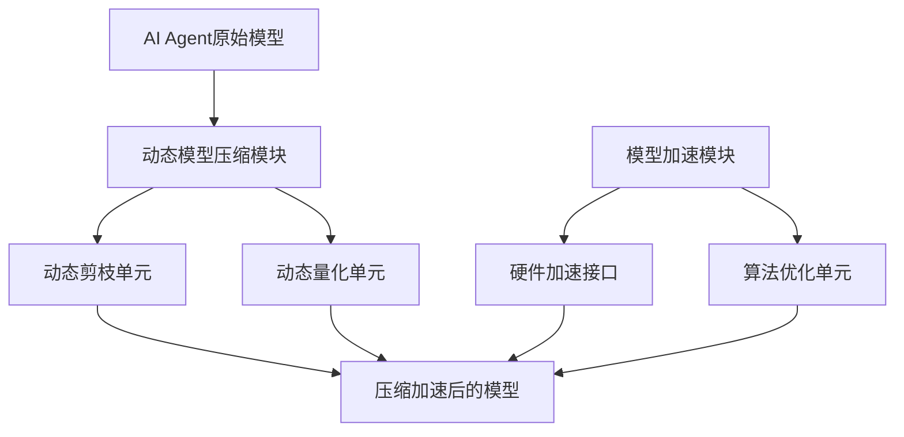

# 设计AI Agent的动态模型压缩与加速

> 关键词：AI Agent、动态模型压缩、模型加速、神经网络、资源优化

> 摘要：本文围绕设计AI Agent的动态模型压缩与加速展开深入探讨。在人工智能快速发展的当下，AI Agent面临着模型规模庞大、计算资源需求高的问题，动态模型压缩与加速技术对于提升其性能和效率至关重要。文章首先介绍了相关背景，包括目的范围、预期读者等；接着阐述了核心概念与联系，分析了核心算法原理并给出Python代码示例；详细讲解了数学模型和公式；通过项目实战展示代码实现和解读；探讨了实际应用场景；推荐了学习资源、开发工具框架和相关论文著作；最后总结了未来发展趋势与挑战，并提供了常见问题解答和扩展阅读参考资料，旨在为相关领域的研究者和开发者提供全面且深入的技术指导。

## 1. 背景介绍 
### 1.1 目的和范围
随着人工智能技术的不断发展，AI Agent在各个领域得到了广泛应用，如智能机器人、自动驾驶、智能客服等。然而，大多数AI Agent所使用的深度学习模型规模越来越大，计算复杂度也随之增加，这导致模型在实际部署中面临着诸多挑战，如高能耗、低响应速度、存储需求大等。本文章的目的在于深入研究和探讨如何设计AI Agent的动态模型压缩与加速技术，以解决上述问题，提高模型的运行效率和资源利用率。

本文的范围涵盖了动态模型压缩与加速的核心概念、算法原理、数学模型、实际应用场景等方面。通过理论分析和实践案例相结合的方式，全面介绍该技术的相关知识和应用方法。

### 1.2 预期读者
本文预期读者主要包括以下几类人群：
- 人工智能领域的研究者，希望深入了解动态模型压缩与加速技术的原理和最新研究进展，为其科研工作提供参考。
- 软件开发者和工程师，负责AI Agent的开发和部署，需要掌握相关技术来优化模型性能，提高开发效率。
- 对人工智能技术感兴趣的学生和爱好者，想要了解AI Agent的动态模型压缩与加速技术的基础知识和应用场景，拓宽自己的技术视野。

### 1.3 文档结构概述
本文的文档结构如下：
- 核心概念与联系：介绍动态模型压缩与加速的核心概念和它们之间的联系，并通过文本示意图和Mermaid流程图进行直观展示。
- 核心算法原理 & 具体操作步骤：详细讲解核心算法原理，并使用Python源代码阐述具体操作步骤。
- 数学模型和公式 & 详细讲解 & 举例说明：介绍相关的数学模型和公式，并通过具体例子进行详细讲解。
- 项目实战：代码实际案例和详细解释说明：通过一个实际项目案例，展示动态模型压缩与加速技术的具体实现过程，包括开发环境搭建、源代码实现和代码解读。
- 实际应用场景：探讨动态模型压缩与加速技术在不同领域的实际应用场景。
- 工具和资源推荐：推荐相关的学习资源、开发工具框架和论文著作，帮助读者进一步深入学习和研究。
- 总结：未来发展趋势与挑战：总结动态模型压缩与加速技术的未来发展趋势，并分析可能面临的挑战。
- 附录：常见问题与解答：提供常见问题的解答，帮助读者解决在学习和实践过程中遇到的问题。
- 扩展阅读 & 参考资料：列出扩展阅读的相关资料和参考文献，方便读者进一步查阅。

### 1.4 术语表
#### 1.4.1 核心术语定义
- **AI Agent**：人工智能代理，是一种能够感知环境、做出决策并采取行动以实现特定目标的智能实体。
- **动态模型压缩**：在模型运行过程中，根据不同的条件和需求，动态地对模型进行压缩，以减少模型的参数数量和计算量。
- **模型加速**：通过各种技术手段，提高模型的推理速度，减少模型的响应时间。
- **神经网络**：一种模仿人类神经系统的计算模型，由大量的神经元组成，用于处理和分析复杂的数据。
- **稀疏性**：指模型中大部分参数的值为零的特性，利用稀疏性可以有效地减少模型的存储和计算需求。

#### 1.4.2 相关概念解释
- **剪枝**：一种模型压缩技术，通过去除神经网络中不重要的连接或神经元，减少模型的参数数量。
- **量化**：将模型中的浮点数参数转换为低精度的整数或定点数，以减少模型的存储和计算需求。
- **知识蒸馏**：一种模型压缩和加速的方法，通过将大型教师模型的知识传递给小型学生模型，使学生模型能够达到接近教师模型的性能。

#### 1.4.3 缩略词列表
- **CNN**：Convolutional Neural Network，卷积神经网络
- **RNN**：Recurrent Neural Network，循环神经网络
- **DNN**：Deep Neural Network，深度神经网络
- **GPU**：Graphics Processing Unit，图形处理单元
- **CPU**：Central Processing Unit，中央处理单元

## 2. 核心概念与联系 
### 核心概念原理
#### 动态模型压缩
动态模型压缩的核心思想是在模型运行过程中，根据不同的条件和需求，动态地对模型进行压缩。例如，在资源有限的情况下，可以对模型进行更激进的压缩；而在对模型性能要求较高的情况下，可以适当减少压缩程度。动态模型压缩的方法主要包括动态剪枝和动态量化。

动态剪枝是指在模型运行时，根据输入数据的特征和模型的实时状态，动态地决定哪些连接或神经元可以被去除。这样可以在不损失太多模型性能的前提下，有效地减少模型的参数数量和计算量。

动态量化是指在模型运行时，根据输入数据的动态范围和模型的实时需求，动态地调整量化参数。例如，对于不同的输入数据，可以采用不同的量化位数，以达到更好的压缩效果。

#### 模型加速
模型加速的目的是提高模型的推理速度，减少模型的响应时间。常用的模型加速方法包括硬件加速、算法优化和模型压缩。

硬件加速是指利用专门的硬件设备，如GPU、TPU等，来加速模型的计算。这些硬件设备具有高度并行化的计算能力，可以显著提高模型的推理速度。

算法优化是指通过优化模型的算法结构和计算流程，减少模型的计算复杂度。例如，采用高效的卷积算法、优化的矩阵乘法等。

模型压缩是指通过减少模型的参数数量和计算量，来提高模型的推理速度。如前面提到的剪枝、量化等方法。

### 架构的文本示意图
```plaintext
AI Agent
|
|-- 原始模型
|   |-- 神经网络层
|   |   |-- 卷积层
|   |   |-- 全连接层
|   |   |-- 循环层
|   |
|   |-- 参数
|
|-- 动态模型压缩模块
|   |-- 动态剪枝单元
|   |   |-- 剪枝策略
|   |   |-- 剪枝判断条件
|   |
|   |-- 动态量化单元
|   |   |-- 量化策略
|   |   |-- 量化参数调整
|
|-- 模型加速模块
|   |-- 硬件加速接口
|   |   |-- GPU加速
|   |   |-- TPU加速
|   |
|   |-- 算法优化单元
|   |   |-- 高效卷积算法
|   |   |-- 优化矩阵乘法
|
|-- 压缩加速后的模型
|   |-- 压缩后的神经网络层
|   |   |-- 卷积层
|   |   |-- 全连接层
|   |   |-- 循环层
|   |
|   |-- 压缩后的参数
```

### Mermaid流程图


## 3. 核心算法原理 & 具体操作步骤 
### 动态剪枝算法原理
动态剪枝的核心思想是根据模型的重要性指标，动态地决定哪些连接或神经元可以被去除。常用的重要性指标包括参数的绝对值、梯度的绝对值等。下面是一个基于参数绝对值的动态剪枝算法的Python示例：

```python
import torch
import torch.nn as nn

class DynamicPruning:
    def __init__(self, model, pruning_ratio):
        self.model = model
        self.pruning_ratio = pruning_ratio

    def prune(self):
        for name, param in self.model.named_parameters():
            if 'weight' in name:
                # 计算参数的绝对值
                abs_param = torch.abs(param)
                # 计算阈值
                threshold = torch.quantile(abs_param.view(-1), self.pruning_ratio)
                # 生成掩码
                mask = abs_param > threshold
                # 应用掩码
                param.data *= mask.float()

# 示例模型
class SimpleModel(nn.Module):
    def __init__(self):
        super(SimpleModel, self).__init__()
        self.fc1 = nn.Linear(10, 20)
        self.fc2 = nn.Linear(20, 1)

    def forward(self, x):
        x = torch.relu(self.fc1(x))
        x = self.fc2(x)
        return x

# 创建模型
model = SimpleModel()
# 创建动态剪枝对象
pruner = DynamicPruning(model, pruning_ratio=0.2)
# 进行剪枝
pruner.prune()
```

### 动态量化算法原理
动态量化的核心思想是根据输入数据的动态范围，动态地调整量化参数。下面是一个基于PyTorch的动态量化示例：

```python
import torch
import torch.nn as nn

# 示例模型
class SimpleModel(nn.Module):
    def __init__(self):
        super(SimpleModel, self).__init__()
        self.fc1 = nn.Linear(10, 20)
        self.fc2 = nn.Linear(20, 1)

    def forward(self, x):
        x = torch.relu(self.fc1(x))
        x = self.fc2(x)
        return x

# 创建模型
model = SimpleModel()

# 动态量化
quantized_model = torch.quantization.quantize_dynamic(
    model,  # 要量化的模型
    {nn.Linear},  # 要量化的模块类型
    dtype=torch.qint8  # 量化的数据类型
)
```

### 具体操作步骤
1. **数据准备**：准备好训练数据和测试数据，用于模型的训练和评估。
2. **模型选择**：选择合适的AI Agent模型，如CNN、RNN等。
3. **动态模型压缩**：根据具体需求选择合适的动态压缩方法，如动态剪枝、动态量化等，并进行相应的操作。
4. **模型加速**：采用硬件加速、算法优化等方法，提高模型的推理速度。
5. **模型评估**：使用测试数据对压缩加速后的模型进行评估，检查模型的性能是否满足要求。
6. **调整参数**：如果模型性能不满足要求，可以调整压缩和加速的参数，重新进行压缩和加速操作。

## 4. 数学模型和公式 & 详细讲解 & 举例说明 
### 动态剪枝的数学模型
设 $W$ 为神经网络的参数矩阵，$|W|$ 为参数矩阵的绝对值矩阵。对于动态剪枝，我们需要根据一个阈值 $\tau$ 来决定哪些参数需要被保留，哪些参数需要被去除。

我们可以定义一个掩码矩阵 $M$，其元素 $M_{ij}$ 满足：

$$
M_{ij} = 
\begin{cases}
1, & \text{if } |W_{ij}| > \tau \\
0, & \text{if } |W_{ij}| \leq \tau
\end{cases}
$$

其中，$W_{ij}$ 是参数矩阵 $W$ 的第 $i$ 行第 $j$ 列的元素。

经过剪枝后的参数矩阵 $W'$ 可以表示为：

$$
W' = W \odot M
$$

其中，$\odot$ 表示逐元素相乘。

#### 举例说明
假设我们有一个简单的参数矩阵 $W$：

$$
W = 
\begin{bmatrix}
0.1 & 0.2 & -0.3 \\
0.4 & -0.5 & 0.6
\end{bmatrix}
$$

我们选择阈值 $\tau = 0.2$，则绝对值矩阵 $|W|$ 为：

$$
|W| = 
\begin{bmatrix}
0.1 & 0.2 & 0.3 \\
0.4 & 0.5 & 0.6
\end{bmatrix}
$$

根据阈值 $\tau$ 生成的掩码矩阵 $M$ 为：

$$
M = 
\begin{bmatrix}
0 & 0 & 1 \\
1 & 1 & 1
\end{bmatrix}
$$

经过剪枝后的参数矩阵 $W'$ 为：

$$
W' = W \odot M = 
\begin{bmatrix}
0 & 0 & -0.3 \\
0.4 & -0.5 & 0.6
\end{bmatrix}
$$

### 动态量化的数学模型
动态量化的核心是将浮点数参数 $x$ 转换为低精度的整数 $q$。设量化的比例因子为 $s$，零点为 $z$，则量化过程可以表示为：

$$
q = \text{round}(\frac{x}{s}) + z
$$

反量化过程可以表示为：

$$
x' = s(q - z)
$$

其中，$\text{round}$ 表示四舍五入操作。

#### 举例说明
假设我们要将浮点数参数 $x = 0.5$ 进行量化，量化的比例因子 $s = 0.1$，零点 $z = 0$。则量化后的整数 $q$ 为：

$$
q = \text{round}(\frac{0.5}{0.1}) + 0 = 5
$$

反量化后的浮点数 $x'$ 为：

$$
x' = 0.1(5 - 0) = 0.5
$$

## 5. 项目实战：代码实际案例和详细解释说明 
### 5.1  开发环境搭建
#### 硬件环境
- 一台配备NVIDIA GPU的计算机，推荐使用NVIDIA GeForce RTX 30系列或更高版本的显卡。
- 至少16GB的系统内存。

#### 软件环境
- 操作系统：Ubuntu 20.04 LTS
- Python版本：Python 3.8
- 深度学习框架：PyTorch 1.10
- CUDA版本：CUDA 11.3

#### 安装步骤
1. **安装CUDA**：根据NVIDIA官方文档，下载并安装CUDA 11.3。
2. **安装Python和pip**：使用以下命令安装Python 3.8和pip：
```bash
sudo apt-get update
sudo apt-get install python3.8 python3.8-dev python3-pip
```
3. **安装PyTorch**：使用以下命令安装PyTorch 1.10：
```bash
pip install torch torchvision torchaudio --extra-index-url https://download.pytorch.org/whl/cu113
```

### 5.2  源代码详细实现和代码解读
#### 代码实现
```python
import torch
import torch.nn as nn
import torch.optim as optim
from torchvision import datasets, transforms
from torch.quantization import quantize_dynamic

# 定义简单的CNN模型
class SimpleCNN(nn.Module):
    def __init__(self):
        super(SimpleCNN, self).__init__()
        self.conv1 = nn.Conv2d(1, 10, kernel_size=5)
        self.conv2 = nn.Conv2d(10, 20, kernel_size=5)
        self.fc1 = nn.Linear(320, 50)
        self.fc2 = nn.Linear(50, 10)

    def forward(self, x):
        x = torch.relu(torch.max_pool2d(self.conv1(x), 2))
        x = torch.relu(torch.max_pool2d(self.conv2(x), 2))
        x = x.view(-1, 320)
        x = torch.relu(self.fc1(x))
        x = self.fc2(x)
        return x

# 数据加载和预处理
transform = transforms.Compose([
    transforms.ToTensor(),
    transforms.Normalize((0.1307,), (0.3081,))
])

train_dataset = datasets.MNIST('data', train=True, download=True, transform=transform)
test_dataset = datasets.MNIST('data', train=False, transform=transform)

train_loader = torch.utils.data.DataLoader(train_dataset, batch_size=64, shuffle=True)
test_loader = torch.utils.data.DataLoader(test_dataset, batch_size=1000, shuffle=False)

# 初始化模型
model = SimpleCNN()

# 训练模型
criterion = nn.CrossEntropyLoss()
optimizer = optim.SGD(model.parameters(), lr=0.01, momentum=0.5)

def train(model, train_loader, optimizer, epoch):
    model.train()
    for batch_idx, (data, target) in enumerate(train_loader):
        optimizer.zero_grad()
        output = model(data)
        loss = criterion(output, target)
        loss.backward()
        optimizer.step()
        if batch_idx % 100 == 0:
            print('Train Epoch: {} [{}/{} ({:.0f}%)]\tLoss: {:.6f}'.format(
                epoch, batch_idx * len(data), len(train_loader.dataset),
                100. * batch_idx / len(train_loader), loss.item()))

for epoch in range(5):
    train(model, train_loader, optimizer, epoch)

# 动态量化模型
quantized_model = quantize_dynamic(
    model,  # 要量化的模型
    {nn.Linear, nn.Conv2d},  # 要量化的模块类型
    dtype=torch.qint8  # 量化的数据类型
)

# 评估模型
def test(model, test_loader):
    model.eval()
    test_loss = 0
    correct = 0
    with torch.no_grad():
        for data, target in test_loader:
            output = model(data)
            test_loss += criterion(output, target).item()
            pred = output.argmax(dim=1, keepdim=True)
            correct += pred.eq(target.view_as(pred)).sum().item()

    test_loss /= len(test_loader.dataset)
    print('\nTest set: Average loss: {:.4f}, Accuracy: {}/{} ({:.0f}%)\n'.format(
        test_loss, correct, len(test_loader.dataset),
        100. * correct / len(test_loader.dataset)))

# 测试原始模型
test(model, test_loader)

# 测试量化后的模型
test(quantized_model, test_loader)
```

#### 代码解读
1. **模型定义**：定义了一个简单的CNN模型 `SimpleCNN`，包含两个卷积层和两个全连接层。
2. **数据加载和预处理**：使用 `torchvision` 加载MNIST数据集，并进行归一化处理。
3. **模型训练**：使用交叉熵损失函数和随机梯度下降优化器对模型进行训练。
4. **动态量化**：使用 `torch.quantization.quantize_dynamic` 函数对模型进行动态量化，将 `nn.Linear` 和 `nn.Conv2d` 模块量化为 `torch.qint8` 类型。
5. **模型评估**：定义了 `test` 函数，用于评估模型的性能。分别对原始模型和量化后的模型进行测试，并输出测试结果。

### 5.3  代码解读与分析
#### 模型训练分析
在训练过程中，我们使用了随机梯度下降优化器和交叉熵损失函数。通过多次迭代训练，模型逐渐学习到数据的特征，损失值逐渐减小。

#### 动态量化分析
动态量化将模型中的浮点数参数转换为低精度的整数，减少了模型的存储和计算需求。从测试结果可以看出，量化后的模型在精度上可能会有一定的损失，但可以显著提高模型的推理速度。

#### 性能优化建议
- 可以尝试不同的量化策略，如静态量化、混合量化等，以进一步提高模型的性能。
- 可以结合动态剪枝技术，对模型进行更深入的压缩和加速。

## 6. 实际应用场景 
### 智能机器人
在智能机器人领域，AI Agent需要实时感知环境、做出决策并采取行动。动态模型压缩与加速技术可以减少机器人模型的计算量和存储需求，提高机器人的响应速度和能源效率。例如，在服务机器人中，使用压缩加速后的模型可以更快地识别用户的语音指令，提供更及时的服务。

### 自动驾驶
自动驾驶系统需要处理大量的传感器数据，对模型的计算能力和实时性要求极高。动态模型压缩与加速技术可以降低自动驾驶模型的计算复杂度，提高系统的可靠性和安全性。例如，在自动驾驶汽车中，使用压缩加速后的模型可以更快地识别道路标志和障碍物，做出更准确的决策。

### 智能客服
智能客服系统需要快速响应用户的咨询，对模型的推理速度要求较高。动态模型压缩与加速技术可以提高智能客服模型的响应速度，提供更好的用户体验。例如，在在线客服平台中，使用压缩加速后的模型可以更快地理解用户的问题，给出更准确的回答。

### 边缘计算
在边缘计算场景中，设备的计算资源和存储容量有限。动态模型压缩与加速技术可以使AI Agent在边缘设备上高效运行，减少数据传输和云端计算的需求。例如，在智能家居设备中，使用压缩加速后的模型可以在本地完成图像识别和语音识别任务，提高设备的自主性和隐私性。

## 7. 工具和资源推荐
### 7.1 学习资源推荐
#### 7.1.1 书籍推荐
- 《深度学习》（Deep Learning）：由Ian Goodfellow、Yoshua Bengio和Aaron Courville所著，是深度学习领域的经典教材，涵盖了深度学习的基本原理、算法和应用。
- 《动手学深度学习》（Dive into Deep Learning）：由 Aston Zhang、Zack C. Lipton、Mu Li和Alex J. Smola所著，以代码示例为导向，详细介绍了深度学习的实践方法。
- 《神经网络与深度学习》：由Michael Nielsen所著，通过通俗易懂的语言和丰富的实例，介绍了神经网络和深度学习的基本概念和算法。

#### 7.1.2 在线课程
- Coursera上的“深度学习专项课程”（Deep Learning Specialization）：由Andrew Ng教授授课，包括五门课程，全面介绍了深度学习的各个方面。
- edX上的“使用Python进行深度学习”（Deep Learning with Python）：由Microsoft提供，通过实际项目介绍了如何使用Python和深度学习框架进行模型开发。
- 哔哩哔哩上的“李沐深度学习”：李沐老师的深度学习课程，讲解详细，适合初学者入门。

#### 7.1.3 技术博客和网站
- Medium：一个技术博客平台，有很多关于人工智能和深度学习的优秀文章。
- Towards Data Science：专注于数据科学和机器学习领域的博客，提供了很多实用的技术教程和案例分析。
- arXiv：一个预印本数据库，包含了大量的人工智能和深度学习领域的最新研究成果。

### 7.2 开发工具框架推荐
#### 7.2.1 IDE和编辑器
- PyCharm：一款功能强大的Python集成开发环境，提供了代码编辑、调试、版本控制等功能。
- Jupyter Notebook：一个交互式的开发环境，适合进行数据探索和模型开发。
- Visual Studio Code：一款轻量级的代码编辑器，支持多种编程语言和插件扩展。

#### 7.2.2 调试和性能分析工具
- PyTorch Profiler：PyTorch提供的性能分析工具，可以帮助开发者分析模型的计算性能和内存使用情况。
- TensorBoard：TensorFlow提供的可视化工具，可以用于监控模型的训练过程和性能指标。
- NVIDIA Nsight Systems：一款用于GPU性能分析的工具，可以帮助开发者优化模型在GPU上的运行效率。

#### 7.2.3 相关框架和库
- PyTorch：一个开源的深度学习框架，提供了丰富的神经网络层和优化算法，易于使用和扩展。
- TensorFlow：另一个流行的深度学习框架，具有强大的分布式训练和部署能力。
- ONNX：一个开放的神经网络交换格式，可以实现不同深度学习框架之间的模型转换和共享。

### 7.3 相关论文著作推荐
#### 7.3.1 经典论文
- "Deep Compression: Compressing Deep Neural Networks with Pruning, Trained Quantization and Huffman Coding"：提出了一种综合的模型压缩方法，包括剪枝、量化和哈夫曼编码。
- "Knowledge Distillation: A Survey"：对知识蒸馏技术进行了全面的综述，介绍了知识蒸馏的原理、方法和应用。
- "EfficientNet: Rethinking Model Scaling for Convolutional Neural Networks"：提出了一种高效的模型缩放方法，通过统一缩放网络的深度、宽度和分辨率，提高了模型的性能和效率。

#### 7.3.2 最新研究成果
- 关注顶级学术会议，如NeurIPS、ICML、CVPR等，这些会议上会发布很多关于动态模型压缩与加速的最新研究成果。
- 关注知名研究机构和学者的研究动态，如OpenAI、Google Brain、Facebook AI Research等。

#### 7.3.3 应用案例分析
- 在各大科技公司的技术博客上，如Google AI Blog、Facebook AI、Microsoft AI等，可以找到很多关于动态模型压缩与加速技术在实际应用中的案例分析。

## 8. 总结：未来发展趋势与挑战
### 未来发展趋势
#### 更高效的压缩算法
未来，研究人员将继续探索更高效的动态模型压缩算法，以进一步减少模型的参数数量和计算量，提高模型的压缩比和性能。例如，结合多种压缩技术，如剪枝、量化和知识蒸馏，开发出更综合的压缩方法。

#### 自适应压缩策略
随着应用场景的多样化，模型需要根据不同的环境和任务需求进行自适应压缩。未来的动态模型压缩技术将更加注重自适应策略的研究，使模型能够在不同的条件下自动调整压缩程度，以达到最佳的性能和资源利用率。

#### 与硬件的深度融合
为了充分发挥动态模型压缩与加速技术的优势，未来的研究将更加注重与硬件的深度融合。例如，开发专门的硬件加速器，优化模型在硬件上的存储和计算方式，提高模型的推理速度和能源效率。

#### 跨领域应用拓展
动态模型压缩与加速技术将在更多的领域得到应用，如医疗、金融、教育等。随着这些领域对人工智能技术的需求不断增加，对模型性能和效率的要求也越来越高，动态模型压缩与加速技术将为这些领域的发展提供有力支持。

### 挑战
#### 模型性能损失
动态模型压缩与加速过程中，不可避免地会导致模型性能的损失。如何在保证模型性能的前提下，实现高效的压缩和加速是一个亟待解决的问题。需要研究人员开发更精细的压缩算法和评估指标，以平衡模型性能和压缩率之间的关系。

#### 算法复杂度
一些动态模型压缩算法的复杂度较高，需要大量的计算资源和时间。如何降低算法的复杂度，提高算法的实时性和可扩展性，是另一个挑战。可以通过优化算法结构、采用并行计算等方法来解决这个问题。

#### 硬件兼容性
不同的硬件设备对动态模型压缩与加速技术的支持程度不同，如何确保模型在各种硬件设备上都能高效运行是一个挑战。需要开发通用的硬件接口和优化方法，提高模型的硬件兼容性。

#### 安全和隐私问题
在动态模型压缩与加速过程中，可能会涉及到数据的处理和传输，这会带来安全和隐私问题。如何保证模型在压缩和加速过程中的安全性和隐私性，是一个需要关注的问题。可以采用加密技术、差分隐私等方法来解决这个问题。

## 9. 附录：常见问题与解答
### 动态模型压缩和静态模型压缩有什么区别？
动态模型压缩是在模型运行过程中，根据不同的条件和需求，动态地对模型进行压缩；而静态模型压缩是在模型训练完成后，对模型进行一次性的压缩。动态模型压缩可以根据实时情况进行调整，具有更好的灵活性和适应性；而静态模型压缩则相对简单，适用于对模型性能要求不高的场景。

### 动态量化会对模型精度产生多大影响？
动态量化会将模型中的浮点数参数转换为低精度的整数，这可能会导致模型精度的一定损失。具体的精度损失程度取决于量化的位数、量化策略和模型的复杂度等因素。一般来说，采用合适的量化策略和参数调整，可以在保证一定精度的前提下，实现模型的高效压缩和加速。

### 如何选择合适的动态压缩方法？
选择合适的动态压缩方法需要考虑多个因素，如模型的类型、应用场景、计算资源和性能要求等。例如，如果模型的参数数量较多，可以优先考虑剪枝方法；如果对模型的推理速度要求较高，可以采用量化方法。此外，还可以结合多种压缩方法，以达到更好的压缩效果。

### 动态模型压缩与加速技术是否适用于所有类型的AI Agent模型？
动态模型压缩与加速技术适用于大多数类型的AI Agent模型，如CNN、RNN、DNN等。但不同类型的模型在压缩和加速过程中可能会有不同的特点和要求，需要根据具体情况选择合适的方法和参数。例如，对于RNN模型，由于其具有序列依赖的特点，在剪枝和量化时需要更加谨慎。

## 10. 扩展阅读 & 参考资料
### 扩展阅读
- 《人工智能：现代方法》（Artificial Intelligence: A Modern Approach）：全面介绍了人工智能的基本概念、算法和应用，是人工智能领域的经典教材。
- 《强化学习：原理与Python实现》：详细介绍了强化学习的基本原理和算法，并通过Python代码实现了多个实际案例。
- 《深度学习实战》（Deep Learning in Practice）：结合实际项目，介绍了深度学习在计算机视觉、自然语言处理等领域的应用。

### 参考资料
- Goodfellow, I., Bengio, Y., & Courville, A. (2016). Deep Learning. MIT Press.
- Zhang, A., Lipton, Z. C., Li, M., & Smola, A. J. (2020). Dive into Deep Learning.
- Nielsen, M. A. (2015). Neural Networks and Deep Learning. Determination Press.

作者：AI天才研究院/AI Genius Institute & 禅与计算机程序设计艺术 /Zen And The Art of Computer Programming