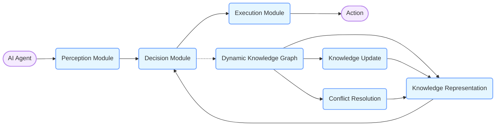

# 设计AI Agent的动态知识图谱推理引擎

> 关键词：AI Agent、动态知识图谱、推理引擎、知识表示、推理算法

> 摘要：本文围绕设计AI Agent的动态知识图谱推理引擎展开。首先介绍了相关背景，包括目的、预期读者、文档结构和术语表。接着阐述了核心概念与联系，给出了原理和架构的示意图及流程图。详细讲解了核心算法原理和具体操作步骤，使用Python代码进行说明。探讨了数学模型和公式，并举例说明。通过项目实战，展示了代码实际案例和详细解释。分析了实际应用场景，推荐了相关工具和资源。最后总结了未来发展趋势与挑战，提供了常见问题解答和扩展阅读参考资料，旨在为设计高效的动态知识图谱推理引擎提供全面的技术指导。

## 1. 背景介绍 
### 1.1 目的和范围
在当今人工智能快速发展的时代，知识图谱作为一种强大的知识表示和管理工具，被广泛应用于各种领域。然而，传统的知识图谱往往是静态的，难以适应不断变化的现实世界。AI Agent需要能够动态地更新和推理知识，以更好地完成各种任务。因此，设计一个动态知识图谱推理引擎具有重要的现实意义。

本文的范围主要涵盖了动态知识图谱推理引擎的设计原理、核心算法、数学模型、项目实战以及实际应用场景等方面。通过本文的学习，读者将能够深入了解如何设计一个高效的动态知识图谱推理引擎，并将其应用到实际项目中。

### 1.2 预期读者
本文预期读者包括人工智能领域的研究人员、开发者、数据科学家以及对知识图谱和推理引擎感兴趣的技术爱好者。具备一定的编程基础（如Python）和机器学习知识将有助于更好地理解本文内容。

### 1.3 文档结构概述
本文将按照以下结构进行组织：
1. **背景介绍**：介绍设计动态知识图谱推理引擎的目的、预期读者和文档结构。
2. **核心概念与联系**：阐述动态知识图谱、AI Agent和推理引擎的核心概念，以及它们之间的联系，并给出相关的示意图和流程图。
3. **核心算法原理 & 具体操作步骤**：详细讲解推理引擎所使用的核心算法原理，并给出具体的操作步骤，同时使用Python代码进行说明。
4. **数学模型和公式 & 详细讲解 & 举例说明**：介绍推理引擎的数学模型和相关公式，并通过具体例子进行详细讲解。
5. **项目实战：代码实际案例和详细解释说明**：通过一个实际项目案例，展示如何开发一个动态知识图谱推理引擎，包括开发环境搭建、源代码实现和代码解读。
6. **实际应用场景**：分析动态知识图谱推理引擎在不同领域的实际应用场景。
7. **工具和资源推荐**：推荐一些学习资源、开发工具框架和相关论文著作。
8. **总结：未来发展趋势与挑战**：总结动态知识图谱推理引擎的未来发展趋势和面临的挑战。
9. **附录：常见问题与解答**：提供一些常见问题的解答。
10. **扩展阅读 & 参考资料**：列出相关的扩展阅读材料和参考资料。

### 1.4 术语表
#### 1.4.1 核心术语定义
- **AI Agent**：人工智能代理，是一种能够感知环境、做出决策并采取行动的智能实体。
- **动态知识图谱**：一种可以动态更新和扩展的知识图谱，能够反映现实世界的变化。
- **推理引擎**：一种基于知识图谱进行推理和推断的系统，能够从已知的知识中推导出新的知识。
- **知识表示**：将知识以计算机能够理解和处理的形式进行表示的方法。
- **推理算法**：用于在知识图谱上进行推理的算法，如基于规则的推理算法、基于深度学习的推理算法等。

#### 1.4.2 相关概念解释
- **知识图谱**：是一种语义网络，用于表示实体之间的关系和属性。它以图的形式组织知识，其中节点表示实体，边表示实体之间的关系。
- **本体**：是对概念和关系的形式化描述，用于定义知识图谱的结构和语义。
- **语义推理**：是基于知识图谱的语义信息进行推理的过程，能够从已知的事实中推导出新的事实。

#### 1.4.3 缩略词列表
- **KG**：Knowledge Graph，知识图谱
- **AI**：Artificial Intelligence，人工智能
- **RDF**：Resource Description Framework，资源描述框架
- **OWL**：Web Ontology Language，网络本体语言

## 2. 核心概念与联系 
### 核心概念原理
#### 动态知识图谱
动态知识图谱是在传统知识图谱的基础上发展而来的，它能够动态地更新和扩展知识。传统知识图谱通常是静态的，一旦构建完成，其内容就相对固定。而动态知识图谱可以实时地获取新的信息，并将其融入到现有的知识图谱中。例如，在金融领域，股票价格、公司财报等信息是不断变化的，动态知识图谱可以及时更新这些信息，以便更好地进行金融分析和决策。

动态知识图谱的构建需要考虑知识的更新机制、冲突解决机制等问题。知识的更新可以通过实时数据采集、机器学习模型预测等方式实现。冲突解决机制则用于处理新加入的知识与现有知识之间的冲突，确保知识图谱的一致性和准确性。

#### AI Agent
AI Agent是一种具有智能行为的实体，它能够感知环境、做出决策并采取行动。在动态知识图谱推理引擎中，AI Agent可以利用知识图谱中的知识进行推理和决策。例如，在智能客服系统中，AI Agent可以根据用户的问题，从知识图谱中查找相关的信息，并给出准确的回答。

AI Agent通常由感知模块、决策模块和执行模块组成。感知模块用于获取环境信息，决策模块根据感知到的信息和知识图谱中的知识进行推理和决策，执行模块则根据决策结果采取相应的行动。

#### 推理引擎
推理引擎是动态知识图谱推理系统的核心组件，它负责在知识图谱上进行推理和推断。推理引擎可以根据已知的事实和规则，推导出新的事实和结论。例如，在医学领域，推理引擎可以根据患者的症状和病历信息，结合医学知识图谱中的知识，推断出可能的疾病和治疗方案。

推理引擎的推理方式主要包括基于规则的推理和基于统计的推理。基于规则的推理是根据预先定义的规则进行推理，而基于统计的推理则是利用机器学习和统计学方法进行推理。

### 架构的文本示意图
```plaintext
+---------------------+
|      AI Agent       |
| +-----------------+ |
| |  Perception     | |
| |  Module         | |
| +-----------------+ |
| +-----------------+ |
| |  Decision       | |
| |  Module         | |
| |  (Reasoning     | |
| |   Engine)       | |
| +-----------------+ |
| +-----------------+ |
| |  Execution      | |
| |  Module         | |
| +-----------------+ |
+---------------------+
         |
         v
+---------------------+
|  Dynamic Knowledge  |
|     Graph           |
| +-----------------+ |
| |  Knowledge       | |
| |  Representation  | |
| +-----------------+ |
| +-----------------+ |
| |  Knowledge       | |
| |  Update          | |
| +-----------------+ |
| +-----------------+ |
| |  Conflict        | |
| |  Resolution      | |
| +-----------------+ |
+---------------------+
```

### Mermaid 流程图


这个流程图展示了AI Agent和动态知识图谱之间的交互过程。AI Agent通过感知模块获取环境信息，然后将信息传递给决策模块。决策模块利用动态知识图谱进行推理和决策，并将决策结果传递给执行模块。执行模块根据决策结果采取相应的行动。同时，动态知识图谱会不断地进行知识更新和冲突解决，以保证知识的准确性和一致性。

## 3. 核心算法原理 & 具体操作步骤 
### 核心算法原理
在动态知识图谱推理引擎中，我们将使用基于规则的推理算法和基于嵌入的推理算法相结合的方法。

#### 基于规则的推理算法
基于规则的推理算法是根据预先定义的规则进行推理的方法。规则通常以“如果...那么...”的形式表示，例如：“如果A是B的父亲，B是C的父亲，那么A是C的祖父”。在知识图谱中，我们可以将规则表示为逻辑表达式，然后通过匹配和推理来得出新的结论。

#### 基于嵌入的推理算法
基于嵌入的推理算法是将知识图谱中的实体和关系映射到低维向量空间中，然后利用向量之间的运算来进行推理。例如，我们可以通过计算实体向量之间的相似度来判断它们之间的关系。基于嵌入的推理算法可以利用深度学习模型来学习实体和关系的向量表示，从而提高推理的准确性和效率。

### 具体操作步骤
#### 步骤1：知识图谱的构建和预处理
首先，我们需要构建一个动态知识图谱。可以使用现有的知识图谱数据，也可以通过爬虫等方式从互联网上收集数据。然后，对收集到的数据进行预处理，包括数据清洗、实体识别、关系抽取等操作，将数据转换为知识图谱的格式。

#### 步骤2：规则的定义和存储
根据具体的应用场景，定义一系列的推理规则。规则可以用自然语言描述，然后转换为逻辑表达式。将定义好的规则存储在规则库中，以便后续的推理使用。

#### 步骤3：实体和关系的嵌入学习
使用深度学习模型（如TransE、DistMult等）对知识图谱中的实体和关系进行嵌入学习。将实体和关系映射到低维向量空间中，得到它们的向量表示。

#### 步骤4：推理过程
在推理过程中，首先使用基于规则的推理算法对知识图谱进行推理，得出一些初步的结论。然后，使用基于嵌入的推理算法对这些结论进行验证和扩展。具体步骤如下：
1. **规则匹配**：遍历规则库中的规则，将规则的前提条件与知识图谱中的事实进行匹配。如果匹配成功，则根据规则的结论部分得出新的事实。
2. **嵌入推理**：对于得出的新事实，使用基于嵌入的推理算法进行验证。计算新事实中实体和关系的向量表示，然后判断它们是否符合知识图谱的语义。如果符合，则将新事实加入到知识图谱中。
3. **循环推理**：重复步骤1和步骤2，直到没有新的事实可以得出为止。

### Python源代码实现
```python
import numpy as np
from rdflib import Graph, Literal, RDF, URIRef
from sklearn.metrics.pairwise import cosine_similarity

# 步骤1：知识图谱的构建和预处理
# 这里使用rdflib库构建一个简单的知识图谱
g = Graph()
# 定义实体和关系
alice = URIRef("http://example.org/Alice")
bob = URIRef("http://example.org/Bob")
father = URIRef("http://example.org/father")
# 添加事实到知识图谱中
g.add((alice, father, bob))

# 步骤2：规则的定义和存储
# 定义一个简单的规则：如果A是B的父亲，那么B是A的儿子
rule = {
    "前提": [(None, father, None)],
    "结论": [(None, URIRef("http://example.org/son"), None)]
}

# 步骤3：实体和关系的嵌入学习
# 这里简单模拟实体和关系的嵌入向量
entity_embeddings = {
    alice: np.array([0.1, 0.2]),
    bob: np.array([0.3, 0.4])
}
relation_embeddings = {
    father: np.array([0.5, 0.6]),
    URIRef("http://example.org/son"): np.array([0.7, 0.8])
}

# 步骤4：推理过程
def rule_matching(rule, graph):
    """
    规则匹配函数
    """
    matches = []
    for pattern in rule["前提"]:
        # 进行模式匹配
        results = list(graph.triples(pattern))
        if results:
            matches.extend(results)
    return matches

def embedding_reasoning(new_fact, entity_embeddings, relation_embeddings):
    """
    嵌入推理函数
    """
    head, relation, tail = new_fact
    head_emb = entity_embeddings[head]
    relation_emb = relation_embeddings[relation]
    tail_emb = entity_embeddings[tail]
    # 计算相似度
    similarity = cosine_similarity([head_emb + relation_emb], [tail_emb])
    if similarity[0][0] > 0.8:
        return True
    return False

# 规则匹配
matches = rule_matching(rule, g)
for match in matches:
    head, relation, tail = match
    # 生成新事实
    new_fact = (tail, URIRef("http://example.org/son"), head)
    # 嵌入推理
    if embedding_reasoning(new_fact, entity_embeddings, relation_embeddings):
        # 将新事实加入到知识图谱中
        g.add(new_fact)

# 输出推理后的知识图谱
for s, p, o in g:
    print(f"{s} {p} {o}")
```

### 代码解释
1. **知识图谱的构建和预处理**：使用`rdflib`库构建一个简单的知识图谱，并添加一些事实。
2. **规则的定义和存储**：定义一个简单的规则，并将其存储在字典中。
3. **实体和关系的嵌入学习**：简单模拟实体和关系的嵌入向量。
4. **推理过程**：
    - `rule_matching`函数用于进行规则匹配，找出符合规则前提条件的事实。
    - `embedding_reasoning`函数用于进行嵌入推理，判断新事实是否符合知识图谱的语义。
    - 最后，将符合条件的新事实加入到知识图谱中，并输出推理后的知识图谱。

## 4. 数学模型和公式 & 详细讲解 & 举例说明 
### 基于规则的推理数学模型
在基于规则的推理中，规则可以用一阶逻辑来表示。假设我们有一个规则 $R$，它的前提条件为 $P$，结论为 $C$，则规则可以表示为 $P \rightarrow C$。

在知识图谱中，事实可以用三元组 $(h, r, t)$ 表示，其中 $h$ 表示头实体，$r$ 表示关系，$t$ 表示尾实体。规则匹配的过程就是判断知识图谱中的事实是否满足规则的前提条件。

例如，对于规则“如果A是B的父亲，B是C的父亲，那么A是C的祖父”，可以表示为：
$$
((h_1, r_{father}, h_2) \land (h_2, r_{father}, h_3)) \rightarrow (h_1, r_{grandfather}, h_3)
$$

### 基于嵌入的推理数学模型
在基于嵌入的推理中，我们将实体和关系映射到低维向量空间中。假设实体 $e$ 的嵌入向量为 $\mathbf{e}$，关系 $r$ 的嵌入向量为 $\mathbf{r}$。对于一个三元组 $(h, r, t)$，我们可以通过计算其得分函数 $f(h, r, t)$ 来判断该三元组是否成立。

常见的得分函数有 TransE 模型中的距离函数：
$$
f(h, r, t) = - \|\mathbf{h} + \mathbf{r} - \mathbf{t}\|_2
$$

其中，$\|\cdot\|_2$ 表示 L2 范数。得分函数的值越大，说明该三元组成立的可能性越大。

### 详细讲解
#### 基于规则的推理
基于规则的推理是一种确定性的推理方法，它根据预先定义的规则进行推理。规则的前提条件和结论都是明确的，因此推理结果是可解释的。在实际应用中，规则可以由领域专家手动定义，也可以通过机器学习算法自动挖掘。

#### 基于嵌入的推理
基于嵌入的推理是一种基于统计的推理方法，它通过学习实体和关系的向量表示来进行推理。嵌入向量可以捕捉到实体和关系之间的语义信息，因此可以提高推理的准确性。基于嵌入的推理方法通常需要大量的训练数据，并且推理结果的可解释性相对较差。

### 举例说明
#### 基于规则的推理举例
假设我们有一个知识图谱，其中包含以下事实：
- (Alice, father, Bob)
- (Bob, father, Charlie)

根据规则“如果A是B的父亲，B是C的父亲，那么A是C的祖父”，我们可以推导出新的事实：
- (Alice, grandfather, Charlie)

#### 基于嵌入的推理举例
假设我们使用 TransE 模型学习到了实体和关系的嵌入向量：
- $\mathbf{Alice} = [0.1, 0.2]$
- $\mathbf{Bob} = [0.3, 0.4]$
- $\mathbf{Charlie} = [0.5, 0.6]$
- $\mathbf{father} = [0.5, 0.6]$
- $\mathbf{grandfather} = [0.7, 0.8]$

对于三元组 (Alice, grandfather, Charlie)，我们可以计算其得分函数：
$$
f(Alice, grandfather, Charlie) = - \| [0.1, 0.2] + [0.7, 0.8] - [0.5, 0.6] \|_2
$$
$$
= - \| [0.3, 0.4] \|_2
$$
$$
= - \sqrt{0.3^2 + 0.4^2}
$$
$$
= - 0.5
$$

如果得分函数的值大于某个阈值，我们就认为该三元组成立。

## 5. 项目实战：代码实际案例和详细解释说明 
### 5.1  开发环境搭建
#### 操作系统
建议使用 Linux 或 macOS 操作系统，因为它们对 Python 和相关库的支持更好。

#### Python 版本
建议使用 Python 3.7 及以上版本。

#### 安装依赖库
我们需要安装一些必要的 Python 库，包括`rdflib`、`numpy`、`scikit-learn`等。可以使用以下命令进行安装：
```bash
pip install rdflib numpy scikit-learn
```

### 5.2  源代码详细实现和代码解读
以下是一个完整的动态知识图谱推理引擎的实现代码：
```python
import numpy as np
from rdflib import Graph, Literal, RDF, URIRef
from sklearn.metrics.pairwise import cosine_similarity

# 步骤1：知识图谱的构建和预处理
def build_knowledge_graph():
    g = Graph()
    # 定义实体和关系
    alice = URIRef("http://example.org/Alice")
    bob = URIRef("http://example.org/Bob")
    charlie = URIRef("http://example.org/Charlie")
    father = URIRef("http://example.org/father")
    # 添加事实到知识图谱中
    g.add((alice, father, bob))
    g.add((bob, father, charlie))
    return g

# 步骤2：规则的定义和存储
def define_rules():
    # 定义一个简单的规则：如果A是B的父亲，B是C的父亲，那么A是C的祖父
    rule = {
        "前提": [(None, URIRef("http://example.org/father"), None), (None, URIRef("http://example.org/father"), None)],
        "结论": [(None, URIRef("http://example.org/grandfather"), None)]
    }
    return [rule]

# 步骤3：实体和关系的嵌入学习
def embedding_learning(knowledge_graph):
    entities = set()
    relations = set()
    for s, p, o in knowledge_graph:
        entities.add(s)
        entities.add(o)
        relations.add(p)
    entity_embeddings = {entity: np.random.rand(10) for entity in entities}
    relation_embeddings = {relation: np.random.rand(10) for relation in relations}
    return entity_embeddings, relation_embeddings

# 步骤4：推理过程
def rule_matching(rule, graph):
    """
    规则匹配函数
    """
    matches = []
    sub_matches = []
    for pattern in rule["前提"]:
        # 进行模式匹配
        results = list(graph.triples(pattern))
        if results:
            sub_matches.append(results)
    # 生成所有可能的组合
    from itertools import product
    for combination in product(*sub_matches):
        # 检查组合是否符合规则
        if len(set([triple[0] for triple in combination] + [triple[2] for triple in combination])) == 3:
            matches.append(combination)
    return matches

def embedding_reasoning(new_fact, entity_embeddings, relation_embeddings):
    """
    嵌入推理函数
    """
    head, relation, tail = new_fact
    head_emb = entity_embeddings[head]
    relation_emb = relation_embeddings[relation]
    tail_emb = entity_embeddings[tail]
    # 计算相似度
    similarity = cosine_similarity([head_emb + relation_emb], [tail_emb])
    if similarity[0][0] > 0.8:
        return True
    return False

def reasoning_engine(knowledge_graph, rules, entity_embeddings, relation_embeddings):
    new_facts = []
    for rule in rules:
        matches = rule_matching(rule, knowledge_graph)
        for match in matches:
            # 生成新事实
            head = match[0][0]
            tail = match[1][2]
            new_relation = rule["结论"][0][1]
            new_fact = (head, new_relation, tail)
            # 嵌入推理
            if embedding_reasoning(new_fact, entity_embeddings, relation_embeddings):
                new_facts.append(new_fact)
    # 将新事实加入到知识图谱中
    for new_fact in new_facts:
        knowledge_graph.add(new_fact)
    return knowledge_graph

# 主函数
def main():
    # 构建知识图谱
    knowledge_graph = build_knowledge_graph()
    # 定义规则
    rules = define_rules()
    # 实体和关系的嵌入学习
    entity_embeddings, relation_embeddings = embedding_learning(knowledge_graph)
    # 推理过程
    new_knowledge_graph = reasoning_engine(knowledge_graph, rules, entity_embeddings, relation_embeddings)
    # 输出推理后的知识图谱
    for s, p, o in new_knowledge_graph:
        print(f"{s} {p} {o}")

if __name__ == "__main__":
    main()
```

### 5.3  代码解读与分析
#### 代码结构
- `build_knowledge_graph`函数：用于构建知识图谱，添加一些初始的事实。
- `define_rules`函数：定义推理规则。
- `embedding_learning`函数：对实体和关系进行嵌入学习，这里简单地使用随机向量作为嵌入向量。
- `rule_matching`函数：进行规则匹配，找出符合规则前提条件的事实组合。
- `embedding_reasoning`函数：进行嵌入推理，判断新事实是否符合知识图谱的语义。
- `reasoning_engine`函数：综合规则匹配和嵌入推理，将符合条件的新事实加入到知识图谱中。
- `main`函数：主函数，调用上述函数完成整个推理过程，并输出推理后的知识图谱。

#### 代码分析
- **知识图谱的构建**：使用`rdflib`库构建知识图谱，通过`add`方法添加事实。
- **规则的定义**：规则以字典的形式存储，包含前提条件和结论。
- **嵌入学习**：使用随机向量作为实体和关系的嵌入向量，实际应用中可以使用更复杂的深度学习模型进行学习。
- **推理过程**：先进行规则匹配，找出符合规则的事实组合，然后进行嵌入推理，判断新事实是否成立。最后将符合条件的新事实加入到知识图谱中。

## 6. 实际应用场景 
### 智能客服系统
在智能客服系统中，动态知识图谱推理引擎可以根据用户的问题，从知识图谱中查找相关的信息，并给出准确的回答。例如，用户询问“如何办理信用卡”，推理引擎可以根据知识图谱中的信息，推导出办理信用卡的流程和所需材料，并将这些信息反馈给用户。同时，知识图谱可以实时更新，以反映最新的业务规则和政策。

### 金融风险评估
在金融领域，动态知识图谱推理引擎可以用于风险评估。通过构建包含企业、个人、金融产品等实体和它们之间关系的知识图谱，推理引擎可以根据已知的信息，推断出潜在的风险。例如，通过分析企业的财务报表、信用记录和行业动态等信息，推理引擎可以预测企业的违约风险，并为金融机构提供决策支持。

### 医疗诊断辅助
在医疗领域，动态知识图谱推理引擎可以辅助医生进行诊断。知识图谱中包含了疾病、症状、治疗方法等信息，推理引擎可以根据患者的症状和病历信息，结合知识图谱中的知识，推断出可能的疾病和治疗方案。同时，知识图谱可以实时更新，以反映最新的医学研究成果和临床经验。

### 智能推荐系统
在智能推荐系统中，动态知识图谱推理引擎可以根据用户的历史行为和偏好，从知识图谱中推荐相关的商品或服务。例如，在电商平台上，推理引擎可以根据用户的购买记录、浏览历史和收藏信息，推荐用户可能感兴趣的商品。同时，知识图谱可以实时更新，以反映商品的库存、价格和评价等信息。

## 7. 工具和资源推荐
### 7.1 学习资源推荐
#### 7.1.1 书籍推荐
- 《知识图谱：方法、实践与应用》：全面介绍了知识图谱的基本概念、构建方法、推理技术和应用案例。
- 《人工智能：一种现代的方法》：经典的人工智能教材，涵盖了知识表示、推理、机器学习等多个方面的内容。
- 《深度学习》：由深度学习领域的三位顶尖专家撰写，详细介绍了深度学习的原理和应用。

#### 7.1.2 在线课程
- Coursera上的“Knowledge Graphs”课程：由阿姆斯特丹大学的教授授课，介绍了知识图谱的基本概念、构建方法和应用场景。
- edX上的“Artificial Intelligence”课程：由麻省理工学院的教授授课，涵盖了人工智能的各个方面，包括知识表示、推理和机器学习等。
- 中国大学MOOC上的“深度学习”课程：由北京大学的教授授课，详细介绍了深度学习的原理和应用。

#### 7.1.3 技术博客和网站
- 开源知识图谱社区（OpenKG）：提供了丰富的知识图谱资源和案例，包括数据集、工具和论文等。
- 人工智能前沿技术（AI Frontier）：关注人工智能领域的最新研究成果和应用案例，提供了很多有价值的技术文章和分析。
- 机器之心：专注于人工智能领域的科技媒体，报道了很多前沿的研究成果和行业动态。

### 7.2 开发工具框架推荐
#### 7.2.1 IDE和编辑器
- PyCharm：功能强大的Python集成开发环境，支持代码调试、版本控制等功能。
- Jupyter Notebook：交互式的开发环境，适合进行数据分析和模型实验。
- Visual Studio Code：轻量级的代码编辑器，支持多种编程语言和插件扩展。

#### 7.2.2 调试和性能分析工具
- PDB：Python自带的调试工具，可以帮助开发者定位代码中的问题。
- cProfile：Python的性能分析工具，可以分析代码的运行时间和内存使用情况。
- TensorBoard：TensorFlow的可视化工具，可以帮助开发者监控模型的训练过程和性能。

#### 7.2.3 相关框架和库
- rdflib：Python的RDF处理库，用于构建和操作知识图谱。
- PyTorch：深度学习框架，支持各种深度学习模型的开发和训练。
- Neo4j：图数据库，用于存储和管理知识图谱数据。

### 7.3 相关论文著作推荐
#### 7.3.1 经典论文
- “Translating Embeddings for Modeling Multi-relational Data”：提出了TransE模型，开创了基于嵌入的知识图谱推理方法。
- “Knowledge Graph Embedding by Translating on Hyperplanes”：提出了TransH模型，对TransE模型进行了改进。
- “DistMult: Embedding Entities and Relations for Learning and Inference in Knowledge Bases”：提出了DistMult模型，用于知识图谱的嵌入学习。

#### 7.3.2 最新研究成果
- “ERNIE: Enhanced Representation through Knowledge Integration”：提出了ERNIE模型，将知识图谱信息融入到预训练模型中，提高了模型的语言理解能力。
- “RotatE: Knowledge Graph Embedding by Relational Rotation in Complex Space”：提出了RotatE模型，在复杂空间中进行关系旋转，提高了知识图谱嵌入的性能。
- “OpenKE: An Open Toolkit for Knowledge Embedding”：介绍了OpenKE工具包，提供了多种知识图谱嵌入模型的实现。

#### 7.3.3 应用案例分析
- “Knowledge Graph-based Question Answering: A Survey”：对基于知识图谱的问答系统进行了综述，介绍了相关的技术和应用案例。
- “Financial Knowledge Graph: Construction and Application”：介绍了金融知识图谱的构建方法和应用场景，如风险评估、投资决策等。
- “Medical Knowledge Graph: A Survey”：对医学知识图谱的研究现状进行了综述，介绍了医学知识图谱的构建方法和应用案例，如疾病诊断、药物推荐等。

## 8. 总结：未来发展趋势与挑战
### 未来发展趋势
#### 融合多模态信息
未来的动态知识图谱推理引擎将融合多模态信息，如文本、图像、音频等。通过将不同模态的信息进行融合，可以更全面地表示知识，提高推理的准确性和效率。例如，在医疗领域，可以将患者的病历文本、影像资料和基因数据等多模态信息融合到知识图谱中，进行更精准的诊断和治疗。

#### 强化学习与推理的结合
强化学习是一种通过智能体与环境进行交互来学习最优策略的方法。将强化学习与动态知识图谱推理相结合，可以使推理引擎更加智能和灵活。例如，在智能客服系统中，推理引擎可以通过强化学习不断优化回答策略，提高用户满意度。

#### 联邦学习下的知识图谱推理
随着数据隐私和安全问题的日益关注，联邦学习成为了一种重要的技术。在联邦学习的框架下，不同的数据源可以在不共享原始数据的情况下进行协作学习。未来的动态知识图谱推理引擎可以采用联邦学习的方法，实现多个数据源之间的知识共享和推理，同时保护数据的隐私和安全。

### 面临的挑战
#### 知识图谱的构建和更新
动态知识图谱的构建和更新是一个具有挑战性的任务。知识图谱需要从大量的数据源中获取信息，并进行清洗、整合和更新。同时，由于现实世界的变化是动态的，知识图谱需要实时地反映这些变化，这对知识图谱的构建和更新机制提出了更高的要求。

#### 推理算法的效率和可扩展性
随着知识图谱的规模不断增大，推理算法的效率和可扩展性成为了一个关键问题。传统的推理算法在处理大规模知识图谱时往往效率低下，无法满足实时推理的需求。因此，需要研究和开发更高效、可扩展的推理算法。

#### 知识的不确定性和冲突处理
现实世界中的知识往往具有不确定性和冲突性。例如，不同的数据源可能提供相互矛盾的信息，或者知识本身存在一定的模糊性。如何处理知识的不确定性和冲突，保证知识图谱的一致性和准确性，是动态知识图谱推理引擎面临的一个重要挑战。

## 9. 附录：常见问题与解答
### 问题1：动态知识图谱和传统知识图谱有什么区别？
动态知识图谱可以动态地更新和扩展知识，能够反映现实世界的变化。而传统知识图谱通常是静态的，一旦构建完成，其内容就相对固定。

### 问题2：基于规则的推理和基于嵌入的推理有什么优缺点？
基于规则的推理的优点是推理结果可解释性强，能够根据明确的规则进行推理。缺点是规则的定义需要领域专家的参与，且规则的覆盖范围有限。基于嵌入的推理的优点是可以捕捉到实体和关系之间的语义信息，提高推理的准确性。缺点是推理结果的可解释性相对较差，且需要大量的训练数据。

### 问题3：如何选择合适的推理算法？
选择合适的推理算法需要考虑多个因素，如知识图谱的规模、推理的实时性要求、推理结果的可解释性要求等。如果知识图谱规模较小，且对推理结果的可解释性要求较高，可以选择基于规则的推理算法。如果知识图谱规模较大，且对推理的准确性要求较高，可以选择基于嵌入的推理算法。

### 问题4：动态知识图谱推理引擎在实际应用中面临哪些挑战？
动态知识图谱推理引擎在实际应用中面临的挑战包括知识图谱的构建和更新、推理算法的效率和可扩展性、知识的不确定性和冲突处理等。

## 10. 扩展阅读 & 参考资料
### 扩展阅读
- 《知识图谱：概念与技术》：进一步深入介绍了知识图谱的概念、构建方法和应用技术。
- 《人工智能中的不确定性推理》：探讨了人工智能中处理不确定性知识的方法和技术。
- 《图神经网络：方法与应用》：介绍了图神经网络在知识图谱表示学习和推理中的应用。

### 参考资料
- “A Survey on Knowledge Graphs: Representation, Acquisition and Applications”：对知识图谱的研究现状进行了全面的综述。
- “Knowledge Graph Completion with Adaptive Sparse Transfer Matrix”：提出了一种自适应稀疏转移矩阵的知识图谱补全方法。
- “DeepPath: A Reinforcement Learning Method for Knowledge Graph Reasoning”：介绍了一种基于强化学习的知识图谱推理方法。

作者：AI天才研究院/AI Genius Institute & 禅与计算机程序设计艺术 /Zen And The Art of Computer Programming