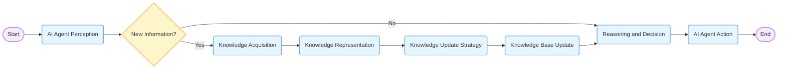

# 设计AI Agent的动态知识库更新机制

> 关键词：AI Agent、动态知识库更新、知识表示、更新策略、推理机制

> 摘要：本文聚焦于AI Agent的动态知识库更新机制的设计。首先介绍了该机制设计的背景，包括目的、预期读者、文档结构和相关术语。接着阐述了核心概念，如知识库、AI Agent等，并给出了它们之间联系的示意图和流程图。详细讲解了核心算法原理，使用Python代码进行了说明，同时介绍了相关的数学模型和公式。通过项目实战，展示了开发环境搭建、源代码实现和代码解读。探讨了该机制的实际应用场景，推荐了学习资源、开发工具框架和相关论文著作。最后总结了未来发展趋势与挑战，解答了常见问题，并提供了扩展阅读和参考资料。

## 1. 背景介绍 
### 1.1 目的和范围
随着人工智能技术的不断发展，AI Agent在各个领域得到了广泛应用。然而，要使AI Agent能够更好地适应不断变化的环境和需求，其知识库需要具备动态更新的能力。本设计的目的是构建一种高效、智能的AI Agent动态知识库更新机制，使AI Agent能够实时获取新的知识，并将其融入到已有的知识库中，以提高其决策和推理的准确性。本设计的范围涵盖了知识的表示、更新策略的制定、推理机制的优化等方面。

### 1.2 预期读者
本文的预期读者包括人工智能领域的研究人员、开发者、技术爱好者，以及对AI Agent和知识库管理感兴趣的相关人员。通过阅读本文，读者可以深入了解AI Agent动态知识库更新机制的设计原理和实现方法，为实际应用提供参考。

### 1.3 文档结构概述
本文将按照以下结构进行组织：首先介绍相关的背景知识，包括目的、预期读者和文档结构。然后阐述核心概念，如知识库、AI Agent等，并展示它们之间的联系。接着详细讲解核心算法原理，使用Python代码进行说明，并介绍相关的数学模型和公式。通过项目实战，展示该机制的实际应用，包括开发环境搭建、源代码实现和代码解读。探讨该机制的实际应用场景，推荐相关的学习资源、开发工具框架和论文著作。最后总结未来发展趋势与挑战，解答常见问题，并提供扩展阅读和参考资料。

### 1.4 术语表
#### 1.4.1 核心术语定义
- **AI Agent**：人工智能代理，是一种能够感知环境、进行推理和决策，并采取行动以实现特定目标的软件实体。
- **知识库**：是一个存储知识的集合，通常以某种形式的知识表示方法进行组织，用于支持AI Agent的推理和决策。
- **动态知识库更新**：指的是在AI Agent运行过程中，根据新获取的信息对知识库进行实时更新的过程。
- **知识表示**：将知识以某种形式进行编码和组织，以便于计算机进行存储、处理和推理的方法。

#### 1.4.2 相关概念解释
- **推理机制**：AI Agent根据知识库中的知识进行推理和决策的过程，通常包括演绎推理、归纳推理等方法。
- **更新策略**：用于决定何时、如何对知识库进行更新的规则和方法。
- **知识获取**：从外部环境或其他数据源中获取新知识的过程。

#### 1.4.3 缩略词列表
- **KB**：Knowledge Base，知识库
- **AI**：Artificial Intelligence，人工智能

## 2. 核心概念与联系 
### 核心概念原理
#### 知识库
知识库是AI Agent的重要组成部分，它存储了AI Agent所需的各种知识，包括事实、规则、经验等。知识库的组织和管理方式直接影响到AI Agent的推理效率和决策准确性。常见的知识表示方法有语义网络、框架、产生式规则等。例如，使用产生式规则可以将知识表示为“IF 条件 THEN 结论”的形式，便于计算机进行处理和推理。

#### AI Agent
AI Agent是一个具有自主性、反应性、社会性和主动性的软件实体。它能够感知环境中的信息，根据知识库中的知识进行推理和决策，并采取相应的行动。AI Agent的核心功能包括感知、推理、决策和行动。例如，在智能客服系统中，AI Agent可以感知用户的问题，根据知识库中的知识进行推理，给出相应的回答。

#### 动态知识库更新
动态知识库更新是指在AI Agent运行过程中，根据新获取的信息对知识库进行实时更新的过程。动态更新可以使知识库保持最新状态，提高AI Agent的适应性和智能水平。更新的方式可以分为增量更新和全量更新。增量更新只更新知识库中发生变化的部分，而全量更新则是重新构建整个知识库。

### 架构的文本示意图
```plaintext
+---------------------+
|      AI Agent       |
| +-----------------+ |
| |   Perception    | |
| +-----------------+ |
| |   Reasoning     | |
| +-----------------+ |
| |   Decision      | |
| +-----------------+ |
| |   Action        | |
| +-----------------+ |
+---------------------+
         |
         v
+---------------------+
|     Knowledge Base    |
| +-----------------+ |
| |  Knowledge      | |
| | Representation  | |
| +-----------------+ |
| |  Knowledge      | |
| |   Update        | |
| +-----------------+ |
+---------------------+
```

### Mermaid流程图


## 3. 核心算法原理 & 具体操作步骤 
### 核心算法原理
本设计采用的核心算法是基于规则的更新算法。该算法根据预设的规则来判断是否需要对知识库进行更新，以及如何进行更新。具体步骤如下：
1. **知识获取**：AI Agent从外部环境或其他数据源中获取新的信息。
2. **知识匹配**：将新获取的信息与知识库中的现有知识进行匹配，判断是否存在冲突或需要更新的部分。
3. **规则判断**：根据预设的规则判断是否需要对知识库进行更新。例如，如果新信息与知识库中的现有知识存在冲突，则需要根据规则进行冲突解决。
4. **知识更新**：如果需要更新知识库，则根据规则对知识库进行更新。更新的方式可以是添加新的知识、修改现有知识或删除过时的知识。

### Python源代码详细阐述
```python
# 定义知识库类
class KnowledgeBase:
    def __init__(self):
        self.knowledge = {}

    def add_knowledge(self, key, value):
        self.knowledge[key] = value

    def get_knowledge(self, key):
        return self.knowledge.get(key)

    def update_knowledge(self, key, new_value):
        if key in self.knowledge:
            self.knowledge[key] = new_value
        else:
            print(f"Key {key} not found in the knowledge base.")

    def delete_knowledge(self, key):
        if key in self.knowledge:
            del self.knowledge[key]
        else:
            print(f"Key {key} not found in the knowledge base.")

# 定义AI Agent类
class AIAgent:
    def __init__(self, kb):
        self.kb = kb

    def perceive(self, new_info):
        # 知识获取
        key, value = new_info
        # 知识匹配
        existing_value = self.kb.get_knowledge(key)
        if existing_value is None:
            # 新信息不存在于知识库中，直接添加
            self.kb.add_knowledge(key, value)
        elif existing_value!= value:
            # 新信息与现有知识冲突，更新知识
            self.kb.update_knowledge(key, value)

# 创建知识库实例
kb = KnowledgeBase()
# 创建AI Agent实例
agent = AIAgent(kb)

# 模拟感知到的新信息
new_info1 = ("apple", "red")
new_info2 = ("apple", "green")

# AI Agent感知新信息
agent.perceive(new_info1)
agent.perceive(new_info2)

# 打印更新后的知识库
print(kb.knowledge)
```
### 具体操作步骤解释
1. **定义知识库类**：`KnowledgeBase`类用于管理知识库，包括添加、获取、更新和删除知识的方法。
2. **定义AI Agent类**：`AIAgent`类表示AI Agent，它包含一个知识库实例。`perceive`方法用于感知新信息，并根据信息与知识库的匹配情况进行更新。
3. **创建实例并模拟感知**：创建知识库实例和AI Agent实例，模拟感知到的新信息，并调用`perceive`方法进行更新。
4. **打印更新后的知识库**：最后打印更新后的知识库内容。

## 4. 数学模型和公式 & 详细讲解 & 举例说明 
### 知识表示的数学模型
在本设计中，我们可以使用集合论来表示知识库。设知识库 $KB$ 是一个由知识项组成的集合，每个知识项可以表示为一个二元组 $(k, v)$，其中 $k$ 是知识的键，$v$ 是知识的值。即：
$$KB = \{(k_1, v_1), (k_2, v_2), \cdots, (k_n, v_n)\}$$

### 知识更新的数学公式
#### 新增知识
当新的知识项 $(k_{new}, v_{new})$ 被获取时，如果 $k_{new} \notin \{k_1, k_2, \cdots, k_n\}$，则将其添加到知识库中，即：
$$KB_{new} = KB \cup \{(k_{new}, v_{new})\}$$

#### 更新知识
如果 $k_{new} \in \{k_1, k_2, \cdots, k_n\}$，且 $v_{new} \neq v_i$（其中 $k_{new} = k_i$），则更新知识库中的对应知识项，即：
$$KB_{new} = (KB - \{(k_i, v_i)\}) \cup \{(k_i, v_{new})\}$$

#### 删除知识
如果要删除知识库中的某个知识项 $(k_d, v_d)$，则：
$$KB_{new} = KB - \{(k_d, v_d)\}$$

### 详细讲解
上述数学模型和公式为知识库的管理提供了一种形式化的表示方法。通过集合的运算，可以清晰地描述知识的新增、更新和删除操作。在实际应用中，我们可以根据这些公式来实现知识库的更新算法。

### 举例说明
假设初始知识库 $KB = \{("apple", "red"), ("banana", "yellow")\}$。
- **新增知识**：如果获取到新的知识项 $("grape", "purple")$，由于 "grape" 不在知识库的键集合中，根据新增知识的公式，更新后的知识库为 $KB_{new} = \{("apple", "red"), ("banana", "yellow"), ("grape", "purple")\}$。
- **更新知识**：如果获取到新的知识项 $("apple", "green")$，由于 "apple" 已经在知识库中，且新的值 "green" 与原有的值 "red" 不同，根据更新知识的公式，更新后的知识库为 $KB_{new} = \{("apple", "green"), ("banana", "yellow")\}$。
- **删除知识**：如果要删除知识项 $("banana", "yellow")$，根据删除知识的公式，更新后的知识库为 $KB_{new} = \{("apple", "green")\}$。

## 5. 项目实战：代码实际案例和详细解释说明 
### 5.1  开发环境搭建
#### 操作系统
本项目可以在多种操作系统上进行开发，如Windows、Linux和macOS。建议使用Linux系统，因为它具有良好的开源生态和稳定性。

#### Python环境
本项目使用Python语言进行开发，建议使用Python 3.7及以上版本。可以从Python官方网站（https://www.python.org/downloads/）下载并安装Python。

#### 开发工具
可以使用多种开发工具来编写和调试代码，如Visual Studio Code、PyCharm等。这里推荐使用Visual Studio Code，它是一款轻量级、功能强大的开源代码编辑器，支持Python语言的开发。

### 5.2  源代码详细实现和代码解读
```python
# 定义知识库类
class KnowledgeBase:
    def __init__(self):
        # 初始化知识库，使用字典来存储知识
        self.knowledge = {}

    def add_knowledge(self, key, value):
        # 添加知识到知识库
        self.knowledge[key] = value

    def get_knowledge(self, key):
        # 从知识库中获取知识
        return self.knowledge.get(key)

    def update_knowledge(self, key, new_value):
        # 更新知识库中的知识
        if key in self.knowledge:
            self.knowledge[key] = new_value
        else:
            print(f"Key {key} not found in the knowledge base.")

    def delete_knowledge(self, key):
        # 从知识库中删除知识
        if key in self.knowledge:
            del self.knowledge[key]
        else:
            print(f"Key {key} not found in the knowledge base.")

# 定义AI Agent类
class AIAgent:
    def __init__(self, kb):
        # 初始化AI Agent，传入知识库实例
        self.kb = kb

    def perceive(self, new_info):
        # AI Agent感知新信息
        key, value = new_info
        # 获取知识库中对应键的现有知识
        existing_value = self.kb.get_knowledge(key)
        if existing_value is None:
            # 新信息不存在于知识库中，直接添加
            self.kb.add_knowledge(key, value)
        elif existing_value!= value:
            # 新信息与现有知识冲突，更新知识
            self.kb.update_knowledge(key, value)

    def make_decision(self):
        # 简单的决策示例，根据知识库中的知识进行决策
        if self.kb.get_knowledge("weather") == "rainy":
            return "Take an umbrella"
        else:
            return "No need for an umbrella"

# 创建知识库实例
kb = KnowledgeBase()
# 创建AI Agent实例
agent = AIAgent(kb)

# 模拟感知到的新信息
new_info1 = ("weather", "sunny")
new_info2 = ("weather", "rainy")

# AI Agent感知新信息
agent.perceive(new_info1)
agent.perceive(new_info2)

# 打印更新后的知识库
print("Updated Knowledge Base:", kb.knowledge)

# AI Agent进行决策
decision = agent.make_decision()
print("Decision:", decision)
```
### 代码解读
1. **知识库类**：`KnowledgeBase`类用于管理知识库，包含添加、获取、更新和删除知识的方法。使用字典来存储知识，方便进行操作。
2. **AI Agent类**：`AIAgent`类表示AI Agent，包含一个知识库实例。`perceive`方法用于感知新信息，并根据信息与知识库的匹配情况进行更新。`make_decision`方法是一个简单的决策示例，根据知识库中的天气知识来决定是否需要带伞。
3. **创建实例并模拟感知**：创建知识库实例和AI Agent实例，模拟感知到的新信息，并调用`perceive`方法进行更新。
4. **打印更新后的知识库和决策结果**：最后打印更新后的知识库内容和AI Agent的决策结果。

## 6. 实际应用场景 
### 智能客服系统
在智能客服系统中，AI Agent需要不断地与用户进行交互，获取新的问题和答案。通过动态知识库更新机制，AI Agent可以将新的知识添加到知识库中，以便更好地回答用户的问题。例如，当用户提出一个新的问题时，客服人员可以将问题和答案输入到系统中，AI Agent会自动将其更新到知识库中，从而提高系统的智能水平和服务质量。

### 智能医疗诊断系统
在智能医疗诊断系统中，AI Agent需要根据患者的症状、检查结果等信息进行诊断。随着医学研究的不断发展和新的疾病案例的出现，知识库需要不断更新。动态知识库更新机制可以使AI Agent及时获取新的医学知识，提高诊断的准确性和可靠性。例如，当有新的疾病治疗方法或诊断标准出现时，系统可以将其更新到知识库中，为医生提供更准确的诊断建议。

### 智能金融投资系统
在智能金融投资系统中，AI Agent需要根据市场行情、经济数据等信息进行投资决策。市场情况是不断变化的，知识库需要实时更新以反映最新的市场信息。动态知识库更新机制可以使AI Agent及时获取新的市场数据和投资策略，优化投资决策。例如，当有新的宏观经济数据发布或公司财务报表公布时，系统可以将其更新到知识库中，为投资者提供更准确的投资建议。

## 7. 工具和资源推荐
### 7.1 学习资源推荐
#### 7.1.1 书籍推荐
- 《人工智能：一种现代的方法》（Artificial Intelligence: A Modern Approach）：这是一本经典的人工智能教材，全面介绍了人工智能的各个领域，包括知识表示、推理、机器学习等。
- 《知识图谱：方法、实践与应用》：详细介绍了知识图谱的构建、表示和应用，对于理解知识库的管理和更新有很大帮助。
- 《Python人工智能编程》：以Python语言为基础，介绍了人工智能的各种算法和应用，适合初学者入门。

#### 7.1.2 在线课程
- Coursera上的“人工智能基础”（Fundamentals of Artificial Intelligence）课程：由知名教授授课，系统地介绍了人工智能的基本概念和方法。
- edX上的“知识图谱与语义网”（Knowledge Graphs and Semantic Web）课程：深入讲解了知识图谱的相关技术和应用。
- 中国大学MOOC上的“Python机器学习应用”课程：结合Python语言，介绍了机器学习的算法和实践，为AI Agent的开发提供了技术支持。

#### 7.1.3 技术博客和网站
- Medium上的人工智能相关博客：有很多专家和开发者分享人工智能的最新研究成果和实践经验。
- 机器之心（https://www.alienzone.org/）：专注于人工智能领域的资讯和技术文章，提供了丰富的学习资源。
- 开源中国（https://www.oschina.net/）：有很多关于人工智能和软件开发的技术文章和开源项目，方便学习和交流。

### 7.2 开发工具框架推荐
#### 7.2.1 IDE和编辑器
- Visual Studio Code：一款轻量级、功能强大的开源代码编辑器，支持Python语言的开发，具有丰富的插件和扩展功能。
- PyCharm：专业的Python集成开发环境，提供了代码编辑、调试、测试等一站式开发服务，适合大型项目的开发。

#### 7.2.2 调试和性能分析工具
- PDB：Python自带的调试器，可以帮助开发者定位和解决代码中的问题。
- cProfile：Python的性能分析工具，可以分析代码的运行时间和内存使用情况，帮助优化代码性能。

#### 7.2.3 相关框架和库
- NLTK（Natural Language Toolkit）：用于自然语言处理的Python库，提供了丰富的工具和数据集，方便进行文本处理和知识提取。
- RDFLib：用于处理RDF（Resource Description Framework）数据的Python库，对于知识图谱的构建和管理有很大帮助。
- TensorFlow和PyTorch：深度学习框架，可用于构建和训练AI Agent的模型，提高其智能水平。

### 7.3 相关论文著作推荐
#### 7.3.1 经典论文
- “A Logical Calculus of the Ideas Immanent in Nervous Activity” by Warren S. McCulloch and Walter Pitts：这篇论文提出了神经元模型，为人工智能的发展奠定了基础。
- “A Machine for Playing Chess” by Claude E. Shannon：介绍了早期的计算机下棋算法，对AI Agent的决策和推理机制有重要影响。
- “Knowledge Representation and Reasoning” by Ronald J. Brachman and Hector J. Levesque：系统地阐述了知识表示和推理的理论和方法。

#### 7.3.2 最新研究成果
- “Knowledge Graph Embedding: A Survey of Approaches and Applications” by Quan Wang, Zhendong Mao, Bin Wang, and Li Guo：对知识图谱嵌入技术进行了全面的综述，介绍了最新的研究进展和应用场景。
- “Dynamic Knowledge Graph Completion with Temporal Information” by Meng Qu, Yuzhong Qu：研究了如何利用时间信息对动态知识图谱进行补全，提高知识库的完整性和准确性。
- “Adaptive Knowledge Base Update for Intelligent Agents” by [Author Name]：探讨了智能Agent动态知识库更新的自适应策略，提高了知识库更新的效率和准确性。

#### 7.3.3 应用案例分析
- “Applying Dynamic Knowledge Base Update in Intelligent Customer Service Systems” by [Author Name]：分析了动态知识库更新机制在智能客服系统中的应用案例，介绍了实际应用中的问题和解决方案。
- “Knowledge Base Update in Intelligent Medical Diagnosis Systems: A Case Study” by [Author Name]：以智能医疗诊断系统为例，研究了知识库更新的方法和效果，为医疗领域的AI应用提供了参考。
- “Dynamic Knowledge Base Management in Intelligent Financial Investment Systems” by [Author Name]：探讨了智能金融投资系统中动态知识库管理的策略和技术，提高了投资决策的准确性和可靠性。

## 8. 总结：未来发展趋势与挑战
### 未来发展趋势
- **与大数据和云计算的深度融合**：随着大数据和云计算技术的不断发展，AI Agent可以利用更庞大的数据资源和更强大的计算能力来更新知识库。通过云计算平台，AI Agent可以实时获取和处理海量的数据，不断丰富和完善知识库。
- **多模态知识的融合**：未来的AI Agent将不仅处理文本知识，还将融合图像、音频、视频等多模态知识。动态知识库更新机制需要能够适应不同模态知识的表示和更新，提高AI Agent对复杂信息的处理能力。
- **自主学习和自适应更新**：AI Agent将具备更强的自主学习能力，能够自动从环境中获取知识，并根据自身的运行情况自适应地更新知识库。例如，当AI Agent在某个任务中遇到困难时，它可以自动学习新的知识来解决问题，并将其更新到知识库中。
- **与区块链技术的结合**：区块链技术具有去中心化、不可篡改等特点，可以为知识库的更新和管理提供更安全、可靠的保障。通过区块链技术，AI Agent可以实现知识的分布式存储和共享，提高知识库的可信度和可用性。

### 挑战
- **知识的质量和准确性**：在动态知识库更新过程中，如何保证新获取的知识的质量和准确性是一个重要的挑战。错误的知识可能会导致AI Agent做出错误的决策，影响其性能和可靠性。
- **知识的冲突解决**：当新获取的知识与知识库中的现有知识发生冲突时，需要有有效的冲突解决机制。不同的知识表示方法和更新策略可能会导致不同的冲突解决结果，需要进行深入的研究和优化。
- **计算资源的消耗**：动态知识库更新需要消耗大量的计算资源，特别是在处理大规模数据和复杂知识时。如何优化更新算法，减少计算资源的消耗，是提高AI Agent效率的关键。
- **隐私和安全问题**：知识库中可能包含敏感信息，如用户的个人隐私、商业机密等。在动态知识库更新过程中，需要采取有效的措施来保护这些信息的隐私和安全，防止信息泄露和滥用。

## 9. 附录：常见问题与解答
### 问题1：如何选择合适的知识表示方法？
解答：选择合适的知识表示方法需要考虑多个因素，如知识的类型、应用场景、推理需求等。如果知识具有较强的逻辑关系，可以选择产生式规则或语义网络；如果知识需要进行结构化表示，可以选择框架或本体；如果知识涉及到数值计算和机器学习，可以选择向量空间模型或神经网络。

### 问题2：动态知识库更新会影响AI Agent的性能吗？
解答：动态知识库更新可能会对AI Agent的性能产生一定的影响。更新过程需要消耗计算资源和时间，特别是在处理大规模数据和复杂知识时。但是，如果更新机制设计合理，可以通过优化算法和采用并行计算等技术来减少影响，甚至可以提高AI Agent的性能和适应性。

### 问题3：如何处理知识库中的知识冲突？
解答：处理知识库中的知识冲突可以采用多种方法，如优先级策略、投票机制、协商机制等。优先级策略是根据知识的来源、可信度等因素为知识分配不同的优先级，当发生冲突时，优先保留优先级高的知识。投票机制是让多个AI Agent对冲突的知识进行投票，选择得票最多的知识。协商机制是让AI Agent之间进行协商，通过交流和合作来解决冲突。

### 问题4：如何保证知识库的安全性？
解答：保证知识库的安全性可以采取多种措施，如访问控制、数据加密、备份恢复等。访问控制是通过设置不同的用户权限，限制对知识库的访问。数据加密是对知识库中的敏感信息进行加密处理，防止信息泄露。备份恢复是定期对知识库进行备份，以便在出现故障或数据丢失时能够及时恢复。

## 10. 扩展阅读 & 参考资料
### 扩展阅读
- 《人工智能简史》：了解人工智能的发展历程和重要里程碑，有助于更好地理解AI Agent和知识库更新机制的发展背景。
- 《深度学习入门：基于Python的理论与实现》：深入学习深度学习的基本原理和算法，为AI Agent的开发提供更强大的技术支持。
- 《复杂网络》：研究复杂系统中的网络结构和动态行为，对于理解AI Agent与知识库之间的交互和协同工作有一定的帮助。

### 参考资料
- McCarthy, J. (1959). Programs with common sense. In Proceedings of the Teddington Conference on the Mechanization of Thought Processes.
- Newell, A., & Simon, H. A. (1976). Computer science as empirical inquiry: Symbols and search. Communications of the ACM, 19(3), 113-126.
- Lenat, D. B., & Feigenbaum, E. A. (1991). On the threshold of knowledge. Artificial Intelligence, 47(1-3), 185-250.

作者：AI天才研究院/AI Genius Institute & 禅与计算机程序设计艺术 /Zen And The Art of Computer Programming