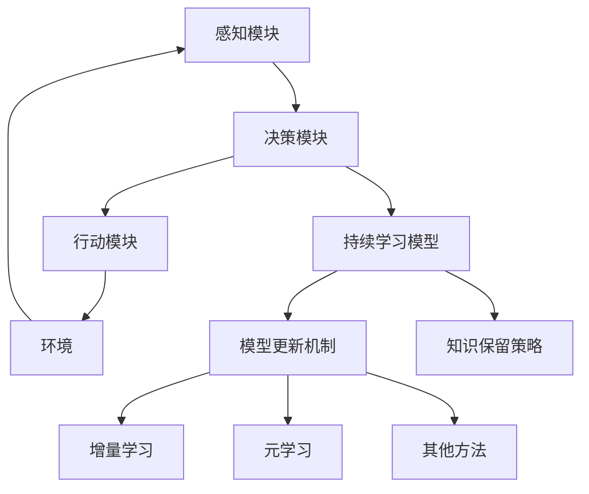

# 设计AI Agent的持续学习与模型更新机制

> 关键词：AI Agent、持续学习、模型更新机制、机器学习、深度学习、增量学习、终身学习

> 摘要：本文聚焦于AI Agent的持续学习与模型更新机制，深入探讨其核心概念、算法原理、数学模型等关键内容。通过详细的代码示例和实际应用场景分析，展示如何在实际项目中实现AI Agent的持续学习与模型更新。同时，推荐相关的学习资源、开发工具和论文著作，帮助读者进一步了解该领域。最后，总结未来发展趋势与挑战，为该领域的研究和实践提供参考。

## 1. 背景介绍 
### 1.1 目的和范围
随着人工智能技术的快速发展，AI Agent在各个领域的应用越来越广泛。然而，现实世界是动态变化的，数据也在不断更新。传统的机器学习模型在固定数据集上训练后，难以适应新的数据和环境变化。因此，设计AI Agent的持续学习与模型更新机制具有重要的现实意义。本文的目的是深入探讨如何设计有效的持续学习与模型更新机制，使AI Agent能够不断学习新的知识和技能，适应环境的变化。本文的范围涵盖了持续学习与模型更新的核心概念、算法原理、数学模型、项目实战、实际应用场景等方面。

### 1.2 预期读者
本文预期读者包括人工智能领域的研究人员、开发者、工程师，以及对AI Agent持续学习与模型更新机制感兴趣的技术爱好者。希望通过本文的介绍，读者能够深入理解该领域的核心概念和技术，掌握设计和实现持续学习与模型更新机制的方法和技巧。

### 1.3 文档结构概述
本文将按照以下结构进行组织：
1. **背景介绍**：介绍本文的目的、范围、预期读者和文档结构概述。
2. **核心概念与联系**：阐述AI Agent、持续学习、模型更新等核心概念的原理和架构，并给出相应的示意图和流程图。
3. **核心算法原理 & 具体操作步骤**：详细讲解持续学习与模型更新的核心算法原理，并使用Python源代码进行阐述。
4. **数学模型和公式 & 详细讲解 & 举例说明**：介绍持续学习与模型更新的数学模型和公式，并通过具体例子进行说明。
5. **项目实战：代码实际案例和详细解释说明**：通过实际项目案例，展示如何实现AI Agent的持续学习与模型更新，并对代码进行详细解读。
6. **实际应用场景**：介绍持续学习与模型更新机制在不同领域的实际应用场景。
7. **工具和资源推荐**：推荐相关的学习资源、开发工具和论文著作。
8. **总结：未来发展趋势与挑战**：总结持续学习与模型更新机制的未来发展趋势和面临的挑战。
9. **附录：常见问题与解答**：解答读者在学习和实践过程中常见的问题。
10. **扩展阅读 & 参考资料**：提供相关的扩展阅读材料和参考资料。

### 1.4 术语表
#### 1.4.1 核心术语定义
- **AI Agent**：智能体，是指能够感知环境、做出决策并采取行动的实体。在人工智能领域，AI Agent通常是指具有一定智能的软件程序或机器人。
- **持续学习**：也称为终身学习、增量学习，是指系统能够不断从新的数据中学习新知识，同时保留之前学习到的知识，以适应环境的变化。
- **模型更新**：是指在持续学习过程中，根据新的数据对已有的模型进行调整和优化，以提高模型的性能和适应性。

#### 1.4.2 相关概念解释
- **灾难性遗忘**：在持续学习过程中，当模型学习新的数据时，可能会忘记之前学习到的知识，导致之前的任务性能下降，这种现象称为灾难性遗忘。
- **元学习**：是一种学习如何学习的方法，通过在多个任务上进行训练，使模型能够快速适应新的任务。

#### 1.4.3 缩略词列表
- **ML**：Machine Learning，机器学习
- **DL**：Deep Learning，深度学习
- **RL**：Reinforcement Learning，强化学习

## 2. 核心概念与联系 
### 核心概念原理
#### AI Agent
AI Agent是人工智能系统的核心组成部分，它能够感知环境、做出决策并采取行动。一个典型的AI Agent包括以下几个部分：
- **感知模块**：负责感知环境信息，例如图像、声音、文本等。
- **决策模块**：根据感知到的环境信息，做出决策。决策模块通常使用机器学习或深度学习模型来实现。
- **行动模块**：根据决策结果，采取相应的行动。行动模块可以是机器人的运动控制、软件系统的操作等。

#### 持续学习
持续学习是指系统能够不断从新的数据中学习新知识，同时保留之前学习到的知识。持续学习的目标是使系统能够适应环境的变化，提高系统的性能和适应性。持续学习面临的主要挑战是灾难性遗忘，即当模型学习新的数据时，可能会忘记之前学习到的知识。

#### 模型更新
模型更新是指在持续学习过程中，根据新的数据对已有的模型进行调整和优化。模型更新的方法有很多种，例如增量学习、元学习等。模型更新的目标是提高模型的性能和适应性，同时避免灾难性遗忘。

### 架构的文本示意图
```plaintext
AI Agent
├── 感知模块
│   ├── 传感器（图像、声音、文本等）
│   └── 数据预处理
├── 决策模块
│   ├── 持续学习模型
│   │   ├── 初始模型
│   │   ├── 模型更新机制
│   │   │   ├── 增量学习
│   │   │   ├── 元学习
│   │   │   └── 其他方法
│   │   └── 知识保留策略
│   └── 决策算法
└── 行动模块
    ├── 执行器（机器人运动、软件操作等）
    └── 动作反馈
```

### Mermaid流程图


## 3. 核心算法原理 & 具体操作步骤 
### 增量学习算法原理
增量学习是一种常见的持续学习方法，它允许模型在新的数据到来时，对已有的模型进行增量式的更新。下面以简单的线性回归模型为例，介绍增量学习的算法原理。

线性回归模型的目标是找到一个线性函数 $y = wx + b$，使得预测值 $\hat{y}$ 与真实值 $y$ 之间的误差最小。误差通常使用均方误差（MSE）来衡量：

$$MSE = \frac{1}{n} \sum_{i=1}^{n} (y_i - \hat{y}_i)^2$$

其中，$n$ 是样本数量，$y_i$ 是第 $i$ 个样本的真实值，$\hat{y}_i$ 是第 $i$ 个样本的预测值。

在增量学习中，当新的数据 $(x_{new}, y_{new})$ 到来时，我们可以使用梯度下降法来更新模型的参数 $w$ 和 $b$。梯度下降法的更新公式如下：

$$w = w - \alpha \frac{\partial MSE}{\partial w}$$

$$b = b - \alpha \frac{\partial MSE}{\partial b}$$

其中，$\alpha$ 是学习率，$\frac{\partial MSE}{\partial w}$ 和 $\frac{\partial MSE}{\partial b}$ 分别是 $MSE$ 对 $w$ 和 $b$ 的偏导数。

### Python源代码实现
```python
import numpy as np

class IncrementalLinearRegression:
    def __init__(self, learning_rate=0.01):
        self.learning_rate = learning_rate
        self.w = 0
        self.b = 0

    def predict(self, x):
        return self.w * x + self.b

    def update(self, x, y):
        # 计算预测值
        y_pred = self.predict(x)
        # 计算误差
        error = y - y_pred
        # 计算梯度
        dw = -2 * x * error
        db = -2 * error
        # 更新参数
        self.w -= self.learning_rate * dw
        self.b -= self.learning_rate * db

# 示例数据
x_train = np.array([1, 2, 3, 4, 5])
y_train = np.array([2, 4, 6, 8, 10])

# 创建增量线性回归模型
model = IncrementalLinearRegression()

# 增量学习过程
for i in range(len(x_train)):
    model.update(x_train[i], y_train[i])

# 预测新数据
x_new = 6
y_pred = model.predict(x_new)
print(f"预测值: {y_pred}")
```

### 具体操作步骤
1. **初始化模型参数**：在开始增量学习之前，需要初始化模型的参数 $w$ 和 $b$。
2. **接收新数据**：当新的数据 $(x_{new}, y_{new})$ 到来时，将其输入到模型中。
3. **计算预测值**：使用当前的模型参数 $w$ 和 $b$ 计算新数据的预测值 $\hat{y}_{new}$。
4. **计算误差**：计算预测值 $\hat{y}_{new}$ 与真实值 $y_{new}$ 之间的误差。
5. **计算梯度**：根据误差计算 $MSE$ 对 $w$ 和 $b$ 的偏导数。
6. **更新参数**：使用梯度下降法更新模型的参数 $w$ 和 $b$。
7. **重复步骤2-6**：不断接收新的数据，重复上述步骤，直到满足停止条件。

## 4. 数学模型和公式 & 详细讲解 & 举例说明 
### 线性回归的数学模型
线性回归的数学模型可以表示为：

$$y = wx + b + \epsilon$$

其中，$y$ 是因变量，$x$ 是自变量，$w$ 是斜率，$b$ 是截距，$\epsilon$ 是误差项，通常假设 $\epsilon$ 服从均值为 0，方差为 $\sigma^2$ 的正态分布。

### 均方误差（MSE）公式
均方误差（MSE）是线性回归中常用的损失函数，其公式为：

$$MSE = \frac{1}{n} \sum_{i=1}^{n} (y_i - \hat{y}_i)^2$$

其中，$n$ 是样本数量，$y_i$ 是第 $i$ 个样本的真实值，$\hat{y}_i$ 是第 $i$ 个样本的预测值。

### 梯度下降法公式
梯度下降法是一种常用的优化算法，用于最小化损失函数。其更新公式为：

$$\theta = \theta - \alpha \frac{\partial L}{\partial \theta}$$

其中，$\theta$ 是模型的参数，$\alpha$ 是学习率，$\frac{\partial L}{\partial \theta}$ 是损失函数 $L$ 对 $\theta$ 的偏导数。

### 详细讲解
在线性回归中，我们的目标是找到最优的参数 $w$ 和 $b$，使得均方误差（MSE）最小。梯度下降法通过不断迭代更新参数 $w$ 和 $b$，使得 MSE 逐渐减小。具体来说，每次迭代时，我们计算 MSE 对 $w$ 和 $b$ 的偏导数，然后根据偏导数的方向更新参数 $w$ 和 $b$。学习率 $\alpha$ 控制了每次更新的步长，过大的学习率可能导致模型无法收敛，过小的学习率可能导致收敛速度过慢。

### 举例说明
假设我们有一个简单的线性回归问题，数据集如下：

| $x$ | $y$ |
| --- | --- |
| 1   | 2   |
| 2   | 4   |
| 3   | 6   |

我们的目标是找到最优的参数 $w$ 和 $b$，使得预测值 $\hat{y} = wx + b$ 与真实值 $y$ 之间的误差最小。

1. **初始化参数**：假设初始参数 $w = 0$，$b = 0$。
2. **计算预测值**：对于第一个样本 $(x_1 = 1, y_1 = 2)$，预测值 $\hat{y}_1 = w \times x_1 + b = 0 \times 1 + 0 = 0$。
3. **计算误差**：误差 $e_1 = y_1 - \hat{y}_1 = 2 - 0 = 2$。
4. **计算梯度**：
   - $\frac{\partial MSE}{\partial w} = -2 \times x_1 \times e_1 = -2 \times 1 \times 2 = -4$
   - $\frac{\partial MSE}{\partial b} = -2 \times e_1 = -2 \times 2 = -4$
5. **更新参数**：假设学习率 $\alpha = 0.01$，则
   - $w = w - \alpha \frac{\partial MSE}{\partial w} = 0 - 0.01 \times (-4) = 0.04$
   - $b = b - \alpha \frac{\partial MSE}{\partial b} = 0 - 0.01 \times (-4) = 0.04$

重复上述步骤，直到满足停止条件（例如，MSE 小于某个阈值或达到最大迭代次数）。

## 5. 项目实战：代码实际案例和详细解释说明 
### 5.1  开发环境搭建
本项目使用 Python 语言进行开发，需要安装以下库：
- **NumPy**：用于数值计算。
- **Scikit-learn**：用于机器学习任务。
- **Matplotlib**：用于数据可视化。

可以使用以下命令安装这些库：
```sh
pip install numpy scikit-learn matplotlib
```

### 5.2  源代码详细实现和代码解读
```python
import numpy as np
from sklearn.datasets import make_regression
from sklearn.linear_model import SGDRegressor
import matplotlib.pyplot as plt

# 生成示例数据
X, y = make_regression(n_samples=1000, n_features=1, noise=10, random_state=42)

# 划分训练集和测试集
train_size = int(0.8 * len(X))
X_train, X_test = X[:train_size], X[train_size:]
y_train, y_test = y[:train_size], y[train_size:]

# 创建增量学习模型（随机梯度下降回归器）
model = SGDRegressor()

# 增量学习过程
batch_size = 10
num_batches = len(X_train) // batch_size

for i in range(num_batches):
    start_idx = i * batch_size
    end_idx = start_idx + batch_size
    X_batch = X_train[start_idx:end_idx]
    y_batch = y_train[start_idx:end_idx]
    model.partial_fit(X_batch, y_batch)

# 评估模型
score = model.score(X_test, y_test)
print(f"模型得分: {score}")

# 可视化结果
plt.scatter(X_test, y_test, color='blue', label='真实值')
plt.plot(X_test, model.predict(X_test), color='red', label='预测值')
plt.xlabel('X')
plt.ylabel('y')
plt.title('线性回归增量学习结果')
plt.legend()
plt.show()
```

### 5.3  代码解读与分析
1. **数据生成**：使用 `make_regression` 函数生成示例数据。
2. **数据划分**：将数据划分为训练集和测试集。
3. **模型创建**：使用 `SGDRegressor` 创建增量学习模型。`SGDRegressor` 是一种基于随机梯度下降的线性回归模型，支持增量学习。
4. **增量学习过程**：将训练数据分成多个小批量，每次使用一个小批量的数据对模型进行更新。
5. **模型评估**：使用测试集对模型进行评估，计算模型的得分。
6. **可视化结果**：使用 `matplotlib` 库将真实值和预测值可视化，直观地展示模型的性能。

## 6. 实际应用场景 
### 自然语言处理
在自然语言处理领域，持续学习与模型更新机制可以用于文本分类、情感分析、机器翻译等任务。例如，随着时间的推移，新的词汇和表达方式不断出现，模型需要不断学习新的知识，以提高分类和翻译的准确性。

### 计算机视觉
在计算机视觉领域，持续学习与模型更新机制可以用于图像分类、目标检测、人脸识别等任务。例如，在人脸识别系统中，随着人员的不断增加和变化，模型需要不断学习新的人脸特征，以提高识别的准确性。

### 智能交通
在智能交通领域，持续学习与模型更新机制可以用于交通流量预测、自动驾驶等任务。例如，交通流量会随着时间、天气、事件等因素的变化而变化，模型需要不断学习新的数据，以提高预测的准确性。

### 医疗保健
在医疗保健领域，持续学习与模型更新机制可以用于疾病诊断、药物研发等任务。例如，随着医学研究的不断进展，新的疾病和治疗方法不断出现，模型需要不断学习新的知识，以提高诊断和治疗的准确性。

## 7. 工具和资源推荐
### 7.1 学习资源推荐
#### 7.1.1 书籍推荐
- 《机器学习》（周志华著）：介绍了机器学习的基本概念、算法和应用。
- 《深度学习》（Ian Goodfellow、Yoshua Bengio、Aaron Courville著）：深入介绍了深度学习的理论和实践。
- 《人工智能：一种现代的方法》（Stuart Russell、Peter Norvig著）：全面介绍了人工智能的各个领域。

#### 7.1.2 在线课程
- Coursera上的“机器学习”课程（Andrew Ng教授）：经典的机器学习入门课程。
- edX上的“深度学习”课程（Deeplearning.ai）：深入学习深度学习的课程。
- 中国大学MOOC上的“人工智能基础”课程：介绍人工智能的基本概念和方法。

#### 7.1.3 技术博客和网站
- Medium上的“Towards Data Science”：提供了大量关于数据科学、机器学习和人工智能的文章。
- 机器之心：专注于人工智能领域的资讯和技术分享。
- 极客时间：提供了许多高质量的人工智能课程和文章。

### 7.2 开发工具框架推荐
#### 7.2.1 IDE和编辑器
- PyCharm：功能强大的Python集成开发环境。
- Visual Studio Code：轻量级的代码编辑器，支持多种编程语言。
- Jupyter Notebook：交互式的编程环境，适合数据分析和机器学习任务。

#### 7.2.2 调试和性能分析工具
- Py-Spy：用于分析Python代码的性能。
- TensorBoard：用于可视化深度学习模型的训练过程和性能。
- cProfile：Python标准库中的性能分析工具。

#### 7.2.3 相关框架和库
- TensorFlow：开源的深度学习框架，支持多种深度学习任务。
- PyTorch：另一个流行的深度学习框架，具有动态计算图的特点。
- Scikit-learn：用于机器学习任务的Python库，提供了丰富的算法和工具。

### 7.3 相关论文著作推荐
#### 7.3.1 经典论文
- "Lifelong Machine Learning"（Sebastian Thrun、Lorenzo Pinto著）：介绍了终身学习的概念和方法。
- "Overcoming Catastrophic Forgetting in Neural Networks"（James Kirkpatrick等著）：提出了一种解决灾难性遗忘问题的方法。
- "Meta-Learning: A Survey"（Antreas Antoniou、Amos Storkey、Hugh Edwards著）：对元学习进行了全面的综述。

#### 7.3.2 最新研究成果
- 关注顶级学术会议（如NeurIPS、ICML、CVPR等）上的相关论文，了解该领域的最新研究动态。
- 关注知名学术期刊（如Journal of Artificial Intelligence Research、Artificial Intelligence等）上的相关论文。

#### 7.3.3 应用案例分析
- 一些开源项目（如OpenAI Gym、TensorFlow Examples等）提供了许多实际应用案例，可以参考学习。
- 一些科技公司（如Google、Facebook、Microsoft等）的官方博客会分享他们在人工智能领域的应用案例和技术经验。

## 8. 总结：未来发展趋势与挑战
### 未来发展趋势
- **多模态持续学习**：将视觉、听觉、文本等多种模态的数据结合起来，实现更加全面和智能的持续学习。
- **跨领域持续学习**：让AI Agent能够在不同领域之间进行知识迁移和持续学习，提高其通用性和适应性。
- **与人类协作的持续学习**：实现AI Agent与人类的协作学习，让人类的知识和经验能够更好地融入到AI Agent的持续学习过程中。

### 挑战
- **灾难性遗忘问题**：如何有效地解决灾难性遗忘问题，是持续学习领域面临的主要挑战之一。
- **计算资源和时间成本**：持续学习需要不断地处理新的数据和更新模型，这会带来较高的计算资源和时间成本。
- **数据隐私和安全**：在持续学习过程中，需要处理大量的数据，如何保证数据的隐私和安全是一个重要的问题。

## 9. 附录：常见问题与解答
### 什么是灾难性遗忘？
灾难性遗忘是指在持续学习过程中，当模型学习新的数据时，可能会忘记之前学习到的知识，导致之前的任务性能下降。

### 如何解决灾难性遗忘问题？
解决灾难性遗忘问题的方法有很多种，例如正则化方法、记忆回放方法、元学习方法等。

### 持续学习与传统机器学习有什么区别？
传统机器学习通常是在固定的数据集上进行训练，训练完成后模型的参数就固定了。而持续学习允许模型在新的数据到来时，不断地学习新知识，同时保留之前学习到的知识，以适应环境的变化。

### 持续学习需要多少计算资源？
持续学习需要的计算资源取决于模型的复杂度、数据的规模和更新的频率等因素。一般来说，持续学习需要更多的计算资源和时间。

## 10. 扩展阅读 & 参考资料
### 扩展阅读
- 《强化学习：原理与Python实现》：深入介绍强化学习的理论和实践。
- 《动手学深度学习》：通过实际案例介绍深度学习的实现方法。

### 参考资料
- 相关学术论文和研究报告。
- 开源项目的文档和代码。
- 各大科技公司的官方博客和技术文档。

作者：AI天才研究院/AI Genius Institute & 禅与计算机程序设计艺术 /Zen And The Art of Computer Programming