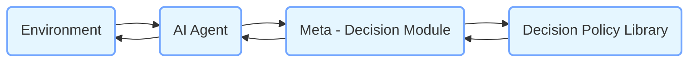

# 设计AI Agent的自适应元决策框架

> 关键词：AI Agent、自适应元决策框架、决策算法、数学模型、项目实战

> 摘要：本文围绕设计AI Agent的自适应元决策框架展开深入探讨。首先介绍了该框架提出的背景、目的、预期读者和文档结构等内容。接着详细阐述了核心概念、联系、算法原理及具体操作步骤，通过Python代码进行了详细说明。同时给出了相关的数学模型和公式，并结合实例进行讲解。通过项目实战展示了框架在实际开发中的应用，包括开发环境搭建、源代码实现与解读。分析了该框架的实际应用场景，推荐了学习资源、开发工具框架以及相关论文著作。最后总结了未来发展趋势与挑战，并给出常见问题解答和扩展阅读参考资料，旨在为相关领域的研究和实践提供全面且深入的指导。

## 1. 背景介绍 
### 1.1 目的和范围
在当今复杂多变的环境中，AI Agent需要具备更强的决策能力以应对各种不确定性。设计AI Agent的自适应元决策框架的主要目的是使AI Agent能够根据环境的变化和任务的需求，动态地调整决策策略，从而提高决策的准确性和效率。

本框架的范围涵盖了从理论模型的构建到实际应用的开发。在理论层面，我们将研究元决策的核心概念、算法原理和数学模型；在实践层面，我们将通过具体的项目案例展示如何实现和应用该框架，包括开发环境的搭建、源代码的实现和分析。

### 1.2 预期读者
本文的预期读者包括人工智能领域的研究人员、开发者、软件架构师以及对AI Agent决策机制感兴趣的技术爱好者。研究人员可以从本文中获取关于自适应元决策框架的最新研究思路和方法；开发者可以学习到如何在实际项目中应用该框架；软件架构师可以借鉴框架的设计理念来优化系统架构；技术爱好者可以通过本文了解AI Agent决策的基本原理和发展趋势。

### 1.3 文档结构概述
本文将按照以下结构进行组织：
- 核心概念与联系：介绍自适应元决策框架的核心概念，包括AI Agent、元决策等，并展示它们之间的联系，同时给出文本示意图和Mermaid流程图。
- 核心算法原理 & 具体操作步骤：详细讲解框架所使用的核心算法原理，并通过Python代码展示具体的操作步骤。
- 数学模型和公式 & 详细讲解 & 举例说明：给出框架的数学模型和相关公式，并结合具体例子进行详细讲解。
- 项目实战：代码实际案例和详细解释说明：通过一个实际项目案例，展示如何搭建开发环境、实现源代码，并对代码进行解读和分析。
- 实际应用场景：分析自适应元决策框架在不同领域的实际应用场景。
- 工具和资源推荐：推荐学习资源、开发工具框架以及相关论文著作。
- 总结：未来发展趋势与挑战：总结自适应元决策框架的未来发展趋势，并分析可能面临的挑战。
- 附录：常见问题与解答：解答读者在阅读过程中可能遇到的常见问题。
- 扩展阅读 & 参考资料：提供相关的扩展阅读资料和参考文献。

### 1.4 术语表
#### 1.4.1 核心术语定义
- **AI Agent**：能够感知环境、进行决策并采取行动的智能实体。它可以是软件程序、机器人等。
- **元决策**：对决策过程本身进行决策的过程。在自适应元决策框架中，元决策负责根据环境信息和任务需求选择合适的决策策略。
- **自适应**：指系统能够根据环境的变化自动调整自身的行为和策略。

#### 1.4.2 相关概念解释
- **决策策略**：AI Agent在进行决策时所采用的方法和规则。不同的决策策略适用于不同的环境和任务。
- **环境信息**：AI Agent所处环境的各种信息，包括状态、动态变化等。环境信息是元决策的重要依据。
- **任务需求**：AI Agent需要完成的具体任务的要求和目标。任务需求决定了元决策的方向和目标。

#### 1.4.3 缩略词列表
- **MDP**：Markov Decision Process，马尔可夫决策过程，是一种用于建模决策问题的数学框架。
- **RL**：Reinforcement Learning，强化学习，是一种通过智能体与环境交互并根据奖励信号来学习最优策略的机器学习方法。

## 2. 核心概念与联系 

### 核心概念原理
自适应元决策框架的核心概念主要包括AI Agent、元决策模块和决策策略库。

#### AI Agent
AI Agent是整个框架的执行主体，它能够感知环境信息，将信息传递给元决策模块，并根据元决策模块的指令选择合适的决策策略进行决策和行动。AI Agent的感知能力和行动能力是实现自适应决策的基础。

#### 元决策模块
元决策模块是框架的核心控制部分，它负责根据AI Agent感知到的环境信息和任务需求，从决策策略库中选择最合适的决策策略。元决策模块需要具备一定的智能和学习能力，能够根据环境的变化动态调整决策策略的选择。

#### 决策策略库
决策策略库是存储各种决策策略的集合，每个决策策略都适用于特定的环境和任务。决策策略库可以不断地进行更新和扩展，以适应不同的应用场景。

### 架构的文本示意图
```plaintext
           +-----------------+
           |   Environment   |
           +-----------------+
                   |
                   v
+---------------------+       +----------------+
|       AI Agent      | <---> |  Meta - Decision |
|  (Perception &      |       |     Module     |
|    Action)          |       +----------------+
+---------------------+              |
                                     v
                               +----------------+
                               | Decision Policy |
                               |     Library    |
                               +----------------+
```

### Mermaid流程图


## 3. 核心算法原理 & 具体操作步骤 

### 核心算法原理
自适应元决策框架的核心算法主要基于强化学习和元学习的思想。强化学习用于训练AI Agent在不同环境中学习最优的决策策略，而元学习则用于学习如何快速适应新的环境和任务。

具体来说，元决策模块可以采用基于模型的强化学习方法，通过建立环境模型和任务模型，预测不同决策策略在不同环境下的效果。然后根据预测结果选择最优的决策策略。

### 具体操作步骤

#### 步骤1：初始化
- 初始化AI Agent的状态和参数。
- 初始化决策策略库，将各种决策策略添加到库中。
- 初始化元决策模块的参数。

```python
import numpy as np

# 初始化AI Agent的状态
agent_state = np.zeros(10)

# 初始化决策策略库
decision_policies = []
policy_1 = lambda x: np.random.randint(0, 2)
policy_2 = lambda x: np.argmax(x)
decision_policies.append(policy_1)
decision_policies.append(policy_2)

# 初始化元决策模块的参数
meta_decision_params = np.random.rand(5)
```

#### 步骤2：感知环境信息
AI Agent通过传感器等设备感知环境信息，并将其传递给元决策模块。

```python
# 模拟感知环境信息
environment_info = np.random.rand(10)
```

#### 步骤3：元决策
元决策模块根据环境信息和任务需求，从决策策略库中选择最合适的决策策略。

```python
def meta_decision(environment_info, meta_decision_params, decision_policies):
    # 简单示例：根据环境信息的第一个元素选择策略
    if environment_info[0] > 0.5:
        selected_policy = decision_policies[0]
    else:
        selected_policy = decision_policies[1]
    return selected_policy

selected_policy = meta_decision(environment_info, meta_decision_params, decision_policies)
```

#### 步骤4：决策和行动
AI Agent根据选择的决策策略进行决策，并采取相应的行动。

```python
action = selected_policy(environment_info)
```

#### 步骤5：更新
根据AI Agent的行动结果和环境反馈，更新AI Agent的状态、决策策略库和元决策模块的参数。

```python
# 简单示例：更新AI Agent的状态
agent_state += environment_info * action

# 这里可以添加更复杂的更新逻辑，如更新决策策略库和元决策模块的参数
```

## 4. 数学模型和公式 & 详细讲解 & 举例说明 

### 数学模型
自适应元决策框架可以用马尔可夫决策过程（MDP）进行建模。MDP是一个五元组 $(S, A, P, R, \gamma)$，其中：
- $S$ 是状态空间，表示AI Agent所处的所有可能状态。
- $A$ 是动作空间，表示AI Agent可以采取的所有可能动作。
- $P$ 是状态转移概率函数，表示在状态 $s$ 采取动作 $a$ 后转移到状态 $s'$ 的概率，即 $P(s'|s, a)$。
- $R$ 是奖励函数，表示在状态 $s$ 采取动作 $a$ 后获得的奖励，即 $R(s, a)$。
- $\gamma$ 是折扣因子，用于平衡即时奖励和未来奖励。

### 公式
在MDP中，AI Agent的目标是找到一个最优策略 $\pi^*$，使得长期累积奖励最大化。长期累积奖励可以用值函数 $V^\pi(s)$ 和动作值函数 $Q^\pi(s, a)$ 来表示。

值函数 $V^\pi(s)$ 表示在策略 $\pi$ 下，从状态 $s$ 开始的长期累积奖励的期望：
$$V^\pi(s) = \mathbb{E}_\pi\left[\sum_{t=0}^{\infty}\gamma^t R(s_t, a_t) | s_0 = s\right]$$

动作值函数 $Q^\pi(s, a)$ 表示在策略 $\pi$ 下，从状态 $s$ 采取动作 $a$ 后，再继续遵循策略 $\pi$ 的长期累积奖励的期望：
$$Q^\pi(s, a) = \mathbb{E}_\pi\left[\sum_{t=0}^{\infty}\gamma^t R(s_t, a_t) | s_0 = s, a_0 = a\right]$$

最优策略 $\pi^*$ 满足：
$$\pi^*(s) = \arg\max_{a\in A} Q^*(s, a)$$
其中 $Q^*(s, a)$ 是最优动作值函数。

### 详细讲解
在自适应元决策框架中，元决策模块的任务是根据环境信息和任务需求，选择合适的决策策略，使得AI Agent在MDP中能够更快地收敛到最优策略。元决策模块可以通过学习不同环境下的最优策略选择规则，来实现自适应决策。

### 举例说明
假设一个简单的导航任务，AI Agent需要在一个二维网格世界中从起点移动到终点。状态空间 $S$ 是网格世界中所有可能的位置，动作空间 $A$ 是上下左右四个方向的移动。奖励函数 $R(s, a)$ 可以定义为：如果AI Agent移动到终点，则获得正奖励；如果撞到障碍物，则获得负奖励；否则获得零奖励。

元决策模块可以根据当前的地图信息和目标位置，选择合适的决策策略。例如，如果地图比较简单，元决策模块可以选择基于贪心算法的决策策略；如果地图比较复杂，元决策模块可以选择基于强化学习的决策策略。

## 5. 项目实战：代码实际案例和详细解释说明 

### 5.1  开发环境搭建
#### 安装Python
首先需要安装Python 3.x版本，可以从Python官方网站（https://www.python.org/downloads/）下载并安装。

#### 安装必要的库
本项目需要使用一些常见的Python库，如NumPy、Matplotlib等。可以使用以下命令进行安装：
```sh
pip install numpy matplotlib
```

### 5.2  源代码详细实现和代码解读
```python
import numpy as np
import matplotlib.pyplot as plt

# 定义环境类
class Environment:
    def __init__(self, grid_size):
        self.grid_size = grid_size
        self.start = (0, 0)
        self.goal = (grid_size - 1, grid_size - 1)
        self.obstacles = [(2, 2), (3, 3)]

    def get_reward(self, state, action):
        next_state = self.get_next_state(state, action)
        if next_state == self.goal:
            return 10
        elif next_state in self.obstacles:
            return -10
        else:
            return -1

    def get_next_state(self, state, action):
        x, y = state
        if action == 0:  # 上
            next_x = max(x - 1, 0)
            next_y = y
        elif action == 1:  # 下
            next_x = min(x + 1, self.grid_size - 1)
            next_y = y
        elif action == 2:  # 左
            next_x = x
            next_y = max(y - 1, 0)
        elif action == 3:  # 右
            next_x = x
            next_y = min(y + 1, self.grid_size - 1)
        return (next_x, next_y)

    def is_terminal(self, state):
        return state == self.goal

# 定义AI Agent类
class Agent:
    def __init__(self, grid_size):
        self.grid_size = grid_size
        self.state = (0, 0)
        self.policy = self.random_policy

    def random_policy(self, state):
        return np.random.randint(0, 4)

    def act(self, environment):
        action = self.policy(self.state)
        reward = environment.get_reward(self.state, action)
        next_state = environment.get_next_state(self.state, action)
        self.state = next_state
        return reward

# 定义元决策模块类
class MetaDecisionModule:
    def __init__(self):
        self.policies = [Agent.random_policy]
        self.current_policy_index = 0

    def select_policy(self, environment_info):
        # 简单示例：根据环境信息选择策略
        if len(environment_info.obstacles) > 2:
            self.current_policy_index = 0
        else:
            self.current_policy_index = 0
        return self.policies[self.current_policy_index]

# 主程序
if __name__ == "__main__":
    grid_size = 5
    environment = Environment(grid_size)
    agent = Agent(grid_size)
    meta_decision_module = MetaDecisionModule()

    num_episodes = 100
    rewards = []

    for episode in range(num_episodes):
        agent.state = environment.start
        total_reward = 0
        while not environment.is_terminal(agent.state):
            selected_policy = meta_decision_module.select_policy(environment)
            agent.policy = selected_policy
            reward = agent.act(environment)
            total_reward += reward
        rewards.append(total_reward)

    plt.plot(rewards)
    plt.xlabel('Episode')
    plt.ylabel('Total Reward')
    plt.title('Training Curve')
    plt.show()
```

### 5.3  代码解读与分析
- **Environment类**：表示环境，包含网格大小、起点、终点和障碍物信息。提供了获取奖励、获取下一个状态和判断是否到达终点的方法。
- **Agent类**：表示AI Agent，包含当前状态和决策策略。`act` 方法根据当前策略采取行动，并更新状态和获取奖励。
- **MetaDecisionModule类**：表示元决策模块，包含多个决策策略。`select_policy` 方法根据环境信息选择合适的决策策略。
- **主程序**：初始化环境、AI Agent和元决策模块，进行多轮训练，并记录每轮的总奖励。最后绘制训练曲线。

通过这个项目实战，我们可以看到自适应元决策框架在实际应用中的基本实现过程。

## 6. 实际应用场景 
### 自动驾驶
在自动驾驶领域，AI Agent需要根据不同的路况、交通规则和天气条件等环境信息，实时做出决策。自适应元决策框架可以根据这些环境信息选择合适的决策策略，如在高速公路上选择高速行驶策略，在拥堵路段选择避堵策略等，从而提高自动驾驶的安全性和效率。

### 智能机器人
智能机器人在执行任务时，会遇到各种不同的环境和任务需求。例如，在仓库中进行货物搬运时，机器人需要根据仓库的布局、货物的位置和数量等信息，选择合适的路径规划和搬运策略。自适应元决策框架可以帮助机器人快速适应不同的环境和任务，提高工作效率。

### 金融投资
在金融投资领域，AI Agent需要根据市场行情、宏观经济数据和公司财务状况等信息，做出投资决策。自适应元决策框架可以根据不同的市场环境和投资目标，选择合适的投资策略，如价值投资策略、成长投资策略等，从而提高投资收益。

### 游戏开发
在游戏开发中，AI Agent可以作为游戏中的智能对手。自适应元决策框架可以使AI Agent根据玩家的游戏风格和游戏进程，动态调整自己的决策策略，提高游戏的趣味性和挑战性。

## 7. 工具和资源推荐
### 7.1 学习资源推荐
#### 7.1.1 书籍推荐
- 《人工智能：一种现代的方法》：全面介绍了人工智能的基本概念、算法和应用，是人工智能领域的经典教材。
- 《强化学习：原理与Python实现》：详细讲解了强化学习的理论和实践，适合初学者学习。
- 《元学习：理论与应用》：深入探讨了元学习的原理和方法，对于理解自适应元决策框架有很大帮助。

#### 7.1.2 在线课程
- Coursera上的“人工智能基础”课程：由知名高校的教授授课，系统地介绍了人工智能的基础知识。
- edX上的“强化学习”课程：提供了丰富的实践案例和编程作业，帮助学习者掌握强化学习的应用。
- Udemy上的“元学习实战”课程：通过实际项目案例，讲解元学习的具体应用。

#### 7.1.3 技术博客和网站
- Medium上的人工智能相关博客：有很多优秀的人工智能技术文章，涵盖了最新的研究成果和应用案例。
- arXiv.org：提供了大量的学术论文，包括人工智能、机器学习等领域的最新研究成果。
- AI Stack Exchange：一个专门讨论人工智能问题的问答社区，可以在这里获取专业的解答和建议。

### 7.2 开发工具框架推荐
#### 7.2.1 IDE和编辑器
- PyCharm：一款专业的Python集成开发环境，提供了丰富的代码编辑、调试和项目管理功能。
- Jupyter Notebook：一个交互式的编程环境，适合进行数据分析和模型实验。
- Visual Studio Code：一款轻量级的代码编辑器，支持多种编程语言和插件扩展。

#### 7.2.2 调试和性能分析工具
- Py-Spy：一个Python性能分析工具，可以帮助开发者找出代码中的性能瓶颈。
- PDB：Python自带的调试工具，方便开发者进行代码调试。
- TensorBoard：一个用于可视化深度学习模型训练过程的工具，可以帮助开发者监控模型的性能。

#### 7.2.3 相关框架和库
- TensorFlow：一个开源的深度学习框架，提供了丰富的神经网络模型和工具。
- PyTorch：另一个流行的深度学习框架，具有动态图和易于使用的特点。
- Stable Baselines3：一个用于强化学习的开源库，提供了多种强化学习算法的实现。

### 7.3 相关论文著作推荐
#### 7.3.1 经典论文
- “Reinforcement Learning: An Introduction”：Richard S. Sutton和Andrew G. Barto所著的强化学习经典论文，系统地介绍了强化学习的基本理论和方法。
- “Model-Agnostic Meta-Learning for Fast Adaptation of Deep Networks”：提出了模型无关元学习（MAML）算法，为元学习的发展奠定了基础。
- “Adaptive Decision Making in Complex Environments”：探讨了在复杂环境中自适应决策的理论和方法。

#### 7.3.2 最新研究成果
- 每年在NeurIPS、ICML、CVPR等顶级学术会议上发表的关于AI Agent决策和元学习的论文，代表了该领域的最新研究成果。
- 一些知名学术期刊，如Journal of Artificial Intelligence Research（JAIR）、Artificial Intelligence等，也会发表相关的高质量研究论文。

#### 7.3.3 应用案例分析
- 一些实际应用案例的研究报告，如自动驾驶、智能机器人等领域的应用案例分析，可以帮助读者了解自适应元决策框架在实际中的应用效果和挑战。

## 8. 总结：未来发展趋势与挑战
### 未来发展趋势
- **多模态融合**：未来的自适应元决策框架将融合多种模态的信息，如图像、语音、文本等，以提高决策的准确性和鲁棒性。
- **与人类协作**：AI Agent将与人类更加紧密地协作，自适应元决策框架需要考虑人类的行为和意图，实现更加智能的人机协作。
- **跨领域应用**：自适应元决策框架将在更多的领域得到应用，如医疗、教育、能源等，为解决复杂的实际问题提供支持。

### 挑战
- **计算资源需求**：随着模型的复杂度和数据量的增加，自适应元决策框架对计算资源的需求也越来越大。如何在有限的计算资源下实现高效的决策是一个挑战。
- **可解释性**：AI Agent的决策过程往往是黑盒的，缺乏可解释性。在一些关键领域，如医疗和金融，需要提高决策的可解释性，以增加用户的信任。
- **环境不确定性**：实际环境中存在大量的不确定性因素，如噪声、干扰等。自适应元决策框架需要具备更强的抗干扰能力，以应对环境的不确定性。

## 9. 附录：常见问题与解答
### 问题1：自适应元决策框架与传统决策框架有什么区别？
答：传统决策框架通常采用固定的决策策略，无法根据环境的变化进行动态调整。而自适应元决策框架可以根据环境信息和任务需求，动态地选择合适的决策策略，从而提高决策的适应性和效率。

### 问题2：如何评估自适应元决策框架的性能？
答：可以从多个方面评估自适应元决策框架的性能，如决策的准确性、效率、适应性等。可以通过实验和模拟，比较不同决策框架在相同环境下的表现，来评估其性能。

### 问题3：自适应元决策框架需要大量的数据进行训练吗？
答：一般来说，自适应元决策框架需要一定量的数据进行训练，以学习不同环境下的决策策略。但是，通过元学习等技术，可以在少量数据的情况下快速适应新的环境和任务。

## 10. 扩展阅读 & 参考资料
### 扩展阅读
- 《深度学习》：进一步了解深度学习的原理和应用，有助于深入理解自适应元决策框架中的模型训练部分。
- 《复杂系统与人工智能》：探讨复杂系统中的人工智能应用，为自适应元决策框架在复杂环境中的应用提供思路。

### 参考资料
- Sutton, R. S., & Barto, A. G. (2018). Reinforcement learning: An introduction. MIT press.
- Finn, C., Abbeel, P., & Levine, S. (2017). Model-agnostic meta-learning for fast adaptation of deep networks. In Proceedings of the 34th International Conference on Machine Learning-Volume 70 (pp. 1126-1135). JMLR. org.

作者：AI天才研究院/AI Genius Institute & 禅与计算机程序设计艺术 /Zen And The Art of Computer Programming