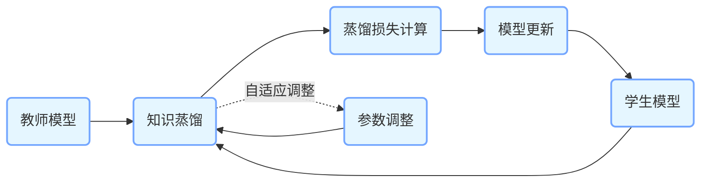

# 设计AI Agent的自适应知识蒸馏与迁移

> 关键词：AI Agent、自适应知识蒸馏、知识迁移、机器学习、深度学习

> 摘要：本文聚焦于AI Agent的自适应知识蒸馏与迁移这一前沿话题。首先介绍了相关背景，包括目的、预期读者、文档结构和术语表。接着阐述了核心概念及其联系，通过文本示意图和Mermaid流程图进行直观展示。详细讲解了核心算法原理和具体操作步骤，并用Python代码进行说明。深入探讨了数学模型和公式，结合实际例子加深理解。通过项目实战，从开发环境搭建到源代码实现和解读，展示了技术的实际应用。分析了实际应用场景，推荐了学习、开发相关的工具和资源，最后总结了未来发展趋势与挑战，并提供了常见问题解答和扩展阅读参考资料。旨在帮助读者全面了解和掌握AI Agent的自适应知识蒸馏与迁移技术。

## 1. 背景介绍 
### 1.1 目的和范围
随着人工智能技术的不断发展，AI Agent在各个领域得到了广泛应用。然而，训练一个高效、智能的AI Agent往往需要大量的计算资源和时间。自适应知识蒸馏与迁移技术旨在解决这些问题，通过将知识从一个模型（教师模型）转移到另一个模型（学生模型），减少训练成本，提高模型的性能和泛化能力。本文的范围涵盖了自适应知识蒸馏与迁移的核心概念、算法原理、数学模型、实际应用以及相关工具和资源推荐等方面。

### 1.2 预期读者
本文预期读者包括人工智能领域的研究人员、工程师、开发者，以及对AI Agent技术感兴趣的学生和爱好者。读者需要具备一定的机器学习和深度学习基础知识，了解神经网络的基本原理和常见的训练方法。

### 1.3 文档结构概述
本文共分为十个部分。第一部分是背景介绍，包括目的、预期读者、文档结构和术语表。第二部分阐述核心概念与联系，通过文本示意图和Mermaid流程图进行展示。第三部分讲解核心算法原理和具体操作步骤，并用Python代码进行说明。第四部分深入探讨数学模型和公式，结合实际例子加深理解。第五部分进行项目实战，包括开发环境搭建、源代码实现和解读。第六部分分析实际应用场景。第七部分推荐学习、开发相关的工具和资源。第八部分总结未来发展趋势与挑战。第九部分提供常见问题解答。第十部分列出扩展阅读和参考资料。

### 1.4 术语表
#### 1.4.1 核心术语定义
- **AI Agent**：人工智能代理，是一种能够感知环境、做出决策并采取行动的智能实体。
- **知识蒸馏**：一种模型压缩技术，通过将教师模型的知识转移到学生模型中，使学生模型能够在较小的模型规模下达到接近教师模型的性能。
- **自适应知识蒸馏**：在知识蒸馏过程中，根据不同的情况自动调整蒸馏参数，以提高蒸馏效果。
- **知识迁移**：将在一个任务或领域中学习到的知识应用到另一个任务或领域中。

#### 1.4.2 相关概念解释
- **教师模型**：通常是一个性能较好但规模较大的模型，用于提供知识给学生模型。
- **学生模型**：规模较小的模型，通过知识蒸馏从教师模型中学习知识。
- **蒸馏损失**：衡量教师模型和学生模型之间知识差异的损失函数。

#### 1.4.3 缩略词列表
- **DNN**：深度神经网络（Deep Neural Network）
- **CNN**：卷积神经网络（Convolutional Neural Network）
- **RNN**：循环神经网络（Recurrent Neural Network）

## 2. 核心概念与联系 
### 核心概念原理
自适应知识蒸馏与迁移的核心思想是将教师模型中蕴含的知识有效地转移到学生模型中，同时根据不同的情况自适应地调整蒸馏过程。教师模型通常在大规模数据集上进行训练，具有较高的性能，但可能因为模型规模较大而难以部署。学生模型则相对较小，便于在资源受限的环境中运行。通过知识蒸馏，学生模型可以学习到教师模型的决策模式和特征表示，从而提高自身的性能。

自适应知识蒸馏强调在蒸馏过程中根据不同的任务、数据集和模型状态动态调整蒸馏参数。例如，在训练初期，可以给予教师模型的输出较大的权重，让学生模型快速学习到教师模型的整体决策模式；在训练后期，可以适当降低教师模型的权重，让学生模型更多地学习自己的特征表示，提高泛化能力。

知识迁移则是将在一个任务或领域中学习到的知识应用到另一个任务或领域中。这可以通过共享模型的某些层或参数来实现，减少在新任务上的训练时间和计算资源。

### 文本示意图
```plaintext
+------------------+        +------------------+
|   教师模型       |        |   学生模型       |
| (大规模、高性能) | -----> | (小规模、轻量级) |
|                  |        |                  |
+------------------+        +------------------+
          |                        |
          |  知识蒸馏              |
          |  (自适应调整参数)      |
          |                        |
+------------------+        +------------------+
|   蒸馏损失计算   |        |   模型更新       |
|                  | <----- |                  |
+------------------+        +------------------+
```

### Mermaid流程图


## 3. 核心算法原理 & 具体操作步骤 
### 核心算法原理
自适应知识蒸馏的核心算法主要包括两个部分：知识蒸馏损失的计算和自适应参数调整。

知识蒸馏损失通常由两部分组成：一部分是学生模型和教师模型输出之间的软标签损失，另一部分是学生模型和真实标签之间的硬标签损失。软标签损失可以让学生模型学习到教师模型的决策模式，硬标签损失可以确保学生模型对真实数据的拟合能力。

自适应参数调整则是根据训练过程中的一些指标，如损失值、准确率等，动态调整软标签损失和硬标签损失的权重。

### 具体操作步骤
1. **初始化模型**：初始化教师模型和学生模型的参数。
2. **计算蒸馏损失**：
    - 计算学生模型和教师模型输出之间的软标签损失 $L_{soft}$。
    - 计算学生模型和真实标签之间的硬标签损失 $L_{hard}$。
    - 计算总蒸馏损失 $L = \alpha L_{soft} + (1 - \alpha) L_{hard}$，其中 $\alpha$ 是自适应调整的参数。
3. **自适应参数调整**：
    - 根据训练过程中的指标，如损失值、准确率等，动态调整 $\alpha$ 的值。
4. **模型更新**：使用反向传播算法更新学生模型的参数，以最小化总蒸馏损失 $L$。

### Python源代码实现
```python
import torch
import torch.nn as nn
import torch.optim as optim

# 定义教师模型和学生模型
class TeacherModel(nn.Module):
    def __init__(self):
        super(TeacherModel, self).__init__()
        self.fc1 = nn.Linear(10, 20)
        self.fc2 = nn.Linear(20, 2)

    def forward(self, x):
        x = torch.relu(self.fc1(x))
        x = self.fc2(x)
        return x

class StudentModel(nn.Module):
    def __init__(self):
        super(StudentModel, self).__init__()
        self.fc1 = nn.Linear(10, 10)
        self.fc2 = nn.Linear(10, 2)

    def forward(self, x):
        x = torch.relu(self.fc1(x))
        x = self.fc2(x)
        return x

# 初始化模型
teacher_model = TeacherModel()
student_model = StudentModel()

# 定义损失函数和优化器
criterion_soft = nn.KLDivLoss(reduction='batchmean')
criterion_hard = nn.CrossEntropyLoss()
optimizer = optim.Adam(student_model.parameters(), lr=0.001)

# 训练参数
num_epochs = 100
alpha = 0.5

# 模拟训练数据
train_data = torch.randn(100, 10)
train_labels = torch.randint(0, 2, (100,))

for epoch in range(num_epochs):
    # 前向传播
    teacher_outputs = teacher_model(train_data)
    student_outputs = student_model(train_data)

    # 计算软标签损失
    soft_loss = criterion_soft(torch.log_softmax(student_outputs / 2, dim=1),
                               torch.softmax(teacher_outputs / 2, dim=1))

    # 计算硬标签损失
    hard_loss = criterion_hard(student_outputs, train_labels)

    # 计算总蒸馏损失
    total_loss = alpha * soft_loss + (1 - alpha) * hard_loss

    # 反向传播和优化
    optimizer.zero_grad()
    total_loss.backward()
    optimizer.step()

    # 自适应参数调整（简单示例：根据损失值调整alpha）
    if total_loss.item() < 0.1:
        alpha = 0.3
    elif total_loss.item() > 0.5:
        alpha = 0.7

    print(f'Epoch {epoch+1}/{num_epochs}, Loss: {total_loss.item()}')
```

## 4. 数学模型和公式 & 详细讲解 & 举例说明 
### 数学模型和公式
#### 软标签损失
软标签损失通常使用KL散度（Kullback-Leibler Divergence）来计算，公式如下：
$$
L_{soft} = D_{KL}(q || p) = \sum_{i=1}^{C} q_i \log \frac{q_i}{p_i}
$$
其中，$p$ 是教师模型输出的概率分布，$q$ 是学生模型输出的概率分布，$C$ 是类别数。

#### 硬标签损失
硬标签损失通常使用交叉熵损失（Cross Entropy Loss）来计算，公式如下：
$$
L_{hard} = - \sum_{i=1}^{N} y_i \log \hat{y}_i
$$
其中，$y$ 是真实标签的one-hot编码，$\hat{y}$ 是学生模型输出的概率分布，$N$ 是样本数。

#### 总蒸馏损失
总蒸馏损失是软标签损失和硬标签损失的加权和，公式如下：
$$
L = \alpha L_{soft} + (1 - \alpha) L_{hard}
$$
其中，$\alpha$ 是自适应调整的参数，$0 \leq \alpha \leq 1$。

### 详细讲解
软标签损失的作用是让学生模型学习到教师模型的决策模式。通过KL散度，学生模型可以学习到教师模型对不同类别的置信度分布，从而提高自身的泛化能力。

硬标签损失的作用是确保学生模型对真实数据的拟合能力。交叉熵损失可以衡量学生模型输出的概率分布和真实标签之间的差异，通过最小化交叉熵损失，学生模型可以更好地分类真实数据。

自适应参数 $\alpha$ 的作用是在软标签损失和硬标签损失之间进行权衡。在训练初期，$\alpha$ 可以设置得较大，让学生模型更多地学习教师模型的知识；在训练后期，$\alpha$ 可以适当减小，让学生模型更多地学习自己的特征表示。

### 举例说明
假设我们有一个二分类问题，教师模型的输出为 $p = [0.8, 0.2]$，学生模型的输出为 $q = [0.7, 0.3]$，真实标签为 $y = [1, 0]$。

#### 软标签损失计算
首先，计算 $q_i \log \frac{q_i}{p_i}$：
- 对于 $i = 1$：$0.7 \log \frac{0.7}{0.8} \approx -0.091$
- 对于 $i = 2$：$0.3 \log \frac{0.3}{0.2} \approx 0.127$

则软标签损失 $L_{soft} = -0.091 + 0.127 = 0.036$。

#### 硬标签损失计算
首先，计算 $y_i \log \hat{y}_i$：
- 对于 $i = 1$：$1 \times \log 0.7 \approx -0.357$
- 对于 $i = 2$：$0 \times \log 0.3 = 0$

则硬标签损失 $L_{hard} = -(-0.357) = 0.357$。

#### 总蒸馏损失计算
假设 $\alpha = 0.5$，则总蒸馏损失 $L = 0.5 \times 0.036 + (1 - 0.5) \times 0.357 = 0.1965$。

## 5. 项目实战：代码实际案例和详细解释说明 
### 5.1  开发环境搭建
#### 安装Python
首先，确保你已经安装了Python 3.6或更高版本。你可以从Python官方网站（https://www.python.org/downloads/）下载并安装Python。

#### 安装深度学习框架
我们使用PyTorch作为深度学习框架。可以使用以下命令安装PyTorch：
```bash
pip install torch torchvision
```

#### 安装其他依赖库
根据需要，安装其他必要的依赖库，如NumPy、Matplotlib等：
```bash
pip install numpy matplotlib
```

### 5.2  源代码详细实现和代码解读
```python
import torch
import torch.nn as nn
import torch.optim as optim
import numpy as np
import matplotlib.pyplot as plt

# 定义教师模型和学生模型
class TeacherModel(nn.Module):
    def __init__(self):
        super(TeacherModel, self).__init__()
        self.fc1 = nn.Linear(10, 20)
        self.fc2 = nn.Linear(20, 2)

    def forward(self, x):
        x = torch.relu(self.fc1(x))
        x = self.fc2(x)
        return x

class StudentModel(nn.Module):
    def __init__(self):
        super(StudentModel, self).__init__()
        self.fc1 = nn.Linear(10, 10)
        self.fc2 = nn.Linear(10, 2)

    def forward(self, x):
        x = torch.relu(self.fc1(x))
        x = self.fc2(x)
        return x

# 初始化模型
teacher_model = TeacherModel()
student_model = StudentModel()

# 定义损失函数和优化器
criterion_soft = nn.KLDivLoss(reduction='batchmean')
criterion_hard = nn.CrossEntropyLoss()
optimizer = optim.Adam(student_model.parameters(), lr=0.001)

# 训练参数
num_epochs = 100
alpha = 0.5
temperatures = [2, 4, 8]  # 不同的温度参数

# 模拟训练数据
train_data = torch.randn(100, 10)
train_labels = torch.randint(0, 2, (100,))

# 存储不同温度下的损失值
losses = {temp: [] for temp in temperatures}

for temp in temperatures:
    student_model = StudentModel()  # 重新初始化学生模型
    optimizer = optim.Adam(student_model.parameters(), lr=0.001)  # 重新初始化优化器
    for epoch in range(num_epochs):
        # 前向传播
        teacher_outputs = teacher_model(train_data)
        student_outputs = student_model(train_data)

        # 计算软标签损失
        soft_loss = criterion_soft(torch.log_softmax(student_outputs / temp, dim=1),
                                   torch.softmax(teacher_outputs / temp, dim=1))

        # 计算硬标签损失
        hard_loss = criterion_hard(student_outputs, train_labels)

        # 计算总蒸馏损失
        total_loss = alpha * soft_loss + (1 - alpha) * hard_loss

        # 反向传播和优化
        optimizer.zero_grad()
        total_loss.backward()
        optimizer.step()

        # 存储损失值
        losses[temp].append(total_loss.item())

        print(f'Temperature: {temp}, Epoch {epoch+1}/{num_epochs}, Loss: {total_loss.item()}')

# 绘制不同温度下的损失曲线
plt.figure(figsize=(10, 6))
for temp in temperatures:
    plt.plot(losses[temp], label=f'Temperature = {temp}')
plt.xlabel('Epoch')
plt.ylabel('Loss')
plt.title('Training Loss with Different Temperatures')
plt.legend()
plt.show()
```

### 5.3  代码解读与分析
#### 模型定义
- `TeacherModel` 和 `StudentModel` 分别定义了教师模型和学生模型。教师模型有两个全连接层，中间使用ReLU激活函数；学生模型的规模相对较小，也有两个全连接层。

#### 损失函数和优化器
- `criterion_soft` 使用KL散度损失函数计算软标签损失。
- `criterion_hard` 使用交叉熵损失函数计算硬标签损失。
- `optimizer` 使用Adam优化器更新学生模型的参数。

#### 训练过程
- 对于不同的温度参数 `temp`，重新初始化学生模型和优化器。
- 在每个训练周期中，计算教师模型和学生模型的输出。
- 计算软标签损失和硬标签损失，并根据 $\alpha$ 计算总蒸馏损失。
- 使用反向传播算法更新学生模型的参数。

#### 结果可视化
- 使用Matplotlib绘制不同温度下的损失曲线，帮助我们观察温度参数对训练过程的影响。

## 6. 实际应用场景 
### 智能物联网设备
在智能物联网设备中，由于设备的计算资源和存储容量有限，难以部署大规模的深度学习模型。通过自适应知识蒸馏与迁移技术，可以将在云端训练好的大型教师模型的知识迁移到设备端的小型学生模型中，实现设备端的智能推理。例如，智能摄像头可以实时进行图像识别和目标检测，而无需将大量数据上传到云端进行处理。

### 自动驾驶
自动驾驶系统需要在实时性和准确性之间取得平衡。自适应知识蒸馏与迁移技术可以帮助将在模拟环境中训练好的教师模型的知识迁移到实际驾驶场景中的学生模型中，减少在实际场景中的训练时间和成本。同时，通过自适应调整蒸馏参数，可以让学生模型更好地适应不同的驾驶环境和路况。

### 医疗影像诊断
医疗影像诊断需要高精度的模型，但训练这样的模型需要大量的医疗数据和计算资源。使用自适应知识蒸馏与迁移技术，可以将在大规模医疗影像数据集上训练好的教师模型的知识迁移到针对特定疾病或医院的学生模型中，提高诊断的准确性和效率。

## 7. 工具和资源推荐
### 7.1 学习资源推荐
#### 7.1.1 书籍推荐
- 《深度学习》（Deep Learning）：由Ian Goodfellow、Yoshua Bengio和Aaron Courville撰写，是深度学习领域的经典教材，涵盖了深度学习的基本原理、算法和应用。
- 《动手学深度学习》（Dive into Deep Learning）：由李沐等人编写，提供了丰富的代码示例和实践项目，适合初学者快速上手深度学习。

#### 7.1.2 在线课程
- Coursera上的“深度学习专项课程”（Deep Learning Specialization）：由Andrew Ng教授授课，包括神经网络、卷积神经网络、循环神经网络等多个主题，是学习深度学习的优质课程。
- edX上的“强化学习基础”（Foundations of Reinforcement Learning）：介绍了强化学习的基本概念、算法和应用，对于理解AI Agent的决策过程有很大帮助。

#### 7.1.3 技术博客和网站
- Medium上的Towards Data Science：汇集了众多数据科学和人工智能领域的优秀文章，涵盖了最新的研究成果和实践经验。
- arXiv.org：是一个预印本服务器，提供了大量的学术论文，包括人工智能、机器学习等领域的最新研究。

### 7.2 开发工具框架推荐
#### 7.2.1 IDE和编辑器
- PyCharm：是一款专业的Python集成开发环境，提供了丰富的代码编辑、调试和版本控制功能，适合开发深度学习项目。
- Jupyter Notebook：是一个交互式的开发环境，可以方便地编写和运行Python代码，同时支持Markdown文本和可视化输出，非常适合进行数据探索和模型实验。

#### 7.2.2 调试和性能分析工具
- TensorBoard：是TensorFlow提供的可视化工具，可以帮助用户监控模型的训练过程、查看损失曲线、可视化模型结构等。
- PyTorch Profiler：是PyTorch提供的性能分析工具，可以帮助用户分析模型的运行时间、内存使用情况等，优化模型性能。

#### 7.2.3 相关框架和库
- PyTorch：是一个开源的深度学习框架，提供了丰富的神经网络层和优化算法，支持GPU加速，易于使用和扩展。
- TensorFlow：是另一个广泛使用的深度学习框架，具有强大的分布式训练和部署能力，适合大规模的工业应用。

### 7.3 相关论文著作推荐
#### 7.3.1 经典论文
- “Distilling the Knowledge in a Neural Network”：由Geoffrey Hinton等人发表，首次提出了知识蒸馏的概念，为后续的研究奠定了基础。
- “Adaptive Knowledge Distillation for Efficient DNNs”：提出了自适应知识蒸馏的方法，通过动态调整蒸馏参数提高蒸馏效果。

#### 7.3.2 最新研究成果
- 关注NeurIPS、ICML、CVPR等顶级学术会议的论文，了解自适应知识蒸馏与迁移领域的最新研究进展。

#### 7.3.3 应用案例分析
- 一些实际应用案例的研究论文可以帮助我们了解自适应知识蒸馏与迁移技术在不同领域的应用效果和挑战。例如，在医疗影像诊断、自动驾驶等领域的相关论文。

## 8. 总结：未来发展趋势与挑战
### 未来发展趋势
- **多模态知识蒸馏与迁移**：随着人工智能技术的发展，多模态数据（如图像、文本、音频等）的处理变得越来越重要。未来的研究可能会关注如何进行多模态知识蒸馏与迁移，提高模型在多模态任务中的性能。
- **自适应策略的优化**：目前的自适应知识蒸馏方法大多基于简单的规则进行参数调整。未来可能会研究更加智能的自适应策略，如基于强化学习的自适应调整方法，以进一步提高蒸馏效果。
- **跨领域知识迁移**：将知识从一个领域迁移到另一个领域是一个具有挑战性但有潜力的研究方向。未来的研究可能会探索如何实现更加高效的跨领域知识迁移，解决不同领域之间的数据分布差异和语义差异问题。

### 挑战
- **知识表示的一致性**：在知识蒸馏与迁移过程中，如何确保教师模型和学生模型的知识表示具有一致性是一个关键问题。不同的模型结构和训练方法可能会导致知识表示的差异，影响蒸馏效果。
- **数据隐私和安全**：在进行知识迁移时，可能会涉及到数据隐私和安全问题。如何在不泄露敏感信息的情况下实现知识迁移是一个需要解决的挑战。
- **计算资源的限制**：虽然知识蒸馏与迁移技术可以减少模型的训练成本，但在一些资源受限的环境中，仍然需要进一步优化算法和模型结构，以适应计算资源的限制。

## 9. 附录：常见问题与解答
### 问题1：知识蒸馏和知识迁移有什么区别？
知识蒸馏主要是将一个模型（教师模型）的知识转移到另一个模型（学生模型）中，通常是在同一个任务或领域内进行。而知识迁移则是将在一个任务或领域中学习到的知识应用到另一个任务或领域中，更强调跨任务或跨领域的知识应用。

### 问题2：自适应参数 $\alpha$ 应该如何调整？
自适应参数 $\alpha$ 的调整可以根据训练过程中的指标，如损失值、准确率等进行。在训练初期，可以将 $\alpha$ 设置得较大，让学生模型更多地学习教师模型的知识；在训练后期，可以适当减小 $\alpha$，让学生模型更多地学习自己的特征表示。也可以使用一些自适应策略，如基于强化学习的方法来动态调整 $\alpha$。

### 问题3：温度参数在知识蒸馏中有什么作用？
温度参数可以控制教师模型和学生模型输出的概率分布的平滑程度。较高的温度会使概率分布更加平滑，强调模型对不同类别的置信度差异；较低的温度会使概率分布更加尖锐，强调模型对最可能类别的预测。通过调整温度参数，可以影响软标签损失的计算结果，从而影响知识蒸馏的效果。

## 10. 扩展阅读 & 参考资料
### 扩展阅读
- 阅读相关的学术论文，深入了解自适应知识蒸馏与迁移的最新研究进展。
- 参与开源项目，实践和探索知识蒸馏与迁移技术在实际项目中的应用。

### 参考资料
- Goodfellow, I., Bengio, Y., & Courville, A. (2016). Deep Learning. MIT Press.
- Li, M., et al. (2020). Dive into Deep Learning.
- Hinton, G., Vinyals, O., & Dean, J. (2015). Distilling the Knowledge in a Neural Network. arXiv preprint arXiv:1503.02531.
- [PyTorch官方文档](https://pytorch.org/docs/stable/index.html)
- [TensorFlow官方文档](https://www.tensorflow.org/api_docs)

作者：AI天才研究院/AI Genius Institute & 禅与计算机程序设计艺术 /Zen And The Art of Computer Programming