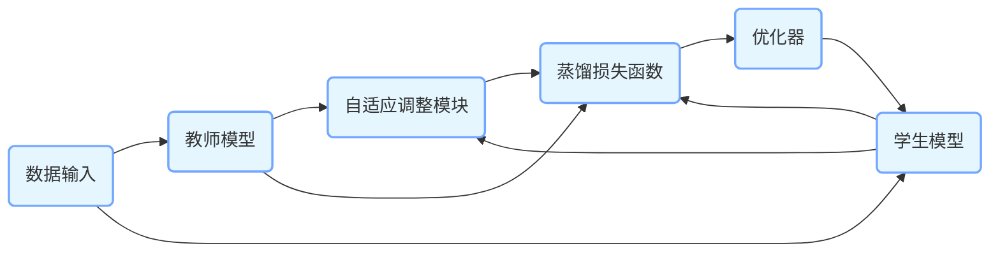

# 设计AI Agent的自适应知识蒸馏策略

> 关键词：AI Agent、自适应知识蒸馏、策略设计、机器学习、模型压缩

> 摘要：本文聚焦于设计AI Agent的自适应知识蒸馏策略。首先介绍了相关背景，包括目的范围、预期读者等内容。接着阐述了核心概念与联系，详细讲解了自适应知识蒸馏的原理和架构，并给出了相应的示意图和流程图。深入分析了核心算法原理，用Python代码进行详细说明，同时介绍了相关的数学模型和公式，并举例说明。通过项目实战，展示了开发环境搭建、源代码实现与解读。探讨了实际应用场景，推荐了学习资源、开发工具框架以及相关论文著作。最后总结了未来发展趋势与挑战，提供了常见问题解答和扩展阅读参考资料，旨在为AI Agent自适应知识蒸馏策略的设计提供全面且深入的指导。

## 1. 背景介绍 
### 1.1 目的和范围
随着人工智能技术的飞速发展，AI Agent在各个领域得到了广泛应用。然而，许多先进的AI模型往往具有庞大的参数和复杂的结构，这不仅导致计算资源需求巨大，而且在部署时面临诸多困难。知识蒸馏作为一种有效的模型压缩技术，可以将大型教师模型的知识转移到小型学生模型中，从而在保持一定性能的前提下降低模型的复杂度。

本文的目的在于设计一种自适应的知识蒸馏策略，使AI Agent能够根据不同的任务需求、数据分布和环境条件，动态地调整知识蒸馏的过程和参数，以实现更高效、更灵活的模型压缩和性能提升。范围涵盖了自适应知识蒸馏策略的原理、算法、数学模型、实际应用以及相关工具和资源的介绍。

### 1.2 预期读者
本文主要面向对人工智能、机器学习和模型压缩技术感兴趣的研究人员、开发者和工程师。对于正在从事AI Agent开发和优化的专业人士，以及希望深入了解知识蒸馏技术的学生和爱好者，本文将提供有价值的参考和指导。

### 1.3 文档结构概述
本文将按照以下结构进行组织：
1. **背景介绍**：阐述本文的目的、范围、预期读者和文档结构概述，同时给出相关术语的定义和解释。
2. **核心概念与联系**：介绍自适应知识蒸馏的核心概念，包括教师模型、学生模型、知识蒸馏损失函数等，并展示它们之间的关系和架构。
3. **核心算法原理 & 具体操作步骤**：详细讲解自适应知识蒸馏的核心算法，用Python代码实现具体的操作步骤。
4. **数学模型和公式 & 详细讲解 & 举例说明**：给出自适应知识蒸馏的数学模型和公式，进行详细讲解，并通过具体例子说明其应用。
5. **项目实战：代码实际案例和详细解释说明**：通过一个实际的项目案例，展示自适应知识蒸馏策略的开发环境搭建、源代码实现和代码解读。
6. **实际应用场景**：探讨自适应知识蒸馏策略在不同领域的实际应用场景。
7. **工具和资源推荐**：推荐相关的学习资源、开发工具框架和论文著作。
8. **总结：未来发展趋势与挑战**：总结自适应知识蒸馏策略的发展趋势和面临的挑战。
9. **附录：常见问题与解答**：解答读者在学习和应用自适应知识蒸馏策略过程中可能遇到的常见问题。
10. **扩展阅读 & 参考资料**：提供相关的扩展阅读材料和参考资料。

### 1.4 术语表
#### 1.4.1 核心术语定义
- **AI Agent**：能够感知环境、做出决策并采取行动以实现特定目标的人工智能实体。
- **知识蒸馏**：一种将大型教师模型的知识转移到小型学生模型中的技术，通过最小化教师模型和学生模型输出之间的差异来实现。
- **自适应知识蒸馏**：在知识蒸馏过程中，根据不同的任务需求、数据分布和环境条件，动态地调整蒸馏参数和策略。
- **教师模型**：具有较高性能和复杂度的大型模型，用于提供知识给学生模型。
- **学生模型**：相对较小、复杂度较低的模型，通过学习教师模型的知识来提高自身性能。
- **蒸馏损失函数**：用于衡量教师模型和学生模型输出之间差异的函数，通常由软标签损失和硬标签损失组成。

#### 1.4.2 相关概念解释
- **软标签**：教师模型输出的概率分布，包含了更多的知识信息，有助于学生模型学习到更丰富的特征。
- **硬标签**：数据集中的真实标签，用于监督学生模型的学习。
- **温度参数**：在知识蒸馏中，用于调整软标签的平滑程度，温度越高，软标签越平滑。

#### 1.4.3 缩略词列表
- **KD**：Knowledge Distillation（知识蒸馏）
- **AKD**：Adaptive Knowledge Distillation（自适应知识蒸馏）

## 2. 核心概念与联系 

### 核心概念原理
自适应知识蒸馏的核心思想是让学生模型在学习过程中能够根据不同的情况自适应地调整从教师模型中学习的方式和程度。传统的知识蒸馏通常采用固定的蒸馏参数，而自适应知识蒸馏则根据任务的难度、数据的分布以及模型的性能等因素动态地调整这些参数。

教师模型通常是一个经过充分训练的大型模型，具有较高的性能和丰富的知识。学生模型则是一个相对较小的模型，需要从教师模型中学习知识来提高自己的性能。在知识蒸馏过程中，通过最小化教师模型和学生模型输出之间的差异，将教师模型的知识转移到学生模型中。

### 架构的文本示意图
自适应知识蒸馏的架构可以分为以下几个部分：
1. **数据输入**：输入训练数据，包括图像、文本等。
2. **教师模型**：对输入数据进行处理，输出软标签和硬标签。
3. **学生模型**：对输入数据进行处理，输出预测结果。
4. **自适应调整模块**：根据任务需求、数据分布和模型性能等因素，动态地调整蒸馏参数，如温度参数、软标签和硬标签的权重等。
5. **蒸馏损失函数**：计算教师模型和学生模型输出之间的差异，包括软标签损失和硬标签损失。
6. **优化器**：根据蒸馏损失函数的结果，更新学生模型的参数。

### Mermaid流程图


该流程图展示了自适应知识蒸馏的主要流程。数据输入同时进入教师模型和学生模型，教师模型和学生模型的输出以及一些相关信息输入到自适应调整模块中，该模块根据这些信息动态调整蒸馏参数。然后，蒸馏损失函数计算教师模型和学生模型输出之间的差异，优化器根据损失函数的结果更新学生模型的参数。

## 3. 核心算法原理 & 具体操作步骤 

### 核心算法原理
自适应知识蒸馏的核心算法主要包括以下几个步骤：
1. **初始化**：初始化教师模型、学生模型、自适应调整模块和蒸馏损失函数。
2. **数据加载**：加载训练数据。
3. **前向传播**：将输入数据分别输入到教师模型和学生模型中，得到教师模型的软标签和硬标签，以及学生模型的预测结果。
4. **自适应调整**：自适应调整模块根据任务需求、数据分布和模型性能等因素，动态地调整蒸馏参数。
5. **损失计算**：根据调整后的蒸馏参数，计算蒸馏损失函数，包括软标签损失和硬标签损失。
6. **反向传播**：根据蒸馏损失函数的结果，使用优化器更新学生模型的参数。
7. **重复步骤3-6**：直到达到预定的训练轮数。

### 具体操作步骤（Python源代码）
```python
import torch
import torch.nn as nn
import torch.optim as optim

# 定义教师模型
class TeacherModel(nn.Module):
    def __init__(self):
        super(TeacherModel, self).__init__()
        # 这里简单示例，实际应用中可替换为更复杂的模型
        self.fc = nn.Linear(10, 5)

    def forward(self, x):
        return self.fc(x)

# 定义学生模型
class StudentModel(nn.Module):
    def __init__(self):
        super(StudentModel, self).__init__()
        # 这里简单示例，实际应用中可替换为更复杂的模型
        self.fc = nn.Linear(10, 5)

    def forward(self, x):
        return self.fc(x)

# 定义自适应调整模块
class AdaptiveAdjustmentModule:
    def __init__(self):
        self.temperature = 1.0
        self.soft_label_weight = 0.5

    def adjust(self, teacher_output, student_output, data):
        # 这里简单示例，实际应用中可根据具体情况调整
        # 例如根据数据的难度调整温度参数
        if len(data) > 10:
            self.temperature = 2.0
        else:
            self.temperature = 1.0
        return self.temperature, self.soft_label_weight

# 定义蒸馏损失函数
def distillation_loss(teacher_output, student_output, labels, temperature, soft_label_weight):
    soft_loss = nn.KLDivLoss()(nn.functional.log_softmax(student_output / temperature, dim=1),
                               nn.functional.softmax(teacher_output / temperature, dim=1)) * (temperature ** 2)
    hard_loss = nn.CrossEntropyLoss()(student_output, labels)
    return soft_label_weight * soft_loss + (1 - soft_label_weight) * hard_loss

# 初始化模型和模块
teacher_model = TeacherModel()
student_model = StudentModel()
adaptive_module = AdaptiveAdjustmentModule()

# 定义优化器
optimizer = optim.Adam(student_model.parameters(), lr=0.001)

# 模拟训练数据
data = torch.randn(20, 10)
labels = torch.randint(0, 5, (20,))

# 训练过程
num_epochs = 10
for epoch in range(num_epochs):
    # 前向传播
    teacher_output = teacher_model(data)
    student_output = student_model(data)

    # 自适应调整
    temperature, soft_label_weight = adaptive_module.adjust(teacher_output, student_output, data)

    # 损失计算
    loss = distillation_loss(teacher_output, student_output, labels, temperature, soft_label_weight)

    # 反向传播
    optimizer.zero_grad()
    loss.backward()
    optimizer.step()

    print(f'Epoch {epoch + 1}/{num_epochs}, Loss: {loss.item()}')
```
### 代码解释
1. **模型定义**：定义了教师模型和学生模型，这里简单使用了全连接层，实际应用中可替换为更复杂的模型。
2. **自适应调整模块**：定义了自适应调整模块，根据数据的长度简单调整温度参数，实际应用中可根据具体情况进行更复杂的调整。
3. **蒸馏损失函数**：定义了蒸馏损失函数，包括软标签损失和硬标签损失，根据自适应调整模块调整的参数计算总损失。
4. **训练过程**：在训练过程中，依次进行前向传播、自适应调整、损失计算和反向传播，更新学生模型的参数。

## 4. 数学模型和公式 & 详细讲解 & 举例说明 

### 数学模型和公式
自适应知识蒸馏的核心是蒸馏损失函数，通常由软标签损失和硬标签损失组成。

#### 软标签损失
软标签损失通常使用KL散度（Kullback-Leibler Divergence）来衡量教师模型和学生模型输出的概率分布之间的差异。KL散度的公式为：
$$
D_{KL}(P||Q) = \sum_{i} P(i) \log \frac{P(i)}{Q(i)}
$$
其中，$P$ 是教师模型输出的概率分布，$Q$ 是学生模型输出的概率分布。

在知识蒸馏中，为了使概率分布更加平滑，通常会引入温度参数 $T$。教师模型和学生模型的输出经过softmax函数处理后得到概率分布：
$$
P_i = \frac{\exp(z_{i}^T / T)}{\sum_{j} \exp(z_{j}^T / T)}
$$
$$
Q_i = \frac{\exp(z_{i}^S / T)}{\sum_{j} \exp(z_{j}^S / T)}
$$
其中，$z^T$ 是教师模型的输出，$z^S$ 是学生模型的输出。

软标签损失的公式为：
$$
L_{soft} = D_{KL}(P||Q) \times T^2
$$
乘以 $T^2$ 是为了在梯度计算时保持尺度的一致性。

#### 硬标签损失
硬标签损失通常使用交叉熵损失（Cross Entropy Loss）来衡量学生模型的预测结果与真实标签之间的差异。交叉熵损失的公式为：
$$
L_{hard} = - \sum_{i} y_i \log(p_i)
$$
其中，$y$ 是真实标签的one-hot编码，$p$ 是学生模型输出的概率分布。

#### 总损失
总损失是软标签损失和硬标签损失的加权和：
$$
L_{total} = \alpha L_{soft} + (1 - \alpha) L_{hard}
$$
其中，$\alpha$ 是软标签损失的权重，可通过自适应调整模块动态调整。

### 详细讲解
- **软标签损失**：软标签损失的作用是让学生模型学习到教师模型输出的概率分布中的知识，而不仅仅是学习到最终的分类结果。通过引入温度参数 $T$，可以调整概率分布的平滑程度，温度越高，概率分布越平滑，学生模型可以学习到更多的知识信息。
- **硬标签损失**：硬标签损失的作用是让学生模型学习到真实标签的信息，保证学生模型的预测结果与真实标签一致。
- **总损失**：总损失通过加权的方式将软标签损失和硬标签损失结合起来，通过调整权重 $\alpha$，可以控制学生模型从教师模型和真实标签中学习的程度。

### 举例说明
假设我们有一个三分类问题，教师模型的输出为 $z^T = [2, 1, 0]$，学生模型的输出为 $z^S = [1, 0.5, 0]$，真实标签为 $y = [1, 0, 0]$，温度参数 $T = 1$，软标签损失权重 $\alpha = 0.5$。

1. **计算软标签损失**：
    - 教师模型的概率分布 $P$：
$$
P_1 = \frac{\exp(2 / 1)}{\exp(2 / 1) + \exp(1 / 1) + \exp(0 / 1)} \approx 0.665
$$
$$
P_2 = \frac{\exp(1 / 1)}{\exp(2 / 1) + \exp(1 / 1) + \exp(0 / 1)} \approx 0.244
$$
$$
P_3 = \frac{\exp(0 / 1)}{\exp(2 / 1) + \exp(1 / 1) + \exp(0 / 1)} \approx 0.091
$$
    - 学生模型的概率分布 $Q$：
$$
Q_1 = \frac{\exp(1 / 1)}{\exp(1 / 1) + \exp(0.5 / 1) + \exp(0 / 1)} \approx 0.503
$$
$$
Q_2 = \frac{\exp(0.5 / 1)}{\exp(1 / 1) + \exp(0.5 / 1) + \exp(0 / 1)} \approx 0.303
$$
$$
Q_3 = \frac{\exp(0 / 1)}{\exp(1 / 1) + \exp(0.5 / 1) + \exp(0 / 1)} \approx 0.194
$$
    - 软标签损失 $L_{soft}$：
$$
L_{soft} = D_{KL}(P||Q) \times T^2 = \sum_{i} P(i) \log \frac{P(i)}{Q(i)} \times 1^2 \approx 0.132
$$

2. **计算硬标签损失**：
    - 学生模型的概率分布 $p$：
$$
p_1 = \frac{\exp(1)}{\exp(1) + \exp(0.5) + \exp(0)} \approx 0.503
$$
$$
p_2 = \frac{\exp(0.5)}{\exp(1) + \exp(0.5) + \exp(0)} \approx 0.303
$$
$$
p_3 = \frac{\exp(0)}{\exp(1) + \exp(0.5) + \exp(0)} \approx 0.194
$$
    - 硬标签损失 $L_{hard}$：
$$
L_{hard} = - \sum_{i} y_i \log(p_i) = - \log(0.503) \approx 0.688
$$

3. **计算总损失**：
$$
L_{total} = \alpha L_{soft} + (1 - \alpha) L_{hard} = 0.5 \times 0.132 + (1 - 0.5) \times 0.688 = 0.41
$$

通过以上计算，我们可以看到如何根据教师模型和学生模型的输出以及真实标签计算蒸馏损失函数。

## 5. 项目实战：代码实际案例和详细解释说明 

### 5.1  开发环境搭建
#### 安装Python
首先，确保你已经安装了Python，建议使用Python 3.6及以上版本。可以从Python官方网站（https://www.python.org/downloads/）下载并安装。

#### 安装深度学习框架
本文使用PyTorch作为深度学习框架，你可以根据自己的系统和CUDA版本选择合适的安装方式。在命令行中执行以下命令安装PyTorch：
```bash
pip install torch torchvision
```

#### 安装其他依赖库
还需要安装一些其他的依赖库，如NumPy、Matplotlib等。在命令行中执行以下命令安装：
```bash
pip install numpy matplotlib
```

### 5.2  源代码详细实现和代码解读
```python
import torch
import torch.nn as nn
import torch.optim as optim
import numpy as np
import matplotlib.pyplot as plt
from torch.utils.data import DataLoader, TensorDataset

# 定义教师模型
class TeacherModel(nn.Module):
    def __init__(self, input_size, hidden_size, output_size):
        super(TeacherModel, self).__init__()
        self.fc1 = nn.Linear(input_size, hidden_size)
        self.relu = nn.ReLU()
        self.fc2 = nn.Linear(hidden_size, output_size)

    def forward(self, x):
        out = self.fc1(x)
        out = self.relu(out)
        out = self.fc2(out)
        return out

# 定义学生模型
class StudentModel(nn.Module):
    def __init__(self, input_size, output_size):
        super(StudentModel, self).__init__()
        self.fc = nn.Linear(input_size, output_size)

    def forward(self, x):
        return self.fc(x)

# 定义自适应调整模块
class AdaptiveAdjustmentModule:
    def __init__(self, initial_temperature=1.0, initial_soft_label_weight=0.5):
        self.temperature = initial_temperature
        self.soft_label_weight = initial_soft_label_weight

    def adjust(self, teacher_output, student_output, data):
        # 根据学生模型和教师模型输出的差异调整温度参数
        diff = torch.mean(torch.abs(teacher_output - student_output))
        if diff > 1.0:
            self.temperature = 2.0
        else:
            self.temperature = 1.0
        return self.temperature, self.soft_label_weight

# 定义蒸馏损失函数
def distillation_loss(teacher_output, student_output, labels, temperature, soft_label_weight):
    soft_loss = nn.KLDivLoss()(nn.functional.log_softmax(student_output / temperature, dim=1),
                               nn.functional.softmax(teacher_output / temperature, dim=1)) * (temperature ** 2)
    hard_loss = nn.CrossEntropyLoss()(student_output, labels)
    return soft_label_weight * soft_loss + (1 - soft_label_weight) * hard_loss

# 生成模拟数据
input_size = 10
output_size = 5
num_samples = 1000
X = torch.randn(num_samples, input_size)
y = torch.randint(0, output_size, (num_samples,))

# 创建数据集和数据加载器
dataset = TensorDataset(X, y)
dataloader = DataLoader(dataset, batch_size=32, shuffle=True)

# 初始化模型和模块
teacher_model = TeacherModel(input_size, 20, output_size)
student_model = StudentModel(input_size, output_size)
adaptive_module = AdaptiveAdjustmentModule()

# 定义优化器
optimizer = optim.Adam(student_model.parameters(), lr=0.001)

# 训练过程
num_epochs = 20
train_losses = []
for epoch in range(num_epochs):
    epoch_loss = 0
    for batch_X, batch_y in dataloader:
        # 前向传播
        teacher_output = teacher_model(batch_X)
        student_output = student_model(batch_X)

        # 自适应调整
        temperature, soft_label_weight = adaptive_module.adjust(teacher_output, student_output, batch_X)

        # 损失计算
        loss = distillation_loss(teacher_output, student_output, batch_y, temperature, soft_label_weight)

        # 反向传播
        optimizer.zero_grad()
        loss.backward()
        optimizer.step()

        epoch_loss += loss.item()

    average_loss = epoch_loss / len(dataloader)
    train_losses.append(average_loss)
    print(f'Epoch {epoch + 1}/{num_epochs}, Loss: {average_loss}')

# 绘制训练损失曲线
plt.plot(train_losses)
plt.xlabel('Epoch')
plt.ylabel('Loss')
plt.title('Training Loss')
plt.show()
```

### 5.3  代码解读与分析
#### 模型定义
- **教师模型**：`TeacherModel` 是一个简单的两层全连接神经网络，包含一个隐藏层，使用ReLU激活函数。
- **学生模型**：`StudentModel` 是一个简单的单层全连接神经网络。

#### 自适应调整模块
`AdaptiveAdjustmentModule` 根据教师模型和学生模型输出的差异调整温度参数。如果差异较大，增加温度参数，使软标签更加平滑，让学生模型学习到更多的知识信息。

#### 蒸馏损失函数
`distillation_loss` 函数计算蒸馏损失，包括软标签损失和硬标签损失，根据自适应调整模块调整的参数计算总损失。

#### 数据生成和加载
使用 `torch.randn` 和 `torch.randint` 生成模拟数据，创建 `TensorDataset` 和 `DataLoader` 来加载数据。

#### 训练过程
在训练过程中，依次进行前向传播、自适应调整、损失计算和反向传播，更新学生模型的参数。记录每个epoch的平均损失，并绘制训练损失曲线。

通过以上代码，我们可以看到如何实现一个简单的自适应知识蒸馏项目，并观察训练过程中损失的变化情况。

## 6. 实际应用场景 
### 边缘设备部署
在边缘设备（如智能手机、智能手表、智能家居设备等）上，计算资源和存储容量通常有限。使用自适应知识蒸馏策略可以将大型的预训练模型压缩成小型的学生模型，在不损失太多性能的前提下，降低模型的计算复杂度和存储需求，从而实现模型在边缘设备上的高效部署。例如，在智能手机上进行图像识别任务时，使用自适应知识蒸馏后的模型可以更快地完成识别任务，同时减少电量消耗。

### 实时推理系统
在实时推理系统（如自动驾驶、智能安防等）中，对模型的推理速度有很高的要求。自适应知识蒸馏策略可以通过动态调整蒸馏参数，使学生模型在保证一定准确率的前提下，尽可能地提高推理速度。例如，在自动驾驶系统中，车辆需要实时对周围环境进行感知和决策，使用自适应知识蒸馏后的模型可以更快地处理图像和传感器数据，提高系统的响应速度和安全性。

### 多任务学习
在多任务学习场景中，不同的任务可能具有不同的难度和数据分布。自适应知识蒸馏策略可以根据不同任务的特点，动态地调整知识蒸馏的过程和参数，使学生模型能够更好地适应不同的任务需求。例如，在一个同时进行图像分类和目标检测的多任务学习系统中，自适应知识蒸馏可以让学生模型在不同任务之间灵活分配学习资源，提高整体性能。

### 模型更新和优化
在模型的更新和优化过程中，自适应知识蒸馏策略可以帮助新模型更快地学习到旧模型的知识。当有新的数据或任务出现时，可以使用自适应知识蒸馏将旧模型的知识转移到新模型中，减少新模型的训练时间和计算成本。例如，在一个不断更新的推荐系统中，使用自适应知识蒸馏可以让新的推荐模型快速学习到旧模型的用户偏好知识，提高推荐的准确性和效率。

## 7. 工具和资源推荐
### 7.1 学习资源推荐
#### 7.1.1 书籍推荐
- 《深度学习》（Deep Learning）：由Ian Goodfellow、Yoshua Bengio和Aaron Courville所著，是深度学习领域的经典教材，涵盖了深度学习的基本概念、算法和应用。
- 《Python深度学习》（Deep Learning with Python）：由Francois Chollet所著，介绍了如何使用Python和Keras进行深度学习的开发，适合初学者入门。
- 《机器学习》（Machine Learning）：由Tom Mitchell所著，是机器学习领域的经典教材，详细介绍了机器学习的各种算法和理论。

#### 7.1.2 在线课程
- Coursera上的“深度学习专项课程”（Deep Learning Specialization）：由Andrew Ng教授授课，包括五门课程，全面介绍了深度学习的各个方面。
- edX上的“强化学习基础”（Foundations of Reinforcement Learning）：介绍了强化学习的基本概念、算法和应用，适合对强化学习感兴趣的读者。
- 吴恩达的“机器学习”课程：是一门经典的机器学习入门课程，通过视频讲解和编程作业，帮助读者掌握机器学习的基本算法和应用。

#### 7.1.3 技术博客和网站
- Medium：是一个技术博客平台，上面有很多关于人工智能、机器学习和深度学习的文章和教程。
- Towards Data Science：是一个专注于数据科学和机器学习的博客网站，提供了很多高质量的技术文章和案例分析。
- arXiv：是一个预印本数据库，上面有很多最新的学术研究论文，涵盖了人工智能的各个领域。

### 7.2 开发工具框架推荐
#### 7.2.1 IDE和编辑器
- PyCharm：是一款专门为Python开发设计的集成开发环境（IDE），提供了丰富的功能和插件，适合开发大型的Python项目。
- Jupyter Notebook：是一个交互式的开发环境，支持Python、R等多种编程语言，适合进行数据探索和模型实验。
- Visual Studio Code：是一款轻量级的代码编辑器，支持多种编程语言和插件，具有良好的扩展性和用户体验。

#### 7.2.2 调试和性能分析工具
- TensorBoard：是TensorFlow提供的一个可视化工具，可以帮助用户可视化模型的训练过程、损失曲线、参数分布等信息，方便调试和优化模型。
- PyTorch Profiler：是PyTorch提供的一个性能分析工具，可以帮助用户分析模型的性能瓶颈，找出耗时较长的操作和代码段。
- NVIDIA Nsight Systems：是NVIDIA提供的一个性能分析工具，适用于GPU加速的深度学习模型，可以帮助用户分析GPU的使用情况和性能瓶颈。

#### 7.2.3 相关框架和库
- PyTorch：是一个开源的深度学习框架，具有动态图、易于使用等特点，广泛应用于学术界和工业界。
- TensorFlow：是一个开源的深度学习框架，具有强大的分布式训练和部署能力，适合大规模的深度学习项目。
- Scikit-learn：是一个开源的机器学习库，提供了丰富的机器学习算法和工具，适合进行机器学习的快速开发和实验。

### 7.3 相关论文著作推荐
#### 7.3.1 经典论文
- “Distilling the Knowledge in a Neural Network”：由Geoffrey Hinton等人发表，是知识蒸馏领域的经典论文，首次提出了知识蒸馏的概念和方法。
- “MobileNetV2: Inverted Residuals and Linear Bottlenecks”：由Mark Sandler等人发表，提出了一种轻量级的卷积神经网络架构MobileNetV2，适用于边缘设备上的图像识别任务。
- “Attention Is All You Need”：由Ashish Vaswani等人发表，提出了Transformer架构，是自然语言处理领域的重要突破。

#### 7.3.2 最新研究成果
- 关注arXiv上关于自适应知识蒸馏、模型压缩和轻量化的最新研究论文，了解该领域的最新发展动态。
- 参加相关的学术会议（如NeurIPS、ICML、CVPR等），听取最新的研究报告和成果分享。

#### 7.3.3 应用案例分析
- 可以在ACM Digital Library、IEEE Xplore等学术数据库中查找关于自适应知识蒸馏在不同领域应用的案例分析论文，了解实际应用中的经验和挑战。

## 8. 总结：未来发展趋势与挑战
### 未来发展趋势
#### 更智能的自适应策略
未来的自适应知识蒸馏策略将更加智能，能够根据更复杂的因素（如数据的动态变化、模型的实时性能等）动态调整蒸馏参数。例如，结合强化学习算法，让自适应调整模块能够自主学习最优的蒸馏策略，以适应不同的任务和环境。

#### 跨模态知识蒸馏
随着多模态数据（如图像、文本、音频等）的广泛应用，跨模态知识蒸馏将成为一个重要的研究方向。自适应知识蒸馏策略可以用于将不同模态的教师模型的知识转移到学生模型中，实现更强大的多模态学习能力。

#### 与其他技术的融合
自适应知识蒸馏策略将与其他技术（如迁移学习、元学习等）进行更深入的融合。例如，结合迁移学习，在不同领域之间快速迁移知识；结合元学习，让模型能够更快地适应新的任务和数据。

#### 硬件感知的知识蒸馏
随着硬件技术的不断发展，硬件感知的知识蒸馏将成为一个重要的发展趋势。自适应知识蒸馏策略可以根据不同的硬件平台（如GPU、FPGA等）的特点，动态调整蒸馏过程和模型结构，以实现更高效的硬件部署。

### 挑战
#### 自适应策略的设计难度
设计一个高效、智能的自适应策略是一个具有挑战性的问题。需要考虑多个因素之间的相互作用，并且要保证自适应调整的稳定性和收敛性。

#### 数据的多样性和动态性
在实际应用中，数据往往具有多样性和动态性。自适应知识蒸馏策略需要能够快速适应数据的变化，同时保证模型的性能和泛化能力。

#### 计算资源的限制
虽然知识蒸馏可以降低模型的计算复杂度，但在大规模数据和复杂任务的情况下，仍然需要大量的计算资源。如何在有限的计算资源下实现高效的自适应知识蒸馏是一个亟待解决的问题。

#### 模型可解释性
自适应知识蒸馏策略通常会增加模型的复杂度，使得模型的可解释性降低。如何在保证模型性能的前提下，提高模型的可解释性是一个重要的挑战。

## 9. 附录：常见问题与解答
### 1. 自适应知识蒸馏和传统知识蒸馏有什么区别？
传统知识蒸馏通常采用固定的蒸馏参数，而自适应知识蒸馏则根据不同的任务需求、数据分布和环境条件，动态地调整蒸馏参数和策略。自适应知识蒸馏能够更好地适应不同的情况，提高模型的性能和灵活性。

### 2. 如何选择合适的温度参数？
温度参数的选择通常需要根据具体的任务和数据进行调整。一般来说，温度越高，软标签越平滑，学生模型可以学习到更多的知识信息，但也可能会导致模型的过拟合。可以通过实验的方式，尝试不同的温度参数，选择性能最优的参数。

### 3. 自适应调整模块的设计有哪些方法？
自适应调整模块的设计可以采用多种方法，如基于规则的方法、基于机器学习的方法和基于强化学习的方法。基于规则的方法根据预设的规则调整蒸馏参数；基于机器学习的方法通过训练一个模型来预测最优的蒸馏参数；基于强化学习的方法让自适应调整模块通过与环境的交互学习最优的蒸馏策略。

### 4. 自适应知识蒸馏是否适用于所有类型的模型？
自适应知识蒸馏适用于大多数类型的模型，包括神经网络、决策树、支持向量机等。但不同类型的模型可能需要根据其特点进行适当的调整和优化。

### 5. 如何评估自适应知识蒸馏的效果？
可以通过多种指标来评估自适应知识蒸馏的效果，如准确率、召回率、F1值等。同时，还可以比较学生模型在蒸馏前后的性能差异，以及与其他模型压缩方法的性能比较。

## 10. 扩展阅读 & 参考资料
### 扩展阅读
- 《人工智能：现代方法》（Artificial Intelligence: A Modern Approach）：全面介绍了人工智能的各个领域，包括搜索算法、知识表示、机器学习、自然语言处理等。
- 《强化学习：原理与Python实现》：详细介绍了强化学习的基本概念、算法和应用，并通过Python代码实现了多个强化学习算法。
- 《深度学习实战》（Deep Learning in Practice）：结合实际案例，介绍了深度学习在计算机视觉、自然语言处理、语音识别等领域的应用。

### 参考资料
- Hinton, G., Vinyals, O., & Dean, J. (2015). Distilling the Knowledge in a Neural Network. arXiv preprint arXiv:1503.02531.
- Sandler, M., Howard, A., Zhu, M., Zhmoginov, A., & Chen, L. C. (2018). MobileNetV2: Inverted Residuals and Linear Bottlenecks. In Proceedings of the IEEE conference on computer vision and pattern recognition (pp. 4510-4520).
- Vaswani, A., Shazeer, N., Parmar, N., Uszkoreit, J., Jones, L., Gomez, A. N.,... & Polosukhin, I. (2017). Attention Is All You Need. In Advances in neural information processing systems (pp. 5998-6008).

作者：AI天才研究院/AI Genius Institute & 禅与计算机程序设计艺术 /Zen And The Art of Computer Programming