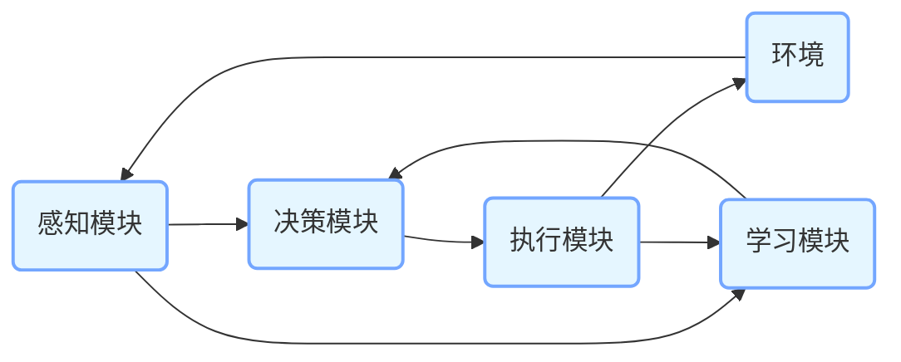

# 设计可扩展的AI Agent架构

> 关键词：AI Agent、可扩展架构、人工智能、多模块设计、交互机制

> 摘要：本文围绕设计可扩展的AI Agent架构展开，深入探讨其核心概念、算法原理、数学模型等内容。通过详细的代码案例和对实际应用场景的分析，为读者全面呈现可扩展AI Agent架构的设计方法和实现过程。同时，介绍了相关的工具和资源，对未来发展趋势与挑战进行总结，旨在帮助读者更好地理解和设计高效、灵活的AI Agent架构。

## 1. 背景介绍 
### 1.1 目的和范围
随着人工智能技术的飞速发展，AI Agent在各个领域的应用越来越广泛。设计可扩展的AI Agent架构的目的在于构建一个能够适应不断变化的需求、灵活添加新功能和模块的智能系统。其范围涵盖了从基础的感知、决策到复杂的交互和学习等多个方面，旨在打造一个全面且具有高度适应性的智能体。

### 1.2 预期读者
本文预期读者包括人工智能领域的研究人员、软件开发者、系统架构师以及对AI Agent技术感兴趣的爱好者。对于希望深入了解AI Agent架构设计和实现的读者，本文将提供有价值的参考和指导。

### 1.3 文档结构概述
本文首先介绍背景知识，包括目的、预期读者和文档结构。接着阐述核心概念与联系，通过文本示意图和Mermaid流程图展示架构原理。然后详细讲解核心算法原理和具体操作步骤，结合Python源代码进行说明。之后介绍数学模型和公式，并举例说明。再通过项目实战给出代码实际案例和详细解释。随后分析实际应用场景，推荐相关工具和资源。最后总结未来发展趋势与挑战，提供常见问题解答和扩展阅读参考资料。

### 1.4 术语表
#### 1.4.1 核心术语定义
- **AI Agent**：人工智能智能体，是一个能够感知环境、做出决策并执行动作的智能实体。
- **可扩展架构**：一种设计理念和架构模式，允许系统在不进行大规模重构的情况下，方便地添加新功能、模块或组件。
- **感知模块**：负责收集和处理来自环境的信息，为决策提供数据支持。
- **决策模块**：根据感知模块提供的信息，运用一定的算法和策略进行决策。
- **执行模块**：根据决策模块的结果，执行相应的动作。

#### 1.4.2 相关概念解释
- **智能体交互**：AI Agent与环境或其他智能体之间进行信息交流和动作执行的过程。
- **学习机制**：AI Agent通过不断地与环境交互，积累经验并改进自身行为的能力。
- **模块化设计**：将系统分解为多个独立的模块，每个模块具有特定的功能，便于开发、维护和扩展。

#### 1.4.3 缩略词列表
- **AI**：Artificial Intelligence（人工智能）
- **ML**：Machine Learning（机器学习）
- **RL**：Reinforcement Learning（强化学习）

## 2. 核心概念与联系 
### 核心概念原理
AI Agent的核心概念基于智能体的感知、决策和执行三个基本功能。感知模块通过各种传感器或数据接口获取环境信息，如视觉、听觉、文本等。决策模块对感知到的信息进行处理和分析，运用机器学习、深度学习等算法生成决策结果。执行模块根据决策结果执行相应的动作，与环境进行交互。

可扩展架构的设计原则是将系统划分为多个独立的模块，每个模块具有清晰的功能和接口。模块之间通过标准的协议和接口进行通信和协作，使得系统可以方便地添加、删除或替换模块，从而实现系统的扩展。

### 架构的文本示意图
一个典型的可扩展AI Agent架构包括感知层、决策层、执行层和学习层。感知层负责收集环境信息，将其转化为数字信号或特征向量。决策层根据感知层提供的信息，运用决策算法生成决策指令。执行层根据决策指令执行相应的动作，改变环境状态。学习层通过对历史数据和交互结果的分析，不断优化决策算法和策略。

### Mermaid流程图

该流程图展示了AI Agent的基本工作流程。感知模块从环境中获取信息，传递给决策模块。决策模块根据信息生成决策，执行模块执行决策动作。同时，学习模块从感知、决策和执行模块获取数据，进行学习和优化，反馈给决策模块。

## 3. 核心算法原理 & 具体操作步骤 
### 核心算法原理
在AI Agent的决策模块中，常用的算法包括机器学习算法和强化学习算法。以强化学习算法为例，其核心思想是智能体通过与环境进行交互，根据环境反馈的奖励信号来学习最优策略。

强化学习的基本要素包括状态空间 $S$、动作空间 $A$、奖励函数 $R$ 和策略 $\pi$。智能体在每个时间步 $t$ 处于一个状态 $s_t \in S$，根据策略 $\pi$ 选择一个动作 $a_t \in A$ 执行。执行动作后，环境会反馈一个奖励 $r_{t+1} \in R$ 并转移到下一个状态 $s_{t+1} \in S$。智能体的目标是最大化长期累积奖励。

### Python源代码详细阐述
以下是一个简单的基于Q学习算法的强化学习示例：
```python
import numpy as np

# 定义环境参数
num_states = 5
num_actions = 2
gamma = 0.9  # 折扣因子
alpha = 0.1  # 学习率

# 初始化Q表
Q = np.zeros((num_states, num_actions))

# 定义奖励矩阵
rewards = np.array([
    [0, 1],
    [1, 0],
    [0, 1],
    [1, 0],
    [0, 1]
])

# 定义Q学习算法
def q_learning(num_episodes):
    for episode in range(num_episodes):
        state = np.random.randint(0, num_states)  # 随机初始化状态
        done = False
        while not done:
            # 选择动作
            if np.random.uniform(0, 1) < 0.1:  # 探索率
                action = np.random.randint(0, num_actions)
            else:
                action = np.argmax(Q[state, :])

            # 执行动作，获取奖励和下一个状态
            reward = rewards[state, action]
            next_state = (state + 1) % num_states

            # 更新Q表
            Q[state, action] = Q[state, action] + alpha * (reward + gamma * np.max(Q[next_state, :]) - Q[state, action])

            # 判断是否结束
            if next_state == 0:
                done = True
            else:
                state = next_state
    return Q

# 训练模型
Q = q_learning(1000)
print("Final Q table:")
print(Q)
```
### 具体操作步骤
1. **初始化环境和参数**：定义状态空间、动作空间、奖励函数、折扣因子和学习率等参数，初始化Q表。
2. **循环训练**：在每个训练周期中，随机初始化智能体的状态。
3. **选择动作**：根据探索率选择随机动作或根据Q表选择最优动作。
4. **执行动作**：执行选择的动作，获取环境反馈的奖励和下一个状态。
5. **更新Q表**：根据Q学习算法更新Q表中的值。
6. **判断结束条件**：如果达到终止状态，则结束当前训练周期；否则，更新状态并继续循环。
7. **重复训练**：重复步骤2 - 6，直到达到指定的训练周期数。

## 4. 数学模型和公式 & 详细讲解 & 举例说明 
### 数学模型
在强化学习中，Q学习算法的数学模型基于贝尔曼方程。贝尔曼方程描述了最优Q值的递归关系：
$$Q^*(s, a) = \mathbb{E}_{s'}\left[R(s, a, s') + \gamma \max_{a'} Q^*(s', a')\right]$$
其中，$Q^*(s, a)$ 表示在状态 $s$ 下选择动作 $a$ 的最优Q值，$R(s, a, s')$ 表示从状态 $s$ 执行动作 $a$ 转移到状态 $s'$ 所获得的奖励，$\gamma$ 是折扣因子，$\max_{a'} Q^*(s', a')$ 表示在状态 $s'$ 下选择最优动作的Q值。

### 详细讲解
Q学习算法通过不断地迭代更新Q表来逼近最优Q值。在每个时间步 $t$，智能体根据当前的Q表选择动作 $a_t$，执行动作后获得奖励 $r_{t+1}$ 和下一个状态 $s_{t+1}$。然后，根据以下更新公式更新Q表中的值：
$$Q(s_t, a_t) \leftarrow Q(s_t, a_t) + \alpha \left[r_{t+1} + \gamma \max_{a'} Q(s_{t+1}, a') - Q(s_t, a_t)\right]$$
其中，$\alpha$ 是学习率，控制每次更新的步长。

### 举例说明
假设智能体处于状态 $s_1$，选择动作 $a_1$，执行动作后获得奖励 $r = 1$，转移到状态 $s_2$。当前Q表中 $Q(s_1, a_1) = 0.5$，$Q(s_2, a_2) = 0.8$（$a_2$ 是状态 $s_2$ 下的最优动作），$\alpha = 0.1$，$\gamma = 0.9$。则更新后的Q值为：
$$Q(s_1, a_1) = 0.5 + 0.1 \times (1 + 0.9 \times 0.8 - 0.5) = 0.5 + 0.1 \times (1 + 0.72 - 0.5) = 0.5 + 0.1 \times 1.22 = 0.622$$

## 5. 项目实战：代码实际案例和详细解释说明 
### 5.1  开发环境搭建
1. **安装Python**：确保系统中安装了Python 3.x版本。可以从Python官方网站（https://www.python.org/downloads/）下载并安装。
2. **安装必要的库**：使用以下命令安装NumPy库：
```sh
pip install numpy
```

### 5.2  源代码详细实现和代码解读
以下是一个完整的可扩展AI Agent架构的Python实现示例：
```python
import numpy as np

# 感知模块
class PerceptionModule:
    def __init__(self):
        pass

    def perceive(self, environment):
        # 模拟感知环境信息
        return np.random.randint(0, 5)

# 决策模块
class DecisionModule:
    def __init__(self, num_states, num_actions):
        self.num_states = num_states
        self.num_actions = num_actions
        self.Q = np.zeros((num_states, num_actions))
        self.gamma = 0.9
        self.alpha = 0.1

    def decide(self, state):
        if np.random.uniform(0, 1) < 0.1:
            action = np.random.randint(0, self.num_actions)
        else:
            action = np.argmax(self.Q[state, :])
        return action

    def update(self, state, action, reward, next_state):
        self.Q[state, action] = self.Q[state, action] + self.alpha * (reward + self.gamma * np.max(self.Q[next_state, :]) - self.Q[state, action])

# 执行模块
class ExecutionModule:
    def __init__(self):
        pass

    def execute(self, action):
        # 模拟执行动作
        if action == 0:
            return 1
        else:
            return 0

# AI Agent类
class AIAgent:
    def __init__(self, num_states, num_actions):
        self.perception_module = PerceptionModule()
        self.decision_module = DecisionModule(num_states, num_actions)
        self.execution_module = ExecutionModule()

    def run(self, num_episodes):
        for episode in range(num_episodes):
            state = self.perception_module.perceive(None)
            done = False
            while not done:
                action = self.decision_module.decide(state)
                reward = self.execution_module.execute(action)
                next_state = (state + 1) % 5
                self.decision_module.update(state, action, reward, next_state)
                if next_state == 0:
                    done = True
                else:
                    state = next_state
        return self.decision_module.Q

# 主程序
if __name__ == "__main__":
    num_states = 5
    num_actions = 2
    agent = AIAgent(num_states, num_actions)
    Q = agent.run(1000)
    print("Final Q table:")
    print(Q)
```
### 代码解读与分析
1. **感知模块（PerceptionModule）**：模拟从环境中感知信息，返回一个随机的状态值。
2. **决策模块（DecisionModule）**：使用Q学习算法进行决策，包括选择动作和更新Q表。
3. **执行模块（ExecutionModule）**：根据决策模块的动作指令执行相应的动作，返回奖励值。
4. **AI Agent类（AIAgent）**：整合感知、决策和执行模块，实现智能体的运行逻辑。
5. **主程序**：创建AI Agent对象，运行训练过程，并输出最终的Q表。

## 6. 实际应用场景 
### 智能机器人
在智能机器人领域，可扩展的AI Agent架构可以用于机器人的导航、任务执行和环境交互。感知模块可以通过摄像头、激光雷达等传感器获取环境信息，决策模块根据信息规划机器人的行动路径，执行模块控制机器人的运动。通过可扩展架构，可以方便地添加新的功能，如语音交互、物体识别等。

### 智能游戏
在智能游戏中，AI Agent可以作为游戏角色的智能控制模块。感知模块获取游戏场景信息，决策模块根据游戏规则和策略选择行动，执行模块控制游戏角色的动作。可扩展架构使得游戏开发者可以方便地调整AI Agent的行为和能力，增加游戏的趣味性和挑战性。

### 金融投资
在金融投资领域，AI Agent可以用于股票交易、风险管理等。感知模块收集市场数据，决策模块分析数据并生成投资策略，执行模块执行交易操作。可扩展架构可以方便地集成新的数据分析方法和投资模型，提高投资决策的准确性和效率。

## 7. 工具和资源推荐
### 7.1 学习资源推荐
#### 7.1.1 书籍推荐
- 《人工智能：一种现代的方法》：全面介绍了人工智能的基本概念、算法和应用，是人工智能领域的经典教材。
- 《强化学习：原理与Python实现》：详细讲解了强化学习的理论和实践，通过Python代码示例帮助读者理解和应用强化学习算法。
- 《深度学习》：深入探讨了深度学习的原理、模型和应用，是深度学习领域的权威著作。

#### 7.1.2 在线课程
- Coursera上的“人工智能基础”课程：由知名大学的教授授课，系统地介绍了人工智能的基础知识和算法。
- edX上的“强化学习”课程：提供了丰富的教学资源和实践项目，帮助学习者掌握强化学习的核心技术。
- 哔哩哔哩上的“深度学习入门”系列视频：以通俗易懂的方式讲解深度学习的基本概念和实现方法。

#### 7.1.3 技术博客和网站
- Medium上的人工智能相关博客：汇聚了众多人工智能领域的专家和开发者的经验分享和技术文章。
- arXiv.org：提供了大量的人工智能领域的学术论文和研究成果。
- OpenAI的官方网站：发布了许多关于人工智能的最新研究和开源项目。

### 7.2 开发工具框架推荐
#### 7.2.1 IDE和编辑器
- PyCharm：功能强大的Python集成开发环境，提供了代码编辑、调试、版本控制等功能。
- Visual Studio Code：轻量级的代码编辑器，支持多种编程语言和插件扩展，适合快速开发和调试。

#### 7.2.2 调试和性能分析工具
- pdb：Python自带的调试器，可以帮助开发者定位和解决代码中的问题。
- cProfile：Python的性能分析工具，可以分析代码的运行时间和内存使用情况，帮助优化代码性能。

#### 7.2.3 相关框架和库
- TensorFlow：开源的深度学习框架，提供了丰富的工具和库，支持各种深度学习模型的开发和训练。
- PyTorch：另一个流行的深度学习框架，具有动态计算图和简洁的API，适合快速原型开发。
- Gym：OpenAI开发的强化学习环境库，提供了多种模拟环境和基准任务，方便开发者测试和验证强化学习算法。

### 7.3 相关论文著作推荐
#### 7.3.1 经典论文
- “Q-learning” by Watkins and Dayan：Q学习算法的经典论文，奠定了强化学习中Q学习方法的基础。
- “Playing Atari with Deep Reinforcement