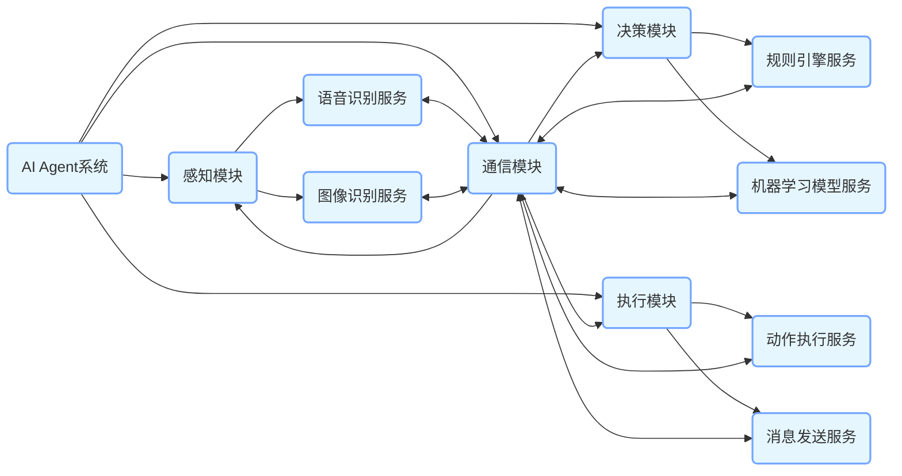

# 设计可扩展的AI Agent架构：模块化与微服务

> 关键词：AI Agent架构、模块化设计、微服务、可扩展性、人工智能

> 摘要：本文围绕设计可扩展的AI Agent架构展开，重点探讨模块化与微服务在其中的应用。首先介绍了相关背景知识，包括目的范围、预期读者等内容。接着阐述核心概念，给出原理和架构的文本示意图及Mermaid流程图。详细讲解了核心算法原理并使用Python代码说明，还分析了数学模型和公式。通过项目实战展示代码实现及解读，探讨了实际应用场景。推荐了学习资源、开发工具框架和相关论文著作。最后总结未来发展趋势与挑战，提供常见问题解答及扩展阅读参考资料，旨在为开发者提供全面的设计可扩展AI Agent架构的指导。

## 1. 背景介绍 
### 1.1 目的和范围
在当今人工智能飞速发展的时代，AI Agent被广泛应用于各种领域，如智能客服、自动化决策、智能家居等。设计可扩展的AI Agent架构具有重要意义，其目的在于构建一个能够灵活应对不断变化的需求、轻松集成新功能和技术的AI Agent系统。本文章的范围涵盖了从理论层面的核心概念、算法原理、数学模型，到实践层面的项目实战、应用场景等方面，全面深入地探讨如何利用模块化与微服务设计可扩展的AI Agent架构。

### 1.2 预期读者
本文预期读者主要包括人工智能领域的开发者、软件架构师、CTO等技术人员，以及对AI Agent架构设计感兴趣的研究人员和学生。对于希望深入了解AI Agent架构设计，掌握模块化与微服务技术在其中应用的读者，本文将提供有价值的参考和指导。

### 1.3 文档结构概述
本文将按照以下结构展开：首先介绍背景知识，让读者了解文章的目的、适用对象和整体结构；接着阐述核心概念，包括模块化与微服务在AI Agent架构中的原理和联系，并给出相应的示意图和流程图；然后详细讲解核心算法原理和具体操作步骤，使用Python代码进行说明；分析数学模型和公式，并举例说明；通过项目实战展示代码实现和详细解读；探讨实际应用场景；推荐相关的学习资源、开发工具框架和论文著作；最后总结未来发展趋势与挑战，提供常见问题解答和扩展阅读参考资料。

### 1.4 术语表
#### 1.4.1 核心术语定义
- **AI Agent**：人工智能代理，是一种能够感知环境、自主决策并采取行动以实现特定目标的软件实体。
- **模块化设计**：将系统分解为多个独立的模块，每个模块具有特定的功能和职责，模块之间通过接口进行交互。
- **微服务**：一种软件架构风格，将应用程序拆分为多个小型、自治的服务，每个服务专注于单一的业务功能，通过轻量级的通信机制进行协作。
- **可扩展性**：系统能够在不进行大规模重构的情况下，轻松应对功能的增加、负载的增长等变化的能力。

#### 1.4.2 相关概念解释
- **解耦**：在模块化和微服务设计中，解耦是指降低模块或服务之间的依赖关系，使得每个模块或服务可以独立开发、测试和部署。
- **接口**：模块或服务之间进行交互的约定，定义了输入和输出的格式和规则。
- **自治性**：微服务具有自治性，即每个服务可以独立运行、管理和升级，不依赖于其他服务的状态。

#### 1.4.3 缩略词列表
- **API**：Application Programming Interface，应用程序编程接口，用于实现模块或服务之间的通信。
- **REST**：Representational State Transfer，一种基于HTTP协议的轻量级通信架构，常用于微服务之间的交互。

## 2. 核心概念与联系 

### 核心概念原理
#### 模块化设计原理
模块化设计的核心思想是将AI Agent系统按照功能进行划分，每个模块负责特定的任务。例如，一个AI Agent可以分为感知模块、决策模块和执行模块。感知模块负责收集环境信息，决策模块根据感知到的信息进行分析和决策，执行模块则根据决策结果采取相应的行动。模块之间通过定义清晰的接口进行交互，这样可以提高系统的可维护性和可扩展性。当需要添加新的功能时，只需要开发新的模块并与现有模块进行集成即可。

#### 微服务原理
微服务架构将AI Agent系统拆分为多个小型、自治的服务。每个服务专注于单一的业务功能，例如语音识别服务、自然语言处理服务、图像识别服务等。这些服务可以独立开发、部署和扩展。服务之间通过轻量级的通信机制（如RESTful API）进行协作。微服务架构的优点在于能够提高系统的灵活性和可扩展性，同时也便于团队的分工协作。

### 架构的文本示意图
```plaintext
AI Agent系统
|-- 感知模块（微服务：语音识别服务、图像识别服务等）
|-- 决策模块（微服务：规则引擎服务、机器学习模型服务等）
|-- 执行模块（微服务：动作执行服务、消息发送服务等）
|-- 通信模块（负责模块和服务之间的通信）
```

### Mermaid流程图


## 3. 核心算法原理 & 具体操作步骤 

### 核心算法原理
在AI Agent架构中，常用的算法包括机器学习算法、规则引擎算法等。这里以一个简单的基于规则的决策算法为例进行说明。

规则引擎算法的核心思想是根据预设的规则对输入的信息进行匹配和判断，从而得出决策结果。例如，在一个智能客服AI Agent中，可以定义如下规则：
- 如果用户咨询的问题包含“产品价格”，则返回产品价格信息。
- 如果用户咨询的问题包含“售后服务”，则返回售后服务相关信息。

### 具体操作步骤
1. **规则定义**：使用规则语言（如Drools规则语言）定义一系列规则。
2. **规则加载**：将定义好的规则加载到规则引擎中。
3. **信息输入**：将感知模块获取的信息作为输入传递给规则引擎。
4. **规则匹配**：规则引擎对输入信息进行匹配，找到符合条件的规则。
5. **决策输出**：根据匹配到的规则，输出相应的决策结果。

### Python源代码详细阐述
```python
# 定义规则类
class Rule:
    def __init__(self, condition, action):
        self.condition = condition
        self.action = action

    def match(self, input_info):
        return self.condition(input_info)

    def execute(self):
        return self.action()

# 定义规则列表
rules = [
    Rule(lambda info: "产品价格" in info, lambda: "产品价格为100元"),
    Rule(lambda info: "售后服务" in info, lambda: "我们提供一年免费保修服务")
]

# 定义规则引擎类
class RuleEngine:
    def __init__(self, rules):
        self.rules = rules

    def run(self, input_info):
        for rule in self.rules:
            if rule.match(input_info):
                return rule.execute()
        return "未找到匹配的规则"

# 创建规则引擎实例
engine = RuleEngine(rules)

# 模拟输入信息
input_info = "请问产品价格是多少？"

# 运行规则引擎
result = engine.run(input_info)
print(result)
```

## 4. 数学模型和公式 & 详细讲解 & 举例说明 

### 数学模型
在AI Agent的决策模块中，常常会用到概率模型来进行决策。例如，贝叶斯分类器就是一种常用的概率模型。贝叶斯分类器基于贝叶斯定理，通过计算不同类别在给定特征下的概率，选择概率最大的类别作为分类结果。

### 贝叶斯定理公式
贝叶斯定理的公式为：
$$P(C|X)=\frac{P(X|C)P(C)}{P(X)}$$
其中：
- $P(C|X)$ 是在特征 $X$ 出现的情况下，类别 $C$ 发生的概率，也称为后验概率。
- $P(X|C)$ 是在类别 $C$ 发生的情况下，特征 $X$ 出现的概率，也称为似然概率。
- $P(C)$ 是类别 $C$ 发生的先验概率。
- $P(X)$ 是特征 $X$ 出现的概率。

### 详细讲解
贝叶斯定理的核心思想是通过先验概率和似然概率来计算后验概率。在实际应用中，我们可以通过训练数据来估计先验概率和似然概率，然后使用贝叶斯定理计算后验概率。

### 举例说明
假设我们有一个垃圾邮件分类的问题，类别 $C$ 有两个取值：垃圾邮件（$C_1$）和正常邮件（$C_2$）。特征 $X$ 表示邮件中出现的某些关键词。

- 先验概率：通过统计训练数据中垃圾邮件和正常邮件的比例，得到 $P(C_1)$ 和 $P(C_2)$。
- 似然概率：统计在垃圾邮件和正常邮件中出现关键词的比例，得到 $P(X|C_1)$ 和 $P(X|C_2)$。
- 后验概率：使用贝叶斯定理计算 $P(C_1|X)$ 和 $P(C_2|X)$，选择概率较大的类别作为分类结果。

以下是一个简单的Python代码示例：
```python
import numpy as np

# 先验概率
P_C1 = 0.3  # 垃圾邮件的先验概率
P_C2 = 0.7  # 正常邮件的先验概率

# 似然概率
P_X_given_C1 = 0.8  # 在垃圾邮件中出现关键词的概率
P_X_given_C2 = 0.2  # 在正常邮件中出现关键词的概率

# 计算 P(X)
P_X = P_X_given_C1 * P_C1 + P_X_given_C2 * P_C2

# 计算后验概率
P_C1_given_X = (P_X_given_C1 * P_C1) / P_X
P_C2_given_X = (P_X_given_C2 * P_C2) / P_X

# 分类决策
if P_C1_given_X > P_C2_given_X:
    print("这是一封垃圾邮件")
else:
    print("这是一封正常邮件")
```

## 5. 项目实战：代码实际案例和详细解释说明 

### 5.1  开发环境搭建
#### 开发语言和框架
本项目使用Python作为开发语言，使用Flask框架来构建微服务。Flask是一个轻量级的Web框架，适合快速开发和部署微服务。

#### 安装依赖
在项目目录下创建一个虚拟环境，并安装所需的依赖：
```bash
python -m venv venv
source venv/bin/activate  # 在Windows上使用 venv\Scripts\activate
pip install flask
```

### 5.2  源代码详细实现和代码解读
#### 感知模块微服务
```python
from flask import Flask, jsonify, request

app = Flask(__name__)

# 模拟感知模块，接收输入信息
@app.route('/perceive', methods=['POST'])
def perceive():
    data = request.get_json()
    input_info = data.get('input_info')
    # 这里可以添加实际的感知逻辑，如语音识别、图像识别等
    return jsonify({'perceived_info': input_info})

if __name__ == '__main__':
    app.run(debug=True, port=5000)
```
代码解读：
- 导入Flask框架和相关模块。
- 创建Flask应用实例。
- 定义一个路由 `/perceive`，接收POST请求，从请求中获取输入信息。
- 这里简单地将输入信息作为感知到的信息返回，实际应用中可以添加语音识别、图像识别等逻辑。
- 启动Flask应用，监听5000端口。

#### 决策模块微服务
```python
from flask import Flask, jsonify, request
import json

app = Flask(__name__)

# 规则定义
rules = [
    {
        "condition": lambda info: "产品价格" in info,
        "action": lambda: "产品价格为100元"
    },
    {
        "condition": lambda info: "售后服务" in info,
        "action": lambda: "我们提供一年免费保修服务"
    }
]

# 规则引擎
def rule_engine(input_info):
    for rule in rules:
        if rule["condition"](input_info):
            return rule["action"]()
    return "未找到匹配的规则"

# 决策接口
@app.route('/decide', methods=['POST'])
def decide():
    data = request.get_json()
    perceived_info = data.get('perceived_info')
    decision = rule_engine(perceived_info)
    return jsonify({'decision': decision})

if __name__ == '__main__':
    app.run(debug=True, port=5001)
```
代码解读：
- 导入Flask框架和相关模块。
- 创建Flask应用实例。
- 定义规则列表，每个规则包含条件和动作。
- 实现规则引擎函数 `rule_engine`，根据输入信息匹配规则并执行相应的动作。
- 定义一个路由 `/decide`，接收POST请求，从请求中获取感知到的信息，调用规则引擎进行决策，并返回决策结果。
- 启动Flask应用，监听5001端口。

#### 执行模块微服务
```python
from flask import Flask, jsonify, request

app = Flask(__name__)

# 执行动作
@app.route('/execute', methods=['POST'])
def execute():
    data = request.get_json()
    decision = data.get('decision')
    # 这里可以添加实际的执行逻辑，如发送消息、控制设备等
    return jsonify({'execution_result': f"执行决策: {decision}"})

if __name__ == '__main__':
    app.run(debug=True, port=5002)
```
代码解读：
- 导入Flask框架和相关模块。
- 创建Flask应用实例。
- 定义一个路由 `/execute`，接收POST请求，从请求中获取决策结果。
- 这里简单地将决策结果作为执行结果返回，实际应用中可以添加发送消息、控制设备等逻辑。
- 启动Flask应用，监听5002端口。

### 5.3  代码解读与分析
#### 模块化设计
通过将AI Agent系统拆分为感知模块、决策模块和执行模块，每个模块作为一个独立的微服务，实现了模块之间的解耦。每个模块可以独立开发、测试和部署，提高了系统的可维护性和可扩展性。

#### 微服务通信
微服务之间通过HTTP协议进行通信，使用RESTful API进行交互。这种轻量级的通信机制使得微服务之间的协作更加灵活和高效。

#### 可扩展性
如果需要添加新的功能，只需要开发新的微服务并与现有微服务进行集成即可。例如，如果需要添加图像识别功能，可以开发一个图像识别微服务，并将其集成到感知模块中。

## 6. 实际应用场景 
### 智能客服
在智能客服系统中，AI Agent可以作为客服代表与用户进行交互。感知模块负责接收用户的咨询信息，如语音、文本等；决策模块根据用户的咨询信息进行分析和决策，选择合适的回复策略；执行模块将决策结果以语音或文本的形式回复给用户。通过模块化和微服务设计，智能客服系统可以轻松扩展新的功能，如多语言支持、情感分析等。

### 智能家居
在智能家居系统中，AI Agent可以作为智能家居的控制中心。感知模块负责收集家居环境信息，如温度、湿度、光照等；决策模块根据环境信息和用户的预设规则进行决策，如调节空调温度、开关灯光等；执行模块控制家居设备执行相应的动作。模块化和微服务设计使得智能家居系统可以方便地集成新的设备和功能，如智能门锁、智能窗帘等。

### 自动化决策系统
在金融、医疗等领域，自动化决策系统可以帮助企业和机构快速做出决策。AI Agent在自动化决策系统中扮演重要角色，感知模块收集相关数据，决策模块使用机器学习算法和规则引擎进行分析和决策，执行模块将决策结果应用到实际业务中。通过模块化和微服务设计，自动化决策系统可以根据业务需求灵活扩展和调整。

## 7. 工具和资源推荐
### 7.1 学习资源推荐
#### 7.1.1 书籍推荐
- 《人工智能：一种现代的方法》：这本书是人工智能领域的经典教材，涵盖了人工智能的各个方面，包括搜索算法、机器学习、自然语言处理等。
- 《Python机器学习》：详细介绍了使用Python进行机器学习的方法和技巧，适合初学者入门。
- 《微服务架构设计模式》：深入讲解了微服务架构的设计原则、模式和实践，对于设计可扩展的AI Agent架构有很大的帮助。

#### 7.1.2 在线课程
- Coursera上的“人工智能基础”课程：由知名教授授课，系统地介绍了人工智能的基础知识和算法。
- edX上的“Python数据科学入门”课程：帮助学习者掌握Python在数据科学领域的应用。
- Udemy上的“微服务实战”课程：通过实际项目案例，教授如何使用微服务架构开发应用程序。

#### 7.1.3 技术博客和网站
- Medium：上面有很多关于人工智能、微服务等领域的技术文章，作者来自世界各地的技术专家。
- Towards Data Science：专注于数据科学和机器学习领域的技术博客，提供了很多实用的教程和案例。
- InfoQ：关注软件开发和架构设计领域的最新动态和技术趋势，有很多关于微服务架构的深度文章。

### 7.2 开发工具框架推荐
#### 7.2.1 IDE和编辑器
- PyCharm：一款专业的Python集成开发环境，提供了丰富的代码编辑、调试和测试功能。
- Visual Studio Code：一款轻量级的代码编辑器，支持多种编程语言，有丰富的插件生态系统。

#### 7.2.2 调试和性能分析工具
- Flask-DebugToolbar：用于Flask应用的调试工具，提供了详细的请求信息和性能分析。
- cProfile：Python自带的性能分析工具，可以帮助开发者找出代码中的性能瓶颈。

#### 7.2.3 相关框架和库
- Flask：轻量级的Web框架，适合快速开发和部署微服务。
- TensorFlow：开源的机器学习框架，广泛应用于深度学习领域。
- NLTK：自然语言处理工具包，提供了丰富的文本处理和分析功能。

### 7.3 相关论文著作推荐
#### 7.3.1 经典论文
- “A Survey of Agent Technologies and Applications”：对AI Agent技术和应用进行了全面的综述。
- “Microservices: Principles and Patterns”：介绍了微服务架构的原理和模式。

#### 7.3.2 最新研究成果
- 关注顶级学术会议（如NeurIPS、ICML等）上关于AI Agent架构设计的最新研究成果。
- 阅读知名学术期刊（如Journal of Artificial Intelligence Research）上的相关论文。

#### 7.3.3 应用案例分析
- 研究一些大型科技公司（如Google、Amazon等）在AI Agent架构设计方面的应用案例，了解他们的实践经验和技术方案。

## 8. 总结：未来发展趋势与挑战
### 未来发展趋势
- **与物联网的深度融合**：随着物联网技术的发展，AI Agent将与更多的物联网设备进行集成，实现更加智能化的控制和管理。例如，在智能城市、工业互联网等领域，AI Agent可以根据物联网设备收集的数据进行实时决策和优化。
- **强化学习的广泛应用**：强化学习是一种能够让AI Agent通过与环境交互不断学习和优化策略的算法。未来，强化学习将在AI Agent架构中得到更广泛的应用，使AI Agent能够在复杂的环境中做出更加智能的决策。
- **多模态交互**：未来的AI Agent将支持多种模态的交互方式，如语音、图像、手势等。通过多模态交互，用户可以更加自然和便捷地与AI Agent进行沟通。

### 挑战
- **数据隐私和安全**：AI Agent需要处理大量的用户数据，数据隐私和安全问题成为了一个重要的挑战。如何确保用户数据的安全和隐私，防止数据泄露和滥用，是需要解决的关键问题。
- **系统复杂性管理**：模块化和微服务设计虽然提高了系统的可扩展性，但也增加了系统的复杂性。如何有效地管理和协调多个模块和服务之间的交互，确保系统的稳定性和可靠性，是一个挑战。
- **算法可解释性**：在一些关键领域（如医疗、金融等），AI Agent的决策需要具有可解释性。如何设计具有可解释性的算法，让用户能够理解AI Agent的决策过程和依据，是一个亟待解决的问题。

## 9. 附录：常见问题与解答
### 问题1：模块化和微服务有什么区别？
模块化是一种设计思想，将系统分解为多个独立的模块，模块之间通过接口进行交互。微服务是一种软件架构风格，将应用程序拆分为多个小型、自治的服务，服务之间通过轻量级的通信机制进行协作。微服务可以看作是模块化设计在分布式系统中的一种实现方式。

### 问题2：如何确保微服务之间的通信安全？
可以采用以下方法确保微服务之间的通信安全：
- 使用HTTPS协议进行通信，对数据进行加密传输。
- 实现身份验证和授权机制，确保只有合法的服务可以进行通信。
- 定期更新服务的安全补丁，防范安全漏洞。

### 问题3：在设计AI Agent架构时，如何选择合适的算法？
选择合适的算法需要考虑以下因素：
- 问题的类型：不同的问题适合不同的算法，如分类问题可以选择决策树、神经网络等算法，回归问题可以选择线性回归、支持向量回归等算法。
- 数据的特点：数据的规模、维度、分布等特点会影响算法的性能，需要根据数据的特点选择合适的算法。
- 算法的可解释性：在一些关键领域，需要选择具有可解释性的算法，以便用户能够理解算法的决策过程和依据。

## 10. 扩展阅读 & 参考资料
### 扩展阅读
- 《深度学习》：深入介绍了深度学习的理论和实践，对于理解AI Agent中的深度学习算法有很大的帮助。
- 《云计算与分布式系统：从并行处理到物联网》：探讨了云计算和分布式系统的相关技术，对于设计可扩展的AI Agent架构有一定的启示。

### 参考资料
- 相关的学术论文和研究报告。
- 开源项目的文档和代码。
- 各大科技公司的技术博客和官方文档。

作者：AI天才研究院/AI Genius Institute & 禅与计算机程序设计艺术 /Zen And The Art of Computer Programming