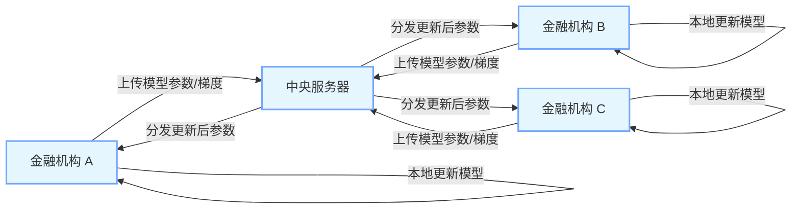

# 设计基于联邦学习的跨境金融风险评估系统

> 关键词：联邦学习、跨境金融、风险评估系统、数据隐私、机器学习

> 摘要：本文聚焦于设计基于联邦学习的跨境金融风险评估系统。在跨境金融业务中，数据分散且隐私保护要求高，传统风险评估方法面临诸多挑战。联邦学习作为一种新兴的分布式机器学习技术，能够在保护数据隐私的前提下实现多方数据的协同建模。文章详细阐述了联邦学习的核心概念、算法原理，通过数学模型深入分析其在跨境金融风险评估中的应用。同时，给出了系统开发的实战案例，包括开发环境搭建、源代码实现与解读。最后探讨了该系统的实际应用场景、推荐了相关工具和资源，并对未来发展趋势与挑战进行了总结。

## 1. 背景介绍 
### 1.1 目的和范围
跨境金融业务涉及不同国家和地区的金融机构、企业和个人，其业务复杂性和风险多样性使得准确的风险评估至关重要。然而，由于跨境数据流通面临严格的法律法规限制以及数据隐私保护的需求，传统的集中式数据处理和建模方法难以满足实际需求。本系统的设计目的是利用联邦学习技术，在不泄露各方原始数据的情况下，实现跨境金融数据的协同分析和风险评估模型的构建，从而提高跨境金融风险评估的准确性和效率。本系统的范围涵盖了跨境金融领域的多种业务场景，如跨境贷款、跨境投资、跨境支付等，旨在为金融机构、监管部门和企业提供全面的风险评估解决方案。

### 1.2 预期读者
本文的预期读者包括金融行业的从业者，如银行风险管理部门的工作人员、金融科技公司的研发人员；计算机科学领域的研究人员和开发者，特别是对机器学习、隐私计算感兴趣的人员；以及关注跨境金融监管的政府部门和监管机构的相关人员。这些读者希望通过本文了解如何利用联邦学习技术解决跨境金融风险评估中的实际问题，掌握系统设计的原理和方法，并获取相关的技术资源和实践经验。

### 1.3 文档结构概述
本文将按照以下结构进行组织：首先介绍联邦学习和跨境金融风险评估的核心概念以及它们之间的联系，并通过示意图和流程图进行直观展示；接着详细阐述联邦学习的核心算法原理，结合 Python 源代码进行具体操作步骤的说明；然后给出相关的数学模型和公式，并通过实际例子进行详细讲解；之后进入项目实战部分，包括开发环境的搭建、源代码的详细实现和解读；再探讨该系统在实际跨境金融业务中的应用场景；随后推荐相关的学习资源、开发工具框架和论文著作；最后对系统的未来发展趋势与挑战进行总结，并提供常见问题的解答和扩展阅读的参考资料。

### 1.4 术语表
#### 1.4.1 核心术语定义
- **联邦学习（Federated Learning）**：一种分布式机器学习技术，多个参与方在不共享原始数据的情况下，通过交换模型参数或梯度信息来协同训练一个全局模型。
- **跨境金融（Cross - border Finance）**：指涉及不同国家或地区之间的金融活动，包括跨境投资、跨境贷款、跨境支付等。
- **风险评估（Risk Assessment）**：对金融活动中可能面临的风险进行识别、分析和量化的过程，以帮助决策者做出合理的决策。
- **数据隐私（Data Privacy）**：保护个人或组织的数据不被未经授权的访问、使用和披露的权利。
- **全局模型（Global Model）**：在联邦学习中，由各个参与方协同训练得到的统一模型，用于对新数据进行预测和评估。

#### 1.4.2 相关概念解释
- **横向联邦学习（Horizontal Federated Learning）**：参与方的数据特征空间相同，但样本空间不同。例如，不同地区的银行拥有相似的客户特征，但客户群体不同，可以采用横向联邦学习进行协同建模。
- **纵向联邦学习（Vertical Federated Learning）**：参与方的数据样本空间相同，但特征空间不同。例如，银行拥有客户的财务信息，电商平台拥有客户的消费信息，双方可以通过纵向联邦学习共同构建风险评估模型。
- **联邦平均算法（Federated Averaging Algorithm）**：一种常用的联邦学习算法，通过对各个参与方的本地模型参数进行加权平均来更新全局模型参数。

#### 1.4.3 缩略词列表
- **FL**：Federated Learning（联邦学习）
- **HFL**：Horizontal Federated Learning（横向联邦学习）
- **VFL**：Vertical Federated Learning（纵向联邦学习）
- **FedAvg**：Federated Averaging Algorithm（联邦平均算法）

## 2. 核心概念与联系 

### 联邦学习的原理
联邦学习的核心思想是在保护数据隐私的前提下，实现多方数据的协同建模。其基本原理是各个参与方在本地对自己的数据进行模型训练，然后将训练得到的模型参数（如权重和偏置）或梯度信息上传到中央服务器。中央服务器对这些信息进行聚合和更新，得到全局模型的参数，并将更新后的参数分发给各个参与方。各个参与方再根据更新后的参数对本地模型进行更新，如此反复迭代，直到全局模型收敛。

### 跨境金融风险评估的需求
跨境金融业务面临着多种风险，如信用风险、市场风险、汇率风险等。准确的风险评估可以帮助金融机构合理定价、控制风险，避免潜在的损失。然而，跨境金融数据分散在不同的国家和地区，受到当地法律法规的限制，数据共享存在困难。同时，数据中包含大量的敏感信息，如客户的个人身份信息、财务信息等，需要严格保护数据隐私。

### 联邦学习与跨境金融风险评估的联系
联邦学习为跨境金融风险评估提供了一种有效的解决方案。通过联邦学习，不同国家和地区的金融机构可以在不共享原始数据的情况下，协同训练风险评估模型。各个金融机构可以利用自己的本地数据进行模型训练，同时通过与其他机构的合作，获取更丰富的信息，提高模型的准确性和泛化能力。这样既满足了数据隐私保护的要求，又实现了跨境金融数据的有效利用。

### 文本示意图
```plaintext
+-------------------+       +-------------------+       +-------------------+
|    金融机构 A     |       |    金融机构 B     |       |    金融机构 C     |
|  本地数据 & 模型  |       |  本地数据 & 模型  |       |  本地数据 & 模型  |
+-------------------+       +-------------------+       +-------------------+
           |                            |                            |
           | 上传模型参数或梯度信息      | 上传模型参数或梯度信息      | 上传模型参数或梯度信息
           |                            |                            |
           v                            v                            v
+-------------------------------------------------------+
|                    中央服务器                         |
|              聚合和更新全局模型参数                   |
+-------------------------------------------------------+
           |
           | 分发更新后的模型参数
           |
           v
+-------------------+       +-------------------+       +-------------------+
|    金融机构 A     |       |    金融机构 B     |       |    金融机构 C     |
|  更新本地模型     |       |  更新本地模型     |       |  更新本地模型     |
+-------------------+       +-------------------+       +-------------------+
```

### Mermaid 流程图


## 3. 核心算法原理 & 具体操作步骤 

### 联邦平均算法（FedAvg）原理
联邦平均算法是一种常用的联邦学习算法，其核心思想是通过对各个参与方的本地模型参数进行加权平均来更新全局模型参数。具体步骤如下：
1. **初始化全局模型**：中央服务器初始化一个全局模型，其参数为 $\theta_0$。
2. **分发全局模型**：中央服务器将全局模型参数 $\theta_0$ 分发给各个参与方。
3. **本地训练**：各个参与方在本地使用自己的数据对模型进行训练，得到本地模型参数 $\theta_{i,1}$（$i$ 表示第 $i$ 个参与方）。
4. **上传本地模型参数**：各个参与方将本地模型参数 $\theta_{i,1}$ 上传到中央服务器。
5. **聚合模型参数**：中央服务器对各个参与方的本地模型参数进行加权平均，得到更新后的全局模型参数 $\theta_1$。
6. **重复步骤 3 - 5**：重复上述步骤，直到全局模型收敛。

### Python 源代码实现
```python
import numpy as np

# 模拟参与方的本地数据和模型
class Participant:
    def __init__(self, data, lr=0.01):
        self.data = data
        self.lr = lr
        self.model = np.random.randn(data.shape[1])  # 初始化模型参数

    def local_train(self, global_model):
        self.model = global_model.copy()
        # 简单的梯度下降训练
        for _ in range(10):
            X = self.data[:, :-1]
            y = self.data[:, -1]
            grad = self.compute_gradient(X, y)
            self.model -= self.lr * grad
        return self.model

    def compute_gradient(self, X, y):
        # 计算梯度
        pred = np.dot(X, self.model)
        error = pred - y
        grad = np.dot(X.T, error) / len(X)
        return grad

# 中央服务器
class Server:
    def __init__(self, num_participants):
        self.num_participants = num_participants
        self.global_model = None

    def initialize_global_model(self, data_dim):
        self.global_model = np.random.randn(data_dim)

    def aggregate_models(self, local_models):
        # 加权平均聚合模型参数
        total_weight = sum([len(p.data) for p in participants])
        weights = [len(p.data) / total_weight for p in participants]
        new_model = np.zeros_like(self.global_model)
        for i in range(self.num_participants):
            new_model += weights[i] * local_models[i]
        self.global_model = new_model
        return self.global_model

# 模拟数据
data_A = np.random.randn(100, 5)
data_B = np.random.randn(150, 5)
data_C = np.random.randn(200, 5)

participants = [Participant(data_A), Participant(data_B), Participant(data_C)]
server = Server(num_participants=3)
server.initialize_global_model(data_dim=5)

# 联邦学习训练过程
num_rounds = 20
for round in range(num_rounds):
    local_models = []
    for participant in participants:
        local_model = participant.local_train(server.global_model)
        local_models.append(local_model)
    server.global_model = server.aggregate_models(local_models)

print("Final global model:", server.global_model)
```

### 具体操作步骤解释
1. **初始化参与方和服务器**：创建 `Participant` 类的实例来模拟各个参与方，每个参与方拥有自己的本地数据和模型。创建 `Server` 类的实例来模拟中央服务器，初始化全局模型。
2. **本地训练**：在每个训练轮次中，各个参与方使用中央服务器分发的全局模型参数进行本地训练，更新本地模型参数。
3. **上传和聚合**：各个参与方将本地模型参数上传到中央服务器，中央服务器对这些参数进行加权平均，得到更新后的全局模型参数。
4. **重复训练**：重复上述步骤，直到达到预定的训练轮次或全局模型收敛。

## 4. 数学模型和公式 & 详细讲解 & 举例说明 

### 联邦平均算法的数学模型
设共有 $K$ 个参与方，第 $k$ 个参与方的本地数据集为 $\mathcal{D}_k$，本地数据集的样本数量为 $n_k$，全局数据集的样本数量为 $n=\sum_{k = 1}^{K}n_k$。在第 $t$ 轮训练中，中央服务器的全局模型参数为 $\theta^t$，第 $k$ 个参与方在本地使用 $\theta^t$ 进行 $E$ 轮训练后得到本地模型参数 $\theta_k^{t + 1}$。

#### 本地训练
第 $k$ 个参与方在本地使用梯度下降法更新模型参数：
$$\theta_{k,i+1}=\theta_{k,i}-\eta\nabla L(\theta_{k,i},\mathcal{D}_k)$$
其中，$\eta$ 是学习率，$\nabla L(\theta_{k,i},\mathcal{D}_k)$ 是第 $k$ 个参与方在本地数据集 $\mathcal{D}_k$ 上关于模型参数 $\theta_{k,i}$ 的梯度。

#### 全局模型聚合
中央服务器对各个参与方的本地模型参数进行加权平均，得到更新后的全局模型参数：
$$\theta^{t + 1}=\sum_{k = 1}^{K}\frac{n_k}{n}\theta_k^{t + 1}$$

### 详细讲解
- **本地训练**：每个参与方在本地使用自己的数据集对模型进行训练，通过梯度下降法不断更新本地模型参数。由于每个参与方的数据不同，本地模型的更新方向和幅度也会有所不同。
- **全局模型聚合**：中央服务器根据各个参与方的数据集大小进行加权平均，将各个参与方的本地模型参数聚合为一个全局模型参数。这样可以充分利用各个参与方的数据信息，同时考虑到不同参与方数据量的差异。

### 举例说明
假设有两个参与方 $A$ 和 $B$，参与方 $A$ 的数据集有 $n_A = 100$ 个样本，参与方 $B$ 的数据集有 $n_B = 200$ 个样本，全局数据集的样本数量 $n=n_A + n_B=300$。在第 $t$ 轮训练后，参与方 $A$ 的本地模型参数为 $\theta_A^{t + 1}=[1, 2, 3]$，参与方 $B$ 的本地模型参数为 $\theta_B^{t + 1}=[4, 5, 6]$。

根据全局模型聚合公式，更新后的全局模型参数为：
$$\theta^{t + 1}=\frac{n_A}{n}\theta_A^{t + 1}+\frac{n_B}{n}\theta_B^{t + 1}=\frac{100}{300}[1, 2, 3]+\frac{200}{300}[4, 5, 6]$$
$$=\left[\frac{100}{300}\times1+\frac{200}{300}\times4,\frac{100}{300}\times2+\frac{200}{300}\times5,\frac{100}{300}\times3+\frac{200}{300}\times6\right]$$
$$=\left[\frac{1 + 8}{3},\frac{2 + 10}{3},\frac{3+12}{3}\right]=[3, 4, 5]$$

## 5. 项目实战：代码实际案例和详细解释说明 

### 5.1  开发环境搭建
#### 安装 Python
首先，确保你已经安装了 Python 环境，建议使用 Python 3.7 及以上版本。你可以从 Python 官方网站（https://www.python.org/downloads/）下载并安装适合你操作系统的 Python 版本。

#### 安装必要的库
使用以下命令安装项目所需的库：
```bash
pip install numpy pandas scikit-learn tensorflow
```
- `numpy`：用于数值计算和数组操作。
- `pandas`：用于数据处理和分析。
- `scikit-learn`：提供了各种机器学习算法和工具。
- `tensorflow`：用于构建和训练深度学习模型。

### 5.2  源代码详细实现和代码解读
```python
import numpy as np
import pandas as pd
from sklearn.model_selection import train_test_split
from sklearn.preprocessing import StandardScaler
import tensorflow as tf
from tensorflow.keras.models import Sequential
from tensorflow.keras.layers import Dense

# 模拟跨境金融数据
def generate_data():
    # 生成一些随机数据
    data = np.random.randn(1000, 10)
    labels = np.random.randint(0, 2, 1000)
    df = pd.DataFrame(data)
    df['label'] = labels
    return df

# 参与方类
class Participant:
    def __init__(self, data, lr=0.01):
        self.data = data
        self.lr = lr
        self.model = self.build_model()

    def build_model(self):
        model = Sequential([
            Dense(64, activation='relu', input_shape=(self.data.shape[1] - 1,)),
            Dense(32, activation='relu'),
            Dense(1, activation='sigmoid')
        ])
        model.compile(optimizer=tf.keras.optimizers.Adam(learning_rate=self.lr),
                      loss='binary_crossentropy',
                      metrics=['accuracy'])
        return model

    def local_train(self, global_model_weights):
        self.model.set_weights(global_model_weights)
        X = self.data.drop('label', axis=1)
        y = self.data['label']
        self.model.fit(X, y, epochs=5, batch_size=32, verbose=0)
        return self.model.get_weights()

# 中央服务器类
class Server:
    def __init__(self, num_participants):
        self.num_participants = num_participants
        self.global_model = self.build_model()

    def build_model(self):
        model = Sequential([
            Dense(64, activation='relu', input_shape=(9,)),
            Dense(32, activation='relu'),
            Dense(1, activation='sigmoid')
        ])
        model.compile(optimizer=tf.keras.optimizers.Adam(learning_rate=0.01),
                      loss='binary_crossentropy',
                      metrics=['accuracy'])
        return model

    def aggregate_models(self, local_models_weights):
        total_weight = sum([len(p.data) for p in participants])
        weights = [len(p.data) / total_weight for p in participants]
        new_weights = []
        for layer in range(len(local_models_weights[0])):
            layer_weights = np.zeros_like(local_models_weights[0][layer])
            for i in range(self.num_participants):
                layer_weights += weights[i] * local_models_weights[i][layer]
            new_weights.append(layer_weights)
        self.global_model.set_weights(new_weights)
        return self.global_model.get_weights()

# 生成数据
data = generate_data()
# 划分训练集和测试集
train_data, test_data = train_test_split(data, test_size=0.2)

# 模拟两个参与方
participant1_data = train_data.iloc[:len(train_data) // 2]
participant2_data = train_data.iloc[len(train_data) // 2:]

participants = [Participant(participant1_data), Participant(participant2_data)]
server = Server(num_participants=2)

# 联邦学习训练过程
num_rounds = 10
for round in range(num_rounds):
    local_models_weights = []
    global_model_weights = server.global_model.get_weights()
    for participant in participants:
        local_model_weights = participant.local_train(global_model_weights)
        local_models_weights.append(local_model_weights)
    server.global_model.set_weights(server.aggregate_models(local_models_weights))

# 评估全局模型
X_test = test_data.drop('label', axis=1)
y_test = test_data['label']
loss, accuracy = server.global_model.evaluate(X_test, y_test)
print(f"Final global model accuracy: {accuracy}")
```

### 5.3  代码解读与分析
#### 数据生成
`generate_data` 函数用于生成模拟的跨境金融数据，包括 1000 个样本，每个样本有 10 个特征和一个二分类标签。

#### 参与方类（`Participant`）
- `__init__` 方法：初始化参与方的本地数据、学习率和模型。
- `build_model` 方法：构建一个简单的神经网络模型，用于风险评估。
- `local_train` 方法：在本地使用中央服务器分发的全局模型权重进行训练，更新本地模型权重。

#### 中央服务器类（`Server`）
- `__init__` 方法：初始化中央服务器的参与方数量和全局模型。
- `build_model` 方法：构建全局模型，与参与方的模型结构相同。
- `aggregate_models` 方法：对各个参与方的本地模型权重进行加权平均，更新全局模型权重。

#### 联邦学习训练过程
在每个训练轮次中，中央服务器将全局模型权重分发给各个参与方，各个参与方在本地进行训练，然后将本地模型权重上传到中央服务器。中央服务器对本地模型权重进行聚合，更新全局模型权重。重复这个过程，直到达到预定的训练轮次。

#### 模型评估
最后，使用测试集对全局模型进行评估，输出模型的准确率。

## 6. 实际应用场景 
### 跨境贷款风险评估
在跨境贷款业务中，不同国家和地区的金融机构可以通过联邦学习协同构建风险评估模型。例如，一家美国银行和一家中国银行可以在不共享客户原始数据的情况下，利用联邦学习算法共同训练一个信用风险评估模型。美国银行可以提供美国客户的财务信息和信用记录，中国银行可以提供中国客户的相关信息。通过联邦学习，双方可以综合利用这些信息，提高风险评估的准确性，减少不良贷款的发生。

### 跨境投资风险评估
跨境投资涉及不同国家和地区的金融市场和资产，风险评估难度较大。投资机构可以利用联邦学习技术，与其他机构合作，共同分析市场数据和投资组合信息。例如，一家欧洲的投资基金和一家亚洲的投资公司可以通过联邦学习共享市场趋势、行业动态等信息，构建更全面的投资风险评估模型，为投资者提供更准确的投资建议。

### 跨境支付风险评估
跨境支付业务面临着欺诈风险、汇率风险等多种风险。支付机构可以利用联邦学习与其他支付机构、金融机构合作，共同构建风险评估模型。通过分析交易数据、用户行为等信息，及时发现潜在的风险交易，保障跨境支付的安全和稳定。

## 7. 工具和资源推荐
### 7.1 学习资源推荐
#### 7.1.1 书籍推荐
- 《联邦学习》：全面介绍了联邦学习的理论、算法和应用，是学习联邦学习的经典教材。
- 《机器学习》：周志华著，系统地介绍了机器学习的基本概念、算法和模型，为学习联邦学习提供了坚实的理论基础。
- 《深度学习》：Ian Goodfellow 等著，深入讲解了深度学习的原理和应用，有助于理解联邦学习中的深度学习模型。

#### 7.1.2 在线课程
- Coursera 上的“Machine Learning”课程：由 Andrew Ng 教授授课，是机器学习领域的经典课程，涵盖了机器学习的基本概念和算法。
- edX 上的“Deep Learning Specialization”课程：由深度学习领域的知名学者授课，深入讲解了深度学习的各个方面。
- 网易云课堂上的“联邦学习实战”课程：专门介绍联邦学习的实战应用，通过实际案例帮助学员掌握联邦学习的开发和应用。

#### 7.1.3 技术博客和网站
- Medium 上的“Towards Data Science”博客：汇集了大量的数据科学和机器学习相关的文章，包括联邦学习的最新研究成果和应用案例。
- 开源联邦学习平台 FATE 的官方博客：提供了 FATE 平台的使用教程、技术文档和案例分享，是学习联邦学习实践的重要资源。
- 清华大学的联邦学习开源社区：分享了联邦学习的最新研究动态、开源代码和学术论文，为研究人员和开发者提供了交流和学习的平台。

### 7.2 开发工具框架推荐
#### 7.2.1 IDE和编辑器
- PyCharm：一款专业的 Python 集成开发环境，提供了丰富的代码编辑、调试和项目管理功能，适合开发联邦学习项目。
- Jupyter Notebook：一种交互式的开发环境，支持 Python 代码的编写、运行和可视化，方便进行数据探索和模型实验。
- Visual Studio Code：一款轻量级的代码编辑器，支持多种编程语言和插件扩展，可用于开发联邦学习项目。

#### 7.2.2 调试和性能分析工具
- TensorBoard：TensorFlow 提供的可视化工具，可以用于监控模型训练过程中的损失函数、准确率等指标，帮助调试和优化模型。
- PyTorch Profiler：PyTorch 提供的性能分析工具，可以分析模型的运行时间、内存使用等情况，找出性能瓶颈。
- cProfile：Python 标准库中的性能分析工具，可以分析 Python 代码的执行时间和函数调用情况，帮助优化代码性能。

#### 7.2.3 相关框架和库
- TensorFlow Federated（TFF）：Google 开发的联邦学习框架，基于 TensorFlow 构建，提供了丰富的联邦学习算法和工具，支持大规模分布式训练。
- PySyft：OpenMined 开发的开源库，用于在 PyTorch 上实现联邦学习和隐私保护计算，提供了简单易用的 API 和工具。
- FATE：由微众银行主导开发的开源联邦学习平台，支持多种联邦学习算法和应用场景，提供了完整的开发和部署工具。

### 7.3 相关论文著作推荐
#### 7.3.1 经典论文
- “Communication-Efficient Learning of Deep Networks from Decentralized Data”：提出了联邦平均算法（FedAvg），是联邦学习领域的经典论文。
- “Federated Learning: Challenges, Methods, and Future Directions”：全面介绍了联邦学习的挑战、方法和未来发展方向，对理解联邦学习的研究现状和趋势具有重要意义。
- “Vertical Federated Learning for Credit Risk Assessment in Financial Institutions”：探讨了纵向联邦学习在金融机构信用风险评估中的应用，为跨境金融风险评估提供了参考。

#### 7.3.2 最新研究成果
- 关注 arXiv 上关于联邦学习和跨境金融的最新论文，了解该领域的前沿研究动态。
- 参加国际机器学习会议（ICML）、神经信息处理系统大会（NeurIPS）等学术会议，获取最新的研究成果和技术报告。

#### 7.3.3 应用案例分析
- 微众银行的联邦学习应用案例集：分享了联邦学习在金融、医疗、电信等领域的实际应用案例，提供了实践经验和解决方案。
- 各大金融机构的研究报告：了解联邦学习在跨境金融风险评估中的实际应用情况和效果。

## 8. 总结：未来发展趋势与挑战
### 未来发展趋势
- **多领域融合**：联邦学习将与区块链、物联网、人工智能等技术深度融合，拓展应用场景。例如，结合区块链技术可以实现更安全、可信的联邦学习数据交互；与物联网结合可以实现设备间的协同学习和智能决策。
- **标准化和规范化**：随着联邦学习的广泛应用，相关的标准和规范将逐渐完善。行业组织和监管机构将制定统一的技术标准、安全规范和隐私保护准则，促进联邦学习的健康发展。
- **自动化和智能化**：未来的联邦学习系统将更加自动化和智能化。例如，自动选择最优的联邦学习算法、自动调整模型参数、自动检测和处理异常情况等，提高系统的效率和性能。

### 挑战
- **安全和隐私保护**：尽管联邦学习在一定程度上保护了数据隐私，但仍然面临着安全风险。例如，模型参数的传输和聚合过程可能会被攻击，导致数据泄露或模型被篡改。因此，需要进一步加强安全和隐私保护技术的研究和应用。
- **通信效率**：联邦学习需要在参与方之间频繁交换模型参数，通信开销较大。在跨境金融场景中，由于网络延迟和带宽限制，通信效率问题更加突出。需要研究高效的通信协议和算法，减少通信开销。
- **模型异质性**：不同参与方的数据分布和模型结构可能存在差异，导致模型的异质性问题。这会影响联邦学习的收敛速度和模型性能。需要研究有效的方法来处理模型异质性，提高联邦学习的效果。

## 9. 附录：常见问题与解答
### 联邦学习与传统机器学习有什么区别？
传统机器学习通常需要将所有数据集中到一个地方进行训练，而联邦学习允许各个参与方在本地保留数据，通过交换模型参数或梯度信息来协同训练模型。联邦学习更注重数据隐私保护，适用于数据分散且不能共享的场景。

### 联邦学习在跨境金融风险评估中能保证数据安全吗？
联邦学习通过加密技术和隐私保护机制，在一定程度上保证了数据的安全性。例如，参与方只上传模型参数或梯度信息，而不共享原始数据；同时，采用同态加密、差分隐私等技术进一步增强数据隐私保护。但仍然需要不断完善安全机制，应对潜在的安全威胁。

### 如何选择合适的联邦学习算法？
选择合适的联邦学习算法需要考虑多个因素，如数据分布、模型结构、通信开销、计算资源等。例如，如果数据分布较为均匀，可以选择联邦平均算法；如果数据分布差异较大，可以考虑采用基于模型融合的算法。同时，还需要根据实际应用场景和需求进行实验和评估，选择最优的算法。

### 联邦学习系统的性能受哪些因素影响？
联邦学习系统的性能受多个因素影响，包括通信效率、计算资源、模型复杂度、数据质量等。通信效率是影响系统性能的关键因素之一，网络延迟和带宽限制会导致模型训练时间延长。计算资源的不足会影响本地模型的训练速度。模型复杂度越高，训练时间越长。数据质量的好坏也会直接影响模型的性能。

## 10. 扩展阅读 & 参考资料
### 扩展阅读
- 《隐私计算技术与应用》：深入介绍了隐私计算的各种技术和应用场景，包括联邦学习、同态加密等，为进一步理解联邦学习的隐私保护机制提供了参考。
- 《金融科技前沿：人工智能与区块链应用》：探讨了人工智能和区块链技术在金融领域的应用，包括跨境金融风险评估、智能合约等，拓宽了对跨境金融科技的认识。

### 参考资料
- 《联邦学习白皮书》：由行业权威机构发布，对联邦学习的技术原理、应用场景、发展趋势等进行了全面介绍，是研究联邦学习的重要参考资料。
- 各大金融机构和科技公司的官方网站和研究报告，提供了关于跨境金融风险评估和联邦学习应用的最新信息和实践经验。

作者：AI天才研究院/AI Genius Institute & 禅与计算机程序设计艺术 /Zen And The Art of Computer Programming