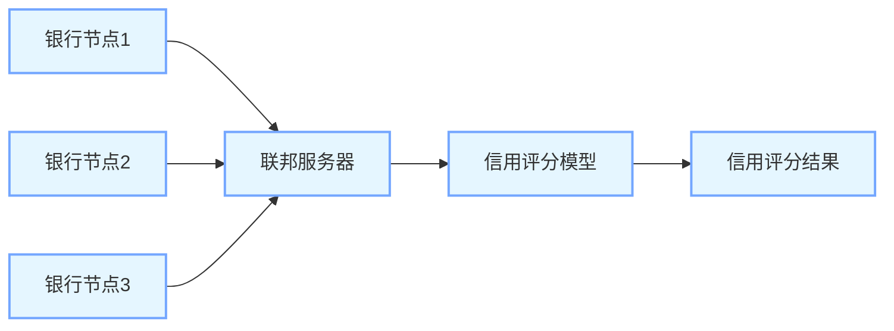

# 设计基于联邦学习的跨银行信用评分系统

> 关键词：联邦学习、跨银行信用评分系统、隐私保护、机器学习、数据安全

> 摘要：本文旨在深入探讨如何设计一个基于联邦学习的跨银行信用评分系统。随着金融行业的发展，跨银行的信用评分需求日益增长，但传统方式面临数据隐私和安全问题。联邦学习作为一种新兴的技术，能够在保护各银行数据隐私的前提下，实现数据的协同建模，提高信用评分的准确性和可靠性。文章将详细介绍联邦学习和跨银行信用评分系统的核心概念、算法原理、数学模型，通过实际案例展示系统的开发过程，并探讨其实际应用场景、推荐相关工具和资源，最后对未来发展趋势与挑战进行总结。

## 1. 背景介绍 
### 1.1 目的和范围
在金融领域，准确的信用评分对于银行评估客户的信用风险至关重要。然而，由于各银行的数据通常是孤立的，缺乏足够的信息来全面评估客户的信用状况。跨银行信用评分系统可以整合多个银行的数据，提高信用评分的准确性。但直接共享数据会带来严重的隐私和安全问题。联邦学习提供了一种解决方案，它允许各银行在不共享原始数据的情况下进行联合建模。本文章的范围包括联邦学习的原理、跨银行信用评分系统的设计和实现，以及相关的算法、数学模型和实际应用案例。

### 1.2 预期读者
本文预期读者包括金融行业的从业者，如银行的风险管理专家、数据分析师；人工智能和机器学习领域的研究人员和开发者，对联邦学习和隐私保护技术感兴趣的专业人士；以及相关专业的学生，希望了解跨银行信用评分系统的设计和实现原理。

### 1.3 文档结构概述
本文将按照以下结构进行组织：首先介绍核心概念与联系，包括联邦学习和跨银行信用评分系统的基本原理和架构；接着详细讲解核心算法原理和具体操作步骤，并使用Python代码进行阐述；然后介绍数学模型和公式，并通过举例说明；之后通过项目实战展示系统的开发过程，包括开发环境搭建、源代码实现和代码解读；再探讨实际应用场景；推荐相关的工具和资源；最后总结未来发展趋势与挑战，并提供常见问题与解答和扩展阅读参考资料。

### 1.4 术语表
#### 1.4.1 核心术语定义
- **联邦学习**：一种机器学习技术，允许多个参与方在不共享原始数据的情况下进行联合建模，通过交换模型参数来实现数据的协同分析和学习。
- **跨银行信用评分系统**：整合多个银行的数据，对客户的信用状况进行评估和评分的系统。
- **隐私保护**：在数据处理和分析过程中，采取措施保护数据的隐私和安全，防止数据泄露和滥用。
- **模型参数**：机器学习模型中的参数，如权重和偏置，用于描述模型的特征和行为。

#### 1.4.2 相关概念解释
- **横向联邦学习**：参与方的数据特征相同，但样本不同的联邦学习模式。
- **纵向联邦学习**：参与方的数据样本相同，但特征不同的联邦学习模式。
- **联邦平均算法（FedAvg）**：一种常用的联邦学习算法，通过多次迭代更新模型参数，实现各参与方模型的协同优化。

#### 1.4.3 缩略词列表
- **FL**：联邦学习（Federated Learning）
- **FedAvg**：联邦平均算法（Federated Averaging）
- **API**：应用程序编程接口（Application Programming Interface）

## 2. 核心概念与联系 

### 2.1 联邦学习原理
联邦学习的核心思想是在不共享原始数据的情况下，通过交换模型参数来实现联合建模。它主要分为横向联邦学习、纵向联邦学习和联邦迁移学习三种模式。

横向联邦学习中，各参与方的数据特征相同，但样本不同。例如，不同地区的银行拥有相同类型的客户数据，但客户群体不同。各银行在本地训练模型，然后将模型参数上传到服务器，服务器对参数进行聚合，再将聚合后的参数下发给各银行，各银行根据新的参数更新本地模型。

纵向联邦学习中，各参与方的数据样本相同，但特征不同。例如，一家银行拥有客户的基本信息，另一家银行拥有客户的交易记录。各银行在本地对自己的数据进行特征处理和模型训练，然后通过加密技术交换中间结果，共同完成模型的训练。

联邦迁移学习适用于参与方的数据特征和样本都不同的情况，通过迁移学习的方法，将一个领域的知识迁移到另一个领域，实现联合建模。

### 2.2 跨银行信用评分系统架构
跨银行信用评分系统主要由多个银行节点、联邦服务器和信用评分模型组成。各银行节点负责本地数据的存储和处理，以及本地模型的训练。联邦服务器负责模型参数的聚合和分发。信用评分模型是整个系统的核心，用于对客户的信用状况进行评估和评分。

以下是跨银行信用评分系统的架构示意图：



### 2.3 联邦学习与跨银行信用评分系统的联系
联邦学习为跨银行信用评分系统提供了一种安全、有效的数据协同建模方法。通过联邦学习，各银行可以在不共享原始数据的情况下，利用其他银行的数据信息来提高自己的信用评分模型的准确性和可靠性。同时，联邦学习的隐私保护机制可以确保各银行的数据安全，避免数据泄露和滥用。

## 3. 核心算法原理 & 具体操作步骤 

### 3.1 联邦平均算法（FedAvg）原理
联邦平均算法是一种常用的联邦学习算法，其核心思想是通过多次迭代更新模型参数，实现各参与方模型的协同优化。具体步骤如下：

1. **初始化**：服务器初始化全局模型参数 $\theta_0$。
2. **选择参与方**：服务器随机选择一部分参与方。
3. **本地训练**：被选中的参与方根据本地数据对本地模型进行训练，更新本地模型参数。
4. **上传参数**：参与方将本地模型参数上传到服务器。
5. **参数聚合**：服务器对上传的本地模型参数进行加权平均，得到新的全局模型参数。
6. **下发参数**：服务器将新的全局模型参数下发给各参与方。
7. **更新模型**：参与方根据新的全局模型参数更新本地模型。
8. **重复步骤2-7**：直到满足终止条件，如达到最大迭代次数或模型收敛。

### 3.2 Python代码实现
以下是一个简单的联邦平均算法的Python代码示例：

```python
import numpy as np
import torch
import torch.nn as nn
import torch.optim as optim

# 定义一个简单的神经网络模型
class SimpleModel(nn.Module):
    def __init__(self):
        super(SimpleModel, self).__init__()
        self.fc = nn.Linear(10, 1)

    def forward(self, x):
        return self.fc(x)

# 模拟银行节点
class BankNode:
    def __init__(self):
        self.model = SimpleModel()
        self.optimizer = optim.SGD(self.model.parameters(), lr=0.01)
        self.criterion = nn.MSELoss()

    def local_train(self, data, labels, epochs=10):
        for epoch in range(epochs):
            self.optimizer.zero_grad()
            outputs = self.model(data)
            loss = self.criterion(outputs, labels)
            loss.backward()
            self.optimizer.step()
        return self.model.state_dict()

# 模拟联邦服务器
class FederatedServer:
    def __init__(self):
        self.global_model = SimpleModel()

    def aggregate(self, local_models):
        num_clients = len(local_models)
        global_dict = self.global_model.state_dict()
        for k in global_dict.keys():
            global_dict[k] = sum([local_models[i][k] for i in range(num_clients)]) / num_clients
        self.global_model.load_state_dict(global_dict)
        return self.global_model.state_dict()

# 模拟数据
data = torch.randn(100, 10)
labels = torch.randn(100, 1)

# 创建银行节点和联邦服务器
bank_nodes = [BankNode() for _ in range(3)]
server = FederatedServer()

# 联邦学习迭代
num_rounds = 10
for round in range(num_rounds):
    local_models = []
    for node in bank_nodes:
        local_model = node.local_train(data, labels)
        local_models.append(local_model)
    global_model = server.aggregate(local_models)
    for node in bank_nodes:
        node.model.load_state_dict(global_model)

print("联邦学习完成，最终全局模型参数：", server.global_model.state_dict())
```

### 3.3 具体操作步骤
1. **数据准备**：各银行节点准备本地的客户信用数据，并进行预处理，如数据清洗、特征工程等。
2. **模型初始化**：服务器初始化全局模型参数，并将其下发给各银行节点。
3. **本地训练**：各银行节点根据本地数据对本地模型进行训练，更新本地模型参数。
4. **参数上传**：各银行节点将本地模型参数上传到服务器。
5. **参数聚合**：服务器对上传的本地模型参数进行加权平均，得到新的全局模型参数。
6. **下发参数**：服务器将新的全局模型参数下发给各银行节点。
7. **更新模型**：各银行节点根据新的全局模型参数更新本地模型。
8. **重复步骤3-7**：直到满足终止条件，如达到最大迭代次数或模型收敛。
9. **信用评分**：各银行节点使用训练好的模型对客户的信用状况进行评估和评分。

## 4. 数学模型和公式 & 详细讲解 & 举例说明 

### 4.1 联邦平均算法的数学模型
设共有 $K$ 个参与方，第 $k$ 个参与方的本地数据集为 $D_k$，本地模型参数为 $\theta_k$，全局模型参数为 $\theta$。联邦平均算法的参数聚合公式为：

$$
\theta_{t+1} = \sum_{k=1}^{K} \frac{n_k}{N} \theta_{k,t}
$$

其中，$\theta_{t+1}$ 是第 $t+1$ 轮迭代后的全局模型参数，$\theta_{k,t}$ 是第 $k$ 个参与方在第 $t$ 轮迭代后的本地模型参数，$n_k$ 是第 $k$ 个参与方的本地数据集的样本数量，$N = \sum_{k=1}^{K} n_k$ 是所有参与方的本地数据集的样本总数。

### 4.2 详细讲解
联邦平均算法的核心思想是通过加权平均的方式将各参与方的本地模型参数聚合为全局模型参数。权重 $\frac{n_k}{N}$ 表示第 $k$ 个参与方的本地数据集在所有参与方的本地数据集中所占的比例，这样可以确保样本数量较多的参与方对全局模型的影响更大。

### 4.3 举例说明
假设有三个银行节点，分别为银行 A、银行 B 和银行 C。银行 A 的本地数据集有 100 个样本，银行 B 的本地数据集有 200 个样本，银行 C 的本地数据集有 300 个样本。则总样本数量 $N = 100 + 200 + 300 = 600$。

在某一轮迭代中，银行 A 的本地模型参数为 $\theta_A$，银行 B 的本地模型参数为 $\theta_B$，银行 C 的本地模型参数为 $\theta_C$。则新的全局模型参数 $\theta_{new}$ 为：

$$
\theta_{new} = \frac{100}{600} \theta_A + \frac{200}{600} \theta_B + \frac{300}{600} \theta_C
$$

## 5. 项目实战：代码实际案例和详细解释说明 

### 5.1  开发环境搭建
#### 5.1.1 操作系统
建议使用 Linux 或 macOS 操作系统，因为它们对机器学习和深度学习的支持更好。

#### 5.1.2 Python 环境
安装 Python 3.7 或以上版本，并使用虚拟环境管理工具（如 virtualenv 或 conda）创建一个独立的 Python 环境。

#### 5.1.3 依赖库安装
在虚拟环境中安装以下依赖库：
- **PyTorch**：用于构建和训练神经网络模型。
- **NumPy**：用于数值计算。
- **Pandas**：用于数据处理和分析。

可以使用以下命令安装依赖库：

```bash
pip install torch numpy pandas
```

### 5.2  源代码详细实现和代码解读
以下是一个更完整的基于联邦学习的跨银行信用评分系统的 Python 代码示例：

```python
import numpy as np
import torch
import torch.nn as nn
import torch.optim as optim
import pandas as pd

# 定义信用评分模型
class CreditScoringModel(nn.Module):
    def __init__(self, input_size):
        super(CreditScoringModel, self).__init__()
        self.fc1 = nn.Linear(input_size, 64)
        self.relu = nn.ReLU()
        self.fc2 = nn.Linear(64, 1)
        self.sigmoid = nn.Sigmoid()

    def forward(self, x):
        out = self.fc1(x)
        out = self.relu(out)
        out = self.fc2(out)
        out = self.sigmoid(out)
        return out

# 模拟银行节点
class BankNode:
    def __init__(self, data, labels, input_size):
        self.data = data
        self.labels = labels
        self.model = CreditScoringModel(input_size)
        self.optimizer = optim.Adam(self.model.parameters(), lr=0.001)
        self.criterion = nn.BCELoss()

    def local_train(self, epochs=10):
        for epoch in range(epochs):
            self.optimizer.zero_grad()
            outputs = self.model(self.data)
            loss = self.criterion(outputs, self.labels)
            loss.backward()
            self.optimizer.step()
        return self.model.state_dict()

    def evaluate(self):
        with torch.no_grad():
            outputs = self.model(self.data)
            predicted = (outputs >= 0.5).float()
            accuracy = (predicted == self.labels).sum().item() / len(self.labels)
            return accuracy

# 模拟联邦服务器
class FederatedServer:
    def __init__(self, input_size):
        self.global_model = CreditScoringModel(input_size)

    def aggregate(self, local_models, weights):
        global_dict = self.global_model.state_dict()
        for k in global_dict.keys():
            global_dict[k] = sum([weights[i] * local_models[i][k] for i in range(len(local_models))])
        self.global_model.load_state_dict(global_dict)
        return self.global_model.state_dict()

# 数据加载和预处理
def load_data():
    data = pd.read_csv('credit_data.csv')
    labels = data['label'].values
    features = data.drop('label', axis=1).values
    input_size = features.shape[1]
    features = torch.tensor(features, dtype=torch.float32)
    labels = torch.tensor(labels, dtype=torch.float32).view(-1, 1)
    return features, labels, input_size

# 主函数
def main():
    features, labels, input_size = load_data()
    num_banks = 3
    bank_data = torch.chunk(features, num_banks)
    bank_labels = torch.chunk(labels, num_banks)

    bank_nodes = [BankNode(bank_data[i], bank_labels[i], input_size) for i in range(num_banks)]
    server = FederatedServer(input_size)

    num_rounds = 10
    for round in range(num_rounds):
        local_models = []
        weights = []
        for node in bank_nodes:
            local_model = node.local_train()
            local_models.append(local_model)
            weights.append(len(node.data) / len(features))
        global_model = server.aggregate(local_models, weights)
        for node in bank_nodes:
            node.model.load_state_dict(global_model)

    for i, node in enumerate(bank_nodes):
        accuracy = node.evaluate()
        print(f"银行 {i+1} 的信用评分模型准确率: {accuracy}")

if __name__ == "__main__":
    main()
```

### 5.3  代码解读与分析
#### 5.3.1 信用评分模型定义
`CreditScoringModel` 类定义了一个简单的神经网络模型，用于信用评分。该模型包含两个全连接层和一个 sigmoid 激活函数，输出一个 0 到 1 之间的概率值，表示客户的信用风险。

#### 5.3.2 银行节点类
`BankNode` 类模拟了一个银行节点，包含本地数据、本地模型、优化器和损失函数。`local_train` 方法用于在本地数据上训练模型，`evaluate` 方法用于评估模型的准确率。

#### 5.3.3 联邦服务器类
`FederatedServer` 类模拟了一个联邦服务器，负责模型参数的聚合。`aggregate` 方法根据各银行节点的本地模型参数和权重，计算新的全局模型参数。

#### 5.3.4 数据加载和预处理
`load_data` 函数用于加载信用数据，并进行预处理，将数据转换为 PyTorch 张量。

#### 5.3.5 主函数
`main` 函数是程序的入口，负责初始化银行节点和联邦服务器，进行联邦学习迭代，并评估各银行节点的模型准确率。

## 6. 实际应用场景 
### 6.1 跨银行联合信贷评估
在跨银行联合信贷评估中，各银行可以通过联邦学习的方式，在不共享客户原始数据的情况下，联合训练一个更准确的信用评分模型。这样可以提高信贷审批的准确性和效率，降低信用风险。

### 6.2 金融监管
金融监管机构可以利用基于联邦学习的跨银行信用评分系统，对各银行的客户信用状况进行全面评估和监测。通过分析各银行的信用评分模型和数据，监管机构可以及时发现潜在的金融风险，采取相应的监管措施。

### 6.3 金融科技合作
金融科技公司可以与银行合作，利用联邦学习技术开发跨银行信用评分系统。金融科技公司可以提供先进的算法和技术支持，银行可以提供数据和业务场景。通过合作，双方可以共同推动金融科技的发展，提高金融服务的质量和效率。

## 7. 工具和资源推荐
### 7.1 学习资源推荐
#### 7.1.1 书籍推荐
- 《深度学习》（Deep Learning）：由 Ian Goodfellow、Yoshua Bengio 和 Aaron Courville 撰写，是深度学习领域的经典教材。
- 《联邦学习》（Federated Learning）：由 Yang Qiang、Yang Liu、Tianjian Chen 和 Yongxin Tong 撰写，系统介绍了联邦学习的原理、算法和应用。

#### 7.1.2 在线课程
- Coursera 上的“深度学习专项课程”（Deep Learning Specialization）：由 Andrew Ng 教授授课，涵盖了深度学习的基础知识和应用。
- edX 上的“联邦学习基础与应用”（Foundations and Applications of Federated Learning）：由多个知名高校的教授联合授课，深入讲解了联邦学习的原理和实践。

#### 7.1.3 技术博客和网站
- arXiv.org：一个预印本平台，提供了大量关于机器学习和人工智能的最新研究成果。
- Medium 上的机器学习和人工智能相关博客：有很多专业人士分享的技术文章和实践经验。

### 7.2 开发工具框架推荐
#### 7.2.1 IDE和编辑器
- PyCharm：一款专业的 Python 集成开发环境，提供了丰富的代码编辑、调试和项目管理功能。
- Jupyter Notebook：一个交互式的编程环境，适合进行数据探索和模型实验。

#### 7.2.2 调试和性能分析工具
- TensorBoard：一个可视化工具，用于监控和分析深度学习模型的训练过程和性能。
- Py-Spy：一个 Python 性能分析工具，可以帮助开发者找出代码中的性能瓶颈。

#### 7.2.3 相关框架和库
- PySyft：一个用于构建联邦学习系统的 Python 库，提供了丰富的工具和接口。
- Flower：一个开源的联邦学习框架，支持多种机器学习框架和算法。

### 7.3 相关论文著作推荐
#### 7.3.1 经典论文
- 《Communication-Efficient Learning of Deep Networks from Decentralized Data》：提出了联邦平均算法（FedAvg），是联邦学习领域的经典论文。
- 《Federated Learning: Challenges, Methods, and Future Directions》：对联邦学习的挑战、方法和未来发展方向进行了全面的综述。

#### 7.3.2 最新研究成果
- 关注 arXiv.org 上关于联邦学习和跨银行信用评分的最新研究论文，了解该领域的最新技术和趋势。

#### 7.3.3 应用案例分析
- 可以参考一些金融机构和科技公司发布的关于联邦学习在跨银行信用评分系统中的应用案例，学习实际应用中的经验和技巧。

## 8. 总结：未来发展趋势与挑战
### 8.1 未来发展趋势
- **技术创新**：随着人工智能和机器学习技术的不断发展，联邦学习算法和隐私保护技术将不断创新和完善，提高跨银行信用评分系统的性能和安全性。
- **行业应用拓展**：除了金融行业，联邦学习在医疗、教育、交通等领域也有广阔的应用前景。未来，跨银行信用评分系统的经验和技术将有望推广到其他行业，实现更广泛的数据协同和应用。
- **标准化和规范化**：随着联邦学习的广泛应用，相关的标准和规范将逐渐完善，促进跨银行信用评分系统的健康发展。

### 8.2 挑战
- **隐私保护**：虽然联邦学习可以在一定程度上保护数据隐私，但仍然面临着隐私泄露的风险。如何进一步提高隐私保护的水平，是未来需要解决的重要问题。
- **计算效率**：联邦学习需要多次迭代和通信，计算效率较低。如何优化算法和通信机制，提高系统的计算效率，是另一个挑战。
- **模型异构性**：不同银行的信用评分模型可能存在异构性，如何处理模型异构性，实现有效的模型协同，也是需要解决的问题。

## 9. 附录：常见问题与解答
### 9.1 联邦学习是否能完全保证数据隐私？
联邦学习可以在很大程度上保护数据隐私，但不能完全保证。在数据传输和模型参数聚合过程中，仍然存在一定的隐私泄露风险。因此，需要结合其他隐私保护技术，如差分隐私、同态加密等，进一步提高隐私保护的水平。

### 9.2 跨银行信用评分系统的准确性如何保证？
跨银行信用评分系统的准确性取决于多个因素，如数据质量、模型算法、参数调整等。通过合理的数据预处理、选择合适的模型算法和进行有效的参数调整，可以提高系统的准确性。同时，联邦学习可以整合多个银行的数据信息，进一步提高模型的准确性和可靠性。

### 9.3 联邦学习的计算效率如何提高？
可以通过优化算法和通信机制来提高联邦学习的计算效率。例如，采用异步更新的方式代替同步更新，减少通信等待时间；使用模型压缩技术，减少模型参数的传输量；采用分布式计算技术，提高计算资源的利用率。

## 10. 扩展阅读 & 参考资料
- 《Federated Machine Learning: Concept and Applications》
- 《Privacy-Preserving Machine Learning on Decentralized Data》
- 相关的学术期刊和会议论文，如 ACM SIGKDD、NeurIPS 等。

作者：AI天才研究院/AI Genius Institute & 禅与计算机程序设计艺术 /Zen And The Art of Computer Programming