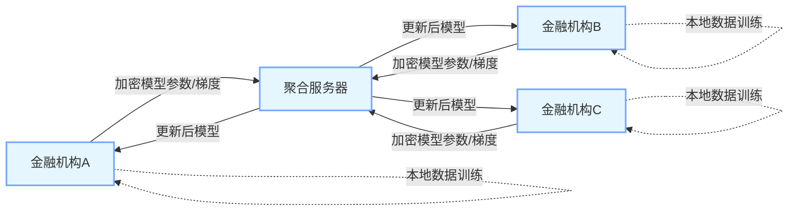

# 设计基于联邦学习的隐私保护金融AI系统

> 关键词：联邦学习、隐私保护、金融AI系统、数据安全、分布式学习

> 摘要：本文聚焦于设计基于联邦学习的隐私保护金融AI系统。在金融领域，数据隐私和安全至关重要，传统AI系统在数据集中处理时面临诸多隐私风险。联邦学习作为一种新兴的分布式机器学习技术，为解决这一问题提供了有效途径。文章首先介绍了设计该系统的背景信息，包括目的、预期读者、文档结构和相关术语；接着阐述了联邦学习和隐私保护金融AI系统的核心概念及其联系；详细讲解了核心算法原理和具体操作步骤，并给出Python代码示例；分析了相关数学模型和公式；通过项目实战展示了系统的实际开发过程；探讨了该系统的实际应用场景；推荐了学习该技术所需的工具和资源；最后总结了系统未来的发展趋势与挑战，并对常见问题进行了解答，还提供了扩展阅读和参考资料。

## 1. 背景介绍 
### 1.1 目的和范围
在金融行业，海量的数据蕴含着巨大的价值，利用人工智能技术可以挖掘这些数据，为金融决策、风险评估、客户服务等提供支持。然而，金融数据涉及客户的敏感信息，如个人身份、财务状况等，数据的隐私和安全保护是至关重要的。传统的AI系统通常需要将数据集中到一个中心节点进行处理，这不仅面临数据泄露的风险，还可能违反相关的法律法规。

联邦学习是一种分布式机器学习技术，它允许在多个参与方之间进行模型训练，而无需共享原始数据。本项目的目的是设计一个基于联邦学习的隐私保护金融AI系统，该系统可以在保证数据隐私的前提下，利用多个金融机构的数据进行联合模型训练，提高模型的性能和泛化能力。

本项目的范围包括系统的整体架构设计、核心算法实现、数学模型分析、项目实战以及应用场景探讨等方面。

### 1.2 预期读者
本文的预期读者包括金融行业的技术人员、数据科学家、AI开发者，以及对隐私保护和联邦学习技术感兴趣的研究人员。对于金融行业从业者，本文可以帮助他们了解如何利用联邦学习技术解决数据隐私问题，提升金融AI系统的安全性和性能；对于技术开发者和研究人员，本文提供了详细的技术原理和实现步骤，可作为开发和研究的参考。

### 1.3 文档结构概述
本文的文档结构如下：
- 核心概念与联系：介绍联邦学习和隐私保护金融AI系统的核心概念，以及它们之间的联系，并通过文本示意图和Mermaid流程图进行说明。
- 核心算法原理 & 具体操作步骤：详细讲解联邦学习的核心算法原理，并给出具体的操作步骤，同时使用Python源代码进行阐述。
- 数学模型和公式 & 详细讲解 & 举例说明：分析联邦学习的数学模型和公式，并通过具体的例子进行说明。
- 项目实战：代码实际案例和详细解释说明：通过一个实际的项目案例，展示如何搭建开发环境、实现源代码，并对代码进行解读和分析。
- 实际应用场景：探讨基于联邦学习的隐私保护金融AI系统在金融行业的实际应用场景。
- 工具和资源推荐：推荐学习和开发该系统所需的工具和资源，包括学习资源、开发工具框架和相关论文著作。
- 总结：未来发展趋势与挑战：总结系统的未来发展趋势和面临的挑战。
- 附录：常见问题与解答：解答读者在学习和使用过程中可能遇到的常见问题。
- 扩展阅读 & 参考资料：提供扩展阅读的建议和相关的参考资料。

### 1.4 术语表
#### 1.4.1 核心术语定义
- **联邦学习（Federated Learning）**：一种分布式机器学习技术，多个参与方在不共享原始数据的情况下，通过交换模型参数或梯度信息进行联合模型训练。
- **隐私保护（Privacy Preservation）**：在数据处理和机器学习过程中，采取措施保护数据的隐私和安全，防止数据泄露和滥用。
- **金融AI系统（Financial AI System）**：利用人工智能技术处理金融数据，为金融业务提供决策支持、风险评估、客户服务等功能的系统。
- **数据所有者（Data Owner）**：拥有原始数据的组织或个人，在联邦学习中作为参与方提供本地数据进行模型训练。
- **聚合服务器（Aggregation Server）**：负责收集和聚合各个数据所有者的模型参数或梯度信息，更新全局模型的服务器。

#### 1.4.2 相关概念解释
- **同态加密（Homomorphic Encryption）**：一种加密技术，允许在加密数据上进行特定的计算，而无需解密数据，计算结果解密后与在明文数据上进行相同计算的结果相同。在联邦学习中，同态加密可以用于保护模型参数或梯度信息的隐私。
- **差分隐私（Differential Privacy）**：一种隐私保护技术，通过在数据中添加噪声来掩盖个体信息，使得查询结果不会泄露任何单个个体的敏感信息。在联邦学习中，差分隐私可以用于保护本地数据的隐私。
- **安全多方计算（Secure Multi-Party Computation）**：一种密码学技术，多个参与方在不泄露各自私有输入的情况下，协同计算一个函数的输出。在联邦学习中，安全多方计算可以用于实现模型参数或梯度信息的安全聚合。

#### 1.4.3 缩略词列表
- **FL**：Federated Learning（联邦学习）
- **HE**：Homomorphic Encryption（同态加密）
- **DP**：Differential Privacy（差分隐私）
- **SMPC**：Secure Multi-Party Computation（安全多方计算）

## 2. 核心概念与联系 

### 核心概念原理
#### 联邦学习
联邦学习的核心思想是在多个数据所有者之间进行分布式模型训练，而无需共享原始数据。每个数据所有者在本地使用自己的数据训练模型，并将模型参数或梯度信息发送给聚合服务器。聚合服务器收集这些信息后，进行聚合操作，更新全局模型，并将更新后的模型发送回各个数据所有者。各个数据所有者再使用更新后的模型在本地继续训练，如此反复迭代，直到模型收敛。

联邦学习主要分为横向联邦学习、纵向联邦学习和联邦迁移学习三种类型：
- **横向联邦学习（Horizontal Federated Learning）**：参与方的数据特征空间相同，但样本空间不同。例如，不同地区的银行拥有相同类型的客户数据，但客户群体不同。在横向联邦学习中，各个参与方可以直接对模型参数进行聚合。
- **纵向联邦学习（Vertical Federated Learning）**：参与方的数据样本空间相同，但特征空间不同。例如，银行和电商平台拥有相同客户的不同类型数据，银行拥有客户的财务数据，电商平台拥有客户的消费数据。在纵向联邦学习中，需要通过安全多方计算等技术对不同特征空间的模型参数进行聚合。
- **联邦迁移学习（Federated Transfer Learning）**：参与方的数据特征空间和样本空间都不同，但可以通过迁移学习的方法利用部分数据进行模型训练。例如，金融机构和医疗保健机构的数据差异较大，但可以通过联邦迁移学习在一定程度上共享知识。

#### 隐私保护金融AI系统
隐私保护金融AI系统是将隐私保护技术与金融AI技术相结合的系统。该系统的主要目标是在保证金融数据隐私和安全的前提下，利用人工智能技术挖掘金融数据的价值，为金融业务提供支持。

隐私保护金融AI系统通常采用联邦学习、同态加密、差分隐私等技术来实现数据隐私保护。在模型训练过程中，各个金融机构作为数据所有者，在本地使用自己的数据训练模型，并通过加密技术保护模型参数或梯度信息的隐私。聚合服务器在接收到加密的信息后，进行安全聚合操作，更新全局模型。这样，既可以利用多个金融机构的数据提高模型的性能，又可以保证数据的隐私和安全。

### 架构的文本示意图
```plaintext
+---------------------+       +---------------------+       +---------------------+
|  金融机构A (数据所有者)  |       |  金融机构B (数据所有者)  |       |  金融机构C (数据所有者)  |
|                       |       |                       |       |                       |
|  本地数据            |       |  本地数据            |       |  本地数据            |
|  本地模型训练        |       |  本地模型训练        |       |  本地模型训练        |
|  加密模型参数/梯度  |       |  加密模型参数/梯度  |       |  加密模型参数/梯度  |
+---------------------+       +---------------------+       +---------------------+
                      \           |           /
                       \          |          /
                        \         |         /
                         \        |        /
                          +---------------------+
                          |  聚合服务器          |
                          |                       |
                          |  安全聚合操作        |
                          |  更新全局模型        |
                          |  发送更新后模型      |
                          +---------------------+
```

### Mermaid流程图


## 3. 核心算法原理 & 具体操作步骤 

### 核心算法原理
联邦学习的核心算法主要包括联邦平均算法（Federated Averaging，FedAvg）。FedAvg算法是一种简单而有效的联邦学习算法，其基本思想是在每个数据所有者本地进行多次迭代训练，然后将本地模型参数发送给聚合服务器，聚合服务器对这些参数进行加权平均，更新全局模型。

以下是FedAvg算法的详细步骤：
1. **初始化全局模型**：聚合服务器初始化一个全局模型 $w_0$，并将其发送给各个数据所有者。
2. **本地模型训练**：每个数据所有者 $i$ 在本地使用自己的数据 $D_i$ 对全局模型 $w_t$ 进行 $E$ 次迭代训练，得到本地模型 $w_{i,t+1}$。
3. **模型参数上传**：每个数据所有者 $i$ 将本地模型参数 $w_{i,t+1}$ 发送给聚合服务器。
4. **全局模型更新**：聚合服务器根据各个数据所有者的样本数量 $n_i$ 对本地模型参数进行加权平均，更新全局模型 $w_{t+1}$：
   $$w_{t+1}=\frac{\sum_{i=1}^{N}n_iw_{i,t+1}}{\sum_{i=1}^{N}n_i}$$
其中，$N$ 是数据所有者的数量。
5. **重复步骤2-4**：直到全局模型收敛或达到预设的迭代次数。

### 具体操作步骤
以下是使用Python实现FedAvg算法的示例代码：

```python
import numpy as np
import tensorflow as tf

# 模拟数据所有者
class DataOwner:
    def __init__(self, data, labels, learning_rate=0.01, epochs=10):
        self.data = data
        self.labels = labels
        self.learning_rate = learning_rate
        self.epochs = epochs
        self.model = self.build_model()

    def build_model(self):
        model = tf.keras.Sequential([
            tf.keras.layers.Dense(10, activation='relu', input_shape=(self.data.shape[1],)),
            tf.keras.layers.Dense(1, activation='sigmoid')
        ])
        model.compile(optimizer=tf.keras.optimizers.SGD(learning_rate=self.learning_rate),
                      loss='binary_crossentropy',
                      metrics=['accuracy'])
        return model

    def local_train(self, global_weights):
        self.model.set_weights(global_weights)
        self.model.fit(self.data, self.labels, epochs=self.epochs, verbose=0)
        return self.model.get_weights()

# 模拟聚合服务器
class AggregationServer:
    def __init__(self, data_owners):
        self.data_owners = data_owners
        self.global_model = self.data_owners[0].build_model()
        self.global_weights = self.global_model.get_weights()

    def aggregate_weights(self, local_weights_list):
        num_data_owners = len(self.data_owners)
        total_samples = sum([owner.data.shape[0] for owner in self.data_owners])
        aggregated_weights = []
        for layer in range(len(local_weights_list[0])):
            layer_weights = []
            for i in range(num_data_owners):
                num_samples = self.data_owners[i].data.shape[0]
                layer_weights.append(local_weights_list[i][layer] * num_samples)
            aggregated_weights.append(np.sum(layer_weights, axis=0) / total_samples)
        return aggregated_weights

    def federated_training(self, rounds):
        for round in range(rounds):
            local_weights_list = []
            for owner in self.data_owners:
                local_weights = owner.local_train(self.global_weights)
                local_weights_list.append(local_weights)
            self.global_weights = self.aggregate_weights(local_weights_list)
            self.global_model.set_weights(self.global_weights)
        return self.global_model

# 生成模拟数据
num_samples = 1000
num_features = 10
data_owner1_data = np.random.randn(num_samples // 2, num_features)
data_owner1_labels = np.random.randint(0, 2, num_samples // 2)
data_owner2_data = np.random.randn(num_samples // 2, num_features)
data_owner2_labels = np.random.randint(0, 2, num_samples // 2)

# 创建数据所有者和聚合服务器
data_owner1 = DataOwner(data_owner1_data, data_owner1_labels)
data_owner2 = DataOwner(data_owner2_data, data_owner2_labels)
data_owners = [data_owner1, data_owner2]
aggregation_server = AggregationServer(data_owners)

# 进行联邦学习训练
final_model = aggregation_server.federated_training(rounds=10)

# 评估最终模型
test_data = np.random.randn(num_samples, num_features)
test_labels = np.random.randint(0, 2, num_samples)
loss, accuracy = final_model.evaluate(test_data, test_labels)
print(f"Final model loss: {loss}, accuracy: {accuracy}")
```

### 代码解释
1. **DataOwner类**：模拟数据所有者，包含本地数据、本地模型和本地训练方法。`local_train` 方法接收全局模型参数，在本地进行训练，并返回本地模型参数。
2. **AggregationServer类**：模拟聚合服务器，包含数据所有者列表、全局模型和聚合方法。`aggregate_weights` 方法对各个数据所有者的本地模型参数进行加权平均，更新全局模型参数。`federated_training` 方法进行多轮联邦学习训练。
3. **主程序**：生成模拟数据，创建数据所有者和聚合服务器，进行联邦学习训练，并评估最终模型的性能。

## 4. 数学模型和公式 & 详细讲解 & 举例说明 

### 数学模型和公式
#### 目标函数
在联邦学习中，通常使用损失函数来衡量模型的性能。假设我们有 $N$ 个数据所有者，每个数据所有者 $i$ 拥有本地数据 $D_i=\{(x_{i,j},y_{i,j})\}_{j=1}^{n_i}$，其中 $x_{i,j}$ 是第 $i$ 个数据所有者的第 $j$ 个样本，$y_{i,j}$ 是对应的标签，$n_i$ 是第 $i$ 个数据所有者的样本数量。

我们的目标是最小化全局损失函数 $L(w)$：
$$L(w)=\sum_{i=1}^{N}\frac{n_i}{n}L_i(w)$$
其中，$n=\sum_{i=1}^{N}n_i$ 是所有数据所有者的样本总数，$L_i(w)$ 是第 $i$ 个数据所有者的本地损失函数。

#### 梯度计算
在每个数据所有者本地，使用梯度下降法更新模型参数。对于第 $i$ 个数据所有者，本地梯度为：
$$\nabla L_i(w)=\frac{1}{n_i}\sum_{j=1}^{n_i}\nabla l(x_{i,j},y_{i,j},w)$$
其中，$l(x_{i,j},y_{i,j},w)$ 是第 $i$ 个数据所有者的第 $j$ 个样本的损失函数。

#### 联邦平均算法公式
在联邦平均算法中，全局模型参数的更新公式为：
$$w_{t+1}=\frac{\sum_{i=1}^{N}n_iw_{i,t+1}}{\sum_{i=1}^{N}n_i}$$
其中，$w_{t}$ 是第 $t$ 轮的全局模型参数，$w_{i,t+1}$ 是第 $i$ 个数据所有者在第 $t+1$ 轮的本地模型参数。

### 详细讲解
#### 目标函数的意义
全局损失函数 $L(w)$ 是各个数据所有者的本地损失函数的加权平均，权重为各个数据所有者的样本数量占总样本数量的比例。这样可以保证全局模型在各个数据所有者的数据上都有较好的性能。

#### 梯度计算的意义
本地梯度 $\nabla L_i(w)$ 表示第 $i$ 个数据所有者的本地数据对模型参数的梯度。通过梯度下降法，我们可以根据本地梯度更新本地模型参数，使得本地损失函数 $L_i(w)$ 逐渐减小。

#### 联邦平均算法的意义
联邦平均算法通过对各个数据所有者的本地模型参数进行加权平均，更新全局模型参数。这样可以在不共享原始数据的情况下，利用各个数据所有者的数据进行联合模型训练，提高模型的性能和泛化能力。

### 举例说明
假设我们有两个数据所有者 $A$ 和 $B$，$A$ 拥有 $n_A = 100$ 个样本，$B$ 拥有 $n_B = 200$ 个样本。总样本数量 $n = n_A + n_B = 300$。

在第 $t$ 轮，全局模型参数为 $w_t$。$A$ 和 $B$ 在本地使用自己的数据对 $w_t$ 进行训练，得到本地模型参数 $w_{A,t+1}$ 和 $w_{B,t+1}$。

根据联邦平均算法，第 $t+1$ 轮的全局模型参数 $w_{t+1}$ 为：
$$w_{t+1}=\frac{n_Aw_{A,t+1}+n_Bw_{B,t+1}}{n_A + n_B}=\frac{100w_{A,t+1}+200w_{B,t+1}}{300}$$

通过不断迭代，全局模型参数会逐渐收敛，得到一个在所有数据所有者的数据上都有较好性能的模型。

## 5. 项目实战：代码实际案例和详细解释说明 

### 5.1  开发环境搭建
#### 安装Python
首先，确保你已经安装了Python 3.x 版本。你可以从Python官方网站（https://www.python.org/downloads/） 下载并安装适合你操作系统的Python版本。

#### 安装必要的库
在项目中，我们需要使用一些Python库，如TensorFlow、NumPy等。可以使用以下命令安装这些库：
```sh
pip install tensorflow numpy
```

### 5.2  源代码详细实现和代码解读
以下是一个更完整的基于联邦学习的隐私保护金融AI系统的源代码示例：

```python
import numpy as np
import tensorflow as tf
from tensorflow.keras.datasets import mnist
from tensorflow.keras.models import Sequential
from tensorflow.keras.layers import Dense, Flatten
from tensorflow.keras.utils import to_categorical

# 模拟数据所有者
class DataOwner:
    def __init__(self, data, labels, learning_rate=0.01, epochs=10):
        self.data = data
        self.labels = labels
        self.learning_rate = learning_rate
        self.epochs = epochs
        self.model = self.build_model()

    def build_model(self):
        model = Sequential([
            Flatten(input_shape=(28, 28)),
            Dense(128, activation='relu'),
            Dense(10, activation='softmax')
        ])
        model.compile(optimizer=tf.keras.optimizers.SGD(learning_rate=self.learning_rate),
                      loss='categorical_crossentropy',
                      metrics=['accuracy'])
        return model

    def local_train(self, global_weights):
        self.model.set_weights(global_weights)
        self.model.fit(self.data, self.labels, epochs=self.epochs, verbose=0)
        return self.model.get_weights()

# 模拟聚合服务器
class AggregationServer:
    def __init__(self, data_owners):
        self.data_owners = data_owners
        self.global_model = self.data_owners[0].build_model()
        self.global_weights = self.global_model.get_weights()

    def aggregate_weights(self, local_weights_list):
        num_data_owners = len(self.data_owners)
        total_samples = sum([owner.data.shape[0] for owner in self.data_owners])
        aggregated_weights = []
        for layer in range(len(local_weights_list[0])):
            layer_weights = []
            for i in range(num_data_owners):
                num_samples = self.data_owners[i].data.shape[0]
                layer_weights.append(local_weights_list[i][layer] * num_samples)
            aggregated_weights.append(np.sum(layer_weights, axis=0) / total_samples)
        return aggregated_weights

    def federated_training(self, rounds):
        for round in range(rounds):
            local_weights_list = []
            for owner in self.data_owners:
                local_weights = owner.local_train(self.global_weights)
                local_weights_list.append(local_weights)
            self.global_weights = self.aggregate_weights(local_weights_list)
            self.global_model.set_weights(self.global_weights)
        return self.global_model

# 加载MNIST数据集
(train_images, train_labels), (test_images, test_labels) = mnist.load_data()

# 数据预处理
train_images = train_images / 255.0
test_images = test_images / 255.0
train_labels = to_categorical(train_labels)
test_labels = to_categorical(test_labels)

# 划分数据给不同的数据所有者
data_owner1_data = train_images[:30000]
data_owner1_labels = train_labels[:30000]
data_owner2_data = train_images[30000:]
data_owner2_labels = train_labels[30000:]

# 创建数据所有者和聚合服务器
data_owner1 = DataOwner(data_owner1_data, data_owner1_labels)
data_owner2 = DataOwner(data_owner2_data, data_owner2_labels)
data_owners = [data_owner1, data_owner2]
aggregation_server = AggregationServer(data_owners)

# 进行联邦学习训练
final_model = aggregation_server.federated_training(rounds=10)

# 评估最终模型
loss, accuracy = final_model.evaluate(test_images, test_labels)
print(f"Final model loss: {loss}, accuracy: {accuracy}")
```

### 代码解读与分析
#### 数据加载和预处理
- 使用 `mnist.load_data()` 加载MNIST手写数字数据集。
- 将图像数据归一化到 [0, 1] 范围内，并将标签数据进行one-hot编码。

#### 数据划分
将训练数据划分为两部分，分别分配给两个数据所有者，模拟不同金融机构的数据。

#### 数据所有者类（DataOwner）
- `__init__` 方法：初始化数据所有者的本地数据、标签、学习率和训练轮数，并构建本地模型。
- `build_model` 方法：构建一个简单的全连接神经网络模型，用于手写数字分类。
- `local_train` 方法：接收全局模型参数，在本地使用自己的数据进行训练，并返回本地模型参数。

#### 聚合服务器类（AggregationServer）
- `__init__` 方法：初始化数据所有者列表、全局模型和全局模型参数。
- `aggregate_weights` 方法：对各个数据所有者的本地模型参数进行加权平均，更新全局模型参数。
- `federated_training` 方法：进行多轮联邦学习训练，每一轮中，各个数据所有者在本地训练模型，然后聚合服务器对本地模型参数进行聚合，更新全局模型。

#### 主程序
- 创建数据所有者和聚合服务器对象。
- 调用 `federated_training` 方法进行联邦学习训练。
- 使用测试数据评估最终模型的性能。

通过这个项目实战，我们可以看到如何使用联邦学习技术在不共享原始数据的情况下，联合多个数据所有者的数据进行模型训练，提高模型的性能。

## 6. 实际应用场景 
### 信用评估
在金融行业，信用评估是一项重要的业务。传统的信用评估方法通常只依赖于单个金融机构的数据，可能存在信息不全面的问题。基于联邦学习的隐私保护金融AI系统可以联合多个金融机构的数据，如银行、消费金融公司等，在保证数据隐私的前提下，构建更准确的信用评估模型。各个金融机构在本地使用自己的数据训练模型，并将模型参数发送给聚合服务器进行聚合。这样可以综合考虑多个机构的客户信息，提高信用评估的准确性和可靠性。

### 风险预测
金融机构需要对各种风险进行预测，如市场风险、信用风险、操作风险等。利用联邦学习技术，可以联合多个金融机构的数据，构建更全面的风险预测模型。例如，不同银行可以共享部分风险相关的数据，通过联邦学习训练模型，预测市场波动对金融业务的影响。在这个过程中，各个银行的数据仍然保存在本地，只有模型参数进行交换，保证了数据的隐私和安全。

### 客户细分
客户细分是金融机构进行精准营销和个性化服务的重要手段。通过联邦学习，多个金融机构可以联合分析客户数据，如客户的消费习惯、资产状况、投资偏好等，在不泄露客户隐私的情况下，构建更准确的客户细分模型。各个金融机构可以根据细分结果，为客户提供更个性化的金融产品和服务，提高客户满意度和忠诚度。

### 反欺诈检测
金融欺诈是金融行业面临的一个重要问题。基于联邦学习的隐私保护金融AI系统可以联合多个金融机构的数据，构建更强大的反欺诈检测模型。不同金融机构的交易数据和客户行为数据可以在本地进行特征提取和模型训练，然后将模型参数发送给聚合服务器进行聚合。这样可以综合考虑多个机构的欺诈信息，提高反欺诈检测的准确性和效率。

## 7. 工具和资源推荐
### 7.1 学习资源推荐
#### 7.1.1 书籍推荐
- 《Federated Learning: Foundations and Trends® in Machine Learning》：这本书全面介绍了联邦学习的基础理论、算法和应用，是学习联邦学习的经典教材。
- 《Artificial Intelligence: A Modern Approach》：虽然不是专门关于联邦学习的书籍，但它涵盖了人工智能的各个方面，包括机器学习、深度学习等，对于理解联邦学习的背景和相关技术有很大帮助。

#### 7.1.2 在线课程
- Coursera上的“Federated Learning for Privacy-Preserving AI”：该课程由知名专家授课，详细介绍了联邦学习的原理、算法和应用，通过实践项目帮助学习者掌握联邦学习技术。
- edX上的“Deep Learning Specialization”：深度学习是联邦学习的重要基础，该课程涵盖了深度学习的各个方面，包括神经网络、卷积神经网络、循环神经网络等，对于学习联邦学习有很大的帮助。

#### 7.1.3 技术博客和网站
- FedML官方博客（https://fedml.ai/blog/）：FedML是一个开源的联邦学习平台，其官方博客提供了丰富的联邦学习技术文章和案例分析。
- Towards Data Science（https://towardsdatascience.com/）：这是一个知名的数据科学和机器学习博客平台，上面有很多关于联邦学习和隐私保护的文章。

### 7.2 开发工具框架推荐
#### 7.2.1 IDE和编辑器
- PyCharm：一款功能强大的Python集成开发环境，提供了代码编辑、调试、版本控制等功能，适合开发基于Python的联邦学习项目。
- Jupyter Notebook：一个交互式的开发环境，支持Python、R等多种编程语言，适合进行数据探索、模型实验和代码演示。

#### 7.2.2 调试和性能分析工具
- TensorBoard：TensorFlow提供的一个可视化工具，可以帮助开发者监控模型训练过程、分析模型性能和查看模型结构。
- Py-Spy：一个轻量级的Python性能分析工具，可以帮助开发者找出Python代码中的性能瓶颈。

#### 7.2.3 相关框架和库
- TensorFlow Federated（TFF）：Google开发的一个开源联邦学习框架，提供了丰富的联邦学习算法和工具，支持在TensorFlow模型上进行联邦学习训练。
- PySyft：OpenMined组织开发的一个开源隐私保护深度学习框架，支持联邦学习、差分隐私等多种隐私保护技术。

### 7.3 相关论文著作推荐
#### 7.3.1 经典论文
- 《Communication-Efficient Learning of Deep Networks from Decentralized Data》：这是联邦学习领域的经典论文，提出了联邦平均算法（FedAvg），为联邦学习的发展奠定了基础。
- 《Privacy-Preserving Deep Learning》：该论文介绍了如何在深度学习中使用同态加密和差分隐私等技术保护数据隐私。

#### 7.3.2 最新研究成果
- 可以关注顶级学术会议如NeurIPS、ICML、CVPR等上的相关论文，了解联邦学习和隐私保护领域的最新研究成果。

#### 7.3.3 应用案例分析
- 一些金融机构和科技公司会发布关于联邦学习在金融领域应用的案例分析报告，可以通过他们的官方网站或学术数据库获取这些资料。

## 8. 总结：未来发展趋势与挑战
### 未来发展趋势
#### 技术融合
联邦学习将与其他技术如区块链、物联网、人工智能等进行更深入的融合。例如，结合区块链技术可以实现联邦学习中的数据溯源和可信计算，提高系统的安全性和可靠性；与物联网技术结合可以实现边缘设备上的联邦学习，提高数据处理的效率和隐私保护能力。

#### 行业应用拓展
除了金融行业，联邦学习将在医疗、教育、交通等更多行业得到广泛应用。在医疗领域，联邦学习可以联合多个医疗机构的数据进行疾病诊断和药物研发，在保证患者隐私的前提下提高医疗水平；在教育领域，联邦学习可以联合多个学校的数据进行学生学习行为分析和个性化教育推荐。

#### 标准和规范的建立
随着联邦学习的广泛应用，相关的标准和规范将逐渐建立。这些标准和规范将涉及数据隐私保护、模型评估、安全审计等方面，有助于推动联邦学习技术的健康发展。

### 挑战
#### 通信开销
在联邦学习中，各个数据所有者需要频繁地与聚合服务器进行通信，传输模型参数或梯度信息。当数据量较大或参与方较多时，通信开销会成为一个严重的问题。如何降低通信开销，提高通信效率，是联邦学习面临的一个重要挑战。

#### 模型异质性
不同数据所有者的数据分布和模型结构可能存在差异，导致模型异质性问题。在联邦学习中，如何处理模型异质性，保证全局模型在各个数据所有者的数据上都有较好的性能，是一个需要解决的问题。

#### 安全和隐私保护
虽然联邦学习本身具有一定的隐私保护能力，但仍然面临一些安全和隐私挑战。例如，攻击者可能通过分析模型参数或梯度信息来推断原始数据的部分信息；聚合服务器可能存在被攻击的风险，导致模型参数泄露。如何进一步提高联邦学习的安全和隐私保护能力，是未来需要研究的重点。

## 9. 附录：常见问题与解答
### 问题1：联邦学习和传统机器学习有什么区别？
答：传统机器学习通常需要将所有数据集中到一个中心节点进行处理，而联邦学习允许在多个数据所有者之间进行分布式模型训练，无需共享原始数据。联邦学习可以有效保护数据的隐私和安全，同时利用多个数据所有者的数据提高模型的性能和泛化能力。

### 问题2：联邦学习的性能如何保证？
答：联邦学习通过合理的算法设计和参数更新机制来保证模型的性能。例如，联邦平均算法通过对各个数据所有者的本地模型参数进行加权平均，更新全局模型参数，使得全局模型在各个数据所有者的数据上都有较好的性能。此外，还可以通过调整学习率、训练轮数等超参数来优化模型性能。

### 问题3：联邦学习在实际应用中存在哪些困难？
答：联邦学习在实际应用中存在一些困难，主要包括通信开销大、模型异质性问题、安全和隐私保护等方面。通信开销大是由于各个数据所有者需要频繁地与聚合服务器进行通信；模型异质性问题是由于不同数据所有者的数据分布和模型结构可能存在差异；安全和隐私保护问题是由于联邦学习仍然面临一些安全和隐私挑战，如数据泄露、模型参数被攻击等。

### 问题4：如何选择适合的联邦学习算法？
答：选择适合的联邦学习算法需要考虑多个因素，如数据分布、模型结构、通信开销、安全和隐私要求等。如果数据分布比较均匀，模型结构比较简单，可以选择联邦平均算法等简单有效的算法；如果数据分布不均匀，模型结构比较复杂，可以选择更复杂的联邦学习算法，如联邦优化算法等。同时，还需要根据安全和隐私要求选择合适的隐私保护技术，如同态加密、差分隐私等。

## 10. 扩展阅读 & 参考资料
### 扩展阅读
- 《Privacy-Preserving Machine Learning: A Survey》：该论文对隐私保护机器学习的各种技术进行了全面的综述，包括联邦学习、同态加密、差分隐私等。
- 《Federated Learning for Internet of Things: A Survey》：这篇论文介绍了联邦学习在物联网领域的应用和挑战，对于了解联邦学习的应用场景有很大帮助。

### 参考资料
- 《Communication-Efficient Learning of Deep Networks from Decentralized Data》：McMahan, H. B., Moore, E., Ramage, D., Hampson, S., & y Arcas, B. A. (2017). 这是联邦平均算法的原始论文。
- 《TensorFlow Federated Documentation》：https://www.tensorflow.org/federated  TensorFlow Federated的官方文档，提供了详细的API文档和使用示例。
- 《PySyft Documentation》：https://github.com/OpenMined/PySyft  PySyft的官方文档，介绍了该框架的使用方法和技术原理。

作者：AI天才研究院/AI Genius Institute & 禅与计算机程序设计艺术 /Zen And The Art of Computer Programming