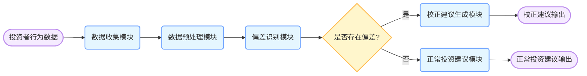

# 设计智能化的个人投资者认知偏差校正工具

> 关键词：个人投资者、认知偏差校正、智能化工具、金融科技、投资决策

> 摘要：本文聚焦于设计智能化的个人投资者认知偏差校正工具。随着金融市场的发展，个人投资者在投资决策中常受认知偏差影响，导致不理性行为和潜在损失。通过构建这样的工具，利用先进的技术和算法，能够识别投资者的认知偏差并进行有效校正，帮助投资者做出更理性、更科学的投资决策。文章将深入探讨该工具的核心概念、算法原理、数学模型、项目实战以及实际应用场景等内容，为金融科技领域的相关研究和实践提供参考。

## 1. 背景介绍 
### 1.1 目的和范围
目的：设计一款智能化工具，旨在识别个人投资者在投资决策过程中存在的认知偏差，并提供有效的校正方法，以提升投资者的决策质量和投资收益。
范围：本工具主要针对个人投资者，涵盖股票、基金、债券等常见金融投资领域。重点关注常见的认知偏差类型，如过度自信、损失厌恶、羊群效应等，并通过数据分析、机器学习等技术手段进行偏差的识别和校正。

### 1.2 预期读者
- 个人投资者：希望借助工具提升自身投资决策能力，避免因认知偏差导致的投资失误。
- 金融科技开发者：对开发智能化金融工具感兴趣，可从中获取相关技术和设计思路。
- 金融研究人员：关注投资者行为和认知偏差领域的研究，可参考本文内容进行深入探讨。

### 1.3 文档结构概述
本文将按照以下结构展开：首先介绍核心概念与联系，明确认知偏差校正工具的基本原理和架构；接着阐述核心算法原理及具体操作步骤，通过 Python 代码详细说明；然后讲解数学模型和公式，并举例说明；之后进行项目实战，包括开发环境搭建、源代码实现和代码解读；再探讨实际应用场景；推荐相关的工具和资源；最后总结未来发展趋势与挑战，提供常见问题解答和扩展阅读参考资料。

### 1.4 术语表
#### 1.4.1 核心术语定义
- 认知偏差：指在决策过程中，由于人类认知能力的局限性和心理因素的影响，导致的偏离理性判断的现象。
- 个人投资者：指以个人身份参与金融市场投资的个体。
- 智能化工具：利用人工智能、机器学习等技术，具备自动识别、分析和处理信息能力的工具。
- 偏差校正：通过特定的方法和策略，纠正投资者因认知偏差而产生的不理性决策。

#### 1.4.2 相关概念解释
- 行为金融学：是将心理学、社会学等学科的理论和方法应用于金融领域，研究投资者行为和市场异常现象的学科。认知偏差是行为金融学研究的重要内容之一。
- 机器学习：是一门多领域交叉学科，涉及概率论、统计学、逼近论、凸分析、算法复杂度理论等多门学科。它专门研究计算机怎样模拟或实现人类的学习行为，以获取新的知识或技能，重新组织已有的知识结构使之不断改善自身的性能。在认知偏差校正工具中，机器学习可用于识别投资者的认知偏差模式。

#### 1.4.3 缩略词列表
- AI：Artificial Intelligence，人工智能
- ML：Machine Learning，机器学习
- API：Application Programming Interface，应用程序编程接口

## 2. 核心概念与联系 

### 核心概念原理
个人投资者在投资决策过程中，往往会受到多种认知偏差的影响。例如，过度自信偏差会使投资者高估自己的投资能力，从而承担过高的风险；损失厌恶偏差会导致投资者在面对损失时过度恐惧，做出不理性的抛售决策。

智能化的个人投资者认知偏差校正工具的核心原理是通过收集投资者的投资行为数据，利用机器学习算法对这些数据进行分析，识别出投资者可能存在的认知偏差类型。然后，根据不同的偏差类型，提供相应的校正建议。例如，对于过度自信的投资者，工具可以提醒其注意风险，并提供客观的市场分析数据；对于损失厌恶的投资者，工具可以提供历史数据，说明长期投资的稳定性和合理性。

### 架构示意图


### 架构说明
- 数据收集模块：负责收集投资者的投资行为数据，包括交易记录、投资组合、关注的金融产品等。
- 数据预处理模块：对收集到的数据进行清洗、转换和特征提取，以便后续的分析和处理。
- 偏差识别模块：利用机器学习算法对预处理后的数据进行分析，识别投资者可能存在的认知偏差类型。
- 校正建议生成模块：根据识别出的偏差类型，生成相应的校正建议。
- 正常投资建议模块：当未识别出认知偏差时，提供基于市场分析和投资者风险偏好的正常投资建议。

## 3. 核心算法原理 & 具体操作步骤 

### 核心算法原理
在认知偏差校正工具中，主要使用机器学习中的分类算法来识别投资者的认知偏差类型。常见的分类算法有决策树、支持向量机、神经网络等。这里以决策树算法为例进行说明。

决策树是一种基于树结构进行决策的算法，它通过对数据的特征进行划分，构建一棵决策树。每个内部节点表示一个特征上的测试，每个分支是一个测试输出，每个叶节点是一个类别。在认知偏差识别中，决策树的输入是投资者的投资行为数据特征，输出是投资者可能存在的认知偏差类型。

### Python 代码实现
```python
import pandas as pd
from sklearn.tree import DecisionTreeClassifier
from sklearn.model_selection import train_test_split
from sklearn.metrics import accuracy_score

# 模拟投资者行为数据
data = {
    '交易频率': [10, 20, 5, 15, 30],
    '持仓时间': [30, 10, 60, 20, 5],
    '风险偏好': [3, 5, 2, 4, 6],
    '认知偏差类型': ['过度自信', '过度交易', '稳健型', '适度风险', '过度冒险']
}
df = pd.DataFrame(data)

# 特征和标签分离
X = df.drop('认知偏差类型', axis=1)
y = df['认知偏差类型']

# 划分训练集和测试集
X_train, X_test, y_train, y_test = train_test_split(X, y, test_size=0.2, random_state=42)

# 创建决策树分类器
clf = DecisionTreeClassifier()

# 训练模型
clf.fit(X_train, y_train)

# 预测
y_pred = clf.predict(X_test)

# 计算准确率
accuracy = accuracy_score(y_test, y_pred)
print(f"模型准确率: {accuracy}")
```

### 具体操作步骤
1. **数据准备**：收集投资者的投资行为数据，并将其整理成结构化的数据表格，如上述代码中的 `DataFrame`。
2. **特征和标签分离**：将数据中的特征（如交易频率、持仓时间、风险偏好等）和标签（认知偏差类型）分离。
3. **数据集划分**：将数据集划分为训练集和测试集，用于模型的训练和评估。
4. **模型创建和训练**：创建决策树分类器，并使用训练集对模型进行训练。
5. **模型预测和评估**：使用训练好的模型对测试集进行预测，并计算模型的准确率，评估模型的性能。

## 4. 数学模型和公式 & 详细讲解 & 举例说明 

### 决策树算法的数学模型
决策树算法的核心是选择最优的特征进行划分，以最大化信息增益。信息增益是指划分前后信息熵的变化。

#### 信息熵
信息熵是用来衡量数据的不确定性的指标。对于一个离散随机变量 $X$，其取值为 $x_1, x_2, \cdots, x_n$，概率分布为 $P(X = x_i) = p_i$，则信息熵的计算公式为：
$$
H(X) = -\sum_{i=1}^{n} p_i \log_2 p_i
$$

#### 条件熵
条件熵是在给定某个特征 $A$ 的条件下，数据的不确定性。设数据集 $D$ 中，特征 $A$ 有 $v$ 个不同的取值 $\{a_1, a_2, \cdots, a_v\}$，根据特征 $A$ 的取值将 $D$ 划分为 $v$ 个子集 $D_1, D_2, \cdots, D_v$，则条件熵的计算公式为：
$$
H(D|A) = \sum_{i=1}^{v} \frac{|D_i|}{|D|} H(D_i)
$$
其中，$|D|$ 表示数据集 $D$ 的样本数量，$|D_i|$ 表示子集 $D_i$ 的样本数量。

#### 信息增益
信息增益是划分前后信息熵的变化，计算公式为：
$$
Gain(D, A) = H(D) - H(D|A)
$$

### 详细讲解
在决策树的构建过程中，每次选择信息增益最大的特征进行划分。通过不断地划分，直到满足某个停止条件（如所有样本属于同一类别或达到最大深度）。

### 举例说明
假设有一个数据集 $D$，包含 10 个样本，其中 6 个属于类别 $C_1$，4 个属于类别 $C_2$。则数据集 $D$ 的信息熵为：
$$
H(D) = -\frac{6}{10} \log_2 \frac{6}{10} - \frac{4}{10} \log_2 \frac{4}{10} \approx 0.971
$$

假设存在一个特征 $A$，有两个取值 $a_1$ 和 $a_2$。根据特征 $A$ 的取值将数据集 $D$ 划分为两个子集 $D_1$ 和 $D_2$，其中 $D_1$ 包含 4 个样本，3 个属于类别 $C_1$，1 个属于类别 $C_2$；$D_2$ 包含 6 个样本，3 个属于类别 $C_1$，3 个属于类别 $C_2$。

则子集 $D_1$ 的信息熵为：
$$
H(D_1) = -\frac{3}{4} \log_2 \frac{3}{4} - \frac{1}{4} \log_2 \frac{1}{4} \approx 0.811
$$

子集 $D_2$ 的信息熵为：
$$
H(D_2) = -\frac{3}{6} \log_2 \frac{3}{6} - \frac{3}{6} \log_2 \frac{3}{6} = 1
$$

条件熵为：
$$
H(D|A) = \frac{4}{10} H(D_1) + \frac{6}{10} H(D_2) = \frac{4}{10} \times 0.811 + \frac{6}{10} \times 1 \approx 0.924
$$

信息增益为：
$$
Gain(D, A) = H(D) - H(D|A) = 0.971 - 0.924 = 0.047
$$

通过计算不同特征的信息增益，选择信息增益最大的特征进行划分。

## 5. 项目实战：代码实际案例和详细解释说明 

### 5.1  开发环境搭建
#### 操作系统
建议使用 Windows、Linux 或 macOS 操作系统。

#### Python 环境
安装 Python 3.7 及以上版本。可以从 Python 官方网站（https://www.python.org/downloads/）下载安装包进行安装。

#### 依赖库安装
使用 `pip` 命令安装所需的依赖库：
```bash
pip install pandas scikit-learn
```

### 5.2  源代码详细实现和代码解读
```python
import pandas as pd
from sklearn.tree import DecisionTreeClassifier
from sklearn.model_selection import train_test_split
from sklearn.metrics import accuracy_score
import matplotlib.pyplot as plt
from sklearn.tree import plot_tree

# 模拟投资者行为数据
data = {
    '交易频率': [10, 20, 5, 15, 30, 8, 25, 12, 18, 22],
    '持仓时间': [30, 10, 60, 20, 5, 40, 15, 25, 35, 18],
    '风险偏好': [3, 5, 2, 4, 6, 2, 5, 3, 4, 5],
    '认知偏差类型': ['过度自信', '过度交易', '稳健型', '适度风险', '过度冒险', '稳健型', '过度交易', '适度风险', '适度风险', '过度交易']
}
df = pd.DataFrame(data)

# 特征和标签分离
X = df.drop('认知偏差类型', axis=1)
y = df['认知偏差类型']

# 划分训练集和测试集
X_train, X_test, y_train, y_test = train_test_split(X, y, test_size=0.2, random_state=42)

# 创建决策树分类器
clf = DecisionTreeClassifier()

# 训练模型
clf.fit(X_train, y_train)

# 预测
y_pred = clf.predict(X_test)

# 计算准确率
accuracy = accuracy_score(y_test, y_pred)
print(f"模型准确率: {accuracy}")

# 可视化决策树
plt.figure(figsize=(12, 8))
plot_tree(clf, feature_names=X.columns, class_names=y.unique(), filled=True)
plt.show()
```

### 代码解读与分析
1. **数据模拟**：使用字典 `data` 模拟投资者的行为数据，包括交易频率、持仓时间、风险偏好和认知偏差类型。将其转换为 `DataFrame` 格式。
2. **特征和标签分离**：使用 `drop` 方法将 `认知偏差类型` 列从数据集中分离出来，作为标签 `y`，其余列作为特征 `X`。
3. **数据集划分**：使用 `train_test_split` 函数将数据集划分为训练集和测试集，测试集占比为 20%。
4. **模型创建和训练**：创建决策树分类器 `DecisionTreeClassifier`，并使用训练集对模型进行训练。
5. **模型预测和评估**：使用训练好的模型对测试集进行预测，并使用 `accuracy_score` 函数计算模型的准确率。
6. **决策树可视化**：使用 `plot_tree` 函数将决策树可视化，方便观察决策树的结构和划分规则。

## 6. 实际应用场景 
### 个人投资决策辅助
个人投资者在进行投资决策时，可以使用该工具对自己的投资行为进行分析，识别可能存在的认知偏差。例如，投资者发现自己交易频率过高，可能存在过度交易的认知偏差，工具可以提供相应的校正建议，如减少交易次数、制定长期投资计划等。

### 金融机构客户服务
金融机构可以将该工具集成到自己的客户服务系统中，为客户提供个性化的投资建议和认知偏差校正服务。例如，银行可以根据客户的投资账户数据，使用该工具分析客户的认知偏差，并为客户提供针对性的理财规划建议。

### 金融教育
在金融教育领域，该工具可以作为教学案例，帮助学生和投资者更好地理解认知偏差对投资决策的影响。通过实际操作和分析，让学习者更加直观地认识到自己可能存在的认知偏差，并学会如何进行校正。

## 7. 工具和资源推荐
### 7.1 学习资源推荐
#### 7.1.1 书籍推荐
- 《行为金融学》：全面介绍了行为金融学的理论和方法，深入探讨了投资者的认知偏差和行为模式。
- 《Python 机器学习实战》：详细介绍了 Python 在机器学习领域的应用，包括各种机器学习算法的原理和实现。

#### 7.1.2 在线课程
- Coursera 上的“Machine Learning”课程：由斯坦福大学教授 Andrew Ng 授课，是机器学习领域的经典课程。
- 网易云课堂上的“Python 数据分析与挖掘实战”课程：系统介绍了 Python 在数据分析和挖掘领域的应用。

#### 7.1.3 技术博客和网站
- 博客园：汇集了大量的技术文章和经验分享，涵盖了机器学习、数据分析等多个领域。
- 知乎：有很多关于金融科技和机器学习的讨论和分享，可以获取到最新的行业动态和技术知识。

### 7.2 开发工具框架推荐
#### 7.2.1 IDE和编辑器
- PyCharm：是一款专门为 Python 开发设计的集成开发环境，具有强大的代码编辑、调试和项目管理功能。
- Jupyter Notebook：是一个交互式的开发环境，适合进行数据探索和模型实验。

#### 7.2.2 调试和性能分析工具
- Py-Spy：可以对 Python 程序进行性能分析，找出程序中的性能瓶颈。
- PDB：Python 自带的调试工具，可以帮助开发者定位和解决代码中的问题。

#### 7.2.3 相关框架和库
- Pandas：是一个强大的数据处理和分析库，提供了高效的数据结构和数据操作方法。
- Scikit-learn：是一个常用的机器学习库，包含了各种机器学习算法和工具，方便开发者进行模型的开发和评估。

### 7.3 相关论文著作推荐
#### 7.3.1 经典论文
- “Prospect Theory: An Analysis of Decision under Risk”：提出了前景理论，解释了投资者在面对风险时的决策行为。
- “A Behavioral Model of Rational Choice”：探讨了人类决策过程中的理性和非理性因素。

#### 7.3.2 最新研究成果
可以关注《Journal of Financial Economics》、《Review of Financial Studies》等金融领域的顶级学术期刊，获取关于投资者认知偏差和行为金融学的最新研究成果。

#### 7.3.3 应用案例分析
可以参考一些金融科技公司的研究报告和案例分析，了解智能化认知偏差校正工具在实际应用中的效果和经验。

## 8. 总结：未来发展趋势与挑战
### 未来发展趋势
- **多模态数据融合**：未来的认知偏差校正工具将不仅仅依赖于投资行为数据，还会融合投资者的社交媒体数据、情绪数据等多模态数据，更全面地了解投资者的心理状态和行为模式。
- **个性化定制**：工具将根据投资者的个人特征和投资目标，提供更加个性化的偏差校正建议，提高校正的效果和针对性。
- **与区块链技术结合**：利用区块链技术的不可篡改和可追溯性，确保投资者数据的安全性和可信度，同时为投资者提供更加透明和公正的投资环境。

### 挑战
- **数据隐私和安全**：收集和处理投资者的个人数据涉及到数据隐私和安全问题，需要采取有效的措施来保护投资者的权益。
- **算法的可解释性**：机器学习算法往往是黑盒模型，其决策过程难以解释。在金融领域，需要提高算法的可解释性，让投资者能够理解工具的建议和决策依据。
- **市场环境的复杂性**：金融市场环境复杂多变，投资者的认知偏差也会受到市场因素的影响。工具需要不断适应市场变化，提高偏差识别和校正的准确性。

## 9. 附录：常见问题与解答
### 问题 1：该工具能否完全消除投资者的认知偏差？
解答：不能。认知偏差是人类认知能力的局限性和心理因素导致的，很难完全消除。该工具的作用是帮助投资者识别和校正认知偏差，减少偏差对投资决策的影响。

### 问题 2：工具的数据来源有哪些？
解答：数据来源主要包括投资者的交易记录、投资组合、风险偏好问卷等。未来还可能融合社交媒体数据、情绪数据等多模态数据。

### 问题 3：工具的准确率如何保证？
解答：通过不断优化机器学习算法、增加数据量和进行模型评估等方式来保证工具的准确率。同时，需要根据市场变化和投资者行为的变化，及时更新和调整模型。

## 10. 扩展阅读 & 参考资料
- 《金融心理学》
- 《聪明的投资者》
- https://www.investopedia.com/
- https://www.kaggle.com/

作者：AI天才研究院/AI Genius Institute & 禅与计算机程序设计艺术 /Zen And The Art of Computer Programming