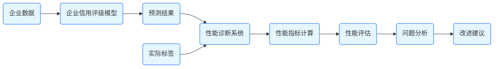

# 设计智能化的企业信用评级模型性能诊断系统

> 关键词：企业信用评级模型、性能诊断系统、智能化设计、数据挖掘、机器学习

> 摘要：本文旨在探讨如何设计智能化的企业信用评级模型性能诊断系统。随着企业信用评估在金融等领域的重要性日益凸显，确保信用评级模型的准确性和可靠性至关重要。该系统能够对企业信用评级模型的性能进行全面、深入的诊断，及时发现模型存在的问题并提供改进建议。文章将详细介绍系统的背景、核心概念、算法原理、数学模型、项目实战、实际应用场景、工具资源推荐等内容，最后对系统的未来发展趋势与挑战进行总结。

## 1. 背景介绍 
### 1.1 目的和范围
企业信用评级在金融市场中起着关键作用，它帮助金融机构评估企业的信用风险，从而做出合理的信贷决策。然而，现有的企业信用评级模型可能会受到多种因素的影响，如数据质量、模型结构等，导致模型性能不稳定。设计智能化的企业信用评级模型性能诊断系统的目的在于实时监测模型的性能，及时发现潜在问题，并提供针对性的解决方案，以提高模型的准确性和可靠性。

本系统的范围涵盖了对各种常见企业信用评级模型的性能诊断，包括但不限于逻辑回归模型、决策树模型、神经网络模型等。系统将对模型的预测准确性、稳定性、鲁棒性等多个性能指标进行评估。

### 1.2 预期读者
本文的预期读者包括金融行业的风险管理专家、数据科学家、信用评级机构的工作人员以及对企业信用评级和模型性能诊断感兴趣的研究人员。这些读者通常具备一定的统计学、机器学习和编程基础，希望通过本文了解如何设计和实现智能化的企业信用评级模型性能诊断系统。

### 1.3 文档结构概述
本文将按照以下结构进行组织：首先介绍系统的背景信息，包括目的、预期读者和文档结构概述；接着阐述核心概念与联系，包括企业信用评级模型和性能诊断系统的原理和架构；然后详细讲解核心算法原理和具体操作步骤，并结合Python源代码进行说明；随后介绍数学模型和公式，并举例说明；通过项目实战展示系统的实际开发过程，包括开发环境搭建、源代码实现和代码解读；接着探讨系统的实际应用场景；推荐相关的工具和资源；最后对系统的未来发展趋势与挑战进行总结，并提供常见问题与解答以及扩展阅读和参考资料。

### 1.4 术语表
#### 1.4.1 核心术语定义
- **企业信用评级模型**：用于评估企业信用风险的数学模型，通过对企业的财务数据、经营数据等多方面信息进行分析，给出企业的信用等级。
- **性能诊断系统**：对企业信用评级模型的性能进行监测、评估和分析的系统，旨在发现模型存在的问题并提供改进建议。
- **准确率**：模型预测正确的样本数占总样本数的比例，是衡量模型性能的重要指标之一。
- **召回率**：模型正确预测出的正样本数占实际正样本数的比例，反映了模型对正样本的识别能力。
- **F1值**：综合考虑准确率和召回率的指标，计算公式为 $F1 = 2\times\frac{准确率\times召回率}{准确率 + 召回率}$。

#### 1.4.2 相关概念解释
- **过拟合**：模型在训练数据上表现良好，但在测试数据上表现不佳的现象，通常是由于模型过于复杂，学习了训练数据中的噪声和异常值。
- **欠拟合**：模型在训练数据和测试数据上的表现都不理想的现象，通常是由于模型过于简单，无法捕捉数据中的复杂关系。
- **交叉验证**：一种评估模型性能的方法，将数据集分成多个子集，轮流使用不同的子集作为测试集，其余子集作为训练集，最后取平均值作为模型的性能指标。

#### 1.4.3 缩略词列表
- **ROC**：Receiver Operating Characteristic，受试者工作特征曲线，用于展示模型在不同阈值下的真阳性率和假阳性率之间的关系。
- **AUC**：Area Under the Curve，ROC曲线下的面积，是衡量模型性能的重要指标之一，AUC值越接近1，模型性能越好。
- **KNN**：K-Nearest Neighbors，K近邻算法，一种简单的机器学习算法，用于分类和回归任务。

## 2. 核心概念与联系 
### 2.1 企业信用评级模型原理
企业信用评级模型的核心是通过对企业的各种数据进行分析，挖掘出与企业信用风险相关的特征，并利用这些特征构建模型来预测企业的信用等级。常见的企业信用评级模型包括以下几种：

#### 2.1.1 逻辑回归模型
逻辑回归是一种广泛应用的分类算法，它通过对输入特征进行线性组合，然后使用逻辑函数将其映射到概率值，最后根据概率值进行分类。逻辑回归模型的优点是简单易懂、计算效率高，缺点是无法处理复杂的非线性关系。

#### 2.1.2 决策树模型
决策树是一种基于树结构进行决策的模型，它通过对数据的特征进行划分，构建出一棵决策树，每个内部节点表示一个特征上的测试，每个分支表示一个测试输出，每个叶节点表示一个类别或值。决策树模型的优点是可解释性强，能够直观地展示决策过程，缺点是容易过拟合。

#### 2.1.3 神经网络模型
神经网络是一种模仿人类神经系统的计算模型，它由多个神经元组成，通过对输入数据进行多层非线性变换，学习数据中的复杂模式。神经网络模型的优点是能够处理复杂的非线性关系，具有很强的学习能力，缺点是训练时间长、可解释性差。

### 2.2 性能诊断系统原理
性能诊断系统的主要功能是对企业信用评级模型的性能进行监测、评估和分析。系统通过收集模型的预测结果和实际标签，计算各种性能指标，如准确率、召回率、F1值等，并根据这些指标判断模型的性能是否良好。如果模型的性能出现问题，系统会进一步分析问题的原因，如过拟合、欠拟合等，并提供相应的改进建议。

### 2.3 核心概念架构示意图


该架构示意图展示了企业信用评级模型性能诊断系统的核心流程。企业数据首先输入到企业信用评级模型中，模型输出预测结果。性能诊断系统收集预测结果和实际标签，进行性能指标计算，然后对模型性能进行评估，分析可能存在的问题，并提供改进建议。

## 3. 核心算法原理 & 具体操作步骤 
### 3.1 性能指标计算算法
#### 3.1.1 准确率计算
准确率是指模型预测正确的样本数占总样本数的比例。其计算公式为：
$$准确率 = \frac{预测正确的样本数}{总样本数}$$

以下是使用Python实现准确率计算的代码：
```python
def accuracy_score(y_true, y_pred):
    correct = 0
    total = len(y_true)
    for i in range(total):
        if y_true[i] == y_pred[i]:
            correct += 1
    return correct / total

# 示例使用
y_true = [1, 0, 1, 0, 1]
y_pred = [1, 1, 1, 0, 1]
acc = accuracy_score(y_true, y_pred)
print(f"准确率: {acc}")
```

#### 3.1.2 召回率计算
召回率是指模型正确预测出的正样本数占实际正样本数的比例。其计算公式为：
$$召回率 = \frac{正确预测的正样本数}{实际正样本数}$$

以下是使用Python实现召回率计算的代码：
```python
def recall_score(y_true, y_pred):
    true_positives = 0
    actual_positives = 0
    for i in range(len(y_true)):
        if y_true[i] == 1:
            actual_positives += 1
            if y_pred[i] == 1:
                true_positives += 1
    if actual_positives == 0:
        return 0
    return true_positives / actual_positives

# 示例使用
y_true = [1, 0, 1, 0, 1]
y_pred = [1, 1, 1, 0, 1]
recall = recall_score(y_true, y_pred)
print(f"召回率: {recall}")
```

#### 3.1.3 F1值计算
F1值是综合考虑准确率和召回率的指标，其计算公式为：
$$F1 = 2\times\frac{准确率\times召回率}{准确率 + 召回率}$$

以下是使用Python实现F1值计算的代码：
```python
def f1_score(y_true, y_pred):
    acc = accuracy_score(y_true, y_pred)
    recall = recall_score(y_true, y_pred)
    if acc + recall == 0:
        return 0
    return 2 * (acc * recall) / (acc + recall)

# 示例使用
y_true = [1, 0, 1, 0, 1]
y_pred = [1, 1, 1, 0, 1]
f1 = f1_score(y_true, y_pred)
print(f"F1值: {f1}")
```

### 3.2 具体操作步骤
#### 3.2.1 数据收集
首先，需要收集企业的相关数据，包括财务数据、经营数据等，以及对应的实际信用等级标签。这些数据将用于训练企业信用评级模型和评估模型的性能。

#### 3.2.2 模型训练
选择合适的企业信用评级模型，如逻辑回归、决策树或神经网络等，使用收集到的数据进行模型训练。

#### 3.2.3 性能指标计算
使用训练好的模型对测试数据进行预测，得到预测结果。然后，将预测结果与实际标签进行比较，计算各种性能指标，如准确率、召回率、F1值等。

#### 3.2.4 性能评估与问题分析
根据计算得到的性能指标，评估模型的性能。如果模型的性能不理想，进一步分析问题的原因，如过拟合、欠拟合等。

#### 3.2.5 改进建议生成
根据问题分析的结果，生成相应的改进建议，如调整模型参数、增加训练数据、采用正则化方法等。

## 4. 数学模型和公式 & 详细讲解 & 举例说明 
### 4.1 逻辑回归模型数学原理
逻辑回归模型的核心是逻辑函数，也称为Sigmoid函数，其定义为：
$$\sigma(z)=\frac{1}{1 + e^{-z}}$$
其中，$z$ 是输入特征的线性组合，即 $z = w_0 + w_1x_1 + w_2x_2 + \cdots + w_nx_n$，$w_i$ 是模型的权重，$x_i$ 是输入特征。

逻辑回归模型通过对输入特征进行线性组合，然后使用逻辑函数将其映射到概率值，最后根据概率值进行分类。假设输入特征为 $x$，模型预测为正类的概率为 $P(y = 1|x)$，则有：
$$P(y = 1|x)=\sigma(w^Tx + b)$$
其中，$w$ 是权重向量，$b$ 是偏置项。

逻辑回归模型的损失函数通常使用对数损失函数，其定义为：
$$L(w,b)=-\frac{1}{N}\sum_{i = 1}^{N}[y_i\log(P(y = 1|x_i))+(1 - y_i)\log(1 - P(y = 1|x_i))]$$
其中，$N$ 是样本数，$y_i$ 是第 $i$ 个样本的真实标签。

### 4.2 决策树模型数学原理
决策树模型通过对数据的特征进行划分，构建出一棵决策树。在每个内部节点，选择一个最优的特征进行划分，使得划分后的子节点的纯度尽可能高。常用的纯度度量指标包括信息增益、信息增益比和基尼指数等。

#### 4.2.1 信息增益
信息增益是指划分前后数据集的信息熵的减少量。信息熵是衡量数据集不确定性的指标，其定义为：
$$H(D)=-\sum_{k = 1}^{K}p_k\log_2p_k$$
其中，$D$ 是数据集，$K$ 是类别数，$p_k$ 是第 $k$ 类样本在数据集中所占的比例。

假设使用特征 $A$ 对数据集 $D$ 进行划分，得到 $V$ 个子数据集 $D_1,D_2,\cdots,D_V$，则信息增益的计算公式为：
$$Gain(D,A)=H(D)-\sum_{v = 1}^{V}\frac{|D_v|}{|D|}H(D_v)$$
其中，$|D|$ 是数据集 $D$ 的样本数，$|D_v|$ 是子数据集 $D_v$ 的样本数。

#### 4.2.2 基尼指数
基尼指数是衡量数据集不纯度的指标，其定义为：
$$Gini(D)=1-\sum_{k = 1}^{K}p_k^2$$
假设使用特征 $A$ 对数据集 $D$ 进行划分，得到 $V$ 个子数据集 $D_1,D_2,\cdots,D_V$，则基尼指数的计算公式为：
$$Gini(D,A)=\sum_{v = 1}^{V}\frac{|D_v|}{|D|}Gini(D_v)$$

### 4.3 神经网络模型数学原理
神经网络模型由多个神经元组成，每个神经元接收输入信号，进行加权求和，然后通过激活函数进行非线性变换，输出结果。常见的激活函数包括Sigmoid函数、ReLU函数等。

假设神经网络的输入层有 $n$ 个神经元，隐藏层有 $m$ 个神经元，输出层有 $k$ 个神经元。第 $j$ 个隐藏层神经元的输入为：
$$z_j=\sum_{i = 1}^{n}w_{ji}x_i + b_j$$
其中，$w_{ji}$ 是输入层第 $i$ 个神经元到隐藏层第 $j$ 个神经元的权重，$b_j$ 是隐藏层第 $j$ 个神经元的偏置项，$x_i$ 是输入层第 $i$ 个神经元的输入。

隐藏层第 $j$ 个神经元的输出为：
$$a_j = f(z_j)$$
其中，$f$ 是激活函数。

输出层第 $l$ 个神经元的输入为：
$$z_l=\sum_{j = 1}^{m}w_{lj}a_j + b_l$$
其中，$w_{lj}$ 是隐藏层第 $j$ 个神经元到输出层第 $l$ 个神经元的权重，$b_l$ 是输出层第 $l$ 个神经元的偏置项。

输出层第 $l$ 个神经元的输出为：
$$y_l = f(z_l)$$

神经网络模型的训练通常使用反向传播算法，通过不断调整权重和偏置项，使得模型的损失函数最小化。

### 4.4 举例说明
假设我们有一个简单的企业信用评级数据集，包含两个特征：资产负债率和净利润增长率，以及一个信用等级标签（0表示低信用，1表示高信用）。我们使用逻辑回归模型进行信用评级。

#### 4.4.1 数据准备
```python
import numpy as np

# 特征数据
X = np.array([[0.5, 0.1], [0.3, 0.2], [0.7, 0.05], [0.2, 0.3]])
# 标签数据
y = np.array([0, 1, 0, 1])
```

#### 4.4.2 模型训练
```python
from sklearn.linear_model import LogisticRegression

# 创建逻辑回归模型
model = LogisticRegression()
# 模型训练
model.fit(X, y)
```

#### 4.4.3 模型预测
```python
# 预测新数据
new_X = np.array([[0.4, 0.15]])
prediction = model.predict(new_X)
print(f"预测结果: {prediction}")
```

## 5. 项目实战：代码实际案例和详细解释说明 
### 5.1  开发环境搭建
#### 5.1.1 安装Python
首先，需要安装Python编程语言。建议使用Python 3.7及以上版本，可以从Python官方网站（https://www.python.org/downloads/）下载并安装。

#### 5.1.2 安装必要的库
使用以下命令安装必要的Python库：
```sh
pip install numpy pandas scikit-learn matplotlib
```
- **numpy**：用于进行数值计算。
- **pandas**：用于数据处理和分析。
- **scikit-learn**：提供了丰富的机器学习算法和工具。
- **matplotlib**：用于数据可视化。

### 5.2  源代码详细实现和代码解读
#### 5.2.1 数据加载与预处理
```python
import pandas as pd
from sklearn.model_selection import train_test_split
from sklearn.preprocessing import StandardScaler

# 加载数据
data = pd.read_csv('credit_rating_data.csv')

# 分离特征和标签
X = data.drop('credit_rating', axis=1)
y = data['credit_rating']

# 数据划分
X_train, X_test, y_train, y_test = train_test_split(X, y, test_size=0.2, random_state=42)

# 数据标准化
scaler = StandardScaler()
X_train = scaler.fit_transform(X_train)
X_test = scaler.transform(X_test)
```
代码解读：
- 使用`pandas`库的`read_csv`函数加载企业信用评级数据集。
- 使用`train_test_split`函数将数据集划分为训练集和测试集，测试集占比为20%。
- 使用`StandardScaler`对特征数据进行标准化处理，使得数据具有零均值和单位方差。

#### 5.2.2 模型训练与预测
```python
from sklearn.linear_model import LogisticRegression
from sklearn.metrics import accuracy_score, recall_score, f1_score

# 创建逻辑回归模型
model = LogisticRegression()

# 模型训练
model.fit(X_train, y_train)

# 模型预测
y_pred = model.predict(X_test)

# 性能指标计算
acc = accuracy_score(y_test, y_pred)
recall = recall_score(y_test, y_pred)
f1 = f1_score(y_test, y_pred)

print(f"准确率: {acc}")
print(f"召回率: {recall}")
print(f"F1值: {f1}")
```
代码解读：
- 使用`LogisticRegression`创建逻辑回归模型。
- 使用训练集数据对模型进行训练。
- 使用测试集数据进行模型预测。
- 使用`accuracy_score`、`recall_score`和`f1_score`计算模型的准确率、召回率和F1值。

#### 5.2.3 性能诊断系统实现
```python
def performance_diagnosis(y_true, y_pred):
    acc = accuracy_score(y_true, y_pred)
    recall = recall_score(y_true, y_pred)
    f1 = f1_score(y_true, y_pred)
    
    print(f"准确率: {acc}")
    print(f"召回率: {recall}")
    print(f"F1值: {f1}")
    
    if acc < 0.7:
        print("模型准确率较低，可能存在欠拟合或数据质量问题。")
    if recall < 0.7:
        print("模型召回率较低，可能对正样本的识别能力不足。")
    if f1 < 0.7:
        print("模型F1值较低，综合性能有待提高。")

# 调用性能诊断系统
performance_diagnosis(y_test, y_pred)
```
代码解读：
- 定义`performance_diagnosis`函数，用于对模型的性能进行诊断。
- 在函数内部，计算模型的准确率、召回率和F1值，并打印输出。
- 根据性能指标的阈值（这里设定为0.7），判断模型是否存在问题，并给出相应的提示信息。

### 5.3  代码解读与分析
通过以上代码，我们实现了一个简单的企业信用评级模型性能诊断系统。首先，对数据进行加载和预处理，确保数据的质量和可用性。然后，使用逻辑回归模型进行训练和预测，并计算模型的性能指标。最后，通过性能诊断系统对模型的性能进行评估和分析，及时发现模型存在的问题。

在实际应用中，可以根据具体需求对代码进行扩展和优化，例如选择不同的机器学习模型、调整模型参数、增加更多的性能指标等。

## 6. 实际应用场景 
### 6.1 金融机构信贷决策
金融机构在进行信贷决策时，需要准确评估企业的信用风险。智能化的企业信用评级模型性能诊断系统可以帮助金融机构实时监测信用评级模型的性能，确保模型的准确性和可靠性。当模型性能出现问题时，系统能够及时发出警报，并提供改进建议，从而降低金融机构的信贷风险。

### 6.2 信用评级机构评级业务
信用评级机构负责对企业的信用等级进行评估和发布。性能诊断系统可以帮助信用评级机构提高评级的质量和效率。通过对评级模型的性能进行诊断，及时发现模型的不足之处，进行优化和改进，从而提高评级结果的可信度和权威性。

### 6.3 企业风险管理
企业自身也可以利用该系统对自身的信用状况进行评估和管理。通过建立适合企业自身的信用评级模型，并使用性能诊断系统对模型进行监测和优化，企业可以及时发现潜在的信用风险，采取相应的措施进行防范和化解。

## 7. 工具和资源推荐
### 7.1 学习资源推荐
#### 7.1.1 书籍推荐
- 《Python机器学习》：介绍了使用Python进行机器学习的基础知识和实践技巧，包括数据预处理、模型选择、模型评估等内容。
- 《统计学习方法》：系统地介绍了机器学习的基本概念、算法和理论，是机器学习领域的经典教材。
- 《信用评级原理与实务》：详细介绍了企业信用评级的原理、方法和实践，对理解企业信用评级模型有很大帮助。

#### 7.1.2 在线课程
- Coursera上的“机器学习”课程：由斯坦福大学教授Andrew Ng讲授，是机器学习领域的经典在线课程，涵盖了机器学习的基本概念、算法和应用。
- edX上的“数据科学与机器学习微硕士学位课程”：提供了全面的数据科学和机器学习知识体系，包括数据处理、机器学习算法、深度学习等内容。

#### 7.1.3 技术博客和网站
- Medium：是一个技术博客平台，上面有很多关于机器学习、数据科学和企业信用评级的优质文章。
- Kaggle：是一个数据科学竞赛平台，上面有很多关于企业信用评级的数据集和竞赛项目，可以通过参与竞赛来提高自己的实践能力。

### 7.2 开发工具框架推荐
#### 7.2.1 IDE和编辑器
- PyCharm：是一款专门为Python开发设计的集成开发环境，具有代码编辑、调试、版本控制等功能，适合专业的Python开发者使用。
- Jupyter Notebook：是一个交互式的开发环境，支持Python、R等多种编程语言，适合数据科学家和机器学习工程师进行数据探索和模型开发。

#### 7.2.2 调试和性能分析工具
- Py-Spy：是一个Python性能分析工具，可以帮助开发者找出Python代码中的性能瓶颈。
- TensorBoard：是TensorFlow提供的一个可视化工具，可以用于可视化神经网络模型的训练过程和性能指标。

#### 7.2.3 相关框架和库
- scikit-learn：是一个简单易用的机器学习库，提供了丰富的机器学习算法和工具，适合初学者和快速开发。
- TensorFlow：是一个开源的深度学习框架，广泛应用于图像识别、自然语言处理等领域，具有强大的计算能力和灵活性。
- PyTorch：是另一个流行的深度学习框架，具有简洁的API和动态图机制，适合研究人员和开发者进行深度学习模型的开发和实验。

### 7.3 相关论文著作推荐
#### 7.3.1 经典论文
- 《Credit Risk Assessment Using Neural Networks》：介绍了使用神经网络进行信用风险评估的方法和实验结果。
- 《A Comparative Analysis of Logistic Regression and Decision Trees for Credit Scoring》：比较了逻辑回归和决策树在信用评分中的应用效果。

#### 7.3.2 最新研究成果
- 关注顶级学术会议如KDD（Knowledge Discovery and Data Mining）、ICML（International Conference on Machine Learning）等上发表的关于企业信用评级和模型性能诊断的最新研究成果。
- 查阅相关学术期刊如《Journal of Financial Economics》、《Management Science》等上的论文。

#### 7.3.3 应用案例分析
- 一些金融机构和信用评级机构会发布关于企业信用评级模型应用的案例分析报告，可以从中学习到实际应用中的经验和技巧。

## 8. 总结：未来发展趋势与挑战
### 8.1 未来发展趋势
#### 8.1.1 智能化与自动化
未来，企业信用评级模型性能诊断系统将更加智能化和自动化。系统将能够自动收集和分析数据，自动选择合适的模型和算法，自动进行模型训练和优化，减少人工干预，提高工作效率。

#### 8.1.2 融合多源数据
随着大数据技术的发展，企业信用评级将不再局限于传统的财务数据和经营数据，而是会融合更多的多源数据，如社交媒体数据、物联网数据等。性能诊断系统需要能够适应这种多源数据的特点，对融合后的模型进行有效的性能诊断。

#### 8.1.3 可解释性增强
由于企业信用评级结果对金融决策具有重要影响，模型的可解释性变得越来越重要。未来的性能诊断系统将更加注重对模型可解释性的评估和分析，帮助用户理解模型的决策过程和依据。

### 8.2 挑战
#### 8.2.1 数据质量问题
企业信用评级模型的性能高度依赖于数据的质量。然而，实际数据中往往存在噪声、缺失值、异常值等问题，这些问题会影响模型的准确性和可靠性。性能诊断系统需要能够有效地处理数据质量问题，确保模型的性能不受影响。

#### 8.2.2 模型复杂度增加
随着机器学习和深度学习技术的不断发展，企业信用评级模型的复杂度也在不断增加。复杂的模型虽然具有更强的学习能力，但也增加了模型性能诊断的难度。性能诊断系统需要能够适应模型复杂度的增加，提供有效的诊断方法和工具。

#### 8.2.3 安全与隐私问题
企业信用评级涉及到大量的敏感信息，如企业财务数据、客户信息等。在数据收集、存储和处理过程中，需要确保数据的安全和隐私。性能诊断系统需要具备相应的安全机制，防止数据泄露和滥用。

## 9. 附录：常见问题与解答
### 9.1 如何选择合适的企业信用评级模型？
选择合适的企业信用评级模型需要考虑多个因素，如数据特点、模型复杂度、可解释性等。如果数据量较小且特征之间的关系较为简单，可以选择逻辑回归等简单模型；如果数据量较大且特征之间存在复杂的非线性关系，可以选择神经网络等复杂模型。同时，还需要根据实际需求权衡模型的可解释性和准确性。

### 9.2 性能诊断系统的性能指标阈值如何确定？
性能指标阈值的确定需要根据具体的应用场景和业务需求来确定。一般来说，可以通过历史数据和实验来确定一个合理的阈值范围。例如，在金融机构的信贷决策中，可以根据风险承受能力和业务目标来确定准确率、召回率等指标的阈值。

### 9.3 如何处理模型过拟合和欠拟合问题？
处理模型过拟合问题可以采用以下方法：增加训练数据、采用正则化方法（如L1和L2正则化）、减少模型复杂度等。处理模型欠拟合问题可以采用以下方法：增加模型复杂度、选择更合适的模型、对数据进行特征工程等。

## 10. 扩展阅读 & 参考资料
### 10.1 扩展阅读
- 《深度学习》：由Ian Goodfellow、Yoshua Bengio和Aaron Courville所著，深入介绍了深度学习的原理、算法和应用。
- 《大数据时代：生活、工作与思维的大变革》：介绍了大数据时代的特点和影响，以及如何利用大数据进行决策和创新。

### 10.2 参考资料
- 《企业信用评级理论与实务》：提供了企业信用评级的详细理论和实践方法。
- 《机器学习实战》：通过实际案例介绍了机器学习的应用和实现。

作者：AI天才研究院/AI Genius Institute & 禅与计算机程序设计艺术 /Zen And The Art of Computer Programming