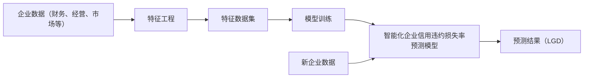

# 设计智能化的企业信用违约损失率预测模型

> 关键词：企业信用违约损失率、智能化预测模型、机器学习、金融风险评估、数据分析

> 摘要：本文旨在深入探讨如何设计智能化的企业信用违约损失率预测模型。首先介绍了该模型设计的背景、目的、适用读者等信息，接着阐述了与企业信用违约损失率相关的核心概念及其联系，详细讲解了核心算法原理并给出 Python 代码示例，同时对涉及的数学模型和公式进行了推导与举例说明。通过项目实战部分，展示了模型开发环境搭建、源代码实现及解读。此外，还列举了模型的实际应用场景，推荐了相关的学习资源、开发工具框架以及论文著作。最后对未来发展趋势与挑战进行了总结，并提供了常见问题解答和扩展阅读参考资料。

## 1. 背景介绍 
### 1.1 目的和范围
在金融领域，准确预测企业信用违约损失率对于银行、投资机构等金融主体至关重要。信用违约损失率是指当企业违约时，债权人可能遭受的损失比例。设计智能化的企业信用违约损失率预测模型的目的在于帮助金融机构更精准地评估信用风险，合理配置资本，优化信贷决策，降低潜在的信用损失。

本模型的适用范围涵盖了各类金融机构，如商业银行、投资银行、保险公司等在进行企业信贷业务、债券投资、信用风险管理等场景下对企业信用违约损失率的预测。同时，也可用于监管机构对金融市场整体信用风险的监测和评估。

### 1.2 预期读者
本文预期读者主要包括金融领域的从业者，如风险管理专家、信贷分析师、投资经理等，他们可以借助本模型提升自身的信用风险评估能力和决策水平。此外，对人工智能在金融领域应用感兴趣的技术人员，如数据科学家、机器学习工程师等，也可以通过本文了解如何将先进的算法应用于企业信用违约损失率预测这一具体场景。同时，相关专业的高校师生也可以将本文作为学习和研究的参考资料。

### 1.3 文档结构概述
本文将按照以下结构进行阐述：首先介绍与企业信用违约损失率预测相关的核心概念及其相互联系，包括关键术语的定义和概念解释；接着详细讲解用于构建预测模型的核心算法原理，并给出具体的 Python 代码实现步骤；然后介绍模型涉及的数学模型和公式，并通过实际例子进行说明；之后通过项目实战部分，展示从开发环境搭建到源代码详细实现及解读的全过程；再列举该模型在实际中的应用场景；推荐相关的学习资源、开发工具框架以及论文著作；最后对未来发展趋势与挑战进行总结，并提供常见问题解答和扩展阅读参考资料。

### 1.4 术语表
#### 1.4.1 核心术语定义
- **企业信用违约损失率（Loss Given Default, LGD）**：指在企业发生违约事件后，债权人实际遭受的损失占债权总额的比例。它反映了违约发生时债权人可能面临的损失程度。
- **违约概率（Probability of Default, PD）**：指企业在一定期限内发生违约的可能性，是评估企业信用风险的重要指标之一。
- **风险暴露（Exposure at Default, EAD）**：指在企业违约时，债权人面临的风险敞口金额，即债权人可能遭受损失的最大金额。
- **信用评分**：是一种基于企业的财务状况、经营能力、信用历史等多方面信息，通过特定的算法对企业信用状况进行量化评估的数值。

#### 1.4.2 相关概念解释
- **信用风险**：指由于借款人或交易对手未能履行合同义务而导致债权人遭受损失的可能性。企业信用违约损失率是信用风险的一个重要量化指标。
- **机器学习模型**：是一类基于数据进行学习和预测的算法模型，通过对大量历史数据的学习，挖掘数据中的规律和模式，从而对未来的事件进行预测。在企业信用违约损失率预测中，常用的机器学习模型包括决策树、随机森林、支持向量机、神经网络等。
- **特征工程**：是指从原始数据中提取和选择对模型预测有帮助的特征的过程。在企业信用违约损失率预测中，特征工程包括对企业财务数据、经营数据、行业数据等进行清洗、转换、组合等操作，以提高模型的预测性能。

#### 1.4.3 缩略词列表
- LGD：Loss Given Default（企业信用违约损失率）
- PD：Probability of Default（违约概率）
- EAD：Exposure at Default（风险暴露）

## 2. 核心概念与联系 

### 核心概念原理
企业信用违约损失率（LGD）的预测涉及多个核心概念，这些概念相互关联，共同构成了信用风险评估的体系。

违约概率（PD）是预测企业是否会违约的概率，它是基于企业的历史数据、财务状况、市场环境等因素进行评估的。风险暴露（EAD）则表示在企业违约时，债权人面临的潜在损失金额。而 LGD 则是在企业违约的情况下，债权人实际遭受的损失占 EAD 的比例。

三者之间的关系可以用以下公式表示：
$$预期损失（EL） = PD \times EAD \times LGD$$

这个公式表明，预期损失是由违约概率、风险暴露和违约损失率共同决定的。因此，准确预测 LGD 对于合理评估企业信用风险和预期损失至关重要。

### 架构的文本示意图
```plaintext
企业数据（财务、经营、市场等）
    |
    | 特征工程
    v
特征数据集
    |
    | 模型训练
    v
智能化企业信用违约损失率预测模型
    |
    | 输入新企业数据
    v
预测结果（LGD）
```

### Mermaid 流程图


## 3. 核心算法原理 & 具体操作步骤 

### 核心算法原理
在构建智能化的企业信用违约损失率预测模型时，我们可以使用多种机器学习算法，这里以随机森林算法为例进行详细讲解。

随机森林是一种集成学习算法，它由多个决策树组成。每个决策树在训练时会随机选择一部分特征和样本进行训练，最后通过对多个决策树的预测结果进行综合（如投票或平均）来得到最终的预测结果。

随机森林算法的优点包括：
- 能够处理高维数据，不需要进行特征选择。
- 具有较好的泛化能力，能够有效避免过拟合。
- 可以给出特征的重要性排序，帮助我们理解哪些特征对预测结果影响较大。

### 具体操作步骤
以下是使用 Python 实现基于随机森林算法的企业信用违约损失率预测模型的具体步骤：

```python
import pandas as pd
from sklearn.ensemble import RandomForestRegressor
from sklearn.model_selection import train_test_split
from sklearn.metrics import mean_squared_error

# 步骤 1：数据加载
# 假设我们有一个包含企业特征和 LGD 标签的 CSV 文件
data = pd.read_csv('enterprise_credit_data.csv')

# 步骤 2：数据预处理
# 分离特征和标签
X = data.drop('LGD', axis=1)
y = data['LGD']

# 划分训练集和测试集
X_train, X_test, y_train, y_test = train_test_split(X, y, test_size=0.2, random_state=42)

# 步骤 3：模型训练
# 创建随机森林回归器
rf = RandomForestRegressor(n_estimators=100, random_state=42)

# 训练模型
rf.fit(X_train, y_train)

# 步骤 4：模型预测
# 在测试集上进行预测
y_pred = rf.predict(X_test)

# 步骤 5：模型评估
# 计算均方误差
mse = mean_squared_error(y_test, y_pred)
print(f"均方误差: {mse}")
```

### 代码解释
1. **数据加载**：使用 `pandas` 库的 `read_csv` 函数加载包含企业特征和 LGD 标签的 CSV 文件。
2. **数据预处理**：使用 `drop` 方法分离特征和标签，然后使用 `train_test_split` 函数将数据集划分为训练集和测试集，其中测试集占比为 20%。
3. **模型训练**：创建一个随机森林回归器对象，设置决策树的数量为 100，并使用训练集数据对模型进行训练。
4. **模型预测**：使用训练好的模型对测试集数据进行预测。
5. **模型评估**：使用 `mean_squared_error` 函数计算预测结果与真实标签之间的均方误差，评估模型的性能。

## 4. 数学模型和公式 & 详细讲解 & 举例说明 

### 随机森林算法的数学模型
随机森林算法的核心是决策树，每个决策树的构建过程可以看作是一个递归的二叉树划分过程。

设数据集 $D = \{(x_1, y_1), (x_2, y_2), \cdots, (x_n, y_n)\}$，其中 $x_i$ 是第 $i$ 个样本的特征向量，$y_i$ 是对应的标签。

在构建决策树时，对于每个内部节点，我们需要选择一个最优的特征和划分点，使得划分后的子集的纯度最高。常用的纯度度量指标有基尼不纯度（Gini impurity）和信息增益（Information gain）。

#### 基尼不纯度
基尼不纯度是一种衡量数据集纯度的指标，其计算公式为：
$$Gini(D) = 1 - \sum_{k=1}^{K} p_k^2$$
其中，$K$ 是类别数，$p_k$ 是数据集中属于第 $k$ 类的样本比例。

在划分数据集时，我们希望划分后的子集的基尼不纯度尽可能小。假设我们选择特征 $A$ 和划分点 $a$ 将数据集 $D$ 划分为 $D_1$ 和 $D_2$，则划分后的基尼不纯度为：
$$Gini_{split}(D, A, a) = \frac{|D_1|}{|D|}Gini(D_1) + \frac{|D_2|}{|D|}Gini(D_2)$$
我们需要选择使得 $Gini_{split}(D, A, a)$ 最小的特征 $A$ 和划分点 $a$。

#### 信息增益
信息增益是另一种衡量划分效果的指标，它基于信息熵的概念。信息熵的计算公式为：
$$Entropy(D) = -\sum_{k=1}^{K} p_k \log_2 p_k$$
信息增益的计算公式为：
$$IG(D, A) = Entropy(D) - \sum_{v=1}^{V} \frac{|D^v|}{|D|}Entropy(D^v)$$
其中，$V$ 是特征 $A$ 的取值个数，$D^v$ 是特征 $A$ 取值为 $v$ 的样本子集。

我们需要选择使得信息增益最大的特征 $A$ 进行划分。

### 随机森林的预测公式
随机森林的预测结果是由多个决策树的预测结果综合得到的。对于回归问题，通常采用平均值作为最终的预测结果。

设随机森林中有 $T$ 个决策树，第 $t$ 个决策树对样本 $x$ 的预测结果为 $\hat{y}_t(x)$，则随机森林对样本 $x$ 的预测结果为：
$$\hat{y}(x) = \frac{1}{T} \sum_{t=1}^{T} \hat{y}_t(x)$$

### 举例说明
假设我们有一个简单的数据集，包含 5 个样本，每个样本有 2 个特征 $x_1$ 和 $x_2$，以及对应的 LGD 标签 $y$：

| $x_1$ | $x_2$ | $y$ |
| --- | --- | --- |
| 1 | 2 | 0.2 |
| 2 | 3 | 0.3 |
| 3 | 4 | 0.4 |
| 4 | 5 | 0.5 |
| 5 | 6 | 0.6 |

我们使用随机森林算法对这个数据集进行训练和预测。假设随机森林中有 3 个决策树，对一个新样本 $x = [3, 4]$ 的预测结果分别为 $\hat{y}_1(x) = 0.35$，$\hat{y}_2(x) = 0.42$，$\hat{y}_3(x) = 0.38$，则随机森林对该样本的预测结果为：
$$\hat{y}(x) = \frac{0.35 + 0.42 + 0.38}{3} = 0.383$$

## 5. 项目实战：代码实际案例和详细解释说明 

### 5.1  开发环境搭建
#### 操作系统
建议使用 Linux 或 macOS 系统，因为这些系统在数据处理和机器学习开发方面具有更好的兼容性和性能。如果使用 Windows 系统，也可以通过安装 Anaconda 来搭建开发环境。

#### 安装 Python
首先需要安装 Python 3.7 或更高版本。可以从 Python 官方网站（https://www.python.org/downloads/）下载并安装。

#### 安装依赖库
使用 `pip` 或 `conda` 安装所需的依赖库，主要包括 `pandas`、`numpy`、`scikit-learn` 等。以下是使用 `pip` 安装的命令：
```bash
pip install pandas numpy scikit-learn
```

### 5.2  源代码详细实现和代码解读
```python
import pandas as pd
import numpy as np
from sklearn.ensemble import RandomForestRegressor
from sklearn.model_selection import train_test_split
from sklearn.metrics import mean_squared_error, r2_score
from sklearn.preprocessing import StandardScaler

# 步骤 1：数据加载
data = pd.read_csv('enterprise_credit_data.csv')

# 步骤 2：数据预处理
# 检查缺失值
print(data.isnull().sum())

# 处理缺失值，这里简单地使用均值填充
data = data.fillna(data.mean())

# 分离特征和标签
X = data.drop('LGD', axis=1)
y = data['LGD']

# 特征标准化
scaler = StandardScaler()
X = scaler.fit_transform(X)

# 划分训练集和测试集
X_train, X_test, y_train, y_test = train_test_split(X, y, test_size=0.2, random_state=42)

# 步骤 3：模型训练
# 创建随机森林回归器
rf = RandomForestRegressor(n_estimators=100, random_state=42)

# 训练模型
rf.fit(X_train, y_train)

# 步骤 4：模型预测
# 在测试集上进行预测
y_pred = rf.predict(X_test)

# 步骤 5：模型评估
# 计算均方误差
mse = mean_squared_error(y_test, y_pred)
# 计算决定系数
r2 = r2_score(y_test, y_pred)

print(f"均方误差: {mse}")
print(f"决定系数: {r2}")
```

### 代码解读与分析
1. **数据加载**：使用 `pandas` 的 `read_csv` 函数加载包含企业信用数据的 CSV 文件。
2. **数据预处理**：
    - 检查数据集中的缺失值，并使用 `fillna` 方法用均值填充缺失值。
    - 分离特征和标签，将 `LGD` 列作为标签，其余列作为特征。
    - 使用 `StandardScaler` 对特征进行标准化处理，使得特征具有零均值和单位方差，有助于提高模型的训练效果。
    - 使用 `train_test_split` 函数将数据集划分为训练集和测试集，测试集占比为 20%。
3. **模型训练**：创建一个随机森林回归器对象，设置决策树的数量为 100，并使用训练集数据对模型进行训练。
4. **模型预测**：使用训练好的模型对测试集数据进行预测。
5. **模型评估**：使用 `mean_squared_error` 函数计算预测结果与真实标签之间的均方误差，使用 `r2_score` 函数计算决定系数，评估模型的性能。均方误差越小，决定系数越接近 1，说明模型的预测性能越好。

## 6. 实际应用场景 
### 商业银行信贷业务
商业银行在发放企业贷款时，需要评估企业的信用风险，确定合理的贷款利率和贷款额度。智能化的企业信用违约损失率预测模型可以帮助银行更准确地评估企业违约时的损失情况，从而制定更加科学的信贷政策。例如，对于信用违约损失率较高的企业，银行可以提高贷款利率或降低贷款额度，以降低潜在的损失。

### 债券投资
在债券投资领域，投资者需要评估债券发行人的信用风险，以确定投资的安全性和收益性。通过使用企业信用违约损失率预测模型，投资者可以更好地了解债券发行人违约时的损失程度，从而做出更加明智的投资决策。例如，对于信用违约损失率较高的债券，投资者可以要求更高的收益率作为补偿。

### 信用风险管理
金融机构需要对整体的信用风险进行管理和监控，以确保自身的稳健运营。智能化的企业信用违约损失率预测模型可以作为信用风险管理体系的重要组成部分，帮助金融机构及时发现潜在的信用风险，采取相应的风险控制措施。例如，当模型预测某些企业的信用违约损失率大幅上升时，金融机构可以提前调整投资组合或增加风险准备金。

### 监管机构监测
监管机构需要对金融市场的整体信用风险进行监测和评估，以维护金融市场的稳定。企业信用违约损失率预测模型可以为监管机构提供重要的参考依据，帮助监管机构及时发现系统性信用风险，制定相应的监管政策。例如，当模型显示整个行业的企业信用违约损失率普遍上升时，监管机构可以加强对该行业的监管力度。

## 7. 工具和资源推荐
### 7.1 学习资源推荐
#### 7.1.1 书籍推荐
- 《Python 机器学习》（Sebastian Raschka 著）：这本书详细介绍了 Python 在机器学习领域的应用，包括数据预处理、模型选择、算法实现等方面的内容，适合初学者入门。
- 《机器学习》（周志华著）：这本书是机器学习领域的经典教材，全面介绍了机器学习的基本概念、算法和应用，内容深入浅出，适合有一定编程基础的读者深入学习。
- 《信用风险分析与管理》（Michel Crouhy 等著）：这本书专注于信用风险领域的研究，详细介绍了信用风险评估、度量和管理的方法和技术，对于理解企业信用违约损失率预测模型的应用场景和原理有很大帮助。

#### 7.1.2 在线课程
- Coursera 上的“机器学习”课程（Andrew Ng 教授）：这是一门非常经典的机器学习在线课程，通过视频讲解、编程作业等方式，帮助学习者系统地掌握机器学习的基本概念和算法。
- edX 上的“数据科学与机器学习微硕士学位课程”：该课程涵盖了数据科学和机器学习的多个方面，包括数据处理、机器学习算法、深度学习等，适合有一定基础的学习者深入学习。
- 中国大学 MOOC 上的“金融风险管理”课程：该课程由国内知名高校的教授授课，介绍了金融风险管理的基本理论和方法，包括信用风险、市场风险、操作风险等方面的内容，对于理解企业信用违约损失率预测模型在金融风险管理中的应用有很大帮助。

#### 7.1.3 技术博客和网站
- Medium：这是一个技术博客平台，上面有很多关于机器学习、数据科学和金融科技的优质文章，可以帮助学习者了解最新的技术动态和应用案例。
- Kaggle：这是一个数据科学竞赛平台，上面有很多关于信用风险评估、违约预测等方面的竞赛项目和数据集，学习者可以通过参与竞赛和学习他人的解决方案来提高自己的实践能力。
- 金融界网站：该网站提供了丰富的金融市场信息和研究报告，对于了解金融行业的发展动态和信用风险状况有很大帮助。

### 7.2 开发工具框架推荐
#### 7.2.1 IDE和编辑器
- PyCharm：这是一款专门为 Python 开发设计的集成开发环境（IDE），具有代码编辑、调试、版本控制等功能，适合开发大型的 Python 项目。
- Jupyter Notebook：这是一个交互式的开发环境，支持 Python、R 等多种编程语言，适合进行数据探索、模型开发和实验验证等工作。
- Visual Studio Code：这是一款轻量级的代码编辑器，支持多种编程语言和插件扩展，具有丰富的功能和良好的用户体验，适合初学者和快速开发。

#### 7.2.2 调试和性能分析工具
- Py-Spy：这是一个 Python 性能分析工具，可以实时监控 Python 程序的运行状态和性能瓶颈，帮助开发者优化代码性能。
- TensorBoard：这是一个用于深度学习模型可视化和调试的工具，可以帮助开发者直观地了解模型的训练过程和性能指标。
- cProfile：这是 Python 内置的性能分析模块，可以统计 Python 程序中各个函数的执行时间和调用次数，帮助开发者找出性能瓶颈。

#### 7.2.3 相关框架和库
- Scikit-learn：这是一个开源的机器学习库，提供了丰富的机器学习算法和工具，包括分类、回归、聚类、降维等方面的内容，适合快速开发和实验验证。
- TensorFlow：这是一个开源的深度学习框架，支持多种深度学习模型和算法，包括神经网络、卷积神经网络、循环神经网络等，适合开发复杂的深度学习模型。
- PyTorch：这是另一个开源的深度学习框架，具有简洁易用的接口和良好的性能，适合研究和开发深度学习模型。

### 7.3 相关论文著作推荐
#### 7.3.1 经典论文
- Altman, E. I. (1968). Financial ratios, discriminant analysis and the prediction of corporate bankruptcy. The Journal of Finance, 23(4), 589-609. 这篇论文提出了著名的 Z-score 模型，用于预测企业的破产风险，是信用风险评估领域的经典之作。
- Moody's KMV. (2002). LossCalc: Moody's model for predicting loss given default. 这篇论文介绍了 Moody's KMV 公司开发的 LossCalc 模型，用于预测企业信用违约损失率，是该领域的重要研究成果。

#### 7.3.2 最新研究成果
- Gu, S., Kelly, B., & Xiu, D. (2020). Empirical asset pricing via machine learning. Review of Financial Studies, 33(5), 2223-2273. 这篇论文探讨了机器学习在实证资产定价中的应用，为企业信用违约损失率预测模型的研究提供了新的思路和方法。
- Bharath, S. T., & Shumway, T. (2008). Forecasting default with the Merton distance to default model. Review of Financial Studies, 21(3), 1339-1369. 这篇论文研究了 Merton 距离违约模型在违约预测中的应用，对于理解企业信用风险评估的理论和方法有很大帮助。

#### 7.3.3 应用案例分析
- Crouhy, M., Galai, D., & Mark, R. (2000). A comparative analysis of current credit risk models. Journal of Banking & Finance, 24(1-2), 59-117. 这篇论文对当前流行的信用风险模型进行了比较分析，通过实际案例展示了不同模型的优缺点和应用场景，对于选择合适的企业信用违约损失率预测模型有很大的参考价值。

## 8. 总结：未来发展趋势与挑战
### 未来发展趋势
#### 融合多源数据
未来的企业信用违约损失率预测模型将不仅仅依赖于传统的财务数据，还会融合更多的多源数据，如社交媒体数据、物联网数据、卫星图像数据等。这些数据可以提供更全面、更及时的企业信息，有助于提高模型的预测准确性。

#### 深度学习的广泛应用
随着深度学习技术的不断发展，越来越多的深度学习模型将被应用于企业信用违约损失率预测。深度学习模型具有强大的特征提取和模式识别能力，可以自动从大量数据中学习到复杂的特征和规律，从而提高模型的预测性能。

#### 模型的可解释性增强
在金融领域，模型的可解释性非常重要。未来的企业信用违约损失率预测模型将更加注重可解释性，不仅要给出准确的预测结果，还要能够解释模型的决策过程和依据。这样可以帮助金融机构更好地理解模型的风险评估结果，做出更加合理的决策。

#### 实时监测和动态调整
随着金融市场的快速变化，企业的信用状况也在不断变化。未来的模型将具备实时监测和动态调整的能力，能够及时捕捉企业信用状况的变化，并对预测结果进行实时更新和调整，以适应市场的变化。

### 挑战
#### 数据质量和隐私问题
多源数据的融合带来了数据质量和隐私问题。不同来源的数据可能存在格式不一致、噪声大、缺失值等问题，需要进行复杂的数据清洗和预处理。同时，数据隐私保护也是一个重要的问题，金融机构需要在保证数据安全和隐私的前提下，合理使用和共享数据。

#### 模型的复杂性和计算资源需求
深度学习模型通常具有较高的复杂性，需要大量的计算资源和时间进行训练和优化。这对于金融机构的计算能力和成本控制提出了挑战。此外，复杂的模型也增加了模型的可解释性难度，需要开发更加有效的解释方法。

#### 市场环境的不确定性
金融市场具有高度的不确定性，宏观经济环境、政策法规变化等因素都会对企业的信用状况产生影响。模型很难完全捕捉到这些不确定性因素，因此在实际应用中可能会出现预测偏差。

#### 人才短缺
设计和开发智能化的企业信用违约损失率预测模型需要具备金融、数学、计算机科学等多学科知识的复合型人才。目前，这类人才相对短缺，限制了模型的研发和应用。

## 9. 附录：常见问题与解答
### 问题 1：如何选择合适的特征用于企业信用违约损失率预测？
答：选择合适的特征需要考虑多个因素。首先，可以从企业的财务报表中提取一些关键的财务指标，如资产负债率、利润率、现金流等，这些指标可以反映企业的财务状况和偿债能力。其次，可以考虑企业的经营数据，如市场份额、客户满意度、订单量等，这些指标可以反映企业的经营能力和市场竞争力。此外，还可以考虑行业数据、宏观经济数据等外部因素，这些因素可能会对企业的信用状况产生影响。在选择特征时，可以使用特征选择方法，如相关性分析、方差分析、随机森林特征重要性排序等，筛选出对预测结果影响较大的特征。

### 问题 2：如何评估企业信用违约损失率预测模型的性能？
答：可以使用多种指标来评估模型的性能。对于回归模型，常用的评估指标包括均方误差（MSE）、均方根误差（RMSE）、平均绝对误差（MAE）、决定系数（R²）等。均方误差和均方根误差反映了预测结果与真实标签之间的平均误差程度，数值越小表示模型的预测性能越好。平均绝对误差则是预测结果与真实标签之间的绝对误差的平均值，也可以用于评估模型的准确性。决定系数表示模型对数据的拟合程度，取值范围在 0 到 1 之间，越接近 1 表示模型的拟合效果越好。此外，还可以使用交叉验证、留出法等方法来评估模型的泛化能力。

### 问题 3：随机森林算法在企业信用违约损失率预测中有哪些优缺点？
答：随机森林算法的优点包括：
- 能够处理高维数据，不需要进行特征选择。
- 具有较好的泛化能力，能够有效避免过拟合。
- 可以给出特征的重要性排序，帮助我们理解哪些特征对预测结果影响较大。
- 训练速度相对较快，适合处理大规模数据集。

随机森林算法的缺点包括：
- 模型的可解释性相对较差，很难直观地理解模型的决策过程。
- 对于一些复杂的非线性关系，可能无法达到最优的预测效果。
- 在处理大规模数据集时，需要较大的内存和计算资源。

### 问题 4：如何处理企业信用数据中的缺失值？
答：处理企业信用数据中的缺失值有多种方法。常见的方法包括：
- 删除缺失值：如果缺失值的比例较小，可以直接删除包含缺失值的样本或特征。但这种方法可能会导致数据量减少，影响模型的训练效果。
- 均值/中位数/众数填充：可以使用特征的均值、中位数或众数来填充缺失值。这种方法简单易行，但可能会引入偏差。
- 模型预测填充：可以使用机器学习模型，如决策树、随机森林等，根据其他特征来预测缺失值。这种方法相对复杂，但可以更准确地填充缺失值。
- 多重插补：这是一种更高级的处理方法，通过多次抽样和插补，生成多个完整的数据集，然后对这些数据集进行分析和综合，得到更准确的结果。

## 10. 扩展阅读 & 参考资料
### 扩展阅读
- 《人工智能时代的金融科技》：这本书介绍了人工智能在金融科技领域的应用和发展趋势，包括信用风险评估、智能投顾、区块链等方面的内容，可以帮助读者了解人工智能在金融领域的更广泛应用。
- 《大数据风控：信贷业务全流程实践》：这本书详细介绍了大数据在信贷风险控制中的应用，包括数据采集、特征工程、模型开发、风险监测等方面的内容，对于理解企业信用违约损失率预测模型在信贷业务中的应用有很大帮助。

### 参考资料
- 本文中引用的所有论文、书籍、在线课程等资料。
- 相关的金融行业报告和研究机构发布的数据，如中国人民银行发布的金融统计数据、银保监会发布的监管报告等。
- 各大金融机构的官方网站和年报，这些资料可以提供实际的业务案例和数据，帮助读者更好地理解企业信用违约损失率预测模型的应用场景。

作者：AI天才研究院/AI Genius Institute & 禅与计算机程序设计艺术 /Zen And The Art of Computer Programming