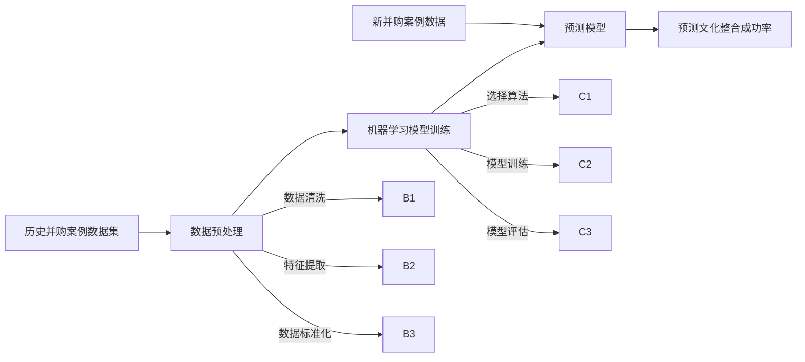

# 设计智能化的企业并购文化整合成功率预测模型

> 关键词：企业并购、文化整合、成功率预测、智能化模型、机器学习

> 摘要：本文聚焦于设计智能化的企业并购文化整合成功率预测模型。首先介绍了企业并购文化整合的背景，包括目的、预期读者、文档结构和相关术语。接着阐述了核心概念及联系，构建了概念原理和架构的文本示意图与 Mermaid 流程图。详细讲解了核心算法原理，通过 Python 代码进行说明。给出了数学模型和公式，并举例分析。通过项目实战展示了代码的实现与解读。探讨了实际应用场景，推荐了相关的学习资源、开发工具框架和论文著作。最后总结了未来发展趋势与挑战，提供了常见问题解答和扩展阅读参考资料，旨在为企业在并购文化整合中提供有效的预测方法和决策依据。

## 1. 背景介绍 
### 1.1 目的和范围
企业并购是企业扩张和发展的重要战略手段，但并购后的文化整合是一个复杂且关键的环节，其成功率直接影响到并购的最终效果。本项目的目的是设计一个智能化的预测模型，帮助企业在并购前对文化整合的成功率进行准确预测，从而提前做好规划和准备，提高并购的成功率。

本模型的范围涵盖了不同行业、不同规模企业的并购文化整合情况。考虑到企业的文化差异、管理模式、员工价值观等多方面因素，通过收集大量的历史数据，建立一个具有通用性和准确性的预测模型。

### 1.2 预期读者
本文的预期读者包括企业的高层管理人员、并购决策团队、投资银行家、管理咨询顾问以及对企业并购和文化整合研究感兴趣的学者和研究人员。企业高层管理人员和并购决策团队可以利用该模型在并购决策过程中评估文化整合的风险和成功率；投资银行家可以在为企业提供并购建议时参考该模型；管理咨询顾问可以借助模型为客户提供更专业的文化整合方案；学者和研究人员则可以从模型的设计和实现过程中获取研究灵感和方法。

### 1.3 文档结构概述
本文将按照以下结构进行组织：
- 核心概念与联系：介绍企业并购文化整合的核心概念，包括文化整合的定义、影响因素等，并通过文本示意图和 Mermaid 流程图展示其原理和架构。
- 核心算法原理 & 具体操作步骤：详细讲解用于构建预测模型的核心算法原理，如机器学习算法，并给出具体的操作步骤和 Python 代码实现。
- 数学模型和公式 & 详细讲解 & 举例说明：给出预测模型的数学表达式，详细解释公式中各项的含义，并通过实际案例进行说明。
- 项目实战：代码实际案例和详细解释说明：通过一个实际的项目案例，展示如何使用上述算法和模型构建预测系统，包括开发环境搭建、源代码实现和代码解读。
- 实际应用场景：探讨该预测模型在企业并购中的实际应用场景，如并购前的风险评估、并购后的文化整合策略制定等。
- 工具和资源推荐：推荐相关的学习资源、开发工具框架和论文著作，帮助读者进一步深入学习和研究。
- 总结：未来发展趋势与挑战：总结本文的主要内容，分析该领域的未来发展趋势和面临的挑战。
- 附录：常见问题与解答：提供一些常见问题的解答，帮助读者更好地理解和应用该模型。
- 扩展阅读 & 参考资料：列出相关的扩展阅读资料和参考文献，方便读者进一步查阅。

### 1.4 术语表
#### 1.4.1 核心术语定义
- **企业并购**：指企业之间的合并与收购行为，是企业通过产权交易获得其他企业的控制权，以实现自身发展战略的一种经济活动。
- **文化整合**：在企业并购过程中，将不同企业的文化进行融合和协调，形成一种新的、适合企业发展的文化体系的过程。
- **文化整合成功率**：指企业在并购后成功实现文化整合的概率，成功的文化整合表现为员工对新文化的认同和接受，企业的运营效率和绩效得到提升。
- **智能化预测模型**：利用人工智能技术，如机器学习、深度学习等，对企业并购文化整合成功率进行预测的模型。

#### 1.4.2 相关概念解释
- **文化差异**：不同企业之间在价值观、管理理念、行为规范等方面存在的差异，文化差异是企业并购文化整合面临的主要挑战之一。
- **文化冲突**：由于文化差异导致的企业内部员工之间、部门之间的矛盾和冲突，文化冲突可能会影响企业的正常运营和发展。
- **文化融合**：通过有效的文化整合措施，使不同企业的文化相互吸收、相互补充，形成一种新的、具有凝聚力和竞争力的企业文化的过程。

#### 1.4.3 缩略词列表
- **ML**：Machine Learning，机器学习
- **DL**：Deep Learning，深度学习
- **ANN**：Artificial Neural Network，人工神经网络
- **SVM**：Support Vector Machine，支持向量机

## 2. 核心概念与联系 

### 核心概念原理
企业并购文化整合成功率预测模型的核心原理是基于机器学习算法，通过对大量历史企业并购案例数据的分析和学习，找出影响文化整合成功率的关键因素，并建立相应的预测模型。这些关键因素包括企业的文化差异、管理模式、员工价值观、并购规模等。

模型的输入是一系列与企业并购文化整合相关的特征变量，输出是文化整合成功的概率。通过对输入数据的特征提取和模型训练，不断优化模型的参数，提高预测的准确性。

### 架构的文本示意图
```plaintext
|----------------------|
| 历史并购案例数据集  |
|----------------------|
         |
         v
|----------------------|
| 数据预处理           |
|  - 数据清洗           |
|  - 特征提取           |
|  - 数据标准化         |
|----------------------|
         |
         v
|----------------------|
| 机器学习模型训练     |
|  - 选择算法（如 SVM、ANN） |
|  - 模型训练           |
|  - 模型评估           |
|----------------------|
         |
         v
|----------------------|
| 预测模型             |
|----------------------|
         |
         v
|----------------------|
| 新并购案例数据       |
|----------------------|
         |
         v
|----------------------|
| 预测文化整合成功率   |
|----------------------|
```

### Mermaid 流程图


## 3. 核心算法原理 & 具体操作步骤 

### 核心算法原理
本模型采用支持向量机（SVM）算法作为核心算法。支持向量机是一种有监督的机器学习算法，用于分类和回归分析。在本模型中，我们将其用于预测企业并购文化整合的成功率，将其转化为一个二分类问题，即文化整合成功或失败。

支持向量机的基本思想是在特征空间中找到一个最优的超平面，使得不同类别的样本点尽可能地分开，并且使分类间隔最大。对于线性可分的数据集，支持向量机可以找到一个线性超平面进行分类；对于线性不可分的数据集，支持向量机通过核函数将数据映射到高维空间，使其在高维空间中线性可分。

### 具体操作步骤
1. **数据收集**：收集大量的历史企业并购案例数据，包括企业的基本信息、文化特征、并购情况、文化整合结果等。
2. **数据预处理**：
    - **数据清洗**：去除数据中的噪声、缺失值和异常值。
    - **特征提取**：从原始数据中提取与文化整合成功率相关的特征变量，如文化差异度、管理模式相似度等。
    - **数据标准化**：将特征变量进行标准化处理，使不同特征变量具有相同的尺度。
3. **模型训练**：
    - **划分数据集**：将预处理后的数据划分为训练集和测试集，一般按照 70:30 或 80:20 的比例进行划分。
    - **选择核函数**：根据数据的特点选择合适的核函数，如线性核、多项式核、径向基核等。
    - **训练模型**：使用训练集对支持向量机模型进行训练，调整模型的参数，如惩罚因子 C 和核函数参数。
4. **模型评估**：使用测试集对训练好的模型进行评估，计算模型的准确率、召回率、F1 值等指标，评估模型的性能。
5. **预测**：将新的企业并购案例数据输入到训练好的模型中，得到文化整合成功的概率。

### Python 代码实现
```python
import numpy as np
from sklearn import svm
from sklearn.model_selection import train_test_split
from sklearn.preprocessing import StandardScaler
from sklearn.metrics import accuracy_score

# 假设我们已经收集到了历史数据 X 和对应的标签 y
# X 是特征矩阵，每一行代表一个样本，每一列代表一个特征
# y 是标签向量，0 表示文化整合失败，1 表示文化整合成功
X = np.random.rand(100, 5)  # 示例数据
y = np.random.randint(0, 2, 100)  # 示例标签

# 数据预处理
# 划分数据集
X_train, X_test, y_train, y_test = train_test_split(X, y, test_size=0.3, random_state=42)

# 数据标准化
scaler = StandardScaler()
X_train = scaler.fit_transform(X_train)
X_test = scaler.transform(X_test)

# 模型训练
clf = svm.SVC(kernel='rbf', C=1.0)  # 使用径向基核函数
clf.fit(X_train, y_train)

# 模型评估
y_pred = clf.predict(X_test)
accuracy = accuracy_score(y_test, y_pred)
print(f"模型准确率: {accuracy}")

# 预测新的案例
new_case = np.random.rand(1, 5)
new_case = scaler.transform(new_case)
prediction = clf.predict(new_case)
print(f"新案例文化整合预测结果: {'成功' if prediction[0] == 1 else '失败'}")
```

## 4. 数学模型和公式 & 详细讲解 & 举例说明 

### 支持向量机的数学模型
对于线性可分的二分类问题，支持向量机的目标是找到一个超平面 $w^T x + b = 0$，使得不同类别的样本点尽可能地分开，并且使分类间隔最大。分类间隔定义为两个异类支持向量到超平面的距离之和，即：
$$
\gamma = \frac{2}{\|w\|}
$$
其中，$w$ 是超平面的法向量，$b$ 是偏置项。

为了找到最优的超平面，我们需要最大化分类间隔 $\gamma$，等价于最小化 $\frac{1}{2}\|w\|^2$。同时，需要满足以下约束条件：
$$
y_i(w^T x_i + b) \geq 1, \quad i = 1, 2, \cdots, n
$$
其中，$x_i$ 是第 $i$ 个样本点，$y_i \in \{-1, 1\}$ 是第 $i$ 个样本点的标签。

因此，支持向量机的优化问题可以表示为：
$$
\begin{aligned}
\min_{w, b} &\quad \frac{1}{2}\|w\|^2 \\
\text{s.t.} &\quad y_i(w^T x_i + b) \geq 1, \quad i = 1, 2, \cdots, n
\end{aligned}
$$

### 引入松弛变量处理线性不可分问题
对于线性不可分的数据集，我们引入松弛变量 $\xi_i \geq 0$，允许部分样本点不满足约束条件。此时，优化问题变为：
$$
\begin{aligned}
\min_{w, b, \xi} &\quad \frac{1}{2}\|w\|^2 + C \sum_{i=1}^{n} \xi_i \\
\text{s.t.} &\quad y_i(w^T x_i + b) \geq 1 - \xi_i, \quad i = 1, 2, \cdots, n \\
&\quad \xi_i \geq 0, \quad i = 1, 2, \cdots, n
\end{aligned}
$$
其中，$C > 0$ 是惩罚因子，用于平衡分类间隔和误分类样本的数量。

### 核函数
为了处理非线性可分的数据集，支持向量机引入了核函数 $K(x_i, x_j)$，将数据从原始特征空间映射到高维特征空间，使得数据在高维空间中线性可分。常见的核函数有：
- **线性核**：$K(x_i, x_j) = x_i^T x_j$
- **多项式核**：$K(x_i, x_j) = (\gamma x_i^T x_j + r)^d$，其中 $\gamma > 0$，$r$ 是常数，$d$ 是多项式的次数。
- **径向基核（RBF）**：$K(x_i, x_j) = \exp(-\gamma \|x_i - x_j\|^2)$，其中 $\gamma > 0$。

### 举例说明
假设我们有一个二维数据集，包含两个类别，每个类别有 5 个样本点。我们可以使用支持向量机对其进行分类。

```python
import numpy as np
import matplotlib.pyplot as plt
from sklearn import svm

# 生成示例数据
X = np.array([[3, 4], [2, 2], [4, 4], [1, 1], [5, 5], [7, 7], [6, 6], [8, 8], [9, 9], [10, 10]])
y = np.array([0, 0, 0, 0, 0, 1, 1, 1, 1, 1])

# 训练支持向量机模型
clf = svm.SVC(kernel='linear')
clf.fit(X, y)

# 绘制决策边界
plt.scatter(X[:, 0], X[:, 1], c=y, cmap=plt.cm.Paired)
ax = plt.gca()
xlim = ax.get_xlim()
ylim = ax.get_ylim()

# 创建网格点
xx = np.linspace(xlim[0], xlim[1], 30)
yy = np.linspace(ylim[0], ylim[1], 30)
YY, XX = np.meshgrid(yy, xx)
xy = np.vstack([XX.ravel(), YY.ravel()]).T
Z = clf.decision_function(xy).reshape(XX.shape)

# 绘制决策边界和间隔边界
ax.contour(XX, YY, Z, colors='k', levels=[-1, 0, 1], alpha=0.5, linestyles=['--', '-', '--'])

# 绘制支持向量
ax.scatter(clf.support_vectors_[:, 0], clf.support_vectors_[:, 1], s=100, facecolors='none', edgecolors='k')
plt.show()
```

在这个例子中，我们使用线性核函数训练了一个支持向量机模型，并绘制了决策边界和间隔边界。可以看到，支持向量机通过找到最优的超平面将两个类别分开。

## 5. 项目实战：代码实际案例和详细解释说明 

### 5.1  开发环境搭建
1. **安装 Python**：建议使用 Python 3.7 及以上版本，可以从 Python 官方网站（https://www.python.org/downloads/）下载并安装。
2. **安装必要的库**：使用 pip 安装以下必要的库：
```sh
pip install numpy pandas scikit-learn matplotlib
```
- `numpy`：用于数值计算和数组操作。
- `pandas`：用于数据处理和分析。
- `scikit-learn`：提供了各种机器学习算法和工具。
- `matplotlib`：用于数据可视化。

### 5.2  源代码详细实现和代码解读
以下是一个完整的项目实战代码，用于构建企业并购文化整合成功率预测模型：

```python
import numpy as np
import pandas as pd
from sklearn.model_selection import train_test_split
from sklearn.preprocessing import StandardScaler
from sklearn.svm import SVC
from sklearn.metrics import accuracy_score, precision_score, recall_score, f1_score
import matplotlib.pyplot as plt

# 步骤 1: 数据加载
data = pd.read_csv('merger_data.csv')  # 假设数据存储在 merger_data.csv 文件中

# 步骤 2: 数据预处理
# 分离特征和标签
X = data.drop('success', axis=1)  # 'success' 是文化整合成功的标签列
y = data['success']

# 划分数据集
X_train, X_test, y_train, y_test = train_test_split(X, y, test_size=0.3, random_state=42)

# 数据标准化
scaler = StandardScaler()
X_train = scaler.fit_transform(X_train)
X_test = scaler.transform(X_test)

# 步骤 3: 模型训练
clf = SVC(kernel='rbf', C=1.0, gamma='scale')
clf.fit(X_train, y_train)

# 步骤 4: 模型评估
y_pred = clf.predict(X_test)

# 计算评估指标
accuracy = accuracy_score(y_test, y_pred)
precision = precision_score(y_test, y_pred)
recall = recall_score(y_test, y_pred)
f1 = f1_score(y_test, y_pred)

print(f"准确率: {accuracy}")
print(f"精确率: {precision}")
print(f"召回率: {recall}")
print(f"F1 值: {f1}")

# 步骤 5: 可视化结果
# 绘制混淆矩阵（简单示例）
from sklearn.metrics import confusion_matrix
import seaborn as sns

cm = confusion_matrix(y_test, y_pred)
sns.heatmap(cm, annot=True, fmt='d', cmap='Blues')
plt.xlabel('预测标签')
plt.ylabel('真实标签')
plt.title('混淆矩阵')
plt.show()
```

### 代码解读与分析
1. **数据加载**：使用 `pandas` 库的 `read_csv` 函数从 CSV 文件中加载数据。假设数据文件名为 `merger_data.csv`，其中包含了企业并购的相关特征和文化整合成功的标签。
2. **数据预处理**：
    - **分离特征和标签**：使用 `drop` 方法从数据集中分离出特征矩阵 `X` 和标签向量 `y`。
    - **划分数据集**：使用 `train_test_split` 函数将数据集划分为训练集和测试集，比例为 70:30。
    - **数据标准化**：使用 `StandardScaler` 对特征矩阵进行标准化处理，使不同特征具有相同的尺度。
3. **模型训练**：使用 `SVC` 类创建一个支持向量机分类器，选择径向基核函数（RBF），并设置惩罚因子 `C` 和核函数参数 `gamma`。使用 `fit` 方法对模型进行训练。
4. **模型评估**：使用训练好的模型对测试集进行预测，得到预测标签 `y_pred`。计算准确率、精确率、召回率和 F1 值等评估指标，评估模型的性能。
5. **可视化结果**：使用 `confusion_matrix` 函数计算混淆矩阵，并使用 `seaborn` 库的 `heatmap` 函数绘制混淆矩阵的热力图，直观地展示模型的分类结果。

## 6. 实际应用场景 
### 并购前的风险评估
在企业进行并购决策之前，使用智能化的文化整合成功率预测模型可以对目标企业与自身企业之间的文化整合风险进行评估。通过输入两家企业的相关文化特征、管理模式、员工价值观等数据，模型可以预测文化整合成功的概率。如果预测成功率较低，企业可以进一步分析原因，如文化差异过大、管理模式不兼容等，并考虑是否需要调整并购策略或采取相应的文化整合措施，以降低并购风险。

### 并购后的文化整合策略制定
在并购完成后，预测模型可以为企业制定文化整合策略提供参考。根据模型预测的结果和影响文化整合成功率的关键因素，企业可以有针对性地制定文化整合计划。例如，如果模型显示文化差异是影响整合成功率的主要因素，企业可以采取文化培训、文化交流活动等措施来缩小文化差距；如果管理模式不兼容是主要问题，企业可以对管理架构进行调整和优化。

### 投资决策参考
对于投资银行家和投资者来说，企业并购文化整合成功率预测模型可以作为投资决策的参考依据。在评估一个并购项目的投资价值时，除了考虑财务指标和市场前景外，文化整合的风险也是一个重要因素。通过预测文化整合的成功率，投资者可以更全面地评估并购项目的潜在风险和收益，从而做出更明智的投资决策。

### 学术研究和咨询服务
在学术研究领域，该预测模型可以为企业并购和文化整合的研究提供实证分析工具。研究人员可以使用模型对不同行业、不同规模企业的并购文化整合情况进行研究，探索影响文化整合成功率的因素和规律。在咨询服务领域，管理咨询顾问可以利用该模型为客户提供专业的文化整合咨询服务，帮助客户提高并购的成功率。

## 7. 工具和资源推荐
### 7.1 学习资源推荐
#### 7.1.1 书籍推荐
- 《机器学习》（周志华著）：这本书全面介绍了机器学习的基本概念、算法和应用，是机器学习领域的经典教材之一。
- 《Python 机器学习实战》（Sebastian Raschka 著）：通过大量的实际案例，详细介绍了如何使用 Python 进行机器学习项目的开发，适合初学者入门。
- 《企业并购与重组》（王化成等著）：系统地阐述了企业并购与重组的理论、方法和实践，对于理解企业并购的流程和文化整合的重要性有很大帮助。

#### 7.1.2 在线课程
- Coursera 上的“机器学习”课程（Andrew Ng 教授授课）：这是一门非常经典的机器学习在线课程，涵盖了机器学习的基本概念、算法和应用，适合初学者学习。
- edX 上的“数据科学与机器学习微硕士学位课程”：该课程提供了系统的数据分析和机器学习知识，包括数据预处理、模型选择、评估和优化等内容。
- 中国大学 MOOC 上的“企业并购与重组”课程：由国内知名高校的教授授课，详细介绍了企业并购的相关理论和实践，对于了解企业并购文化整合有很大帮助。

#### 7.1.3 技术博客和网站
- Medium 上的机器学习相关博客：Medium 上有很多机器学习领域的优秀博客，作者们会分享最新的研究成果、技术应用和实践经验。
- Kaggle 平台：Kaggle 是一个数据科学竞赛平台，上面有很多关于机器学习和数据分析的项目和案例，通过参与竞赛和学习他人的代码，可以提高自己的技术水平。
- 开源中国：开源中国是国内知名的开源技术社区，上面有很多关于人工智能和机器学习的技术文章和项目分享。

### 7.2 开发工具框架推荐
#### 7.2.1 IDE和编辑器
- PyCharm：一款专业的 Python 集成开发环境，提供了丰富的代码编辑、调试、版本控制等功能，适合开发大型的 Python 项目。
- Jupyter Notebook：一种交互式的开发环境，可以将代码、文本、图表等内容整合在一起，方便进行数据探索和模型实验。
- Visual Studio Code：一款轻量级的代码编辑器，支持多种编程语言和插件扩展，具有良好的代码编辑和调试功能。

#### 7.2.2 调试和性能分析工具
- PDB：Python 自带的调试器，可以帮助开发者逐行调试代码，定位问题。
- cProfile：Python 标准库中的性能分析工具，可以分析代码的运行时间和函数调用次数，帮助开发者找出性能瓶颈。
- TensorBoard：TensorFlow 提供的可视化工具，可以用于可视化模型的训练过程、参数变化等信息，方便进行模型调优。

#### 7.2.3 相关框架和库
- Scikit-learn：一个简单易用的机器学习库，提供了各种机器学习算法和工具，如分类、回归、聚类等。
- TensorFlow：一个开源的深度学习框架，广泛应用于图像识别、自然语言处理等领域。
- PyTorch：另一个流行的深度学习框架，具有动态图的优势，适合快速迭代和实验。

### 7.3 相关论文著作推荐
#### 7.3.1 经典论文
- “Support-Vector Networks”（Cortes 和 Vapnik 著）：这是支持向量机领域的经典论文，详细介绍了支持向量机的基本原理和算法。
- “Neural Networks and Deep Learning”（Michael Nielsen 著）：这本书免费在线发布，系统地介绍了神经网络和深度学习的基本概念、算法和应用。
- “Culture Clash: The Anatomy of Failed Mergers”（Cartwright 和 Cooper 著）：该论文深入分析了企业并购中文化冲突的原因和影响，对于理解企业并购文化整合有重要的参考价值。

#### 7.3.2 最新研究成果
- 在 IEEE Transactions on Neural Networks and Learning Systems、Journal of Machine Learning Research 等学术期刊上可以找到关于机器学习和人工智能的最新研究成果。
- 通过 Google Scholar 等学术搜索引擎，可以搜索到关于企业并购文化整合的最新研究论文。

#### 7.3.3 应用案例分析
- 一些知名企业的并购案例分析报告，如惠普与康柏的并购、戴尔与 EMC 的并购等，可以帮助我们了解企业在并购文化整合方面的实践经验和教训。
- 管理咨询公司发布的企业并购研究报告，如麦肯锡、波士顿咨询等公司的报告，通常包含了大量的实际案例和数据分析，对于实际应用有很大的参考价值。

## 8. 总结：未来发展趋势与挑战
### 未来发展趋势
1. **多模态数据融合**：未来的企业并购文化整合成功率预测模型将不仅仅依赖于传统的结构化数据，还会融合文本、图像、音频等多模态数据。例如，通过分析企业的官方网站、社交媒体上的文本信息，以及员工的工作场景图像等，更全面地了解企业的文化特征，提高预测的准确性。
2. **深度学习的应用**：随着深度学习技术的不断发展，将深度学习模型应用于企业并购文化整合成功率预测是一个重要的发展趋势。深度学习模型可以自动提取数据中的复杂特征，挖掘数据背后的潜在规律，从而提高预测的性能。
3. **实时预测和动态调整**：未来的模型将具备实时预测的能力，能够在企业并购过程中实时监测文化整合的情况，并根据实际情况动态调整预测结果和文化整合策略。例如，通过实时收集员工的反馈信息和企业的运营数据，及时发现文化整合过程中出现的问题，并采取相应的措施进行调整。
4. **跨学科融合**：企业并购文化整合是一个复杂的问题，涉及到管理学、心理学、社会学等多个学科领域。未来的研究和实践将更加注重跨学科的融合，综合运用多个学科的理论和方法，构建更加完善的预测模型和文化整合策略。

### 挑战
1. **数据质量和获取难度**：构建准确的预测模型需要大量高质量的数据，但企业并购文化整合相关的数据往往比较难以获取，且数据质量参差不齐。例如，文化特征、员工价值观等数据难以量化和准确收集，可能存在主观偏差。此外，企业之间的数据共享和隐私保护也是一个挑战。
2. **模型的可解释性**：深度学习模型虽然在预测性能上表现出色，但往往缺乏可解释性。在企业并购文化整合这样的重要决策场景中，决策者需要了解模型的预测依据和影响因素，以便做出合理的决策。因此，提高模型的可解释性是一个亟待解决的问题。
3. **文化的复杂性和动态性**：文化是一个复杂而动态的概念，不同企业的文化具有独特性和多样性，且文化会随着时间和环境的变化而发生改变。如何准确地捕捉和刻画文化的复杂性和动态性，是构建预测模型面临的一个挑战。
4. **模型的泛化能力**：由于不同行业、不同规模企业的并购文化整合情况存在差异，模型的泛化能力是一个重要的问题。如何使模型在不同的数据集和场景下都能保持良好的预测性能，需要进一步的研究和探索。

## 9. 附录：常见问题与解答
### 1. 如何选择合适的特征变量？
选择合适的特征变量是构建预测模型的关键。可以从以下几个方面考虑：
- **相关性**：选择与文化整合成功率密切相关的特征变量，如文化差异度、管理模式相似度等。
- **可获取性**：选择能够容易获取和量化的特征变量，避免选择过于抽象或难以测量的特征。
- **独立性**：尽量选择相互独立的特征变量，避免特征之间存在高度的相关性，以免影响模型的性能。

### 2. 支持向量机的核函数如何选择？
核函数的选择取决于数据的特点和问题的性质。一般来说：
- **线性核**：适用于数据线性可分或近似线性可分的情况，计算速度快。
- **多项式核**：适用于数据具有一定的非线性关系的情况，但需要调整多项式的次数和其他参数。
- **径向基核（RBF）**：是一种常用的核函数，适用于大多数非线性问题，具有较好的泛化能力，但计算复杂度较高。

可以通过交叉验证等方法选择最优的核函数和参数。

### 3. 如何评估模型的性能？
可以使用以下几种常见的评估指标来评估模型的性能：
- **准确率**：预测正确的样本数占总样本数的比例，反映了模型的整体预测能力。
- **精确率**：预测为正例的样本中实际为正例的比例，反映了模型预测正例的准确性。
- **召回率**：实际为正例的样本中被预测为正例的比例，反映了模型找出正例的能力。
- **F1 值**：精确率和召回率的调和平均数，综合考虑了精确率和召回率。

### 4. 模型的预测结果是否可靠？
模型的预测结果受到多种因素的影响，如数据质量、特征选择、模型算法等。为了提高模型的可靠性，可以采取以下措施：
- **收集更多高质量的数据**：增加数据的数量和质量可以提高模型的泛化能力和预测准确性。
- **进行特征工程**：选择合适的特征变量，并进行特征提取和转换，以提高特征的表达能力。
- **选择合适的模型算法**：根据数据的特点和问题的性质选择合适的模型算法，并进行模型调优。
- **进行模型评估和验证**：使用交叉验证等方法对模型进行评估和验证，确保模型的性能稳定可靠。

## 10. 扩展阅读 & 参考资料
### 扩展阅读
- 《人工智能时代的企业管理变革》：探讨了人工智能技术在企业管理中的应用和影响，对于理解企业并购文化整合中的智能化应用有一定的启发。
- 《文化管理：企业发展的核心竞争力》：深入分析了企业文化的内涵、作用和管理方法，对于企业并购文化整合有重要的参考价值。
- 《数据挖掘：概念与技术》：介绍了数据挖掘的基本概念、算法和应用，对于构建企业并购文化整合成功率预测模型有一定的帮助。

### 参考资料
- [1] Cortes, C., & Vapnik, V. (1995). Support-vector networks. Machine learning, 20(3), 273-297.
- [2] Nielsen, M. A. (2015). Neural networks and deep learning. Determination press.
- [3] Cartwright, S., & Cooper, C. L. (1993). Culture clash: The anatomy of failed mergers. Human relations, 46(6), 691-704.
- [4] Zhou, Z. H. (2016). Machine learning. Tsinghua University Press.

作者：AI天才研究院/AI Genius Institute & 禅与计算机程序设计艺术 /Zen And The Art of Computer Programming