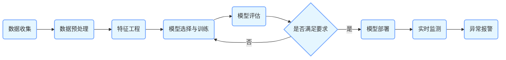

# 设计智能化的企业财务异常检测模型

> 关键词：企业财务异常检测、智能化模型、机器学习、深度学习、数据分析

> 摘要：本文旨在深入探讨如何设计智能化的企业财务异常检测模型。随着企业财务数据的日益复杂和海量增长，传统的财务异常检测方法已难以满足需求。智能化模型能够利用先进的机器学习和深度学习技术，对企业财务数据进行高效、准确的分析，及时发现潜在的异常情况。文章首先介绍了设计该模型的背景，包括目的、预期读者、文档结构和相关术语。接着阐述了核心概念及其联系，详细讲解了核心算法原理和具体操作步骤，并给出了相应的Python代码。同时，通过数学模型和公式进一步解释了模型的原理，并举例说明。在项目实战部分，提供了开发环境搭建的步骤、源代码的详细实现和解读。此外，还探讨了该模型的实际应用场景，推荐了相关的学习资源、开发工具框架和论文著作。最后，总结了未来的发展趋势与挑战，并提供了常见问题的解答和扩展阅读参考资料。

## 1. 背景介绍 
### 1.1 目的和范围
在当今数字化时代，企业面临着日益复杂的财务环境。财务数据不仅规模庞大，而且包含了各种复杂的交易信息。准确、及时地检测出企业财务中的异常情况，对于企业的风险管理、合规运营以及决策制定都具有至关重要的意义。本项目的目的是设计一个智能化的企业财务异常检测模型，利用先进的数据分析和机器学习技术，从海量的财务数据中自动识别出可能存在的异常交易、财务指标异常等情况。

本项目的范围涵盖了从数据收集、预处理、特征工程、模型选择与训练，到模型评估和部署的整个流程。我们将重点关注如何利用常见的机器学习和深度学习算法构建高效、准确的异常检测模型，并通过实际案例验证模型的有效性。

### 1.2 预期读者
本文的预期读者包括企业财务管理人员、风险管理专家、数据分析师、机器学习工程师以及对企业财务异常检测感兴趣的研究人员。对于财务管理人员和风险管理专家来说，本文可以帮助他们了解如何利用智能化技术提升财务风险检测的能力；对于数据分析师和机器学习工程师来说，本文提供了一个实际的项目案例，包括详细的算法原理、代码实现和实践经验；对于研究人员来说，本文可以作为进一步深入研究企业财务异常检测的参考资料。

### 1.3 文档结构概述
本文将按照以下结构进行组织：
- 核心概念与联系：介绍企业财务异常检测的核心概念、相关原理和架构，并通过示意图和流程图进行直观展示。
- 核心算法原理 & 具体操作步骤：详细讲解常用的异常检测算法原理，包括基于统计的方法、机器学习算法和深度学习算法，并给出相应的Python代码实现。
- 数学模型和公式 & 详细讲解 & 举例说明：通过数学模型和公式进一步解释异常检测算法的原理，并结合实际例子进行说明。
- 项目实战：代码实际案例和详细解释说明：提供一个完整的项目实战案例，包括开发环境搭建、源代码实现和代码解读。
- 实际应用场景：探讨智能化企业财务异常检测模型在不同场景下的应用。
- 工具和资源推荐：推荐相关的学习资源、开发工具框架和论文著作。
- 总结：未来发展趋势与挑战：总结智能化企业财务异常检测模型的未来发展趋势和面临的挑战。
- 附录：常见问题与解答：提供常见问题的解答，帮助读者更好地理解和应用本文介绍的内容。
- 扩展阅读 & 参考资料：提供相关的扩展阅读资料和参考文献，方便读者进一步深入学习。

### 1.4 术语表
#### 1.4.1 核心术语定义
- **企业财务异常检测**：通过对企业财务数据的分析，识别出与正常业务模式或历史数据模式不符的交易、财务指标等情况。
- **异常值**：在数据集中明显偏离其他数据点的数据值，可能表示异常情况。
- **机器学习**：让计算机通过数据学习模式和规律，从而进行预测和决策的技术。
- **深度学习**：机器学习的一个分支，使用多层神经网络来学习数据的复杂表示。
- **特征工程**：从原始数据中提取和转换特征，以便更好地用于模型训练的过程。

#### 1.4.2 相关概念解释
- **监督学习**：在有标注数据的情况下，训练模型学习输入数据和输出标签之间的映射关系。
- **无监督学习**：在没有标注数据的情况下，让模型自动发现数据中的模式和结构。
- **半监督学习**：结合有标注数据和无标注数据进行模型训练的方法。
- **召回率**：模型正确识别出的异常样本占实际异常样本的比例。
- **精确率**：模型正确识别出的异常样本占所有被识别为异常样本的比例。

#### 1.4.3 缩略词列表
- **PCA**：主成分分析（Principal Component Analysis）
- **KNN**：K近邻算法（K-Nearest Neighbors）
- **SVM**：支持向量机（Support Vector Machine）
- **LSTM**：长短期记忆网络（Long Short-Term Memory）
- **ROC**：受试者工作特征曲线（Receiver Operating Characteristic Curve）
- **AUC**：ROC曲线下的面积（Area Under the Curve）

## 2. 核心概念与联系 

### 核心概念原理
企业财务异常检测的核心原理是通过对企业财务数据的分析，建立正常业务模式的模型，然后将新的数据与该模型进行比较，识别出偏离正常模式的数据点，这些数据点可能表示异常情况。常见的异常检测方法可以分为基于统计的方法、机器学习方法和深度学习方法。

- **基于统计的方法**：通过计算数据的统计特征，如均值、方差、中位数等，来定义正常数据的范围。当新的数据点超出这个范围时，就被认为是异常值。例如，使用3σ原则，即数据点落在均值加减3倍标准差之外的范围被视为异常。
- **机器学习方法**：利用机器学习算法，如K近邻算法、支持向量机等，对数据进行分类或聚类，从而识别出异常数据。这些算法通过学习数据的特征和模式，来判断新的数据点是否属于正常类别。
- **深度学习方法**：使用深度学习模型，如长短期记忆网络、自编码器等，对数据进行建模和分析。深度学习模型能够自动学习数据的复杂表示，对于处理高维、复杂的数据具有优势。

### 架构示意图
以下是一个智能化企业财务异常检测模型的架构示意图：



### 流程解释
1. **数据收集**：从企业的财务系统、数据库等数据源收集相关的财务数据，如交易记录、财务报表等。
2. **数据预处理**：对收集到的数据进行清洗、转换和归一化等操作，以提高数据的质量和可用性。
3. **特征工程**：从预处理后的数据中提取和选择有意义的特征，以便用于模型训练。
4. **模型选择与训练**：根据数据的特点和问题的需求，选择合适的异常检测模型，并使用训练数据对模型进行训练。
5. **模型评估**：使用测试数据对训练好的模型进行评估，计算模型的性能指标，如召回率、精确率、AUC等。
6. **模型部署**：如果模型的性能满足要求，则将模型部署到生产环境中，用于实时监测企业的财务数据。
7. **实时监测**：对企业的财务数据进行实时监测，将新的数据输入到已部署的模型中，判断是否存在异常情况。
8. **异常报警**：当模型检测到异常情况时，及时发出报警信息，通知相关人员进行处理。

## 3. 核心算法原理 & 具体操作步骤 

### 基于统计的方法：3σ原则
#### 算法原理
3σ原则是一种基于正态分布的异常检测方法。在正态分布中，约99.7%的数据点落在均值加减3倍标准差的范围内。因此，当一个数据点超出这个范围时，就可以认为它是异常值。

#### Python代码实现
```python
import numpy as np

def detect_anomalies_3sigma(data, threshold=3):
    mean = np.mean(data)
    std = np.std(data)
    lower_bound = mean - threshold * std
    upper_bound = mean + threshold * std
    anomalies = []
    for i, value in enumerate(data):
        if value < lower_bound or value > upper_bound:
            anomalies.append(i)
    return anomalies

# 示例数据
data = [1, 2, 3, 4, 5, 100, 6, 7, 8, 9]
anomalies = detect_anomalies_3sigma(data)
print("异常数据点的索引:", anomalies)
```

### 机器学习方法：K近邻算法
#### 算法原理
K近邻算法是一种基于实例的学习方法。对于一个新的数据点，它会找到距离该点最近的K个邻居，然后根据这K个邻居的类别来判断该数据点的类别。在异常检测中，如果一个数据点的K个邻居大多属于正常类别，而该数据点与这些邻居的距离较远，则可以认为该数据点是异常值。

#### Python代码实现
```python
from sklearn.neighbors import LocalOutlierFactor
import numpy as np

# 示例数据
X = np.array([[1, 2], [2, 3], [3, 4], [4, 5], [5, 6], [10, 20]])

# 创建K近邻异常检测模型
clf = LocalOutlierFactor(n_neighbors=2)
y_pred = clf.fit_predict(X)

# 找出异常数据点
anomalies = np.where(y_pred == -1)[0]
print("异常数据点的索引:", anomalies)
```

### 深度学习方法：自编码器
#### 算法原理
自编码器是一种无监督学习模型，它的目标是学习数据的压缩表示，然后再从压缩表示中重构出原始数据。在正常情况下，自编码器能够较好地重构输入数据；而对于异常数据，重构误差会比较大。因此，可以通过设置一个重构误差的阈值来判断数据是否为异常值。

#### Python代码实现
```python
import tensorflow as tf
from tensorflow.keras import layers
import numpy as np

# 示例数据
X = np.array([[1, 2], [2, 3], [3, 4], [4, 5], [5, 6], [10, 20]])

# 定义自编码器模型
input_layer = layers.Input(shape=(2,))
encoded = layers.Dense(1, activation='relu')(input_layer)
decoded = layers.Dense(2, activation='linear')(encoded)
autoencoder = tf.keras.Model(input_layer, decoded)

# 编译模型
autoencoder.compile(optimizer='adam', loss='mse')

# 训练模型
autoencoder.fit(X, X, epochs=50, batch_size=1)

# 计算重构误差
reconstructions = autoencoder.predict(X)
mse = np.mean(np.power(X - reconstructions, 2), axis=1)

# 设置阈值
threshold = np.mean(mse) + np.std(mse)

# 找出异常数据点
anomalies = np.where(mse > threshold)[0]
print("异常数据点的索引:", anomalies)
```

## 4. 数学模型和公式 & 详细讲解 & 举例说明 

### 3σ原则的数学模型和公式
设数据集合为 $X = \{x_1, x_2, \cdots, x_n\}$，数据的均值为 $\mu$，标准差为 $\sigma$，则：

$$\mu = \frac{1}{n} \sum_{i=1}^{n} x_i$$

$$\sigma = \sqrt{\frac{1}{n} \sum_{i=1}^{n} (x_i - \mu)^2}$$

正常数据的范围为 $[\mu - 3\sigma, \mu + 3\sigma]$，当 $x_i < \mu - 3\sigma$ 或 $x_i > \mu + 3\sigma$ 时，$x_i$ 被认为是异常值。

#### 举例说明
假设有一组数据 $X = \{1, 2, 3, 4, 5, 100, 6, 7, 8, 9\}$，计算均值和标准差：

```python
import numpy as np

data = [1, 2, 3, 4, 5, 100, 6, 7, 8, 9]
mean = np.mean(data)
std = np.std(data)
print("均值:", mean)
print("标准差:", std)
```

计算得到均值约为 13.5，标准差约为 29.5。则正常数据的范围为 $[13.5 - 3 \times 29.5, 13.5 + 3 \times 29.5] = [-75, 102]$。可以看到，数据点 100 在正常范围内，这是因为 3σ原则适用于正态分布的数据，而该示例数据并不完全符合正态分布。

### K近邻算法的数学模型和公式
对于一个新的数据点 $x$，K近邻算法会计算它与训练数据集中每个数据点 $x_i$ 的距离 $d(x, x_i)$，常用的距离度量方法有欧几里得距离：

$$d(x, x_i) = \sqrt{\sum_{j=1}^{m} (x_j - x_{ij})^2}$$

其中，$m$ 是数据的维度。然后，选择距离 $x$ 最近的K个数据点，根据这K个数据点的类别来判断 $x$ 的类别。

#### 举例说明
假设有两个二维数据点 $x = [1, 2]$ 和 $x_i = [3, 4]$，计算它们的欧几里得距离：

```python
import numpy as np

x = np.array([1, 2])
xi = np.array([3, 4])
distance = np.sqrt(np.sum((x - xi) ** 2))
print("欧几里得距离:", distance)
```

### 自编码器的数学模型和公式
自编码器的目标是最小化重构误差，重构误差通常使用均方误差（MSE）来衡量：

$$MSE = \frac{1}{n} \sum_{i=1}^{n} (x_i - \hat{x}_i)^2$$

其中，$x_i$ 是输入数据，$\hat{x}_i$ 是重构后的数据。

#### 举例说明
假设有一个输入数据 $x = [1, 2]$，重构后的数据 $\hat{x} = [1.1, 2.1]$，计算均方误差：

```python
import numpy as np

x = np.array([1, 2])
x_hat = np.array([1.1, 2.1])
mse = np.mean((x - x_hat) ** 2)
print("均方误差:", mse)
```

## 5. 项目实战：代码实际案例和详细解释说明 

### 5.1  开发环境搭建
#### 安装Python
首先，需要安装Python环境。建议使用Python 3.7及以上版本，可以从Python官方网站（https://www.python.org/downloads/）下载并安装。

#### 安装必要的库
使用以下命令安装必要的Python库：
```sh
pip install numpy pandas scikit-learn tensorflow matplotlib
```

### 5.2  源代码详细实现和代码解读
#### 数据加载和预处理
```python
import pandas as pd
import numpy as np

# 加载数据
data = pd.read_csv('financial_data.csv')

# 数据清洗，去除缺失值
data = data.dropna()

# 特征选择，选择需要的财务指标
features = ['revenue', 'expenses', 'profit']
X = data[features].values

# 数据归一化
from sklearn.preprocessing import StandardScaler
scaler = StandardScaler()
X = scaler.fit_transform(X)
```

#### 模型训练和评估
```python
from sklearn.neighbors import LocalOutlierFactor
from sklearn.metrics import classification_report

# 创建K近邻异常检测模型
clf = LocalOutlierFactor(n_neighbors=5)
y_pred = clf.fit_predict(X)

# 评估模型
# 假设我们有真实的标签数据 y_true
# print(classification_report(y_true, y_pred))
```

#### 异常可视化
```python
import matplotlib.pyplot as plt

# 可视化异常数据
plt.scatter(X[:, 0], X[:, 1], c=y_pred)
plt.xlabel('Revenue')
plt.ylabel('Expenses')
plt.title('Financial Anomaly Detection')
plt.show()
```

### 5.3  代码解读与分析
- **数据加载和预处理**：首先使用 `pandas` 库加载财务数据，并去除缺失值。然后选择需要的财务指标作为特征，使用 `StandardScaler` 对数据进行归一化处理，以确保不同特征具有相同的尺度。
- **模型训练和评估**：使用 `LocalOutlierFactor` 类创建K近邻异常检测模型，并对数据进行训练和预测。在实际应用中，需要有真实的标签数据来评估模型的性能，可以使用 `classification_report` 函数计算模型的召回率、精确率等指标。
- **异常可视化**：使用 `matplotlib` 库将异常数据可视化，不同颜色的点表示不同的类别（正常或异常），有助于直观地观察异常数据的分布情况。

## 6. 实际应用场景 
### 财务报表审核
在企业财务报表审核过程中，智能化的异常检测模型可以帮助审计人员快速发现报表中的异常数据，如收入和成本的异常波动、资产负债表中的不合理项目等。通过对历史财务数据的学习，模型可以识别出正常的业务模式和财务指标范围，当新的报表数据出现偏离时，及时发出预警，提高审核效率和准确性。

### 税务风险监测
税务部门可以利用异常检测模型对企业的税务申报数据进行监测，识别出可能存在的税务欺诈行为。例如，模型可以分析企业的销售额、成本费用、纳税额等数据，发现销售额与纳税额不匹配、成本费用异常高等情况，从而及时进行调查和处理，保障国家税收收入。

### 金融机构信贷风险评估
金融机构在进行信贷审批时，需要评估企业的财务状况和信用风险。异常检测模型可以对企业的财务数据进行实时监测，发现企业财务状况的异常变化，如现金流异常、负债率过高、盈利能力下降等。这些异常信息可以作为信贷风险评估的重要参考，帮助金融机构做出更准确的信贷决策，降低信贷风险。

### 企业内部风险管理
企业内部可以利用异常检测模型对各项业务的财务数据进行监测，及时发现潜在的风险点。例如，在采购业务中，模型可以监测采购成本的异常波动、供应商付款记录的异常等；在销售业务中，模型可以监测销售额的异常下降、客户回款延迟等情况。通过及时发现和处理这些异常情况，企业可以有效地防范内部风险，保障业务的正常运营。

## 7. 工具和资源推荐
### 7.1 学习资源推荐
#### 7.1.1 书籍推荐
- 《Python数据分析实战》：本书介绍了如何使用Python进行数据分析，包括数据清洗、特征工程、模型选择和评估等内容，对于学习企业财务异常检测模型的开发非常有帮助。
- 《机器学习实战》：通过实际案例详细介绍了各种机器学习算法的原理和应用，包括异常检测算法，适合初学者入门。
- 《深度学习》：由深度学习领域的三位权威专家撰写，系统地介绍了深度学习的理论和实践，对于深入理解深度学习在异常检测中的应用具有重要参考价值。

#### 7.1.2 在线课程
- Coursera上的“机器学习”课程：由斯坦福大学教授Andrew Ng主讲，是机器学习领域的经典课程，涵盖了机器学习的基本概念、算法和应用。
- edX上的“深度学习微硕士项目”：提供了深度学习的系统学习课程，包括神经网络、卷积神经网络、循环神经网络等内容，对于提升深度学习技能非常有帮助。
- 网易云课堂上的“Python数据分析与挖掘实战”课程：结合实际案例介绍了Python在数据分析和挖掘中的应用，包括异常检测的相关内容。

#### 7.1.3 技术博客和网站
- Medium：是一个技术博客平台，上面有很多关于机器学习、深度学习和数据分析的优秀文章，包括企业财务异常检测的相关案例和技术分享。
- Kaggle：是一个数据科学竞赛平台，上面有很多关于异常检测的数据集和解决方案，可以学习到其他数据科学家的优秀经验和技巧。
- Towards Data Science：是一个专注于数据科学和机器学习的博客网站，提供了丰富的技术文章和教程，对于学习企业财务异常检测模型的开发非常有帮助。

### 7.2 开发工具框架推荐
#### 7.2.1 IDE和编辑器
- PyCharm：是一款专业的Python集成开发环境，提供了丰富的代码编辑、调试和项目管理功能，适合开发企业财务异常检测模型。
- Jupyter Notebook：是一个交互式的开发环境，支持Python代码的实时运行和可视化展示，非常适合进行数据探索和模型实验。
- Visual Studio Code：是一款轻量级的代码编辑器，支持多种编程语言和插件扩展，对于快速开发和调试异常检测模型非常方便。

#### 7.2.2 调试和性能分析工具
- TensorBoard：是TensorFlow提供的一个可视化工具，可以用于监控模型的训练过程、可视化模型的结构和性能指标，帮助开发者调试和优化模型。
- Py-Spy：是一个用于Python代码性能分析的工具，可以实时监测Python程序的CPU使用率和函数调用情况，帮助开发者找出性能瓶颈。
- Scikit-learn的GridSearchCV：是一个用于模型参数调优的工具，可以通过网格搜索的方式自动寻找最优的模型参数，提高模型的性能。

#### 7.2.3 相关框架和库
- Scikit-learn：是一个常用的机器学习库，提供了丰富的机器学习算法和工具，包括异常检测算法，如K近邻算法、支持向量机等。
- TensorFlow：是一个开源的深度学习框架，支持构建和训练各种深度学习模型，如自编码器、长短期记忆网络等，适用于处理复杂的财务数据。
- PyTorch：是另一个流行的深度学习框架，具有简洁易用的API和高效的计算性能，在学术界和工业界都有广泛的应用。

### 7.3 相关论文著作推荐
#### 7.3.1 经典论文
- “Isolation Forest”：提出了一种基于隔离森林的异常检测算法，该算法具有高效、准确的特点，适用于大规模数据集的异常检测。
- “Autoencoder-Based Anomaly Detection and Diagnosis in Cyber-Physical Systems”：介绍了如何使用自编码器进行网络物理系统中的异常检测和诊断，为企业财务异常检测提供了一种新的思路。
- “One-Class SVM for Document Classification”：探讨了使用一类支持向量机进行文档分类和异常检测的方法，对于处理文本类型的财务数据具有参考价值。

#### 7.3.2 最新研究成果
- 在IEEE Transactions on Knowledge and Data Engineering、ACM SIGKDD等顶级学术期刊和会议上，经常会发表关于异常检测的最新研究成果，可以关注这些渠道获取最新的技术动态。
- 一些知名的研究机构和学者也会在自己的个人网站上分享他们的最新研究成果，如MIT的计算机科学与人工智能实验室、斯坦福大学的人工智能实验室等。

#### 7.3.3 应用案例分析
- 可以参考一些企业的实际应用案例，了解智能化企业财务异常检测模型在不同行业和场景下的应用效果和经验教训。例如，一些金融机构会在其官方网站上发布关于风险监测和管理的报告，其中可能包含异常检测模型的应用案例。

## 8. 总结：未来发展趋势与挑战
### 未来发展趋势
- **多模态数据融合**：未来的企业财务异常检测模型将不仅仅依赖于传统的财务数据，还会融合企业的业务数据、市场数据、社交媒体数据等多模态数据，以更全面地了解企业的运营状况，提高异常检测的准确性。
- **深度学习的进一步应用**：随着深度学习技术的不断发展，更复杂、更强大的深度学习模型将被应用于企业财务异常检测，如生成对抗网络（GAN）、变分自编码器（VAE）等，能够自动学习数据的复杂分布和模式，提高模型的性能。
- **实时监测和预警**：为了及时发现企业财务中的异常情况，未来的模型将更加注重实时监测和预警功能。通过与企业的财务系统实时对接，模型可以实时分析财务数据，当发现异常时立即发出预警信息，帮助企业及时采取措施。
- **可解释性和透明度**：随着人工智能技术在企业财务领域的广泛应用，模型的可解释性和透明度变得越来越重要。未来的异常检测模型将不仅能够准确地识别异常情况，还能够解释为什么这些情况被认为是异常，为企业决策提供更有价值的信息。

### 面临的挑战
- **数据质量问题**：企业财务数据往往存在噪声、缺失值、错误数据等问题，这些问题会影响模型的训练和预测效果。因此，如何有效地处理数据质量问题，提高数据的准确性和可靠性，是一个重要的挑战。
- **模型的泛化能力**：不同企业的财务数据具有不同的特点和模式，如何使模型具有良好的泛化能力，能够适应不同企业的财务数据，是一个需要解决的问题。
- **计算资源和时间成本**：一些复杂的深度学习模型需要大量的计算资源和时间来训练和运行，这对于企业来说可能是一个挑战。如何优化模型的结构和算法，降低计算资源和时间成本，是未来的研究方向之一。
- **法律法规和伦理问题**：在使用人工智能技术进行企业财务异常检测时，需要遵守相关的法律法规和伦理准则，如数据隐私保护、算法公平性等。如何确保模型的开发和应用符合这些要求，是一个需要关注的问题。

## 9. 附录：常见问题与解答
### 问题1：如何选择合适的异常检测算法？
选择合适的异常检测算法需要考虑多个因素，如数据的特点、问题的需求、计算资源等。如果数据符合正态分布，可以考虑使用基于统计的方法，如3σ原则；如果数据具有明显的聚类结构，可以使用K近邻算法等机器学习方法；如果数据复杂且具有高维特征，可以尝试使用深度学习方法，如自编码器。此外，还可以通过实验比较不同算法的性能，选择最优的算法。

### 问题2：如何处理不平衡数据？
在企业财务异常检测中，异常数据通常只占少数，导致数据不平衡。处理不平衡数据的方法有很多，如过采样、欠采样、调整模型的权重等。过采样是通过复制少数类样本或生成新的少数类样本来增加少数类样本的数量；欠采样是通过减少多数类样本的数量来平衡数据；调整模型的权重是在模型训练过程中，给少数类样本更高的权重，以提高模型对少数类样本的识别能力。

### 问题3：如何评估异常检测模型的性能？
评估异常检测模型的性能可以使用多种指标，如召回率、精确率、F1值、AUC等。召回率表示模型正确识别出的异常样本占实际异常样本的比例，精确率表示模型正确识别出的异常样本占所有被识别为异常样本的比例，F1值是召回率和精确率的调和平均数，AUC是ROC曲线下的面积，反映了模型的整体性能。在实际应用中，可以根据具体的需求选择合适的评估指标。

### 问题4：如何提高异常检测模型的准确性？
提高异常检测模型的准确性可以从多个方面入手，如提高数据质量、选择合适的特征、优化模型的参数、使用集成学习方法等。数据质量是模型准确性的基础，需要对数据进行清洗、预处理和特征工程；选择合适的特征可以提高模型的表达能力；优化模型的参数可以使模型更好地拟合数据；集成学习方法可以结合多个模型的优势，提高模型的准确性和稳定性。

## 10. 扩展阅读 & 参考资料
### 扩展阅读
- 《数据挖掘：概念与技术》：全面介绍了数据挖掘的基本概念、算法和应用，对于深入理解企业财务异常检测模型的开发具有重要参考价值。
- 《人工智能：一种现代的方法》：是人工智能领域的经典教材，涵盖了人工智能的各个方面，包括机器学习、深度学习、自然语言处理等，对于拓宽知识面和深入研究异常检测技术非常有帮助。
- 《大数据时代：生活、工作与思维的大变革》：探讨了大数据时代的特点和影响，以及如何利用大数据技术解决实际问题，对于理解企业财务异常检测模型在大数据环境下的应用具有启示作用。

### 参考资料
- [Scikit-learn官方文档](https://scikit-learn.org/stable/)
- [TensorFlow官方文档](https://www.tensorflow.org/)
- [PyTorch官方文档](https://pytorch.org/)
- [Kaggle数据集](https://www.kaggle.com/)
- [IEEE Xplore数字图书馆](https://ieeexplore.ieee.org/)
- [ACM Digital Library](https://dl.acm.org/)

作者：AI天才研究院/AI Genius Institute & 禅与计算机程序设计艺术 /Zen And The Art of Computer Programming