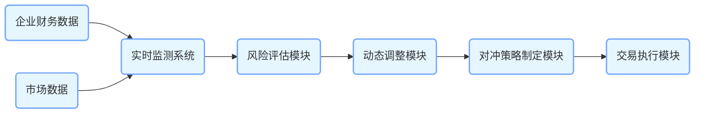

# 设计智能化的企业财务风险敞口动态调整与对冲模型

> 关键词：企业财务风险敞口、动态调整、对冲模型、智能化设计、风险管理

> 摘要：本文聚焦于设计智能化的企业财务风险敞口动态调整与对冲模型。首先介绍了研究背景、目的、预期读者等内容。深入剖析了核心概念及其联系，详细阐述了核心算法原理与具体操作步骤，并结合 Python 代码进行说明。给出了相关数学模型和公式，通过实际案例展示了模型的应用。探讨了该模型在不同场景下的实际应用，推荐了学习、开发工具等资源。最后总结了未来发展趋势与挑战，解答常见问题并提供扩展阅读和参考资料，旨在为企业提供有效的财务风险管理方案。

## 1. 背景介绍 
### 1.1 目的和范围
企业在经营过程中面临着各种财务风险，如市场风险、信用风险、流动性风险等。财务风险敞口反映了企业在特定风险因素下可能遭受的损失程度。本研究的目的在于设计一个智能化的企业财务风险敞口动态调整与对冲模型，帮助企业实时监控和管理财务风险，通过动态调整风险敞口并采取有效的对冲策略，降低企业面临的风险，提高企业的财务稳定性和抗风险能力。

本研究的范围涵盖了企业财务风险的主要类型，包括但不限于利率风险、汇率风险、商品价格风险等。模型将考虑企业的资产负债结构、业务特点、市场环境等因素，实现对风险敞口的动态评估和调整，并制定相应的对冲策略。

### 1.2 预期读者
本文的预期读者包括企业财务管理人员、风险管理专家、金融分析师、学术研究人员以及对企业财务风险管理感兴趣的人士。对于企业财务管理人员和风险管理专家，本文提供的模型和方法可以帮助他们更好地管理企业的财务风险；对于金融分析师，模型可以作为分析企业财务状况和风险水平的工具；对于学术研究人员，本文的研究成果可以为相关领域的研究提供参考和借鉴。

### 1.3 文档结构概述
本文将按照以下结构进行组织：
1. 背景介绍：阐述研究的目的、范围、预期读者和文档结构概述，以及相关术语的定义和解释。
2. 核心概念与联系：介绍企业财务风险敞口、动态调整和对冲的核心概念，分析它们之间的联系，并通过文本示意图和 Mermaid 流程图进行展示。
3. 核心算法原理 & 具体操作步骤：详细介绍模型的核心算法原理，包括风险评估、动态调整和对冲策略的制定，并给出具体的操作步骤和 Python 代码实现。
4. 数学模型和公式 & 详细讲解 & 举例说明：给出模型的数学模型和公式，对其进行详细讲解，并通过实际例子进行说明。
5. 项目实战：代码实际案例和详细解释说明：通过一个实际的项目案例，展示模型的具体实现过程，包括开发环境搭建、源代码详细实现和代码解读。
6. 实际应用场景：探讨模型在不同实际场景下的应用，如跨国企业的汇率风险管理、金融机构的利率风险管理等。
7. 工具和资源推荐：推荐相关的学习资源、开发工具框架和论文著作，帮助读者进一步深入学习和研究。
8. 总结：未来发展趋势与挑战：总结研究成果，分析未来的发展趋势和面临的挑战。
9. 附录：常见问题与解答：解答读者在阅读和使用模型过程中可能遇到的常见问题。
10. 扩展阅读 & 参考资料：提供相关的扩展阅读材料和参考资料，方便读者进一步查阅。

### 1.4 术语表
#### 1.4.1 核心术语定义
- **财务风险敞口**：指企业在特定风险因素下可能遭受的潜在损失程度，通常用货币金额或百分比来表示。
- **动态调整**：根据市场环境、企业财务状况等因素的变化，实时调整企业的财务风险敞口，以适应不同的风险状况。
- **对冲**：通过采取相反的交易策略，抵消或降低企业面临的财务风险。例如，通过买入或卖出期货合约、期权合约等金融衍生品来对冲市场风险。
- **智能化**：利用人工智能技术，如机器学习、深度学习等，实现对企业财务风险的自动识别、评估和管理。

#### 1.4.2 相关概念解释
- **市场风险**：指由于市场价格波动（如利率、汇率、股票价格、商品价格等）导致企业资产价值或负债成本发生变化的风险。
- **信用风险**：指交易对手未能履行合同义务而导致企业遭受损失的风险。
- **流动性风险**：指企业无法及时以合理价格变现资产或筹集资金，从而影响企业正常经营的风险。

#### 1.4.3 缩略词列表
- **VaR**：Value at Risk，风险价值，是一种常用的风险度量指标，用于衡量在一定置信水平下，企业在未来一段时间内可能遭受的最大损失。
- **CVaR**：Conditional Value at Risk，条件风险价值，是在 VaR 的基础上发展而来的一种风险度量指标，考虑了超过 VaR 的损失情况。
- **AI**：Artificial Intelligence，人工智能，是一门研究如何使计算机模拟人类智能的学科。
- **ML**：Machine Learning，机器学习，是人工智能的一个重要分支，研究如何让计算机通过数据学习来自动改进性能。

## 2. 核心概念与联系 
### 核心概念原理
#### 企业财务风险敞口
企业财务风险敞口是企业面临的各种风险因素的综合体现。它受到多种因素的影响，包括市场因素（如利率、汇率、商品价格等）、信用因素（如交易对手的信用状况）和企业自身的财务状况（如资产负债结构、现金流状况等）。企业财务风险敞口的计算通常基于企业的资产负债表和现金流表，通过对不同风险因素的暴露程度进行量化分析来确定。

#### 动态调整
动态调整是指根据市场环境和企业财务状况的变化，实时调整企业的财务风险敞口。这需要建立一个实时监测系统，对市场数据和企业财务数据进行实时采集和分析。当市场环境或企业财务状况发生变化时，系统能够及时发出警报，并根据预设的规则和算法，自动调整企业的资产配置、负债结构或交易策略，以降低企业的财务风险敞口。

#### 对冲
对冲是一种风险管理策略，通过采取相反的交易策略来抵消或降低企业面临的财务风险。常见的对冲工具包括期货合约、期权合约、互换合约等金融衍生品。例如，企业可以通过买入或卖出期货合约来对冲商品价格风险，通过买入或卖出期权合约来对冲汇率风险等。对冲的核心思想是通过建立一个与原风险头寸相反的头寸，使得在市场价格波动时，两个头寸的损益能够相互抵消，从而降低企业的整体风险。

### 架构的文本示意图
```plaintext
企业财务数据  +  市场数据
       |               |
       V               V
实时监测系统
       |
       V
风险评估模块
       |
       V
动态调整模块
       |
       V
对冲策略制定模块
       |
       V
交易执行模块
```

### Mermaid 流程图


## 3. 核心算法原理 & 具体操作步骤 
### 风险评估算法原理
风险评估是模型的核心环节之一，其目的是量化企业面临的财务风险敞口。常用的风险评估方法包括风险价值（VaR）和条件风险价值（CVaR）。

#### VaR 算法原理
VaR 是一种衡量在一定置信水平下，企业在未来一段时间内可能遭受的最大损失的风险度量指标。其基本思想是通过对历史数据的分析，建立资产收益率的概率分布模型，然后根据该模型计算在给定置信水平下的最大损失。

Python 代码实现：
```python
import numpy as np
import pandas as pd
from scipy.stats import norm

def calculate_var(returns, confidence_level=0.95):
    """
    计算风险价值（VaR）
    :param returns: 资产收益率序列
    :param confidence_level: 置信水平
    :return: VaR 值
    """
    mu = np.mean(returns)
    sigma = np.std(returns)
    z = norm.ppf(1 - confidence_level)
    var = mu + z * sigma
    return var

# 示例数据
returns = np.random.normal(0, 0.01, 1000)
var = calculate_var(returns)
print(f"VaR 值: {var}")
```

#### CVaR 算法原理
CVaR 是在 VaR 的基础上发展而来的一种风险度量指标，它考虑了超过 VaR 的损失情况。CVaR 表示在给定置信水平下，超过 VaR 的损失的期望值。

Python 代码实现：
```python
def calculate_cvar(returns, confidence_level=0.95):
    """
    计算条件风险价值（CVaR）
    :param returns: 资产收益率序列
    :param confidence_level: 置信水平
    :return: CVaR 值
    """
    var = calculate_var(returns, confidence_level)
    tail_returns = returns[returns < var]
    cvar = np.mean(tail_returns)
    return cvar

cvar = calculate_cvar(returns)
print(f"CVaR 值: {cvar}")
```

### 动态调整算法原理
动态调整算法的核心思想是根据风险评估的结果，实时调整企业的财务风险敞口。具体操作步骤如下：
1. 设定风险阈值：根据企业的风险承受能力和经营目标，设定风险敞口的上限和下限。
2. 实时监测：实时监测企业的财务风险敞口和市场环境的变化。
3. 比较判断：将实时监测到的风险敞口与设定的风险阈值进行比较。
4. 调整策略：如果风险敞口超过上限，则采取降低风险敞口的措施；如果风险敞口低于下限，则考虑适当增加风险敞口以获取更高的收益。

Python 代码实现：
```python
def dynamic_adjustment(risk_exposure, upper_threshold, lower_threshold):
    """
    动态调整风险敞口
    :param risk_exposure: 当前风险敞口
    :param upper_threshold: 风险敞口上限
    :param lower_threshold: 风险敞口下限
    :return: 调整建议
    """
    if risk_exposure > upper_threshold:
        return "降低风险敞口"
    elif risk_exposure < lower_threshold:
        return "适当增加风险敞口"
    else:
        return "维持当前风险敞口"

# 示例数据
risk_exposure = 0.1
upper_threshold = 0.15
lower_threshold = 0.05
adjustment_suggestion = dynamic_adjustment(risk_exposure, upper_threshold, lower_threshold)
print(f"调整建议: {adjustment_suggestion}")
```

### 对冲策略制定算法原理
对冲策略制定算法的目的是根据风险评估和动态调整的结果，选择合适的对冲工具和交易策略，以降低企业的财务风险敞口。常见的对冲策略包括完全对冲、部分对冲和选择性对冲等。

Python 代码实现：
```python
def hedge_strategy(risk_exposure, adjustment_suggestion):
    """
    制定对冲策略
    :param risk_exposure: 当前风险敞口
    :param adjustment_suggestion: 调整建议
    :return: 对冲策略
    """
    if adjustment_suggestion == "降低风险敞口":
        return "采取完全对冲策略"
    elif adjustment_suggestion == "适当增加风险敞口":
        return "不进行对冲或采取部分对冲策略"
    else:
        return "维持当前对冲策略"

hedge_suggestion = hedge_strategy(risk_exposure, adjustment_suggestion)
print(f"对冲策略建议: {hedge_suggestion}")
```

### 具体操作步骤
1. **数据采集**：实时采集企业的财务数据和市场数据，包括资产负债表、现金流表、利率、汇率、商品价格等。
2. **风险评估**：使用上述风险评估算法，计算企业的财务风险敞口，如 VaR 和 CVaR。
3. **动态调整**：根据风险评估的结果，使用动态调整算法，判断是否需要调整风险敞口，并给出调整建议。
4. **对冲策略制定**：根据动态调整的结果，使用对冲策略制定算法，选择合适的对冲工具和交易策略。
5. **交易执行**：根据制定的对冲策略，执行相应的交易操作，如买入或卖出期货合约、期权合约等。
6. **实时监控**：实时监控市场环境和企业财务状况的变化，重复上述步骤，实现对企业财务风险敞口的动态调整和对冲。

## 4. 数学模型和公式 & 详细讲解 & 举例说明 
### VaR 数学模型和公式
#### 定义
VaR 表示在一定置信水平 $\alpha$ 下，企业在未来一段时间 $\Delta t$ 内可能遭受的最大损失。其数学定义为：
$$P(R \leq -VaR) = 1 - \alpha$$
其中，$R$ 表示资产收益率，$\alpha$ 表示置信水平。

#### 计算方法
在正态分布假设下，VaR 可以通过以下公式计算：
$$VaR = \mu + z_{\alpha} \sigma$$
其中，$\mu$ 表示资产收益率的均值，$\sigma$ 表示资产收益率的标准差，$z_{\alpha}$ 表示标准正态分布的分位数，满足 $P(Z \leq z_{\alpha}) = \alpha$。

#### 举例说明
假设某资产的收益率服从正态分布，均值为 0.01，标准差为 0.02，置信水平为 0.95。则 $z_{0.95} = 1.645$，根据上述公式可得：
$$VaR = 0.01 + 1.645 \times 0.02 = 0.0429$$
这意味着在 95% 的置信水平下，该资产在未来一段时间内可能遭受的最大损失为 4.29%。

### CVaR 数学模型和公式
#### 定义
CVaR 表示在一定置信水平 $\alpha$ 下，超过 VaR 的损失的期望值。其数学定义为：
$$CVaR_{\alpha} = E(R | R \leq -VaR_{\alpha})$$

#### 计算方法
在正态分布假设下，CVaR 可以通过以下公式计算：
$$CVaR = \mu + \frac{\phi(z_{\alpha})}{1 - \alpha} \sigma$$
其中，$\phi(z_{\alpha})$ 表示标准正态分布的概率密度函数在 $z_{\alpha}$ 处的值。

#### 举例说明
仍以上述资产为例，$z_{0.95} = 1.645$，$\phi(1.645) = 0.1031$，则：
$$CVaR = 0.01 + \frac{0.1031}{0.05} \times 0.02 = 0.05124$$
这意味着在 95% 的置信水平下，超过 VaR 的损失的期望值为 5.124%。

### 动态调整数学模型和公式
动态调整的数学模型可以表示为一个优化问题，目标是在满足一定约束条件下，最小化企业的财务风险敞口。假设企业的风险敞口为 $E$，调整策略为 $x$，则动态调整的优化问题可以表示为：
$$\min_{x} f(E(x))$$
$$s.t. \quad g(x) \leq 0$$
其中，$f(E(x))$ 表示风险敞口的目标函数，$g(x)$ 表示约束条件。

### 对冲策略数学模型和公式
对冲策略的数学模型可以根据不同的对冲工具和交易策略进行建立。以期货合约对冲为例，假设企业持有价值为 $V$ 的资产，需要对冲的风险敞口为 $E$，期货合约的价格为 $F$，合约乘数为 $M$，则需要买入或卖出的期货合约数量 $N$ 可以通过以下公式计算：
$$N = \frac{E}{F \times M}$$

## 5. 项目实战：代码实际案例和详细解释说明 
### 5.1  开发环境搭建
#### 安装 Python
首先，需要安装 Python 编程语言。建议使用 Python 3.7 及以上版本。可以从 Python 官方网站（https://www.python.org/downloads/）下载并安装 Python。

#### 安装必要的库
在本项目中，需要使用以下 Python 库：
- `numpy`：用于数值计算。
- `pandas`：用于数据处理和分析。
- `scipy`：用于科学计算和统计分析。

可以使用以下命令安装这些库：
```sh
pip install numpy pandas scipy
```

### 5.2  源代码详细实现和代码解读
以下是一个完整的项目代码示例，实现了企业财务风险敞口的动态调整与对冲模型：
```python
import numpy as np
import pandas as pd
from scipy.stats import norm

# 计算风险价值（VaR）
def calculate_var(returns, confidence_level=0.95):
    mu = np.mean(returns)
    sigma = np.std(returns)
    z = norm.ppf(1 - confidence_level)
    var = mu + z * sigma
    return var

# 计算条件风险价值（CVaR）
def calculate_cvar(returns, confidence_level=0.95):
    var = calculate_var(returns, confidence_level)
    tail_returns = returns[returns < var]
    cvar = np.mean(tail_returns)
    return cvar

# 动态调整风险敞口
def dynamic_adjustment(risk_exposure, upper_threshold, lower_threshold):
    if risk_exposure > upper_threshold:
        return "降低风险敞口"
    elif risk_exposure < lower_threshold:
        return "适当增加风险敞口"
    else:
        return "维持当前风险敞口"

# 制定对冲策略
def hedge_strategy(risk_exposure, adjustment_suggestion):
    if adjustment_suggestion == "降低风险敞口":
        return "采取完全对冲策略"
    elif adjustment_suggestion == "适当增加风险敞口":
        return "不进行对冲或采取部分对冲策略"
    else:
        return "维持当前对冲策略"

# 示例数据
returns = np.random.normal(0, 0.01, 1000)
upper_threshold = 0.05
lower_threshold = 0.02

# 风险评估
var = calculate_var(returns)
cvar = calculate_cvar(returns)
print(f"VaR 值: {var}")
print(f"CVaR 值: {cvar}")

# 动态调整
adjustment_suggestion = dynamic_adjustment(var, upper_threshold, lower_threshold)
print(f"调整建议: {adjustment_suggestion}")

# 对冲策略制定
hedge_suggestion = hedge_strategy(var, adjustment_suggestion)
print(f"对冲策略建议: {hedge_suggestion}")
```

### 5.3  代码解读与分析
1. **风险评估部分**：
    - `calculate_var` 函数用于计算风险价值（VaR），通过计算资产收益率的均值和标准差，结合标准正态分布的分位数，得到 VaR 值。
    - `calculate_cvar` 函数用于计算条件风险价值（CVaR），先计算 VaR 值，然后筛选出小于 VaR 的收益率数据，计算其均值得到 CVaR 值。

2. **动态调整部分**：
    - `dynamic_adjustment` 函数根据当前风险敞口（这里使用 VaR 表示）与设定的风险阈值进行比较，给出相应的调整建议。

3. **对冲策略制定部分**：
    - `hedge_strategy` 函数根据动态调整的结果，选择合适的对冲策略。

4. **主程序部分**：
    - 生成示例数据，调用上述函数进行风险评估、动态调整和对冲策略制定，并输出结果。

## 6. 实际应用场景 
### 跨国企业的汇率风险管理
跨国企业在进行国际贸易和投资时，面临着汇率波动的风险。通过使用智能化的企业财务风险敞口动态调整与对冲模型，跨国企业可以实时监测汇率变化，评估汇率风险敞口，并根据市场情况动态调整风险敞口和制定对冲策略。例如，当预计汇率将发生不利变化时，企业可以采取买入或卖出外汇期货合约、期权合约等对冲措施，降低汇率波动对企业财务状况的影响。

### 金融机构的利率风险管理
金融机构（如银行、保险公司等）的资产和负债通常受到利率波动的影响。利用本模型，金融机构可以对利率风险敞口进行实时监测和动态调整。例如，当利率上升时，银行的固定利率贷款资产价值可能下降，而浮动利率存款负债成本可能上升。银行可以通过调整资产负债结构、进行利率互换等对冲操作，降低利率风险敞口，提高金融机构的稳定性和盈利能力。

### 企业的商品价格风险管理
对于生产和销售大宗商品的企业，如石油、钢铁、农产品等企业，商品价格波动是其面临的主要风险之一。通过本模型，企业可以实时监测商品价格变化，评估商品价格风险敞口，并根据市场情况动态调整库存水平、采购计划和销售策略。同时，企业可以利用期货合约、期权合约等金融衍生品进行对冲，降低商品价格波动对企业利润的影响。

## 7. 工具和资源推荐
### 7.1 学习资源推荐
#### 7.1.1 书籍推荐
- 《风险管理与金融机构》（John C. Hull 著）：全面介绍了金融风险管理的理论和实践，包括市场风险、信用风险、流动性风险等方面的内容。
- 《金融数学：衍生品定价引论》（M. Baxter 和 A. Rennie 著）：详细讲解了金融衍生品定价的数学模型和方法，为风险管理提供了理论基础。
- 《Python 金融数据分析实战》（魏佳斌 著）：结合 Python 编程语言，介绍了金融数据分析的方法和技巧，包括数据获取、处理、分析和可视化等方面的内容。

#### 7.1.2 在线课程
- Coursera 上的“Financial Risk Management”课程：由纽约大学教授讲授，系统介绍了金融风险管理的理论和方法。
- edX 上的“Python for Finance: Investment Fundamentals and Data Analytics”课程：通过 Python 编程语言，讲解了金融投资分析和风险管理的实际应用。

#### 7.1.3 技术博客和网站
- 量化投资与金融科技（https://www.ziiai.com/）：提供了量化投资和金融科技领域的最新资讯、技术文章和案例分析。
- 金融界（https://www.jrj.com.cn/）：国内知名的金融资讯网站，提供了丰富的金融市场数据和分析报告。

### 7.2 开发工具框架推荐
#### 7.2.1 IDE和编辑器
- PyCharm：一款功能强大的 Python 集成开发环境，提供了代码编辑、调试、版本控制等功能，适合专业的 Python 开发人员使用。
- Jupyter Notebook：一种交互式的开发环境，支持 Python、R 等多种编程语言，适合数据科学和机器学习领域的开发和研究。

#### 7.2.2 调试和性能分析工具
- pdb：Python 自带的调试工具，可以帮助开发人员定位和解决代码中的问题。
- cProfile：Python 自带的性能分析工具，可以分析代码的运行时间和函数调用情况，帮助开发人员优化代码性能。

#### 7.2.3 相关框架和库
- NumPy：用于数值计算和科学计算的 Python 库，提供了高效的数组操作和数学函数。
- Pandas：用于数据处理和分析的 Python 库，提供了数据结构（如 DataFrame）和数据操作方法，方便进行数据清洗、转换和分析。
- Scikit-learn：用于机器学习的 Python 库，提供了各种机器学习算法和工具，如分类、回归、聚类等。

### 7.3 相关论文著作推荐
#### 7.3.1 经典论文
- “Value at Risk: The New Benchmark for Managing Financial Risk”（Philippe Jorion 著）：介绍了风险价值（VaR）的概念和计算方法，是金融风险管理领域的经典论文。
- “On the Pricing of Corporate Debt: The Risk Structure of Interest Rates”（Robert C. Merton 著）：提出了著名的 Merton 模型，用于计算公司债务的信用风险。

#### 7.3.2 最新研究成果
- 关注顶级金融学术期刊，如《Journal of Finance》、《Journal of Financial Economics》等，了解金融风险管理领域的最新研究动态。

#### 7.3.3 应用案例分析
- 各大金融机构和企业的风险管理报告和案例分析，如银行的年度报告、企业的风险管理白皮书等，可以了解实际应用中的风险管理策略和方法。

## 8. 总结：未来发展趋势与挑战
### 未来发展趋势
#### 智能化程度不断提高
随着人工智能技术的不断发展，智能化的企业财务风险敞口动态调整与对冲模型将越来越智能化。模型将能够自动学习和适应市场环境的变化，更加准确地评估风险敞口和制定对冲策略。

#### 与大数据和云计算的深度融合
大数据和云计算技术为企业财务风险管理提供了更强大的数据处理和分析能力。模型将能够实时处理海量的市场数据和企业财务数据，实现更高效的风险评估和动态调整。

#### 跨领域融合发展
企业财务风险管理将与其他领域（如供应链管理、市场营销等）进行更深入的融合。模型将考虑更多的因素，如供应链风险、市场需求变化等，为企业提供更全面的风险管理解决方案。

### 挑战
#### 数据质量和安全问题
模型的准确性和可靠性依赖于高质量的数据。然而，数据质量问题（如数据缺失、错误、不一致等）和数据安全问题（如数据泄露、篡改等）仍然是企业面临的挑战。

#### 模型复杂性和可解释性
随着模型的智能化程度不断提高，模型的复杂性也会增加。如何保证模型的可解释性，让企业管理人员能够理解和信任模型的决策结果，是一个亟待解决的问题。

#### 法律法规和监管要求
企业财务风险管理受到法律法规和监管要求的约束。如何确保模型的设计和应用符合相关法律法规和监管要求，是企业需要面对的挑战之一。

## 9. 附录：常见问题与解答
### 问题 1：模型的准确性如何保证？
答：模型的准确性主要依赖于数据质量和算法的合理性。在数据方面，需要确保采集到的数据准确、完整、一致。在算法方面，需要选择合适的风险评估方法和动态调整策略，并进行充分的验证和优化。同时，还可以通过不断更新数据和调整算法，提高模型的准确性。

### 问题 2：模型是否适用于所有企业？
答：模型具有一定的通用性，但不同企业的财务状况、业务特点和风险承受能力不同，需要根据企业的实际情况进行定制化调整。例如，跨国企业和国内企业面临的风险类型和程度可能不同，需要采用不同的风险评估方法和对冲策略。

### 问题 3：如何选择合适的对冲工具？
答：选择合适的对冲工具需要考虑多个因素，如风险类型、风险敞口大小、对冲成本、市场流动性等。常见的对冲工具包括期货合约、期权合约、互换合约等。在选择对冲工具时，需要根据企业的实际情况和市场情况进行综合考虑。

### 问题 4：模型的实施成本高吗？
答：模型的实施成本包括数据采集和处理成本、算法开发和优化成本、系统建设和维护成本等。具体成本取决于企业的规模、业务复杂度和模型的功能要求。一般来说，对于大型企业和金融机构，模型的实施成本相对较高，但从长期来看，模型可以帮助企业降低风险，提高经济效益，具有较高的投资回报率。

## 10. 扩展阅读 & 参考资料
### 扩展阅读
- 《人工智能时代的金融风险管理》：探讨了人工智能技术在金融风险管理中的应用和发展趋势。
- 《企业风险管理最佳实践》：介绍了企业风险管理的最佳实践案例和方法。

### 参考资料
- Jorion, Philippe. Value at Risk: The New Benchmark for Managing Financial Risk. McGraw-Hill, 2007.
- Hull, John C. Options, Futures, and Other Derivatives. Pearson, 2017.
- Merton, Robert C. “On the Pricing of Corporate Debt: The Risk Structure of Interest Rates.” Journal of Finance, vol. 29, no. 2, 1974, pp. 449–470.

作者：AI天才研究院/AI Genius Institute & 禅与计算机程序设计艺术 /Zen And The Art of Computer Programming