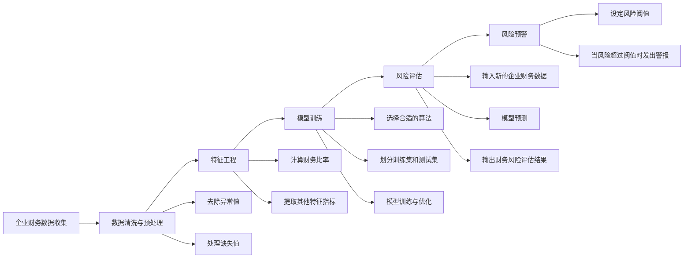

# 设计智能化的企业财务风险量化评估模型

> 关键词：企业财务风险、量化评估模型、智能化设计、机器学习、风险预警

> 摘要：本文围绕智能化的企业财务风险量化评估模型展开，深入探讨其设计原理、算法实现、实际应用等方面。首先介绍了研究的背景、目的和预期读者等内容，接着阐述核心概念与联系，通过数学模型和公式详细解释评估原理。以Python代码实现核心算法，并给出项目实战案例，包括开发环境搭建、代码详细实现与解读。分析了该模型在不同场景下的实际应用，推荐了相关学习资源、开发工具和论文著作。最后总结未来发展趋势与挑战，解答常见问题，并提供扩展阅读和参考资料，旨在为企业准确评估财务风险提供全面的技术支持和理论指导。

## 1. 背景介绍 
### 1.1 目的和范围
企业在经营过程中面临着各种各样的财务风险，如市场波动、信用违约、资金链断裂等。准确评估企业的财务风险对于企业自身的生存和发展、投资者的决策以及金融机构的信贷审批都具有至关重要的意义。本研究的目的是设计一个智能化的企业财务风险量化评估模型，通过对企业财务数据的分析和挖掘，实现对企业财务风险的精准量化评估，并及时发出风险预警。

本研究的范围主要涵盖企业财务风险评估的相关理论和方法，包括传统的财务比率分析、多元统计分析以及新兴的机器学习和人工智能技术。同时，结合实际企业财务数据，构建并验证智能化的财务风险量化评估模型。

### 1.2 预期读者
本文的预期读者包括企业财务管理人员、投资者、金融机构信贷审批人员、数据分析和人工智能领域的研究人员以及对企业财务风险评估感兴趣的相关人士。对于企业财务管理人员，本模型可以帮助他们更好地了解企业的财务状况，制定合理的风险管理策略；投资者可以利用该模型评估投资标的的财务风险，做出更明智的投资决策；金融机构信贷审批人员可以通过该模型提高信贷审批的准确性和效率；数据分析和人工智能领域的研究人员可以从中获取有关企业财务风险评估的新思路和方法。

### 1.3 文档结构概述
本文共分为十个部分。第一部分为背景介绍，阐述研究的目的、范围、预期读者和文档结构概述，并给出相关术语的定义和解释。第二部分介绍核心概念与联系，包括企业财务风险的定义、量化评估的原理以及模型的架构，同时给出文本示意图和Mermaid流程图。第三部分详细讲解核心算法原理和具体操作步骤，通过Python源代码进行阐述。第四部分介绍数学模型和公式，并进行详细讲解和举例说明。第五部分为项目实战，包括开发环境搭建、源代码详细实现和代码解读。第六部分分析模型的实际应用场景。第七部分推荐相关的学习资源、开发工具框架和论文著作。第八部分总结未来发展趋势与挑战。第九部分为附录，解答常见问题。第十部分提供扩展阅读和参考资料。

### 1.4 术语表
#### 1.4.1 核心术语定义
- **企业财务风险**：指企业在各项财务活动中，由于内外部环境及各种难以预料或无法控制的因素影响，使企业财务状况具有不确定性，从而使企业有蒙受损失的可能性。
- **量化评估模型**：通过建立数学模型和算法，将企业财务风险用具体的数值或指标来表示，以便更准确地评估和比较企业的财务风险水平。
- **智能化**：指模型利用机器学习、人工智能等技术，自动从大量数据中学习和挖掘规律，实现对企业财务风险的智能评估和预测。
- **风险预警**：当企业财务风险达到一定程度时，模型及时发出警报，提醒企业管理人员或相关利益者采取相应的措施。

#### 1.4.2 相关概念解释
- **财务比率分析**：通过计算企业财务报表中的各种比率，如偿债能力比率、盈利能力比率、营运能力比率等，来评估企业的财务状况和经营绩效。
- **多元统计分析**：包括主成分分析、因子分析、判别分析等方法，用于处理多个变量之间的关系，提取主要信息，降低数据维度。
- **机器学习**：是一门多领域交叉学科，涉及概率论、统计学、逼近论、凸分析、算法复杂度理论等多门学科。它专门研究计算机怎样模拟或实现人类的学习行为，以获取新的知识或技能，重新组织已有的知识结构使之不断改善自身的性能。在企业财务风险评估中，常用的机器学习算法包括逻辑回归、决策树、随机森林、支持向量机等。

#### 1.4.3 缩略词列表
- **PCA**：Principal Component Analysis，主成分分析
- **LR**：Logistic Regression，逻辑回归
- **DT**：Decision Tree，决策树
- **RF**：Random Forest，随机森林
- **SVM**：Support Vector Machine，支持向量机

## 2. 核心概念与联系 

### 核心概念原理
企业财务风险量化评估的核心原理是通过对企业的财务数据进行分析和处理，提取能够反映企业财务风险的特征指标，然后利用这些指标构建评估模型，对企业的财务风险进行量化评估。具体来说，首先需要收集企业的财务报表数据，包括资产负债表、利润表和现金流量表等，然后对这些数据进行清洗和预处理，去除异常值和缺失值。接着，计算各种财务比率和其他特征指标，如偿债能力指标、盈利能力指标、营运能力指标等。最后，利用机器学习或统计分析方法，建立评估模型，将这些特征指标作为输入，输出企业的财务风险评估结果。

### 架构的文本示意图
```plaintext
企业财务数据收集
|
|-- 数据清洗与预处理
|   |
|   |-- 去除异常值
|   |-- 处理缺失值
|
|-- 特征工程
|   |
|   |-- 计算财务比率
|   |-- 提取其他特征指标
|
|-- 模型训练
|   |
|   |-- 选择合适的算法
|   |-- 划分训练集和测试集
|   |-- 模型训练与优化
|
|-- 风险评估
|   |
|   |-- 输入新的企业财务数据
|   |-- 模型预测
|   |-- 输出财务风险评估结果
|
|-- 风险预警
|   |
|   |-- 设定风险阈值
|   |-- 当风险超过阈值时发出警报
```

### Mermaid 流程图


## 3. 核心算法原理 & 具体操作步骤 

### 核心算法原理
本模型采用逻辑回归算法作为核心算法。逻辑回归是一种广泛应用于分类问题的统计学习方法，它通过对输入特征进行线性组合，然后通过逻辑函数将线性组合的结果映射到[0, 1]区间，从而得到样本属于某个类别的概率。在企业财务风险评估中，我们可以将企业的财务风险分为两类：高风险和低风险，逻辑回归算法可以根据企业的财务特征指标计算出企业属于高风险类别的概率，从而实现对企业财务风险的量化评估。

逻辑回归的基本公式如下：
$$P(Y = 1|X) = \frac{1}{1 + e^{-(w_0 + w_1x_1 + w_2x_2 + \cdots + w_nx_n)}}$$
其中，$P(Y = 1|X)$ 表示在给定特征向量 $X = (x_1, x_2, \cdots, x_n)$ 的情况下，样本属于正类（高风险）的概率；$w_0, w_1, w_2, \cdots, w_n$ 是模型的参数；$e$ 是自然常数。

### 具体操作步骤
#### 步骤1：数据收集与预处理
首先，收集企业的财务报表数据，包括资产负债表、利润表和现金流量表等。然后，对这些数据进行清洗和预处理，去除异常值和缺失值。可以使用以下Python代码实现：
```python
import pandas as pd
import numpy as np

# 读取财务数据
data = pd.read_csv('financial_data.csv')

# 去除异常值
def remove_outliers(data, columns):
    for column in columns:
        Q1 = data[column].quantile(0.25)
        Q3 = data[column].quantile(0.75)
        IQR = Q3 - Q1
        lower_bound = Q1 - 1.5 * IQR
        upper_bound = Q3 + 1.5 * IQR
        data = data[(data[column] >= lower_bound) & (data[column] <= upper_bound)]
    return data

# 处理缺失值
def handle_missing_values(data):
    data = data.fillna(data.mean())
    return data

# 选择需要处理的列
columns = ['column1', 'column2',...]  # 替换为实际的列名

# 去除异常值
data = remove_outliers(data, columns)

# 处理缺失值
data = handle_missing_values(data)
```

#### 步骤2：特征工程
计算各种财务比率和其他特征指标，如偿债能力指标、盈利能力指标、营运能力指标等。可以使用以下Python代码实现：
```python
# 计算财务比率
data['current_ratio'] = data['current_assets'] / data['current_liabilities']
data['debt_ratio'] = data['total_liabilities'] / data['total_assets']
data['return_on_equity'] = data['net_income'] / data['shareholders_equity']

# 选择特征和标签
features = data[['current_ratio', 'debt_ratio', 'return_on_equity']]
labels = data['risk_label']
```

#### 步骤3：模型训练
划分训练集和测试集，使用逻辑回归算法进行模型训练。可以使用以下Python代码实现：
```python
from sklearn.model_selection import train_test_split
from sklearn.linear_model import LogisticRegression
from sklearn.metrics import accuracy_score

# 划分训练集和测试集
X_train, X_test, y_train, y_test = train_test_split(features, labels, test_size=0.2, random_state=42)

# 创建逻辑回归模型
model = LogisticRegression()

# 模型训练
model.fit(X_train, y_train)

# 模型预测
y_pred = model.predict(X_test)

# 计算准确率
accuracy = accuracy_score(y_test, y_pred)
print(f"模型准确率: {accuracy}")
```

#### 步骤4：风险评估
输入新的企业财务数据，使用训练好的模型进行预测，输出企业的财务风险评估结果。可以使用以下Python代码实现：
```python
# 新的企业财务数据
new_data = pd.DataFrame({
    'current_ratio': [2.0],
    'debt_ratio': [0.5],
    'return_on_equity': [0.1]
})

# 模型预测
risk_probability = model.predict_proba(new_data)[:, 1]
print(f"企业属于高风险类别的概率: {risk_probability[0]}")
```

## 4. 数学模型和公式 & 详细讲解 & 举例说明 

### 逻辑回归模型的数学推导
逻辑回归模型的目标是找到一组参数 $w = (w_0, w_1, w_2, \cdots, w_n)$，使得模型对训练数据的似然函数最大。似然函数定义为：
$$L(w) = \prod_{i=1}^{m} P(y^{(i)}|x^{(i)}; w)$$
其中，$m$ 是训练样本的数量；$x^{(i)}$ 是第 $i$ 个样本的特征向量；$y^{(i)}$ 是第 $i$ 个样本的标签（0 或 1）；$P(y^{(i)}|x^{(i)}; w)$ 表示在给定特征向量 $x^{(i)}$ 和参数 $w$ 的情况下，样本 $i$ 属于标签 $y^{(i)}$ 的概率。

为了方便计算，通常对似然函数取对数，得到对数似然函数：
$$\ell(w) = \log L(w) = \sum_{i=1}^{m} [y^{(i)} \log P(y^{(i)} = 1|x^{(i)}; w) + (1 - y^{(i)}) \log (1 - P(y^{(i)} = 1|x^{(i)}; w))]$$

我们的目标是最大化对数似然函数 $\ell(w)$，可以使用梯度上升法来求解。梯度上升法的更新公式为：
$$w_j := w_j + \alpha \frac{\partial \ell(w)}{\partial w_j}$$
其中，$\alpha$ 是学习率；$\frac{\partial \ell(w)}{\partial w_j}$ 是对数似然函数关于参数 $w_j$ 的偏导数。

### 详细讲解
逻辑回归模型通过对输入特征进行线性组合，然后通过逻辑函数将线性组合的结果映射到[0, 1]区间，从而得到样本属于某个类别的概率。逻辑函数的形状是一个 S 形曲线，它可以将任意实数映射到[0, 1]区间，非常适合用于分类问题。

在训练逻辑回归模型时，我们通过最大化对数似然函数来找到最优的参数 $w$。对数似然函数表示模型对训练数据的拟合程度，最大化对数似然函数可以使模型对训练数据的预测结果尽可能接近真实标签。

### 举例说明
假设我们有一个简单的二分类问题，有两个特征 $x_1$ 和 $x_2$，标签 $y$ 取值为 0 或 1。我们收集了以下训练数据：
| $x_1$ | $x_2$ | $y$ |
|-------|-------|-----|
| 1     | 2     | 0   |
| 2     | 3     | 0   |
| 3     | 4     | 1   |
| 4     | 5     | 1   |

我们可以使用逻辑回归模型来对这些数据进行训练，并预测新的样本属于哪个类别。首先，我们需要计算线性组合：
$$z = w_0 + w_1x_1 + w_2x_2$$
然后，通过逻辑函数将 $z$ 映射到[0, 1]区间：
$$P(Y = 1|X) = \frac{1}{1 + e^{-z}}$$

假设我们已经通过训练得到了最优的参数 $w_0 = -1$，$w_1 = 0.5$，$w_2 = 0.3$。现在我们有一个新的样本 $x_1 = 5$，$x_2 = 6$，我们可以计算：
$$z = -1 + 0.5 \times 5 + 0.3 \times 6 = -1 + 2.5 + 1.8 = 3.3$$
$$P(Y = 1|X) = \frac{1}{1 + e^{-3.3}} \approx 0.96$$

由于 $P(Y = 1|X) \approx 0.96$ 大于 0.5，我们可以预测这个新的样本属于正类（标签为 1）。

## 5. 项目实战：代码实际案例和详细解释说明 

### 5.1  开发环境搭建
#### 操作系统
本项目可以在 Windows、Linux 或 macOS 操作系统上进行开发，推荐使用 Linux 或 macOS 系统，因为它们对 Python 开发环境的支持更好。

#### Python 环境
安装 Python 3.7 或更高版本。可以从 Python 官方网站（https://www.python.org/downloads/）下载并安装 Python。

#### 第三方库
安装以下第三方库：
- pandas：用于数据处理和分析。
- numpy：用于数值计算。
- scikit-learn：用于机器学习算法的实现。

可以使用以下命令安装这些库：
```sh
pip install pandas numpy scikit-learn
```

### 5.2  源代码详细实现和代码解读
以下是一个完整的 Python 代码示例，用于实现智能化的企业财务风险量化评估模型：
```python
import pandas as pd
import numpy as np
from sklearn.model_selection import train_test_split
from sklearn.linear_model import LogisticRegression
from sklearn.metrics import accuracy_score

# 读取财务数据
data = pd.read_csv('financial_data.csv')

# 去除异常值
def remove_outliers(data, columns):
    for column in columns:
        Q1 = data[column].quantile(0.25)
        Q3 = data[column].quantile(0.75)
        IQR = Q3 - Q1
        lower_bound = Q1 - 1.5 * IQR
        upper_bound = Q3 + 1.5 * IQR
        data = data[(data[column] >= lower_bound) & (data[column] <= upper_bound)]
    return data

# 处理缺失值
def handle_missing_values(data):
    data = data.fillna(data.mean())
    return data

# 选择需要处理的列
columns = ['column1', 'column2',...]  # 替换为实际的列名

# 去除异常值
data = remove_outliers(data, columns)

# 处理缺失值
data = handle_missing_values(data)

# 计算财务比率
data['current_ratio'] = data['current_assets'] / data['current_liabilities']
data['debt_ratio'] = data['total_liabilities'] / data['total_assets']
data['return_on_equity'] = data['net_income'] / data['shareholders_equity']

# 选择特征和标签
features = data[['current_ratio', 'debt_ratio', 'return_on_equity']]
labels = data['risk_label']

# 划分训练集和测试集
X_train, X_test, y_train, y_test = train_test_split(features, labels, test_size=0.2, random_state=42)

# 创建逻辑回归模型
model = LogisticRegression()

# 模型训练
model.fit(X_train, y_train)

# 模型预测
y_pred = model.predict(X_test)

# 计算准确率
accuracy = accuracy_score(y_test, y_pred)
print(f"模型准确率: {accuracy}")

# 新的企业财务数据
new_data = pd.DataFrame({
    'current_ratio': [2.0],
    'debt_ratio': [0.5],
    'return_on_equity': [0.1]
})

# 模型预测
risk_probability = model.predict_proba(new_data)[:, 1]
print(f"企业属于高风险类别的概率: {risk_probability[0]}")
```

### 5.3  代码解读与分析
#### 数据读取与预处理
- `pd.read_csv('financial_data.csv')`：使用 pandas 库读取财务数据文件。
- `remove_outliers` 函数：通过计算四分位数间距（IQR）来去除异常值。
- `handle_missing_values` 函数：使用均值填充缺失值。

#### 特征工程
- 计算财务比率，如流动比率、资产负债率和净资产收益率等。
- 选择特征和标签，将计算得到的财务比率作为特征，企业的财务风险标签作为标签。

#### 模型训练与评估
- `train_test_split` 函数：将数据集划分为训练集和测试集，测试集占比为 20%。
- `LogisticRegression` 类：创建逻辑回归模型。
- `model.fit(X_train, y_train)`：使用训练集数据对模型进行训练。
- `model.predict(X_test)`：使用测试集数据进行预测。
- `accuracy_score(y_test, y_pred)`：计算模型的准确率。

#### 风险评估
- 创建新的企业财务数据，使用训练好的模型进行预测，输出企业属于高风险类别的概率。

## 6. 实际应用场景 
### 企业内部财务管理
企业可以使用智能化的财务风险量化评估模型对自身的财务状况进行实时监控和评估。通过定期输入财务数据，模型可以及时发现企业潜在的财务风险，如偿债能力不足、盈利能力下降等，并发出风险预警。企业财务管理人员可以根据评估结果制定相应的风险管理策略，如调整资金结构、优化成本控制等，以降低企业的财务风险。

### 投资者决策
投资者在进行投资决策时，需要对投资标的的财务风险进行评估。智能化的财务风险量化评估模型可以为投资者提供客观、准确的财务风险评估结果，帮助投资者更好地了解投资标的的财务状况，从而做出更明智的投资决策。例如，投资者可以根据模型的评估结果选择财务风险较低的企业进行投资，以降低投资风险。

### 金融机构信贷审批
金融机构在进行信贷审批时，需要对借款人的财务状况和还款能力进行评估。智能化的财务风险量化评估模型可以帮助金融机构更准确地评估借款人的财务风险，提高信贷审批的准确性和效率。金融机构可以根据模型的评估结果决定是否给予借款人贷款以及贷款的额度和利率等。

### 监管部门监管
监管部门可以使用智能化的财务风险量化评估模型对企业的财务状况进行监管。通过对企业财务数据的分析和评估，监管部门可以及时发现企业的财务违规行为和潜在的金融风险，采取相应的监管措施，维护金融市场的稳定和健康发展。

## 7. 工具和资源推荐
### 7.1 学习资源推荐
#### 7.1.1 书籍推荐
- 《Python 数据分析实战》：本书介绍了使用 Python 进行数据分析的基本方法和技巧，包括数据处理、数据可视化、机器学习等内容，适合初学者入门。
- 《机器学习》（周志华著）：本书是机器学习领域的经典教材，系统地介绍了机器学习的基本概念、算法和应用，适合有一定编程基础的读者深入学习。
- 《财务报表分析》：本书详细介绍了企业财务报表的分析方法和技巧，包括资产负债表、利润表和现金流量表的分析，对于理解企业财务状况和进行财务风险评估非常有帮助。

#### 7.1.2 在线课程
- Coursera 上的《机器学习》课程：由斯坦福大学教授 Andrew Ng 授课，是一门非常经典的机器学习课程，涵盖了机器学习的基本概念、算法和应用。
- edX 上的《Python 数据科学》课程：介绍了使用 Python 进行数据科学的基本方法和技巧，包括数据处理、数据分析、机器学习等内容。
- 网易云课堂上的《企业财务风险管理》课程：专门介绍企业财务风险管理的理论和实践，对于了解企业财务风险评估和管理非常有帮助。

#### 7.1.3 技术博客和网站
- 博客园：一个技术博客平台，有很多关于数据分析、机器学习和财务风险评估的技术文章。
- 开源中国：提供了大量的开源项目和技术文章，对于学习和实践有很大的帮助。
- Kaggle：一个数据科学竞赛平台，上面有很多关于企业财务风险评估的数据集和优秀的解决方案，可以学习和借鉴。

### 7.2 开发工具框架推荐
#### 7.2.1 IDE和编辑器
- PyCharm：一款专业的 Python 集成开发环境，具有代码编辑、调试、版本控制等功能，适合大型项目的开发。
- Jupyter Notebook：一个交互式的开发环境，支持 Python、R 等多种编程语言，适合数据探索和分析。
- Visual Studio Code：一款轻量级的代码编辑器，支持多种编程语言和插件扩展，适合快速开发和调试。

#### 7.2.2 调试和性能分析工具
- PDB：Python 自带的调试工具，可以帮助我们在代码中设置断点、查看变量值等，进行代码调试。
- cProfile：Python 自带的性能分析工具，可以帮助我们分析代码的运行时间和内存使用情况，找出性能瓶颈。
- TensorBoard：一个可视化工具，主要用于深度学习模型的训练过程监控和可视化，可以帮助我们更好地理解模型的训练过程和性能。

#### 7.2.3 相关框架和库
- pandas：用于数据处理和分析的 Python 库，提供了丰富的数据结构和数据操作方法。
- numpy：用于数值计算的 Python 库，提供了高效的数组操作和数学函数。
- scikit-learn：一个强大的机器学习库，提供了各种机器学习算法和工具，如分类、回归、聚类等。
- TensorFlow：一个开源的深度学习框架，广泛应用于图像识别、自然语言处理等领域。

### 7.3 相关论文著作推荐
#### 7.3.1 经典论文
- Altman, E. I. (1968). Financial ratios, discriminant analysis and the prediction of corporate bankruptcy. The Journal of Finance, 23(4), 589-609. 这篇论文提出了著名的 Z-Score 模型，用于预测企业的破产风险，是企业财务风险评估领域的经典之作。
- Ohlson, J. A. (1980). Financial ratios and the probabilistic prediction of bankruptcy. Journal of Accounting Research, 18(1), 109-131. 该论文提出了 O-Score 模型，通过多元逻辑回归方法对企业的破产风险进行预测。

#### 7.3.2 最新研究成果
- 近年来，随着机器学习和人工智能技术的发展，越来越多的研究将这些技术应用于企业财务风险评估中。例如，一些研究使用深度学习模型，如神经网络、循环神经网络等，对企业的财务数据进行分析和预测，取得了较好的效果。

#### 7.3.3 应用案例分析
- 一些金融机构和企业已经开始应用智能化的财务风险量化评估模型进行风险管理。例如，银行可以使用模型对借款人的信用风险进行评估，企业可以使用模型对自身的财务状况进行监控和预警。这些应用案例可以为我们提供实际的参考和借鉴。

## 8. 总结：未来发展趋势与挑战
### 未来发展趋势
#### 融合多源数据
未来的企业财务风险量化评估模型将不仅仅依赖于企业的财务报表数据，还将融合更多的多源数据，如市场数据、行业数据、社交媒体数据等。通过综合分析这些多源数据，可以更全面、准确地评估企业的财务风险。

#### 智能化程度不断提高
随着人工智能技术的不断发展，企业财务风险量化评估模型的智能化程度将不断提高。模型将能够自动学习和适应新的数据和环境，实现更精准的风险评估和预测。例如，模型可以自动调整特征工程方法和算法参数，以提高模型的性能。

#### 与区块链技术结合
区块链技术具有去中心化、不可篡改、安全可靠等特点，可以为企业财务风险评估提供更加可信的数据来源。未来的模型可能会与区块链技术结合，实现对企业财务数据的安全存储和共享，提高数据的质量和可信度。

#### 实时监控和预警
未来的模型将能够实现对企业财务风险的实时监控和预警。通过实时获取企业的财务数据和相关信息，模型可以及时发现企业潜在的财务风险，并发出预警信号，帮助企业和相关利益者及时采取措施应对风险。

### 挑战
#### 数据质量问题
企业财务数据的质量直接影响模型的评估结果。然而，实际中的财务数据可能存在缺失值、异常值、错误数据等问题，这些问题会影响模型的准确性和可靠性。因此，如何提高数据质量，保证数据的准确性和完整性，是一个需要解决的重要问题。

#### 模型可解释性问题
一些复杂的机器学习和人工智能模型，如深度学习模型，虽然在性能上表现优异，但模型的可解释性较差。在企业财务风险评估中，模型的可解释性非常重要，因为企业和相关利益者需要了解模型的评估结果是如何得出的。因此，如何提高模型的可解释性，是一个需要解决的挑战。

#### 技术更新换代快
人工智能和机器学习技术发展迅速，新的算法和模型不断涌现。企业和研究人员需要不断学习和掌握新的技术，及时更新模型，以保持模型的先进性和有效性。这对企业和研究人员的技术能力和学习能力提出了较高的要求。

#### 法律法规和监管问题
随着智能化的企业财务风险量化评估模型的广泛应用，相关的法律法规和监管问题也逐渐凸显。例如，模型的使用可能会涉及到数据隐私、数据安全等问题，需要制定相应的法律法规和监管政策来规范模型的使用。

## 9. 附录：常见问题与解答
### 问题1：如何选择合适的特征指标？
选择合适的特征指标需要考虑多个因素，包括指标的相关性、可解释性和数据的可获取性。一般来说，可以从偿债能力、盈利能力、营运能力等方面选择相关的财务比率作为特征指标。同时，也可以结合行业特点和企业实际情况，选择一些其他的特征指标。在选择特征指标时，可以使用相关性分析、特征重要性排序等方法来筛选出最有价值的特征指标。

### 问题2：模型的准确率不高怎么办？
如果模型的准确率不高，可以从以下几个方面进行改进：
- 数据预处理：检查数据是否存在异常值、缺失值等问题，对数据进行清洗和预处理，提高数据质量。
- 特征工程：尝试选择不同的特征指标，或者对特征进行变换和组合，以提高特征的表达能力。
- 算法选择：尝试使用不同的机器学习算法，如决策树、随机森林、支持向量机等，比较不同算法的性能，选择最优的算法。
- 模型调优：对模型的参数进行调优，如逻辑回归的正则化参数、决策树的树深度等，可以使用网格搜索、随机搜索等方法来寻找最优的参数组合。

### 问题3：如何评估模型的性能？
除了准确率之外，还可以使用其他指标来评估模型的性能，如精确率、召回率、F1 值、ROC 曲线和 AUC 值等。精确率表示模型预测为正类的样本中实际为正类的比例；召回率表示实际为正类的样本中被模型预测为正类的比例；F1 值是精确率和召回率的调和平均数；ROC 曲线是以假正率为横轴，真正率为纵轴绘制的曲线，AUC 值是 ROC 曲线下的面积，AUC 值越大，模型的性能越好。

### 问题4：模型可以应用于不同行业的企业吗？
模型可以应用于不同行业的企业，但需要根据不同行业的特点进行调整和优化。不同行业的企业财务状况和经营模式可能存在较大差异，因此需要选择适合该行业的特征指标，并对模型的参数进行调整。同时，也可以收集不同行业的企业数据，对模型进行训练和验证，以提高模型的通用性和适用性。

## 10. 扩展阅读 & 参考资料
### 扩展阅读
- 《人工智能：现代方法》：全面介绍了人工智能的基本概念、算法和应用，对于深入了解人工智能技术在企业财务风险评估中的应用有很大的帮助。
- 《数据挖掘：概念与技术》：介绍了数据挖掘的基本方法和技术，包括数据预处理、特征工程、机器学习算法等，对于构建企业财务风险量化评估模型非常有参考价值。
- 《金融风险管理》：详细介绍了金融风险管理的理论和实践，包括市场风险、信用风险、操作风险等的管理方法，对于理解企业财务风险评估的重要性和方法有很大的启发。

### 参考资料
- Altman, E. I. (1968). Financial ratios, discriminant analysis and the prediction of corporate bankruptcy. The Journal of Finance, 23(4), 589-609.
- Ohlson, J. A. (1980). Financial ratios and the probabilistic prediction of bankruptcy. Journal of Accounting Research, 18(1), 109-131.
- 李建良. (2019). 企业财务风险管理. 清华大学出版社.

作者：AI天才研究院/AI Genius Institute & 禅与计算机程序设计艺术 /Zen And The Art of Computer Programming