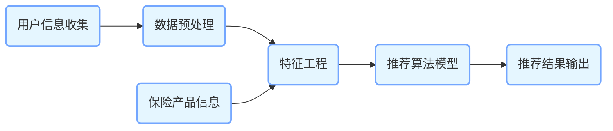

# 设计智能化的保险产品推荐系统

> 关键词：智能化、保险产品推荐系统、核心算法、数学模型、项目实战

> 摘要：本文聚焦于智能化保险产品推荐系统的设计。首先介绍了该系统设计的背景信息，包括目的、预期读者、文档结构和术语表等。接着阐述了系统涉及的核心概念及其联系，给出了原理和架构的示意图与流程图。详细讲解了核心算法原理及具体操作步骤，通过Python代码进行了阐述。深入分析了数学模型和公式，并举例说明。通过项目实战展示了系统的开发环境搭建、源代码实现及解读。探讨了系统的实际应用场景，推荐了相关的学习资源、开发工具框架和论文著作。最后总结了系统未来的发展趋势与挑战，还提供了常见问题解答和扩展阅读参考资料，旨在为相关领域的研究者和开发者提供全面且深入的技术指导。

## 1. 背景介绍 
### 1.1 目的和范围
智能化保险产品推荐系统的设计目的在于为用户提供更加精准、个性化的保险产品推荐服务。传统的保险产品推荐方式往往依赖于销售人员的经验和有限的客户信息，难以满足客户多样化的需求。而智能化推荐系统可以借助大数据、人工智能等技术，对客户的各种信息进行深度分析，从而为客户推荐最适合他们的保险产品。

本系统的范围涵盖了从客户信息收集、数据处理、算法建模到最终推荐结果输出的整个流程。同时，系统还需要考虑与保险公司现有业务系统的集成，确保推荐结果能够在实际业务中得到有效应用。

### 1.2 预期读者
本文的预期读者包括保险行业的从业者，如保险产品设计师、市场营销人员、客户服务人员等，他们可以通过本文了解智能化推荐系统的设计思路和实现方法，从而优化现有的保险产品推荐策略。同时，也适合对人工智能、大数据应用感兴趣的技术人员，如数据分析师、算法工程师、软件开发者等，他们可以从中获取相关的技术知识和实践经验。

### 1.3 文档结构概述
本文将按照以下结构进行阐述：首先介绍背景信息，包括目的、预期读者、文档结构和术语表；接着讲解核心概念与联系，包括系统的原理和架构；然后详细说明核心算法原理及具体操作步骤，并用Python代码进行实现；之后分析数学模型和公式，并举例说明；通过项目实战展示系统的开发过程；探讨系统的实际应用场景；推荐相关的学习资源、开发工具框架和论文著作；最后总结系统的未来发展趋势与挑战，并提供常见问题解答和扩展阅读参考资料。

### 1.4 术语表
#### 1.4.1 核心术语定义
- **智能化推荐系统**：利用人工智能和大数据技术，根据用户的特征和行为数据，为用户提供个性化推荐的系统。
- **保险产品**：保险公司为满足不同客户需求而设计的各类保险服务，如人寿保险、健康保险、财产保险等。
- **特征工程**：将原始数据转换为适合机器学习算法处理的特征的过程。
- **协同过滤**：一种基于用户行为数据的推荐算法，通过寻找与目标用户相似的其他用户或物品来进行推荐。

#### 1.4.2 相关概念解释
- **大数据**：指海量、高增长率和多样化的信息资产，需要新处理模式才能具有更强的决策力、洞察发现力和流程优化能力。
- **人工智能**：研究、开发用于模拟、延伸和扩展人的智能的理论、方法、技术及应用系统的一门新的技术科学。
- **机器学习**：一门多领域交叉学科，涉及概率论、统计学、逼近论、凸分析、算法复杂度理论等多门学科。它专门研究计算机怎样模拟或实现人类的学习行为，以获取新的知识或技能，重新组织已有的知识结构使之不断改善自身的性能。

#### 1.4.3 缩略词列表
- **AI**：Artificial Intelligence，人工智能
- **ML**：Machine Learning，机器学习
- **CF**：Collaborative Filtering，协同过滤

## 2. 核心概念与联系 

### 核心概念原理
智能化保险产品推荐系统的核心原理是基于用户的特征和行为数据，通过机器学习算法建立推荐模型，从而为用户推荐合适的保险产品。系统主要涉及以下几个核心概念：

- **用户特征**：包括用户的基本信息（如年龄、性别、职业等）、财务状况（如收入、资产等）、风险偏好等。这些特征可以帮助系统了解用户的需求和风险承受能力。
- **保险产品特征**：包括保险产品的类型（如人寿保险、健康保险等）、保障范围、保险期限、保费等。这些特征可以帮助系统对保险产品进行分类和描述。
- **推荐算法**：常见的推荐算法包括协同过滤、基于内容的推荐、深度学习推荐等。这些算法可以根据用户特征和保险产品特征，计算用户对不同保险产品的兴趣度，从而进行推荐。

### 架构示意图


### 原理说明
用户信息收集模块负责收集用户的各种信息，包括基本信息、行为数据等。数据预处理模块对收集到的数据进行清洗、转换等操作，以提高数据质量。特征工程模块从预处理后的数据中提取有用的特征，用于构建推荐算法模型。推荐算法模型根据用户特征和保险产品特征，计算用户对不同保险产品的兴趣度，从而生成推荐结果。最后，推荐结果输出模块将推荐结果展示给用户。

## 3. 核心算法原理 & 具体操作步骤 

### 协同过滤算法原理
协同过滤是一种基于用户行为数据的推荐算法，它的基本思想是如果两个用户对某些物品的评价相似，那么他们对其他物品的评价也可能相似。协同过滤算法可以分为基于用户的协同过滤和基于物品的协同过滤。

#### 基于用户的协同过滤
基于用户的协同过滤算法的步骤如下：
1. 计算用户之间的相似度：常用的相似度计算方法包括余弦相似度、皮尔逊相关系数等。
2. 找到与目标用户最相似的K个用户。
3. 根据这K个用户对物品的评价，预测目标用户对未评价物品的评分。

#### 基于物品的协同过滤
基于物品的协同过滤算法的步骤如下：
1. 计算物品之间的相似度。
2. 找到与目标物品最相似的K个物品。
3. 根据目标用户对这K个物品的评价，预测目标用户对目标物品的评分。

### Python代码实现
```python
import numpy as np
from sklearn.metrics.pairwise import cosine_similarity

# 示例用户-物品评分矩阵
ratings = np.array([
    [5, 3, 0, 1],
    [4, 0, 0, 1],
    [1, 1, 0, 5],
    [1, 0, 0, 4],
    [0, 1, 5, 4]
])

# 计算用户之间的相似度
user_similarity = cosine_similarity(ratings)

# 找到与目标用户最相似的K个用户
target_user = 0
K = 2
similar_users = np.argsort(user_similarity[target_user])[::-1][1:K+1]

# 预测目标用户对未评价物品的评分
unrated_items = np.where(ratings[target_user] == 0)[0]
predicted_ratings = []
for item in unrated_items:
    numerator = 0
    denominator = 0
    for similar_user in similar_users:
        numerator += user_similarity[target_user][similar_user] * ratings[similar_user][item]
        denominator += user_similarity[target_user][similar_user]
    if denominator!= 0:
        predicted_rating = numerator / denominator
        predicted_ratings.append(predicted_rating)
    else:
        predicted_ratings.append(0)

print("预测评分:", predicted_ratings)
```

### 代码解释
1. 首先，我们定义了一个示例的用户-物品评分矩阵`ratings`。
2. 然后，使用`cosine_similarity`函数计算用户之间的相似度。
3. 接着，找到与目标用户最相似的K个用户。
4. 最后，对于目标用户未评价的物品，根据相似用户的评分预测目标用户的评分。

## 4. 数学模型和公式 & 详细讲解 & 举例说明 

### 余弦相似度公式
余弦相似度是一种常用的相似度计算方法，它的计算公式如下：
$$
\text{cosine similarity}(u, v) = \frac{\mathbf{u} \cdot \mathbf{v}}{\|\mathbf{u}\| \|\mathbf{v}\|}
$$
其中，$\mathbf{u}$和$\mathbf{v}$是两个向量，$\cdot$表示向量的点积，$\|\mathbf{u}\|$和$\|\mathbf{v}\|$分别表示向量的模。

### 详细讲解
余弦相似度通过计算两个向量之间的夹角余弦值来衡量它们的相似度。余弦值越接近1，表示两个向量越相似；余弦值越接近-1，表示两个向量越不相似。

### 举例说明
假设我们有两个用户的评分向量$\mathbf{u} = [5, 3, 0, 1]$和$\mathbf{v} = [4, 0, 0, 1]$，则它们的余弦相似度计算如下：
$$
\mathbf{u} \cdot \mathbf{v} = 5 \times 4 + 3 \times 0 + 0 \times 0 + 1 \times 1 = 21
$$
$$
\|\mathbf{u}\| = \sqrt{5^2 + 3^2 + 0^2 + 1^2} = \sqrt{35}
$$
$$
\|\mathbf{v}\| = \sqrt{4^2 + 0^2 + 0^2 + 1^2} = \sqrt{17}
$$
$$
\text{cosine similarity}(\mathbf{u}, \mathbf{v}) = \frac{21}{\sqrt{35} \sqrt{17}} \approx 0.85
$$

这表明用户$\mathbf{u}$和用户$\mathbf{v}$的评分比较相似。

## 5. 项目实战：代码实际案例和详细解释说明 

### 5.1  开发环境搭建
#### 安装Python
首先，需要安装Python环境。可以从Python官方网站（https://www.python.org/downloads/）下载适合自己操作系统的Python版本，并按照安装向导进行安装。

#### 安装必要的库
推荐使用Anaconda来管理Python环境和安装必要的库。安装Anaconda后，可以使用以下命令安装所需的库：
```sh
pip install numpy pandas scikit-learn
```

### 5.2  源代码详细实现和代码解读
```python
import pandas as pd
import numpy as np
from sklearn.metrics.pairwise import cosine_similarity

# 读取数据
data = pd.read_csv('insurance_data.csv')

# 数据预处理
# 假设数据中有用户ID、保险产品ID和评分
user_item_matrix = data.pivot(index='user_id', columns='product_id', values='rating').fillna(0)

# 计算用户之间的相似度
user_similarity = cosine_similarity(user_item_matrix)

# 找到与目标用户最相似的K个用户
target_user = 1
K = 3
similar_users = np.argsort(user_similarity[target_user])[::-1][1:K+1]

# 预测目标用户对未评价保险产品的评分
unrated_products = user_item_matrix.iloc[target_user][user_item_matrix.iloc[target_user] == 0].index
predicted_ratings = []
for product in unrated_products:
    numerator = 0
    denominator = 0
    for similar_user in similar_users:
        numerator += user_similarity[target_user][similar_user] * user_item_matrix.iloc[similar_user][product]
        denominator += user_similarity[target_user][similar_user]
    if denominator!= 0:
        predicted_rating = numerator / denominator
        predicted_ratings.append((product, predicted_rating))
    else:
        predicted_ratings.append((product, 0))

# 按预测评分排序
predicted_ratings.sort(key=lambda x: x[1], reverse=True)

# 输出前N个推荐结果
N = 2
recommended_products = [product for product, rating in predicted_ratings[:N]]
print("推荐的保险产品:", recommended_products)
```

### 5.3  代码解读与分析
1. **数据读取**：使用`pandas`库的`read_csv`函数读取保险数据文件。
2. **数据预处理**：将数据转换为用户-物品评分矩阵，并使用`fillna(0)`将缺失值填充为0。
3. **相似度计算**：使用`cosine_similarity`函数计算用户之间的相似度。
4. **寻找相似用户**：找到与目标用户最相似的K个用户。
5. **预测评分**：对于目标用户未评价的保险产品，根据相似用户的评分预测目标用户的评分。
6. **排序和推荐**：将预测评分按降序排序，输出前N个推荐结果。

## 6. 实际应用场景 
### 在线保险平台
在在线保险平台上，智能化保险产品推荐系统可以根据用户的浏览历史、购买记录等信息，为用户推荐个性化的保险产品。例如，当用户浏览了人寿保险产品后，系统可以推荐相关的健康保险、意外险等产品。

### 保险代理公司
保险代理公司可以利用智能化推荐系统为客户提供更加专业的保险规划服务。通过分析客户的财务状况、家庭情况等信息，系统可以为客户推荐最适合他们的保险组合。

### 保险公司客户服务
在保险公司的客户服务中，智能化推荐系统可以帮助客服人员快速了解客户的需求，为客户提供准确的保险产品推荐。例如，当客户咨询保险问题时，客服人员可以借助系统的推荐结果，为客户提供详细的产品介绍和建议。

## 7. 工具和资源推荐
### 7.1 学习资源推荐
#### 7.1.1 书籍推荐
- 《机器学习》（周志华）：这本书全面介绍了机器学习的基本概念、算法和应用，是机器学习领域的经典教材。
- 《Python机器学习》（Sebastian Raschka）：本书结合Python语言，详细介绍了机器学习的算法实现和应用，适合初学者入门。
- 《推荐系统实践》（项亮）：本书系统地介绍了推荐系统的原理、算法和实践经验，是推荐系统领域的权威著作。

#### 7.1.2 在线课程
- Coursera上的“机器学习”课程（Andrew Ng教授）：这是一门非常经典的机器学习课程，由斯坦福大学的Andrew Ng教授授课，内容涵盖了机器学习的基本概念、算法和应用。
- edX上的“人工智能基础”课程：该课程介绍了人工智能的基本概念、算法和应用，适合对人工智能感兴趣的初学者。
- 网易云课堂上的“推荐系统实战”课程：该课程结合实际案例，详细介绍了推荐系统的开发和应用，具有很强的实践性。

#### 7.1.3 技术博客和网站
- 博客园：这是一个技术博客平台，上面有很多关于机器学习、推荐系统等领域的技术文章。
- 知乎：知乎上有很多关于技术的讨论和分享，可以在上面找到很多有用的信息和经验。
- Kaggle：Kaggle是一个数据科学竞赛平台，上面有很多关于机器学习、推荐系统等领域的数据集和竞赛项目，可以通过参与竞赛来提高自己的技术水平。

### 7.2 开发工具框架推荐
#### 7.2.1 IDE和编辑器
- PyCharm：这是一款专门为Python开发设计的集成开发环境，具有强大的代码编辑、调试和自动补全功能。
- Jupyter Notebook：Jupyter Notebook是一个交互式的开发环境，适合进行数据分析和模型实验。
- Visual Studio Code：Visual Studio Code是一款轻量级的代码编辑器，支持多种编程语言和插件扩展。

#### 7.2.2 调试和性能分析工具
- PySnooper：PySnooper是一个简单易用的调试工具，可以自动记录函数的调用过程和变量的值，方便调试代码。
- cProfile：cProfile是Python内置的性能分析工具，可以分析代码的运行时间和函数调用次数，帮助优化代码性能。
- TensorBoard：TensorBoard是TensorFlow的可视化工具，可以用于可视化模型的训练过程和性能指标。

#### 7.2.3 相关框架和库
- Scikit-learn：Scikit-learn是一个常用的机器学习库，提供了丰富的机器学习算法和工具，如分类、回归、聚类等。
- TensorFlow：TensorFlow是一个开源的深度学习框架，广泛应用于图像识别、自然语言处理等领域。
- PyTorch：PyTorch是另一个流行的深度学习框架，具有简洁易用的特点，适合快速开发和实验。

### 7.3 相关论文著作推荐
#### 7.3.1 经典论文
- “Item-Based Collaborative Filtering Recommendation Algorithms”：这篇论文介绍了基于物品的协同过滤算法，是协同过滤领域的经典论文。
- “Matrix Factorization Techniques for Recommender Systems”：该论文提出了矩阵分解技术在推荐系统中的应用，为推荐系统的发展做出了重要贡献。
- “Deep Neural Networks for YouTube Recommendations”：这篇论文介绍了YouTube推荐系统中使用的深度学习方法，具有很高的参考价值。

#### 7.3.2 最新研究成果
- 可以关注ACM SIGKDD、NeurIPS、ICML等顶级学术会议上的相关研究成果，了解推荐系统领域的最新进展。
- 也可以关注一些知名学术期刊，如Journal of Machine Learning Research、Artificial Intelligence等。

#### 7.3.3 应用案例分析
- 《大数据时代的保险营销创新》：这本书介绍了大数据在保险营销中的应用案例，包括智能化推荐系统的应用。
- 可以在一些行业报告和案例分析网站上查找相关的保险产品推荐系统应用案例，如艾瑞咨询、易观智库等。

## 8. 总结：未来发展趋势与挑战
### 未来发展趋势
- **多模态数据融合**：未来的智能化保险产品推荐系统将不仅仅依赖于用户的基本信息和行为数据，还会融合更多的多模态数据，如用户的语音、图像、视频等信息，以提供更加精准的推荐服务。
- **深度学习的广泛应用**：深度学习技术在图像识别、自然语言处理等领域取得了巨大的成功，未来将在保险产品推荐系统中得到更广泛的应用。例如，使用深度学习模型对用户的文本评论进行情感分析，以了解用户的需求和偏好。
- **个性化推荐的深化**：未来的推荐系统将更加注重个性化推荐的深化，不仅会考虑用户的当前需求，还会考虑用户的长期需求和潜在需求。例如，根据用户的年龄、职业、家庭情况等因素，为用户制定个性化的保险规划。

### 挑战
- **数据隐私和安全**：智能化保险产品推荐系统需要收集和处理大量的用户数据，这涉及到用户的隐私和安全问题。如何在保证数据安全的前提下，合理使用用户数据是一个重要的挑战。
- **算法的可解释性**：深度学习等复杂算法在推荐系统中取得了很好的效果，但这些算法往往缺乏可解释性。在保险行业，用户需要了解推荐结果的依据，因此如何提高算法的可解释性是一个亟待解决的问题。
- **业务场景的复杂性**：保险业务场景复杂多样，不同的保险产品有不同的特点和适用人群。如何将推荐算法与保险业务场景相结合，提供符合实际需求的推荐服务是一个挑战。

## 9. 附录：常见问题与解答
### 问题1：如何处理数据中的缺失值？
答：处理数据中的缺失值可以采用多种方法，如删除含有缺失值的记录、使用均值、中位数或众数填充缺失值、使用机器学习算法预测缺失值等。在实际应用中，需要根据数据的特点和业务需求选择合适的方法。

### 问题2：如何评估推荐系统的性能？
答：常用的推荐系统性能评估指标包括准确率、召回率、F1值、平均绝对误差（MAE）、均方误差（MSE）等。可以使用交叉验证等方法将数据集分为训练集和测试集，在测试集上计算这些评估指标来评估推荐系统的性能。

### 问题3：如何提高推荐系统的实时性？
答：可以采用以下方法提高推荐系统的实时性：使用缓存技术，将常用的计算结果缓存起来，减少重复计算；采用分布式计算框架，如Spark等，提高计算效率；优化算法结构，减少算法的复杂度。

## 10. 扩展阅读 & 参考资料
### 扩展阅读
- 《人工智能简史》：了解人工智能的发展历程和重要事件。
- 《数据挖掘：概念与技术》：深入学习数据挖掘的相关知识。
- 《深度学习入门：基于Python的理论与实现》：进一步学习深度学习的原理和实现方法。

### 参考资料
- 相关的学术论文和研究报告。
- 保险行业的官方网站和统计数据。
- 开源代码库，如GitHub上的相关项目。

作者：AI天才研究院/AI Genius Institute & 禅与计算机程序设计艺术 /Zen And The Art of Computer Programming