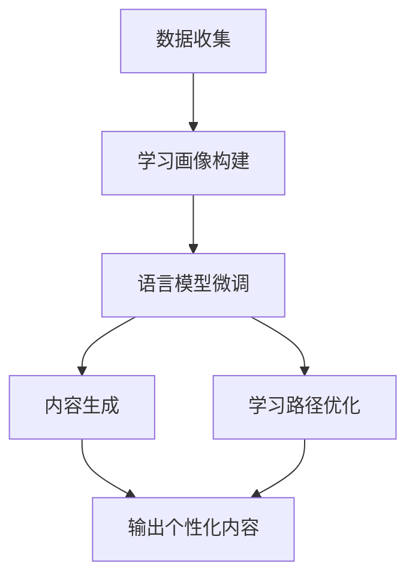

# 语言模型在个性化教育内容生成与学习路径优化中的创新

> 关键词：语言模型、个性化教育、内容生成、学习路径优化、教育创新

> 摘要：本文聚焦于语言模型在个性化教育领域的创新应用。首先阐述了语言模型在教育场景中的背景和重要性，详细介绍了相关核心概念及它们之间的联系。接着深入剖析了语言模型用于内容生成和学习路径优化的核心算法原理，并结合Python代码进行说明。同时，给出了相关的数学模型和公式，通过实际案例进行详细讲解。在项目实战部分，展示了如何搭建开发环境、实现代码并进行解读。此外，探讨了语言模型在个性化教育中的实际应用场景，推荐了相关的学习资源、开发工具和论文著作。最后，总结了语言模型在个性化教育中的未来发展趋势与挑战，并对常见问题进行了解答。

## 1. 背景介绍 

### 1.1 目的和范围
在当今教育领域，追求个性化教育已成为重要趋势。传统的教育模式往往采用“一刀切”的方式，难以满足每个学生的独特需求。语言模型的出现为解决这一问题提供了新的契机。本文章的目的在于深入探讨语言模型如何应用于个性化教育内容生成与学习路径优化，详细分析其技术原理、实现方法以及实际应用效果。范围涵盖了语言模型的基本概念、相关算法、数学模型，以及在实际教育场景中的项目实战和应用案例等方面。

### 1.2 预期读者
本文预期读者包括教育技术领域的研究者、开发人员，希望借助技术提升教学效果的教育工作者，以及对人工智能在教育领域应用感兴趣的学习者。这些读者可能具备不同程度的技术和教育背景，本文将尽量以通俗易懂的方式呈现复杂的技术内容，同时也会深入探讨相关的技术细节，以满足不同读者的需求。

### 1.3 文档结构概述
本文将按照以下结构进行组织：首先介绍背景知识，包括目的、预期读者和文档结构；接着阐述语言模型在个性化教育中的核心概念及其联系，并给出相应的示意图和流程图；然后详细讲解核心算法原理和具体操作步骤，通过Python代码进行说明；随后介绍相关的数学模型和公式，并举例说明；在项目实战部分，展示开发环境搭建、源代码实现和代码解读；之后探讨实际应用场景；再推荐相关的工具和资源；最后总结未来发展趋势与挑战，解答常见问题，并提供扩展阅读和参考资料。

### 1.4 术语表
#### 1.4.1 核心术语定义
- **语言模型**：是一种基于概率统计的模型，用于计算一个句子或一段文本出现的概率。它通过对大量文本数据的学习，能够预测下一个可能出现的单词或字符。
- **个性化教育**：根据每个学生的学习能力、兴趣爱好、学习进度等个性化特征，为其提供定制化的教育内容和学习方案。
- **内容生成**：利用语言模型自动创建符合特定要求的教育内容，如练习题、讲解文本、学习材料等。
- **学习路径优化**：根据学生的学习情况和目标，为其规划出最适合的学习顺序和学习内容，以提高学习效率和效果。

#### 1.4.2 相关概念解释
- **深度学习**：是机器学习的一个分支，通过构建多层神经网络来学习数据的复杂特征和模式。语言模型通常基于深度学习技术实现，如循环神经网络（RNN）、长短时记忆网络（LSTM）和Transformer架构等。
- **自然语言处理（NLP）**：是研究如何让计算机理解、处理和生成人类语言的技术领域。语言模型是NLP中的重要组成部分，用于解决文本生成、文本分类、机器翻译等任务。
- **知识图谱**：是一种以图的形式表示知识的方法，将实体和它们之间的关系进行可视化展示。在个性化教育中，知识图谱可以用于表示学科知识结构，为学习路径优化提供基础。

#### 1.4.3 缩略词列表
- **RNN**：Recurrent Neural Network，循环神经网络
- **LSTM**：Long Short-Term Memory，长短时记忆网络
- **NLP**：Natural Language Processing，自然语言处理
- **GPT**：Generative Pretrained Transformer，生成式预训练变换器

## 2. 核心概念与联系 

### 核心概念原理
#### 语言模型原理
语言模型的核心目标是计算一个序列 $w_1, w_2, \cdots, w_n$ 的概率 $P(w_1, w_2, \cdots, w_n)$。在实际应用中，通常采用链式法则将其分解为条件概率的乘积：
$$P(w_1, w_2, \cdots, w_n) = \prod_{i=1}^{n} P(w_i | w_1, w_2, \cdots, w_{i-1})$$

早期的语言模型基于统计方法，如n-gram模型，它假设当前单词的出现只依赖于前 $n-1$ 个单词。例如，在一个2-gram（bigram）模型中，$P(w_i | w_1, w_2, \cdots, w_{i-1}) \approx P(w_i | w_{i-1})$。

随着深度学习的发展，基于神经网络的语言模型逐渐成为主流。这些模型能够自动学习单词之间的复杂语义关系，如RNN、LSTM和Transformer架构。以Transformer为例，它通过自注意力机制（Self-Attention）来捕捉序列中不同位置之间的依赖关系，从而更有效地建模长距离依赖。

#### 个性化教育原理
个性化教育的核心是根据学生的个体差异提供定制化的教育服务。这些个体差异包括学生的学习能力、知识水平、学习风格、兴趣爱好等。通过收集和分析学生的学习数据，如学习成绩、学习时间、练习错误率等，可以建立学生的学习画像。基于学习画像，为学生推荐适合的学习内容和学习路径，以提高学习效果和效率。

#### 内容生成原理
利用语言模型进行内容生成的基本思路是，给定一个输入提示（如主题、关键词等），语言模型根据其学习到的知识和模式，生成符合要求的文本内容。在个性化教育中，输入提示可以是学生的学习目标、当前知识水平等信息，语言模型可以生成相应的练习题、讲解文本、学习计划等。

#### 学习路径优化原理
学习路径优化的目标是为学生找到一条最优的学习路线，使学生能够在最短的时间内达到学习目标。这需要考虑多个因素，如知识的难易程度、知识之间的关联关系、学生的学习能力和兴趣等。通常可以借助知识图谱来表示学科知识结构，根据学生的学习画像和知识图谱，使用搜索算法（如A*算法）或强化学习算法来规划学习路径。

### 架构的文本示意图
```plaintext
个性化教育系统
|
|-- 数据收集模块
|   |-- 学生学习数据（成绩、时间、错误率等）
|   |-- 知识图谱数据
|
|-- 学习画像构建模块
|   |-- 根据学生学习数据构建学习画像
|
|-- 语言模型模块
|   |-- 预训练语言模型（如GPT）
|   |-- 微调（根据教育数据进行微调）
|
|-- 内容生成模块
|   |-- 根据学习画像和输入提示生成教育内容
|
|-- 学习路径优化模块
|   |-- 根据学习画像和知识图谱优化学习路径
|
|-- 输出模块
|   |-- 输出个性化教育内容和学习路径
```

### Mermaid流程图


## 3. 核心算法原理 & 具体操作步骤 

### 核心算法原理
#### 语言模型训练算法
以Transformer架构的语言模型为例，其训练过程主要包括预训练和微调两个阶段。

**预训练阶段**：使用大规模的无监督文本数据进行训练，目标是学习语言的通用模式和语义信息。通常采用的损失函数是交叉熵损失，用于衡量模型预测的单词概率分布与真实单词的差异。假设输入序列为 $x = [x_1, x_2, \cdots, x_n]$，模型预测的下一个单词概率分布为 $\hat{y}$，真实单词的标签为 $y$，则交叉熵损失函数定义为：
$$L_{CE} = - \sum_{i=1}^{V} y_i \log(\hat{y}_i)$$
其中 $V$ 是词汇表的大小。

在训练过程中，使用随机梯度下降（SGD）或其变种（如Adam）来更新模型的参数，以最小化损失函数。

**微调阶段**：在预训练的基础上，使用特定领域的有监督数据进行微调，以适应个性化教育的需求。微调的损失函数可以根据具体任务进行设计，如分类任务使用交叉熵损失，回归任务使用均方误差损失。

#### 内容生成算法
内容生成通常采用贪心搜索、束搜索或采样等方法。

**贪心搜索**：在每个时间步，选择概率最大的单词作为输出。这种方法简单高效，但可能会导致生成的文本缺乏多样性。

**束搜索**：在每个时间步，保留概率最大的 $k$ 个候选单词（$k$ 称为束宽），并继续扩展这些候选单词，直到生成完整的文本。束搜索可以在一定程度上提高生成文本的质量，但计算复杂度较高。

**采样**：根据模型预测的单词概率分布进行采样，选择一个单词作为输出。这种方法可以增加生成文本的多样性，但可能会生成一些不合理的文本。

#### 学习路径优化算法
学习路径优化可以使用搜索算法或强化学习算法。

**搜索算法**：如A*算法，通过定义启发式函数来评估每个节点到目标节点的代价，从而找到最优的学习路径。启发式函数可以考虑知识的难易程度、知识之间的关联关系等因素。

**强化学习算法**：将学习路径优化问题看作一个马尔可夫决策过程（MDP），通过智能体与环境的交互来学习最优的学习策略。智能体根据当前的学习状态选择一个学习动作（如学习某个知识点），环境根据智能体的动作给出奖励信号，智能体通过不断调整策略来最大化累积奖励。

### 具体操作步骤
#### 语言模型训练步骤
1. **数据准备**：收集大规模的无监督文本数据和特定领域的有监督数据。对数据进行预处理，如分词、去除停用词、构建词汇表等。
2. **模型初始化**：选择合适的Transformer架构，如GPT、BERT等，并初始化模型的参数。
3. **预训练**：使用无监督文本数据对模型进行预训练，设置合适的学习率、批次大小等超参数，进行多轮训练。
4. **微调**：使用特定领域的有监督数据对预训练模型进行微调，根据具体任务调整损失函数和超参数。
5. **模型评估**：使用验证集对微调后的模型进行评估，选择性能最佳的模型。

#### 内容生成步骤
1. **输入提示**：给定一个输入提示，如学习目标、主题关键词等。
2. **模型推理**：将输入提示输入到训练好的语言模型中，根据选择的生成算法（如贪心搜索、束搜索或采样）生成文本。
3. **后处理**：对生成的文本进行后处理，如去除重复单词、调整语法错误等。

#### 学习路径优化步骤
1. **构建知识图谱**：收集学科知识信息，构建知识图谱，定义知识点之间的关联关系和难易程度。
2. **获取学习画像**：根据学生的学习数据构建学习画像，了解学生的知识水平、学习能力和兴趣爱好。
3. **路径规划**：根据学习画像和知识图谱，使用搜索算法或强化学习算法规划学习路径。
4. **路径评估**：对规划的学习路径进行评估，根据学习效果和效率等指标进行调整。

### Python源代码详细阐述
以下是一个简单的基于PyTorch和Hugging Face Transformers库的语言模型内容生成示例：

```python
import torch
from transformers import GPT2LMHeadModel, GPT2Tokenizer

# 加载预训练的GPT-2模型和分词器
tokenizer = GPT2Tokenizer.from_pretrained('gpt2')
model = GPT2LMHeadModel.from_pretrained('gpt2')

# 输入提示
input_text = "请生成一篇关于数学学习的短文"
input_ids = tokenizer.encode(input_text, return_tensors='pt')

# 生成文本
output = model.generate(input_ids, max_length=200, num_beams=5, no_repeat_ngram_size=2, early_stopping=True)

# 解码输出
generated_text = tokenizer.decode(output[0], skip_special_tokens=True)

print(generated_text)
```

在上述代码中，首先加载了预训练的GPT-2模型和分词器。然后将输入提示进行编码，输入到模型中进行生成。使用 `generate` 方法时，设置了最大长度、束宽、避免重复的n-gram大小等参数。最后将生成的文本进行解码并输出。

## 4. 数学模型和公式 & 详细讲解 & 举例说明 

### 语言模型概率计算
如前面所述，语言模型的核心是计算一个序列 $w_1, w_2, \cdots, w_n$ 的概率 $P(w_1, w_2, \cdots, w_n)$，通过链式法则分解为条件概率的乘积：
$$P(w_1, w_2, \cdots, w_n) = \prod_{i=1}^{n} P(w_i | w_1, w_2, \cdots, w_{i-1})$$

例如，对于句子 “I love programming”，其概率可以表示为：
$$P(\text{I}, \text{love}, \text{programming}) = P(\text{I}) \times P(\text{love} | \text{I}) \times P(\text{programming} | \text{I}, \text{love})$$

### 交叉熵损失函数
在语言模型训练中，交叉熵损失函数用于衡量模型预测的单词概率分布与真实单词的差异。假设模型预测的下一个单词概率分布为 $\hat{y} = [\hat{y}_1, \hat{y}_2, \cdots, \hat{y}_V]$，真实单词的标签为 $y = [y_1, y_2, \cdots, y_V]$，其中 $y_i$ 是一个one-hot向量，只有真实单词对应的位置为1，其余位置为0，则交叉熵损失函数定义为：
$$L_{CE} = - \sum_{i=1}^{V} y_i \log(\hat{y}_i)$$

例如，假设词汇表大小 $V = 5$，模型预测的概率分布为 $\hat{y} = [0.1, 0.2, 0.3, 0.2, 0.2]$，真实单词的标签为 $y = [0, 0, 1, 0, 0]$，则交叉熵损失为：
$$L_{CE} = - (0 \times \log(0.1) + 0 \times \log(0.2) + 1 \times \log(0.3) + 0 \times \log(0.2) + 0 \times \log(0.2)) \approx 1.204$$

### 学习路径优化的启发式函数
在使用A*算法进行学习路径优化时，需要定义启发式函数 $h(n)$ 来评估节点 $n$ 到目标节点的代价。一种简单的启发式函数可以考虑知识点的难易程度和与目标知识点的距离。

假设知识点 $n$ 的难易程度为 $d(n)$，与目标知识点的距离为 $dist(n)$，则启发式函数可以定义为：
$$h(n) = \alpha \times d(n) + \beta \times dist(n)$$
其中 $\alpha$ 和 $\beta$ 是权重系数，用于调整难易程度和距离的影响。

例如，假设有三个知识点 $A$、$B$、$C$，目标知识点为 $C$。知识点 $A$ 的难易程度 $d(A) = 2$，与 $C$ 的距离 $dist(A) = 3$；知识点 $B$ 的难易程度 $d(B) = 3$，与 $C$ 的距离 $dist(B) = 2$。设 $\alpha = 0.5$，$\beta = 0.5$，则：
$$h(A) = 0.5 \times 2 + 0.5 \times 3 = 2.5$$
$$h(B) = 0.5 \times 3 + 0.5 \times 2 = 2.5$$

在这种情况下，$A$ 和 $B$ 到目标节点的启发式代价相同，需要进一步考虑其他因素来选择下一个学习的知识点。

## 5. 项目实战：代码实际案例和详细解释说明 

### 5.1 开发环境搭建
#### 安装Python和pip
首先确保已经安装了Python 3.x版本，可以从Python官方网站（https://www.python.org/downloads/）下载并安装。安装完成后，pip（Python包管理工具）会自动安装。

#### 安装必要的库
使用pip安装以下必要的库：
```bash
pip install torch transformers pandas numpy
```
- `torch`：PyTorch深度学习框架，用于构建和训练神经网络。
- `transformers`：Hugging Face的Transformers库，提供了预训练的语言模型和相关工具。
- `pandas`：用于数据处理和分析。
- `numpy`：用于数值计算。

### 5.2 源代码详细实现和代码解读
以下是一个完整的项目实战示例，实现了基于语言模型的个性化教育内容生成和学习路径优化：

```python
import torch
from transformers import GPT2LMHeadModel, GPT2Tokenizer
import pandas as pd
import numpy as np

# 加载预训练的GPT-2模型和分词器
tokenizer = GPT2Tokenizer.from_pretrained('gpt2')
model = GPT2LMHeadModel.from_pretrained('gpt2')

# 定义学生学习画像类
class StudentProfile:
    def __init__(self, name, knowledge_level, interests):
        self.name = name
        self.knowledge_level = knowledge_level
        self.interests = interests

    def get_profile_info(self):
        return f"学生姓名: {self.name}, 知识水平: {self.knowledge_level}, 兴趣爱好: {', '.join(self.interests)}"

# 定义知识图谱类
class KnowledgeGraph:
    def __init__(self, data_file):
        self.data = pd.read_csv(data_file)

    def get_related_knowledge(self, topic):
        related_data = self.data[self.data['topic'] == topic]
        return related_data

# 定义内容生成函数
def generate_content(student_profile, topic):
    input_text = f"根据学生 {student_profile.name} 的知识水平 {student_profile.knowledge_level} 和兴趣爱好 {', '.join(student_profile.interests)}，生成一篇关于 {topic} 的学习材料"
    input_ids = tokenizer.encode(input_text, return_tensors='pt')
    output = model.generate(input_ids, max_length=300, num_beams=5, no_repeat_ngram_size=2, early_stopping=True)
    generated_text = tokenizer.decode(output[0], skip_special_tokens=True)
    return generated_text

# 定义学习路径优化函数（简单示例）
def optimize_learning_path(student_profile, knowledge_graph, target_topic):
    related_knowledge = knowledge_graph.get_related_knowledge(target_topic)
    # 简单假设根据知识难度和学生知识水平排序
    sorted_knowledge = related_knowledge.sort_values(by='difficulty')
    if student_profile.knowledge_level == '初级':
        learning_path = sorted_knowledge[sorted_knowledge['difficulty'] <= 2]
    elif student_profile.knowledge_level == '中级':
        learning_path = sorted_knowledge[(sorted_knowledge['difficulty'] > 2) & (sorted_knowledge['difficulty'] <= 4)]
    else:
        learning_path = sorted_knowledge[sorted_knowledge['difficulty'] > 4]
    return learning_path

# 主程序
if __name__ == "__main__":
    # 创建学生学习画像
    student = StudentProfile("张三", "中级", ["数学", "物理"])

    # 创建知识图谱
    knowledge_graph = KnowledgeGraph("knowledge_graph.csv")

    # 生成内容
    topic = "线性代数"
    content = generate_content(student, topic)
    print(f"生成的关于 {topic} 的学习材料:\n{content}")

    # 优化学习路径
    target_topic = "线性代数"
    learning_path = optimize_learning_path(student, knowledge_graph, target_topic)
    print(f"优化后的学习路径:\n{learning_path}")
```

### 5.3 代码解读与分析
#### 学生学习画像类 `StudentProfile`
该类用于存储学生的基本信息，包括姓名、知识水平和兴趣爱好。`get_profile_info` 方法用于返回学生的详细信息。

#### 知识图谱类 `KnowledgeGraph`
该类通过读取CSV文件来构建知识图谱。`get_related_knowledge` 方法用于根据给定的主题获取相关的知识信息。

#### 内容生成函数 `generate_content`
该函数根据学生的学习画像和主题生成学习材料。首先构建输入提示，然后将其输入到预训练的GPT-2模型中进行生成，最后将生成的文本进行解码并返回。

#### 学习路径优化函数 `optimize_learning_path`
该函数根据学生的学习画像和知识图谱，为学生优化学习路径。简单假设根据知识的难度和学生的知识水平进行排序，选择合适的知识点作为学习路径。

#### 主程序
在主程序中，首先创建了学生学习画像和知识图谱对象。然后调用 `generate_content` 函数生成关于线性代数的学习材料，并打印输出。最后调用 `optimize_learning_path` 函数优化学习路径，并打印输出。

## 6. 实际应用场景 
### 智能辅导系统
语言模型可以应用于智能辅导系统中，根据学生的学习情况和问题，实时生成个性化的解答和辅导内容。例如，当学生在做数学题时遇到困难，系统可以根据学生的知识水平和问题类型，生成详细的解题步骤和讲解，帮助学生理解和掌握知识。

### 自适应学习平台
在自适应学习平台中，语言模型可以根据学生的学习进度和表现，自动调整学习内容和难度。当学生在某个知识点上表现较好时，系统可以提供更高级的学习材料和挑战；当学生遇到困难时，系统可以提供更多的基础练习和讲解，以确保学生能够逐步掌握知识。

### 虚拟学习助手
虚拟学习助手可以利用语言模型与学生进行自然语言交互，回答学生的问题，提供学习建议和指导。例如，学生可以向虚拟学习助手询问学习方法、推荐学习资源等，助手可以根据学生的需求和学习画像，提供个性化的回答和建议。

### 在线课程开发
在在线课程开发中，语言模型可以帮助教师自动生成课程内容，如课程大纲、课件文本、练习题等。教师可以输入课程主题和要求，语言模型可以生成相应的内容，大大提高课程开发的效率。

## 7. 工具和资源推荐
### 7.1 学习资源推荐
#### 7.1.1 书籍推荐
- 《深度学习》（Deep Learning）：由Ian Goodfellow、Yoshua Bengio和Aaron Courville所著，是深度学习领域的经典教材，涵盖了神经网络、优化算法、深度学习应用等方面的内容。
- 《自然语言处理入门》：作者何晗，适合初学者快速入门自然语言处理领域，介绍了自然语言处理的基本概念、算法和应用。
- 《教育中的人工智能》：探讨了人工智能在教育领域的应用和发展趋势，包括个性化教育、智能辅导系统等方面的内容。

#### 7.1.2 在线课程
- Coursera上的“深度学习专项课程”（Deep Learning Specialization）：由Andrew Ng教授授课，系统地介绍了深度学习的理论和实践。
- edX上的“自然语言处理基础”（Foundations of Natural Language Processing）：提供了自然语言处理的基础知识和算法的讲解。
- 中国大学MOOC上的“人工智能与教育”：介绍了人工智能在教育领域的应用案例和技术原理。

#### 7.1.3 技术博客和网站
- Hugging Face博客（https://huggingface.co/blog）：提供了关于Transformer模型和自然语言处理的最新研究成果和应用案例。
- Medium上的“Towards Data Science”：有很多关于深度学习和自然语言处理的高质量文章。
- 机器之心（https://www.alienvault.com/）：专注于人工智能领域的技术资讯和研究成果分享。

### 7.2 开发工具框架推荐
#### 7.2.1 IDE和编辑器
- PyCharm：是一款专门为Python开发设计的集成开发环境（IDE），提供了代码编辑、调试、版本控制等功能。
- Jupyter Notebook：是一个交互式的开发环境，适合进行数据分析、模型训练和实验验证。
- Visual Studio Code：是一款轻量级的代码编辑器，支持多种编程语言和插件扩展，可用于Python开发和自然语言处理项目。

#### 7.2.2 调试和性能分析工具
- TensorBoard：是TensorFlow提供的可视化工具，可以用于监控模型训练过程中的损失函数、准确率等指标，以及可视化模型的结构和参数。
- Py-Spy：是一个Python性能分析工具，可以帮助开发者找出代码中的性能瓶颈。
- cProfile：是Python标准库中的性能分析模块，可以统计函数调用的时间和次数，帮助开发者优化代码性能。

#### 7.2.3 相关框架和库
- PyTorch：是一个开源的深度学习框架，提供了丰富的神经网络层和优化算法，易于使用和扩展。
- Hugging Face Transformers：是一个用于自然语言处理的开源库，提供了预训练的Transformer模型和相关工具，方便开发者进行文本生成、分类等任务。
- NLTK（Natural Language Toolkit）：是一个Python自然语言处理库，提供了丰富的语料库和工具，可用于文本处理、分词、词性标注等任务。

### 7.3 相关论文著作推荐
#### 7.3.1 经典论文
- “Attention Is All You Need”：提出了Transformer架构，是自然语言处理领域的里程碑式论文。
- “BERT: Pre-training of Deep Bidirectional Transformers for Language Understanding”：介绍了BERT模型，开创了预训练语言模型的先河。
- “Generative Pretrained Transformer 3 (GPT-3): Language Models are Few-Shot Learners”：介绍了GPT-3模型，展示了其强大的语言生成能力。

#### 7.3.2 最新研究成果
- 关注顶级学术会议如ACL（Association for Computational Linguistics）、EMNLP（Conference on Empirical Methods in Natural Language Processing）等的最新论文，了解语言模型在自然语言处理和个性化教育领域的最新研究进展。

#### 7.3.3 应用案例分析
- 可以查阅一些关于人工智能在教育领域应用的案例分析报告，了解语言模型在实际教育场景中的应用效果和挑战。

## 8. 总结：未来发展趋势与挑战
### 未来发展趋势
#### 更强大的语言模型
随着技术的不断进步，未来的语言模型将变得更加强大，能够处理更复杂的自然语言任务，生成更加高质量、个性化的教育内容。例如，模型可能会具备更好的常识推理能力和上下文理解能力，能够根据学生的具体情况提供更精准的学习建议。

#### 与其他技术的融合
语言模型将与计算机视觉、虚拟现实、增强现实等技术进行深度融合，为学生提供更加丰富、沉浸式的学习体验。例如，结合计算机视觉技术，语言模型可以对图像和视频进行理解和描述，为学生提供更直观的学习材料。

#### 教育数据的深度挖掘
通过对大量教育数据的深度挖掘，语言模型可以更好地了解学生的学习行为和需求，进一步优化个性化教育方案。例如，分析学生在学习过程中的情感变化、注意力分布等信息，为学生提供更贴心的学习支持。

### 挑战
#### 数据隐私和安全问题
在个性化教育中，需要收集和分析大量的学生学习数据，这涉及到学生的隐私和数据安全问题。如何确保数据的合法使用和保护学生的隐私是一个重要的挑战。

#### 模型的可解释性
语言模型通常是基于深度学习的黑盒模型，其决策过程难以解释。在教育领域，教师和学生需要了解模型为什么会提供这样的学习内容和建议，因此提高模型的可解释性是一个亟待解决的问题。

#### 教育理念的转变
引入语言模型进行个性化教育需要教育工作者转变传统的教育理念和教学方法。如何让教师和学生适应这种新的教育模式，充分发挥语言模型的优势，是一个需要面对的挑战。

## 9. 附录：常见问题与解答
### 语言模型生成的教育内容质量如何保证？
可以通过以下几种方式保证语言模型生成的教育内容质量：
- 使用高质量的训练数据：在预训练和微调阶段，使用专业的教育领域数据进行训练，提高模型对教育内容的理解和生成能力。
- 后处理和人工审核：对生成的内容进行后处理，如语法检查、逻辑推理等，同时安排专业的教育工作者进行人工审核，确保内容的准确性和适用性。
- 模型评估和优化：使用合适的评估指标对模型生成的内容进行评估，根据评估结果对模型进行优化和调整。

### 学习路径优化算法如何适应不同学生的需求？
学习路径优化算法可以通过以下方式适应不同学生的需求：
- 构建详细的学习画像：收集学生的多方面信息，如知识水平、学习能力、兴趣爱好等，构建全面的学习画像，为路径优化提供依据。
- 动态调整路径：根据学生的学习进度和表现，实时调整学习路径。当学生在某个知识点上遇到困难时，及时调整学习内容和顺序。
- 个性化的启发式函数：在搜索算法中，设计个性化的启发式函数，考虑学生的个体差异，如学习速度、兴趣偏好等，以找到更适合学生的学习路径。

### 语言模型在个性化教育中的应用成本高吗？
语言模型在个性化教育中的应用成本主要包括计算资源成本、数据收集和处理成本、模型训练和维护成本等。
- 计算资源成本：使用大规模的预训练语言模型需要强大的计算资源，如GPU集群。但随着云计算技术的发展，可以通过租赁云服务来降低计算成本。
- 数据收集和处理成本：收集和处理大量的教育数据需要一定的人力和物力成本。可以通过与教育机构合作、利用公开数据集等方式降低数据成本。
- 模型训练和维护成本：模型训练和维护需要专业的技术人员和时间成本。可以使用开源的模型和工具，减少开发和维护的难度和成本。

总体来说，随着技术的发展和成本的降低，语言模型在个性化教育中的应用成本将逐渐降低，具有良好的应用前景。

## 10. 扩展阅读 & 参考资料
- 《人工智能教育应用蓝皮书（2022）》
- “Learning to Generate Text with Human Feedback”，OpenAI的相关研究报告
- Hugging Face官方文档（https://huggingface.co/docs/transformers/index）
- 相关的学术期刊如《Journal of Educational Data Mining》《Artificial Intelligence in Education》等。

作者：AI天才研究院/AI Genius Institute & 禅与计算机程序设计艺术 /Zen And The Art of Computer Programming