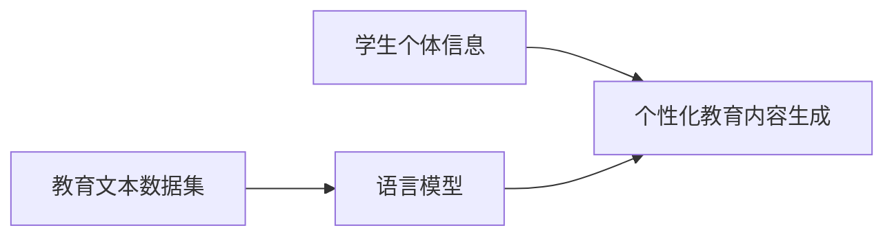

# 语言模型在个性化教育内容生成中的创新应用

> 关键词：语言模型、个性化教育、内容生成、创新应用、教育技术

> 摘要：本文聚焦于语言模型在个性化教育内容生成中的创新应用。随着人工智能技术的发展，语言模型展现出强大的文本生成能力。在教育领域，个性化教育是重要的发展方向，语言模型为其内容生成提供了新的途径和方法。文章深入探讨了语言模型的核心概念、算法原理，结合数学模型进行分析，并通过项目实战展示其在教育内容生成中的具体实现。同时，分析了实际应用场景，推荐了相关的学习资源、开发工具和论文著作。最后总结了未来的发展趋势与挑战，旨在为推动语言模型在个性化教育中的进一步应用提供参考。

## 1. 背景介绍 

### 1.1 目的和范围
本文章的目的在于全面探讨语言模型在个性化教育内容生成中的创新应用。随着教育信息化的推进，个性化教育越来越受到关注，而语言模型的出现为实现个性化教育内容的高效生成提供了可能。我们将研究语言模型的原理、算法以及如何将其应用于教育内容的个性化生成，包括练习题、讲解材料、学习计划等。范围涵盖了语言模型的基本概念、技术实现、实际应用案例以及未来发展趋势等方面。

### 1.2 预期读者
本文预期读者包括教育工作者，他们可以了解如何利用语言模型改进教学内容的设计和呈现，实现个性化教学；人工智能领域的研究人员和开发者，他们对语言模型的技术原理和应用拓展感兴趣；教育技术企业的从业者，希望通过引入语言模型提升产品的竞争力；以及对个性化教育和人工智能结合感兴趣的学生和爱好者。

### 1.3 文档结构概述
本文将按照以下结构进行阐述：首先介绍核心概念与联系，明确语言模型和个性化教育内容生成的基本概念和它们之间的关系；接着讲解核心算法原理和具体操作步骤，通过 Python 代码详细说明；然后介绍相关的数学模型和公式，并举例说明；之后通过项目实战展示代码的实际应用和详细解释；再分析实际应用场景；推荐相关的工具和资源；最后总结未来发展趋势与挑战，同时提供常见问题与解答和扩展阅读及参考资料。

### 1.4 术语表
#### 1.4.1 核心术语定义
- **语言模型**：是一种对自然语言文本进行建模的概率模型，它可以根据输入的文本预测下一个可能出现的词或序列，通过学习大量的文本数据来掌握语言的模式和规律。
- **个性化教育**：根据每个学生的学习能力、兴趣、学习进度等个体差异，为其提供定制化的教育内容和学习方案，以提高学习效果。
- **内容生成**：利用计算机技术自动创建各种类型的文本内容，如文章、故事、练习题等。

#### 1.4.2 相关概念解释
- **深度学习**：是机器学习的一个分支，通过构建多层神经网络来学习数据的复杂特征和模式，语言模型通常基于深度学习技术实现。
- **自然语言处理（NLP）**：是人工智能的一个重要领域，研究如何让计算机理解、处理和生成自然语言，语言模型是 NLP 中的核心技术之一。

#### 1.4.3 缩略词列表
- **NLP**：Natural Language Processing（自然语言处理）
- **RNN**：Recurrent Neural Network（循环神经网络）
- **LSTM**：Long Short - Term Memory（长短期记忆网络）
- **Transformer**：一种基于注意力机制的深度学习模型架构

## 2. 核心概念与联系 

### 语言模型的原理
语言模型的基本目标是计算一个句子或文本序列的概率。给定一个词序列 $w_1, w_2, \cdots, w_n$，语言模型要估计 $P(w_1, w_2, \cdots, w_n)$ 的值。根据链式法则，有：

$$P(w_1, w_2, \cdots, w_n) = P(w_1)P(w_2|w_1)P(w_3|w_1, w_2) \cdots P(w_n|w_1, w_2, \cdots, w_{n - 1})$$

早期的语言模型如 n - 元语法模型（n - gram），假设一个词的出现只依赖于它前面的 $n - 1$ 个词，即：

$$P(w_i|w_1, w_2, \cdots, w_{i - 1}) \approx P(w_i|w_{i - n + 1}, w_{i - n + 2}, \cdots, w_{i - 1})$$

随着深度学习的发展，基于神经网络的语言模型逐渐成为主流，如 RNN、LSTM 和 Transformer 等。这些模型可以更好地捕捉文本中的长距离依赖关系。

### 个性化教育内容生成的概念
个性化教育内容生成是指根据学生的个体特征，如学习目标、知识水平、学习风格、兴趣爱好等，生成适合该学生的教育内容。这些内容可以包括课程材料、练习题、辅导建议等。其核心是实现教育资源的定制化，以提高学生的学习效果和学习体验。

### 语言模型与个性化教育内容生成的联系
语言模型为个性化教育内容生成提供了强大的技术支持。通过对大量教育文本数据的学习，语言模型可以掌握教育领域的知识和语言模式。结合学生的个体信息，语言模型可以生成符合学生需求的教育内容。例如，根据学生的薄弱知识点生成针对性的练习题，根据学生的学习风格生成不同风格的讲解材料等。

### 文本示意图
```plaintext
              个性化教育内容生成
                   |
                   | 结合学生个体信息
                   |
            语言模型
                   |
                   | 学习大量教育文本数据
                   |
         教育文本数据集
```

### Mermaid 流程图


## 3. 核心算法原理 & 具体操作步骤 

### 基于 Transformer 的语言模型原理
Transformer 是一种基于注意力机制的深度学习模型，它在语言处理任务中取得了巨大的成功。Transformer 主要由编码器和解码器组成，这里以解码器部分为例说明语言模型的工作原理。

解码器由多个相同的层堆叠而成，每层包含多头注意力机制和前馈神经网络。多头注意力机制允许模型在不同的表示子空间中关注输入序列的不同部分。

#### 多头注意力机制
多头注意力机制将输入序列的表示映射到多个低维子空间，每个子空间进行独立的注意力计算，最后将结果拼接并线性变换得到最终的输出。

具体步骤如下：
1. 输入序列的嵌入向量 $X$ 分别与三个权重矩阵 $W^Q$, $W^K$, $W^V$ 相乘，得到查询向量 $Q$、键向量 $K$ 和值向量 $V$。
2. 计算注意力分数：
$$Attention(Q, K, V) = softmax(\frac{QK^T}{\sqrt{d_k}})V$$
其中 $d_k$ 是查询和键向量的维度。
3. 多头注意力：
$$MultiHead(Q, K, V) = Concat(head_1, head_2, \cdots, head_h)W^O$$
其中 $head_i = Attention(QW_i^Q, KW_i^K, VW_i^V)$，$h$ 是头的数量，$W^O$ 是输出权重矩阵。

#### 前馈神经网络
在多头注意力机制之后，每个位置的输出通过一个前馈神经网络进行非线性变换：
$$FFN(x) = max(0, xW_1 + b_1)W_2 + b_2$$

### Python 代码实现
```python
import torch
import torch.nn as nn
import torch.nn.functional as F

class MultiHeadAttention(nn.Module):
    def __init__(self, input_dim, num_heads):
        super(MultiHeadAttention, self).__init__()
        self.input_dim = input_dim
        self.num_heads = num_heads
        self.head_dim = input_dim // num_heads

        self.qkv_proj = nn.Linear(input_dim, 3 * input_dim)
        self.out_proj = nn.Linear(input_dim, input_dim)

    def forward(self, x):
        batch_size, seq_len, input_dim = x.size()
        qkv = self.qkv_proj(x)
        q, k, v = qkv.chunk(3, dim=-1)

        q = q.view(batch_size, seq_len, self.num_heads, self.head_dim).transpose(1, 2)
        k = k.view(batch_size, seq_len, self.num_heads, self.head_dim).transpose(1, 2)
        v = v.view(batch_size, seq_len, self.num_heads, self.head_dim).transpose(1, 2)

        attn_scores = torch.matmul(q, k.transpose(-2, -1)) / (self.head_dim ** 0.5)
        attn_probs = F.softmax(attn_scores, dim=-1)
        attn_output = torch.matmul(attn_probs, v)

        attn_output = attn_output.transpose(1, 2).contiguous().view(batch_size, seq_len, input_dim)
        output = self.out_proj(attn_output)
        return output

class FeedForward(nn.Module):
    def __init__(self, input_dim, hidden_dim):
        super(FeedForward, self).__init__()
        self.fc1 = nn.Linear(input_dim, hidden_dim)
        self.fc2 = nn.Linear(hidden_dim, input_dim)

    def forward(self, x):
        x = F.relu(self.fc1(x))
        x = self.fc2(x)
        return x

class DecoderLayer(nn.Module):
    def __init__(self, input_dim, num_heads, hidden_dim):
        super(DecoderLayer, self).__init__()
        self.self_attn = MultiHeadAttention(input_dim, num_heads)
        self.feed_forward = FeedForward(input_dim, hidden_dim)
        self.norm1 = nn.LayerNorm(input_dim)
        self.norm2 = nn.LayerNorm(input_dim)

    def forward(self, x):
        attn_output = self.self_attn(x)
        x = self.norm1(x + attn_output)
        ff_output = self.feed_forward(x)
        x = self.norm2(x + ff_output)
        return x

class LanguageModel(nn.Module):
    def __init__(self, vocab_size, input_dim, num_heads, hidden_dim, num_layers):
        super(LanguageModel, self).__init__()
        self.embedding = nn.Embedding(vocab_size, input_dim)
        self.layers = nn.ModuleList([DecoderLayer(input_dim, num_heads, hidden_dim) for _ in range(num_layers)])
        self.fc = nn.Linear(input_dim, vocab_size)

    def forward(self, x):
        x = self.embedding(x)
        for layer in self.layers:
            x = layer(x)
        x = self.fc(x)
        return x
```

### 具体操作步骤
1. **数据准备**：收集大量的教育文本数据，并进行预处理，包括分词、构建词汇表等。
2. **模型训练**：使用准备好的数据对语言模型进行训练，优化模型的参数以最小化损失函数，如交叉熵损失。
3. **个性化信息收集**：收集学生的个体信息，如学习成绩、兴趣爱好等。
4. **内容生成**：根据学生的个体信息和训练好的语言模型，生成个性化的教育内容。

## 4. 数学模型和公式 & 详细讲解 & 举例说明 

### 语言模型的损失函数
在训练语言模型时，常用的损失函数是交叉熵损失。假设模型的输出是一个概率分布 $\hat{y}$，真实标签是 $y$，则交叉熵损失定义为：

$$L(y, \hat{y}) = - \sum_{i = 1}^{V} y_i \log(\hat{y}_i)$$

其中 $V$ 是词汇表的大小。在语言模型中，$y$ 是一个 one - hot 向量，表示真实的下一个词，$\hat{y}$ 是模型预测的下一个词的概率分布。

### 梯度下降优化算法
为了最小化损失函数，通常使用梯度下降优化算法。以随机梯度下降（SGD）为例，假设损失函数为 $L(\theta)$，其中 $\theta$ 是模型的参数。SGD 的更新公式为：

$$\theta_{t + 1} = \theta_t - \alpha \nabla L(\theta_t)$$

其中 $\alpha$ 是学习率，$\nabla L(\theta_t)$ 是损失函数在 $\theta_t$ 处的梯度。

### 举例说明
假设我们有一个简单的词汇表 $V = \{ "apple", "banana", "cherry" \}$，模型预测下一个词的概率分布为 $\hat{y} = [0.2, 0.7, 0.1]$，真实的下一个词是 "banana"，则 $y = [0, 1, 0]$。

交叉熵损失为：

$$L(y, \hat{y}) = - (0 \times \log(0.2) + 1 \times \log(0.7) + 0 \times \log(0.1)) \approx 0.357$$

假设模型的参数 $\theta$ 是一个标量，损失函数 $L(\theta) = \theta^2$，学习率 $\alpha = 0.1$。初始参数 $\theta_0 = 1$，则梯度 $\nabla L(\theta_0) = 2\theta_0 = 2$。

更新后的参数为：

$$\theta_1 = \theta_0 - \alpha \nabla L(\theta_0) = 1 - 0.1 \times 2 = 0.8$$

## 5. 项目实战：代码实际案例和详细解释说明 

### 5.1  开发环境搭建
#### 硬件环境
- 建议使用具有 GPU 的计算机，如 NVIDIA GPU，以加速模型的训练过程。
#### 软件环境
- **操作系统**：Linux 或 Windows
- **Python 版本**：Python 3.7 及以上
- **深度学习框架**：PyTorch
- **其他依赖库**：torchvision, numpy, pandas 等

可以使用以下命令安装所需的库：
```bash
pip install torch torchvision numpy pandas
```

### 5.2  源代码详细实现和代码解读
```python
import torch
import torch.nn as nn
import torch.optim as optim
from torch.utils.data import Dataset, DataLoader

# 定义数据集类
class EducationDataset(Dataset):
    def __init__(self, data):
        self.data = data

    def __len__(self):
        return len(self.data)

    def __getitem__(self, idx):
        return torch.tensor(self.data[idx][:-1]), torch.tensor(self.data[idx][1:])

# 定义训练函数
def train(model, dataloader, criterion, optimizer, epochs):
    model.train()
    for epoch in range(epochs):
        total_loss = 0
        for inputs, targets in dataloader:
            optimizer.zero_grad()
            outputs = model(inputs)
            loss = criterion(outputs.view(-1, outputs.size(-1)), targets.view(-1))
            loss.backward()
            optimizer.step()
            total_loss += loss.item()
        print(f'Epoch {epoch + 1}/{epochs}, Loss: {total_loss / len(dataloader)}')

# 生成个性化教育内容
def generate_content(model, input_text, max_length=50):
    model.eval()
    input_ids = [vocab[word] for word in input_text.split()]
    input_tensor = torch.tensor(input_ids).unsqueeze(0)
    generated = input_text
    with torch.no_grad():
        for _ in range(max_length):
            output = model(input_tensor)
            next_token = torch.argmax(output[:, -1, :], dim=-1).item()
            next_word = reverse_vocab[next_token]
            generated += ' ' + next_word
            input_ids.append(next_token)
            input_tensor = torch.tensor(input_ids).unsqueeze(0)
    return generated

# 示例数据
data = [
    "This is a math problem. Solve 2 + 3.",
    "Here is an English question. Translate 'apple' to Chinese."
]

# 构建词汇表
vocab = {}
reverse_vocab = {}
index = 0
for sentence in data:
    for word in sentence.split():
        if word not in vocab:
            vocab[word] = index
            reverse_vocab[index] = word
            index += 1

# 转换数据为索引序列
index_data = []
for sentence in data:
    index_sentence = [vocab[word] for word in sentence.split()]
    index_data.append(index_sentence)

# 创建数据集和数据加载器
dataset = EducationDataset(index_data)
dataloader = DataLoader(dataset, batch_size=1, shuffle=True)

# 初始化模型
vocab_size = len(vocab)
input_dim = 128
num_heads = 4
hidden_dim = 256
num_layers = 2
model = LanguageModel(vocab_size, input_dim, num_heads, hidden_dim, num_layers)

# 定义损失函数和优化器
criterion = nn.CrossEntropyLoss()
optimizer = optim.Adam(model.parameters(), lr=0.001)

# 训练模型
train(model, dataloader, criterion, optimizer, epochs=10)

# 生成个性化教育内容
input_text = "This is"
generated_content = generate_content(model, input_text)
print("Generated Content:", generated_content)
```

### 5.3  代码解读与分析
- **数据集类 `EducationDataset`**：继承自 `torch.utils.data.Dataset`，用于封装教育文本数据。`__len__` 方法返回数据集的大小，`__getitem__` 方法返回输入序列和对应的目标序列。
- **训练函数 `train`**：在每个 epoch 中，遍历数据加载器，计算模型的输出和损失，然后进行反向传播和参数更新。
- **生成函数 `generate_content`**：根据输入文本，模型不断预测下一个词，直到达到最大长度。
- **数据预处理**：构建词汇表，将文本数据转换为索引序列。
- **模型初始化**：初始化语言模型，定义损失函数和优化器。
- **训练和生成**：调用训练函数训练模型，然后使用生成函数生成个性化教育内容。

## 6. 实际应用场景 
### 个性化练习题生成
根据学生的学习情况和知识点掌握程度，语言模型可以生成针对性的练习题。例如，对于数学学科，如果学生在代数部分的知识点掌握较弱，语言模型可以生成大量的代数练习题，包括不同难度级别的方程求解、函数运算等题目。

### 学习材料定制
结合学生的学习风格和兴趣爱好，语言模型可以生成个性化的学习材料。对于喜欢故事的学生，在讲解历史知识时，可以将历史事件编成有趣的故事；对于喜欢图表的学生，可以生成带有图表和数据的学习材料。

### 智能辅导
在学生学习过程中，语言模型可以根据学生提出的问题，提供详细的解答和辅导建议。例如，当学生在学习物理时遇到某个概念理解困难，语言模型可以用通俗易懂的语言进行解释，并提供相关的示例和拓展内容。

### 学习计划制定
根据学生的学习目标和时间安排，语言模型可以生成个性化的学习计划。比如，学生希望在一个月内提高英语听力水平，语言模型可以制定每天的听力练习任务、学习资源推荐等。

## 7. 工具和资源推荐
### 7.1 学习资源推荐
#### 7.1.1 书籍推荐
- 《深度学习》（Deep Learning）：由 Ian Goodfellow、Yoshua Bengio 和 Aaron Courville 所著，全面介绍了深度学习的理论和实践。
- 《自然语言处理入门》：何晗著，适合初学者了解自然语言处理的基本概念和方法。
- 《教育中的人工智能》：探讨了人工智能在教育领域的应用和发展趋势。

#### 7.1.2 在线课程
- Coursera 上的 “Natural Language Processing Specialization”：由斯坦福大学教授授课，深入讲解自然语言处理的技术和应用。
- edX 上的 “Deep Learning for Natural Language Processing”：介绍深度学习在自然语言处理中的应用。
- 中国大学 MOOC 上的 “人工智能基础”：适合初学者了解人工智能的基本概念和方法。

#### 7.1.3 技术博客和网站
- Hugging Face Blog：提供了关于语言模型的最新研究成果和应用案例。
- Towards Data Science：有大量关于自然语言处理和人工智能的技术文章。
- 机器之心：关注人工智能领域的前沿动态和技术解读。

### 7.2 开发工具框架推荐
#### 7.2.1 IDE和编辑器
- PyCharm：功能强大的 Python 集成开发环境，支持代码调试、版本控制等功能。
- Jupyter Notebook：交互式的开发环境，适合进行数据探索和模型实验。
- Visual Studio Code：轻量级的代码编辑器，支持多种编程语言和插件扩展。

#### 7.2.2 调试和性能分析工具
- TensorBoard：用于可视化深度学习模型的训练过程和性能指标。
- PyTorch Profiler：可以分析 PyTorch 模型的性能瓶颈，帮助优化代码。
- cProfile：Python 内置的性能分析工具，用于分析代码的运行时间和调用次数。

#### 7.2.3 相关框架和库
- PyTorch：开源的深度学习框架，具有动态图特性，方便模型的开发和调试。
- Hugging Face Transformers：提供了预训练的语言模型和相关工具，方便进行自然语言处理任务。
- NLTK（Natural Language Toolkit）：用于自然语言处理的 Python 库，包含了各种文本处理工具和数据集。

### 7.3 相关论文著作推荐
#### 7.3.1 经典论文
- “Attention Is All You Need”：提出了 Transformer 模型架构，是自然语言处理领域的重要突破。
- “Long Short - Term Memory”：介绍了长短期记忆网络（LSTM），解决了循环神经网络中的梯度消失问题。
- “A Neural Probabilistic Language Model”：开创了基于神经网络的语言模型研究。

#### 7.3.2 最新研究成果
- 关注 arXiv 上关于自然语言处理和教育技术的最新论文，了解领域内的前沿研究动态。
- 阅读顶级学术会议如 ACL（Association for Computational Linguistics）、EMNLP（Conference on Empirical Methods in Natural Language Processing）上的论文。

#### 7.3.3 应用案例分析
- 查找关于语言模型在教育领域应用的案例研究报告，了解实际应用中的经验和挑战。
- 参考教育技术公司的技术博客和白皮书，获取实际应用的最佳实践。

## 8. 总结：未来发展趋势与挑战
### 未来发展趋势
- **更精准的个性化**：随着数据收集和分析技术的不断进步，语言模型将能够更精准地了解学生的个体差异，生成更加个性化的教育内容。
- **多模态融合**：结合图像、音频、视频等多模态信息，生成更加丰富多样的教育内容，提高学习的趣味性和效果。
- **智能教育生态系统**：语言模型将与其他教育技术如虚拟现实、增强现实等融合，构建智能教育生态系统，为学生提供全方位的学习体验。

### 挑战
- **数据隐私和安全**：在收集学生个体信息时，需要确保数据的隐私和安全，防止信息泄露。
- **模型解释性**：语言模型通常是黑盒模型，难以解释其决策过程和生成内容的依据，需要提高模型的解释性，以便教育工作者和学生理解。
- **教育伦理问题**：语言模型生成的内容可能存在偏见和错误信息，需要建立相应的伦理准则和审核机制，确保教育内容的质量和正确性。

## 9. 附录：常见问题与解答
### 问题 1：语言模型生成的教育内容质量如何保证？
解答：可以通过以下方法保证内容质量：一是使用高质量的训练数据，确保模型学习到正确的知识和语言模式；二是建立审核机制，对生成的内容进行人工审核；三是不断优化模型，提高其生成内容的准确性和逻辑性。

### 问题 2：如何收集学生的个体信息？
解答：可以通过问卷调查、学习平台记录、测试成绩等方式收集学生的个体信息。在收集过程中，要遵循相关的法律法规，确保学生的隐私安全。

### 问题 3：语言模型在教育中的应用是否会取代教师？
解答：不会。语言模型可以为教师提供辅助，生成个性化的教育内容，但教师在教育过程中具有不可替代的作用，如情感关怀、引导学生思考、组织课堂活动等。

### 问题 4：训练语言模型需要大量的计算资源，如何解决？
解答：可以使用云计算平台，如阿里云、腾讯云等，提供的 GPU 计算资源进行模型训练；也可以使用开源的分布式训练框架，如 Horovod，将训练任务分布到多个计算节点上。

## 10. 扩展阅读 & 参考资料
### 扩展阅读
- 《人工智能时代的教育革命》：探讨了人工智能对教育的深远影响和未来发展方向。
- 《未来学校：重新定义教育》：思考了在科技发展背景下学校和教育的变革。

### 参考资料
- Goodfellow, I., Bengio, Y., & Courville, A. (2016). Deep Learning. MIT Press.
- Vaswani, A., Shazeer, N., Parmar, N., Uszkoreit, J., Jones, L., Gomez, A. N.,... & Polosukhin, I. (2017). Attention is all you need. Advances in neural information processing systems, 5998 - 6008.
- Hochreiter, S., & Schmidhuber, J. (1997). Long short - term memory. Neural computation, 9(8), 1735 - 1780.

作者：AI天才研究院/AI Genius Institute & 禅与计算机程序设计艺术 /Zen And The Art of Computer Programming