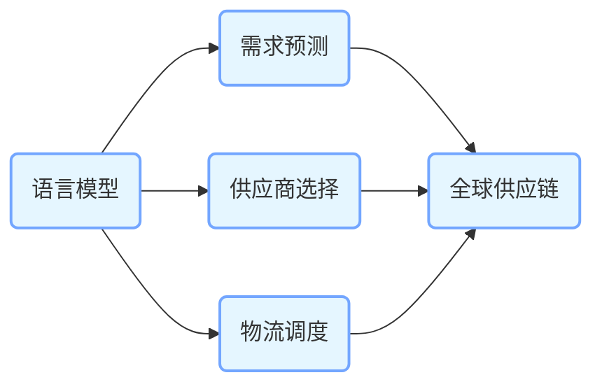

# 语言模型在全球供应链优化中的应用探索

> 关键词：语言模型、全球供应链优化、数据处理、需求预测、决策支持

> 摘要：本文聚焦于语言模型在全球供应链优化中的应用。首先介绍了相关背景，包括目的范围、预期读者等。接着阐述了语言模型和全球供应链的核心概念及联系，详细讲解了核心算法原理与操作步骤，并结合数学模型和公式进行说明。通过项目实战展示了具体代码实现和解读。分析了语言模型在全球供应链中的实际应用场景，推荐了学习资源、开发工具和相关论文著作。最后总结了未来发展趋势与挑战，解答常见问题并提供扩展阅读与参考资料，旨在为相关领域的研究和实践提供全面的指导。

## 1. 背景介绍 
### 1.1 目的和范围
全球供应链是一个复杂的网络，涉及原材料采购、生产制造、物流配送、销售等多个环节，其优化对于企业降低成本、提高效率、增强竞争力至关重要。随着信息技术的发展，语言模型作为一种强大的人工智能工具，逐渐展现出在全球供应链优化中的巨大潜力。本文的目的在于深入探索语言模型在全球供应链各个环节中的应用方式、效果和挑战，范围涵盖需求预测、供应商选择、物流调度、风险管理等多个关键领域。

### 1.2 预期读者
本文预期读者包括供应链管理领域的从业者，如供应链经理、物流专员等，他们可以从文中了解语言模型如何应用于实际工作，以提升供应链的运营效率；人工智能领域的研究人员和开发者，能够从中获取将语言模型应用于供应链场景的思路和方法；以及对供应链和人工智能交叉领域感兴趣的学者和学生，为他们的研究和学习提供参考。

### 1.3 文档结构概述
本文首先介绍了背景信息，为后续内容奠定基础。接着阐述核心概念，包括语言模型和全球供应链的原理及联系。然后详细讲解核心算法原理和操作步骤，用数学模型和公式进行深入分析。通过项目实战展示代码实现和解读。分析实际应用场景，为读者提供实践指导。推荐相关工具和资源，帮助读者进一步学习和研究。最后总结未来发展趋势与挑战，解答常见问题并提供扩展阅读和参考资料。

### 1.4 术语表
#### 1.4.1 核心术语定义
- **语言模型**：是一种基于概率统计或深度学习的模型，用于预测文本序列中每个词出现的概率，能够理解和生成自然语言文本。
- **全球供应链**：是指在全球范围内，将产品或服务从原材料供应端到最终消费端的整个过程所涉及的所有企业、组织和活动的网络。
- **需求预测**：根据历史数据、市场趋势等信息，对未来产品或服务的需求进行估计和预测。
- **供应商选择**：从众多潜在供应商中挑选出最适合企业需求的供应商的过程。

#### 1.4.2 相关概念解释
- **自然语言处理（NLP）**：是人工智能的一个分支，研究如何让计算机理解、处理和生成自然语言，语言模型是NLP的重要基础。
- **供应链协同**：供应链中各成员企业之间通过信息共享、流程协同等方式，实现整体效益最大化的过程。

#### 1.4.3 缩略词列表
- **NLP**：Natural Language Processing（自然语言处理）
- **AI**：Artificial Intelligence（人工智能）
- **ML**：Machine Learning（机器学习）

## 2. 核心概念与联系 
### 2.1 语言模型原理
语言模型的核心目标是学习语言的统计规律，从而能够预测给定上下文下下一个词出现的概率。早期的语言模型基于统计方法，如n-gram模型，它假设一个词的出现只与前面的n-1个词有关。例如，在一个2-gram（即bigram）模型中，计算$P(w_i|w_{i - 1})$，其中$w_i$表示第i个词，$w_{i - 1}$表示前一个词。

现代的语言模型大多基于深度学习，如Transformer架构的模型（如GPT、BERT等）。Transformer模型通过多头自注意力机制，能够捕捉文本中不同位置之间的依赖关系，从而更好地理解文本的语义信息。

以下是语言模型的简单文本示意图：

```plaintext
输入文本 -> 嵌入层 -> 编码层（多头自注意力等） -> 解码层 -> 输出概率分布
```

### 2.2 全球供应链架构
全球供应链架构包括供应商、制造商、物流商、零售商和消费者等多个环节。原材料从供应商流向制造商进行生产加工，制成品通过物流商运输到零售商，最终到达消费者手中。同时，供应链中还涉及信息流和资金流的传递。

以下是全球供应链的简单文本示意图：

```plaintext
供应商 -> 制造商 -> 物流商 -> 零售商 -> 消费者
信息流 <------------------------------
资金流 <------------------------------
```

### 2.3 语言模型与全球供应链的联系
语言模型可以在全球供应链的多个环节发挥作用。在需求预测方面，语言模型可以分析社交媒体、新闻报道等文本数据，挖掘消费者的需求趋势和偏好，从而提高需求预测的准确性。在供应商选择中，语言模型可以处理供应商的产品描述、评价等文本信息，帮助企业筛选出合适的供应商。在物流调度中，语言模型可以理解物流单据、运输指令等文本内容，优化运输路线和配送计划。

以下是语言模型与全球供应链联系的Mermaid流程图：



## 3. 核心算法原理 & 具体操作步骤 
### 3.1 基于语言模型的需求预测算法原理
我们以一个简单的基于语言模型的需求预测算法为例进行讲解。假设我们使用一个预训练的语言模型（如BERT）来处理文本数据，然后将处理后的特征输入到一个全连接神经网络中进行需求预测。

以下是Python代码实现：

```python
import torch
import torch.nn as nn
from transformers import BertModel, BertTokenizer

# 加载预训练的BERT模型和分词器
tokenizer = BertTokenizer.from_pretrained('bert-base-uncased')
bert_model = BertModel.from_pretrained('bert-base-uncased')

# 定义需求预测模型
class DemandPredictionModel(nn.Module):
    def __init__(self):
        super(DemandPredictionModel, self).__init__()
        self.bert = bert_model
        self.fc = nn.Linear(768, 1)  # 768是BERT模型的输出维度

    def forward(self, input_ids, attention_mask):
        outputs = self.bert(input_ids=input_ids, attention_mask=attention_mask)
        pooled_output = outputs.pooler_output
        prediction = self.fc(pooled_output)
        return prediction

# 初始化模型
model = DemandPredictionModel()

# 准备数据
text = "消费者对这款产品的需求持续增长"
inputs = tokenizer(text, return_tensors='pt')
input_ids = inputs['input_ids']
attention_mask = inputs['attention_mask']

# 进行预测
with torch.no_grad():
    prediction = model(input_ids, attention_mask)
    print("预测的需求值:", prediction.item())
```

### 3.2 具体操作步骤
1. **数据收集**：收集与需求相关的文本数据，如社交媒体评论、市场调研报告等。
2. **数据预处理**：使用分词器对文本数据进行分词，并将其转换为模型可以接受的输入格式，如将文本转换为词向量。
3. **模型训练**：使用收集到的数据对需求预测模型进行训练，调整模型的参数以最小化预测误差。
4. **模型评估**：使用测试数据对训练好的模型进行评估，计算模型的准确率、均方误差等指标。
5. **预测应用**：使用训练好的模型对未来的需求进行预测。

## 4. 数学模型和公式 & 详细讲解 & 举例说明 
### 4.1 语言模型的概率公式
在n-gram模型中，一个长度为T的文本序列$w_1, w_2, \cdots, w_T$的概率可以表示为：

$$P(w_1, w_2, \cdots, w_T) = \prod_{i = 1}^{T} P(w_i|w_{i - n + 1}, \cdots, w_{i - 1})$$

例如，在一个bigram模型中，对于文本序列“我爱中国”，其概率为：

$$P(我, 爱, 中, 国) = P(我) \times P(爱|我) \times P(中|爱) \times P(国|中)$$

### 4.2 需求预测的数学模型
假设我们使用线性回归模型进行需求预测，输入特征为$x_1, x_2, \cdots, x_n$，需求预测值为$y$，则线性回归模型可以表示为：

$$y = \theta_0 + \theta_1 x_1 + \theta_2 x_2 + \cdots + \theta_n x_n + \epsilon$$

其中，$\theta_0, \theta_1, \cdots, \theta_n$是模型的参数，$\epsilon$是误差项。

在基于语言模型的需求预测中，$x_i$可以是语言模型输出的特征向量。

例如，假设我们使用一个简单的一维特征$x$进行需求预测，线性回归模型为$y = 2x + 3$。如果输入特征$x = 5$，则预测的需求值$y = 2 \times 5 + 3 = 13$。

## 5. 项目实战：代码实际案例和详细解释说明 
### 5.1  开发环境搭建
1. **安装Python**：建议使用Python 3.7及以上版本。
2. **安装深度学习框架**：安装PyTorch和Transformers库，可以使用以下命令：
```bash
pip install torch
pip install transformers
```
3. **安装其他依赖库**：根据具体需求安装numpy、pandas等库。

### 5.2  源代码详细实现和代码解读
以下是一个完整的基于语言模型的供应商评价项目的代码示例：

```python
import torch
import torch.nn as nn
from transformers import BertModel, BertTokenizer
import pandas as pd
from sklearn.model_selection import train_test_split
from torch.utils.data import Dataset, DataLoader

# 定义数据集类
class SupplierDataset(Dataset):
    def __init__(self, texts, labels, tokenizer, max_length):
        self.texts = texts
        self.labels = labels
        self.tokenizer = tokenizer
        self.max_length = max_length

    def __len__(self):
        return len(self.texts)

    def __getitem__(self, idx):
        text = str(self.texts[idx])
        label = self.labels[idx]
        inputs = self.tokenizer.encode_plus(
            text,
            add_special_tokens=True,
            max_length=self.max_length,
            padding='max_length',
            truncation=True,
            return_tensors='pt'
        )
        input_ids = inputs['input_ids'].flatten()
        attention_mask = inputs['attention_mask'].flatten()
        return {
            'input_ids': input_ids,
            'attention_mask': attention_mask,
            'labels': torch.tensor(label, dtype=torch.float32)
        }

# 定义供应商评价模型
class SupplierEvaluationModel(nn.Module):
    def __init__(self):
        super(SupplierEvaluationModel, self).__init__()
        self.bert = BertModel.from_pretrained('bert-base-uncased')
        self.fc = nn.Linear(768, 1)

    def forward(self, input_ids, attention_mask):
        outputs = self.bert(input_ids=input_ids, attention_mask=attention_mask)
        pooled_output = outputs.pooler_output
        prediction = self.fc(pooled_output)
        return prediction

# 数据加载和预处理
data = pd.read_csv('supplier_data.csv')
texts = data['description'].tolist()
labels = data['rating'].tolist()

train_texts, test_texts, train_labels, test_labels = train_test_split(texts, labels, test_size=0.2, random_state=42)

tokenizer = BertTokenizer.from_pretrained('bert-base-uncased')
max_length = 128

train_dataset = SupplierDataset(train_texts, train_labels, tokenizer, max_length)
test_dataset = SupplierDataset(test_texts, test_labels, tokenizer, max_length)

train_dataloader = DataLoader(train_dataset, batch_size=16, shuffle=True)
test_dataloader = DataLoader(test_dataset, batch_size=16, shuffle=False)

# 初始化模型和优化器
model = SupplierEvaluationModel()
optimizer = torch.optim.Adam(model.parameters(), lr=2e-5)

# 训练模型
device = torch.device('cuda' if torch.cuda.is_available() else 'cpu')
model.to(device)

num_epochs = 3
for epoch in range(num_epochs):
    model.train()
    total_loss = 0
    for batch in train_dataloader:
        input_ids = batch['input_ids'].to(device)
        attention_mask = batch['attention_mask'].to(device)
        labels = batch['labels'].to(device)

        optimizer.zero_grad()
        outputs = model(input_ids, attention_mask)
        loss = nn.MSELoss()(outputs.squeeze(), labels)
        loss.backward()
        optimizer.step()
        total_loss += loss.item()

    print(f'Epoch {epoch + 1}, Loss: {total_loss / len(train_dataloader)}')

# 评估模型
model.eval()
total_test_loss = 0
with torch.no_grad():
    for batch in test_dataloader:
        input_ids = batch['input_ids'].to(device)
        attention_mask = batch['attention_mask'].to(device)
        labels = batch['labels'].to(device)

        outputs = model(input_ids, attention_mask)
        loss = nn.MSELoss()(outputs.squeeze(), labels)
        total_test_loss += loss.item()

print(f'Test Loss: {total_test_loss / len(test_dataloader)}')
```

### 5.3  代码解读与分析
1. **数据集类**：`SupplierDataset`类用于处理数据集，将文本数据转换为模型可以接受的输入格式。
2. **模型定义**：`SupplierEvaluationModel`类基于BERT模型构建，通过全连接层输出供应商的评价得分。
3. **数据加载和预处理**：使用`pandas`读取数据集，将数据分为训练集和测试集，使用`DataLoader`加载数据。
4. **模型训练**：使用Adam优化器和均方误差损失函数对模型进行训练，训练多个epoch。
5. **模型评估**：在测试集上评估模型的性能，计算测试损失。

## 6. 实际应用场景 
### 6.1 需求预测
语言模型可以分析社交媒体、新闻报道、行业论坛等文本数据，挖掘消费者的需求趋势和偏好。例如，通过分析消费者在社交媒体上对某类产品的讨论热度和评价，预测该产品未来的需求变化。同时，语言模型还可以处理市场调研报告、销售数据等文本信息，结合历史数据进行更准确的需求预测。

### 6.2 供应商选择
在供应商选择过程中，语言模型可以处理供应商的产品描述、资质证书、客户评价等文本信息。通过对这些文本的分析，企业可以评估供应商的产品质量、服务水平、信誉度等指标，从而筛选出最合适的供应商。例如，对供应商的在线评价进行情感分析，了解其他客户对该供应商的满意度。

### 6.3 物流调度
语言模型可以理解物流单据、运输指令、天气预报等文本内容，优化运输路线和配送计划。例如，根据天气文本信息预测可能出现的恶劣天气，提前调整运输路线，避免货物延误。同时，语言模型还可以处理物流人员的沟通信息，提高物流协同效率。

### 6.4 风险管理
语言模型可以监测新闻报道、政策法规等文本信息，及时发现供应链中的潜在风险。例如，通过分析新闻报道中关于原材料供应地的政治局势、自然灾害等信息，评估原材料供应中断的风险。同时，语言模型还可以对企业内部的风险报告进行分析，提供风险预警和应对建议。

## 7. 工具和资源推荐
### 7.1 学习资源推荐
#### 7.1.1 书籍推荐
- 《自然语言处理入门》：介绍了自然语言处理的基本概念、算法和应用，适合初学者。
- 《深度学习》：详细讲解了深度学习的原理和方法，包括神经网络、卷积神经网络等。
- 《供应链管理：战略、规划与运营》：全面介绍了供应链管理的理论和实践，有助于理解全球供应链的架构和运作。

#### 7.1.2 在线课程
- Coursera上的“Natural Language Processing Specialization”：由知名教授授课，系统介绍自然语言处理的各个方面。
- edX上的“Supply Chain Analytics”：讲解供应链分析的方法和工具，结合实际案例进行教学。

#### 7.1.3 技术博客和网站
- Hugging Face Blog：提供关于语言模型的最新研究成果和应用案例。
- Supply Chain Dive：专注于供应链领域的新闻和分析，提供行业动态和趋势。

### 7.2 开发工具框架推荐
#### 7.2.1 IDE和编辑器
- PyCharm：功能强大的Python集成开发环境，提供代码编辑、调试、版本控制等功能。
- Jupyter Notebook：交互式开发环境，适合数据探索和模型实验。

#### 7.2.2 调试和性能分析工具
- TensorBoard：用于可视化深度学习模型的训练过程和性能指标。
- Py-Spy：用于分析Python代码的性能瓶颈。

#### 7.2.3 相关框架和库
- PyTorch：开源的深度学习框架，提供丰富的工具和接口，方便开发和训练语言模型。
- Transformers：Hugging Face开发的库，提供了预训练的语言模型和相关工具。

### 7.3 相关论文著作推荐
#### 7.3.1 经典论文
- “Attention Is All You Need”：介绍了Transformer架构，是现代语言模型的基础。
- “Supply Chain Coordination under Demand Uncertainty”：研究了需求不确定情况下的供应链协调问题。

#### 7.3.2 最新研究成果
- 关注顶级学术会议（如ACL、NeurIPS等）上关于语言模型和供应链优化的研究论文。
- 查阅知名学术期刊（如Journal of Supply Chain Management、Artificial Intelligence）上的相关文章。

#### 7.3.3 应用案例分析
- 参考行业报告和企业案例，了解语言模型在全球供应链优化中的实际应用效果和经验教训。

## 8. 总结：未来发展趋势与挑战
### 8.1 未来发展趋势
- **多模态融合**：语言模型将与图像、视频等多模态数据融合，更全面地理解供应链中的信息。例如，结合图像识别技术，对货物的外观和质量进行检测。
- **强化学习结合**：将语言模型与强化学习相结合，实现供应链的智能决策和动态优化。例如，通过强化学习算法自动调整物流调度策略。
- **边缘计算应用**：随着边缘计算技术的发展，语言模型可以在边缘设备上运行，实现实时的数据处理和决策，提高供应链的响应速度。

### 8.2 挑战
- **数据质量和安全**：语言模型的性能依赖于大量高质量的数据，但供应链数据往往存在不完整、不准确、不一致等问题。同时，供应链数据涉及企业的商业机密，数据安全和隐私保护是需要解决的重要问题。
- **模型可解释性**：深度学习语言模型通常是黑盒模型，难以解释其决策过程和结果。在供应链优化中，企业需要了解模型的决策依据，以便做出合理的决策。
- **跨领域知识融合**：语言模型在全球供应链优化中的应用需要结合自然语言处理、供应链管理、运筹学等多个领域的知识，对研究人员和开发者的综合素质要求较高。

## 9. 附录：常见问题与解答
### 9.1 语言模型在全球供应链优化中的准确率如何保证？
可以通过以下方法保证语言模型的准确率：
- **数据质量提升**：收集和整理高质量的供应链数据，进行数据清洗和预处理，去除噪声和错误数据。
- **模型选择和调优**：选择合适的语言模型，并对模型的参数进行调优，通过交叉验证等方法选择最优的模型。
- **集成学习**：结合多个语言模型的结果，通过集成学习的方法提高预测的准确率。

### 9.2 如何解决语言模型在供应链数据处理中的计算资源问题？
可以采用以下策略解决计算资源问题：
- **模型压缩**：使用模型剪枝、量化等技术对语言模型进行压缩，减少模型的参数数量和计算量。
- **分布式计算**：利用分布式计算框架，如Spark、Dask等，将数据和计算任务分布到多个节点上进行处理。
- **云服务**：使用云计算平台提供的计算资源，如Amazon Web Services、Google Cloud Platform等，按需使用计算资源。

### 9.3 语言模型在供应链风险管理中的应用效果如何评估？
可以从以下几个方面评估语言模型在供应链风险管理中的应用效果：
- **风险预警准确率**：计算语言模型正确预警风险事件的比例，评估其对风险的识别能力。
- **风险应对及时性**：评估语言模型提供风险应对建议的及时性，确保企业能够及时采取措施应对风险。
- **经济损失减少**：分析使用语言模型前后企业因供应链风险导致的经济损失变化，评估其对企业经济效益的影响。

## 10. 扩展阅读 & 参考资料
### 扩展阅读
- 《人工智能时代的供应链管理创新》
- 《语言模型在工业互联网中的应用探索》

### 参考资料
- [Hugging Face官方文档](https://huggingface.co/docs)
- [PyTorch官方文档](https://pytorch.org/docs/stable/index.html)
- [供应链管理协会官方网站](https://www.cscmp.org/)

作者：AI天才研究院/AI Genius Institute & 禅与计算机程序设计艺术 /Zen And The Art of Computer Programming